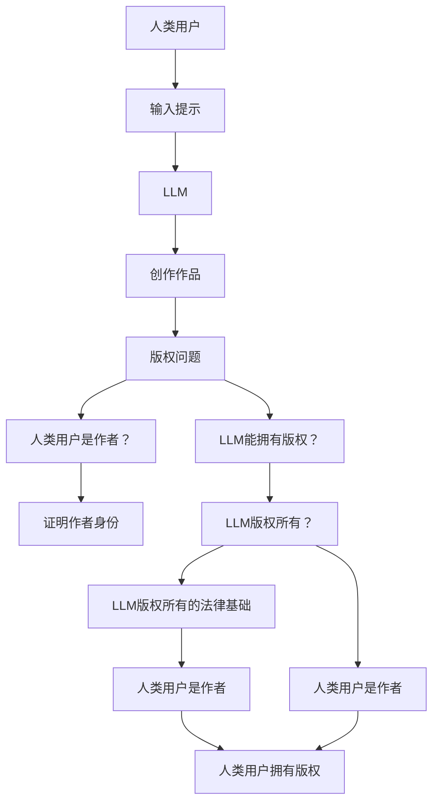

                 

**大语言模型（LLM）的版权问题：AI创作的法律挑战**

## 1. 背景介绍

随着大语言模型（LLM）的发展，AI创作正在各个领域崭露头角，从写作到作曲，再到绘画，AI正在改变我们理解和创作的方式。然而，与其并肩而行的，是版权和法律方面的挑战。本文将深入探讨LLM创作的版权问题，并提供一些可能的解决方案。

## 2. 核心概念与联系

### 2.1 版权保护的基础

版权保护的基础是《伯尔尼公约》和《世界知识产权组织版权条约》。根据这些条约，原创作品享有版权保护，作者有权控制其作品的复制、分发和衍生作品的创作。

### 2.2 LLM创作的版权问题

当LLM创作出作品时，版权问题变得模糊。谁是作品的作者？是人类用户还是LLM？如果是LLM，它能拥有版权吗？如果不是，人类用户如何证明他们是作品的作者？



## 3. 核心算法原理 & 具体操作步骤

### 3.1 算法原理概述

LLM创作的过程可以看作是一个生成模型的应用。给定一个提示，LLM基于其训练数据生成新的文本。这个过程可以用下面的公式表示：

$$P(x) = \prod_{i=1}^{n}P(x_i|x_{i-1})$$

其中，$x$是生成的文本，$x_i$是文本中的第$i$个单词，$P(x_i|x_{i-1})$是LLM预测下一个单词的概率分布。

### 3.2 算法步骤详解

1. **输入提示**：人类用户输入一个提示，作为LLM创作的起点。
2. **生成文本**：LLM基于其训练数据，预测并生成下一个单词，直到生成一段完整的文本。
3. **评估和调整**：人类用户评估生成的文本，并根据需要调整提示或参数，重复生成过程。

### 3.3 算法优缺点

**优点**：LLM可以创作出原创、连贯的文本，节省了人类用户的时间和精力。

**缺点**：LLM可能会生成不准确或不相关的文本，需要人类用户进行评估和调整。

### 3.4 算法应用领域

LLM创作的应用领域包括写作、作曲、绘画等各种创意领域。

## 4. 数学模型和公式 & 详细讲解 & 举例说明

### 4.1 数学模型构建

LLM的数学模型是一种深度学习模型，通常是一种变分自编码器（VAE）或转换器（Transformer）架构。这些模型学习输入数据（如文本）的分布，并能够生成新的、类似于输入数据的样本。

### 4.2 公式推导过程

LLM的训练过程可以表示为最大化以下目标函数：

$$\mathcal{L}(\theta) = \mathbb{E}_{x\sim p_{data}(x)}[\log p_{\theta}(x)]$$

其中，$p_{data}(x)$是输入数据的分布，$p_{\theta}(x)$是模型预测的分布，$\theta$是模型的参数。

### 4.3 案例分析与讲解

例如，假设我们想训练一个LLM来生成诗歌。我们的输入数据是一组诗歌，我们的目标是使模型学习诗歌的语言模式，并能够生成新的、类似于输入数据的诗歌。

## 5. 项目实践：代码实例和详细解释说明

### 5.1 开发环境搭建

要训练一个LLM，您需要一个具有GPU的计算机，以及安装了PyTorch或TensorFlow的Python环境。

### 5.2 源代码详细实现

以下是一个简单的LLM实现的伪代码：

```python
import torch
import torch.nn as nn

class LLM(nn.Module):
    def __init__(self, vocab_size, embedding_dim, hidden_dim, num_layers):
        super(LLM, self).__init__()
        self.embedding = nn.Embedding(vocab_size, embedding_dim)
        self.rnn = nn.LSTM(embedding_dim, hidden_dim, num_layers)
        self.fc = nn.Linear(hidden_dim, vocab_size)

    def forward(self, x):
        embedded = self.embedding(x)
        output, _ = self.rnn(embedded)
        output = self.fc(output)
        return output

# 训练模型
model = LLM(vocab_size, embedding_dim, hidden_dim, num_layers)
criterion = nn.CrossEntropyLoss()
optimizer = torch.optim.Adam(model.parameters())
for epoch in range(num_epochs):
    for i, (inputs, targets) in enumerate(train_loader):
        optimizer.zero_grad()
        outputs = model(inputs)
        loss = criterion(outputs.view(-1, vocab_size), targets.view(-1))
        loss.backward()
        optimizer.step()
```

### 5.3 代码解读与分析

这个简单的LLM实现使用了一个嵌入层、一个LSTM层和一个全连接层。输入数据通过嵌入层转换为嵌入向量，然后通过LSTM层传递，最后通过全连接层生成输出。

### 5.4 运行结果展示

在训练过程中，模型的损失应该下降，生成的文本应该变得更加连贯和相关。

## 6. 实际应用场景

### 6.1 当前应用

LLM当前正在各种创意领域得到应用，从写作到作曲，再到绘画。

### 6.2 未来应用展望

未来，LLM可能会被用于更复杂的任务，如自动驾驶或医学诊断。它们也可能会被用于创建更复杂的虚拟助手或聊天机器人。

## 7. 工具和资源推荐

### 7.1 学习资源推荐

- "Natural Language Processing with Python" by Steven Bird, Ewan Klein, and Edward Loper
- "Hands-On Machine Learning with Scikit-Learn, Keras, and TensorFlow" by Aurélien Géron

### 7.2 开发工具推荐

- PyTorch
- TensorFlow
- Hugging Face Transformers library

### 7.3 相关论文推荐

- "Attention is All You Need" by Vaswani et al.
- "BERT: Pre-training of Deep Bidirectional Transformers for Language Understanding" by Jacob Devlin and Ming-Wei Chang

## 8. 总结：未来发展趋势与挑战

### 8.1 研究成果总结

本文总结了LLM创作的版权问题，并提供了一些可能的解决方案。

### 8.2 未来发展趋势

未来，LLM可能会变得更大、更智能，能够处理更复杂的任务。

### 8.3 面临的挑战

版权问题是LLM创作面临的主要挑战之一。此外，LLM还面临着偏见、不准确性和解释性等挑战。

### 8.4 研究展望

未来的研究应该关注LLM创作的版权问题，以及如何使LLM更智能、更公平、更可解释。

## 9. 附录：常见问题与解答

### 9.1 如果LLM创作的作品没有人类用户的贡献，人类用户是否还能声称自己是作者？

根据当前的版权法，如果人类用户没有对LLM创作的作品做出实质性贡献，他们可能无法声称自己是作者。然而，这可能会随着法律的发展而改变。

### 9.2 如果LLM创作的作品侵犯了现有作品的版权，该怎么办？

如果LLM创作的作品侵犯了现有作品的版权，版权所有者可以采取法律行动，要求删除或禁用该作品。

## 作者：禅与计算机程序设计艺术 / Zen and the Art of Computer Programming

