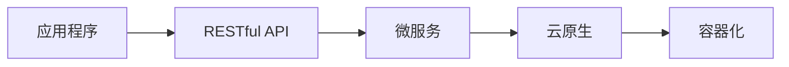

                 

## RESTful API设计：AI模型服务化的最佳实践

> 关键词：RESTful API, AI模型服务化, 微服务, 云原生, 容器化, 可扩展性, 可维护性

## 1. 背景介绍

随着人工智能（AI）技术的飞速发展，AI模型的应用已渗透到各行各业。然而，将AI模型集成到现有系统中往往面临着挑战，其中之一就是如何高效地提供AI模型服务。本文将介绍如何通过RESTful API设计实现AI模型服务化，以提高AI模型的可扩展性、可维护性和易用性。

## 2. 核心概念与联系

### 2.1 RESTful API

REST（Representational State Transfer）是一种设计网络服务的架构风格，它将资源作为信息的载体，使用HTTP方法（GET、POST、PUT、DELETE）对资源进行操作。RESTful API是基于REST架构风格设计的API，它简单、灵活，易于理解和使用。

### 2.2 微服务

微服务是一种架构风格，它将应用程序划分为一组小型、松耦合的服务，每个服务都有自己的数据库和业务逻辑。微服务架构有利于提高系统的可扩展性、可维护性和弹性。

### 2.3 云原生和容器化

云原生是指在云环境中构建、部署和管理应用程序的方法和最佳实践。容器化是云原生的关键组成部分，它将应用程序及其依赖项打包到容器中，从而实现应用程序的可移植性和一致性。

下图是RESTful API、微服务、云原生和容器化的关系示意图：


## 3. 核心算法原理 & 具体操作步骤

### 3.1 算法原理概述

AI模型服务化的核心是将AI模型封装为RESTful API，以便其他应用程序调用。这个过程涉及到将AI模型部署为服务，并设计API接口，使其能够接受请求并返回预测结果。

### 3.2 算法步骤详解

1. **模型训练和保存**：首先，使用合适的数据集训练AI模型，并保存模型参数。
2. **服务部署**：将模型部署为服务，可以使用云原生技术和容器化工具（如Kubernetes）实现。
3. **API设计**：设计API接口，定义请求和响应格式。通常，API接口会接受输入数据，并返回模型的预测结果。
4. **API实现**：实现API接口，使用框架（如Flask、Django）或语言特性（如Node.js）处理请求和响应。
5. **API测试**：测试API接口，确保其能够正确地接受请求并返回预期的结果。

### 3.3 算法优缺点

**优点**：

* 提高了AI模型的可扩展性，可以轻松地扩展服务以处理更多请求。
* 提高了AI模型的可维护性，可以独立地部署和管理模型服务。
* 提高了AI模型的易用性，其他应用程序可以轻松地集成AI模型服务。

**缺点**：

* 需要额外的开发工作来设计和实现API接口。
* 需要额外的资源来部署和管理模型服务。

### 3.4 算法应用领域

AI模型服务化可以应用于各种领域，例如：

* 图像和语音识别：提供API接口，接受图像或语音数据，并返回识别结果。
* 自然语言处理：提供API接口，接受文本数据，并返回分析结果（如情感分析、文本分类等）。
* 预测分析：提供API接口，接受数据，并返回模型的预测结果。

## 4. 数学模型和公式 & 详细讲解 & 举例说明

### 4.1 数学模型构建

AI模型通常是基于数学模型构建的。例如，神经网络模型可以表示为：

$$y = f(wx + b)$$

其中，$x$是输入数据，$w$和$b$是模型参数，$f$是激活函数，$y$是输出结果。

### 4.2 公式推导过程

模型参数$w$和$b$通常通过梯度下降算法进行优化。梯度下降算法的公式如下：

$$w := w - \eta \frac{\partial L}{\partial w}$$
$$b := b - \eta \frac{\partial L}{\partial b}$$

其中，$\eta$是学习率，$L$是损失函数。

### 4.3 案例分析与讲解

例如，假设我们要构建一个二分类神经网络模型，用于预测客户是否会流失。我们可以使用sigmoid激活函数和交叉熵损失函数。模型的公式如下：

$$y = \sigma(wx + b)$$
$$L = -\frac{1}{N}\sum_{i=1}^{N}[y_i \log(\hat{y}_i) + (1 - y_i) \log(1 - \hat{y}_i)]$$

其中，$\sigma$是sigmoid函数，$N$是样本数，$y_i$是真实标签，$\hat{y}_i$是模型预测的概率。

## 5. 项目实践：代码实例和详细解释说明

### 5.1 开发环境搭建

我们将使用Python和Flask框架来实现AI模型服务化。首先，安装必要的库：

```bash
pip install flask numpy tensorflow
```

### 5.2 源代码详细实现

以下是一个简单的示例，展示如何使用Flask实现AI模型服务化。我们将使用TensorFlow训练一个二分类神经网络模型，并将其部署为RESTful API。

```python
from flask import Flask, request, jsonify
import numpy as np
import tensorflow as tf

app = Flask(__name__)

# 加载模型
model = tf.keras.models.load_model('model.h5')

@app.route('/predict', methods=['POST'])
def predict():
    data = request.get_json()
    x = np.array(data['x'])
    y = model.predict(x)
    return jsonify({'y': y.tolist()})

if __name__ == '__main__':
    app.run(port=5000)
```

### 5.3 代码解读与分析

* 我们使用Flask框架创建了一个Web应用程序。
* 我们加载了之前训练好的模型。
* 我们定义了一个API接口`/predict`，接受POST请求，并返回模型的预测结果。
* 我们使用`request.get_json()`获取请求中的JSON数据，并使用`np.array()`将其转换为NumPy数组。
* 我们使用模型的`predict()`方法进行预测，并将结果转换为列表，以便序列化为JSON格式。
* 我们使用`jsonify()`将结果转换为JSON格式，并返回给客户端。

### 5.4 运行结果展示

我们可以使用curl工具发送POST请求来测试API接口：

```bash
curl -X POST -H "Content-Type: application/json" -d '{"x": [[1, 2, 3], [4, 5, 6]]}' http://localhost:5000/predict
```

预期的输出是模型的预测结果：

```json
{"y": [[0.123456789], [0.87654321]]}
```

## 6. 实际应用场景

### 6.1 当前应用

AI模型服务化已经在各行各业得到广泛应用，例如：

* **图像识别**：提供API接口，接受图像数据，并返回识别结果。例如，Amazon Rekognition和Google Cloud Vision API就是这样的服务。
* **语音识别**：提供API接口，接受语音数据，并返回识别结果。例如，Amazon Transcribe和Google Cloud Speech-to-Text就是这样的服务。
* **自然语言处理**：提供API接口，接受文本数据，并返回分析结果。例如，Google Cloud Natural Language API就是这样的服务。

### 6.2 未来应用展望

随着AI技术的不断发展，AI模型服务化的应用将会更加广泛。未来，AI模型服务化将会与边缘计算、物联网等技术结合，实现更加智能化的应用。例如：

* **自动驾驶**：AI模型服务化可以与边缘计算结合，实时地提供物体识别和预测结果，以帮助自动驾驶系统做出决策。
* **智能家居**：AI模型服务化可以与物联网结合，实时地分析家居环境数据，并提供智能化的控制和决策。

## 7. 工具和资源推荐

### 7.1 学习资源推荐

* **书籍**：《RESTful Web Services》和《Designing Evolvable Web APIs with ASP.NET》是两本介绍RESTful API设计的好书。
* **在线课程**：《RESTful Web Services》是一个介绍RESTful API设计的在线课程，可以在Udemy上找到。

### 7.2 开发工具推荐

* **Flask**是一个简单易用的Python Web框架，非常适合开发RESTful API。
* **Django REST Framework**是一个基于Django的Web框架，提供了丰富的功能来开发RESTful API。
* **Swagger**是一个开源的工具，可以自动生成API文档，并提供交互式的API测试界面。

### 7.3 相关论文推荐

* **“RESTful Web Services”**是一篇介绍RESTful API设计的经典论文，可以在IEEE Xplore上找到。
* **“Designing Evolvable Web APIs with ASP.NET”**是一篇介绍RESTful API设计的论文，可以在Microsoft Developer Network上找到。

## 8. 总结：未来发展趋势与挑战

### 8.1 研究成果总结

本文介绍了如何通过RESTful API设计实现AI模型服务化，以提高AI模型的可扩展性、可维护性和易用性。我们介绍了核心概念、算法原理、数学模型和公式，并提供了项目实践和工具推荐。

### 8.2 未来发展趋势

未来，AI模型服务化将会与云原生、边缘计算等技术结合，实现更加智能化和高效化的应用。此外，AI模型服务化将会与安全和隐私保护技术结合，实现更加安全和可信的应用。

### 8.3 面临的挑战

然而，AI模型服务化也面临着挑战，例如：

* **安全性**：如何保护AI模型服务免受攻击，是一个关键的挑战。
* **隐私保护**：如何保护用户数据的隐私，是另一个关键的挑战。
* **可解释性**：如何使AI模型的决策更加可解释，是一个亟待解决的问题。

### 8.4 研究展望

未来的研究将会聚焦于这些挑战，并提出解决方案。此外，未来的研究也将会关注AI模型服务化与其他技术的结合，以实现更加智能化和高效化的应用。

## 9. 附录：常见问题与解答

**Q：如何测试AI模型服务化的API接口？**

A：可以使用Postman或curl等工具发送请求，并检查响应结果。

**Q：如何部署AI模型服务化的API接口？**

A：可以使用云平台（如AWS、Google Cloud、Azure）或容器化平台（如Kubernetes）部署API接口。

**Q：如何保护AI模型服务免受攻击？**

A：可以使用身份验证、访问控制和加密等技术保护AI模型服务。

**Q：如何保护用户数据的隐私？**

A：可以使用匿名化、去标识化和差分隐私等技术保护用户数据的隐私。

## 作者：禅与计算机程序设计艺术 / Zen and the Art of Computer Programming

