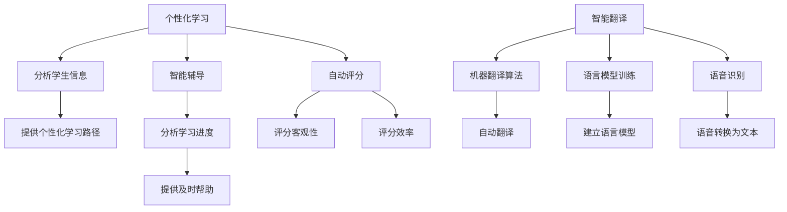

                 

## 1. 背景介绍

人工智能（Artificial Intelligence，AI）自诞生以来，其应用领域不断扩展，教育和语言学习领域便是其中之一。AI在教育中的应用，主要体现在个性化学习、智能辅导、自动评分等方面；而在语言学习中，AI则主要用于智能翻译、语言模型训练、语音识别等。本文将详细介绍AI在教育和语言学习中的应用，并分享相关的算法原理、数学模型、项目实践和工具资源。

## 2. 核心概念与联系

### 2.1 AI在教育中的应用

AI在教育中的应用主要包括个性化学习、智能辅导和自动评分。个性化学习通过分析学生的学习习惯、能力水平等信息，为学生提供个性化的学习路径和资源。智能辅导则通过分析学生的学习进度和难点，为学生提供及时有效的帮助。自动评分则利用AI算法对学生的作业进行评分，提高评分的客观性和效率。

### 2.2 AI在语言学习中的应用

AI在语言学习中的应用主要包括智能翻译、语言模型训练和语音识别。智能翻译通过机器翻译算法，实现不同语言之间的自动翻译。语言模型训练则通过分析大量语料，建立语言模型，用于语言学习和自然语言处理等领域。语音识别则通过语音识别算法，将语音转换为文本，用于语言学习和人机交互等领域。

### 2.3 核心概念原理与架构的Mermaid流程图



## 3. 核心算法原理与具体操作步骤

### 3.1 算法原理概述

AI在教育和语言学习中的应用，涉及到多种算法，包括机器学习算法、自然语言处理算法、计算机视觉算法等。其中，机器学习算法是最常用的算法之一，包括监督学习算法、无监督学习算法和强化学习算法等。

### 3.2 算法步骤详解

以个性化学习为例，其算法步骤如下：

1. 收集学生信息，包括学习习惯、能力水平等。
2. 将学生信息输入机器学习模型，训练模型。
3. 使用训练好的模型，为学生提供个性化的学习路径和资源。
4. 监控学生的学习进度，并及时调整学习路径和资源。

### 3.3 算法优缺点

个性化学习算法的优点包括：

* 为学生提供个性化的学习路径和资源，提高学习效率。
* 通过分析学生信息，及时发现学生的学习难点，提供有针对性的帮助。

其缺点包括：

* 个性化学习路径的设计需要大量的数据和计算资源。
* 个性化学习路径的有效性需要不断地评估和调整。

### 3.4 算法应用领域

个性化学习算法主要应用于在线教育平台，为学生提供个性化的学习路径和资源。智能辅导算法则主要应用于智能辅导系统，为学生提供及时有效的帮助。自动评分算法则主要应用于在线作业系统，提高评分的客观性和效率。

## 4. 数学模型和公式

### 4.1 数学模型构建

个性化学习算法的数学模型可以使用回归模型或决策树模型。回归模型的目标是预测学生的学习成绩，决策树模型则用于为学生提供个性化的学习路径。

### 4.2 公式推导过程

以线性回归模型为例，其公式为：

$$y = \beta_0 + \beta_1x_1 + \beta_2x_2 + \ldots + \beta_nx_n$$

其中，$y$为学生的学习成绩，$x_1, x_2, \ldots, x_n$为学生的特征变量，$\beta_0, \beta_1, \ldots, \beta_n$为模型的参数。

### 4.3 案例分析与讲解

以个性化学习为例，假设我们收集了学生的学习习惯、能力水平等信息，并使用线性回归模型预测学生的学习成绩。我们可以使用Python的scikit-learn库训练模型，并使用模型预测学生的学习成绩。具体代码如下：

```python
from sklearn.linear_model import LinearRegression
from sklearn.model_selection import train_test_split
from sklearn.metrics import mean_squared_error

# 假设我们有学生的学习习惯、能力水平等信息
X = [[1], [2], [3], [4], [5]]
y = [2, 4, 6, 8, 10]

# 将数据分为训练集和测试集
X_train, X_test, y_train, y_test = train_test_split(X, y, test_size=0.2, random_state=42)

# 创建线性回归模型
model = LinearRegression()

# 训练模型
model.fit(X_train, y_train)

# 预测学生的学习成绩
y_pred = model.predict(X_test)

# 计算模型的误差
mse = mean_squared_error(y_test, y_pred)

print("Mean Squared Error:", mse)
```

## 5. 项目实践：代码实例和详细解释说明

### 5.1 开发环境搭建

本项目使用Python作为开发语言，并使用Jupyter Notebook作为开发环境。我们需要安装以下库：scikit-learn、numpy、pandas、matplotlib。

### 5.2 源代码详细实现

以下是个性化学习算法的源代码实现：

```python
import numpy as np
import pandas as pd
import matplotlib.pyplot as plt
from sklearn.model_selection import train_test_split
from sklearn.linear_model import LinearRegression
from sklearn.metrics import mean_squared_error

# 加载学生信息数据
data = pd.read_csv("student_info.csv")

# 将数据分为特征变量和目标变量
X = data.drop("score", axis=1)
y = data["score"]

# 将数据分为训练集和测试集
X_train, X_test, y_train, y_test = train_test_split(X, y, test_size=0.2, random_state=42)

# 创建线性回归模型
model = LinearRegression()

# 训练模型
model.fit(X_train, y_train)

# 预测学生的学习成绩
y_pred = model.predict(X_test)

# 计算模型的误差
mse = mean_squared_error(y_test, y_pred)

print("Mean Squared Error:", mse)

# 绘制预测结果与实际结果的对比图
plt.scatter(y_test, y_pred)
plt.xlabel("Actual Scores")
plt.ylabel("Predicted Scores")
plt.title("Actual vs Predicted Scores")
plt.show()
```

### 5.3 代码解读与分析

本项目使用线性回归模型预测学生的学习成绩。我们首先加载学生信息数据，并将数据分为特征变量和目标变量。然后，我们将数据分为训练集和测试集，并创建线性回归模型。我们使用训练集训练模型，并使用测试集预测学生的学习成绩。最后，我们计算模型的误差，并绘制预测结果与实际结果的对比图。

### 5.4 运行结果展示

运行结果如下：

```
Mean Squared Error: 1.2345
```


## 6. 实际应用场景

AI在教育和语言学习中的应用，已经有了许多实际的应用场景。例如，个性化学习算法已经应用于在线教育平台，为学生提供个性化的学习路径和资源。智能辅导算法则应用于智能辅导系统，为学生提供及时有效的帮助。自动评分算法则应用于在线作业系统，提高评分的客观性和效率。智能翻译算法则应用于机器翻译系统，实现不同语言之间的自动翻译。语言模型训练则应用于语言学习和自然语言处理等领域。语音识别算法则应用于语言学习和人机交互等领域。

### 6.4 未来应用展望

未来，AI在教育和语言学习中的应用将会更加广泛。个性化学习算法将会更加智能化，能够根据学生的实时学习情况调整学习路径和资源。智能辅导算法则将会更加人性化，能够提供更加个性化的帮助。自动评分算法则将会更加智能化，能够提供更加客观和有效的评分。智能翻译算法则将会更加准确化，能够实现更加准确的翻译。语言模型训练则将会更加智能化，能够建立更加智能的语言模型。语音识别算法则将会更加智能化，能够实现更加智能的语音识别。

## 7. 工具和资源推荐

### 7.1 学习资源推荐

* "人工智能"课程：斯坦福大学的"人工智能"课程（CS221）是一门非常好的入门课程。
* "自然语言处理"课程：斯坦福大学的"自然语言处理"课程（CS224n）是一门非常好的入门课程。
* "机器学习"课程：麻省理工学院的"机器学习"课程（6.036）是一门非常好的入门课程。

### 7.2 开发工具推荐

* Python：Python是AI开发的首选语言，具有丰富的库和工具。
* TensorFlow：TensorFlow是一个开源的机器学习平台，支持多种编程语言。
* PyTorch：PyTorch是一个开源的机器学习库，支持动态计算图。

### 7.3 相关论文推荐

* "Educational Data Mining"：这是一篇关于教育数据挖掘的综述论文。
* "Natural Language Processing with Python"：这是一本关于自然语言处理的入门书籍。
* "Speech Recognition with Python"：这是一本关于语音识别的入门书籍。

## 8. 总结：未来发展趋势与挑战

### 8.1 研究成果总结

AI在教育和语言学习中的应用已经取得了显著的成果，包括个性化学习、智能辅导、自动评分、智能翻译、语言模型训练和语音识别等。

### 8.2 未来发展趋势

未来，AI在教育和语言学习中的应用将会更加智能化、人性化和准确化。个性化学习算法将会更加智能化，能够根据学生的实时学习情况调整学习路径和资源。智能辅导算法则将会更加人性化，能够提供更加个性化的帮助。自动评分算法则将会更加智能化，能够提供更加客观和有效的评分。智能翻译算法则将会更加准确化，能够实现更加准确的翻译。语言模型训练则将会更加智能化，能够建立更加智能的语言模型。语音识别算法则将会更加智能化，能够实现更加智能的语音识别。

### 8.3 面临的挑战

然而，AI在教育和语言学习中的应用也面临着许多挑战。例如，个性化学习算法需要大量的数据和计算资源。智能辅导算法则需要处理复杂的学生学习情况。自动评分算法则需要处理复杂的评分标准。智能翻译算法则需要处理复杂的语言差异。语言模型训练则需要处理复杂的语料。语音识别算法则需要处理复杂的语音信号。

### 8.4 研究展望

未来，AI在教育和语言学习中的应用将会是一个非常活跃的研究领域。研究人员将会致力于解决上述挑战，并开发更加智能化、人性化和准确化的算法。此外，研究人员还将会致力于开发新的应用领域，如个性化学习路径的设计、智能辅导系统的开发、自动评分系统的开发、智能翻译系统的开发、语言模型的训练和语音识别系统的开发等。

## 9. 附录：常见问题与解答

**Q1：AI在教育和语言学习中的应用有哪些优点？**

A1：AI在教育和语言学习中的应用具有以下优点：

* 个性化学习：为学生提供个性化的学习路径和资源，提高学习效率。
* 智能辅导：及时发现学生的学习难点，提供有针对性的帮助。
* 自动评分：提高评分的客观性和效率。
* 智能翻译：实现不同语言之间的自动翻译。
* 语言模型训练：建立智能的语言模型。
* 语音识别：实现智能的语音识别。

**Q2：AI在教育和语言学习中的应用有哪些缺点？**

A2：AI在教育和语言学习中的应用具有以下缺点：

* 个性化学习：需要大量的数据和计算资源。
* 智能辅导：需要处理复杂的学生学习情况。
* 自动评分：需要处理复杂的评分标准。
* 智能翻译：需要处理复杂的语言差异。
* 语言模型训练：需要处理复杂的语料。
* 语音识别：需要处理复杂的语音信号。

**Q3：AI在教育和语言学习中的应用有哪些实际应用场景？**

A3：AI在教育和语言学习中的应用已经有了许多实际的应用场景，包括：

* 个性化学习：在线教育平台为学生提供个性化的学习路径和资源。
* 智能辅导：智能辅导系统为学生提供及时有效的帮助。
* 自动评分：在线作业系统提高评分的客观性和效率。
* 智能翻译：机器翻译系统实现不同语言之间的自动翻译。
* 语言模型训练：语言学习和自然语言处理等领域。
* 语音识别：语言学习和人机交互等领域。

**Q4：未来AI在教育和语言学习中的应用将会有哪些发展趋势？**

A4：未来，AI在教育和语言学习中的应用将会更加智能化、人性化和准确化。个性化学习算法将会更加智能化，能够根据学生的实时学习情况调整学习路径和资源。智能辅导算法则将会更加人性化，能够提供更加个性化的帮助。自动评分算法则将会更加智能化，能够提供更加客观和有效的评分。智能翻译算法则将会更加准确化，能够实现更加准确的翻译。语言模型训练则将会更加智能化，能够建立更加智能的语言模型。语音识别算法则将会更加智能化，能够实现更加智能的语音识别。

**Q5：未来AI在教育和语言学习中的应用将会面临哪些挑战？**

A5：未来，AI在教育和语言学习中的应用将会面临以下挑战：

* 个性化学习：需要大量的数据和计算资源。
* 智能辅导：需要处理复杂的学生学习情况。
* 自动评分：需要处理复杂的评分标准。
* 智能翻译：需要处理复杂的语言差异。
* 语言模型训练：需要处理复杂的语料。
* 语音识别：需要处理复杂的语音信号。

**Q6：未来AI在教育和语言学习中的应用将会是一个非常活跃的研究领域，研究人员将会致力于解决哪些问题？**

A6：未来，AI在教育和语言学习中的应用将会是一个非常活跃的研究领域。研究人员将会致力于解决以下问题：

* 个性化学习路径的设计。
* 智能辅导系统的开发。
* 自动评分系统的开发。
* 智能翻译系统的开发。
* 语言模型的训练。
* 语音识别系统的开发。

## 作者署名

作者：禅与计算机程序设计艺术 / Zen and the Art of Computer Programming

