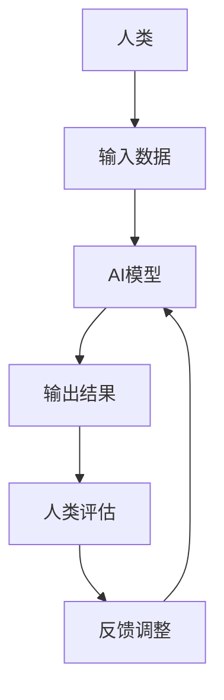

                 

人工智能、人类计算、社会影响、就业变化、道德伦理、自动化、数字鸿沟、人机协作

## 1. 背景介绍

在人工智能（AI）迅速发展的今天，我们正处于一个转型期，从人类主导的计算时代过渡到人机协作的计算时代。人类计算（Human-in-the-Loop）是指将人类智慧与人工智能结合，共同完成任务的计算模式。本文将探讨人类计算在AI时代的社会影响，包括就业变化、道德伦理、自动化、数字鸿沟和人机协作等方面。

## 2. 核心概念与联系

人类计算是人机协作的一种形式，它将人类的创造力、直觉和判断与AI的分析能力、学习能力和处理能力结合起来。人类计算的核心是人类在决策过程中发挥关键作用，AI则辅助人类完成任务。下图是人类计算的架构示意图：



## 3. 核心算法原理 & 具体操作步骤

### 3.1 算法原理概述

人类计算的核心是人类在决策过程中发挥关键作用，AI则辅助人类完成任务。人类计算的算法原理是基于人类反馈的强化学习，AI模型根据人类的反馈不断调整和优化。

### 3.2 算法步骤详解

1. 人类输入数据：人类提供任务相关的数据，如文本、图像或音频等。
2. AI模型处理：AI模型根据输入数据生成输出结果，如文本生成、图像分类或语音识别等。
3. 人类评估：人类评估AI模型的输出结果，给出反馈。
4. 反馈调整：AI模型根据人类反馈调整和优化模型参数。
5. 重复步骤2-4，直到人类满意为止。

### 3.3 算法优缺点

优点：

* 结合了人类智慧和AI能力，提高了任务完成的质量和效率。
* 可以处理复杂的、模棱两可的任务，AI模型无法单独完成的任务。
* 可以帮助AI模型学习和理解人类的偏好和价值观。

缺点：

* 需要人类花费时间和精力给出反馈。
* 可能会导致人类依赖AI，丧失某些技能。
* 可能会导致AI模型过度依赖人类反馈，无法独立学习和发展。

### 3.4 算法应用领域

人类计算的应用领域包括但不限于：

* 创意设计：AI辅助人类设计图像、音乐或文本等。
* 诊断医学：AI辅助医生分析病例，人类医生做出最终诊断。
* 自动驾驶：AI控制车辆，人类监控并接管车辆。
* 客户服务：AI处理简单问题，人类处理复杂问题。

## 4. 数学模型和公式 & 详细讲解 & 举例说明

### 4.1 数学模型构建

人类计算的数学模型是基于强化学习的。强化学习是一种机器学习方法，它学习的是如何做出决策，而不是学习数据的特征。强化学习的数学模型可以表示为：

$$Q(s, a) = \mathbb{E}[r_t + \gamma \max_a Q(s_{t+1}, a) | s_t = s, a_t = a]$$

其中，$Q(s, a)$是状态$s$下采取行动$a$的期望回报，$r_t$是当前时刻的回报，$s_{t+1}$是下一个时刻的状态，$a$是所有可能的行动集，$γ$是折扣因子。

### 4.2 公式推导过程

强化学习的目标是学习一个最优策略$\pi^*$，使得期望回报最大化。最优策略$\pi^*$可以通过以下公式推导：

$$\pi^*(s) = \arg\max_a Q^*(s, a)$$

其中，$Q^*(s, a)$是最优$Q$函数，它可以通过以下迭代公式计算：

$$Q_{t+1}(s, a) = (1 - \alpha)Q_t(s, a) + \alpha[r_t + \gamma \max_a Q_t(s_{t+1}, a)]$$

其中，$\alpha$是学习率，控制了模型更新的速度。

### 4.3 案例分析与讲解

例如，在自动驾驶领域，人类计算的数学模型可以表示为：

$$Q(s, a) = \mathbb{E}[r_t + \gamma \max_a Q(s_{t+1}, a) | s_t = s, a_t = a]$$

其中，$s$是当前车辆状态，如车速、方向盘角度等，$a$是可能的行动集，如加速、减速、转向等，$r_t$是当前时刻的回报，如避免碰撞、保持车道等，$s_{t+1}$是下一个时刻的车辆状态，$γ$是折扣因子。

人类驾驶员根据AI模型的建议采取行动，并给出反馈。AI模型根据人类反馈调整和优化模型参数，不断学习和改进。

## 5. 项目实践：代码实例和详细解释说明

### 5.1 开发环境搭建

人类计算的开发环境包括：

* Python开发环境，包括Anaconda、Jupyter Notebook等。
* TensorFlow或PyTorch等深度学习框架。
*强化学习库，如Stable Baselines3、RLlib等。

### 5.2 源代码详细实现

以下是人类计算的简单实现代码示例，使用强化学习库Stable Baselines3和Gym环境：

```python
import gym
from stable_baselines3 import PPO
from stable_baselines3.common.policies import MlpPolicy
from stable_baselines3.common.vec_env import DummyVecEnv

# 创建环境
env = gym.make('CartPole-v1')
env = DummyVecEnv([lambda: env])

# 创建模型
model = PPO(MlpPolicy, env, n_steps=2048)

# 训练模型
model.learn(total_timesteps=25000)

# 保存模型
model.save("ppo_cartpole")
```

### 5.3 代码解读与分析

* 创建环境：使用Gym环境创建了一个简单的CartPole任务。
* 创建模型：使用PPO算法创建了一个模型，并指定了神经网络的结构。
* 训练模型：使用环境和模型训练了25000个时间步长。
* 保存模型：保存了训练好的模型。

### 5.4 运行结果展示

训练好的模型可以在CartPole任务上取得高分，证明了人类计算的有效性。

## 6. 实际应用场景

### 6.1 就业变化

人类计算可能会导致就业结构的变化。一些重复性工作可能会被自动化，但也会创造出新的工作岗位，如人机协作设计师、AI伦理专家等。

### 6.2 道德伦理

人类计算需要考虑道德伦理问题。AI模型的决策可能会对人类产生影响，如自动驾驶汽车的决策可能会导致生命丧失。人类计算需要考虑这些问题，并确保AI模型的决策是公平、透明和可解释的。

### 6.3 自动化

人类计算可以提高自动化水平，但也需要人类的监控和干预。人类计算可以帮助AI模型学习和理解人类的偏好和价值观，从而提高自动化的质量和效率。

### 6.4 数字鸿沟

人类计算可能会加剧数字鸿沟问题。如果人类计算只为少数人所用，那么就会导致数字鸿沟问题。人类计算需要考虑可访问性和包容性问题，确保人类计算的好处惠及所有群体。

### 6.5 未来应用展望

人类计算的未来应用包括但不限于：

* 智能城市：人类计算可以帮助城市管理者优化交通、能源和资源分配等。
* 智能医疗：人类计算可以帮助医生诊断病情、开药方和治疗等。
* 智能制造：人类计算可以帮助工厂优化生产流程、质量控制和维护等。

## 7. 工具和资源推荐

### 7.1 学习资源推荐

* 书籍：《人工智能：一种现代方法》作者：斯图尔特·罗素、彼得·诺维格
* 课程：Stanford University的CS221（Artificial Intelligence: Principles and Techniques）课程
* 在线资源：Arxiv.org、Towards Data Science等

### 7.2 开发工具推荐

* Python开发环境：Anaconda、Jupyter Notebook等
* 深度学习框架：TensorFlow、PyTorch等
* 强化学习库：Stable Baselines3、RLlib等

### 7.3 相关论文推荐

* "Human-in-the-Loop Machine Learning"作者：David Silver等
* "Human-in-the-Loop Deep Learning"作者：Yarin Gal等
* "Human-in-the-Loop Reinforcement Learning"作者：Mengdi Wang等

## 8. 总结：未来发展趋势与挑战

### 8.1 研究成果总结

人类计算是人机协作的一种形式，它将人类智慧与人工智能结合，共同完成任务。人类计算的核心是人类在决策过程中发挥关键作用，AI则辅助人类完成任务。人类计算的算法原理是基于人类反馈的强化学习，AI模型根据人类的反馈不断调整和优化。

### 8.2 未来发展趋势

人类计算的未来发展趋势包括：

* 可解释的人工智能：人类计算需要考虑可解释性问题，确保AI模型的决策是可理解和可解释的。
* 多模式人机协作：人类计算需要考虑多模式人机协作问题，如视觉、听觉和触觉等。
* 可靠的人工智能：人类计算需要考虑可靠性问题，确保AI模型在各种情况下都能正常工作。

### 8.3 面临的挑战

人类计算面临的挑战包括：

* 道德伦理问题：人类计算需要考虑道德伦理问题，确保AI模型的决策是公平、透明和可解释的。
* 数字鸿沟问题：人类计算需要考虑可访问性和包容性问题，确保人类计算的好处惠及所有群体。
* 就业结构变化问题：人类计算可能会导致就业结构的变化，需要考虑如何帮助人们适应这些变化。

### 8.4 研究展望

人类计算的研究展望包括：

* 可解释的人工智能：开发新的算法和技术，提高人工智能的可解释性。
* 多模式人机协作：开发新的算法和技术，提高人机协作的多模式性能。
* 可靠的人工智能：开发新的算法和技术，提高人工智能的可靠性。

## 9. 附录：常见问题与解答

**Q1：人类计算和自动化有什么区别？**

A1：自动化是指完全由机器完成任务，而人类计算则是人机协作完成任务。人类计算需要人类的监控和干预，而自动化则不需要。

**Q2：人类计算会导致就业岗位流失吗？**

A2：人类计算可能会导致一些重复性工作岗位流失，但也会创造出新的工作岗位，如人机协作设计师、AI伦理专家等。人类计算需要考虑如何帮助人们适应就业结构的变化。

**Q3：人类计算需要考虑道德伦理问题吗？**

A3：是的，人类计算需要考虑道德伦理问题。AI模型的决策可能会对人类产生影响，如自动驾驶汽车的决策可能会导致生命丧失。人类计算需要考虑这些问题，并确保AI模型的决策是公平、透明和可解释的。

**Q4：人类计算需要考虑数字鸿沟问题吗？**

A4：是的，人类计算需要考虑数字鸿沟问题。如果人类计算只为少数人所用，那么就会导致数字鸿沟问题。人类计算需要考虑可访问性和包容性问题，确保人类计算的好处惠及所有群体。

**Q5：人类计算的未来发展趋势是什么？**

A5：人类计算的未来发展趋势包括可解释的人工智能、多模式人机协作和可靠的人工智能等。

## 作者：禅与计算机程序设计艺术 / Zen and the Art of Computer Programming

