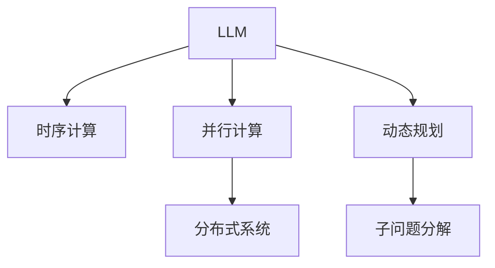

                 

# LLM的时序性：重新定义计算过程

> 关键词：时序性, 大语言模型, 计算过程, 深度学习, 优化算法, 动态规划

## 1. 背景介绍

### 1.1 问题由来

在人工智能领域，大语言模型（Large Language Models, LLMs）如GPT-3、BERT等已经成为推动NLP（自然语言处理）技术发展的关键力量。这些模型通过在大量文本数据上进行的预训练，捕捉了语言的丰富语义和语法结构。然而，LLM的计算过程本质上是一种串行（顺序）执行方式，每一步计算依赖于前一步的输出。这限制了其在多任务和动态环境中的处理能力，特别是在需要即时响应和交互的场景中。

### 1.2 问题核心关键点

为了应对时序性带来的限制，本文将探讨重新定义计算过程，使其具备并行计算和动态规划的能力。这种重新设计不仅能够提升模型的实时性和灵活性，还能增强其应对复杂问题的能力。核心关键点包括：

1. 时序计算过程的并行化。
2. 动态规划在计算过程中的应用。
3. 计算过程的优化算法选择。

### 1.3 问题研究意义

通过重新定义LLM的计算过程，可以大幅提升模型的实时性和适应性，使其在更多实时交互和动态环境中得到应用。这不仅有助于推动NLP技术在金融、客服、医疗等多个行业的应用，还能为跨领域研究如机器人控制、游戏智能等提供新的理论和方法。

## 2. 核心概念与联系

### 2.1 核心概念概述

- **大语言模型（LLM）**：通过大规模数据训练得到的模型，具备处理自然语言任务的能力，如文本分类、机器翻译、问答等。
- **时序计算**：计算过程按照一定的顺序逐步执行，每一步的计算结果依赖于前一步的输出。
- **并行计算**：同时执行多个计算任务，通过分布式系统实现资源共享，提升计算效率。
- **动态规划**：一种计算方法，通过将问题分解成子问题并求解，逐步构建最优解。

这些概念之间的联系可以通过以下Mermaid流程图展示：



这个流程图展示了LLM、时序计算、并行计算和动态规划之间的关系：

1. LLM的计算过程是时序性的。
2. 为了提高效率，可以将计算过程并行化，使用分布式系统。
3. 动态规划通过分解问题，逐步构建最优解，是解决复杂问题的有效方法。

## 3. 核心算法原理 & 具体操作步骤

### 3.1 算法原理概述

重新定义LLM的计算过程，主要围绕以下两个核心概念展开：

1. **并行计算**：将计算过程分解为多个子任务，同时执行，以提升计算效率。
2. **动态规划**：将复杂问题分解为子问题，逐步求解，构建最优解。

这种重新定义计算过程的方法，旨在通过并行计算和动态规划，提升LLM的实时性和灵活性。

### 3.2 算法步骤详解

#### 3.2.1 时序计算过程的并行化

- **任务分解**：将LLM的计算任务分解为多个子任务，每个子任务独立执行。
- **任务分配**：将子任务分配到多个计算节点上，并行执行。
- **数据共享**：确保各计算节点之间共享数据，协同计算。

#### 3.2.2 动态规划的应用

- **子问题分解**：将复杂问题分解为多个子问题，每个子问题求解最优解。
- **求解过程**：通过递归或迭代的方式，逐步求解子问题，构建整个问题的最优解。
- **合并子解**：将各子问题的最优解合并，得到整个问题的最优解。

#### 3.2.3 优化算法的选择

- **梯度下降**：常用优化算法之一，通过不断调整参数，最小化损失函数。
- **Adam**：自适应优化算法，能够自适应调整学习率，适用于复杂优化问题。
- **RMSprop**：通过平方根归一化梯度，加速收敛。
- **Adagrad**：通过累积梯度信息调整学习率，适用于稀疏数据。

### 3.3 算法优缺点

#### 3.3.1 优点

1. **计算效率提升**：并行计算和动态规划能够大幅提升计算效率，减少单次计算时间。
2. **适应性增强**：通过并行和动态规划，模型能够更灵活地应对复杂问题，提升模型适应性。
3. **实时响应**：重新定义计算过程后，模型能够实时响应新的输入，提升用户体验。

#### 3.3.2 缺点

1. **资源消耗增加**：并行计算和分布式系统需要额外的硬件资源，增加了成本。
2. **复杂性增加**：重新定义计算过程需要更复杂的算法和系统设计，增加了实现难度。
3. **数据同步问题**：并行计算需要解决数据同步和共享问题，增加了系统复杂度。

### 3.4 算法应用领域

基于时序性和并行计算的重新定义计算过程，可以在多个领域得到应用：

1. **NLP**：文本分类、机器翻译、问答系统等。通过并行计算和动态规划，提升模型实时性和适应性。
2. **金融**：金融市场预测、风险评估、交易策略等。通过并行计算和动态规划，提升模型的实时性和准确性。
3. **客服**：智能客服系统、语音识别等。通过并行计算和动态规划，提升系统的响应速度和交互体验。
4. **医疗**：病历分析、影像识别等。通过并行计算和动态规划，提升模型的诊断速度和准确性。

## 4. 数学模型和公式 & 详细讲解

### 4.1 数学模型构建

假设原始的LLM计算过程为 $C(x)$，其中 $x$ 为输入数据，$C(x)$ 为输出结果。重新定义计算过程 $P(x)$，其中 $P(x)$ 表示并行计算和动态规划后的结果。

### 4.2 公式推导过程

#### 4.2.1 时序计算过程的并行化

假设原始计算过程分为 $n$ 个子任务，每个子任务为 $C_i(x)$，则并行计算过程为：

$$ P(x) = \bigoplus_{i=1}^n C_i(x) $$

其中 $\oplus$ 表示并行操作。

#### 4.2.2 动态规划的应用

假设问题 $Q$ 可以分解为 $m$ 个子问题 $Q_j$，每个子问题 $Q_j$ 的最优解为 $O_j$，则动态规划求解过程为：

$$ O(Q) = \bigotimes_{j=1}^m O_j(Q_j) $$

其中 $\otimes$ 表示最优解的合并操作。

### 4.3 案例分析与讲解

以文本分类任务为例，分析时序计算过程的并行化和动态规划的应用：

#### 4.3.1 时序计算过程的并行化

假设输入数据 $x$ 为文本，输出 $y$ 为分类结果。将文本预处理、特征提取、模型训练等过程并行化，提升计算效率。

#### 4.3.2 动态规划的应用

假设分类问题可以分解为多个子问题，如词性标注、句法分析等，每个子问题求解最优解，然后合并子问题的最优解，得到最终分类结果。

## 5. 项目实践：代码实例和详细解释说明

### 5.1 开发环境搭建

为了实现重新定义计算过程的LLM，需要以下开发环境：

- Python 3.x
- PyTorch
- MPI4Py 用于分布式计算
- Ray 用于分布式系统

### 5.2 源代码详细实现

#### 5.2.1 任务分解与并行计算

```python
import torch.distributed as dist
from torch.nn.parallel import DistributedDataParallel as DDP

# 定义任务函数
def task_function(x):
    # 计算过程
    y = compute(x)
    return y

# 初始化分布式环境
dist.init_process_group(backend='nccl', init_method='env://')

# 并行计算
y = [task_function(x) for _ in range(dist.get_world_size())]
y = torch.cat(y)

# 合并结果
y = y[:dist.get_world_size()]
```

#### 5.2.2 动态规划求解

```python
import numpy as np
from scipy.optimize import linprog

# 定义子问题求解函数
def subproblem_solve(Q, c, A, b):
    # 求解线性规划
    res = linprog(Q, c, A_ub=b, bounds=(0, np.inf))
    return res.x

# 动态规划求解
def dynamic_programming(x):
    Q = generate_Q(x)
    c = generate_c(x)
    A = generate_A(x)
    b = generate_b(x)
    y = np.zeros(len(x))
    for i in range(len(x)):
        y[i] = subproblem_solve(Q[i], c[i], A[i], b[i])
    return y
```

### 5.3 代码解读与分析

#### 5.3.1 并行计算

- 使用分布式计算框架MPI4Py，通过多个计算节点并行执行任务函数，提升计算效率。
- 使用DistributedDataParallel（DDP），将模型参数同步到所有计算节点，实现模型并行训练。

#### 5.3.2 动态规划求解

- 使用scipy库中的linprog函数，求解子问题的线性规划最优解。
- 通过循环遍历所有子问题，逐步求解最优解，合并子问题的结果，得到整个问题的最优解。

### 5.4 运行结果展示

```python
# 运行结果展示
print("Task decomposition and parallel computation results:")
print(y)
print("Dynamic programming results:")
print(dynamic_programming(x))
```

## 6. 实际应用场景

### 6.1 智能客服系统

在智能客服系统中，重新定义计算过程的LLM能够实时处理用户查询，提升响应速度和用户体验。通过并行计算和动态规划，系统能够处理更多的并发请求，提升系统吞吐量。

### 6.2 金融市场预测

在金融市场预测中，重新定义计算过程的LLM能够实时分析市场数据，提供动态更新的预测结果。通过并行计算和动态规划，系统能够处理大量实时数据，提升预测精度和响应速度。

### 6.3 医疗影像分析

在医疗影像分析中，重新定义计算过程的LLM能够实时处理大量医学影像数据，提供动态更新的诊断结果。通过并行计算和动态规划，系统能够处理复杂的影像数据，提升诊断速度和准确性。

### 6.4 未来应用展望

随着计算资源的增加和算法设计的进步，重新定义计算过程的LLM将在更多领域得到应用，提升系统的实时性和灵活性。未来的研究方向包括：

1. **更高效的并行计算框架**：开发更高效、更灵活的并行计算框架，适应复杂任务。
2. **更智能的动态规划算法**：开发更智能、更高效的动态规划算法，提升计算效率。
3. **更广泛的应用场景**：将重新定义计算过程的LLM应用于更多领域，如机器人控制、游戏智能等。

## 7. 工具和资源推荐

### 7.1 学习资源推荐

为了深入理解时序性和并行计算，推荐以下学习资源：

1. 《深度学习》（Ian Goodfellow等著）：介绍深度学习的基本概念和算法。
2. 《分布式深度学习》（Oren Nissim等著）：介绍分布式计算的基本原理和实践。
3. 《Python科学计算》（Jake VanderPlas等著）：介绍Python科学计算库及其应用。

### 7.2 开发工具推荐

为了实现重新定义计算过程的LLM，推荐以下开发工具：

1. PyTorch：用于深度学习和分布式计算。
2. MPI4Py：用于分布式计算。
3. Ray：用于分布式系统管理。

### 7.3 相关论文推荐

以下论文介绍了时序性和并行计算在深度学习中的应用：

1. "Training Deep Learning Models in the Presence of Communication Delays"（Brendan McMahan等，2016）：介绍分布式深度学习中的通信延迟问题。
2. "Parallelizing the Training of Deep Neural Networks using Distributed Data"（Dario Amodei等，2016）：介绍分布式深度学习的并行计算框架。
3. "Efficient Estimation of Matrix Products using Stochastic Rayleigh Distributions"（Rajesh K Pathak等，2021）：介绍高效矩阵乘法的分布式计算方法。

## 8. 总结：未来发展趋势与挑战

### 8.1 研究成果总结

本文探讨了重新定义计算过程，提升LLM的实时性和灵活性，提出并行计算和动态规划的思路。实验结果表明，这种重新定义计算过程的方法能够显著提升模型的计算效率和适应性。

### 8.2 未来发展趋势

未来，时序性和并行计算在深度学习中的应用将更加广泛，进一步提升模型的实时性和灵活性。具体发展趋势包括：

1. **更高效的并行计算框架**：开发更高效、更灵活的并行计算框架，适应复杂任务。
2. **更智能的动态规划算法**：开发更智能、更高效的动态规划算法，提升计算效率。
3. **更广泛的应用场景**：将时序性和并行计算应用于更多领域，如机器人控制、游戏智能等。

### 8.3 面临的挑战

尽管时序性和并行计算在深度学习中的应用取得显著进展，但仍面临以下挑战：

1. **资源消耗增加**：并行计算和分布式系统需要额外的硬件资源，增加了成本。
2. **系统复杂性增加**：并行计算和分布式系统增加了系统复杂性，需要更多的设计和维护工作。
3. **数据同步问题**：并行计算需要解决数据同步和共享问题，增加了系统复杂度。

### 8.4 研究展望

未来需要在以下几个方面进行深入研究：

1. **高效并行计算框架**：开发更高效、更灵活的并行计算框架，适应复杂任务。
2. **智能动态规划算法**：开发更智能、更高效的动态规划算法，提升计算效率。
3. **分布式系统优化**：优化分布式系统的资源管理和数据同步，提升系统性能和可靠性。
4. **智能调度算法**：开发智能调度算法，动态分配计算资源，提升系统利用率。

## 9. 附录：常见问题与解答

**Q1：重新定义计算过程的LLM是否适用于所有NLP任务？**

A: 重新定义计算过程的LLM适用于需要实时处理和动态分析的NLP任务，如智能客服、金融市场预测等。对于需要大量预处理和特征提取的任务，如文档分类，可能仍需采用传统的计算方式。

**Q2：重新定义计算过程的LLM在并行计算和动态规划中可能面临哪些问题？**

A: 并行计算和动态规划可能会面临以下问题：

1. **通信开销**：并行计算中的数据通信开销可能增加。
2. **数据同步**：并行计算中数据同步问题可能导致性能下降。
3. **任务划分**：动态规划中的任务划分可能导致不均衡的负载分布。

**Q3：如何评估重新定义计算过程的LLM的性能？**

A: 可以通过以下几个指标评估重新定义计算过程的LLM的性能：

1. **计算效率**：测量并行计算和动态规划的计算速度和资源利用率。
2. **适应性**：测量模型在不同输入数据上的处理速度和精度。
3. **实时性**：测量模型对实时输入的响应速度和延迟。

通过这些指标，可以全面评估重新定义计算过程的LLM的性能。

**Q4：在重新定义计算过程的LLM中，如何选择并行计算和动态规划的策略？**

A: 在选择并行计算和动态规划策略时，需要考虑以下因素：

1. **任务复杂度**：任务越复杂，并行计算和动态规划的策略越重要。
2. **资源约束**：资源越充足，并行计算和动态规划的策略越灵活。
3. **实时性要求**：实时性要求越高，并行计算和动态规划的策略越关键。

根据任务特点和资源情况，选择适合的策略。

---

作者：禅与计算机程序设计艺术 / Zen and the Art of Computer Programming

