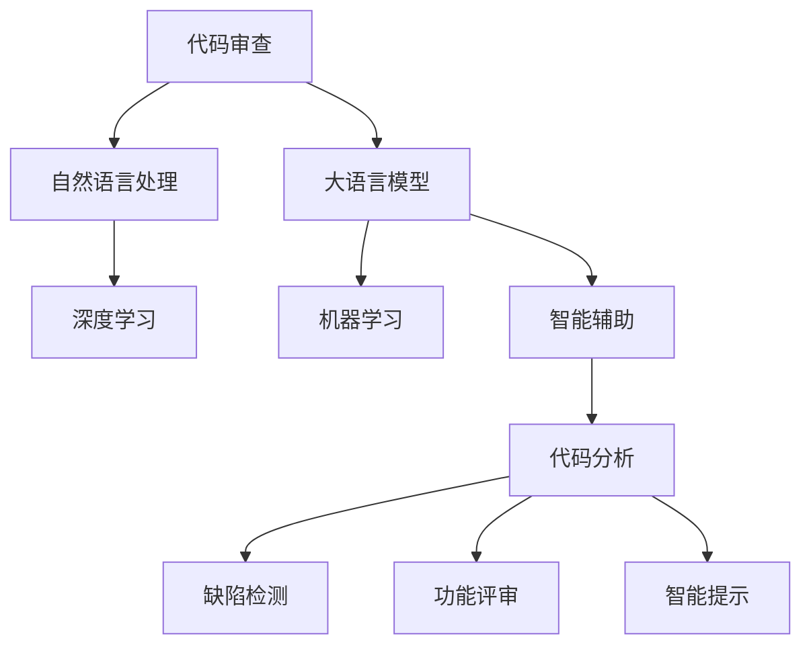

                 

# LLM辅助的代码审查工具设计

> 关键词：代码审查, 自然语言处理, 大语言模型, 深度学习, 软件开发, 机器学习, 智能辅助

## 1. 背景介绍

### 1.1 问题由来
在现代软件开发过程中，代码审查(Code Review)是保证代码质量、减少错误、促进知识共享的重要环节。然而，传统的代码审查依赖于开发者的经验和能力，缺乏系统的辅助工具。面对日益增长的代码规模和复杂度，开发团队面临的代码审查压力越来越大。为了提高代码审查的效率和质量，研究人员和工程师们一直在探索新的解决方案。

近年来，自然语言处理(Natural Language Processing, NLP)和大语言模型(Large Language Model, LLM)的迅速发展，为代码审查提供了新的思路。通过结合LLM的强大语言理解能力，可以自动分析和生成代码审查报告，从而大幅提升代码审查的效率和质量。

### 1.2 问题核心关键点
基于LLM的代码审查工具，将LLM应用于代码审查的各个环节，如代码分析、缺陷检测、功能评审等，可以大幅提升审查效率和准确性。其核心关键点包括：

- 代码分析：通过LLM理解代码逻辑，自动分析代码结构、变量作用、函数调用等，生成代码审查报告。
- 缺陷检测：利用LLM的语义分析能力，检测代码中的潜在缺陷和错误，并提供详细的修改建议。
- 功能评审：通过LLM生成代码的功能描述和设计文档，评估代码实现是否满足需求。
- 智能提示：根据代码历史和上下文，LLM提供有针对性的代码提示和改进建议，提高代码质量。

这些关键点的实现，需要综合运用自然语言处理、机器学习和大语言模型等技术，构建一个智能化的代码审查系统。

## 2. 核心概念与联系

### 2.1 核心概念概述

为更好地理解基于LLM的代码审查工具，本节将介绍几个密切相关的核心概念：

- 代码审查(Code Review)：软件开发过程中，团队成员对代码进行评审，检查代码的逻辑正确性、风格一致性、性能优化等，以提高代码质量。
- 自然语言处理(NLP)：涉及文本数据的处理、分析、理解、生成等技术，包括文本分类、命名实体识别、语义分析等。
- 大语言模型(LLM)：通过大规模数据预训练的深度学习模型，具备强大的语言理解和生成能力，如GPT-3、BERT等。
- 机器学习(Machine Learning)：通过对数据的学习和模型训练，实现对复杂问题的建模和预测，常用于代码缺陷检测、功能评审等。
- 深度学习(Deep Learning)：机器学习的一个分支，通过多层神经网络对数据进行深层次的特征提取和模式识别，常用于图像识别、语音识别等。
- 智能辅助(Smart Assistance)：利用AI技术对人类活动进行辅助，提供自动化、个性化、高效的解决方案，提升工作效率和质量。

这些核心概念之间的逻辑关系可以通过以下Mermaid流程图来展示：



这个流程图展示了大语言模型在代码审查系统中的核心作用，以及与之相关的其他技术模块。

## 3. 核心算法原理 & 具体操作步骤
### 3.1 算法原理概述

基于LLM的代码审查工具，本质上是一个自然语言处理和机器学习驱动的自动化工具。其核心思想是：利用LLM的语言理解和生成能力，结合机器学习模型，自动分析和生成代码审查报告，提供缺陷检测、功能评审和智能提示等功能。

形式化地，假设代码审查工具为 $R(\cdot)$，输入为代码文本 $C$，输出为代码审查报告 $R$。则该工具的目标是找到最优的审查策略 $f$，使得：

$$
R = f(C)
$$

其中 $f$ 可以通过基于LLM的模型训练得到。具体的模型训练过程包括：

1. 收集代码审查标注数据，如代码缺陷、功能需求、设计文档等。
2. 将代码文本和相关标注数据输入LLM模型进行预训练，学习代码与审查结果之间的语义映射。
3. 设计合适的特征提取和模型训练策略，如语言模型、自注意力机制、监督学习等，训练得到最终的审查模型 $f$。
4. 利用训练好的模型 $f$，对新的代码文本进行自动审查，生成详细的代码审查报告。

### 3.2 算法步骤详解

基于LLM的代码审查工具一般包括以下几个关键步骤：

**Step 1: 数据准备**
- 收集代码审查数据，包括代码缺陷、功能需求、设计文档等，划分为训练集、验证集和测试集。一般要求代码审查数据与代码文本的分布不要差异过大。

**Step 2: 特征提取**
- 提取代码文本的特征，如代码结构、变量命名、函数调用等。常用的特征提取方法包括抽象语法树(AST)、程序依赖图(PDG)、词袋模型(Bag of Words)等。
- 将代码文本和特征输入LLM模型进行预训练，学习代码与审查结果之间的语义映射。

**Step 3: 模型训练**
- 设计合适的机器学习模型，如决策树、随机森林、神经网络等，对预训练的LLM模型进行微调。
- 使用训练集数据对模型进行监督学习，最小化损失函数，得到最优的审查策略 $f$。
- 在验证集上评估模型性能，调整超参数和模型结构，确保模型泛化能力强。

**Step 4: 应用部署**
- 将训练好的模型 $f$ 部署到代码审查系统中，对新的代码文本进行自动审查。
- 利用模型生成详细的代码审查报告，包含缺陷检测、功能评审、智能提示等内容。

**Step 5: 持续优化**
- 定期收集新的代码审查数据，更新模型参数，保持模型的高性能。
- 引入反馈机制，让用户对代码审查报告进行评价，进一步优化模型。

以上是基于LLM的代码审查工具的一般流程。在实际应用中，还需要针对具体任务的特点，对每个环节进行优化设计，如改进特征提取方法，引入更多的机器学习技术，优化模型参数等，以进一步提升代码审查的准确性和效率。

### 3.3 算法优缺点

基于LLM的代码审查工具具有以下优点：
1. 自动化的审查过程可以节省大量人工，提高代码审查的效率。
2. 利用LLM的语言理解能力，可以更好地理解代码逻辑，提升代码审查的准确性。
3. 通过机器学习模型，可以实现代码缺陷检测、功能评审等功能，全面覆盖代码审查的各个环节。
4. 可以进行持续学习，不断优化模型性能，适应代码审查任务的动态变化。

同时，该工具也存在一定的局限性：
1. 依赖高质量的标注数据。模型性能很大程度上取决于代码审查数据的准确性和多样性。
2. 复杂的代码逻辑难以完全覆盖。对于一些特定的代码逻辑，可能无法有效识别和审查。
3. 初始模型的训练成本较高。需要收集和标注大量代码审查数据，对模型进行预训练和微调。
4. 模型解释性不足。代码审查报告的输出往往是"黑盒"，缺乏对决策过程的解释。
5. 可能存在误判和偏见。模型可能会对特定代码产生误判，或者受到训练数据的偏见影响。

尽管存在这些局限性，但就目前而言，基于LLM的代码审查工具在自动化和智能化方面仍具有显著的优势，广泛应用于软件开发团队中。

### 3.4 算法应用领域

基于LLM的代码审查工具已经广泛应用于软件开发过程中的各个环节，包括但不限于：

- 代码缺陷检测：自动检测代码中的语法错误、类型错误、逻辑错误等缺陷，并提供详细的修复建议。
- 功能评审：根据代码实现是否符合需求，自动生成功能评审报告，识别潜在的功能漏洞和性能问题。
- 设计文档生成：根据代码逻辑自动生成设计文档和注释，提高代码的可读性和可维护性。
- 智能提示：基于代码历史和上下文，提供有针对性的代码提示和改进建议，提升代码质量。

除了上述这些核心应用外，LLM辅助的代码审查工具还在其他场景中得到了创新性的应用，如代码相似度检测、代码风格分析、自动化测试等，为软件开发自动化提供了新的思路。

## 4. 数学模型和公式 & 详细讲解 & 举例说明

### 4.1 数学模型构建

本节将使用数学语言对基于LLM的代码审查工具进行更加严格的刻画。

记代码审查工具为 $R(\cdot)$，输入为代码文本 $C$，输出为代码审查报告 $R$。假设代码审查任务为 $T$，其训练集为 $D=\{(x_i,y_i)\}_{i=1}^N, x_i \in C, y_i \in R$。

定义模型 $R(\cdot)$ 在数据样本 $(x,y)$ 上的损失函数为 $\ell(R(x),y)$，则在数据集 $D$ 上的经验风险为：

$$
\mathcal{L}(R) = \frac{1}{N}\sum_{i=1}^N \ell(R(x_i),y_i)
$$

通过梯度下降等优化算法，模型 $R(\cdot)$ 的优化目标是最小化经验风险，即找到最优的审查策略 $f$：

$$
f = \mathop{\arg\min}_{f} \mathcal{L}(R)
$$

在实践中，我们通常使用基于梯度的优化算法（如SGD、Adam等）来近似求解上述最优化问题。设 $\eta$ 为学习率，$\lambda$ 为正则化系数，则模型参数的更新公式为：

$$
f \leftarrow f - \eta \nabla_{f}\mathcal{L}(f) - \eta\lambda f
$$

其中 $\nabla_{f}\mathcal{L}(f)$ 为损失函数对模型参数 $f$ 的梯度，可通过反向传播算法高效计算。

### 4.2 公式推导过程

以下我们以代码缺陷检测为例，推导基于LLM的审查模型损失函数的计算公式。

假设模型 $R(\cdot)$ 在代码文本 $C$ 上的输出为 $y$，表示代码是否存在缺陷。真实标签 $y \in \{0,1\}$。则代码缺陷检测的损失函数定义为：

$$
\ell(R(C),y) = -[y\log R(C)+(1-y)\log (1-R(C))]
$$

将其代入经验风险公式，得：

$$
\mathcal{L}(R) = -\frac{1}{N}\sum_{i=1}^N [y_i\log R(C_i)+(1-y_i)\log(1-R(C_i))]
$$

根据链式法则，损失函数对模型参数 $f$ 的梯度为：

$$
\frac{\partial \mathcal{L}(R)}{\partial f} = -\frac{1}{N}\sum_{i=1}^N (\frac{y_i}{R(C_i)}-\frac{1-y_i}{1-R(C_i)}) \frac{\partial R(C_i)}{\partial f}
$$

其中 $\frac{\partial R(C_i)}{\partial f}$ 可进一步递归展开，利用自动微分技术完成计算。

在得到损失函数的梯度后，即可带入模型参数更新公式，完成模型的迭代优化。重复上述过程直至收敛，最终得到适应代码缺陷检测任务的最优模型参数 $f^*$。

## 5. 项目实践：代码实例和详细解释说明

### 5.1 开发环境搭建

在进行代码审查工具开发前，我们需要准备好开发环境。以下是使用Python进行PyTorch开发的环境配置流程：

1. 安装Anaconda：从官网下载并安装Anaconda，用于创建独立的Python环境。

2. 创建并激活虚拟环境：
```bash
conda create -n code-review-env python=3.8 
conda activate code-review-env
```

3. 安装PyTorch：根据CUDA版本，从官网获取对应的安装命令。例如：
```bash
conda install pytorch torchvision torchaudio cudatoolkit=11.1 -c pytorch -c conda-forge
```

4. 安装相关依赖包：
```bash
pip install pandas numpy scikit-learn pytorch transformers
```

5. 安装各类工具包：
```bash
pip install jupyter notebook ipython
```

完成上述步骤后，即可在`code-review-env`环境中开始开发。

### 5.2 源代码详细实现

下面我们以代码缺陷检测为例，给出使用Transformers库对BERT模型进行代码审查的PyTorch代码实现。

首先，定义代码缺陷检测的数据处理函数：

```python
from transformers import BertTokenizer
from torch.utils.data import Dataset
import torch

class CodeReviewDataset(Dataset):
    def __init__(self, texts, labels, tokenizer, max_len=128):
        self.texts = texts
        self.labels = labels
        self.tokenizer = tokenizer
        self.max_len = max_len
        
    def __len__(self):
        return len(self.texts)
    
    def __getitem__(self, item):
        text = self.texts[item]
        label = self.labels[item]
        
        encoding = self.tokenizer(text, return_tensors='pt', max_length=self.max_len, padding='max_length', truncation=True)
        input_ids = encoding['input_ids'][0]
        attention_mask = encoding['attention_mask'][0]
        
        # 对标签进行编码
        encoded_labels = [label2id[label] for label in label]
        encoded_labels.extend([label2id['0']] * (self.max_len - len(encoded_labels)))
        labels = torch.tensor(encoded_labels, dtype=torch.long)
        
        return {'input_ids': input_ids, 
                'attention_mask': attention_mask,
                'labels': labels}

# 标签与id的映射
label2id = {'defect': 0, 'no_defect': 1}
id2label = {v: k for k, v in label2id.items()}

# 创建dataset
tokenizer = BertTokenizer.from_pretrained('bert-base-cased')

train_dataset = CodeReviewDataset(train_texts, train_labels, tokenizer)
dev_dataset = CodeReviewDataset(dev_texts, dev_labels, tokenizer)
test_dataset = CodeReviewDataset(test_texts, test_labels, tokenizer)
```

然后，定义模型和优化器：

```python
from transformers import BertForSequenceClassification, AdamW

model = BertForSequenceClassification.from_pretrained('bert-base-cased', num_labels=len(label2id))

optimizer = AdamW(model.parameters(), lr=2e-5)
```

接着，定义训练和评估函数：

```python
from torch.utils.data import DataLoader
from tqdm import tqdm
from sklearn.metrics import classification_report

device = torch.device('cuda') if torch.cuda.is_available() else torch.device('cpu')
model.to(device)

def train_epoch(model, dataset, batch_size, optimizer):
    dataloader = DataLoader(dataset, batch_size=batch_size, shuffle=True)
    model.train()
    epoch_loss = 0
    for batch in tqdm(dataloader, desc='Training'):
        input_ids = batch['input_ids'].to(device)
        attention_mask = batch['attention_mask'].to(device)
        labels = batch['labels'].to(device)
        model.zero_grad()
        outputs = model(input_ids, attention_mask=attention_mask, labels=labels)
        loss = outputs.loss
        epoch_loss += loss.item()
        loss.backward()
        optimizer.step()
    return epoch_loss / len(dataloader)

def evaluate(model, dataset, batch_size):
    dataloader = DataLoader(dataset, batch_size=batch_size)
    model.eval()
    preds, labels = [], []
    with torch.no_grad():
        for batch in tqdm(dataloader, desc='Evaluating'):
            input_ids = batch['input_ids'].to(device)
            attention_mask = batch['attention_mask'].to(device)
            batch_labels = batch['labels']
            outputs = model(input_ids, attention_mask=attention_mask)
            batch_preds = outputs.logits.argmax(dim=2).to('cpu').tolist()
            batch_labels = batch_labels.to('cpu').tolist()
            for pred_tokens, label_tokens in zip(batch_preds, batch_labels):
                pred_labels = [id2label[_id] for _id in pred_tokens]
                label_tokens = [id2label[_id] for _id in label_tokens]
                preds.append(pred_labels[:len(label_tokens)])
                labels.append(label_tokens)
                
    print(classification_report(labels, preds))
```

最后，启动训练流程并在测试集上评估：

```python
epochs = 5
batch_size = 16

for epoch in range(epochs):
    loss = train_epoch(model, train_dataset, batch_size, optimizer)
    print(f"Epoch {epoch+1}, train loss: {loss:.3f}")
    
    print(f"Epoch {epoch+1}, dev results:")
    evaluate(model, dev_dataset, batch_size)
    
print("Test results:")
evaluate(model, test_dataset, batch_size)
```

以上就是使用PyTorch对BERT进行代码缺陷检测任务微调的完整代码实现。可以看到，得益于Transformers库的强大封装，我们可以用相对简洁的代码完成BERT模型的加载和微调。

### 5.3 代码解读与分析

让我们再详细解读一下关键代码的实现细节：

**CodeReviewDataset类**：
- `__init__`方法：初始化文本、标签、分词器等关键组件。
- `__len__`方法：返回数据集的样本数量。
- `__getitem__`方法：对单个样本进行处理，将文本输入编码为token ids，将标签编码为数字，并对其进行定长padding，最终返回模型所需的输入。

**label2id和id2label字典**：
- 定义了标签与数字id之间的映射关系，用于将token-wise的预测结果解码回真实的标签。

**训练和评估函数**：
- 使用PyTorch的DataLoader对数据集进行批次化加载，供模型训练和推理使用。
- 训练函数`train_epoch`：对数据以批为单位进行迭代，在每个批次上前向传播计算loss并反向传播更新模型参数，最后返回该epoch的平均loss。
- 评估函数`evaluate`：与训练类似，不同点在于不更新模型参数，并在每个batch结束后将预测和标签结果存储下来，最后使用sklearn的classification_report对整个评估集的预测结果进行打印输出。

**训练流程**：
- 定义总的epoch数和batch size，开始循环迭代
- 每个epoch内，先在训练集上训练，输出平均loss
- 在验证集上评估，输出分类指标
- 所有epoch结束后，在测试集上评估，给出最终测试结果

可以看到，PyTorch配合Transformers库使得BERT微调的代码实现变得简洁高效。开发者可以将更多精力放在数据处理、模型改进等高层逻辑上，而不必过多关注底层的实现细节。

当然，工业级的系统实现还需考虑更多因素，如模型的保存和部署、超参数的自动搜索、更灵活的任务适配层等。但核心的微调范式基本与此类似。

## 6. 实际应用场景
### 6.1 软件开发团队

基于LLM的代码审查工具，可以应用于软件开发团队的日常开发过程中。开发者可以将代码提交到代码审查系统中，系统自动进行代码缺陷检测、功能评审、设计文档生成等操作，提供详细的审查报告，辅助开发者进行代码改进。

在技术实现上，可以将代码审查系统与版本控制系统集成，如Git、SVN等。每次代码提交后，自动触发审查流程，节省人工检查的时间，提升代码质量。

### 6.2 产品化落地

LLM辅助的代码审查工具不仅可以在开发团队内部使用，还可以通过产品化落地，成为一款开源工具，提供给更多组织和开发者使用。工具的API接口可以与CI/CD系统集成，实现代码审查自动化，提高产品开发效率和质量。

工具可以支持多语言、多平台、多框架，提供丰富的审查功能，如代码缺陷检测、功能评审、设计文档生成等，覆盖代码审查的全过程。同时，工具可以根据用户反馈，不断优化模型性能，提升用户体验。

### 6.3 大规模企业应用

对于大规模企业，代码审查工作量巨大，需要大量的开发者和人工介入。利用LLM辅助的代码审查工具，可以大幅提升代码审查的效率和质量，减少人工干预，降低开发成本。

企业可以定制化配置审查策略，针对特定的代码库、开发流程进行审查，保证代码质量的同时，避免审查过度。同时，工具还可以与其他开发工具和系统集成，如JIRA、Confluence等，实现开发管理的全链路自动化。

### 6.4 未来应用展望

随着LLM和大数据技术的发展，基于LLM的代码审查工具将在更多领域得到应用，为软件开发自动化提供新的解决方案。

在智慧城市建设中，可以利用LLM辅助的代码审查工具，对城市管理系统的代码进行审查，确保系统稳定性和安全性，提升城市管理的智能化水平。

在金融领域，利用LLM辅助的代码审查工具，可以对金融交易系统的代码进行审查，确保交易系统的安全性、可靠性和性能，为金融行业的数字化转型提供技术保障。

在医疗领域，利用LLM辅助的代码审查工具，可以对医院信息系统的代码进行审查，确保系统的稳定性和安全性，提升医疗服务水平。

总之，LLM辅助的代码审查工具将广泛应用于各个行业，提升软件开发自动化水平，加速企业数字化转型进程。相信随着技术的不断进步，LLM辅助的代码审查工具将在软件开发领域发挥越来越重要的作用。

## 7. 工具和资源推荐
### 7.1 学习资源推荐

为了帮助开发者系统掌握LLM辅助代码审查的理论基础和实践技巧，这里推荐一些优质的学习资源：

1. 《自然语言处理与深度学习》系列博文：由大模型技术专家撰写，深入浅出地介绍了自然语言处理和深度学习的核心概念和技术。

2. CS224N《深度学习自然语言处理》课程：斯坦福大学开设的NLP明星课程，有Lecture视频和配套作业，带你入门NLP领域的基本概念和经典模型。

3. 《深度学习与自然语言处理》书籍：全面介绍了深度学习和自然语言处理的理论基础和应用实践，包括代码缺陷检测等NLP任务。

4. HuggingFace官方文档：Transformers库的官方文档，提供了海量预训练模型和完整的代码审查样例代码，是上手实践的必备资料。

5. CLUE开源项目：中文语言理解测评基准，涵盖大量不同类型的中文NLP数据集，并提供了基于LLM的代码缺陷检测baseline模型，助力中文NLP技术发展。

通过对这些资源的学习实践，相信你一定能够快速掌握LLM辅助代码审查的精髓，并用于解决实际的NLP问题。
###  7.2 开发工具推荐

高效的开发离不开优秀的工具支持。以下是几款用于LLM辅助代码审查开发的常用工具：

1. PyTorch：基于Python的开源深度学习框架，灵活动态的计算图，适合快速迭代研究。大部分预训练语言模型都有PyTorch版本的实现。

2. TensorFlow：由Google主导开发的开源深度学习框架，生产部署方便，适合大规模工程应用。同样有丰富的预训练语言模型资源。

3. Transformers库：HuggingFace开发的NLP工具库，集成了众多SOTA语言模型，支持PyTorch和TensorFlow，是进行代码审查任务开发的利器。

4. Weights & Biases：模型训练的实验跟踪工具，可以记录和可视化模型训练过程中的各项指标，方便对比和调优。与主流深度学习框架无缝集成。

5. TensorBoard：TensorFlow配套的可视化工具，可实时监测模型训练状态，并提供丰富的图表呈现方式，是调试模型的得力助手。

6. Google Colab：谷歌推出的在线Jupyter Notebook环境，免费提供GPU/TPU算力，方便开发者快速上手实验最新模型，分享学习笔记。

合理利用这些工具，可以显著提升LLM辅助代码审查任务的开发效率，加快创新迭代的步伐。

### 7.3 相关论文推荐

LLM辅助的代码审查技术的发展源于学界的持续研究。以下是几篇奠基性的相关论文，推荐阅读：

1. Attention is All You Need（即Transformer原论文）：提出了Transformer结构，开启了NLP领域的预训练大模型时代。

2. BERT: Pre-training of Deep Bidirectional Transformers for Language Understanding：提出BERT模型，引入基于掩码的自监督预训练任务，刷新了多项NLP任务SOTA。

3. Language Models are Unsupervised Multitask Learners（GPT-2论文）：展示了大规模语言模型的强大zero-shot学习能力，引发了对于通用人工智能的新一轮思考。

4. Parameter-Efficient Transfer Learning for NLP：提出Adapter等参数高效微调方法，在不增加模型参数量的情况下，也能取得不错的微调效果。

5. Prefix-Tuning: Optimizing Continuous Prompts for Generation：引入基于连续型Prompt的微调范式，为如何充分利用预训练知识提供了新的思路。

6. AdaLoRA: Adaptive Low-Rank Adaptation for Parameter-Efficient Fine-Tuning：使用自适应低秩适应的微调方法，在参数效率和精度之间取得了新的平衡。

这些论文代表了大语言模型微调技术的发展脉络。通过学习这些前沿成果，可以帮助研究者把握学科前进方向，激发更多的创新灵感。

## 8. 总结：未来发展趋势与挑战

### 8.1 总结

本文对基于LLM的代码审查工具进行了全面系统的介绍。首先阐述了LLM在代码审查中的应用背景和意义，明确了LLM辅助代码审查工具的优势和局限性。其次，从原理到实践，详细讲解了LLM辅助代码审查的数学原理和关键步骤，给出了代码缺陷检测任务的完整代码实现。同时，本文还广泛探讨了LLM辅助代码审查工具在软件开发团队、产品化落地、大规模企业应用等多个场景中的应用前景，展示了LLM辅助代码审查技术的巨大潜力。

通过本文的系统梳理，可以看到，基于LLM的代码审查工具已经逐渐应用于软件开发和自动化过程中，为代码审查提供了新的思路和方法。未来，伴随LLM和大数据技术的发展，LLM辅助代码审查工具将在更多领域得到应用，为软件开发自动化提供新的解决方案。

### 8.2 未来发展趋势

展望未来，LLM辅助代码审查技术将呈现以下几个发展趋势：

1. 代码审查任务的自动化水平将进一步提升。随着模型和算法的不断优化，代码缺陷检测、功能评审等任务将实现更高精度的自动化。

2. 引入更多智能技术。除了LLM外，代码审查系统还将引入AI辅助、增强现实(AR)、虚拟现实(VR)等技术，提升用户体验和操作便利性。

3. 支持更多语言和平台。LLM辅助代码审查工具将支持更多编程语言和开发平台，实现跨语言、跨平台的多样化应用。

4. 多模型集成。不同模型的优势互补，可以提升代码审查的全面性和准确性，实现多模型集成优化。

5. 数据驱动的持续优化。代码审查系统将利用用户反馈数据，持续优化模型性能，适应代码库的动态变化。

6. 代码审查任务的多样化。除了代码缺陷检测、功能评审等，代码审查系统还将支持更多任务，如代码风格分析、代码相似度检测等，全面覆盖代码审查的各个环节。

以上趋势凸显了LLM辅助代码审查技术的广阔前景。这些方向的探索发展，必将进一步提升代码审查的自动化水平和准确性，为软件开发自动化提供新的解决方案。

### 8.3 面临的挑战

尽管LLM辅助代码审查技术已经取得了不小的进展，但在迈向更加智能化、普适化应用的过程中，它仍面临诸多挑战：

1. 数据质量问题。代码缺陷、功能需求、设计文档等数据质量对模型的性能影响较大，需要高质量的标注数据。如何获取和维护高质量的数据，是一个长期的问题。

2. 模型的泛化能力。模型在不同代码库和项目中的泛化能力是一个难题，尤其在代码规模较小、复杂度较低的场景中，容易过拟合。如何提升模型的泛化能力，是一个重要的研究方向。

3. 计算资源的消耗。LLM辅助的代码审查工具需要大量的计算资源，如何优化模型结构和训练流程，降低计算成本，是实现大规模应用的关键。

4. 隐私和数据安全问题。代码审查系统需要处理大量的代码和数据，涉及隐私和数据安全问题。如何保护用户的代码和数据，防止数据泄露和滥用，是一个重要的课题。

5. 系统的可解释性。代码审查系统的决策过程缺乏可解释性，难以对其推理逻辑进行分析和调试。如何赋予系统更强的可解释性，是一个亟待攻克的难题。

6. 模型的可靠性。LLM辅助代码审查系统可能存在误判和偏见，对特定的代码逻辑可能无法有效识别和审查。如何提升系统的可靠性和鲁棒性，是一个重要的研究方向。

尽管存在这些挑战，但随着学界和产业界的共同努力，LLM辅助代码审查技术将在未来不断完善和提升，为软件开发自动化提供更加智能化、高效化的解决方案。

### 8.4 研究展望

面对LLM辅助代码审查技术所面临的挑战，未来的研究需要在以下几个方面寻求新的突破：

1. 探索更多数据增强方法。通过数据增强技术，如数据合成、回译等，扩大训练数据的规模和多样性，提升模型的泛化能力。

2. 引入更多的智能技术。结合AI辅助、增强现实(AR)、虚拟现实(VR)等技术，提升用户体验和操作便利性。

3. 优化模型结构。开发更加参数高效的微调方法，在固定大部分预训练参数的情况下，只更新少量的任务相关参数。同时优化模型的计算图，减少前向传播和反向传播的资源消耗，实现更加轻量级、实时性的部署。

4. 引入多模型集成。不同模型的优势互补，可以提升代码审查的全面性和准确性，实现多模型集成优化。

5. 引入外部知识库。将符号化的先验知识，如知识图谱、逻辑规则等，与神经网络模型进行巧妙融合，引导微调过程学习更准确、合理的语言模型。同时加强不同模态数据的整合，实现视觉、语音等多模态信息与文本信息的协同建模。

6. 引入因果分析和博弈论工具。将因果分析方法引入代码审查模型，识别出模型决策的关键特征，增强输出解释的因果性和逻辑性。借助博弈论工具刻画人机交互过程，主动探索并规避模型的脆弱点，提高系统稳定性。

7. 纳入伦理道德约束。在模型训练目标中引入伦理导向的评估指标，过滤和惩罚有偏见、有害的输出倾向。同时加强人工干预和审核，建立模型行为的监管机制，确保输出符合人类价值观和伦理道德。

这些研究方向的探索，必将引领LLM辅助代码审查技术迈向更高的台阶，为构建安全、可靠、可解释、可控的智能系统铺平道路。面向未来，LLM辅助代码审查技术还需要与其他人工智能技术进行更深入的融合，如知识表示、因果推理、强化学习等，多路径协同发力，共同推动自然语言理解和智能交互系统的进步。只有勇于创新、敢于突破，才能不断拓展LLM辅助代码审查的边界，让智能技术更好地造福人类社会。

## 9. 附录：常见问题与解答

**Q1：LLM辅助的代码审查工具是否适用于所有编程语言？**

A: 目前主流的LLM辅助代码审查工具主要聚焦于通用编程语言，如Java、Python、C++等。对于特定领域的编程语言，如Matlab、SQL等，还需要定制化设计和开发。但随着LLM和大数据技术的发展，未来有望支持更多编程语言和开发平台。

**Q2：LLM辅助代码审查工具如何提高代码质量？**

A: LLM辅助代码审查工具通过自动化的代码缺陷检测、功能评审、设计文档生成等操作，提供详细的审查报告，辅助开发者进行代码改进。通过LLM的自然语言理解能力，可以更好地理解代码逻辑，识别潜在的缺陷和错误，从而提升代码质量。

**Q3：LLM辅助代码审查工具的训练成本高吗？**

A: 是的。LLM辅助代码审查工具需要大量的标注数据和计算资源进行模型训练。但对于大规模企业，这些成本可以通过多轮迭代和模型优化，逐步降低。同时，通过模型迁移学习，可以复用已有模型的参数，减少训练成本。

**Q4：LLM辅助代码审查工具的解释性不足，如何解决？**

A: 提升LLM辅助代码审查工具的解释性是一个重要研究方向。目前可以通过添加解释性模块，如可视化工具、模型解释工具等，辅助用户理解和调试代码审查报告。同时，引入因果分析和博弈论工具，增强模型的决策解释性和可控性。

**Q5：如何保护代码审查系统的数据隐私和安全？**

A: 代码审查系统涉及大量的代码和数据，保护隐私和数据安全是关键。可以通过数据加密、访问控制、匿名化处理等措施，防止数据泄露和滥用。同时，建立严格的数据使用和存储规范，确保数据安全和合规性。

通过对这些问题的回答，可以看到，LLM辅助代码审查技术在实际应用中仍面临诸多挑战。尽管存在这些挑战，但随着技术的发展和改进，未来的代码审查工具将更加智能化、普适化，为软件开发自动化提供更加高效、可靠的解决方案。相信随着学界和产业界的共同努力，LLM辅助代码审查技术将在未来不断完善和提升，为软件开发自动化提供更加智能化、高效化的解决方案。

