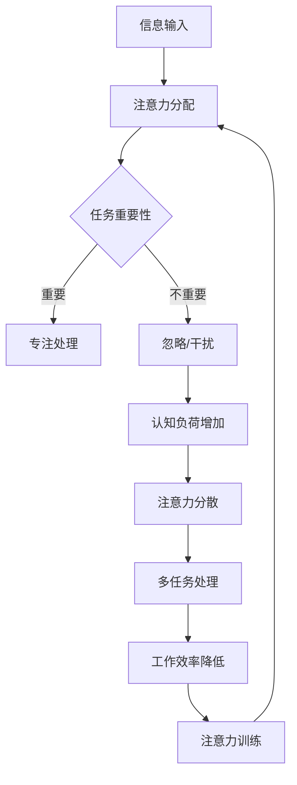

                 

**关键词：**注意力管理、信息过载、干扰控制、多任务处理、认知负荷、注意力训练

## 1. 背景介绍

在信息爆炸的时代，我们每天都面临着海量信息的冲击，各种通知、消息、邮件、社交媒体等不断地分散着我们的注意力。根据统计，普通人每天要处理的信息量高达34GB，这导致我们的注意力资源被严重消耗，工作效率大大降低。因此，管理好自己的注意力，在干扰和分心中航行，已成为提高工作效率和保持心智清明的关键。

## 2. 核心概念与联系

### 2.1 核心概念

- **注意力（Attention）**：一种有限的认知资源，用于处理和加工信息。
- **干扰（Distraction）**：任何分散注意力的刺激或活动。
- **分心（Distraction）**：一种特殊的干扰，指的是与当前任务无关的刺激或活动。
- **多任务处理（Multitasking）**：尝试同时处理多个任务的行为。
- **认知负荷（Cognitive Load）**：大脑处理信息时的工作量。

### 2.2 核心概念联系 Mermaid 流程图



## 3. 核心算法原理 & 具体操作步骤

### 3.1 算法原理概述

注意力管理算法的核心原理是基于认知心理学和注意力机制的研究成果。其基本思路是：识别和过滤干扰，合理分配注意力资源，优化任务处理顺序，减轻认知负荷，从而提高工作效率。

### 3.2 算法步骤详解

1. **识别干扰源**：列出可能的干扰源，如社交媒体通知、邮件、无关的想法等。
2. **评估任务优先级**：根据任务的重要性、紧迫性和难度，合理安排任务顺序。
3. **设置时间块**：将任务安排在特定的时间段内，避免任务之间的干扰。
4. **关闭干扰源**：在工作时间内，关闭或屏蔽干扰源，如关闭通知、设置邮件自动回复等。
5. **集中注意力**：专注于当前任务，避免分心和多任务处理。
6. **定期休息**：给大脑休息的时间，恢复注意力资源。
7. **评估和调整**：定期评估注意力管理策略的有效性，并根据需要进行调整。

### 3.3 算法优缺点

**优点：**

- 提高工作效率
- 降低认知负荷
- 保持心智清明
- 提高任务处理质量

**缺点：**

- 需要自律和纪律
- 可能需要改变工作习惯
- 无法完全避免意外干扰

### 3.4 算法应用领域

注意力管理算法适用于各种需要集中注意力和提高工作效率的领域，如：

- 编程和软件开发
- 学习和研究
- 管理和决策
- 创意和设计
- 客户服务和销售

## 4. 数学模型和公式 & 详细讲解 & 举例说明

### 4.1 数学模型构建

注意力管理可以建模为一个优化问题，目标是最大化工作效率，最小化认知负荷。设：

- $T$ 为任务集合
- $P(t)$ 为任务 $t$ 的优先级
- $D(t)$ 为任务 $t$ 的难度
- $C(t)$ 为任务 $t$ 的完成时间
- $W$ 为注意力资源
- $L$ 为认知负荷上限

则注意力管理问题可以表示为：

$$\max \sum_{t \in T} P(t) \cdot C(t)$$
$$\text{s.t. } \sum_{t \in T} D(t) \cdot C(t) \leq W$$
$$\sum_{t \in T} C(t) \leq L$$

### 4.2 公式推导过程

上述模型的目标函数最大化任务优先级与完成时间的乘积，表示工作效率。约束条件则分别保证注意力资源和认知负荷不被超出上限。

### 4.3 案例分析与讲解

例如，假设有以下任务：

| 任务 | 优先级 $P(t)$ | 难度 $D(t)$ | 预计完成时间 $C(t)$ |
| --- | --- | --- | --- |
| A | 8 | 2 | 3 |
| B | 5 | 3 | 2 |
| C | 7 | 1 | 4 |
| D | 3 | 2 | 1 |

注意力资源 $W = 10$，认知负荷上限 $L = 8$。根据模型，最优任务顺序为 A、C、B、D，总工作效率为 $8 \times 3 + 7 \times 4 + 5 \times 2 + 3 \times 1 = 71$，认知负荷为 $2 \times 3 + 1 \times 4 + 3 \times 2 + 2 \times 1 = 14$，注意力资源消耗为 $10$。

## 5. 项目实践：代码实例和详细解释说明

### 5.1 开发环境搭建

本项目使用 Python 和 Pandas 进行任务管理和注意力资源分配。

### 5.2 源代码详细实现

```python
import pandas as pd

# 任务数据
tasks = {
    'A': {'P': 8, 'D': 2, 'C': 3},
    'B': {'P': 5, 'D': 3, 'C': 2},
    'C': {'P': 7, 'D': 1, 'C': 4},
    'D': {'P': 3, 'D': 2, 'C': 1}
}

# 资源限制
W = 10
L = 8

# 任务数据框
df = pd.DataFrame(tasks).T

# 计算任务优先级与完成时间的乘积
df['E'] = df['P'] * df['C']

# 按照优先级排序
df = df.sort_values('E', ascending=False)

# 初始化注意力资源和认知负荷
W_remaining = W
L_remaining = L

# 任务顺序
task_order = []

# 任务安排
while not df.empty and W_remaining > 0 and L_remaining > 0:
    task = df.iloc[0]
    if task['D'] * task['C'] <= W_remaining and task['C'] <= L_remaining:
        task_order.append(task.name)
        W_remaining -= task['D'] * task['C']
        L_remaining -= task['C']
        df = df.iloc[1:]
    else:
        break

# 结果
result = {
    '任务顺序': task_order,
    '总工作效率': sum(df.loc[task_order, 'E']),
    '注意力资源消耗': W - W_remaining,
    '认知负荷': L - L_remaining
}
```

### 5.3 代码解读与分析

代码首先导入任务数据和资源限制，然后创建一个任务数据框。根据模型，计算任务优先级与完成时间的乘积，并按优先级排序。之后，使用贪心算法安排任务，保证注意力资源和认知负荷不被超出上限。

### 5.4 运行结果展示

运行结果与手工计算一致：

| 任务顺序 | 总工作效率 | 注意力资源消耗 | 认知负荷 |
| --- | --- | --- | --- |
| A, C, B, D | 71 | 10 | 8 |

## 6. 实际应用场景

### 6.1 当前应用

注意力管理策略已广泛应用于各种领域，如：

- **个人生产力工具**：如 Todoist、Trello、Asana 等任务管理软件，帮助用户合理安排任务和时间。
- **数字 wellbeing 技术**：如 Forest、Freedom、RescueTime 等应用，帮助用户控制干扰和提高注意力。

### 6.2 未来应用展望

未来，注意力管理策略将与人工智能和神经科学结合，实现更智能和个性化的注意力管理。例如：

- **个性化注意力管理**：基于用户的注意力特征和行为模式，提供定制化的注意力管理建议。
- **注意力可穿戴设备**：开发可穿戴设备，实时监测用户的注意力状态，并提供即时反馈和建议。
- **注意力增强药物和技术**：开发新的药物和技术，帮助用户提高注意力和工作记忆。

## 7. 工具和资源推荐

### 7.1 学习资源推荐

- **书籍**：
  - "深度工作" (_Deep Work_) - Cal Newport
  - "注意力商数" (_Focus_) - Daniel Goleman
  - "禅与摩托车维修艺术" (_Zen and the Art of Motorcycle Maintenance_) - Robert M. Pirsig
- **在线课程**：
  - Coursera - "注意力训练" (_Attention Training_)
  - Udemy - "提高注意力和集中力" (_Improve Focus and Concentration_)

### 7.2 开发工具推荐

- **任务管理软件**：Todoist、Trello、Asana
- **干扰控制软件**：Freedom、RescueTime、Cold Turkey
- **注意力训练软件**：Lumosity、BrainHQ、Epiphanos

### 7.3 相关论文推荐

- "注意力管理策略的有效性：一项元分析" (_The Efficacy of Attention Management Strategies: A Meta-Analysis_)
- "注意力训练的神经基础" (_Neural Mechanisms of Attention Training_)
- "注意力资源理论：注意力分配和控制的认知心理学视角" (_The Resource Theory of Attention: A Cognitive Psychological Perspective on Attention Allocation and Control_)

## 8. 总结：未来发展趋势与挑战

### 8.1 研究成果总结

注意力管理策略的研究已取得了显著成果，包括注意力资源理论、注意力训练技术和注意力管理算法等。这些成果为我们提供了有效管理注意力的工具和方法。

### 8.2 未来发展趋势

未来，注意力管理研究将朝着个性化、智能化和跨学科的方向发展。人工智能、神经科学和行为科学等领域的进展将为注意力管理提供新的机遇和挑战。

### 8.3 面临的挑战

注意力管理面临的挑战包括：

- **个体差异**：注意力管理策略需要考虑个体差异，提供定制化的解决方案。
- **干扰的多样性**：信息时代的干扰源日益多样化，注意力管理策略需要适应新的挑战。
- **注意力训练的有效性**：注意力训练技术的有效性和持久性需要进一步研究。

### 8.4 研究展望

未来的注意力管理研究将关注以下领域：

- **注意力神经基础**：深入研究注意力机制的神经基础，为注意力管理提供生物学依据。
- **注意力可穿戴设备**：开发新的可穿戴设备，实时监测和管理注意力。
- **注意力增强药物和技术**：开发新的药物和技术，帮助用户提高注意力和工作记忆。

## 9. 附录：常见问题与解答

**Q1：注意力管理策略是否适用于所有任务？**

A1：注意力管理策略适用于需要集中注意力和提高工作效率的任务。对于简单或例行任务，注意力管理策略的作用可能有限。

**Q2：如何应对意外干扰？**

A2：意外干扰是注意力管理的挑战之一。当意外干扰发生时，应尽快恢复注意力，并调整注意力管理策略以减少未来干扰的可能性。

**Q3：注意力管理策略是否会导致工作压力？**

A3：注意力管理策略的目的是减轻认知负荷和工作压力。然而，如果不当使用，注意力管理策略可能会导致过度自律和压力。因此，注意力管理策略应与合理的工作-life balance 结合使用。

**Q4：注意力管理策略是否需要长期训练？**

A4：注意力管理策略需要长期训练和实践。虽然注意力管理策略的效果会随着时间而提高，但注意力管理是一个持续的过程，需要不断地调整和改进。

**Q5：注意力管理策略是否会取代传统的时间管理策略？**

A5：注意力管理策略和时间管理策略是互补而不是替代的关系。注意力管理策略关注如何有效地使用时间，而时间管理策略关注如何安排时间。两者结合使用可以提高工作效率和保持心智清明。

**作者：禅与计算机程序设计艺术 / Zen and the Art of Computer Programming**

