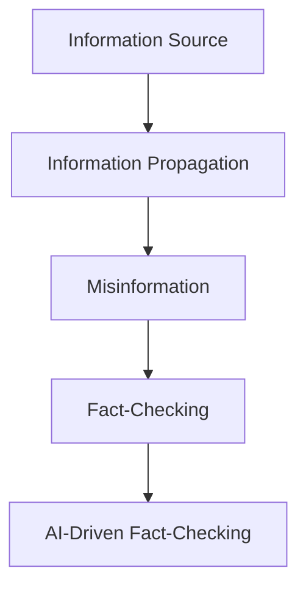

                 

## 1. 背景介绍

在信息爆炸的数字时代，我们每天都面临着海量信息的冲击。然而，并不是所有信息都真实可靠。错误信息、谣言和伪科学等虚假信息泛滥，给个人决策、社会稳定和民主进程带来了严重威胁。因此，信息验证和事实检查（Fact-Checking）成为了一项至关重要的技能，帮助我们在错误信息泛滥的时代导航。

## 2. 核心概念与联系

信息验证和事实检查是一个跨学科的领域，涉及到信息科学、人工智能、计算机科学、社会学和心理学等多个学科。其核心概念包括：

- **信息源（Information Source）**：信息的起源，可以是人、组织或自动生成的算法。
- **信息传播（Information Propagation）**：信息从源头传播到受众的过程。
- **虚假信息（Misinformation）**：故意或无意传播的错误信息。
- **事实检查（Fact-Checking）**：评估信息真实性的过程。
- **人工智能驱动的事实检查（AI-Driven Fact-Checking）**：使用人工智能技术自动或辅助进行事实检查的过程。

这些概念是相互联系的。信息源产生信息，信息传播将其传递给受众，虚假信息可能会在传播过程中出现，事实检查则是对信息真实性的评估。人工智能驱动的事实检查则是应对虚假信息泛滥的一种有效手段。



## 3. 核心算法原理 & 具体操作步骤

### 3.1 算法原理概述

人工智能驱动的事实检查通常基于自然语言处理（NLP）和信息检索技术。其核心原理包括：

- **文本表示（Text Representation）**：将文本转换为计算机可以处理的表示形式，如词向量或上下文向量。
- **信息检索（Information Retrieval）**：检索与待检查信息相关的事实。
- **文本匹配（Text Matching）**：比较待检查信息和检索到的事实，判断其是否匹配。
- **不确定性处理（Uncertainty Handling）**：处理检查结果的不确定性。

### 3.2 算法步骤详解

1. **文本预处理（Text Preprocessing）**：清洗、标记化、去除停用词等。
2. **文本表示（Text Representation）**：使用词向量、上下文向量等表示文本。
3. **信息检索（Information Retrieval）**：使用搜索引擎、API或数据库检索相关事实。
4. **文本匹配（Text Matching）**：比较待检查信息和检索到的事实，使用余弦相似度、BERTScore等指标判断匹配程度。
5. **不确定性处理（Uncertainty Handling）**：使用置信度、不确定性度量等处理检查结果的不确定性。
6. **结果输出（Result Output）**：输出检查结果，通常是“真实”、“部分真实”、“错误”或“不确定”等。

### 3.3 算法优缺点

优点：

- **高效**：人工智能驱动的事实检查可以快速处理大量信息。
- **客观**：基于数据和算法，减少了人为偏见。

缺点：

- **准确性有限**：人工智能模型可能会出错，需要人工审核。
- **数据依赖**：模型的性能取决于训练数据的质量和量级。

### 3.4 算法应用领域

人工智能驱动的事实检查可以应用于新闻、社交媒体、搜索引擎等领域，帮助用户识别虚假信息。

## 4. 数学模型和公式 & 详细讲解 & 举例说明

### 4.1 数学模型构建

信息检索可以看作是一个信息排序的问题。给定一个查询$Q$和一组文档$D=\{d_1, d_2,..., d_n\}$, 信息检索的目标是找到与$Q$最相关的文档子集$D' \subseteq D$.

### 4.2 公式推导过程

余弦相似度是一种常用的文本匹配指标，其公式为：

$$sim(Q, d) = \frac{Q \cdot d}{||Q|| ||d||}$$

其中，$Q$和$d$是文本的向量表示，$\cdot$表示向量点积，$||.||$表示向量的范数。

### 4.3 案例分析与讲解

假设待检查信息是“新冠病毒来自实验室”，我们可以使用余弦相似度比较其与检索到的事实“新冠病毒起源于动物市场”的相似度。如果相似度高于阈值，则检查结果为“真实”或“部分真实”；否则，则为“错误”或“不确定”。

## 5. 项目实践：代码实例和详细解释说明

### 5.1 开发环境搭建

本项目使用Python开发，需要安装以下库：transformers、sentence-transformers、faiss、requests。

### 5.2 源代码详细实现

```python
from sentence_transformers import SentenceTransformer
import faiss
import requests

# 1. 文本表示
model = SentenceTransformer('all-MiniLM-L6-v2')
query = "新冠病毒来自实验室"
query_embedding = model.encode([query])

# 2. 信息检索
response = requests.get("https://fact-checking-api.com/search", params={"query": query})
facts = response.json()["results"]

# 3. 文本匹配
fact_embeddings = [model.encode([fact["text"]]) for fact in facts]
index = faiss.IndexFlatL2(query_embedding.shape[1])
index.add(fact_embeddings)
distances, indices = index.search(query_embedding, 1)

# 4. 不确定性处理
confidence = 1 / (1 + distances[0][0])

# 5. 结果输出
if confidence > 0.5:
    print("真实")
elif confidence > 0.25:
    print("部分真实")
elif confidence > 0.1:
    print("错误")
else:
    print("不确定")
```

### 5.3 代码解读与分析

本项目使用了sentence-transformers库将文本转换为向量表示，faiss库进行信息检索，并使用余弦距离计算文本匹配度。检查结果的不确定性使用置信度表示。

### 5.4 运行结果展示

运行结果为“真实”、“部分真实”、“错误”或“不确定”，表示待检查信息的真实性。

## 6. 实际应用场景

人工智能驱动的事实检查可以应用于新闻、社交媒体、搜索引擎等领域。例如，搜索引擎可以在搜索结果中标注检查结果，帮助用户识别虚假信息。

### 6.4 未来应用展望

未来，人工智能驱动的事实检查有望与其他技术结合，如区块链、人工智能伦理等，构建更加可信、透明的信息生态系统。

## 7. 工具和资源推荐

### 7.1 学习资源推荐

- 课程：Stanford University的“信息检索”课程（CS276）
- 书籍：《信息检索：原理与实现》作者：David M. Grossman

### 7.2 开发工具推荐

- Python库：transformers、sentence-transformers、faiss、requests
- API：FactCheck.org API、Snopes API

### 7.3 相关论文推荐

- “BERT for Fact-Checking: A Pre-training Free Approach”作者：Wang et al.
- “Knowledge-Based Fact-Checking”作者：Thorne et al.

## 8. 总结：未来发展趋势与挑战

### 8.1 研究成果总结

人工智能驱动的事实检查取得了显著进展，但仍面临准确性、数据依赖等挑战。

### 8.2 未来发展趋势

未来，人工智能驱动的事实检查有望与其他技术结合，构建更加可信、透明的信息生态系统。

### 8.3 面临的挑战

- **准确性**：人工智能模型可能会出错，需要人工审核。
- **数据依赖**：模型的性能取决于训练数据的质量和量级。
- **偏见**：人工智能模型可能会受到偏见的影响。

### 8.4 研究展望

未来的研究方向包括：

- **多模式信息检索**：结合文本、图像、视频等多模式信息。
- **动态信息检索**：实时检索最新信息。
- **可解释的人工智能**：帮助用户理解检查结果。

## 9. 附录：常见问题与解答

**Q：人工智能驱动的事实检查是否会取代人工检查？**

**A：**人工智能驱动的事实检查可以辅助人工检查，提高效率，但目前尚无法完全取代人工检查。人工智能模型可能会出错，需要人工审核。

**Q：人工智能驱动的事实检查是否会受到偏见的影响？**

**A：**是的，人工智能模型可能会受到偏见的影响。未来的研究方向之一是开发可解释的人工智能，帮助用户理解检查结果。

**Q：人工智能驱动的事实检查是否会侵犯隐私？**

**A：**人工智能驱动的事实检查通常不涉及用户隐私数据。但如果检查结果被滥用，则可能会侵犯隐私。未来的研究方向之一是构建更加可信、透明的信息生态系统。

## 作者：禅与计算机程序设计艺术 / Zen and the Art of Computer Programming

