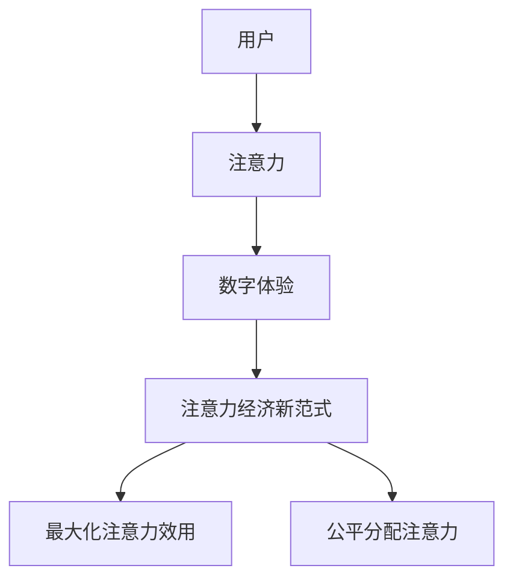

                 

## 1. 背景介绍

元宇宙（Metaverse）是一个由虚拟现实和增强现实驱动的网络，它正在改变我们与数字世界互动的方式。在这个新兴的数字空间中，注意力是一种稀缺资源，也是一种有价值的商品。因此，我们需要一种新的注意力经济范式来管理和分配注意力，以实现最大化效用和公平性。

## 2. 核心概念与联系

### 2.1 注意力经济

注意力经济是指在数字环境中，注意力作为一种有限资源而被分配和交易的经济模型。在元宇宙中，注意力是一种关键资源，因为它是用户参与和互动的前提。注意力经济的目标是最大化注意力的效用，并确保注意力的公平分配。

### 2.2 元宇宙中的注意力

在元宇宙中，注意力是用户与数字环境互动的关键因素。用户的注意力被各种数字体验竞争，从虚拟现实游戏到增强现实广告。因此，管理和分配注意力变得至关重要。

### 2.3 注意力经济新范式

注意力经济新范式是指在元宇宙中管理和分配注意力的新模型。它考虑到元宇宙的独特特性，如虚拟现实和增强现实，并旨在实现最大化注意力效用和公平性。



## 3. 核心算法原理 & 具体操作步骤

### 3.1 算法原理概述

注意力经济新范式的核心是一种基于机器学习的算法，它能够预测用户的注意力分配，并优化数字体验以最大化注意力效用。该算法基于用户的行为数据和注意力模型构建。

### 3.2 算法步骤详解

1. **数据收集**：收集用户的行为数据，包括用户与数字体验的互动方式、注意力持续时间等。
2. **注意力模型构建**：基于收集的数据，构建注意力模型，预测用户的注意力分配。
3. **优化数字体验**：根据注意力模型，优化数字体验，以最大化注意力效用。
4. **反馈和迭代**：收集用户的反馈，并根据反馈迭代注意力模型和数字体验。

### 3.3 算法优缺点

**优点**：该算法能够预测用户的注意力分配，并优化数字体验以最大化注意力效用。它还可以帮助实现注意力的公平分配。

**缺点**：该算法需要大量的用户行为数据，并依赖于注意力模型的准确性。此外，它可能会导致数字体验的同质化，因为所有体验都旨在最大化注意力效用。

### 3.4 算法应用领域

该算法可以应用于各种元宇宙场景，从虚拟现实游戏到增强现实广告。它可以帮助开发者设计更有吸引力的数字体验，并帮助广告商更有效地分配广告预算。

## 4. 数学模型和公式 & 详细讲解 & 举例说明

### 4.1 数学模型构建

注意力模型可以使用回归分析或机器学习算法构建。假设用户的注意力分配可以表示为以下函数：

$$A = f(X, \theta)$$

其中，$A$表示用户的注意力分配，$X$表示用户的行为数据，$\theta$表示注意力模型的参数。

### 4.2 公式推导过程

注意力模型的参数$\theta$可以通过最小化以下损失函数来学习：

$$L(\theta) = \sum_{i=1}^{n} (A_i - f(X_i, \theta))^2$$

其中，$n$表示用户数，$A_i$表示第$i$个用户的注意力分配，$X_i$表示第$i$个用户的行为数据。

### 4.3 案例分析与讲解

例如，假设我们要构建一个注意力模型来预测用户在虚拟现实游戏中的注意力分配。我们可以收集用户的行为数据，如游戏时间、击杀数、死亡次数等。然后，我们可以使用回归分析或机器学习算法构建注意力模型，预测用户的注意力分配。最后，我们可以根据注意力模型优化游戏设计，以最大化注意力效用。

## 5. 项目实践：代码实例和详细解释说明

### 5.1 开发环境搭建

我们将使用Python和Scikit-learn库来构建注意力模型。我们需要安装以下软件包：

- Python 3.8+
- Scikit-learn 0.24+
- Pandas 1.1+
- NumPy 1.20+

### 5.2 源代码详细实现

以下是注意力模型的Python实现代码：

```python
import pandas as pd
from sklearn.model_selection import train_test_split
from sklearn.linear_model import LinearRegression
from sklearn.metrics import mean_squared_error

# 加载用户行为数据
data = pd.read_csv('user_data.csv')

# 提取特征和目标变量
X = data[['game_time', 'kills', 'deaths']]
y = data['attention']

# 将数据分为训练集和测试集
X_train, X_test, y_train, y_test = train_test_split(X, y, test_size=0.2, random_state=42)

# 创建线性回归模型
model = LinearRegression()

# 训练模型
model.fit(X_train, y_train)

# 预测注意力分配
y_pred = model.predict(X_test)

# 评估模型
mse = mean_squared_error(y_test, y_pred)
print(f'Mean Squared Error: {mse}')
```

### 5.3 代码解读与分析

这段代码使用线性回归算法构建注意力模型。它首先加载用户行为数据，然后提取特征和目标变量。接着，它将数据分为训练集和测试集。然后，它创建线性回归模型，并使用训练集训练模型。最后，它使用测试集预测注意力分配，并评估模型的性能。

### 5.4 运行结果展示

运行这段代码后，您会看到均方误差（Mean Squared Error，MSE）的值。MSE越小，模型的性能越好。您可以根据MSE的值调整模型的参数，以改善模型的性能。

## 6. 实际应用场景

### 6.1 注意力经济新范式在虚拟现实游戏中的应用

在虚拟现实游戏中，注意力经济新范式可以帮助开发者设计更有吸引力的游戏。开发者可以使用注意力模型预测用户的注意力分配，并优化游戏设计以最大化注意力效用。例如，开发者可以调整游戏难度，以匹配用户的注意力水平。

### 6.2 注意力经济新范式在增强现实广告中的应用

在增强现实广告中，注意力经济新范式可以帮助广告商更有效地分配广告预算。广告商可以使用注意力模型预测用户的注意力分配，并优化广告设计以最大化注意力效用。例如，广告商可以调整广告的大小和位置，以匹配用户的注意力水平。

### 6.3 未来应用展望

随着元宇宙的发展，注意力经济新范式的应用将会扩展到更多领域。例如，它可以应用于虚拟会议，帮助主持人设计更有吸引力的会议。它还可以应用于虚拟教育，帮助教师设计更有效的教学材料。

## 7. 工具和资源推荐

### 7.1 学习资源推荐

- "Attention Is All You Need"（https://arxiv.org/abs/1706.03762）：这篇论文介绍了注意力机制的原理和应用。
- "The Attention Economy"（https://www.economist.com/leaders/2017/05/06/the-attention-economy）：这篇文章介绍了注意力经济的概念和应用。

### 7.2 开发工具推荐

- Python：Python是一种流行的编程语言，它有丰富的库和工具，可以用于构建注意力模型。
- Scikit-learn：Scikit-learn是一个流行的机器学习库，它提供了构建注意力模型所需的工具。

### 7.3 相关论文推荐

- "DeepMind's AlphaGo Zero"（https://arxiv.org/abs/1702.01815）：这篇论文介绍了注意力机制在强化学习中的应用。
- "Facebook's DeepText"（https://arxiv.org/abs/1609.06035）：这篇论文介绍了注意力机制在自然语言处理中的应用。

## 8. 总结：未来发展趋势与挑战

### 8.1 研究成果总结

在本文中，我们介绍了注意力经济新范式，它是一种管理和分配元宇宙中注意力的新模型。我们还介绍了注意力经济新范式的核心算法原理，并提供了一个Python实现的代码示例。

### 8.2 未来发展趋势

随着元宇宙的发展，注意力经济新范式的应用将会扩展到更多领域。我们预计注意力经济新范式将会与其他技术，如区块链和人工智能，结合起来，创造出更多的应用。

### 8.3 面临的挑战

注意力经济新范式面临的主要挑战是数据隐私和注意力模型的准确性。我们需要开发出更好的数据保护机制，并改进注意力模型的准确性。

### 8.4 研究展望

我们计划在未来的研究中，探索注意力经济新范式与其他技术的结合，并开发出更好的数据保护机制。我们还计划开发出更准确的注意力模型，以改善注意力经济新范式的性能。

## 9. 附录：常见问题与解答

**Q1：注意力经济新范式与传统注意力经济有何不同？**

**A1：传统注意力经济主要关注数字广告和社交媒体，而注意力经济新范式则关注元宇宙中的注意力分配和管理。**

**Q2：注意力经济新范式的算法原理是什么？**

**A2：注意力经济新范式的核心是一种基于机器学习的算法，它能够预测用户的注意力分配，并优化数字体验以最大化注意力效用。**

**Q3：注意力经济新范式的应用领域有哪些？**

**A3：注意力经济新范式可以应用于各种元宇宙场景，从虚拟现实游戏到增强现实广告。**

**Q4：注意力经济新范式面临的挑战是什么？**

**A4：注意力经济新范式面临的主要挑战是数据隐私和注意力模型的准确性。**

**Q5：未来注意力经济新范式的研究方向是什么？**

**A5：未来注意力经济新范式的研究方向包括与其他技术的结合，开发更好的数据保护机制，并改进注意力模型的准确性。**

## 作者：禅与计算机程序设计艺术 / Zen and the Art of Computer Programming

