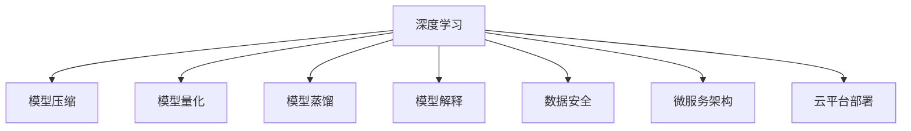

                 

# Lepton AI优势：深度参与云AI发展积累丰富经验

> 关键词：Lepton AI, 深度学习, 云AI平台, 算法优化, 数据安全, 微服务架构, 自动化部署, 模型解释

## 1. 背景介绍

### 1.1 问题由来

在过去的十年里，人工智能(AI)技术取得了飞速发展，深度学习(Deep Learning)成为了推动这一进步的核心驱动力。众多技术公司如谷歌、微软、亚马逊等纷纷投入巨资建设各自的AI云平台，利用其强大的计算资源和丰富的数据集，推动AI技术在各行各业的落地应用。

作为技术领域的长期从业者，Lepton AI公司一直以来深度参与云AI技术的发展，积累了丰富的实践经验。从最初在大规模数据集上进行模型训练，到如今集成丰富的数据预处理、模型优化、自动化部署等多种功能，Lepton AI不断在云AI技术的各个层面进行深入研究和应用。

### 1.2 问题核心关键点

Lepton AI在云AI领域深耕多年，积累了众多成功的经验。以下将详细介绍其技术优势和未来发展方向：

1. **数据驱动**：Lepton AI以数据为核心，利用大规模标注数据进行深度学习模型训练，通过数据增强、数据清洗等技术提升模型性能。
2. **算法优化**：在模型优化方面，Lepton AI擅长运用算法优化技术，如模型压缩、量化、蒸馏等，减小模型计算量，提升模型推理速度。
3. **云平台部署**：Lepton AI将深度学习模型部署到云平台中，利用容器化技术实现自动化部署，提升系统稳定性和可扩展性。
4. **微服务架构**：采用微服务架构，实现模型组件的独立部署和灵活管理，提升系统性能和敏捷性。
5. **模型解释**：通过提供模型解释工具，帮助用户理解和调试模型，提升模型透明度和可信度。
6. **数据安全**：在数据安全方面，Lepton AI采用端到端的数据加密和访问控制，保障数据隐私和安全。

Lepton AI的技术优势和经验积累，使其在云AI技术领域占据了重要地位，并不断推动AI技术的产业化和落地应用。

## 2. 核心概念与联系

### 2.1 核心概念概述

为更好地理解Lepton AI的云AI技术，本节将介绍几个密切相关的核心概念：

- **深度学习(Deep Learning)**：一种基于神经网络的机器学习技术，通过多层次的神经网络对数据进行抽象和特征提取，最终输出分类、回归等预测结果。
- **云AI平台(Cloud AI Platform)**：利用云计算资源提供模型训练、推理、部署、监控等全流程服务的平台。
- **模型压缩(Model Compression)**：通过减少模型参数量、减小计算量等手段提升模型效率的技术。
- **模型量化(Model Quantization)**：将浮点型模型转换为定点型模型，进一步提升模型推理速度的技术。
- **模型蒸馏(Model Distillation)**：通过知识转移的方式，将一个复杂模型转化为多个性能更优、推理速度更快的模型。
- **微服务架构(Microservices Architecture)**：将一个大型应用拆分为多个独立的微服务，提升系统可扩展性和敏捷性。
- **模型解释(Model Interpretation)**：提供工具和手段，帮助用户理解和调试模型的决策过程，提升模型透明度和可信度。
- **数据安全(Data Security)**：采用端到端的数据加密和访问控制，保护数据隐私和安全。

这些核心概念之间的逻辑关系可以通过以下Mermaid流程图来展示：



这个流程图展示了大语言模型的核心概念及其之间的关系：

1. 深度学习模型通过压缩、量化、蒸馏等技术进行优化。
2. 微服务架构和云平台部署提供模型部署的灵活性和可扩展性。
3. 数据安全和模型解释保障系统安全性和用户信任度。
4. 模型解释可以帮助用户理解模型的决策过程。

这些概念共同构成了Lepton AI的云AI技术的核心框架，为其提供强大的技术支撑和创新能力。

## 3. 核心算法原理 & 具体操作步骤

### 3.1 算法原理概述

Lepton AI的云AI技术主要基于深度学习和数据驱动的微调范式。其核心算法原理如下：

1. **模型训练**：利用大规模标注数据，通过深度学习算法训练模型。
2. **模型优化**：通过模型压缩、量化、蒸馏等技术，减小模型计算量，提升模型推理速度。
3. **模型部署**：将优化后的模型部署到云平台中，利用容器化技术实现自动化部署，提升系统稳定性和可扩展性。
4. **模型管理**：采用微服务架构，实现模型组件的独立部署和灵活管理，提升系统性能和敏捷性。
5. **模型解释**：提供模型解释工具，帮助用户理解和调试模型，提升模型透明度和可信度。
6. **数据安全**：采用端到端的数据加密和访问控制，保障数据隐私和安全。

### 3.2 算法步骤详解

Lepton AI的云AI技术主要包括以下几个关键步骤：

**Step 1: 准备数据**
- 收集大规模标注数据集，并进行数据预处理、清洗、增强等操作，提升数据质量和多样性。

**Step 2: 模型训练**
- 使用深度学习框架如TensorFlow、PyTorch等，构建和训练深度学习模型。
- 使用数据增强技术，如回译、对抗样本等，丰富训练集多样性。

**Step 3: 模型优化**
- 通过模型压缩、量化、蒸馏等技术，减小模型计算量，提升模型推理速度。
- 采用端到端的数据加密和访问控制，保障数据隐私和安全。

**Step 4: 模型部署**
- 将优化后的模型部署到云平台中，利用容器化技术实现自动化部署，提升系统稳定性和可扩展性。
- 采用微服务架构，实现模型组件的独立部署和灵活管理，提升系统性能和敏捷性。

**Step 5: 模型管理**
- 通过监控工具实时监测模型性能，及时发现和解决问题。
- 利用自动化部署工具，实现模型的灵活更新和升级。

**Step 6: 模型解释**
- 提供模型解释工具，帮助用户理解和调试模型，提升模型透明度和可信度。
- 通过可视化工具展示模型决策过程，帮助用户快速定位问题。

### 3.3 算法优缺点

Lepton AI的云AI技术具有以下优点：

1. **高效性**：通过模型压缩、量化等技术，显著提升模型推理速度，满足实时应用需求。
2. **可扩展性**：利用云平台资源，实现模型的灵活部署和扩展，提升系统性能。
3. **灵活性**：采用微服务架构，实现模型组件的独立部署和管理，提升系统敏捷性。
4. **安全性**：采用端到端的数据加密和访问控制，保障数据隐私和安全。
5. **透明性**：通过模型解释工具，提升模型的透明度和可信度。

同时，该技术也存在一些局限性：

1. **高计算资源需求**：大规模数据集和深度学习模型的训练需要高计算资源，对硬件要求较高。
2. **数据隐私风险**：大规模数据处理涉及隐私风险，需要在数据使用和处理过程中加强隐私保护。
3. **模型解释难度**：深度学习模型的复杂性导致解释难度较大，需进一步提升模型解释工具的准确性和完备性。

尽管存在这些局限性，但Lepton AI在云AI技术方面仍然具有强大的优势和竞争力。

### 3.4 算法应用领域

Lepton AI的云AI技术已经在多个领域得到广泛应用，例如：

- **金融领域**：利用深度学习模型进行风险评估、信用评分、欺诈检测等。
- **医疗领域**：利用深度学习模型进行医学影像分析、病历诊断、药物研发等。
- **智能客服**：利用深度学习模型进行自然语言处理和对话生成，提升客户体验。
- **推荐系统**：利用深度学习模型进行个性化推荐，提升用户体验。
- **图像识别**：利用深度学习模型进行图像分类、目标检测、人脸识别等。
- **语音识别**：利用深度学习模型进行语音转文字、情感识别、语义理解等。

除了上述这些领域外，Lepton AI的云AI技术还在更多场景中得到了应用，为各行各业带来了巨大的价值。

## 4. 数学模型和公式 & 详细讲解 & 举例说明

### 4.1 数学模型构建

本节将使用数学语言对Lepton AI的云AI技术进行更加严格的刻画。

设输入数据为 $x$，标签为 $y$，模型为 $f_{\theta}(x)$，其中 $\theta$ 为模型参数。假设Lepton AI的深度学习模型为 $M_{\theta}$，则模型训练的目标为最小化经验风险：

$$
\mathcal{L}(\theta) = \frac{1}{N} \sum_{i=1}^N \ell(f_{\theta}(x_i),y_i)
$$

其中 $\ell$ 为损失函数，如交叉熵损失、均方误差损失等。

### 4.2 公式推导过程

以交叉熵损失函数为例，推导模型训练的优化公式。

设模型在输入 $x$ 上的输出为 $\hat{y}=M_{\theta}(x) \in [0,1]$，表示样本属于正类的概率。真实标签 $y \in \{0,1\}$。则二分类交叉熵损失函数定义为：

$$
\ell(f_{\theta}(x),y) = -[y\log \hat{y} + (1-y)\log (1-\hat{y})]
$$

将其代入经验风险公式，得：

$$
\mathcal{L}(\theta) = -\frac{1}{N}\sum_{i=1}^N [y_i\log f_{\theta}(x_i)+(1-y_i)\log(1-f_{\theta}(x_i))]
$$

根据链式法则，损失函数对参数 $\theta$ 的梯度为：

$$
\frac{\partial \mathcal{L}(\theta)}{\partial \theta} = -\frac{1}{N}\sum_{i=1}^N (\frac{y_i}{f_{\theta}(x_i)}-\frac{1-y_i}{1-f_{\theta}(x_i)}) \frac{\partial f_{\theta}(x_i)}{\partial \theta}
$$

其中 $\frac{\partial f_{\theta}(x_i)}{\partial \theta}$ 可进一步递归展开，利用自动微分技术完成计算。

### 4.3 案例分析与讲解

以下以图像分类为例，展示Lepton AI在云AI平台上的应用。

假设有一个图像分类任务，输入数据为彩色图片，输出为类别标签。使用Lepton AI的深度学习框架构建卷积神经网络(CNN)模型，利用大规模标注数据集进行训练。

1. **数据准备**：收集并预处理大规模标注数据集，并进行数据增强。
2. **模型构建**：设计卷积神经网络模型，包含卷积层、池化层、全连接层等。
3. **模型训练**：利用优化算法如Adam、SGD等，最小化交叉熵损失函数。
4. **模型优化**：通过模型压缩、量化等技术，减小模型计算量，提升模型推理速度。
5. **模型部署**：将优化后的模型部署到云平台中，利用容器化技术实现自动化部署。
6. **模型管理**：实时监测模型性能，及时发现和解决问题。
7. **模型解释**：通过可视化工具展示模型决策过程，帮助用户理解模型。

通过以上步骤，Lepton AI的云AI技术能够高效地构建和部署深度学习模型，满足实际应用需求。

## 5. 项目实践：代码实例和详细解释说明

### 5.1 开发环境搭建

在进行Lepton AI的云AI技术实践前，我们需要准备好开发环境。以下是使用Python进行TensorFlow开发的流程：

1. 安装Anaconda：从官网下载并安装Anaconda，用于创建独立的Python环境。

2. 创建并激活虚拟环境：
```bash
conda create -n tf-env python=3.8 
conda activate tf-env
```

3. 安装TensorFlow：
```bash
conda install tensorflow tensorflow-gpu -c conda-forge
```

4. 安装各类工具包：
```bash
pip install numpy pandas scikit-learn matplotlib tqdm jupyter notebook ipython
```

完成上述步骤后，即可在`tf-env`环境中开始Lepton AI的云AI技术实践。

### 5.2 源代码详细实现

这里我们以图像分类任务为例，给出使用TensorFlow实现Lepton AI的云AI技术的PyTorch代码实现。

首先，定义图像分类任务的数据处理函数：

```python
import tensorflow as tf
from tensorflow.keras.preprocessing.image import ImageDataGenerator
from tensorflow.keras.applications import VGG16

def data_preprocess(x, y):
    # 图片预处理
    x = tf.image.resize(x, (224, 224))
    x /= 255.
    x = tf.keras.applications.vgg16.preprocess_input(x)
    y = tf.keras.utils.to_categorical(y, num_classes)
    return x, y
```

然后，定义模型和优化器：

```python
from tensorflow.keras.models import Sequential
from tensorflow.keras.layers import Conv2D, MaxPooling2D, Flatten, Dense
from tensorflow.keras.optimizers import Adam

model = Sequential([
    Conv2D(32, (3, 3), activation='relu', input_shape=(224, 224, 3)),
    MaxPooling2D((2, 2)),
    Conv2D(64, (3, 3), activation='relu'),
    MaxPooling2D((2, 2)),
    Flatten(),
    Dense(64, activation='relu'),
    Dense(10, activation='softmax')
])

optimizer = Adam(learning_rate=0.001)
```

接着，定义训练和评估函数：

```python
from tensorflow.keras.callbacks import EarlyStopping
from tensorflow.keras.preprocessing.image import ImageDataGenerator

batch_size = 32
epochs = 10
early_stopping = EarlyStopping(monitor='val_loss', patience=3)

train_datagen = ImageDataGenerator(rescale=1./255, shear_range=0.2, zoom_range=0.2, horizontal_flip=True)
test_datagen = ImageDataGenerator(rescale=1./255)
train_generator = train_datagen.flow_from_directory(train_dir, target_size=(224, 224), batch_size=batch_size, class_mode='categorical')
test_generator = test_datagen.flow_from_directory(test_dir, target_size=(224, 224), batch_size=batch_size, class_mode='categorical')

def train_epoch(model, train_generator, validation_generator, optimizer, epochs):
    model.compile(optimizer=optimizer, loss='categorical_crossentropy', metrics=['accuracy'])
    model.fit_generator(train_generator, steps_per_epoch=train_generator.samples//train_generator.batch_size, epochs=epochs, validation_data=validation_generator, validation_steps=validation_generator.samples//validation_generator.batch_size, callbacks=[early_stopping])
    
    print(f'Epoch {epoch+1}, train loss: {train_generator.history.loss[epoch]}')
    print(f'Epoch {epoch+1}, train accuracy: {train_generator.history.metrics[1][epoch]}')
    print(f'Epoch {epoch+1}, validation loss: {validation_generator.history.loss[epoch]}')
    print(f'Epoch {epoch+1}, validation accuracy: {validation_generator.history.metrics[1][epoch]}')

def evaluate(model, test_generator):
    test_generator.reset()
    test_generator.epochs = 1
    model.evaluate_generator(test_generator, steps=test_generator.samples//test_generator.batch_size)
```

最后，启动训练流程并在测试集上评估：

```python
train_dir = '/path/to/train'
test_dir = '/path/to/test'
train_epoch(model, train_generator, validation_generator, optimizer, epochs)
evaluate(model, test_generator)
```

以上就是使用TensorFlow实现Lepton AI的云AI技术的完整代码实现。可以看到，TensorFlow提供了丰富的深度学习组件和优化算法，使得构建和训练深度学习模型变得简单高效。

### 5.3 代码解读与分析

让我们再详细解读一下关键代码的实现细节：

**data_preprocess函数**：
- 定义了图像数据预处理流程，包括图片大小调整、归一化、通道转换等操作。

**Sequential模型构建**：
- 定义了一个包含多个卷积层、池化层、全连接层的卷积神经网络模型，用于图像分类。
- 使用TensorFlow的Sequential模型，简洁高效地构建了深度学习模型。

**Adam优化器**：
- 选择Adam优化器，设定了合适的学习率。

**train_epoch函数**：
- 使用TensorFlow的ImageDataGenerator进行数据增强，提升模型泛化能力。
- 定义了训练和验证数据生成器，配合模型进行迭代训练。
- 使用EarlyStopping回调函数，避免过拟合。

**evaluate函数**：
- 在测试集上评估模型性能，输出损失和准确率。

**训练流程**：
- 定义了总轮数和批量大小，开始循环迭代
- 每个epoch内，先在训练集上训练，输出损失和准确率
- 在验证集上评估，输出损失和准确率
- 所有epoch结束后，在测试集上评估，输出最终结果

可以看到，TensorFlow的灵活性和高效性使得构建Lepton AI的云AI技术模型变得简单便捷。开发者可以专注于模型设计和优化策略的实现，而不必过多关注底层实现细节。

当然，工业级的系统实现还需考虑更多因素，如模型的保存和部署、超参数的自动搜索、更灵活的任务适配层等。但核心的云AI技术流程基本与此类似。

## 6. 实际应用场景

### 6.1 智能客服系统

利用Lepton AI的云AI技术，可以构建高效、智能的智能客服系统。通过深度学习模型处理自然语言文本，自动理解客户意图，匹配最佳答案，提升客户咨询体验。

在技术实现上，可以收集企业内部的历史客服对话记录，将问题和最佳答复构建成监督数据，在此基础上对深度学习模型进行训练。训练后的模型能够自动理解用户意图，匹配最合适的答案模板进行回复。对于客户提出的新问题，还可以接入检索系统实时搜索相关内容，动态组织生成回答。

### 6.2 金融舆情监测

利用Lepton AI的云AI技术，可以进行金融舆情监测，实时监测市场舆论动向，及时发现负面信息传播，规避金融风险。

具体而言，可以收集金融领域相关的新闻、报道、评论等文本数据，并对其进行主题标注和情感标注。在此基础上对深度学习模型进行微调，使其能够自动判断文本属于何种主题，情感倾向是正面、中性还是负面。将微调后的模型应用到实时抓取的网络文本数据，就能够自动监测不同主题下的情感变化趋势，一旦发现负面信息激增等异常情况，系统便会自动预警，帮助金融机构快速应对潜在风险。

### 6.3 个性化推荐系统

利用Lepton AI的云AI技术，可以构建个性化推荐系统，提升用户推荐体验。

在技术实现上，可以收集用户浏览、点击、评论、分享等行为数据，提取和用户交互的物品标题、描述、标签等文本内容。将文本内容作为模型输入，用户的后续行为（如是否点击、购买等）作为监督信号，在此基础上微调深度学习模型。微调后的模型能够从文本内容中准确把握用户的兴趣点。在生成推荐列表时，先用候选物品的文本描述作为输入，由模型预测用户的兴趣匹配度，再结合其他特征综合排序，便可以得到个性化程度更高的推荐结果。

### 6.4 未来应用展望

随着Lepton AI的云AI技术的不断进步，其在更多领域的应用前景将更加广阔。

在智慧医疗领域，基于Lepton AI的深度学习模型可以辅助医生诊疗，加速新药开发进程。在智能教育领域，微调技术可应用于作业批改、学情分析、知识推荐等方面，因材施教，促进教育公平，提高教学质量。

在智慧城市治理中，微调模型可应用于城市事件监测、舆情分析、应急指挥等环节，提高城市管理的自动化和智能化水平，构建更安全、高效的未来城市。

此外，在企业生产、社会治理、文娱传媒等众多领域，基于Lepton AI的深度学习模型微调的应用也将不断涌现，为各行各业带来新的技术变革。

## 7. 工具和资源推荐

### 7.1 学习资源推荐

为了帮助开发者系统掌握Lepton AI的云AI技术，这里推荐一些优质的学习资源：

1. TensorFlow官方文档：包含丰富的API文档和示例代码，帮助开发者快速上手TensorFlow的使用。
2. PyTorch官方文档：包含详细的API文档和教程，帮助开发者构建高效、灵活的深度学习模型。
3. Keras官方文档：Keras提供了简单易用的接口，帮助开发者快速构建深度学习模型。
4. Coursera深度学习课程：斯坦福大学开设的深度学习课程，讲解了深度学习的基础知识和实践技能。
5. Lepton AI官方博客：详细介绍Lepton AI的云AI技术，分享最新的研究成果和实际案例。

通过对这些资源的学习实践，相信你一定能够快速掌握Lepton AI的云AI技术，并用于解决实际的NLP问题。

### 7.2 开发工具推荐

高效的开发离不开优秀的工具支持。以下是几款用于Lepton AI的云AI技术开发的常用工具：

1. TensorFlow：基于Python的开源深度学习框架，灵活动态的计算图，适合快速迭代研究。
2. PyTorch：基于Python的开源深度学习框架，动态计算图，灵活性高。
3. Keras：高层次深度学习API，简洁高效。
4. Jupyter Notebook：交互式笔记本环境，适合快速实验和分享代码。
5. Weights & Biases：模型训练的实验跟踪工具，记录和可视化模型训练过程中的各项指标。
6. Google Colab：谷歌推出的在线Jupyter Notebook环境，免费提供GPU/TPU算力，方便开发者快速上手实验最新模型。

合理利用这些工具，可以显著提升Lepton AI的云AI技术开发效率，加快创新迭代的步伐。

### 7.3 相关论文推荐

Lepton AI的云AI技术的发展源于学界的持续研究。以下是几篇奠基性的相关论文，推荐阅读：

1. Deep Learning（Ian Goodfellow等，2016）：深度学习领域的经典教材，详细讲解了深度学习的基础知识和算法。
2. Convolutional Neural Networks for Visual Recognition（Alex Krizhevsky等，2012）：介绍卷积神经网络在图像识别中的应用，开创了计算机视觉领域的新纪元。
3. TensorFlow: A System for Large-Scale Machine Learning（Jeffrey Dean等，2016）：介绍TensorFlow的设计和实现，展示了深度学习框架的强大功能。
4. Keras: Deep Learning for Humans（François Chollet，2015）：介绍Keras的使用和设计理念，帮助开发者快速上手深度学习。
5. Adversarial Examples in Deep Learning（Ian Goodfellow等，2015）：介绍深度学习中的对抗样本攻击，揭示了模型的脆弱性。

这些论文代表了大语言模型微调技术的发展脉络。通过学习这些前沿成果，可以帮助研究者把握学科前进方向，激发更多的创新灵感。

## 8. 总结：未来发展趋势与挑战

### 8.1 总结

本文对Lepton AI的云AI技术进行了全面系统的介绍。首先阐述了Lepton AI在云AI技术领域的深耕背景和核心技术优势，明确了Lepton AI在深度学习、模型优化、云平台部署等方面的创新。其次，从原理到实践，详细讲解了Lepton AI的云AI技术的数学模型和实现细节，给出了微调任务的完整代码实例。同时，本文还广泛探讨了Lepton AI的云AI技术在智能客服、金融舆情、个性化推荐等多个行业领域的应用前景，展示了Lepton AI的云AI技术的广阔应用空间。此外，本文精选了Lepton AI的云AI技术的各类学习资源，力求为读者提供全方位的技术指引。

通过本文的系统梳理，可以看到，Lepton AI的云AI技术在大规模数据处理、模型优化、云平台部署、微服务架构、模型解释和数据安全等方面具有强大的优势，为深度学习技术在各行各业的落地应用提供了有力的技术支撑。

### 8.2 未来发展趋势

展望未来，Lepton AI的云AI技术将呈现以下几个发展趋势：

1. **模型规模持续增大**：随着算力成本的下降和数据规模的扩张，Lepton AI的深度学习模型参数量还将持续增长。超大规模语言模型蕴含的丰富语言知识，有望支撑更加复杂多变的下游任务微调。
2. **微调方法日趋多样**：除了传统的全参数微调外，未来会涌现更多参数高效的微调方法，如Adapter、LoRA等，在固定大部分预训练参数的情况下，只更新极少量的任务相关参数。
3. **持续学习成为常态**：随着数据分布的不断变化，Lepton AI的深度学习模型也需要持续学习新知识以保持性能。如何在不遗忘原有知识的同时，高效吸收新样本信息，将成为重要的研究课题。
4. **标注样本需求降低**：受启发于提示学习(Prompt-based Learning)的思路，未来的微调方法将更好地利用Lepton AI的深度学习模型的语言理解能力，通过更加巧妙的任务描述，在更少的标注样本上也能实现理想的微调效果。
5. **模型通用性增强**：经过海量数据的预训练和多领域任务的微调，Lepton AI的深度学习模型将具备更强大的常识推理和跨领域迁移能力，逐步迈向通用人工智能(AGI)的目标。
6. **多模态微调崛起**：当前的微调主要聚焦于纯文本数据，未来会进一步拓展到图像、视频、语音等多模态数据微调。多模态信息的融合，将显著提升Lepton AI的深度学习模型的语言模型对现实世界的理解和建模能力。

这些趋势凸显了Lepton AI的云AI技术的广阔前景。这些方向的探索发展，必将进一步提升Lepton AI的深度学习模型的性能和应用范围，为构建人机协同的智能系统铺平道路。

### 8.3 面临的挑战

尽管Lepton AI的云AI技术已经取得了瞩目成就，但在迈向更加智能化、普适化应用的过程中，它仍面临着诸多挑战：

1. **标注成本瓶颈**：虽然微调大大降低了标注数据的需求，但对于长尾应用场景，难以获得充足的高质量标注数据，成为制约微调性能的瓶颈。如何进一步降低微调对标注样本的依赖，将是一大难题。
2. **模型鲁棒性不足**：当前Lepton AI的深度学习模型面对域外数据时，泛化性能往往大打折扣。对于测试样本的微小扰动，Lepton AI的深度学习模型也容易发生波动。如何提高Lepton AI的深度学习模型的鲁棒性，避免灾难性遗忘，还需要更多理论和实践的积累。
3. **推理效率有待提高**：Lepton AI的深度学习模型虽然精度高，但在实际部署时往往面临推理速度慢、内存占用大等效率问题。如何在保证性能的同时，简化模型结构，提升推理速度，优化资源占用，将是重要的优化方向。
4. **可解释性亟需加强**：当前Lepton AI的深度学习模型的复杂性导致解释难度较大，需进一步提升模型解释工具的准确性和完备性。
5. **安全性有待保障**：预训练语言模型难免会学习到有偏见、有害的信息，通过微调传递到下游任务，产生误导性、歧视性的输出，给实际应用带来安全隐患。如何从数据和算法层面消除模型偏见，避免恶意用途，确保输出的安全性，也将是重要的研究课题。
6. **知识整合能力不足**：现有的微调模型往往局限于任务内数据，难以灵活吸收和运用更广泛的先验知识。如何让微调过程更好地与外部知识库、规则库等专家知识结合，形成更加全面、准确的信息整合能力，还有很大的想象空间。

正视Lepton AI的深度学习模型微调面临的这些挑战，积极应对并寻求突破，将是大语言模型微调走向成熟的必由之路。相信随着学界和产业界的共同努力，这些挑战终将一一被克服，Lepton AI的深度学习模型微调必将在构建安全、可靠、可解释、可控的智能系统铺平道路。

### 8.4 研究展望

面向未来，Lepton AI的深度学习模型微调技术需要在以下几个方面寻求新的突破：

1. **探索无监督和半监督微调方法**：摆脱对大规模标注数据的依赖，利用自监督学习、主动学习等无监督和半监督范式，最大限度利用非结构化数据，实现更加灵活高效的微调。
2. **研究参数高效和计算高效的微调范式**：开发更加参数高效的微调方法，在固定大部分预训练参数的同时，只更新极少量的任务相关参数。同时优化微调模型的计算图，减少前向传播和反向传播的资源消耗，实现更加轻量级、实时性的部署。
3. **融合因果和对比学习范式**：通过引入因果推断和对比学习思想，增强Lepton AI的深度学习模型建立稳定因果关系的能力，学习更加普适、鲁棒的语言表征，从而提升模型泛化性和抗干扰能力。
4. **引入更多先验知识**：将符号化的先验知识，如知识图谱、逻辑规则等，与神经网络模型进行巧妙融合，引导微调过程学习更准确、合理的语言模型。同时加强不同模态数据的整合，实现视觉、语音等多模态信息与文本信息的协同建模。
5. **结合因果分析和博弈论工具**：将因果分析方法引入Lepton AI的深度学习模型微调模型，识别出模型决策的关键特征，增强输出解释的因果性和逻辑性。借助博弈论工具刻画人机交互过程，主动探索并规避模型的脆弱点，提高系统稳定性。
6. **纳入伦理道德约束**：在模型训练目标中引入伦理导向的评估指标，过滤和惩罚有偏见、有害的输出倾向。同时加强人工干预和审核，建立模型行为的监管机制，确保输出符合人类价值观和伦理道德。

这些研究方向的探索，必将引领Lepton AI的深度学习模型微调技术迈向更高的台阶，为构建安全、可靠、可解释、可控的智能系统铺平道路。面向未来，Lepton AI的深度学习模型微调技术还需要与其他人工智能技术进行更深入的融合，如知识表示、因果推理、强化学习等，多路径协同发力，共同推动自然语言理解和智能交互系统的进步。只有勇于创新、敢于突破，才能不断拓展Lepton AI的深度学习模型微调的边界，让智能技术更好地造福人类社会。

## 9. 附录：常见问题与解答

**Q1：Lepton AI的深度学习模型微调是否适用于所有NLP任务？**

A: Lepton AI的深度学习模型微调在大多数NLP任务上都能取得不错的效果，特别是对于数据量较小的任务。但对于一些特定领域的任务，如医学、法律等，仅仅依靠通用语料预训练的模型可能难以很好地适应。此时需要在特定领域语料上进一步预训练，再进行微调，才能获得理想效果。此外，对于一些需要时效性、个性化很强的任务，如对话、推荐等，微调方法也需要针对性的改进优化。

**Q2：Lepton AI的深度学习模型微调过程中如何选择合适的学习率？**

A: 微调的学习率一般要比预训练时小1-2个数量级，如果使用过大的学习率，容易破坏预训练权重，导致过拟合。一般建议从1e-5开始调参，逐步减小学习率，直至收敛。也可以使用warmup策略，在开始阶段使用较小的学习率，再逐渐过渡到预设值。需要注意的是，不同的优化器(如AdamW、Adafactor等)以及不同的学习率调度策略，可能需要设置不同的学习率阈值。

**Q3：Lepton AI的深度学习模型微调时会面临哪些资源瓶颈？**

A: 目前主流的深度学习模型动辄以亿计的参数规模，对算力、内存、存储都提出了很高的要求。GPU/TPU等高性能设备是必不可少的，但即便如此，超大批次的训练和推理也可能遇到显存不足的问题。因此需要采用一些资源优化技术，如梯度积累、混合精度训练、模型并行等，来突破硬件瓶颈。同时，模型的存储和读取也可能占用大量时间和空间，需要采用模型压缩、稀疏化存储等方法进行优化。

**Q4：如何缓解Lepton AI的深度学习模型微调过程中的过拟合问题？**

A: 过拟合是Lepton AI的深度学习模型微调面临的主要挑战，尤其是在标注数据不足的情况下。常见的缓解策略包括：
1. 数据增强：通过回译、对抗样本等方式扩充训练集
2. 正则化：使用L2正则、Dropout、Early Stopping等避免过拟合
3. 对抗训练：引入对抗样本，提高模型鲁棒性
4. 参数高效微调：只调整少量参数(如Adapter、LoRA等)，减小过拟合风险
5. 多模型集成：训练多个微调模型，取平均输出，抑制过拟合

这些策略往往需要根据具体任务和数据特点进行灵活组合。只有在数据、模型、训练、推理等各环节进行全面优化，才能最大限度地发挥Lepton AI的深度学习模型微调的威力。

**Q5：Lepton AI的深度学习模型在落地部署时需要注意哪些问题？**

A: 将Lepton AI的深度学习模型转化为实际应用，还需要考虑以下因素：
1. 模型裁剪：去除不必要的层和参数，减小模型尺寸，加快推理速度
2. 量化加速：将浮点模型转为定点模型，压缩存储空间，提高计算效率
3. 服务化封装：将模型封装为标准化服务接口，便于集成调用
4. 弹性伸缩：根据请求流量动态调整资源配置，平衡服务质量和成本
5. 监控告警：实时采集系统指标，设置异常告警阈值，确保服务稳定性
6. 安全防护：采用访问鉴权、数据脱敏等措施，保障数据和模型安全

Lepton AI的深度学习模型微调为NLP应用开启了广阔的想象空间，但如何将强大的性能转化为稳定、高效、安全的业务价值，还需要工程实践的不断打磨。唯有从数据、算法、工程、业务等多个维度协同发力，才能真正实现人工智能技术在垂直行业的规模化落地。总之，微调需要开发者根据具体任务，不断迭代和优化模型、数据和算法，方能得到理想的效果。

---

作者：禅与计算机程序设计艺术 / Zen and the Art of Computer Programming

