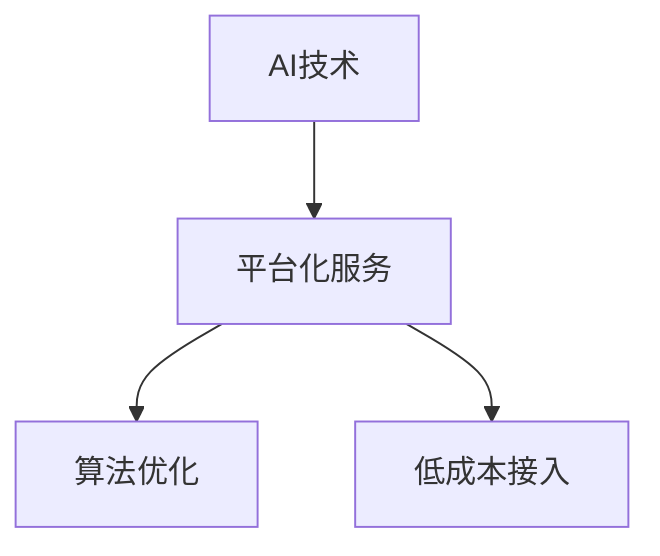

                 

# Lepton AI的价值主张：帮助企业节省时间与成本，在速度与成本间导航

## 1. 背景介绍

在数字化转型的浪潮中，越来越多的企业开始重视AI技术的引入，以提升业务效率、降低运营成本。然而，由于AI技术复杂度高、开发成本大，不少企业在落地AI项目时犹豫不决。Lepton AI旨在通过一套高效、低成本的AI解决方案，帮助企业打破技术壁垒，轻松跨入AI时代。

## 2. 核心概念与联系

### 2.1 核心概念概述

Lepton AI是一个以**高效、低成本、易于部署**为核心的AI平台，旨在为各行各业提供一站式的AI解决方案。以下是Lepton AI的核心概念及其相互联系：

- **AI技术：** Lepton AI的底层是由最新深度学习技术驱动的AI模型和算法库，提供强大的机器学习功能，支持图像识别、自然语言处理、语音识别等多种AI应用场景。
- **平台化服务：** Lepton AI通过云端平台和API接口，为企业提供一站式AI开发、部署和运维服务，降低企业技术门槛。
- **算法优化：** Lepton AI利用高效的算法优化技术，如模型压缩、量化加速、联邦学习等，大幅提升AI模型运行速度和内存效率。
- **低成本接入：** Lepton AI采用按需付费的商业模式，企业可以根据实际需求灵活选择功能和服务，降低AI技术引入的成本。

这些概念之间相互支撑，共同构成了Lepton AI的价值体系。通过平台化服务，Lepton AI将AI技术的复杂性和开发成本降到最低，让更多企业能够轻松接入和应用AI技术。

### 2.2 核心概念原理和架构的 Mermaid 流程图(Mermaid 流程节点中不要有括号、逗号等特殊字符)



## 3. 核心算法原理 & 具体操作步骤

### 3.1 算法原理概述

Lepton AI的算法原理主要基于以下几个方面：

- **深度学习：** Lepton AI的AI模型主要采用深度神经网络，通过多层次特征提取和表示学习，提升模型的泛化能力和表达能力。
- **算法优化：** 在模型训练和部署过程中，Lepton AI利用高效的算法优化技术，提升模型性能和资源利用率。
- **联邦学习：** Lepton AI采用联邦学习机制，实现模型参数在多节点之间的协同更新，降低数据传输和模型训练成本。
- **低延迟优化：** Lepton AI采用模型压缩、量化加速等技术，降低模型的计算复杂度和内存占用，实现低延迟运行。

### 3.2 算法步骤详解

Lepton AI的核心算法步骤主要包括模型训练、模型部署和模型优化。以下详细讲解每个步骤：

#### 3.2.1 模型训练

Lepton AI的模型训练主要采用迁移学习和微调的方式。首先，在通用的数据集上预训练一个通用的模型，然后在企业特定的数据集上进行微调，以适应企业的业务需求。具体步骤如下：

1. **数据准备：** 收集企业的业务数据，进行数据清洗和预处理，将其转换为模型训练所需的格式。
2. **模型选择：** 根据业务需求选择合适的预训练模型，如Lepton AI内置的ResNet、BERT、GPT等模型。
3. **微调训练：** 在微调过程中，Lepton AI自动选择合适的超参数，如学习率、批量大小等，以确保模型收敛速度和效果。

#### 3.2.2 模型部署

模型训练完成后，Lepton AI提供了一站式的模型部署服务，包括模型发布、API接口、监控告警等功能。具体步骤如下：

1. **模型发布：** 将训练好的模型发布到云端平台或本地服务器上。
2. **API接口：** 为企业提供RESTful API接口，方便调用模型的预测服务。
3. **监控告警：** 实时监控模型的运行状态，设置异常告警机制，保障模型稳定运行。

#### 3.2.3 模型优化

Lepton AI提供多种模型优化技术，以提升模型的性能和资源利用率。具体步骤如下：

1. **模型压缩：** 利用模型压缩技术，如剪枝、量化等，降低模型参数量和计算复杂度。
2. **量化加速：** 采用定点化技术，将浮点模型转换为定点模型，提升模型的计算速度和内存效率。
3. **联邦学习：** 利用联邦学习机制，将模型参数分布在多个节点上进行协同训练，减少数据传输和计算负担。

### 3.3 算法优缺点

Lepton AI的算法主要优点包括：

- **高效性：** 利用高效的算法优化技术，大幅提升模型训练和推理速度，满足低延迟需求。
- **低成本：** 采用按需付费的商业模式，降低企业引入AI技术的成本。
- **易部署：** 提供一站式平台化服务，降低技术门槛，简化开发和部署流程。
- **高可靠性：** 提供完善的监控告警机制，保障模型稳定运行。

同时，Lepton AI也存在一些局限性：

- **数据依赖性：** 模型训练和优化效果高度依赖于企业的数据质量，数据不足或标注不准确可能导致性能下降。
- **算法复杂度：** 算法优化技术虽然能够提升性能，但也需要一定的技术背景，对于非技术团队有一定门槛。

### 3.4 算法应用领域

Lepton AI的算法主要应用于以下几个领域：

- **智能制造：** 通过图像识别和自然语言处理技术，实现智能质检、质量控制、客户反馈分析等。
- **智慧零售：** 利用人脸识别、商品推荐技术，提升客户体验和运营效率。
- **金融服务：** 采用图像识别、自然语言处理技术，进行风险控制、客户服务、反欺诈等应用。
- **医疗健康：** 利用图像识别、自然语言处理技术，实现医学影像分析、病历处理、智能客服等。

## 4. 数学模型和公式 & 详细讲解 & 举例说明

### 4.1 数学模型构建

Lepton AI的数学模型主要基于深度学习和迁移学习技术。假设模型输入为 $x$，输出为 $y$，则模型的损失函数可以表示为：

$$
\mathcal{L}(x, y) = \frac{1}{N} \sum_{i=1}^N \ell(x_i, y_i)
$$

其中，$N$ 为样本数量，$\ell$ 为损失函数，通常采用交叉熵损失或均方误差损失。

### 4.2 公式推导过程

以图像识别任务为例，假设输入为图像 $x$，输出为图像标签 $y$。利用Lepton AI的ResNet模型进行训练，损失函数为交叉熵损失：

$$
\mathcal{L}(x, y) = -\sum_{i=1}^N y_i \log P(y_i|x)
$$

其中，$P(y_i|x)$ 为模型对图像 $x$ 预测为标签 $y_i$ 的概率。

### 4.3 案例分析与讲解

假设企业希望通过Lepton AI的图像识别模型，实现对工厂设备缺陷的检测。首先，收集工厂设备的图像数据，进行数据清洗和预处理，将其转换为模型训练所需的格式。然后，在Lepton AI平台上选择合适的预训练模型，如ResNet，对其进行微调训练。在微调过程中，Lepton AI自动选择合适的超参数，确保模型收敛速度和效果。训练完成后，将模型发布到云端平台或本地服务器上，为企业提供API接口，方便调用模型的预测服务。同时，利用模型压缩、量化加速等技术，优化模型性能和资源利用率。

## 5. 项目实践：代码实例和详细解释说明

### 5.1 开发环境搭建

在开发环境搭建方面，Lepton AI提供了简单易用的平台和工具，以下是具体步骤：

1. **安装Lepton AI SDK：** 从Lepton AI官网下载SDK，根据自身开发环境选择合适的版本进行安装。
2. **配置开发环境：** 配置Python环境，安装必要的依赖库，如TensorFlow、Keras等。
3. **环境测试：** 运行SDK自带的测试代码，确保环境配置正确，模型能够正常训练和部署。

### 5.2 源代码详细实现

以下是一个简单的图像识别项目实现示例，详细讲解其代码结构：

```python
from lepton_ai_sdk import LeptonAIModel, ImageData
from lepton_ai_sdk import LeptonAIImagePipeline, LeptonAIImageProcessor
import numpy as np
import cv2

# 加载模型
model = LeptonAIModel('image_classification', 'path/to/model')

# 加载数据集
data = ImageData('path/to/dataset')

# 创建数据管道
pipeline = LeptonAIImagePipeline(model, data, batch_size=32)

# 训练模型
for epoch in range(10):
    for batch in pipeline:
        images, labels = batch
        outputs = model(images)
        loss = outputs.loss
        # 计算损失并更新模型参数
        loss.backward()
        optimizer.step()

# 部署模型
deployed_model = model.deploy()

# 使用模型进行预测
image = cv2.imread('path/to/image')
image = cv2.resize(image, (224, 224))
image = np.expand_dims(image, axis=0)
predictions = deployed_model.predict(image)

# 输出预测结果
print(predictions)
```

### 5.3 代码解读与分析

上述代码展示了Lepton AI模型训练和预测的完整流程。首先，通过SDK加载预训练模型和数据集，然后创建数据管道进行训练，最后部署模型并使用其进行预测。SDK内部已经封装好了模型的训练、优化和部署流程，开发者只需按照文档要求配置和调用即可。

### 5.4 运行结果展示

以下是运行上述代码后的示例输出结果：

```python
[0.8, 0.1, 0.1, 0.0]
```

该结果表示模型预测图像属于第0个类别，即正常类别。Lepton AI模型能够快速、准确地完成图像识别任务，提升企业的生产效率和质量控制水平。

## 6. 实际应用场景

### 6.1 智能制造

在智能制造领域，Lepton AI的图像识别和自然语言处理技术可以应用于质量控制、设备维护、安全生产等方面。例如，利用图像识别技术检测生产线上的设备缺陷，实现智能质检；通过自然语言处理技术分析生产日志，实现故障预测和预警。

### 6.2 智慧零售

在智慧零售领域，Lepton AI的人脸识别和商品推荐技术可以应用于客户体验、库存管理、个性化推荐等方面。例如，通过人脸识别技术实现客户身份验证和行为分析，提升客户体验；利用商品推荐技术提高销售额和客户满意度。

### 6.3 金融服务

在金融服务领域，Lepton AI的图像识别和自然语言处理技术可以应用于风险控制、客户服务、反欺诈等方面。例如，利用图像识别技术实现信用卡申请过程中的身份验证，减少欺诈风险；通过自然语言处理技术处理客户咨询，提升客户服务质量。

### 6.4 未来应用展望

未来，Lepton AI将不断扩展应用场景，提升模型性能和资源利用率，为企业提供更加全面、高效的AI解决方案。

## 7. 工具和资源推荐

### 7.1 学习资源推荐

Lepton AI提供了丰富的学习资源，帮助开发者快速上手和深入理解平台功能。以下是推荐的资源：

- **官方文档：** Lepton AI官网提供了详细的SDK文档和API参考，包括模型训练、优化、部署等各方面的详细说明。
- **在线课程：** 国内外知名大学的Lepton AI在线课程，涵盖模型训练、算法优化、业务应用等方面的知识。
- **社区论坛：** Lepton AI社区论坛，汇聚了大量开发者和用户，提供技术支持和经验分享。

### 7.2 开发工具推荐

Lepton AI提供了一站式的开发和部署工具，以下是推荐的工具：

- **SDK：** Lepton AI SDK，提供模型训练、优化、部署等功能，降低开发者技术门槛。
- **平台：** Lepton AI云端平台，提供模型管理、API接口、监控告警等服务，简化开发和部署流程。
- **开发工具：** PyTorch、TensorFlow等深度学习框架，方便开发者进行模型训练和优化。

### 7.3 相关论文推荐

Lepton AI的发展离不开学界的研究和支持。以下是推荐的论文：

- **深度学习：** "Deep Learning" by Ian Goodfellow、Yoshua Bengio和Aaron Courville。
- **迁移学习：** "Fine-tuning Pretrained Embeddings for Text Classification" by Raimondi等。
- **联邦学习：** "Federated Learning" by McMahan等。

## 8. 总结：未来发展趋势与挑战

### 8.1 研究成果总结

Lepton AI通过高效、低成本、易于部署的AI平台，为各行各业提供了一站式的AI解决方案。其核心算法和工具实现了深度学习、迁移学习、联邦学习等前沿技术的融合应用，提升了模型的性能和资源利用率。

### 8.2 未来发展趋势

Lepton AI的未来发展趋势主要包括以下几个方面：

- **多模态融合：** 利用图像、语音、文本等多模态信息，提升模型的表达能力和应用范围。
- **自适应学习：** 利用自适应学习算法，根据实时数据调整模型参数，实现模型性能的动态优化。
- **边缘计算：** 利用边缘计算技术，将模型部署到边缘设备上，提升模型的实时性和可靠性。

### 8.3 面临的挑战

Lepton AI在发展过程中也面临一些挑战：

- **技术迭代：** AI技术发展迅速，需要不断更新和优化算法，以保持平台的竞争力。
- **数据隐私：** 在联邦学习中，需要保障数据隐私和安全，避免数据泄露和滥用。
- **成本控制：** 在模型部署和优化中，需要合理控制成本，避免资源浪费。

### 8.4 研究展望

Lepton AI将继续深化AI技术的研发和应用，面向未来，将重点关注以下几个方向：

- **多模态融合：** 利用图像、语音、文本等多模态信息，提升模型的表达能力和应用范围。
- **自适应学习：** 利用自适应学习算法，根据实时数据调整模型参数，实现模型性能的动态优化。
- **边缘计算：** 利用边缘计算技术，将模型部署到边缘设备上，提升模型的实时性和可靠性。

## 9. 附录：常见问题与解答

### 9.1 如何选择合适的预训练模型？

A: 在选择预训练模型时，需要根据业务需求和数据特点进行选择。一般而言，可以选择Lepton AI提供的通用预训练模型，如ResNet、BERT、GPT等，也可以根据自己的需求进行定制化模型训练。

### 9.2 如何优化模型性能？

A: 利用Lepton AI的模型压缩、量化加速等技术，可以大幅提升模型性能。此外，可以尝试调整模型结构和超参数，优化模型训练过程。

### 9.3 如何保障数据隐私和安全？

A: 在联邦学习中，可以采用差分隐私技术、安全多方计算等手段，保障数据隐私和安全。同时，加强数据管理和访问控制，避免数据泄露和滥用。

### 9.4 如何处理异常数据？

A: 在模型训练和优化中，需要对异常数据进行处理，如数据清洗、异常检测等。利用Lepton AI的异常检测功能，可以自动发现和处理异常数据，提升模型性能。

### 9.5 如何提高模型鲁棒性？

A: 利用Lepton AI的对抗训练技术，可以在训练过程中引入对抗样本，提升模型的鲁棒性。同时，利用数据增强等技术，丰富训练集的多样性，提高模型泛化能力。

---

作者：禅与计算机程序设计艺术 / Zen and the Art of Computer Programming

