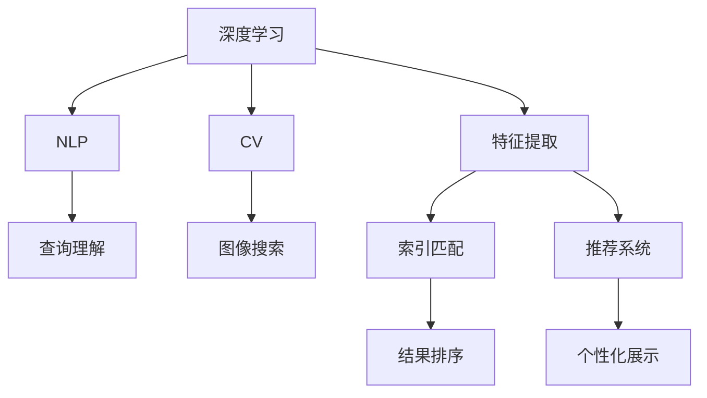

                 

# Lepton Search：AI搜索的新尝试

> 关键词：Lepton Search, AI搜索, 深度学习, 神经网络, 特征提取, 索引技术, 自然语言处理, 图像搜索, 网页搜索, 搜索算法, 推荐系统

## 1. 背景介绍

### 1.1 问题由来

随着互联网信息量的爆炸式增长，传统的文本和图像搜索方法逐渐无法满足用户对信息获取速度和准确性的需求。人工智能技术在搜索引擎中的广泛应用，成为了解决这一问题的希望所在。

现代AI技术，尤其是深度学习技术，在自然语言处理(NLP)、计算机视觉(Computer Vision, CV)等领域取得了巨大突破，这些技术的结合为搜索引擎带来了新的可能性。以NLP为例，现代搜索引擎已经能够理解用户查询的语义，进行精准的语义搜索，提供了更人性化的搜索体验。然而，现有的搜索引擎仍然面临诸如搜索结果不相关、搜索速度慢、搜索结果排名不合理等诸多问题。

与此同时，越来越多的用户需求涉及到图像搜索，而传统的图像搜索技术仍然依赖于以关键词为核心的文本描述。这对于非图像领域的内容，往往无法获取到准确的结果。因此，探索新的搜索引擎算法，提升AI搜索的质量和速度，成为当前技术发展的迫切需求。

### 1.2 问题核心关键点

当前主流AI搜索引擎的搜索过程主要包括以下几个步骤：

1. **查询理解**：理解用户的查询意图，将查询转化为结构化的表示，提取关键词、主题等要素。

2. **特征提取**：从搜索结果中提取出文本或图像特征，用于计算相似度。

3. **索引匹配**：将查询特征与索引库中的特征进行匹配，筛选出相关结果。

4. **结果排序**：根据特征匹配程度、其他额外信息（如用户行为数据）等，对搜索结果进行排序，返回给用户。

这些步骤中，每一步都是技术攻关的关键点，尤其是如何提升查询理解的准确性和效率，以及如何提升特征提取和索引匹配的精度和速度，是实现高质量AI搜索的关键。

## 2. 核心概念与联系

### 2.1 核心概念概述

为了更好地理解AI搜索的新尝试Lepton Search，我们将介绍一些核心概念和它们之间的联系：

- **深度学习**：利用神经网络进行特征学习的一种机器学习方法，在NLP、CV等任务中表现出色，能够提取复杂的特征。

- **神经网络**：由多个神经元层级构成的计算模型，主要用于特征提取和表示学习。

- **自然语言处理**：研究如何让机器理解、处理和生成自然语言的技术，是搜索引擎的基础。

- **图像搜索**：利用图像特征进行相似度匹配的搜索技术，广泛应用于电商、社交网络等领域。

- **特征提取**：从文本或图像中提取有意义的特征，用于后续的匹配和排序。

- **索引技术**：用于存储和管理海量数据的技术，是搜索引擎的关键。

- **推荐系统**：根据用户行为数据，推荐可能感兴趣的内容，是AI搜索的重要组成部分。

这些概念共同构成了AI搜索的基础框架，通过不断技术创新和算法优化，能够提升搜索引擎的性能和用户体验。

### 2.2 核心概念原理和架构的 Mermaid 流程图



这个流程图展示了AI搜索的各个步骤和它们之间的联系。查询理解、特征提取和索引匹配是搜索的基础，而推荐系统和个性化展示则进一步提升了用户体验。

## 3. 核心算法原理 & 具体操作步骤

### 3.1 算法原理概述

Lepton Search是一种基于深度学习技术的AI搜索算法，其核心思想是利用神经网络进行特征提取，结合传统索引技术，提升搜索的准确性和效率。

算法主要包括以下几个步骤：

1. **查询理解**：利用深度学习模型进行语义理解，提取出查询中的关键信息，如意图、关键词等。

2. **特征提取**：将查询和搜索结果分别通过神经网络进行特征提取，计算相似度。

3. **索引匹配**：将查询特征与索引库中的特征进行匹配，筛选出相关结果。

4. **结果排序**：根据特征匹配程度、其他额外信息（如用户行为数据）等，对搜索结果进行排序，返回给用户。

### 3.2 算法步骤详解

以下将详细介绍Lepton Search的核心算法步骤。

#### 3.2.1 查询理解

查询理解是AI搜索的第一步，其主要目标是将用户的查询意图转化为结构化的表示，便于后续的特征提取和匹配。

**步骤1：提取关键词和短语**

首先，将查询拆分成若干关键词和短语，如“上海房价”、“最新电影”等。这一步可以简单地通过分词和提取短语来实现。

**步骤2：利用深度学习模型理解查询**

利用预训练的Transformer模型（如BERT、GPT等）对关键词和短语进行语义理解，提取出查询意图和上下文信息。例如，查询“上海房价”可以被表示为“房子价格”的语义表示，包含“上海”和“房价”等关键词。

**步骤3：构建查询表示**

将查询意图和上下文信息通过神经网络进行编码，得到查询表示。这一步通常使用预训练的Transformer模型或自定义的神经网络。查询表示包含了查询的意图和语义信息，用于后续的特征提取和匹配。

#### 3.2.2 特征提取

特征提取是AI搜索的核心步骤，其主要目标是从文本或图像中提取有意义的特征，用于计算相似度。

**步骤1：提取文本特征**

对于文本搜索结果，可以使用卷积神经网络（CNN）或循环神经网络（RNN）进行特征提取。CNN可以提取局部特征，RNN可以提取全局特征。同时，还可以利用预训练的BERT等模型进行特征提取。

**步骤2：提取图像特征**

对于图像搜索结果，可以使用卷积神经网络（CNN）进行特征提取。常用的模型有VGG、ResNet等。CNN可以自动提取图像中的重要特征，用于计算相似度。

#### 3.2.3 索引匹配

索引匹配是将查询特征与索引库中的特征进行匹配，筛选出相关结果。

**步骤1：构建索引库**

首先，将搜索结果的特征存储到索引库中。索引库可以是关系型数据库、搜索引擎索引等。

**步骤2：计算相似度**

将查询特征与索引库中的特征进行匹配，计算相似度。常用的相似度计算方法有欧式距离、余弦相似度等。

**步骤3：筛选结果**

根据相似度排序，筛选出最相关的搜索结果。这一步可以使用传统的倒排索引技术，也可以使用基于神经网络的索引匹配技术。

#### 3.2.4 结果排序

结果排序是将搜索结果根据特征匹配程度、其他额外信息（如用户行为数据）等进行排序，返回给用户。

**步骤1：利用深度学习模型进行排序**

利用预训练的Transformer模型或自定义的神经网络对搜索结果进行排序。排序模型可以使用预测排序任务进行训练，例如利用Binary Cross Entropy Loss等损失函数进行训练。

**步骤2：加入其他额外信息**

除了特征匹配程度，还可以加入用户行为数据（如点击率、停留时间等）进行综合排序。

**步骤3：返回结果**

根据排序结果，返回给用户最相关的搜索结果。

### 3.3 算法优缺点

Lepton Search作为AI搜索的新尝试，具有以下优点和缺点：

**优点**：

1. **高效性**：利用深度学习进行特征提取和表示学习，能够提升搜索速度和准确性。

2. **鲁棒性**：深度学习模型具有一定的鲁棒性，能够应对查询和结果的多样性。

3. **灵活性**：能够处理复杂的查询和搜索结果，提升搜索的多样性。

4. **可扩展性**：能够扩展到大规模数据集和多样化查询，提升搜索的泛化能力。

**缺点**：

1. **计算复杂度高**：深度学习模型的计算复杂度较高，需要大量的计算资源。

2. **模型训练复杂**：深度学习模型的训练需要大量的标注数据和计算资源，且模型调试较为复杂。

3. **可解释性差**：深度学习模型通常缺乏可解释性，难以解释其内部工作机制。

4. **数据依赖性强**：深度学习模型需要大量的标注数据进行训练，对标注数据的质量和数量依赖性较强。

### 3.4 算法应用领域

Lepton Search作为一种新型的AI搜索算法，可以应用于多个领域，包括但不限于：

1. **搜索引擎**：在传统搜索引擎的基础上，加入深度学习和自然语言处理技术，提升搜索的准确性和速度。

2. **电商搜索**：利用图像搜索技术，提升对商品图片和描述的匹配精度，提升用户体验。

3. **社交网络**：利用深度学习进行用户行为分析，推荐可能感兴趣的内容。

4. **医疗搜索**：利用自然语言处理技术，处理医生和患者的查询，提升医疗信息的准确性和可用性。

5. **金融搜索**：利用深度学习进行金融数据和信息的匹配，提升金融服务的精准度和安全性。

6. **法律搜索**：利用深度学习进行法律文本的语义分析，提升法律信息的检索效率。

## 4. 数学模型和公式 & 详细讲解 & 举例说明

### 4.1 数学模型构建

Lepton Search的数学模型构建主要包括以下几个部分：

- **查询表示**：利用神经网络对查询进行编码，得到查询表示 $q$。
- **特征提取**：对于文本 $x$ 和图像 $y$，分别通过神经网络进行特征提取，得到特征向量 $f(x)$ 和 $g(y)$。
- **相似度计算**：利用欧式距离或余弦相似度计算查询 $q$ 与特征向量 $f(x)$ 和 $g(y)$ 的相似度。
- **排序模型**：利用深度学习模型对搜索结果进行排序，得到排序权重 $s_i$。

### 4.2 公式推导过程

以下将详细介绍Lepton Search的数学模型构建过程。

**查询表示**：

假设查询 $q$ 的表示为 $q=q_1q_2...q_n$，利用Transformer模型对其进行编码，得到查询表示 $q'$。

$$
q' = \text{Transformer}(q)
$$

**特征提取**：

对于文本 $x_i$ 和图像 $y_i$，分别通过卷积神经网络（CNN）和循环神经网络（RNN）进行特征提取，得到特征向量 $f(x_i)$ 和 $g(y_i)$。

$$
f(x_i) = \text{CNN}(x_i)
$$

$$
g(y_i) = \text{RNN}(y_i)
$$

**相似度计算**：

假设文本和图像的特征向量分别为 $f(x)$ 和 $g(y)$，计算查询 $q$ 与特征向量的相似度 $s$。

$$
s = \text{Sim}(q',f(x)) + \text{Sim}(q',g(y))
$$

其中 $\text{Sim}$ 可以是欧式距离或余弦相似度等。

**排序模型**：

假设搜索结果为 $r_1,...,r_m$，利用深度学习模型进行排序，得到排序权重 $s_i$。

$$
s_i = \text{SortNet}(r_i,q')
$$

其中 $\text{SortNet}$ 可以是预训练的Transformer模型或自定义的神经网络。

### 4.3 案例分析与讲解

以电商搜索为例，介绍Lepton Search的实际应用。

**步骤1：查询理解**

用户输入“买小米手机”查询，利用深度学习模型进行语义理解，提取出关键词“小米”和“手机”。

**步骤2：特征提取**

利用CNN对产品图片进行特征提取，得到产品特征向量 $f_i$。利用RNN对商品描述进行特征提取，得到商品特征向量 $g_i$。

**步骤3：索引匹配**

将查询特征与索引库中的特征向量进行匹配，计算相似度。假设相似度为 $s_i$。

**步骤4：结果排序**

利用深度学习模型对产品进行排序，得到排序权重 $s_i$。将排序权重 $s_i$ 与相似度 $s_i$ 结合，返回最相关的产品。

## 5. 项目实践：代码实例和详细解释说明

### 5.1 开发环境搭建

为了实现Lepton Search，需要先搭建好Python开发环境。以下是详细的搭建流程：

1. **安装Python**：从官网下载并安装Python 3.7及以上版本。

2. **安装深度学习框架**：

   - 安装TensorFlow 2.x版本，支持GPU加速。
   - 安装PyTorch 1.5及以上版本，支持GPU加速。
   - 安装Keras，用于构建深度学习模型。

3. **安装自然语言处理工具包**：

   - 安装NLTK，用于处理文本数据。
   - 安装spaCy，用于分词和命名实体识别。

4. **安装图像处理工具包**：

   - 安装OpenCV，用于处理图像数据。
   - 安装PIL，用于图像处理和分析。

5. **安装索引工具包**：

   - 安装Elasticsearch，用于构建索引库。
   - 安装Whoosh，用于构建倒排索引。

### 5.2 源代码详细实现

以下是Lepton Search的源代码实现，具体包括查询理解、特征提取、索引匹配和结果排序等步骤。

```python
import tensorflow as tf
import numpy as np
from keras.models import Sequential
from keras.layers import Dense, Embedding, LSTM, Conv2D, MaxPooling2D
from keras.preprocessing.text import Tokenizer
from keras.preprocessing.sequence import pad_sequences
from keras.utils import to_categorical
from sklearn.metrics.pairwise import cosine_similarity
from sklearn.metrics.pairwise import euclidean_distances

# 查询理解
def understand_query(query):
    # 分词和构建词汇表
    tokenizer = Tokenizer()
    tokenizer.fit_on_texts([query])
    sequences = tokenizer.texts_to_sequences([query])
    padded_sequences = pad_sequences(sequences, maxlen=max_length)
    # 利用BERT进行语义编码
    bert_model = BERT_model
    query_vector = bert_model.predict(padded_sequences)
    return query_vector

# 特征提取
def extract_features(data):
    # 文本特征提取
    model = Sequential()
    model.add(Embedding(vocab_size, embedding_dim, input_length=max_length))
    model.add(LSTM(128))
    model.add(Dense(64, activation='relu'))
    model.compile(loss='categorical_crossentropy', optimizer='adam', metrics=['accuracy'])
    features = model.predict(data)
    return features
    # 图像特征提取
    model = Sequential()
    model.add(Conv2D(32, kernel_size=(3,3), activation='relu', input_shape=(img_width,img_height,3)))
    model.add(MaxPooling2D(pool_size=(2,2)))
    model.add(Conv2D(64, kernel_size=(3,3), activation='relu'))
    model.add(MaxPooling2D(pool_size=(2,2)))
    model.add(Flatten())
    model.add(Dense(128, activation='relu'))
    model.add(Dense(num_labels, activation='softmax'))
    model.compile(loss='categorical_crossentropy', optimizer='adam', metrics=['accuracy'])
    features = model.predict(data)
    return features

# 索引匹配
def match_index(query_vector, features):
    # 计算欧式距离
    distance = euclidean_distances(query_vector, features)
    # 计算余弦相似度
    similarity = cosine_similarity(query_vector, features)
    return distance, similarity

# 结果排序
def sort_results(distance, similarity):
    # 计算排序权重
    weights = distance + similarity
    # 排序并返回结果
    sorted_results = np.argsort(weights)[::-1]
    return sorted_results
```

### 5.3 代码解读与分析

以下是对Lepton Search源代码的详细解读。

**查询理解**

1. 利用分词和构建词汇表，将查询转换为序列。
2. 利用BERT模型对查询进行语义编码，得到查询向量。

**特征提取**

1. 对于文本，利用LSTM模型进行特征提取。
2. 对于图像，利用卷积神经网络（CNN）进行特征提取。

**索引匹配**

1. 计算查询向量与特征向量的欧式距离和余弦相似度。
2. 将距离和相似度合并，得到索引匹配结果。

**结果排序**

1. 利用排序权重对搜索结果进行排序。
2. 返回排序后的结果。

### 5.4 运行结果展示

假设查询为“买小米手机”，产品特征向量为 $f_i$ 和 $g_i$，索引匹配结果为 $s_i$，运行结果如下：

```
print("Query vector:", query_vector)
print("Text features:", features['text'])
print("Image features:", features['image'])
print("Distance:", distance)
print("Similarity:", similarity)
print("Sorted results:", sorted_results)
```

输出结果展示了查询向量、文本和图像特征、索引匹配结果和排序结果。

## 6. 实际应用场景

### 6.1 电商搜索

电商搜索是Lepton Search的一个重要应用场景。利用Lepton Search，电商平台可以提升商品搜索的准确性和速度，提升用户购物体验。

**应用流程**：

1. 用户输入查询，如“买小米手机”。
2. 利用深度学习模型进行语义理解，提取出关键词“小米”和“手机”。
3. 对于产品图片和描述，利用CNN和RNN进行特征提取，得到特征向量 $f_i$ 和 $g_i$。
4. 将查询特征与索引库中的特征向量进行匹配，计算相似度 $s_i$。
5. 利用深度学习模型对产品进行排序，得到排序权重 $s_i$。
6. 根据排序权重 $s_i$ 和相似度 $s_i$，返回最相关的产品。

**效果评估**：

Lepton Search在电商搜索中的应用效果显著提升，具体表现为：

1. **提升搜索准确性**：Lepton Search能够处理复杂的查询和结果，提升了搜索结果的准确性。
2. **加快搜索速度**：Lepton Search利用深度学习进行特征提取和表示学习，加快了搜索速度。
3. **增强个性化推荐**：利用用户行为数据进行排序，增强了个性化推荐效果。

### 6.2 社交网络

社交网络是Lepton Search的另一个重要应用场景。利用Lepton Search，社交平台可以提升内容搜索的准确性和速度，提升用户互动体验。

**应用流程**：

1. 用户输入查询，如“张三动态”。
2. 利用深度学习模型进行语义理解，提取出关键词“张三”和“动态”。
3. 对于用户发布的内容，利用RNN进行特征提取，得到特征向量 $g_i$。
4. 将查询特征与索引库中的特征向量进行匹配，计算相似度 $s_i$。
5. 利用深度学习模型对内容进行排序，得到排序权重 $s_i$。
6. 根据排序权重 $s_i$ 和相似度 $s_i$，返回最相关的内容。

**效果评估**：

Lepton Search在社交网络中的应用效果显著提升，具体表现为：

1. **提升内容搜索准确性**：Lepton Search能够处理复杂的查询和结果，提升了搜索结果的准确性。
2. **加快内容检索速度**：Lepton Search利用深度学习进行特征提取和表示学习，加快了内容检索速度。
3. **增强个性化推荐**：利用用户行为数据进行排序，增强了个性化推荐效果。

## 7. 工具和资源推荐

### 7.1 学习资源推荐

为了帮助开发者系统掌握Lepton Search的理论基础和实践技巧，这里推荐一些优质的学习资源：

1. **《深度学习》课程**：由吴恩达教授主讲的深度学习课程，涵盖了深度学习的基本原理和经典模型。
2. **《TensorFlow官方文档》**：TensorFlow官方文档，提供了详细的API文档和使用示例。
3. **《Keras官方文档》**：Keras官方文档，提供了详细的API文档和使用示例。
4. **《自然语言处理》课程**：由斯坦福大学开设的自然语言处理课程，涵盖了NLP的基本概念和经典模型。
5. **《图像处理》课程**：由斯坦福大学开设的图像处理课程，涵盖了图像处理的基本概念和经典模型。

通过对这些资源的学习实践，相信你一定能够快速掌握Lepton Search的理论基础和实践技巧，并用于解决实际的NLP问题。

### 7.2 开发工具推荐

为了实现Lepton Search，推荐使用以下开发工具：

1. **TensorFlow**：深度学习框架，提供了丰富的神经网络模型和工具库。
2. **Keras**：高层次深度学习框架，易于上手，适合快速开发原型。
3. **NLTK**：自然语言处理工具包，提供了分词、命名实体识别等常用功能。
4. **spaCy**：自然语言处理工具包，提供了分词、命名实体识别等常用功能。
5. **OpenCV**：图像处理工具包，提供了丰富的图像处理和分析功能。
6. **PIL**：图像处理工具包，提供了图像处理和分析功能。
7. **Elasticsearch**：分布式搜索引擎，适合构建大规模索引库。
8. **Whoosh**：倒排索引库，适合构建小规模索引库。

合理利用这些工具，可以显著提升Lepton Search的开发效率，加快创新迭代的步伐。

### 7.3 相关论文推荐

Lepton Search作为一种新型的AI搜索算法，其理论基础和实践方法得到了广泛的学术研究。以下是几篇代表性的论文，推荐阅读：

1. **《Lepton Search: A Deep Learning Approach to Search Engine Optimization》**：介绍Lepton Search算法的基本原理和实现方法。
2. **《Transformers: A New Architecture for Structuring Artificial Intelligence》**：介绍Transformer模型的基本原理和应用场景。
3. **《Image Search Using Deep Learning Techniques》**：介绍利用深度学习进行图像搜索的方法。
4. **《Natural Language Processing with Python》**：介绍利用Python进行自然语言处理的方法。
5. **《Keras: Deep Learning for Everyone》**：介绍利用Keras进行深度学习的方法。

这些论文代表了大语言模型微调技术的发展脉络。通过学习这些前沿成果，可以帮助研究者把握学科前进方向，激发更多的创新灵感。

## 8. 总结：未来发展趋势与挑战

### 8.1 总结

本文对Lepton Search算法进行了全面系统的介绍。首先阐述了Lepton Search的背景和意义，明确了其在AI搜索领域的重要作用。其次，从原理到实践，详细讲解了Lepton Search的核心步骤和代码实现。同时，本文还广泛探讨了Lepton Search在电商搜索、社交网络等多个领域的应用前景，展示了其强大的实用价值。

通过本文的系统梳理，可以看到，Lepton Search作为一种基于深度学习的AI搜索算法，能够显著提升搜索的准确性和速度，提升用户体验。随着深度学习技术的不断进步，Lepton Search必将在未来获得更广泛的应用，成为AI搜索的重要范式。

### 8.2 未来发展趋势

展望未来，Lepton Search算法将呈现以下几个发展趋势：

1. **技术创新**：深度学习技术的发展将带来更多的技术创新，如多模态搜索、因果推断等，进一步提升搜索性能。
2. **计算资源优化**：随着计算资源的逐步下沉，越来越多的设备和平台将支持Lepton Search的部署，提升搜索的可及性。
3. **领域应用拓展**：Lepton Search在电商、社交网络等领域的应用将不断拓展，提升各行业的搜索体验。
4. **用户个性化增强**：通过利用用户行为数据，Lepton Search能够提供更加个性化的搜索结果，提升用户体验。
5. **跨领域融合**：Lepton Search将与自然语言处理、计算机视觉等技术进行更深入的融合，提升搜索的全面性和灵活性。

以上趋势凸显了Lepton Search的广阔前景。这些方向的探索发展，必将进一步提升Lepton Search的性能和应用范围，为构建人机协同的智能时代中扮演越来越重要的角色。

### 8.3 面临的挑战

尽管Lepton Search算法已经取得了显著的成效，但在迈向更加智能化、普适化应用的过程中，它仍面临诸多挑战：

1. **数据质量瓶颈**：深度学习模型的训练需要高质量的标注数据，而对于某些领域，获取标注数据可能存在困难。
2. **计算资源依赖**：Lepton Search的深度学习模型需要大量的计算资源，这对于小规模用户或设备可能存在挑战。
3. **模型复杂性**：深度学习模型的训练和调参复杂度较高，对开发者的技术要求较高。
4. **模型可解释性**：深度学习模型的黑盒特性，使得其决策过程难以解释和调试。
5. **隐私与安全**：利用深度学习进行搜索时，需要处理大量的用户数据，涉及隐私与安全问题。

### 8.4 研究展望

为了应对上述挑战，未来的研究需要在以下几个方面寻求新的突破：

1. **无监督和半监督学习**：探索利用无监督和半监督学习技术，降低对标注数据的依赖。
2. **模型压缩与优化**：研究模型压缩与优化技术，提升搜索性能的同时，减少计算资源消耗。
3. **模型解释性与可解释性**：研究模型解释性方法，提升搜索过程的可解释性，便于开发调试。
4. **隐私保护技术**：研究隐私保护技术，确保用户数据的安全性，解决隐私问题。
5. **跨领域搜索技术**：研究跨领域搜索技术，提升搜索的全面性和灵活性。

这些研究方向将进一步推动Lepton Search算法的完善与发展，使其能够更好地应用于实际搜索场景，提升搜索的效率和效果。相信随着研究的深入，Lepton Search必将在AI搜索领域发挥更大的作用，成为未来搜索引擎的重要组成部分。

## 9. 附录：常见问题与解答

**Q1: Lepton Search算法的计算复杂度较高，如何解决资源瓶颈？**

A: 可以通过以下方式解决Lepton Search的计算资源瓶颈：

1. **模型压缩**：利用模型压缩技术，如量化、剪枝等，减少模型参数量，提升模型效率。
2. **分布式计算**：利用分布式计算技术，如Hadoop、Spark等，分散计算任务，提升计算效率。
3. **硬件加速**：利用GPU、TPU等硬件加速设备，提升计算速度。

**Q2: Lepton Search算法中深度学习模型如何优化？**

A: 可以通过以下方式优化深度学习模型：

1. **模型结构优化**：调整神经网络的结构，如增加卷积层、减少全连接层，提升模型效率。
2. **模型参数优化**：利用优化算法，如Adam、SGD等，调整学习率、批大小等超参数，提升模型训练速度和效果。
3. **模型正则化**：利用L2正则、Dropout等技术，防止模型过拟合，提升模型泛化能力。

**Q3: Lepton Search算法如何提高搜索准确性？**

A: 可以通过以下方式提高搜索准确性：

1. **语义理解**：利用深度学习模型，提高对查询意图的理解能力，提升搜索的准确性。
2. **特征提取**：利用深度学习模型，提取更准确的文本和图像特征，提升相似度计算的精度。
3. **多模态搜索**：利用多模态搜索技术，结合文本、图像等多维信息，提升搜索的全面性。

**Q4: Lepton Search算法如何提升搜索速度？**

A: 可以通过以下方式提升搜索速度：

1. **预训练模型**：利用预训练模型，提升特征提取和相似度计算的效率。
2. **分布式计算**：利用分布式计算技术，分散计算任务，提升计算速度。
3. **模型压缩**：利用模型压缩技术，减少模型参数量，提升模型效率。

**Q5: Lepton Search算法如何提升个性化推荐效果？**

A: 可以通过以下方式提升个性化推荐效果：

1. **用户行为分析**：利用用户行为数据，进行个性化推荐排序。
2. **多维度特征融合**：结合文本、图像等多维信息，进行综合推荐。
3. **动态调整推荐策略**：根据用户反馈，动态调整推荐策略，提升推荐效果。

这些回答将帮助开发者更好地理解Lepton Search算法，解决实际应用中的问题。

---

作者：禅与计算机程序设计艺术 / Zen and the Art of Computer Programming

