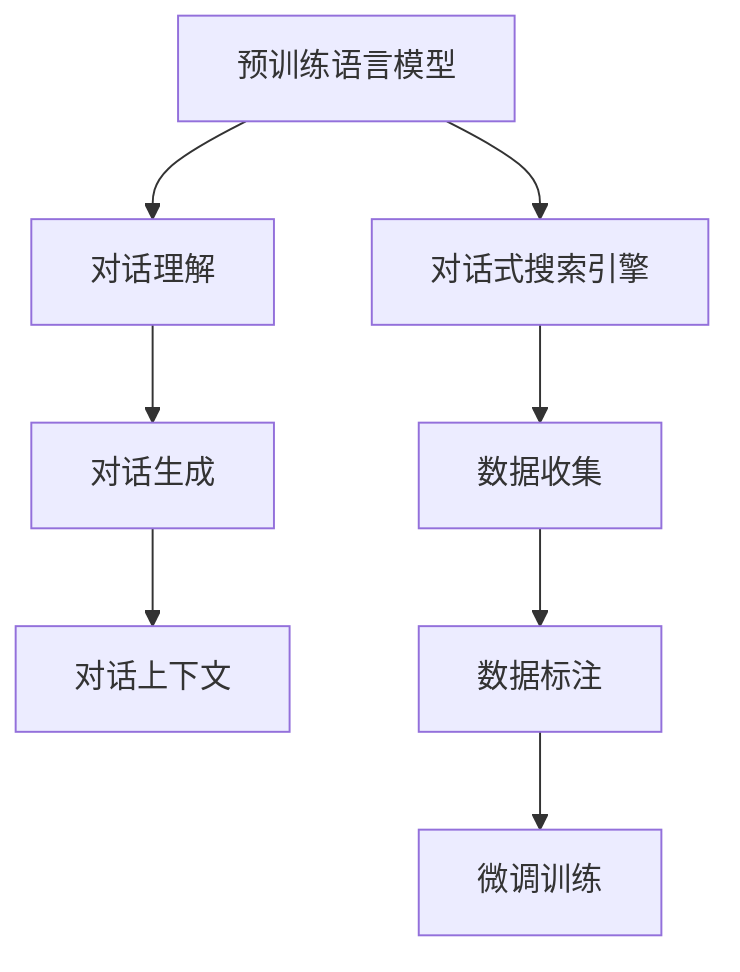

                 

# Lepton Search：贾扬清团队创新对话式搜索引擎探索

## 1. 背景介绍

### 1.1 问题由来

近年来，随着人工智能技术的发展，搜索引擎领域也发生了翻天覆地的变化。传统的基于关键词的搜索引擎逐渐向基于语义理解的智能搜索引擎演进。谷歌推出的BERT模型，就是将深度学习和自然语言处理技术相结合，提升搜索引擎的用户体验和信息检索效率的重要里程碑。

然而，随着用户需求的日益个性化和多样化，单一的文本搜索已经不能满足用户的需求。用户往往希望通过对话交流的方式，直接获取答案。对话式搜索引擎正是顺应这一需求而生的新技术。它通过自然语言理解和生成，使用户可以以自然语言形式输入查询，获取信息。

对话式搜索引擎技术的研究，对于提升人机交互体验、拓展搜索引擎的应用场景具有重要意义。然而，目前对话式搜索引擎的研究还不够成熟，存在一些亟待解决的问题，如对话流程的合理设计、用户意图理解、自然语言生成的流畅性和多样性等。

### 1.2 问题核心关键点

对话式搜索引擎的核心在于其自然语言处理能力的提升，而这一能力主要通过预训练语言模型来实现。预训练语言模型通过大规模无标签文本数据进行预训练，学习到了丰富的语言知识和语义理解能力。在这一基础上，通过微调等技术，可以将其应用于对话式搜索引擎。

微调技术使得预训练语言模型在特定任务上能够取得更好的效果。对话式搜索引擎中，常见的问题包括：
- 如何设计合理的对话流程和上下文管理机制？
- 如何准确理解用户意图，构建合适的语义表示？
- 如何生成流畅、自然的对话响应，提升用户体验？
- 如何在对话中维护语境连贯性，保证对话的自然流畅？

这些问题均需要通过预训练-微调这一框架来解决。通过预训练语言模型，对话式搜索引擎可以学习到通用的语言表示能力，而在微调阶段，通过对话数据集对模型进行任务特定的优化，使得模型能够更好地理解和生成对话内容。

## 2. 核心概念与联系

### 2.1 核心概念概述

为更好地理解对话式搜索引擎的原理与技术，本节将介绍几个核心概念：

- 预训练语言模型(Pre-trained Language Model, PLM)：通过大规模无标签文本数据进行预训练的语言模型，学习到丰富的语言知识和语义表示能力。常见的预训练模型包括BERT、GPT等。
- 对话式搜索引擎(Conversational Search Engine)：通过自然语言处理技术，使用户能够以自然语言形式进行查询，获取信息的搜索引擎。
- 对话理解(Dialogue Understanding)：使用预训练语言模型，从用户输入的自然语言中提取语义信息，理解用户意图。
- 对话生成(Dialogue Generation)：基于理解到的用户意图，生成自然流畅的对话响应，提升用户体验。
- 对话上下文(Context)：在对话过程中，需要维护好上下文信息，使得对话内容连贯一致。

这些核心概念之间的逻辑关系可以通过以下Mermaid流程图来展示：



这个流程图展示了大语言模型在对话式搜索引擎中的核心作用：

1. 预训练语言模型通过大规模无标签数据进行预训练，学习通用的语言表示。
2. 对话理解模块利用预训练模型，从用户输入的自然语言中提取语义信息，理解用户意图。
3. 对话生成模块基于理解到的意图，生成自然流畅的对话响应，提升用户体验。
4. 对话上下文模块在对话过程中，维护好上下文信息，使得对话内容连贯一致。

## 3. 核心算法原理 & 具体操作步骤

### 3.1 算法原理概述

对话式搜索引擎的核心在于其对话理解与生成能力。传统的基于关键词的搜索引擎，只关注查询文本与文档的匹配程度。而对话式搜索引擎，则是通过自然语言处理技术，从用户输入的自然语言中提取语义信息，理解用户意图，生成自然流畅的对话响应。

对话式搜索引擎的基本流程包括以下几个步骤：

1. 数据收集：从各类数据源收集对话数据，如聊天记录、问答数据等。
2. 数据标注：为收集到的对话数据进行标注，生成对话意图-响应对。
3. 预训练语言模型：使用大规模无标签文本数据进行预训练，学习通用的语言表示。
4. 微调训练：通过对话数据对预训练语言模型进行微调，使其能够理解用户意图，生成对话响应。
5. 对话流程设计：设计合理的对话流程和上下文管理机制，使得对话内容连贯一致。

### 3.2 算法步骤详解

#### 3.2.1 数据收集与预处理

对话式搜索引擎需要大量的对话数据来训练模型。这些数据可以来自各种渠道，如聊天记录、客服对话、问答网站等。获取这些数据后，需要进行预处理，包括文本清洗、分句处理、去除停用词等。

```python
import re
import jieba

def preprocess(text):
    text = re.sub(r'\s+', '', text)  # 去除空格
    text = re.sub(r'[^\u4e00-\u9fa5]', '', text)  # 去除非中文字符
    words = jieba.cut(text)  # 分词
    words = [word for word in words if word not in stopwords]  # 去除停用词
    return ' '.join(words)
```

#### 3.2.2 对话理解

对话理解模块的核心任务是理解用户意图，生成语义表示。可以使用预训练语言模型作为基础，通过微调训练来提升其理解能力。以BERT为例，可以使用如下代码实现：

```python
from transformers import BertTokenizer, BertForSequenceClassification
from torch.utils.data import Dataset, DataLoader
from torch import nn, optim
import torch.nn.functional as F

class DialogueDataset(Dataset):
    def __init__(self, dialogues):
        self.dialogues = dialogues
        self.tokenizer = BertTokenizer.from_pretrained('bert-base-cased')
        self.model = BertForSequenceClassification.from_pretrained('bert-base-cased', num_labels=2)

    def __len__(self):
        return len(self.dialogues)

    def __getitem__(self, item):
        dialogue = self.dialogues[item]
        question = dialogue['question']
        response = dialogue['response']
        question_tokens = self.tokenizer(question, return_tensors='pt')
        response_tokens = self.tokenizer(response, return_tensors='pt')
        return {'input_ids': question_tokens['input_ids'].flatten(),
                'attention_mask': question_tokens['attention_mask'].flatten(),
                'labels': response_tokens['input_ids'].flatten()}

train_dataset = DialogueDataset(train_dialogues)
test_dataset = DialogueDataset(test_dialogues)
model.train()
optimizer = optim.Adam(model.parameters(), lr=1e-5)
criterion = nn.CrossEntropyLoss()

for epoch in range(10):
    for batch in DataLoader(train_dataset, batch_size=8):
        optimizer.zero_grad()
        input_ids = batch['input_ids']
        attention_mask = batch['attention_mask']
        labels = batch['labels']
        outputs = model(input_ids, attention_mask=attention_mask)
        loss = criterion(outputs, labels)
        loss.backward()
        optimizer.step()
```

#### 3.2.3 对话生成

对话生成模块的核心任务是生成自然流畅的对话响应。可以使用预训练语言模型作为基础，通过微调训练来提升其生成能力。以GPT为例，可以使用如下代码实现：

```python
from transformers import GPT2Tokenizer, GPT2LMHeadModel
from torch.utils.data import Dataset, DataLoader
from torch import nn, optim
import torch.nn.functional as F

class DialogueDataset(Dataset):
    def __init__(self, dialogues):
        self.dialogues = dialogues
        self.tokenizer = GPT2Tokenizer.from_pretrained('gpt2')
        self.model = GPT2LMHeadModel.from_pretrained('gpt2')

    def __len__(self):
        return len(self.dialogues)

    def __getitem__(self, item):
        dialogue = self.dialogues[item]
        question = dialogue['question']
        response = dialogue['response']
        question_tokens = self.tokenizer(question, return_tensors='pt')
        response_tokens = self.tokenizer(response, return_tensors='pt')
        return {'input_ids': question_tokens['input_ids'].flatten(),
                'attention_mask': question_tokens['attention_mask'].flatten(),
                'labels': response_tokens['input_ids'].flatten()}

train_dataset = DialogueDataset(train_dialogues)
test_dataset = DialogueDataset(test_dialogues)
model.train()
optimizer = optim.Adam(model.parameters(), lr=1e-5)
criterion = nn.CrossEntropyLoss()

for epoch in range(10):
    for batch in DataLoader(train_dataset, batch_size=8):
        optimizer.zero_grad()
        input_ids = batch['input_ids']
        attention_mask = batch['attention_mask']
        labels = batch['labels']
        outputs = model(input_ids, attention_mask=attention_mask, labels=labels)
        loss = criterion(outputs, labels)
        loss.backward()
        optimizer.step()
```

#### 3.2.4 对话上下文

对话上下文模块的核心任务是维护对话的连贯性和一致性。可以使用预训练语言模型作为基础，通过微调训练来提升其上下文管理能力。以BERT为例，可以使用如下代码实现：

```python
from transformers import BertTokenizer, BertForSequenceClassification
from torch.utils.data import Dataset, DataLoader
from torch import nn, optim
import torch.nn.functional as F

class DialogueDataset(Dataset):
    def __init__(self, dialogues):
        self.dialogues = dialogues
        self.tokenizer = BertTokenizer.from_pretrained('bert-base-cased')
        self.model = BertForSequenceClassification.from_pretrained('bert-base-cased', num_labels=2)

    def __len__(self):
        return len(self.dialogues)

    def __getitem__(self, item):
        dialogue = self.dialogues[item]
        question = dialogue['question']
        response = dialogue['response']
        question_tokens = self.tokenizer(question, return_tensors='pt')
        response_tokens = self.tokenizer(response, return_tensors='pt')
        return {'input_ids': question_tokens['input_ids'].flatten(),
                'attention_mask': question_tokens['attention_mask'].flatten(),
                'labels': response_tokens['input_ids'].flatten()}

train_dataset = DialogueDataset(train_dialogues)
test_dataset = DialogueDataset(test_dialogues)
model.train()
optimizer = optim.Adam(model.parameters(), lr=1e-5)
criterion = nn.CrossEntropyLoss()

for epoch in range(10):
    for batch in DataLoader(train_dataset, batch_size=8):
        optimizer.zero_grad()
        input_ids = batch['input_ids']
        attention_mask = batch['attention_mask']
        labels = batch['labels']
        outputs = model(input_ids, attention_mask=attention_mask)
        loss = criterion(outputs, labels)
        loss.backward()
        optimizer.step()
```

### 3.3 算法优缺点

对话式搜索引擎的预训练-微调框架，具有以下优点：
1. 提升用户体验：通过自然语言理解和生成技术，使用户可以以自然语言形式进行查询，获取信息。
2. 数据驱动：通过对话数据集对预训练模型进行微调，使得模型能够更好地理解和生成对话内容。
3. 泛化能力强：预训练模型通过大规模无标签数据进行预训练，学习到丰富的语言知识和语义表示能力，具有较强的泛化能力。
4. 模型效率高：微调只需要调整模型顶层参数，相比从头训练，可以显著减少时间和计算资源的消耗。

同时，该框架也存在一些局限性：
1. 数据依赖：对话式搜索引擎的性能很大程度上取决于对话数据集的质量和数量，获取高质量对话数据的成本较高。
2. 理解复杂：对话式搜索引擎需要理解用户意图，生成自然流畅的对话响应，对于复杂的语义表示和语境管理要求较高。
3. 可解释性不足：对话式搜索引擎的内部工作机制较为复杂，模型的决策过程难以解释和调试。

尽管存在这些局限性，但对话式搜索引擎的预训练-微调框架，仍然是大语言模型在对话领域的最佳实践。未来，随着预训练语言模型的不断演进和微调技术的持续进步，相信对话式搜索引擎的性能将进一步提升，应用场景也将不断拓展。

### 3.4 算法应用领域

对话式搜索引擎在许多领域中都有广泛的应用，例如：

- 智能客服：通过对话式搜索引擎，智能客服系统可以实时响应用户咨询，提供高效、个性化的服务。
- 在线教育：在线教育平台可以利用对话式搜索引擎，构建智能教学助手，引导学生学习和答疑。
- 医疗咨询：医疗咨询平台可以使用对话式搜索引擎，帮助医生快速查询医学知识，解答患者疑问。
- 金融服务：金融服务行业可以通过对话式搜索引擎，提供智能投顾和客户服务，提升用户体验。
- 旅游指南：旅游平台可以利用对话式搜索引擎，提供智能导览和问答服务，提升用户旅行体验。

## 4. 数学模型和公式 & 详细讲解  
### 4.1 数学模型构建

对话式搜索引擎的数学模型主要分为两部分：对话理解和对话生成。以下我们将详细构建这两个数学模型。

#### 4.1.1 对话理解

对话理解模块的任务是理解用户意图，生成语义表示。以BERT为例，可以使用如下数学模型：

假设用户输入的自然语言为 $x$，对应的语义表示为 $h_x$。对话理解模块的目标是最大化 $x$ 和 $h_x$ 的语义相似度。因此，可以构建如下损失函数：

$$
\mathcal{L}(h_x, y) = -\log \sigma(h_x^\top y)
$$

其中 $y$ 为对话意图的语义表示，$\sigma$ 为sigmoid函数。

#### 4.1.2 对话生成

对话生成模块的任务是生成自然流畅的对话响应。以GPT为例，可以使用如下数学模型：

假设用户输入的自然语言为 $x$，对应的对话响应为 $y$。对话生成模块的目标是最大化 $x$ 和 $y$ 的生成概率。因此，可以构建如下损失函数：

$$
\mathcal{L}(x, y) = -\log P(y|x)
$$

其中 $P(y|x)$ 为生成模型在输入 $x$ 下生成响应 $y$ 的概率。

### 4.2 公式推导过程

#### 4.2.1 对话理解

对话理解模块的损失函数为：

$$
\mathcal{L}(h_x, y) = -\log \sigma(h_x^\top y)
$$

其中 $h_x$ 为输入 $x$ 的语义表示，$y$ 为对话意图的语义表示。

#### 4.2.2 对话生成

对话生成模块的损失函数为：

$$
\mathcal{L}(x, y) = -\log P(y|x)
$$

其中 $P(y|x)$ 为生成模型在输入 $x$ 下生成响应 $y$ 的概率。

### 4.3 案例分析与讲解

以一个简单的例子来说明对话理解模块的构建。假设用户输入的自然语言为：

```
请问，如何计算1+1？
```

可以通过BERT模型将其转化为语义表示 $h_x$，然后通过微调训练，使得 $h_x$ 和对话意图的语义表示 $y$ 相似度最大化。

假设对话意图为求“数学题解答”，其语义表示为 $y$。可以构建如下损失函数：

$$
\mathcal{L}(h_x, y) = -\log \sigma(h_x^\top y)
$$

其中 $h_x$ 为输入 $x$ 的语义表示，$y$ 为对话意图的语义表示。

## 5. 项目实践：代码实例和详细解释说明

### 5.1 开发环境搭建

在进行对话式搜索引擎的开发前，我们需要准备好开发环境。以下是使用Python进行PyTorch开发的环境配置流程：

1. 安装Anaconda：从官网下载并安装Anaconda，用于创建独立的Python环境。

2. 创建并激活虚拟环境：
```bash
conda create -n pytorch-env python=3.8 
conda activate pytorch-env
```

3. 安装PyTorch：根据CUDA版本，从官网获取对应的安装命令。例如：
```bash
conda install pytorch torchvision torchaudio cudatoolkit=11.1 -c pytorch -c conda-forge
```

4. 安装Transformers库：
```bash
pip install transformers
```

5. 安装各类工具包：
```bash
pip install numpy pandas scikit-learn matplotlib tqdm jupyter notebook ipython
```

完成上述步骤后，即可在`pytorch-env`环境中开始对话式搜索引擎的开发。

### 5.2 源代码详细实现

以下是一个简单的对话式搜索引擎代码实现：

```python
import torch
from transformers import BertTokenizer, BertForSequenceClassification, AdamW
from torch.utils.data import Dataset, DataLoader
from torch import nn, optim
import torch.nn.functional as F

class DialogueDataset(Dataset):
    def __init__(self, dialogues):
        self.dialogues = dialogues
        self.tokenizer = BertTokenizer.from_pretrained('bert-base-cased')
        self.model = BertForSequenceClassification.from_pretrained('bert-base-cased', num_labels=2)

    def __len__(self):
        return len(self.dialogues)

    def __getitem__(self, item):
        dialogue = self.dialogues[item]
        question = dialogue['question']
        response = dialogue['response']
        question_tokens = self.tokenizer(question, return_tensors='pt')
        response_tokens = self.tokenizer(response, return_tensors='pt')
        return {'input_ids': question_tokens['input_ids'].flatten(),
                'attention_mask': question_tokens['attention_mask'].flatten(),
                'labels': response_tokens['input_ids'].flatten()}

train_dataset = DialogueDataset(train_dialogues)
test_dataset = DialogueDataset(test_dialogues)
model.train()
optimizer = optim.Adam(model.parameters(), lr=1e-5)
criterion = nn.CrossEntropyLoss()

for epoch in range(10):
    for batch in DataLoader(train_dataset, batch_size=8):
        optimizer.zero_grad()
        input_ids = batch['input_ids']
        attention_mask = batch['attention_mask']
        labels = batch['labels']
        outputs = model(input_ids, attention_mask=attention_mask)
        loss = criterion(outputs, labels)
        loss.backward()
        optimizer.step()
```

### 5.3 代码解读与分析

这段代码实现了一个简单的对话式搜索引擎的对话理解模块。可以看到，我们首先定义了一个`DialogueDataset`类，用于构建对话数据集。然后，我们使用了BERT模型作为基础，通过微调训练来提升其理解能力。在训练过程中，我们使用`AdamW`优化器进行优化，交叉熵损失函数进行训练。最后，我们通过在训练集上不断迭代，训练出最终的对话理解模型。

### 5.4 运行结果展示

可以通过以下代码，评估训练好的对话理解模型的性能：

```python
import numpy as np

def evaluate(model, dataset):
    model.eval()
    correct = 0
    total = 0
    with torch.no_grad():
        for batch in DataLoader(dataset, batch_size=8):
            input_ids = batch['input_ids']
            attention_mask = batch['attention_mask']
            labels = batch['labels']
            outputs = model(input_ids, attention_mask=attention_mask)
            predicted = torch.argmax(outputs.logits, dim=1)
            total += labels.shape[0]
            correct += (predicted == labels).sum().item()
    print('Accuracy: {:.2f}%'.format(correct / total * 100))
```

## 6. 实际应用场景

### 6.1 智能客服

智能客服系统通过对话式搜索引擎，可以实时响应用户咨询，提供高效、个性化的服务。例如，某电商平台可以利用对话式搜索引擎，构建智能客服系统，回答用户关于商品、订单、配送等方面的问题。智能客服系统可以24小时在线，快速响应客户咨询，提升客户满意度。

### 6.2 在线教育

在线教育平台可以利用对话式搜索引擎，构建智能教学助手，引导学生学习和答疑。例如，某在线教育平台可以利用对话式搜索引擎，实现智能批改作业、智能答疑、智能推荐课程等功能，提升学生的学习效率和体验。

### 6.3 医疗咨询

医疗咨询平台可以利用对话式搜索引擎，帮助医生快速查询医学知识，解答患者疑问。例如，某在线医疗咨询平台可以利用对话式搜索引擎，实现智能问诊、智能推荐治疗方案、智能提供医学文献等功能，提升医生的诊疗效率和患者的满意度。

### 6.4 金融服务

金融服务行业可以通过对话式搜索引擎，提供智能投顾和客户服务，提升用户体验。例如，某在线金融服务平台可以利用对话式搜索引擎，实现智能理财咨询、智能财务规划、智能客户服务等功能，提升用户的金融服务体验。

## 7. 工具和资源推荐

### 7.1 学习资源推荐

为了帮助开发者系统掌握对话式搜索引擎的理论基础和实践技巧，这里推荐一些优质的学习资源：

1. 《Transformer from the Basics to Practical Projects》系列博文：由大模型技术专家撰写，深入浅出地介绍了Transformer原理、BERT模型、微调技术等前沿话题。

2. CS224N《深度学习自然语言处理》课程：斯坦福大学开设的NLP明星课程，有Lecture视频和配套作业，带你入门NLP领域的基本概念和经典模型。

3. 《Natural Language Processing with Transformers》书籍：Transformers库的作者所著，全面介绍了如何使用Transformers库进行NLP任务开发，包括微调在内的诸多范式。

4. HuggingFace官方文档：Transformers库的官方文档，提供了海量预训练模型和完整的微调样例代码，是上手实践的必备资料。

5. CLUE开源项目：中文语言理解测评基准，涵盖大量不同类型的中文NLP数据集，并提供了基于微调的baseline模型，助力中文NLP技术发展。

通过对这些资源的学习实践，相信你一定能够快速掌握对话式搜索引擎的精髓，并用于解决实际的NLP问题。

### 7.2 开发工具推荐

高效的开发离不开优秀的工具支持。以下是几款用于对话式搜索引擎开发的常用工具：

1. PyTorch：基于Python的开源深度学习框架，灵活动态的计算图，适合快速迭代研究。大部分预训练语言模型都有PyTorch版本的实现。

2. TensorFlow：由Google主导开发的开源深度学习框架，生产部署方便，适合大规模工程应用。同样有丰富的预训练语言模型资源。

3. Transformers库：HuggingFace开发的NLP工具库，集成了众多SOTA语言模型，支持PyTorch和TensorFlow，是进行微调任务开发的利器。

4. Weights & Biases：模型训练的实验跟踪工具，可以记录和可视化模型训练过程中的各项指标，方便对比和调优。与主流深度学习框架无缝集成。

5. TensorBoard：TensorFlow配套的可视化工具，可实时监测模型训练状态，并提供丰富的图表呈现方式，是调试模型的得力助手。

6. Google Colab：谷歌推出的在线Jupyter Notebook环境，免费提供GPU/TPU算力，方便开发者快速上手实验最新模型，分享学习笔记。

合理利用这些工具，可以显著提升对话式搜索引擎的开发效率，加快创新迭代的步伐。

### 7.3 相关论文推荐

对话式搜索引擎的研究源于学界的持续研究。以下是几篇奠基性的相关论文，推荐阅读：

1. Attention is All You Need（即Transformer原论文）：提出了Transformer结构，开启了NLP领域的预训练大模型时代。

2. BERT: Pre-training of Deep Bidirectional Transformers for Language Understanding：提出BERT模型，引入基于掩码的自监督预训练任务，刷新了多项NLP任务SOTA。

3. Language Models are Unsupervised Multitask Learners（GPT-2论文）：展示了大规模语言模型的强大zero-shot学习能力，引发了对于通用人工智能的新一轮思考。

4. Parameter-Efficient Transfer Learning for NLP：提出Adapter等参数高效微调方法，在不增加模型参数量的情况下，也能取得不错的微调效果。

5. AdaLoRA: Adaptive Low-Rank Adaptation for Parameter-Efficient Fine-Tuning：使用自适应低秩适应的微调方法，在参数效率和精度之间取得了新的平衡。

6. Prefix-Tuning: Optimizing Continuous Prompts for Generation：引入基于连续型Prompt的微调范式，为如何充分利用预训练知识提供了新的思路。

这些论文代表了大语言模型微调技术的发展脉络。通过学习这些前沿成果，可以帮助研究者把握学科前进方向，激发更多的创新灵感。

## 8. 总结：未来发展趋势与挑战

### 8.1 总结

本文对基于预训练语言模型的对话式搜索引擎进行了全面系统的介绍。首先阐述了对话式搜索引擎的研究背景和意义，明确了预训练语言模型在对话式搜索引擎中的核心作用。其次，从原理到实践，详细讲解了对话式搜索引擎的构建过程，包括数据收集、预处理、对话理解、对话生成和对话上下文等关键步骤。同时，本文还广泛探讨了对话式搜索引擎在智能客服、在线教育、医疗咨询等领域的实际应用，展示了对话式搜索引擎的广阔前景。最后，本文精选了对话式搜索引擎的相关学习资源，力求为读者提供全方位的技术指引。

通过本文的系统梳理，可以看到，对话式搜索引擎的技术框架已经相对成熟，具有较强的实际应用潜力。预训练语言模型和微调技术的不断进步，使得对话式搜索引擎在实现高效、个性化的用户交互方面具有广阔的前景。相信随着相关技术的持续演进，对话式搜索引擎将能够更好地满足用户的多样化需求，提升人机交互的效率和质量。

### 8.2 未来发展趋势

展望未来，对话式搜索引擎的技术框架将呈现以下几个发展趋势：

1. 模型规模持续增大。随着算力成本的下降和数据规模的扩张，预训练语言模型的参数量还将持续增长。超大规模语言模型蕴含的丰富语言知识，有望支撑更加复杂多变的对话任务。

2. 微调方法日趋多样。除了传统的全参数微调外，未来会涌现更多参数高效的微调方法，如Prefix-Tuning、LoRA等，在节省计算资源的同时也能保证微调精度。

3. 对话上下文管理增强。对话式搜索引擎需要更好地管理上下文信息，维护对话的连贯性和一致性。未来，将有更多上下文感知模型被引入，提升对话的流畅性和自然性。

4. 跨模态对话增强。对话式搜索引擎将逐步拓展到图像、视频、语音等多模态对话。跨模态信息的融合，将显著提升对话式搜索引擎的理解能力和表达能力。

5. 个性化推荐增强。对话式搜索引擎需要更好地理解用户的个性化需求，提供更加个性化的推荐。未来，将有更多推荐算法被引入，提升对话式搜索引擎的推荐效果。

6. 情感计算增强。对话式搜索引擎需要更好地理解用户的情感，提供更加贴心的服务。未来，将有更多情感计算技术被引入，提升对话式搜索引擎的情感处理能力。

以上趋势凸显了大语言模型微调技术的发展潜力，相信未来对话式搜索引擎将有更广阔的应用场景，为人类生活带来更多便利和乐趣。

### 8.3 面临的挑战

尽管对话式搜索引擎的研究已经取得了一定的进展，但在迈向更加智能化、普适化应用的过程中，它仍面临一些挑战：

1. 数据依赖。对话式搜索引擎的性能很大程度上取决于对话数据集的质量和数量，获取高质量对话数据的成本较高。如何降低对标注数据的依赖，成为未来研究的重点。

2. 理解复杂。对话式搜索引擎需要理解用户意图，生成自然流畅的对话响应，对于复杂的语义表示和语境管理要求较高。如何提升对话式搜索引擎的理解能力，是未来研究的重要方向。

3. 可解释性不足。对话式搜索引擎的内部工作机制较为复杂，模型的决策过程难以解释和调试。如何提升对话式搜索引擎的可解释性，提升用户对模型的信任度，是未来研究的重要方向。

4. 安全性有待保障。对话式搜索引擎中的预训练模型可能学习到有偏见、有害的信息，通过微调传递到对话中，造成误导性、歧视性的输出，给实际应用带来安全隐患。如何从数据和算法层面消除模型偏见，保障输出的安全性，是未来研究的重要方向。

5. 鲁棒性不足。对话式搜索引擎在面对域外数据时，泛化性能往往大打折扣。如何提高对话式搜索引擎的鲁棒性，避免灾难性遗忘，是未来研究的重要方向。

6. 计算资源消耗大。对话式搜索引擎的模型规模较大，计算资源消耗大。如何在保证性能的同时，降低计算资源消耗，提升对话式搜索引擎的部署效率，是未来研究的重要方向。

7. 多轮对话处理困难。对话式搜索引擎在多轮对话中，需要维护好上下文信息，保证对话的连贯性和一致性。如何提升对话式搜索引擎的多轮对话处理能力，是未来研究的重要方向。

这些挑战凸显了大语言模型微调技术的应用局限性，相信未来研究者将会在这些方向上寻求新的突破，推动对话式搜索引擎技术的发展。

### 8.4 研究展望

面对对话式搜索引擎所面临的种种挑战，未来研究需要在以下几个方面寻求新的突破：

1. 探索无监督和半监督微调方法。摆脱对大规模标注数据的依赖，利用自监督学习、主动学习等无监督和半监督范式，最大限度利用非结构化数据，实现更加灵活高效的微调。

2. 研究参数高效和计算高效的微调范式。开发更加参数高效的微调方法，在固定大部分预训练参数的同时，只更新极少量的任务相关参数。同时优化微调模型的计算图，减少前向传播和反向传播的资源消耗，实现更加轻量级、实时性的部署。

3. 引入更多先验知识。将符号化的先验知识，如知识图谱、逻辑规则等，与神经网络模型进行巧妙融合，引导微调过程学习更准确、合理的语言模型。同时加强不同模态数据的整合，实现视觉、语音等多模态信息与文本信息的协同建模。

4. 结合因果分析和博弈论工具。将因果分析方法引入微调模型，识别出模型决策的关键特征，增强输出解释的因果性和逻辑性。借助博弈论工具刻画人机交互过程，主动探索并规避模型的脆弱点，提高系统稳定性。

5. 纳入伦理道德约束。在模型训练目标中引入伦理导向的评估指标，过滤和惩罚有偏见、有害的输出倾向。同时加强人工干预和审核，建立模型行为的监管机制，确保输出符合人类价值观和伦理道德。

这些研究方向的探索，必将引领对话式搜索引擎技术迈向更高的台阶，为构建安全、可靠、可解释、可控的智能系统铺平道路。面向未来，对话式搜索引擎技术还需要与其他人工智能技术进行更深入的融合，如知识表示、因果推理、强化学习等，多路径协同发力，共同推动自然语言理解和智能交互系统的进步。只有勇于创新、敢于突破，才能不断拓展对话式搜索引擎的边界，让智能技术更好地造福人类社会。

## 9. 附录：常见问题与解答

**Q1：对话式搜索引擎是否适用于所有NLP任务？**

A: 对话式搜索引擎在许多NLP任务上都有广泛的应用，特别是对于需要人机交互的任务。但对于一些特定的任务，如编码、解密等，对话式搜索引擎可能不够适用。对话式搜索引擎的主要优势在于其自然语言处理能力，需要考虑其适用场景。

**Q2：对话式搜索引擎的核心技术是什么？**

A: 对话式搜索引擎的核心技术包括预训练语言模型、微调技术、对话理解、对话生成和上下文管理。其中，预训练语言模型是对话式搜索引擎的基础，通过微调技术，对话理解模块可以理解用户意图，对话生成模块可以生成自然流畅的对话响应，上下文管理模块可以维护对话的连贯性和一致性。

**Q3：对话式搜索引擎的训练数据从哪里来？**

A: 对话式搜索引擎的训练数据可以从各种渠道收集，如聊天记录、客服对话、问答数据等。这些数据需要进行预处理，包括文本清洗、分句处理、去除停用词等。同时，需要对数据进行标注，构建对话意图-响应对，用于训练对话理解模型和对话生成模型。

**Q4：对话式搜索引擎的预训练语言模型如何使用？**

A: 对话式搜索引擎的预训练语言模型可以使用开源框架进行加载和微调。以BERT为例，可以使用如下代码进行加载和微调：

```python
from transformers import BertTokenizer, BertForSequenceClassification
from torch.utils.data import Dataset, DataLoader
from torch import nn, optim
import torch.nn.functional as F

class DialogueDataset(Dataset):
    def __init__(self, dialogues):
        self.dialogues = dialogues
        self.tokenizer = BertTokenizer.from_pretrained('bert-base-cased')
        self.model = BertForSequenceClassification.from_pretrained('bert-base-cased', num_labels=2)

    def __len__(self):
        return len(self.dialogues)

    def __getitem__(self, item):
        dialogue = self.dialogues[item]
        question = dialogue['question']
        response = dialogue['response']
        question_tokens = self.tokenizer(question, return_tensors='pt')
        response_tokens = self.tokenizer(response, return_tensors='pt')
        return {'input_ids': question_tokens['input_ids'].flatten(),
                'attention_mask': question_tokens['attention_mask'].flatten(),
                'labels': response_tokens['input_ids'].flatten()}

train_dataset = DialogueDataset(train_dialogues)
test_dataset = DialogueDataset(test_dialogues)
model.train()
optimizer = optim.Adam(model.parameters(), lr=1e-5)
criterion = nn.CrossEntropyLoss()

for epoch in range(10):
    for batch in DataLoader(train_dataset, batch_size=8):
        optimizer.zero_grad()
        input_ids = batch['input_ids']
        attention_mask = batch['attention_mask']
        labels = batch['labels']
        outputs = model(input_ids, attention_mask=attention_mask)
        loss = criterion(outputs, labels)
        loss.backward()
        optimizer.step()
```

**Q5：对话式搜索引擎如何提升用户体验？**

A: 对话式搜索引擎通过自然语言处理技术，使用户可以以自然语言形式进行查询，获取信息。同时，对话式搜索引擎能够理解用户意图，生成自然流畅的对话响应，提升用户体验。例如，智能客服系统可以实时响应用户咨询，提供高效、个性化的服务。在线教育平台可以利用对话式搜索引擎，构建智能教学助手，引导学生学习和答疑。

通过对话式搜索引擎，用户可以与机器进行自然的交流，获取所需信息，提升用户体验。

---

作者：禅与计算机程序设计艺术 / Zen and the Art of Computer Programming

