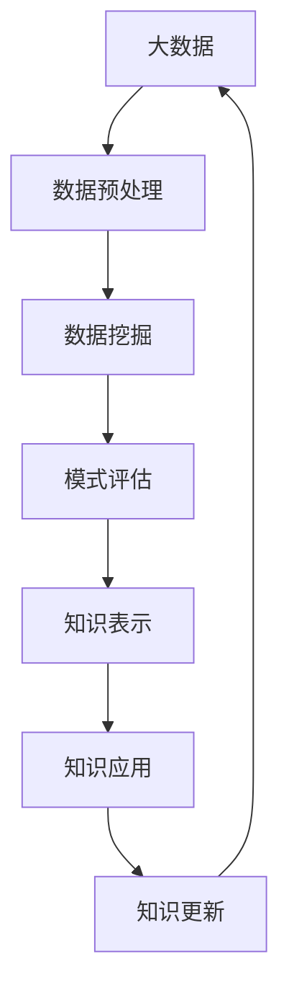

                 

**大数据分析与知识发现的关系**

## 1. 背景介绍

随着大数据时代的到来，数据的规模、种类、速度和价值都呈指数级增长。如何从海量数据中提取有价值的信息，并转化为知识，已成为当前计算机科学领域的重大挑战。大数据分析和知识发现是两个密切相关的领域，前者提供了处理和分析大数据的技术和方法，后者则提供了从数据中提取知识的理论和框架。本文将从技术和理论两个角度，探讨大数据分析与知识发现的关系。

## 2. 核心概念与联系

### 2.1 核心概念

- **大数据（Big Data）**：指的是难以用常规软件工具进行捕获、存储、管理、搜索、共享、传输等的数据集合。
- **知识发现（Knowledge Discovery）**：指的是从大量数据中自动或半自动地提取有用的、隐藏的、未知的、可解释的模式和知识的过程。
- **数据挖掘（Data Mining）**：知识发现的子过程，指的是从大量数据中发现潜在的、未知的、有用的模式和知识的过程。

### 2.2 核心概念联系的 Mermaid 流程图



## 3. 核心算法原理 & 具体操作步骤

### 3.1 算法原理概述

大数据分析和知识发现的核心算法包括：关联规则算法、聚类算法、分类算法、预测算法等。这些算法的原理都是基于统计学、信息论、机器学习等理论，通过对数据的统计、挖掘、建模，发现数据背后的规律和模式。

### 3.2 算法步骤详解

以关联规则算法为例，其步骤包括：

1. 数据预处理：对数据进行清洗、转换、聚合等预处理，提高数据质量。
2. 关联规则生成：使用Apriori、FP-Growth等算法，从数据中挖掘频繁项集，并生成关联规则。
3. 规则评估：使用置信度、支持度等指标，评估关联规则的有效性。
4. 规则挖掘：根据评估结果，挖掘出有用的关联规则。

### 3.3 算法优缺点

优点：能够发现数据背后的隐藏规律，为决策提供依据。缺点：易受数据质量影响，易产生无效规则，计算复杂度高。

### 3.4 算法应用领域

大数据分析和知识发现的算法广泛应用于商业智能、市场营销、金融风险管理、医疗保健、网络安全等领域。

## 4. 数学模型和公式 & 详细讲解 & 举例说明

### 4.1 数学模型构建

关联规则算法的数学模型可以表示为：给定一个事务数据集$D$和最小支持度$s$、最小置信度$c$，任务是挖掘出支持度不低于$s$、置信度不低于$c$的所有关联规则。

### 4.2 公式推导过程

支持度：$support(X) = \frac{number\ of\ transactions\ containing\ X}{total\ number\ of\ transactions}$

置信度：$confidence(X \Rightarrow Y) = \frac{support(X \cup Y)}{support(X)}$

### 4.3 案例分析与讲解

例如，在超市购物数据集中，有以下关联规则：

- $\{beer\} \Rightarrow \{diapers\}$，支持度为0.05，置信度为0.5
- $\{beer\} \Rightarrow \{milk\}$，支持度为0.1，置信度为0.75

这表明，如果顾客购买了啤酒，那么购买尿布的可能性是50%，购买牛奶的可能性是75%。

## 5. 项目实践：代码实例和详细解释说明

### 5.1 开发环境搭建

本项目使用Python语言，需要安装以下库：pandas、numpy、mlxtend。

### 5.2 源代码详细实现

```python
from mlxtend.frequent_patterns import apriori
from mlxtend.frequent_patterns import association_rules

# 读取数据
data = pd.read_csv('supermarket.csv')

# 数据预处理
data = data.dropna()
data = data.drop_duplicates()
data = data.set_index('Transaction')

# 生成频繁项集
frequent_itemsets = apriori(data, min_support=0.05, use_colnames=True)

# 生成关联规则
rules = association_rules(frequent_itemsets, metric="confidence", min_threshold=0.7)
```

### 5.3 代码解读与分析

代码首先读取数据，并进行预处理。然后使用Apriori算法生成频繁项集，最后使用置信度评估指标生成关联规则。

### 5.4 运行结果展示

运行结果为关联规则的数据框，包含规则、支持度、置信度等信息。

## 6. 实际应用场景

大数据分析和知识发现技术在各个领域都有广泛应用，例如：

- **商业智能**：帮助企业从海量数据中发现有价值的信息，支持决策。
- **市场营销**：帮助企业分析消费者行为，优化营销策略。
- **金融风险管理**：帮助金融机构发现风险模式，防范风险。
- **医疗保健**：帮助医疗机构分析病例数据，提高诊断准确性。

### 6.4 未来应用展望

随着大数据规模的不断增长，未来大数据分析和知识发现技术将更加注重实时性、可解释性和可视化。此外，跨数据源的知识发现、知识图谱构建等也将是未来的研究热点。

## 7. 工具和资源推荐

### 7.1 学习资源推荐

- 书籍：《数据挖掘： concepts和技术》、《大数据分析：从量变到质变》
- 课程：Coursera的“数据挖掘”、“大数据分析”课程

### 7.2 开发工具推荐

- Hadoop、Spark：大数据处理框架
- Python：数据分析和挖掘语言
- RapidMiner、Weka：数据挖掘软件

### 7.3 相关论文推荐

- Agrawal, R., Imielinski, T., & Swami, A. (1993). Mining association rules between items in large databases 2. In ACM SIGMOD international conference on management of data (pp. 207-216).
- Han, J., Kamber, M., & Pei, J. (2011). Data mining concepts and techniques. Morgan & Claypool Publishers.

## 8. 总结：未来发展趋势与挑战

### 8.1 研究成果总结

大数据分析和知识发现技术已经取得了丰硕的成果，为各个领域的决策提供了有力的支撑。

### 8.2 未来发展趋势

未来大数据分析和知识发现技术将更加注重实时性、可解释性和可视化。此外，跨数据源的知识发现、知识图谱构建等也将是未来的研究热点。

### 8.3 面临的挑战

未来大数据分析和知识发现技术面临的挑战包括：数据安全和隐私保护、数据质量保证、算法效率提高等。

### 8.4 研究展望

未来大数据分析和知识发现技术将更加注重实用性和可持续性，为人类社会的发展提供更有力的支撑。

## 9. 附录：常见问题与解答

**Q：大数据分析和知识发现有什么区别？**

**A：大数据分析是指从大量数据中发现有用的信息，而知识发现则是指从大量数据中提取有用的、隐藏的、未知的、可解释的模式和知识。**

**Q：大数据分析和知识发现的应用领域有哪些？**

**A：大数据分析和知识发现的应用领域包括商业智能、市场营销、金融风险管理、医疗保健、网络安全等。**

**Q：大数据分析和知识发现的挑战是什么？**

**A：大数据分析和知识发现的挑战包括数据安全和隐私保护、数据质量保证、算法效率提高等。**

**作者：禅与计算机程序设计艺术 / Zen and the Art of Computer Programming**

