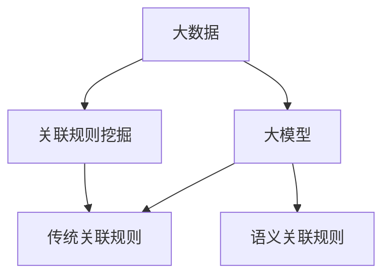

                 

## 1. 背景介绍

在电子商务和零售行业，商品关联分析（Product Association Analysis）是一种关键的数据挖掘技术，旨在发现和推荐与用户当前查看或购买的商品相关的其他商品。这种技术可以提高用户体验，增加销售额，并帮助企业更好地理解其客户的需求。随着大数据和人工智能技术的发展，大模型（Large Language Models）在商品关联分析中的应用变得越来越重要。

## 2. 核心概念与联系

### 2.1 关联规则

关联规则是商品关联分析的核心概念之一。它描述了两个或多个商品一起出现的可能性。关联规则通常用于描述购物篮中的商品，即如果一个客户购买了商品A，那么他们也很可能购买商品B。

### 2.2 大模型

大模型是一种人工智能模型，通过处理大量文本数据来学习语言表示。它们可以理解上下文，生成人类可读的文本，并回答复杂的查询。在商品关联分析中，大模型可以用于理解商品的语义，并基于此推荐相关商品。

### 2.3 关联规则与大模型的联系

大模型可以帮助改进关联规则的挖掘过程。传统的关联规则挖掘方法主要基于频繁项集挖掘，可能会遗漏语义相关但频繁度不高的商品。大模型可以通过理解商品的语义来发现这些关联。



## 3. 核心算法原理 & 具体操作步骤

### 3.1 算法原理概述

大模型在商品关联分析中的应用通常基于如下原理：

1. **表示学习**：大模型学习商品的语义表示，即将商品表示为向量，这些向量可以用于衡量商品之间的相似性。
2. **相似性计算**：使用商品的语义表示计算商品之间的相似性。通常，余弦相似性或欧几里得距离被用于此目的。
3. **推荐**：基于相似性计算结果，推荐与用户当前查看或购买的商品相关的其他商品。

### 3.2 算法步骤详解

1. **数据预处理**：收集商品数据，如商品名称、描述、类别等。清洗数据，去除无用信息，并将文本数据转换为数字表示。
2. **表示学习**：使用大模型（如Word2Vec、GloVe、BERT等）学习商品的语义表示。
3. **相似性计算**：计算商品之间的相似性。这可以通过余弦相似性、欧几里得距离或其他相似性度量来实现。
4. **推荐**：基于相似性计算结果，推荐与用户当前查看或购买的商品相关的其他商品。这可以通过排序推荐、协同过滤等方法来实现。

### 3.3 算法优缺点

**优点**：

* 可以发现语义相关但频繁度不高的商品。
* 可以处理大规模数据集。
* 可以提供更准确的推荐。

**缺点**：

* 计算成本高。
* 训练大模型需要大量的计算资源和时间。
* 可能会出现过度拟合的情况。

### 3.4 算法应用领域

大模型在商品关联分析中的应用可以在各种电子商务和零售平台上看到，如亚马逊、eBay、京东等。它们也可以应用于其他需要推荐系统的领域，如电影推荐、音乐推荐等。

## 4. 数学模型和公式 & 详细讲解 & 举例说明

### 4.1 数学模型构建

商品关联分析的数学模型可以表示为：

$$R = f(S, C, P)$$

其中，$R$表示推荐结果，$S$表示商品的语义表示，$C$表示商品之间的相似性，$P$表示推荐策略。

### 4.2 公式推导过程

商品的语义表示$S$可以通过大模型学习得到。商品之间的相似性$C$可以通过余弦相似性或欧几里得距离计算得到：

$$C_{ij} = \cos(S_i, S_j) = \frac{S_i \cdot S_j}{\|S_i\| \|S_j\|}$$

$$C_{ij} = \sqrt{\sum_{k=1}^{n}(S_{ik} - S_{jk})^2}$$

其中，$S_i$和$S_j$分别是商品$i$和$j$的语义表示，$n$是语义表示的维度。

### 4.3 案例分析与讲解

假设我们有两个商品，$A$和$B$，它们的语义表示分别是$S_A = [0.1, 0.2, 0.3]$和$S_B = [0.2, 0.3, 0.1]$。那么，它们之间的余弦相似性为：

$$C_{AB} = \cos(S_A, S_B) = \frac{0.1 \times 0.2 + 0.2 \times 0.3 + 0.3 \times 0.1}{\sqrt{0.1^2 + 0.2^2 + 0.3^2} \sqrt{0.2^2 + 0.3^2 + 0.1^2}} \approx 0.97$$

这表明商品$A$和$B$非常相似。

## 5. 项目实践：代码实例和详细解释说明

### 5.1 开发环境搭建

要实现大模型在商品关联分析中的应用，我们需要以下软件和库：

* Python 3.7+
* TensorFlow 2.0+
* Gensim
* Scikit-learn
* Pandas
* NumPy

### 5.2 源代码详细实现

以下是一个简单的示例，展示如何使用Word2Vec学习商品的语义表示，并计算商品之间的余弦相似性：

```python
from gensim.models import Word2Vec
import numpy as np
import pandas as pd

# 假设我们有以下商品数据
data = [
    ['商品A', '商品B', '商品C'],
    ['商品B', '商品C', '商品D'],
    ['商品C', '商品D', '商品E'],
]

# 将数据转换为DataFrame
df = pd.DataFrame(data, columns=['商品1', '商品2', '商品3'])

# 使用Word2Vec学习商品的语义表示
model = Word2Vec(df.values.flatten().tolist(), size=100, window=5, min_count=1, workers=4, sg=0)

# 计算商品之间的余弦相似性
def cosine_similarity(a, b):
    return np.dot(a, b) / (np.linalg.norm(a) * np.linalg.norm(b))

similarity_matrix = np.zeros((len(df.columns), len(df.columns)))

for i in range(len(df.columns)):
    for j in range(len(df.columns)):
        similarity_matrix[i][j] = cosine_similarity(model.wv[df.columns[i]], model.wv[df.columns[j]])

print(similarity_matrix)
```

### 5.3 代码解读与分析

在代码中，我们首先使用Word2Vec学习商品的语义表示。然后，我们定义了一个函数`cosine_similarity`来计算两个商品的余弦相似性。最后，我们计算商品之间的余弦相似性矩阵。

### 5.4 运行结果展示

运行结果是一个余弦相似性矩阵，它表示商品之间的相似性。这个矩阵可以用于推荐系统，以推荐与用户当前查看或购买的商品相关的其他商品。

## 6. 实际应用场景

### 6.1 当前应用

大模型在商品关联分析中的应用已经在各种电子商务和零售平台上得到广泛应用。例如，亚马逊的"人们通常一起购买"功能就是基于关联规则的一种应用。

### 6.2 未来应用展望

未来，大模型在商品关联分析中的应用可能会扩展到更多领域，如个性化推荐、跨渠道营销等。此外，随着大模型技术的发展，商品关联分析的准确性和效率可能会进一步提高。

## 7. 工具和资源推荐

### 7.1 学习资源推荐

* "Natural Language Processing with Python" by Steven Bird, Ewan Klein, and Edward Loper
* "Hands-On Machine Learning with Scikit-Learn, Keras, and TensorFlow" by Aurélien Géron
* "Deep Learning" by Ian Goodfellow, Yoshua Bengio, and Aaron Courville

### 7.2 开发工具推荐

* Jupyter Notebook
* Google Colab
* PyCharm

### 7.3 相关论文推荐

* "Word2Vec: Distributed Representations of Words and Phrases and their Compositionality" by Tomas Mikolov, Kai Chen, Greg Corrado, and Jeffrey Dean
* "BERT: Pre-training of Deep Bidirectional Transformers for Language Understanding" by Jacob Devlin, Ming-Wei Chang, and Kenton Lee
* "DeepFM: A Factorization-Machine based Neural Network for CTR Prediction" by Huifeng Guo, Wei Lu, and Maarten de Rijke

## 8. 总结：未来发展趋势与挑战

### 8.1 研究成果总结

大模型在商品关联分析中的应用已经取得了显著的成果，如提高了推荐系统的准确性，发现了语义相关但频繁度不高的商品等。

### 8.2 未来发展趋势

未来，大模型在商品关联分析中的应用可能会朝着以下方向发展：

* **多模式学习**：结合文本、图像、音频等多模式数据进行学习。
* **个性化推荐**：基于用户的历史行为和偏好进行个性化推荐。
* **实时推荐**：在用户浏览或购买商品时实时推荐相关商品。

### 8.3 面临的挑战

大模型在商品关联分析中的应用也面临着以下挑战：

* **计算成本**：大模型的训练和推理需要大量的计算资源和时间。
* **数据质量**：商品关联分析的有效性取决于数据的质量。如果数据不完整或存在错误，那么推荐结果可能会不准确。
* **隐私保护**：商品关联分析涉及用户的购买行为和偏好，需要考虑隐私保护问题。

### 8.4 研究展望

未来的研究可能会关注以下领域：

* **解释性AI**：开发可以解释其推荐结果的大模型，以帮助用户理解为什么某个商品被推荐给他们。
* **对抗性学习**：开发可以抵抗对抗性攻击的大模型，以提高推荐系统的安全性。
* **跨语言推荐**：开发可以处理多语言数据的大模型，以支持跨语言推荐。

## 9. 附录：常见问题与解答

**Q：大模型在商品关联分析中的优势是什么？**

A：大模型在商品关联分析中的优势包括可以发现语义相关但频繁度不高的商品，可以处理大规模数据集，可以提供更准确的推荐等。

**Q：大模型在商品关联分析中的缺点是什么？**

A：大模型在商品关联分析中的缺点包括计算成本高，训练大模型需要大量的计算资源和时间，可能会出现过度拟合的情况等。

**Q：大模型在商品关联分析中的应用有哪些？**

A：大模型在商品关联分析中的应用包括电子商务和零售平台上的推荐系统，电影推荐，音乐推荐等。

**Q：大模型在商品关联分析中的未来发展趋势是什么？**

A：大模型在商品关联分析中的未来发展趋势包括多模式学习，个性化推荐，实时推荐等。

**Q：大模型在商品关联分析中的面临的挑战是什么？**

A：大模型在商品关联分析中的面临的挑战包括计算成本，数据质量，隐私保护等。

**Q：大模型在商品关联分析中的研究展望是什么？**

A：大模型在商品关联分析中的研究展望包括解释性AI，对抗性学习，跨语言推荐等。

## 作者：禅与计算机程序设计艺术 / Zen and the Art of Computer Programming

