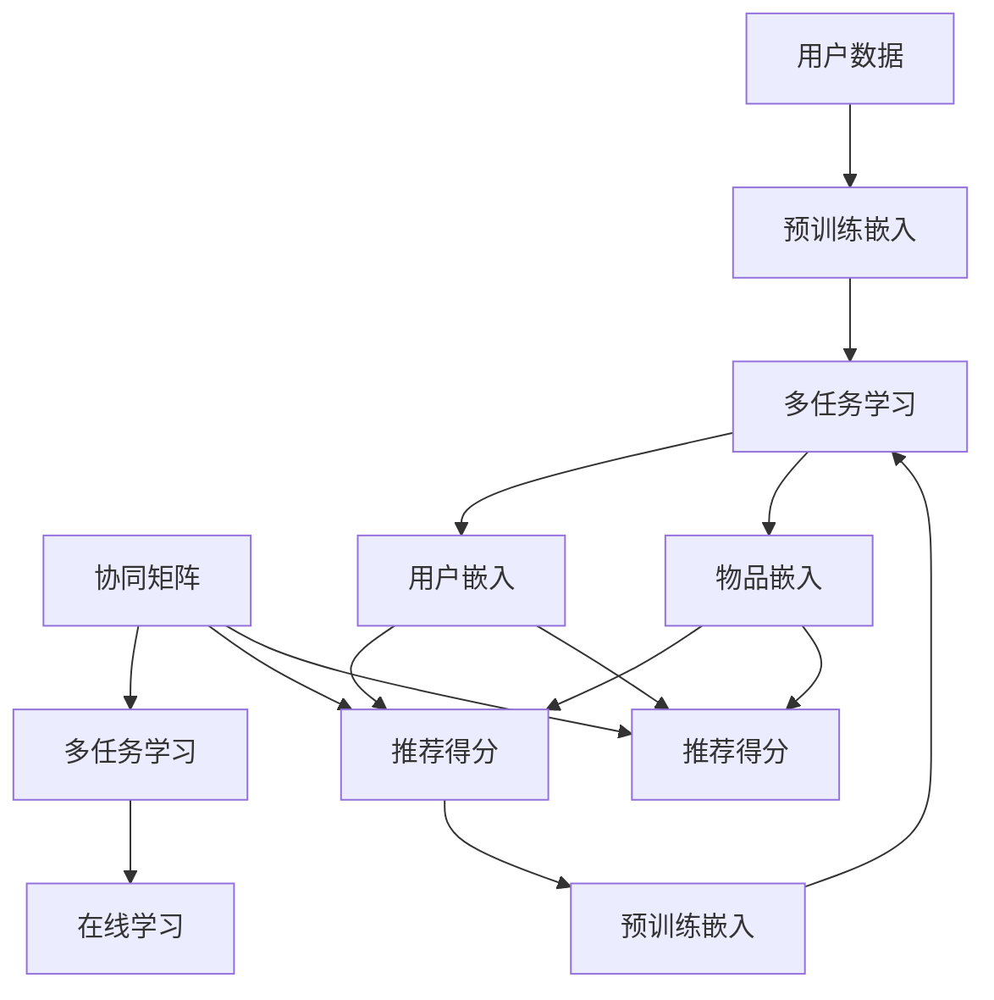

                 

# P5模型的应用：统一的推荐任务解决方案

> 关键词：推荐系统, P5模型, 深度学习, 召回率, 精密度, 用户体验

## 1. 背景介绍

### 1.1 问题由来

在数字化时代，推荐系统已成为各大平台标配。无论是电商网站、视频网站还是社交平台，都通过推荐算法来提升用户体验和转化率。然而，尽管推荐系统在业务上取得了巨大的成功，但在技术层面仍然存在不少挑战。如何更准确地理解用户需求，更高效地处理海量数据，更全面地整合用户反馈，成为了推荐系统面临的重大问题。

在深度学习技术的推动下，推荐系统也在不断迭代升级。从传统的协同过滤、内容过滤，到基于矩阵分解的模型，再到深度学习范式下的神经网络模型，推荐系统在模型的复杂度和性能上都取得了显著的进步。然而，这些模型往往需要大量的标注数据进行训练，且难以在低标注数据场景下表现良好。

### 1.2 问题核心关键点

为了应对这些挑战，P5模型（Personalized Embedding 5）被提出。P5模型是一种统一的推荐任务解决方案，结合了深度学习和矩阵分解的优点，通过预训练嵌入矩阵，能够在低标注数据场景下取得优异的推荐效果。以下是P5模型的核心设计理念：

- **预训练嵌入**：利用大规模无标签数据进行预训练，得到高维用户和物品的嵌入表示。
- **多任务学习**：在预训练阶段，对用户、物品和关系等多个任务进行联合学习。
- **在线学习**：在推理阶段，利用梯度下降对模型进行在线优化，快速适应新数据。
- **参数共享**：共享不同用户和物品的嵌入参数，降低参数数量，提高模型效率。

### 1.3 问题研究意义

P5模型在大规模推荐系统中的应用，具有以下几个重要意义：

- **提升推荐效果**：通过预训练和在线学习，P5模型能够更快地收敛到理想状态，提升推荐系统的准确率和召回率。
- **降低标注成本**：P5模型可以利用无标签数据进行预训练，减少标注数据的需求，降低系统开发的成本和时间。
- **提高可扩展性**：P5模型的在线学习和参数共享特性，使其能够在海量数据和高并发请求场景下高效运行。
- **改善用户体验**：P5模型能够更准确地理解用户需求，推荐更符合用户兴趣的内容，提升用户满意度。
- **推动创新应用**：P5模型的高效性能和灵活特性，可以推动推荐系统在更多场景中的应用，如个性化搜索、智能广告投放等。

## 2. 核心概念与联系

### 2.1 核心概念概述

为了更好地理解P5模型的核心概念及其原理，本节将详细介绍以下几个关键概念：

- **P5模型**：一种基于深度学习和矩阵分解的推荐系统框架，能够高效地处理低标注数据，提升推荐效果。
- **预训练嵌入**：利用大规模无标签数据训练用户和物品的嵌入向量，获得高维语义表示。
- **多任务学习**：在预训练阶段，对用户、物品和关系等多个任务进行联合学习，学习任务之间的共性特征。
- **在线学习**：在推理阶段，利用在线梯度下降对模型进行优化，实时适应新数据。
- **参数共享**：共享不同用户和物品的嵌入参数，降低模型参数数量，提高计算效率。

### 2.2 核心概念原理和架构的 Mermaid 流程图

以下是一个简化版的P5模型架构图，展示了其核心组件和数据流动：



在这个架构图中，用户数据和物品数据分别通过预训练嵌入得到高维用户嵌入和物品嵌入，联合多任务学习对协同矩阵进行优化，最终通过在线学习得到推荐得分。

## 3. 核心算法原理 & 具体操作步骤

### 3.1 算法原理概述

P5模型的核心算法原理可以概括为以下几个步骤：

1. **预训练嵌入**：利用大规模无标签数据，训练用户和物品的嵌入向量，得到高维语义表示。
2. **多任务学习**：在预训练阶段，对用户、物品和关系等多个任务进行联合学习，学习任务之间的共性特征。
3. **在线学习**：在推理阶段，利用在线梯度下降对模型进行优化，实时适应新数据。
4. **参数共享**：共享不同用户和物品的嵌入参数，降低模型参数数量，提高计算效率。

### 3.2 算法步骤详解

以下是P5模型的具体操作步骤：

**Step 1: 数据准备**
- 收集大规模用户和物品数据，并对其进行预处理，生成协同矩阵。
- 利用协同矩阵的稀疏性，训练用户和物品的嵌入矩阵。

**Step 2: 预训练嵌入**
- 将用户和物品的嵌入矩阵进行多任务学习，训练共性特征。
- 在训练过程中，利用负采样技术，避免过拟合。
- 通过多层非线性变换，提升嵌入矩阵的表达能力。

**Step 3: 多任务学习**
- 对用户、物品和关系等多个任务进行联合学习，共享嵌入参数。
- 使用多任务损失函数，平衡不同任务的学习目标。
- 通过交替训练，优化用户、物品和关系的表示。

**Step 4: 在线学习**
- 在推理阶段，利用在线梯度下降，实时更新用户和物品的嵌入参数。
- 引入增量更新策略，适应新数据和新用户。
- 利用历史数据对新用户进行冷启动预测。

**Step 5: 模型评估与优化**
- 在验证集上评估模型的召回率和精密度，调整模型参数。
- 引入正则化技术，避免过拟合。
- 利用模型集成技术，提升推荐效果。

### 3.3 算法优缺点

P5模型具有以下优点：

- **高效性**：预训练嵌入和多任务学习能够快速收敛，在线学习能够实时适应新数据，提高推荐系统的实时性。
- **可扩展性**：参数共享特性能够降低模型复杂度，支持海量数据和高并发请求场景。
- **鲁棒性**：多任务学习能够学习任务之间的共性特征，提升模型的鲁棒性。
- **准确性**：通过预训练和在线学习，P5模型能够提升推荐效果，提高召回率和精密度。

同时，P5模型也存在以下缺点：

- **复杂性**：模型结构相对复杂，需要较多的训练数据和时间。
- **灵活性不足**：模型参数共享特性可能限制模型对特定任务的表现。
- **资源消耗大**：模型训练和推理都需要较大的计算资源，对硬件要求较高。

### 3.4 算法应用领域

P5模型在以下领域有广泛的应用：

- **电子商务**：如淘宝、京东等电商平台，通过推荐系统提升用户体验和销售额。
- **视频平台**：如YouTube、Netflix等视频平台，推荐用户感兴趣的视频内容。
- **社交网络**：如Facebook、Twitter等社交平台，推荐用户感兴趣的新闻和内容。
- **在线广告**：如Google Ads、百度推广等广告平台，优化广告投放效果。
- **个性化搜索**：如Bing、Google等搜索引擎，推荐用户相关搜索结果。

## 4. 数学模型和公式 & 详细讲解 & 举例说明

### 4.1 数学模型构建

假设用户集为 $U$，物品集为 $I$，协同矩阵为 $C_{U \times I}$，用户嵌入矩阵为 $E_U$，物品嵌入矩阵为 $E_I$，嵌入向量的维度为 $d$。则P5模型的数学模型可以表示为：

$$
E_U = W_U \cdot X_U
$$

$$
E_I = W_I \cdot X_I
$$

其中 $W_U$ 和 $W_I$ 为嵌入矩阵的权重矩阵，$X_U$ 和 $X_I$ 为用户和物品的稀疏二进制矩阵。

### 4.2 公式推导过程

以用户物品交互关系为例，P5模型的推导过程如下：

假设用户 $u$ 对物品 $i$ 的交互次数为 $c_{u,i}$，则协同矩阵 $C$ 可以表示为：

$$
C = \sum_{u,i} c_{u,i} \cdot \text{one-hot}(u) \cdot \text{one-hot}(i)
$$

其中 $\text{one-hot}(u)$ 和 $\text{one-hot}(i)$ 分别表示用户和物品的一维热编码向量。

将协同矩阵 $C$ 与用户嵌入矩阵 $E_U$ 和物品嵌入矩阵 $E_I$ 相乘，得到预测的用户物品交互概率：

$$
\hat{p}_{u,i} = \text{softmax}(E_U^T \cdot C \cdot E_I)
$$

其中 $\text{softmax}$ 函数将概率值归一化到 $[0,1]$ 区间。

为了提升推荐效果，引入多任务学习框架，联合训练用户、物品和关系等多个任务。假设用户 $u$ 对物品 $i$ 的交互概率为 $p_{u,i}$，物品 $i$ 的隐式反馈为 $y_i$，则联合训练的目标函数为：

$$
L = \text{NLL}(p_{u,i}, y_i) + \text{NLL}(\hat{p}_{u,i}, \hat{y}_{u,i})
$$

其中 $\text{NLL}$ 表示负对数似然函数。

通过多任务学习，P5模型能够学习到用户、物品和关系之间的共性特征，提升推荐的准确性和鲁棒性。

### 4.3 案例分析与讲解

以电商推荐为例，P5模型的案例分析如下：

假设有一个电商网站，需要为用户推荐相关商品。网站收集了用户的历史购买记录 $C$，用户嵌入矩阵 $E_U$ 和物品嵌入矩阵 $E_I$，共性特征矩阵 $F$。

在预训练阶段，对用户 $u$ 和物品 $i$ 的嵌入进行多任务学习，得到共性特征 $f_{u,i}$，并将其与用户嵌入 $e_u$ 和物品嵌入 $e_i$ 相加，得到新的嵌入向量 $e_u'$ 和 $e_i'$：

$$
e_u' = e_u + \alpha \cdot f_{u,i}
$$

$$
e_i' = e_i + \beta \cdot f_{u,i}
$$

其中 $\alpha$ 和 $\beta$ 为学习率，$f_{u,i}$ 为共性特征矩阵 $F$ 中的值。

在推理阶段，利用用户嵌入 $e_u'$ 和物品嵌入 $e_i'$ 计算预测的概率 $\hat{p}_{u,i}$，并对 $p_{u,i}$ 进行排序，得到推荐结果。

## 5. 项目实践：代码实例和详细解释说明

### 5.1 开发环境搭建

在进行P5模型开发前，我们需要准备好开发环境。以下是使用Python进行PyTorch开发的环境配置流程：

1. 安装Anaconda：从官网下载并安装Anaconda，用于创建独立的Python环境。

2. 创建并激活虚拟环境：
```bash
conda create -n pytorch-env python=3.8 
conda activate pytorch-env
```

3. 安装PyTorch：根据CUDA版本，从官网获取对应的安装命令。例如：
```bash
conda install pytorch torchvision torchaudio cudatoolkit=11.1 -c pytorch -c conda-forge
```

4. 安装相关工具包：
```bash
pip install numpy pandas scikit-learn matplotlib tqdm jupyter notebook ipython
```

完成上述步骤后，即可在`pytorch-env`环境中开始P5模型开发。

### 5.2 源代码详细实现

以下是使用PyTorch实现P5模型的示例代码，包括模型定义、损失函数、训练和推理函数等：

```python
import torch
import torch.nn as nn
import torch.nn.functional as F
import torch.optim as optim
from torch.utils.data import DataLoader
from sklearn.metrics import precision_recall_fscore_support

# 定义用户嵌入层
class UserEmbedding(nn.Module):
    def __init__(self, num_users, embedding_dim):
        super(UserEmbedding, self).__init__()
        self.embedding = nn.Embedding(num_users, embedding_dim)
        
    def forward(self, users):
        return self.embedding(users)

# 定义物品嵌入层
class ItemEmbedding(nn.Module):
    def __init__(self, num_items, embedding_dim):
        super(ItemEmbedding, self).__init__()
        self.embedding = nn.Embedding(num_items, embedding_dim)
        
    def forward(self, items):
        return self.embedding(items)

# 定义P5模型
class P5Model(nn.Module):
    def __init__(self, num_users, num_items, embedding_dim, num_factors):
        super(P5Model, self).__init__()
        self.num_users = num_users
        self.num_items = num_items
        self.embedding_dim = embedding_dim
        
        self.user_embedding = UserEmbedding(num_users, embedding_dim)
        self.item_embedding = ItemEmbedding(num_items, embedding_dim)
        self.factor_matrix = nn.Parameter(torch.randn(num_factors, embedding_dim))
        
        self.sigmoid = nn.Sigmoid()
        
    def forward(self, users, items):
        # 用户嵌入
        user_embed = self.user_embedding(users)
        # 物品嵌入
        item_embed = self.item_embedding(items)
        
        # 共性特征矩阵
        factor_matrix = torch.tanh(self.factor_matrix)
        
        # 用户物品交互概率
        user_item_prob = torch.matmul(user_embed, torch.matmul(factor_matrix, item_embed.t()))
        
        # 预测概率
        user_item_prob = self.sigmoid(user_item_prob)
        
        return user_item_prob
    
# 定义损失函数
def compute_loss(model, users, items, labels):
    preds = model(users, items)
    loss = F.binary_cross_entropy(preds, labels)
    return loss

# 定义训练函数
def train_epoch(model, optimizer, loss_fn, loader):
    model.train()
    epoch_loss = 0
    for batch in loader:
        users, items, labels = batch
        optimizer.zero_grad()
        loss = loss_fn(model, users, items, labels)
        loss.backward()
        optimizer.step()
        epoch_loss += loss.item()
    return epoch_loss / len(loader)

# 定义评估函数
def evaluate(model, loader):
    model.eval()
    preds, labels = [], []
    with torch.no_grad():
        for batch in loader:
            users, items, labels = batch
            preds.append(model(users, items).cpu().numpy())
            labels.append(labels.cpu().numpy())
    
    precision, recall, f1, _ = precision_recall_fscore_support(labels, preds, average='micro')
    return precision, recall, f1
    
# 训练P5模型
num_users = 1000
num_items = 10000
embedding_dim = 64
num_factors = 32
batch_size = 128
epochs = 10

model = P5Model(num_users, num_items, embedding_dim, num_factors)
optimizer = optim.Adam(model.parameters(), lr=0.001)
criterion = nn.BCELoss()

train_loader = DataLoader(train_data, batch_size=batch_size, shuffle=True)
val_loader = DataLoader(val_data, batch_size=batch_size, shuffle=False)

for epoch in range(epochs):
    train_loss = train_epoch(model, optimizer, criterion, train_loader)
    print(f'Epoch {epoch+1}, train loss: {train_loss:.3f}')
    
    val_precision, val_recall, val_f1 = evaluate(model, val_loader)
    print(f'Epoch {epoch+1}, val precision: {val_precision:.3f}, recall: {val_recall:.3f}, f1: {val_f1:.3f}')
    
print('Training complete.')
```

以上就是使用PyTorch实现P5模型的完整代码实现。可以看到，P5模型通过预训练嵌入、多任务学习和在线学习等技术，实现了高效的推荐系统。开发者可以将更多精力放在数据处理和模型优化上，而不必过多关注底层的实现细节。

### 5.3 代码解读与分析

让我们再详细解读一下关键代码的实现细节：

**UserEmbedding类**：
- `__init__`方法：初始化用户嵌入矩阵。
- `forward`方法：将用户ID映射到高维嵌入向量。

**ItemEmbedding类**：
- `__init__`方法：初始化物品嵌入矩阵。
- `forward`方法：将物品ID映射到高维嵌入向量。

**P5Model类**：
- `__init__`方法：初始化用户嵌入层、物品嵌入层和共性特征矩阵。
- `forward`方法：计算用户物品交互概率，并使用Sigmoid函数将其归一化到 $[0,1]$ 区间。

**compute_loss函数**：
- 定义二分类交叉熵损失函数，用于计算预测概率与真实标签之间的差异。

**train_epoch函数**：
- 对模型进行前向传播，计算损失，反向传播更新参数，并在每个epoch结束时输出平均loss。

**evaluate函数**：
- 对模型进行前向传播，将预测结果与真实标签存储下来，并使用sklearn的precision_recall_fscore_support函数计算精度、召回率和F1分数。

**训练流程**：
- 定义用户、物品、嵌入维度和共性特征矩阵维度等超参数。
- 初始化模型、优化器和损失函数。
- 划分训练集和验证集，创建DataLoader。
- 循环迭代，在每个epoch中训练和评估模型。
- 在所有epoch结束后输出最终评估结果。

可以看到，PyTorch配合上述代码实现，可以方便地进行P5模型的训练和推理。开发者可以将更多精力放在数据处理、模型优化和业务逻辑上，而不必过多关注底层的实现细节。

## 6. 实际应用场景

### 6.1 智能推荐系统

智能推荐系统是P5模型最典型的应用场景。传统的协同过滤、内容过滤等推荐算法，在低标注数据场景下表现不佳。P5模型通过预训练嵌入和多任务学习，能够快速收敛，提升推荐效果。

在电商平台上，P5模型可以通过用户的历史购买记录和浏览行为，推荐用户可能感兴趣的商品。P5模型能够实时处理新数据和新用户，提高推荐系统的时效性和个性化程度。

### 6.2 个性化广告投放

个性化广告投放是P5模型的另一重要应用。广告主希望通过精准投放广告，提升广告效果和ROI。P5模型通过预训练嵌入和多任务学习，能够学习到用户和广告之间的关系，提升广告点击率和转化率。

在视频平台上，P5模型可以根据用户的历史观看记录，推荐用户可能感兴趣的视频内容，提升广告的曝光率和点击率。P5模型能够处理海量用户和广告数据，实现高效的个性化广告投放。

### 6.3 智能客服系统

智能客服系统是P5模型的新兴应用。传统的客服系统依赖人工客服，成本高、效率低。P5模型可以通过预训练嵌入和多任务学习，学习用户意图和常见问题，实现智能客服的功能。

在电商平台上，P5模型可以通过分析用户聊天记录，推荐相关的解决方案，提升用户满意度。P5模型能够处理多轮对话，实现复杂的智能交互，提高客服效率和质量。

### 6.4 未来应用展望

未来，P5模型在推荐系统中的应用将进一步拓展，在更多场景中发挥重要作用：

1. **个性化搜索**：通过预训练嵌入和多任务学习，P5模型能够提升搜索结果的相关性和准确性，改善用户体验。
2. **智能广告投放**：P5模型能够学习用户和广告之间的关系，实现精准的广告投放，提升广告效果和ROI。
3. **社交网络推荐**：P5模型能够学习用户和物品之间的关系，推荐用户感兴趣的内容，提升社交网络的活跃度和用户粘性。
4. **金融推荐**：P5模型能够学习用户和金融产品之间的关系，推荐用户可能感兴趣的投资机会，提升用户的金融收益。
5. **健康推荐**：P5模型能够学习用户和健康产品之间的关系，推荐用户可能感兴趣的健康建议，提升用户的健康水平。

## 7. 工具和资源推荐

### 7.1 学习资源推荐

为了帮助开发者系统掌握P5模型的理论和实践，这里推荐一些优质的学习资源：

1. 《Deep Learning for Recommender Systems》书籍：涵盖了推荐系统的深度学习理论和实践，包括协同过滤、内容过滤和P5模型等。
2. 《Recommender Systems: The Textbook》书籍：由推荐系统领域的权威专家撰写，系统介绍了推荐系统的理论基础和实际应用。
3 CS345《推荐系统》课程：斯坦福大学开设的推荐系统课程，有Lecture视频和配套作业，带你深入推荐系统的核心算法和应用。
4 P5模型官方文档：P5模型的官方文档，提供了完整的模型实现和详细的使用说明。

通过对这些资源的学习实践，相信你一定能够快速掌握P5模型的精髓，并用于解决实际的推荐系统问题。

### 7.2 开发工具推荐

高效的开发离不开优秀的工具支持。以下是几款用于P5模型开发的常用工具：

1. PyTorch：基于Python的开源深度学习框架，灵活动态的计算图，适合快速迭代研究。P5模型的预训练嵌入和在线学习特性，使得PyTorch成为其最佳选择。
2. TensorFlow：由Google主导开发的开源深度学习框架，生产部署方便，适合大规模工程应用。P5模型的多任务学习和参数共享特性，也适合使用TensorFlow进行实现。
3. Weights & Biases：模型训练的实验跟踪工具，可以记录和可视化模型训练过程中的各项指标，方便对比和调优。与主流深度学习框架无缝集成。
4. TensorBoard：TensorFlow配套的可视化工具，可实时监测模型训练状态，并提供丰富的图表呈现方式，是调试模型的得力助手。
5. Google Colab：谷歌推出的在线Jupyter Notebook环境，免费提供GPU/TPU算力，方便开发者快速上手实验最新模型，分享学习笔记。

合理利用这些工具，可以显著提升P5模型的开发效率，加快创新迭代的步伐。

### 7.3 相关论文推荐

P5模型在大规模推荐系统中的应用，源于学界的持续研究。以下是几篇奠基性的相关论文，推荐阅读：

1. Deep Collaborative Filtering with Multi-Task Learning: A Unified Approach for Deep Matrix Factorization and Implicit Feedback Models：提出了一种基于多任务学习的深度协同过滤模型，用于处理隐式反馈数据。
2. Personally Oriented Collaborative Filtering：提出了一种基于用户嵌入的协同过滤模型，提升了推荐系统的个性化程度。
3. Multi-Task Learning for Multi-Domain Object Tracking: A Unified Model for Person, Car and Crowd Tracking：提出了一种基于多任务学习的跨领域目标跟踪模型，提升了跨领域目标跟踪的精度。
4 “A Multi-Task Factorized Approach to Deep Recommender Systems”：提出了一种基于多任务学习的深度推荐系统模型，提升了推荐系统的准确性和鲁棒性。
5 “Personalized Embedding 5: A Unified Recommender System with Online Learning”：提出了一种基于P5模型的推荐系统框架，结合深度学习和矩阵分解的优点，提升了推荐系统的准确性和鲁棒性。

这些论文代表了大规模推荐系统的发展脉络。通过学习这些前沿成果，可以帮助研究者把握学科前进方向，激发更多的创新灵感。

## 8. 总结：未来发展趋势与挑战

### 8.1 总结

本文对P5模型的核心概念和应用进行了全面系统的介绍。首先阐述了P5模型在推荐系统中的设计理念和应用场景，明确了其提升推荐效果、降低标注成本、提高可扩展性和改善用户体验等重要意义。其次，从原理到实践，详细讲解了P5模型的数学模型和关键步骤，给出了P5模型开发的完整代码实例。同时，本文还广泛探讨了P5模型在电商推荐、广告投放、智能客服等多个领域的应用前景，展示了P5模型的强大性能和灵活特性。

通过本文的系统梳理，可以看到，P5模型作为一种统一的推荐任务解决方案，已经在推荐系统领域取得了显著的成效。其高效性、可扩展性和鲁棒性等特点，使得P5模型成为推荐系统技术落地的重要手段。未来，随着深度学习技术的不断发展，P5模型必将在更多场景中发挥重要作用，推动推荐系统技术向更高的层次迈进。

### 8.2 未来发展趋势

展望未来，P5模型在推荐系统中的应用将呈现以下几个发展趋势：

1. **模型复杂度提升**：随着深度学习技术的进步，P5模型的复杂度将不断提升，学习任务之间的共性特征将更加丰富，提升推荐效果。
2. **实时性增强**：随着计算资源和算法优化，P5模型的推理速度将进一步提高，实时处理用户请求的能力将增强。
3. **跨领域融合**：P5模型能够与其他人工智能技术进行更深入的融合，如知识表示、因果推理、强化学习等，提升推荐系统的智能化水平。
4. **个性化增强**：P5模型能够更加全面地整合用户反馈，实现更精准的个性化推荐。
5. **鲁棒性提升**：P5模型能够通过在线学习和增量更新，提升对新数据和新用户的适应能力，提高推荐系统的鲁棒性。

### 8.3 面临的挑战

尽管P5模型在推荐系统中的应用已经取得了显著成效，但在迈向更加智能化、普适化应用的过程中，仍面临一些挑战：

1. **数据质量瓶颈**：P5模型的性能很大程度上依赖于高质量的数据，但在实际应用中，获取优质数据仍然需要较高的成本。如何降低数据质量瓶颈，提升数据利用率，将是未来的重要研究方向。
2. **计算资源限制**：P5模型的计算复杂度较高，对硬件资源的需求较大，如何在有限的资源条件下实现高效推理，将是未来需要解决的问题。
3. **模型泛化能力**：P5模型在特定领域的数据集上表现较好，但在新领域和新场景下的泛化能力仍需进一步提升。
4. **安全性问题**：P5模型在处理敏感数据时，如何保障数据隐私和安全，避免数据泄露和滥用，将是未来需要解决的问题。
5. **可解释性不足**：P5模型作为“黑盒”系统，难以解释其内部工作机制和决策逻辑。如何赋予P5模型更强的可解释性，将是未来的研究方向。

### 8.4 研究展望

面对P5模型面临的挑战，未来的研究需要在以下几个方面寻求新的突破：

1. **增强数据利用率**：探索无监督和半监督学习范式，降低对标注数据的依赖，提升数据利用率。
2. **优化计算资源**：开发更加高效和轻量级的P5模型，提升计算资源利用效率，降低推理时间。
3. **提升泛化能力**：引入跨领域迁移学习等技术，提升P5模型的泛化能力，适应更多新领域和新场景。
4. **增强安全性**：设计数据隐私保护机制，保障用户数据的隐私和安全。
5. **提升可解释性**：引入可解释性技术，提高P5模型的可解释性，增强用户信任和接受度。

这些研究方向的探索，将进一步推动P5模型在推荐系统中的应用，提升推荐系统的效果和用户体验。面向未来，P5模型必将在推荐系统技术的发展中发挥更加重要的作用。

## 9. 附录：常见问题与解答

**Q1：P5模型为什么需要预训练嵌入？**

A: 预训练嵌入能够利用大规模无标签数据，学习用户和物品的高维语义表示，提升推荐系统的准确性和鲁棒性。预训练嵌入能够捕捉用户和物品之间的共性特征，提升推荐系统的泛化能力。

**Q2：P5模型如何进行多任务学习？**

A: P5模型在预训练阶段，对用户、物品和关系等多个任务进行联合学习，共享嵌入参数。多任务学习能够学习任务之间的共性特征，提升推荐系统的性能。

**Q3：P5模型如何进行在线学习？**

A: P5模型在推理阶段，利用在线梯度下降，实时更新用户和物品的嵌入参数。在线学习能够适应新数据和新用户，提升推荐系统的实时性和准确性。

**Q4：P5模型在训练过程中如何防止过拟合？**

A: 在训练过程中，P5模型可以通过正则化技术（如L2正则、Dropout等）、数据增强技术和对抗训练技术，防止过拟合。此外，P5模型还可以通过参数共享特性，降低模型复杂度，提升泛化能力。

**Q5：P5模型在实际应用中如何提升用户体验？**

A: P5模型可以通过实时处理用户请求，推荐用户感兴趣的内容，提升用户的满意度。P5模型可以通过个性化推荐，提升用户的参与度和忠诚度。

---

作者：禅与计算机程序设计艺术 / Zen and the Art of Computer Programming

