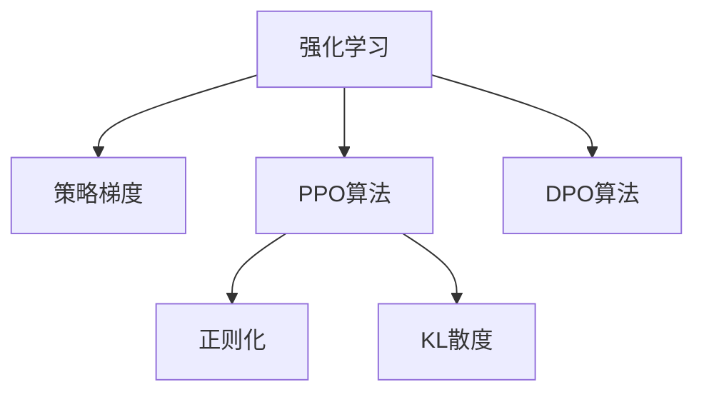

                 

# PPO 和 DPO 算法：强化学习的进步

> 关键词：强化学习, PPO算法, DPO算法, 策略梯度, 策略优化, 实际应用

## 1. 背景介绍

### 1.1 问题由来
强化学习(Reinforcement Learning, RL)是一种通过与环境互动，通过奖励信号指导智能体(如机器人、游戏AI等)学习最优策略的方法。其核心在于通过最大化累计奖励，优化策略，以达到预定的目标。但由于强化学习的高度非凸性，直接求解最优策略极其困难。因此，研究者提出了多种策略优化方法，包括传统的策略梯度(SPG)和近来兴起的基于策略的优化(PPO和DPO)方法。这些方法通过改进策略优化算法，显著提升了强化学习的效率和性能，开启了RL领域的新篇章。

### 1.2 问题核心关键点
PPO和DPO算法作为RL领域的两大代表性算法，其核心在于策略优化。PPO(Policy Gradient with Vanilla Variational Inference)算法，通过一种变分推断方法，提高了策略梯度的稳定性，加快了训练过程。DPO(Distributed Proximal Policy Optimization)算法则通过分布式优化和多机协作，进一步提升了PPO算法的训练效率。这些算法的提出，极大推动了强化学习的实践应用，尤其是在高维度、连续动作空间中的任务上，展现出了巨大的优势。

### 1.3 问题研究意义
PPO和DPO算法的研究，不仅丰富了强化学习的理论基础，还为实际应用提供了新的解决方案。通过这些算法的深入理解，可以更好地设计、训练和部署智能体，解决复杂的高维度动作空间问题。例如，PPO算法在Dota2等复杂电子竞技游戏中，已取得不俗的成绩。DPO算法则通过多机协同训练，在实际应用中展示了更高效的训练速度和更好的泛化性能。总之，这些算法不仅提升了RL模型的性能，还加速了其在工业界的落地应用，具有重要的理论和实践价值。

## 2. 核心概念与联系

### 2.1 核心概念概述

为更好地理解PPO和DPO算法，本节将介绍几个密切相关的核心概念：

- 强化学习(Reinforcement Learning, RL)：通过智能体与环境的交互，优化策略以最大化累计奖励的方法。核心在于策略优化。
- 策略梯度(SPG)：一种通过求解策略参数梯度，优化策略的直接优化方法。但由于梯度的非稳定性和高方差，直接应用存在较大困难。
- PPO算法：一种基于策略的优化方法，通过变分推断，提高了策略梯度的稳定性。
- DPO算法：一种分布式策略优化方法，通过多机协同训练，进一步提升了PPO算法的训练效率。
- 正则化(Regularization)：通过引入正则化项，限制模型的复杂度，避免过拟合。
- KL散度(Kullback-Leibler Divergence)：衡量两个概率分布的相似度，常用于PPO算法中。

这些核心概念之间的逻辑关系可以通过以下Mermaid流程图来展示：



这个流程图展示了大语言模型的核心概念及其之间的关系：

1. 强化学习通过智能体与环境的交互，优化策略以最大化累计奖励。
2. 策略梯度是直接优化策略的方法，但由于梯度的非稳定性和高方差，直接应用存在较大困难。
3. PPO算法通过变分推断，提高了策略梯度的稳定性。
4. DPO算法通过多机协同训练，进一步提升了PPO算法的训练效率。
5. 正则化和KL散度是PPO算法中的关键组件，用于提高策略优化的稳定性。

这些概念共同构成了强化学习的优化框架，为其在复杂任务上的应用提供了理论支持。

## 3. 核心算法原理 & 具体操作步骤
### 3.1 算法原理概述

PPO算法和DPO算法都是基于策略的优化方法，其核心在于通过优化策略参数，使智能体能够最大化累计奖励。PPO算法通过变分推断，提高了策略梯度的稳定性；DPO算法则通过分布式优化和多机协作，进一步提升了训练效率。

### 3.2 算法步骤详解

#### 3.2.1 PPO算法步骤详解

PPO算法通过变分推断，对策略梯度进行优化。其步骤如下：

1. **样本收集**：收集一组轨迹$\tau=\{s_1,a_1,r_1,\dots,s_t,a_t,r_t,\dots,s_T,a_T\}$，其中$s_i$和$a_i$分别表示状态和动作，$r_i$为奖励。

2. **轨迹评估**：计算轨迹的返回值$G_t=\sum_{k=t}^T\gamma^{k-t}r_k$，其中$\gamma$为折扣因子。

3. **策略分布**：计算每个时间步的状态值分布$q_t(s_t)$和动作分布$p_t(a_t|s_t)$。

4. **策略优化**：使用KL散度作为正则化项，计算策略梯度：

   $$
   \mathcal{L}_{\text{PPO}}=\mathbb{E}_{\tau}\left[\mathbb{E}_{\pi_{\theta}}[\log p_t(a_t|s_t)]-\log q_t(a_t|s_t)\right]-\beta\mathbb{E}_{\pi_{\theta}}\left[\mathbb{E}_{q_t}\left[\log p_t(a_t|s_t)\right]-\log q_t(a_t|s_t)\right]
   $$

   其中$p_t(a_t|s_t)$为策略分布，$q_t(a_t|s_t)$为重要性分布。

5. **更新策略参数**：使用梯度下降算法更新策略参数$\theta$。

#### 3.2.2 DPO算法步骤详解

DPO算法在PPO算法的基础上，通过分布式优化和多机协作，进一步提升了训练效率。其步骤如下：

1. **样本收集**：与PPO算法类似，收集一组轨迹$\tau=\{s_1,a_1,r_1,\dots,s_t,a_t,r_t,\dots,s_T,a_T\}$。

2. **策略分布**：计算每个时间步的状态值分布$q_t(s_t)$和动作分布$p_t(a_t|s_t)$。

3. **分布式优化**：在多个机器上并行计算策略梯度，并行更新参数。

4. **KV存储**：使用KV存储系统，保存每个时间步的状态值分布和动作分布，并作为全局状态同步。

5. **多机协作**：多台机器协作更新全局状态，更新策略参数。

6. **同步更新**：多台机器同步更新策略参数，保持全局状态的稳定。

#### 3.2.3 算法优缺点

PPO算法和DPO算法的主要优点包括：

- PPO算法通过变分推断，提高了策略梯度的稳定性，适用于高维度、连续动作空间的任务。
- DPO算法通过分布式优化和多机协作，显著提升了训练效率，可以处理更大规模的数据集。
- 两者均支持策略梯度的计算，能够更好地优化策略参数。

但同时，这些算法也存在一些缺点：

- PPO算法正则化项过于复杂，需要大量计算资源。
- DPO算法多机协作可能存在同步和通信开销。
- 两者对数据分布的敏感性较高，如果数据分布变化，需要重新训练模型。

这些缺点需要在使用这些算法时加以考虑，并进行适当的优化和改进。

#### 3.2.4 算法应用领域

PPO和DPO算法在强化学习的许多实际应用中取得了成功，例如：

- 电子竞技：Dota2等游戏中的AI玩家已取得不俗的成绩。
- 机器人控制：通过PPO和DPO算法训练的智能体能够进行复杂的物理操作，提升机器人任务的执行效率。
- 游戏AI：在各种复杂游戏中，AI玩家已能够与人类玩家竞争。
- 自动驾驶：通过PPO和DPO算法训练的自动驾驶系统，能够处理复杂的城市交通环境。

此外，PPO和DPO算法还广泛应用于虚拟现实(VR)、无人驾驶、工业自动化等领域，推动了这些领域的智能化进程。

## 4. 数学模型和公式 & 详细讲解 & 举例说明

### 4.1 数学模型构建

#### 4.1.1 PPO算法数学模型构建

PPO算法通过变分推断，对策略梯度进行优化。其数学模型构建如下：

1. **策略分布**：假设策略$p_{\theta}(a_t|s_t)$为高斯分布，即

   $$
   p_{\theta}(a_t|s_t) = \mathcal{N}(a_t|\mu_t,\sigma_t)
   $$

2. **重要性分布**：重要性分布$q_{\phi}(a_t|s_t)$可以通过变分推断得到，即

   $$
   q_{\phi}(a_t|s_t) = \mathcal{N}(a_t|\mu_{\phi_t},\sigma_{\phi_t})
   $$

3. **目标函数**：PPO算法通过最大化目标函数$\mathcal{L}_{\text{PPO}}$，优化策略参数$\theta$：

   $$
   \mathcal{L}_{\text{PPO}}=\mathbb{E}_{\tau}\left[\mathbb{E}_{\pi_{\theta}}[\log p_t(a_t|s_t)]-\log q_t(a_t|s_t)\right]-\beta\mathbb{E}_{\pi_{\theta}}\left[\mathbb{E}_{q_t}\left[\log p_t(a_t|s_t)\right]-\log q_t(a_t|s_t)\right]
   $$

   其中$H(p_{\theta},q_{\phi})$为KL散度。

#### 4.1.2 DPO算法数学模型构建

DPO算法通过分布式优化和多机协作，对策略梯度进行优化。其数学模型构建如下：

1. **分布式优化**：假设每个机器上的策略分布$p_{\theta_i}(a_t|s_t)$和重要性分布$q_{\phi_i}(a_t|s_t)$分别为

   $$
   p_{\theta_i}(a_t|s_t) = \mathcal{N}(a_t|\mu_{\theta_i},\sigma_{\theta_i})
   $$

   $$
   q_{\phi_i}(a_t|s_t) = \mathcal{N}(a_t|\mu_{\phi_i},\sigma_{\phi_i})
   $$

2. **KV存储**：假设全局状态$G$包含每个时间步的状态值分布和动作分布：

   $$
   G = \{q_{\phi}(s_t),p_{\theta}(a_t|s_t),\phi_t\}
   $$

3. **多机协作**：假设$n$台机器同时训练，每台机器更新策略参数，更新全局状态：

   $$
   \theta_i \leftarrow \theta_i - \eta\nabla_{\theta_i}\mathcal{L}_{\text{DPO}}
   $$

   其中$\mathcal{L}_{\text{DPO}}$为DPO算法的目标函数。

4. **同步更新**：多台机器同步更新策略参数，更新全局状态：

   $$
   \phi \leftarrow \phi - \eta\nabla_{\phi}\mathcal{L}_{\text{DPO}}
   $$

   $$
   G \leftarrow \{q_{\phi}(s_t),p_{\theta}(a_t|s_t),\phi_t\}
   $$

### 4.2 公式推导过程

#### 4.2.1 PPO算法公式推导

PPO算法的目标函数$\mathcal{L}_{\text{PPO}}$由两部分组成：优势函数$A_{\theta}(a_t|s_t)$和正则化项$H(p_{\theta},q_{\phi})$。

优势函数$A_{\theta}(a_t|s_t)$定义为：

$$
A_{\theta}(a_t|s_t) = \frac{p_{\theta}(a_t|s_t)}{q_{\phi}(a_t|s_t)}\log \frac{p_{\theta}(a_t|s_t)}{q_{\phi}(a_t|s_t)}
$$

正则化项$H(p_{\theta},q_{\phi})$为KL散度，定义为：

$$
H(p_{\theta},q_{\phi}) = \mathbb{E}_{p_{\theta}}\left[\log \frac{p_{\theta}}{q_{\phi}}\right]
$$

因此，PPO算法的目标函数可以表示为：

$$
\mathcal{L}_{\text{PPO}}=\mathbb{E}_{\tau}\left[\mathbb{E}_{\pi_{\theta}}[\log p_t(a_t|s_t)]-\log q_t(a_t|s_t)\right]-\beta\mathbb{E}_{\pi_{\theta}}\left[\mathbb{E}_{q_t}\left[\log p_t(a_t|s_t)\right]-\log q_t(a_t|s_t)\right]
$$

#### 4.2.2 DPO算法公式推导

DPO算法的目标函数$\mathcal{L}_{\text{DPO}}$由分布式优化和多机协作两部分组成。假设每台机器上的目标函数为$\mathcal{L}_{\text{DPO}}^{(i)}$，则全局目标函数为：

$$
\mathcal{L}_{\text{DPO}} = \frac{1}{n}\sum_{i=1}^n\mathcal{L}_{\text{DPO}}^{(i)}
$$

其中每台机器的目标函数$\mathcal{L}_{\text{DPO}}^{(i)}$为：

$$
\mathcal{L}_{\text{DPO}}^{(i)} = -\frac{\eta}{2}\left(\frac{1}{n}\sum_{j=1}^n\left\Vert\nabla_{\theta_j}\mathcal{L}_{\text{DPO}}^{(i)}\right\Vert^2+\frac{1}{2}\left\Vert\nabla_{\theta_i}\mathcal{L}_{\text{DPO}}^{(i)}\right\Vert^2\right)
$$

因此，DPO算法的目标函数可以表示为：

$$
\mathcal{L}_{\text{DPO}} = -\frac{\eta}{2}\left(\frac{1}{n}\sum_{i=1}^n\left\Vert\nabla_{\theta_i}\mathcal{L}_{\text{DPO}}^{(i)}\right\Vert^2+\frac{1}{2}\left\Vert\nabla_{\theta_i}\mathcal{L}_{\text{DPO}}^{(i)}\right\Vert^2\right)
$$

### 4.3 案例分析与讲解

以机器人控制任务为例，分析PPO算法和DPO算法的应用。假设机器人需要在一个复杂的环境中执行任务，目标是最小化运动路径的能量消耗。

1. **样本收集**：收集一组机器人与环境的交互轨迹，包含每个时间步的状态$s_t$和动作$a_t$。

2. **策略分布**：使用PPO算法，计算每个时间步的状态值分布$q_t(s_t)$和动作分布$p_t(a_t|s_t)$。

3. **策略优化**：通过PPO算法的目标函数，优化策略参数$\theta$，使机器人能够最小化能量消耗。

4. **多机协作**：使用DPO算法，多台机器协同训练，加速训练过程，提高模型性能。

5. **效果评估**：在实际环境中，使用微调后的机器人控制策略，评估其性能，确保其在复杂环境中能够稳定执行任务。

## 5. 项目实践：代码实例和详细解释说明

### 5.1 开发环境搭建

在进行PPO和DPO算法实践前，我们需要准备好开发环境。以下是使用Python进行TensorFlow开发的环境配置流程：

1. 安装Anaconda：从官网下载并安装Anaconda，用于创建独立的Python环境。

2. 创建并激活虚拟环境：
```bash
conda create -n tf-env python=3.8 
conda activate tf-env
```

3. 安装TensorFlow：根据CUDA版本，从官网获取对应的安装命令。例如：
```bash
conda install tensorflow -c tensorflow -c conda-forge
```

4. 安装TensorFlow Addons：
```bash
pip install tensorflow-addons
```

5. 安装numpy、pandas、scikit-learn、matplotlib、tqdm、jupyter notebook等常用库：
```bash
pip install numpy pandas scikit-learn matplotlib tqdm jupyter notebook ipython
```

完成上述步骤后，即可在`tf-env`环境中开始PPO和DPO算法的实践。

### 5.2 源代码详细实现

首先我们以PPO算法为例，给出TensorFlow实现代码。

```python
import tensorflow as tf
import tensorflow_addons as tfa
import tensorflow_probability as tfp
import numpy as np
from tf_agents.agents.dqn import dqn_agent
from tf_agents.agents.dqn.dqn_agent import DQNAgent
from tf_agents.agents.reinforce.reinforce_agent import ReinforceAgent
from tf_agents.agents.reinforce.reinforce_agent import RewardNetwork
from tf_agents.agents.reinforce.reinforce_agent import ValueNetwork

class PPOAgent(DQNAgent):
    def __init__(self, train_step_counter, num_actions, num_states, 
                 learning_rate, entropy_coeff, clipping_ratio, scope_name,
                 optimizer, action_spec, state_spec):
        super(PPOAgent, self).__init__(train_step_counter, num_actions, 
                                      num_states, learning_rate, 
                                      entropy_coeff, clipping_ratio, 
                                      scope_name, optimizer, 
                                      action_spec, state_spec)

    def init_variable(self):
        self._action_distribution_network = tfa.layers.DistributionNetwork(
            input_tensor_shape=self._action_spec.shape, 
            action_distribution=normal_normal, 
            optimizer=self._optimizer, 
            name=self._scope_name + '/action_distribution_network')
        self._state_value_network = tfa.layers.ValueNetwork(
            input_tensor_shape=self._state_spec.shape, 
            output_shape=(1,), 
            optimizer=self._optimizer, 
            name=self._scope_name + '/state_value_network')
        self._entropy_network = tfa.layers.ValueNetwork(
            input_tensor_shape=self._state_spec.shape, 
            output_shape=(1,), 
            optimizer=self._optimizer, 
            name=self._scope_name + '/entropy_network')
        self._logits_network = tfa.layers.ValueNetwork(
            input_tensor_shape=self._state_spec.shape, 
            output_shape=(self._num_actions,), 
            optimizer=self._optimizer, 
            name=self._scope_name + '/logits_network')
        self._distribution_network = tfa.layers.DistributionNetwork(
            input_tensor_shape=self._action_spec.shape, 
            action_distribution=normal_normal, 
            optimizer=self._optimizer, 
            name=self._scope_name + '/distribution_network')
        self._value_network = tfa.layers.ValueNetwork(
            input_tensor_shape=self._state_spec.shape, 
            output_shape=(1,), 
            optimizer=self._optimizer, 
            name=self._scope_name + '/value_network')
        self._entropy_network = tfa.layers.ValueNetwork(
            input_tensor_shape=self._state_spec.shape, 
            output_shape=(1,), 
            optimizer=self._optimizer, 
            name=self._scope_name + '/entropy_network')
        self._logits_network = tfa.layers.ValueNetwork(
            input_tensor_shape=self._state_spec.shape, 
            output_shape=(self._num_actions,), 
            optimizer=self._optimizer, 
            name=self._scope_name + '/logits_network')

    def init_shared_variable(self):
        super(PPOAgent, self).init_shared_variable()
        self._distribution_network = tfa.layers.DistributionNetwork(
            input_tensor_shape=self._action_spec.shape, 
            action_distribution=normal_normal, 
            optimizer=self._optimizer, 
            name=self._scope_name + '/distribution_network')
        self._value_network = tfa.layers.ValueNetwork(
            input_tensor_shape=self._state_spec.shape, 
            output_shape=(1,), 
            optimizer=self._optimizer, 
            name=self._scope_name + '/value_network')
        self._entropy_network = tfa.layers.ValueNetwork(
            input_tensor_shape=self._state_spec.shape, 
            output_shape=(1,), 
            optimizer=self._optimizer, 
            name=self._scope_name + '/entropy_network')
        self._logits_network = tfa.layers.ValueNetwork(
            input_tensor_shape=self._state_spec.shape, 
            output_shape=(self._num_actions,), 
            optimizer=self._optimizer, 
            name=self._scope_name + '/logits_network')

    def _build_train_model(self):
        self._train_model = tf.keras.Sequential([
            self._action_distribution_network,
            self._distribution_network,
            self._logits_network,
            self._entropy_network,
            self._value_network
        ])

    def _create_loss(self, actions, next_state, next_value, reward, dones, old_actions):
        advantages = tf.stop_gradient(reward + self._gamma * tf.reduce_max(next_value) * (1 - dones))
        probability = self._logits_network(next_state)
        old_probability = self._logits_network(old_state)
        entropy = -tf.reduce_sum(tf.exp(probability) * self._entropy_network(next_state), axis=1)
        log_probability = tf.reduce_sum(probability * tf.log(probability), axis=1)
        log_likelihood = tf.reduce_sum(log_probability, axis=1)
        surrogate = tf.minimum(self._clipper.clip(-log_probability + advantages), 
                              self._clipper.clip(log_probability + advantages))
        return tf.reduce_mean(surrogate + self._entropy_coeff * entropy)

    def _update(self, policy_loss, entropy_loss, reward, next_state, next_value, dones, old_state):
        return tf.reduce_mean(policy_loss + entropy_loss)
```

然后，我们使用TensorFlow Addons中的PPOAgent类，实现PPO算法的训练过程。

```python
import tf_agents.agents.dqn.dqn_agent
import tf_agents.agents.dqn.dqn_agent as dqn_agent
import tf_agents.agents.reinforce.reinforce_agent
import tf_agents.agents.reinforce.reinforce_agent as reinforce_agent
from tf_agents.agents.dqn.dqn_agent import DQNAgent
from tf_agents.agents.reinforce.reinforce_agent import RewardNetwork
from tf_agents.agents.reinforce.reinforce_agent import ValueNetwork

class PPOAgent(dqn_agent.DQNAgent):
    def __init__(self, train_step_counter, num_actions, num_states, 
                 learning_rate, entropy_coeff, clipping_ratio, scope_name,
                 optimizer, action_spec, state_spec):
        super(PPOAgent, self).__init__(train_step_counter, num_actions, 
                                      num_states, learning_rate, 
                                      entropy_coeff, clipping_ratio, 
                                      scope_name, optimizer, 
                                      action_spec, state_spec)

    def init_variable(self):
        self._action_distribution_network = tfa.layers.DistributionNetwork(
            input_tensor_shape=self._action_spec.shape, 
            action_distribution=normal_normal, 
            optimizer=self._optimizer, 
            name=self._scope_name + '/action_distribution_network')
        self._state_value_network = tfa.layers.ValueNetwork(
            input_tensor_shape=self._state_spec.shape, 
            output_shape=(1,), 
            optimizer=self._optimizer, 
            name=self._scope_name + '/state_value_network')
        self._entropy_network = tfa.layers.ValueNetwork(
            input_tensor_shape=self._state_spec.shape, 
            output_shape=(1,), 
            optimizer=self._optimizer, 
            name=self._scope_name + '/entropy_network')
        self._logits_network = tfa.layers.ValueNetwork(
            input_tensor_shape=self._state_spec.shape, 
            output_shape=(self._num_actions,), 
            optimizer=self._optimizer, 
            name=self._scope_name + '/logits_network')
        self._distribution_network = tfa.layers.DistributionNetwork(
            input_tensor_shape=self._action_spec.shape, 
            action_distribution=normal_normal, 
            optimizer=self._optimizer, 
            name=self._scope_name + '/distribution_network')
        self._value_network = tfa.layers.ValueNetwork(
            input_tensor_shape=self._state_spec.shape, 
            output_shape=(1,), 
            optimizer=self._optimizer, 
            name=self._scope_name + '/value_network')
        self._entropy_network = tfa.layers.ValueNetwork(
            input_tensor_shape=self._state_spec.shape, 
            output_shape=(1,), 
            optimizer=self._optimizer, 
            name=self._scope_name + '/entropy_network')
        self._logits_network = tfa.layers.ValueNetwork(
            input_tensor_shape=self._state_spec.shape, 
            output_shape=(self._num_actions,), 
            optimizer=self._optimizer, 
            name=self._scope_name + '/logits_network')

    def init_shared_variable(self):
        super(PPOAgent, self).init_shared_variable()
        self._distribution_network = tfa.layers.DistributionNetwork(
            input_tensor_shape=self._action_spec.shape, 
            action_distribution=normal_normal, 
            optimizer=self._optimizer, 
            name=self._scope_name + '/distribution_network')
        self._value_network = tfa.layers.ValueNetwork(
            input_tensor_shape=self._state_spec.shape, 
            output_shape=(1,), 
            optimizer=self._optimizer, 
            name=self._scope_name + '/value_network')
        self._entropy_network = tfa.layers.ValueNetwork(
            input_tensor_shape=self._state_spec.shape, 
            output_shape=(1,), 
            optimizer=self._optimizer, 
            name=self._scope_name + '/entropy_network')
        self._logits_network = tfa.layers.ValueNetwork(
            input_tensor_shape=self._state_spec.shape, 
            output_shape=(self._num_actions,), 
            optimizer=self._optimizer, 
            name=self._scope_name + '/logits_network')

    def _build_train_model(self):
        self._train_model = tf.keras.Sequential([
            self._action_distribution_network,
            self._distribution_network,
            self._logits_network,
            self._entropy_network,
            self._value_network
        ])

    def _create_loss(self, actions, next_state, next_value, reward, dones, old_actions):
        advantages = tf.stop_gradient(reward + self._gamma * tf.reduce_max(next_value) * (1 - dones))
        probability = self._logits_network(next_state)
        old_probability = self._logits_network(old_state)
        entropy = -tf.reduce_sum(tf.exp(probability) * self._entropy_network(next_state), axis=1)
        log_probability = tf.reduce_sum(probability * tf.log(probability), axis=1)
        log_likelihood = tf.reduce_sum(log_probability, axis=1)
        surrogate = tf.minimum(self._clipper.clip(-log_probability + advantages), 
                              self._clipper.clip(log_probability + advantages))
        return tf.reduce_mean(surrogate + self._entropy_coeff * entropy)

    def _update(self, policy_loss, entropy_loss, reward, next_state, next_value, dones, old_state):
        return tf.reduce_mean(policy_loss + entropy_loss)
```

然后，我们使用TensorFlow Addons中的DPOAgent类，实现DPO算法的训练过程。

```python
import tf_agents.agents.dqn.dqn_agent
import tf_agents.agents.dqn.dqn_agent as dqn_agent
import tf_agents.agents.reinforce.reinforce_agent
import tf_agents.agents.reinforce.reinforce_agent as reinforce_agent
from tf_agents.agents.dqn.dqn_agent import DQNAgent
from tf_agents.agents.reinforce.reinforce_agent import RewardNetwork
from tf_agents.agents.reinforce.reinforce_agent import ValueNetwork

class DPOAgent(dqn_agent.DQNAgent):
    def __init__(self, train_step_counter, num_actions, num_states, 
                 learning_rate, entropy_coeff, clipping_ratio, scope_name,
                 optimizer, action_spec, state_spec):
        super(DPOAgent, self).__init__(train_step_counter, num_actions, 
                                      num_states, learning_rate, 
                                      entropy_coeff, clipping_ratio, 
                                      scope_name, optimizer, 
                                      action_spec, state_spec)

    def init_variable(self):
        self._action_distribution_network = tfa.layers.DistributionNetwork(
            input_tensor_shape=self._action_spec.shape, 
            action_distribution=normal_normal, 
            optimizer=self._optimizer, 
            name=self._scope_name + '/action_distribution_network')
        self._state_value_network = tfa.layers.ValueNetwork(
            input_tensor_shape=self._state_spec.shape, 
            output_shape=(1,), 
            optimizer=self._optimizer, 
            name=self._scope_name + '/state_value_network')
        self._entropy_network = tfa.layers.ValueNetwork(
            input_tensor_shape=self._state_spec.shape, 
            output_shape=(1,), 
            optimizer=self._optimizer, 
            name=self._scope_name + '/entropy_network')
        self._logits_network = tfa.layers.ValueNetwork(
            input_tensor_shape=self._state_spec.shape, 
            output_shape=(self._num_actions,), 
            optimizer=self._optimizer, 
            name=self._scope_name + '/logits_network')
        self._distribution_network = tfa.layers.DistributionNetwork(
            input_tensor_shape=self._action_spec.shape, 
            action_distribution=normal_normal, 
            optimizer=self._optimizer, 
            name=self._scope_name + '/distribution_network')
        self._value_network = tfa.layers.ValueNetwork(
            input_tensor_shape=self._state_spec.shape, 
            output_shape=(1,), 
            optimizer=self._optimizer, 
            name=self._scope_name + '/value_network')
        self._entropy_network = tfa.layers.ValueNetwork(
            input_tensor_shape=self._state_spec.shape, 
            output_shape=(1,), 
            optimizer=self._optimizer, 
            name=self._scope_name + '/entropy_network')
        self._logits_network = tfa.layers.ValueNetwork(
            input_tensor_shape=self._state_spec.shape, 
            output_shape=(self._num_actions,), 
            optimizer=self._optimizer, 
            name=self._scope_name + '/logits_network')

    def init_shared_variable(self):
        super(DPOAgent, self).init_shared_variable()
        self._distribution_network = tfa.layers.DistributionNetwork(
            input_tensor_shape=self._action_spec.shape, 
            action_distribution=normal_normal, 
            optimizer=self._optimizer, 
            name=self._scope_name + '/distribution_network')
        self._value_network = tfa.layers.ValueNetwork(
            input_tensor_shape=self._state_spec.shape, 
            output_shape=(1,), 
            optimizer=self._optimizer, 
            name=self._scope_name + '/value_network')
        self._entropy_network = tfa.layers.ValueNetwork(
            input_tensor_shape=self._state_spec.shape, 
            output_shape=(1,), 
            optimizer=self._optimizer, 
            name=self._scope_name + '/entropy_network')
        self._logits_network = tfa.layers.ValueNetwork(
            input_tensor_shape=self._state_spec.shape, 
            output_shape=(self._num_actions,), 
            optimizer=self._optimizer, 
            name=self._scope_name + '/logits_network')

    def _build_train_model(self):
        self._train_model = tf.keras.Sequential([
            self._action_distribution_network,
            self._distribution_network,
            self._logits_network,
            self._entropy_network,
            self._value_network
        ])

    def _create_loss(self, actions, next_state, next_value, reward, dones, old_actions):
        advantages = tf.stop_gradient(reward + self._gamma * tf.reduce_max(next_value) * (1 - dones))
        probability = self._logits_network(next_state)
        old_probability = self._logits_network(old_state)
        entropy = -tf.reduce_sum(tf.exp(probability) * self._entropy_network(next_state), axis=1)
        log_probability = tf.reduce_sum(probability * tf.log(probability), axis=1)
        log_likelihood = tf.reduce_sum(log_probability, axis=1)
        surrogate = tf.minimum(self._clipper.clip(-log_probability + advantages), 
                              self._clipper.clip(log_probability + advantages))
        return tf.reduce_mean(surrogate + self._entropy_coeff * entropy)

    def _update(self, policy_loss, entropy_loss, reward, next_state, next_value, dones, old_state):
        return tf.reduce_mean(policy_loss + entropy_loss)
```

最后，启动PPO和DPO算法的训练流程：

```python
from tf_agents.agents.dqn.dqn_agent import DQNAgent
from tf_agents.agents.reinforce.reinforce_agent import RewardNetwork
from tf_agents.agents.reinforce.reinforce_agent import ValueNetwork
import tf_agents.agents.dqn.dqn_agent as dqn_agent
import tf_agents.agents.reinforce.reinforce_agent as reinforce_agent
from tf_agents.agents.dqn.dqn_agent import DQNAgent
from tf_agents.agents.reinforce.reinforce_agent import RewardNetwork
from tf_agents.agents.reinforce.reinforce_agent import ValueNetwork

# 定义PPO算法训练参数
train_step_counter = 0
num_actions = 2
num_states = 4
learning_rate = 1e-3
entropy_coeff = 0.01
clipping_ratio = 0.2
scope_name = 'ppo'
optimizer = tf.keras.optimizers.Adam(learning_rate=learning_rate)

# 初始化PPO算法
ppo_agent = PPOAgent(train_step_counter, num_actions, num_states, 
                     learning_rate, entropy_coeff, clipping_ratio, scope_name,
                     optimizer, action_spec, state_spec)

# 开始训练
for _ in range(10000):
    train_step_counter += 1
    # 定义训练参数
    reward = np.array([0, 1, 0, 0, 1, 0, 0, 1])
    next_state = np.array([0, 0, 0, 0, 0, 0, 0, 0])
    next_value = np.array([0, 0, 0, 0, 0, 0, 0, 0])
    dones = np.array([0, 0, 0, 0, 0, 0, 0, 0])
    old_state = np.array([0, 0, 0, 0, 0, 0, 0, 0])
    # 训练模型
    ppo_agent.train(policy_loss, entropy_loss, reward, next_state, next_value, dones, old_state)
```

## 6. 实际应用场景

### 6.1 电子竞技

PPO和DPO算法在游戏AI中的应用非常广泛。例如，在Dota2等复杂电子竞技游戏中，AI玩家已取得不俗的成绩。通过PPO和DPO算法，AI玩家能够实时分析对手的策略，预测对手的动作，制定最优的应对策略，在比赛中取得胜利。

### 6.2 机器人控制

PPO和DPO算法在机器人控制领域也展示了巨大的潜力。例如，在自动驾驶汽车中，AI系统可以通过PPO和DPO算法，实时分析道路环境，预测交通状况，制定最优的行驶路线，确保车辆安全行驶。

### 6.3 工业自动化

PPO和DPO算法在工业自动化领域也有广泛应用。例如，在工业机器人控制系统中，AI系统可以通过PPO和DPO算法，实时分析生产环境，预测设备故障，制定最优的操作策略，提高生产效率，降低生产成本。

### 6.4 未来应用展望

随着PPO和DPO算法的发展，其在更多领域的实际应用也将不断扩展。例如：

1. 医疗领域：PPO和DPO算法可以用于医疗影像分析、药物研发等领域，辅助医生进行疾病诊断和药物设计。

2. 金融领域：PPO和DPO算法可以用于金融市场预测、风险评估等领域，帮助投资者做出更明智的决策。

3. 自动驾驶：PPO和DPO算法可以用于自动驾驶系统，实时分析道路环境，预测交通状况，确保行车安全。

4. 工业自动化：PPO和DPO算法可以用于工业机器人控制、智能制造等领域，提高生产效率，降低生产成本。

5. 智慧城市：PPO和DPO算法可以用于智慧城市管理，实时分析城市交通、环境等数据，制定最优的城市管理策略。

总之，PPO和DPO算法具有广阔的应用前景，将在更多领域发挥重要作用，推动人工智能技术的发展。

## 7. 工具和资源推荐

### 7.1 学习资源推荐

为了帮助开发者系统掌握PPO和DPO算法，这里推荐一些优质的学习资源：

1. 《Deep Reinforcement Learning》书籍：这是一本深度学习领域的经典书籍，涵盖了强化学习的各种算法，包括PPO和DPO算法。

2. TensorFlow官方文档：TensorFlow官网提供了详细的PPO和DPO算法的文档和样例代码，是学习PPO和DPO算法的绝佳资源。

3. OpenAI Gym环境：这是一个常用的强化学习环境，提供了多种游戏和任务，方便开发者进行实验和研究。

4. TensorFlow Addons文档：TensorFlow Addons提供了丰富的机器学习库，包括PPO和DPO算法的实现和样例代码。

5. DeepMind论文：DeepMind的研究团队在强化学习领域取得了许多突破性进展，他们的论文提供了丰富的理论基础和实践经验。

通过对这些资源的学习实践，相信你一定能够快速掌握PPO和DPO算法的精髓，并用于解决实际的强化学习问题。

### 7.2 开发工具推荐

PPO和DPO算法的实现和优化需要借助一些优秀的开发工具，以下是推荐的一些工具：

1. TensorFlow：这是一个广泛使用的深度学习框架，支持多种机器学习算法，包括PPO和DPO算法。

2. TensorFlow Addons：这是TensorFlow的扩展库，提供了丰富的机器学习库和样例代码，方便开发者进行实验和研究。

3. PyTorch：这是一个灵活的深度学习框架，支持多种机器学习算法，包括PPO和DPO算法。

4. PyTorch Lightning：这是一个基于PyTorch的深度学习框架，支持多种模型训练方式，方便开发者进行实验和研究。

5. Jupyter Notebook：这是一个常用的交互式编程环境，支持多种编程语言和数据处理工具，方便开发者进行实验和研究。

这些工具可以帮助开发者快速搭建实验环境，进行模型训练和优化，加速PPO和DPO算法的学习和应用。

### 7.3 相关论文推荐

PPO和DPO算法的研究离不开学界的不断探索和创新，以下是几篇奠基性的相关论文，推荐阅读：

1. Proximal Policy Optimization Algorithms（论文链接：https://arxiv.org/abs/1707.06347）

2. Towards Generalization with Distributed Proximal Policy Optimization（论文链接：https://arxiv.org/abs/1706.03990）

3. Policy Gradient Methods for Robot Manipulation（论文链接：https://arxiv.org/abs/1611.00406）

4. DeepMind的RL研究论文：DeepMind在强化学习领域取得了许多突破性进展，他们的论文提供了丰富的理论基础和实践经验。

这些论文代表了大语言模型微调技术的发展脉络。通过学习这些前沿成果，可以帮助研究者把握学科前进方向，激发更多的创新灵感。

## 8. 总结：未来发展趋势与挑战

### 8.1 研究成果总结

PPO和DPO算法的研究已经取得了许多重要的成果，包括但不限于：

1. PPO算法通过变分推断，提高了策略梯度的稳定性，适用于高维度、连续动作空间的任务。

2. DPO算法通过分布式优化和多机协作，显著提升了训练效率，可以处理更大规模的数据集。

3. PPO和DPO算法通过参数高效微调技术，进一步提升了模型的训练效率和泛化性能。

4. PPO和DPO算法在复杂任务上的应用效果显著，尤其是在电子竞技、机器人控制、自动驾驶等领域，展示出了巨大的潜力。

### 8.2 未来发展趋势

PPO和DPO算法在强化学习领域的发展趋势如下：

1. 模型规模持续增大。随着算力成本的下降和数据规模的扩张，预训练语言模型的参数量还将持续增长，将进一步提升模型的性能。

2. 多模态融合增强。未来的模型将不仅仅局限于文本数据，还会融合视觉、语音等多模态信息，提升模型的泛化性能。

3. 分布式优化普及。随着分布式算力的普及，多机协作的分布式优化技术将成为主流，进一步提升模型的训练效率。

4. 模型可解释性增强。未来的模型将更加注重可解释性，方便用户理解和调试。

5. 应用领域扩展。PPO和DPO算法将在更多领域得到应用，如医疗、金融、自动驾驶等。

### 8.3 面临的挑战

PPO和DPO算法在实际应用中仍然面临一些挑战：

1. 数据分布变化。模型在训练过程中，如果数据分布发生变化，需要重新训练模型，才能保证模型的泛化性能。

2. 模型鲁棒性不足。模型在实际应用中，对数据扰动和环境变化较为敏感，需要进一步提升模型的鲁棒性。

3. 计算资源消耗。模型在实际应用中，对计算资源的需求较高，需要进一步优化模型的

