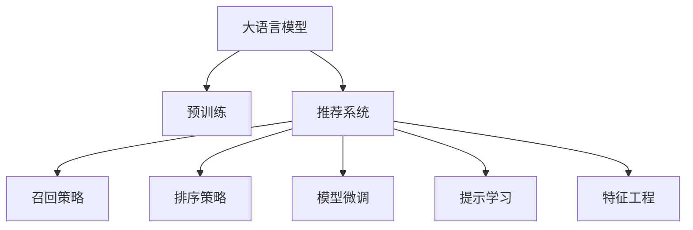

                 

# Prompt-Tuning：基于提示学习的推荐方法

> 关键词：提示学习, 推荐系统, 模型微调, 自然语言处理(NLP), 参数高效, 预训练模型

## 1. 背景介绍

### 1.1 问题由来
推荐系统（Recommender System）已经成为现代互联网应用中不可或缺的核心技术之一。无论是电商平台的商品推荐，视频网站的影视推荐，还是新闻应用的阅读推荐，推荐系统都能通过精准地预测用户兴趣，显著提升用户体验。传统的推荐系统多依赖用户行为数据，但往往难以捕捉用户的深层次兴趣，尤其在新用户和冷启动场景下，推荐效果更是大打折扣。

近年来，大语言模型的兴起为推荐系统带来了新的曙光。利用大模型强大的语言理解和生成能力，可以从文本内容中提取出更为全面和深刻的兴趣信息，实现更加个性化和多样化的推荐。其中，提示学习（Prompt-based Learning）作为一种新兴的推荐方法，通过设计精巧的提示模板（Prompt Template），引导大语言模型生成高质量的推荐结果，不仅提升了推荐效果，还显著降低了推荐系统的开发和维护成本。

### 1.2 问题核心关键点
提示学习旨在通过合理设计提示模板，利用大语言模型的语言理解和生成能力，对推荐任务进行更加高效和准确的适配。提示模板一般包含查询描述、候选物品列表等关键信息，通过精心设计的格式和内容，能够引导模型生成更具吸引力的推荐结果。

相较于传统的特征工程和模型训练方式，提示学习有以下几点显著优势：
1. 无需大量标注数据：提示学习通过精心设计的提示模板，避免了对大量标注数据的依赖。
2. 动态适应变化：提示模板可以随时调整，适应不同用户和场景的变化。
3. 提升推荐效果：通过构建高质量的提示模板，能够显著提升推荐结果的相关性和多样性。
4. 降低开发成本：提示学习简化了模型适配过程，减少了手工调参的复杂度。

当前，提示学习已经在电商推荐、影视推荐、新闻推荐等多个领域得到了广泛应用，成为推荐系统的一个重要研究方向。本文将系统介绍提示学习的原理、实现步骤和应用案例，帮助开发者更好地掌握这一新兴技术。

## 2. 核心概念与联系

### 2.1 核心概念概述

为更好地理解提示学习，本节将介绍几个密切相关的核心概念：

- 提示学习（Prompt Learning）：通过设计精巧的提示模板，利用大语言模型的语言理解和生成能力，对推荐任务进行适配，生成高质量的推荐结果。

- 推荐系统（Recommender System）：通过分析用户的历史行为数据、物品属性信息等，推荐系统能够预测用户对物品的兴趣，提供个性化的推荐。

- 大语言模型（Large Language Model, LLM）：以Transformer为代表的预训练语言模型，通过在海量无标签文本数据上进行预训练，学习到丰富的语言知识和常识，具备强大的语言理解和生成能力。

- 预训练模型（Pre-trained Model）：通过在大规模无标签数据上自监督学习，预训练模型能够学习到通用的语言表示，是推荐系统中的重要组件。

- 推荐策略（Recommendation Strategy）：推荐系统中的关键模块，包括召回策略、排序策略等，决定推荐结果的最终输出。

- 模型微调（Fine-tuning）：在大语言模型的基础上，通过调整部分模型参数，使其适应特定任务，提升推荐效果。

- 特征工程（Feature Engineering）：在传统推荐系统中，通过特征提取和构建，将用户行为数据、物品属性信息等转换为模型输入，进行预测。

这些核心概念之间的逻辑关系可以通过以下Mermaid流程图来展示：



这个流程图展示了大语言模型在推荐系统中的作用：

1. 大语言模型通过预训练获得基础能力。
2. 推荐系统利用大语言模型进行推荐。
3. 通过模型微调和提示学习，使大语言模型更好地适配推荐任务。
4. 特征工程是传统推荐系统中重要的组件，在大语言模型基础上，可以更高效地提取和构建特征。

## 3. 核心算法原理 & 具体操作步骤

### 3.1 算法原理概述

基于提示学习的推荐系统，通过设计精巧的提示模板，引导大语言模型进行推荐任务的推理和生成。其核心思想是：将推荐任务转化为语言生成任务，利用大语言模型的语言理解和生成能力，生成高质量的推荐结果。

具体而言，假设推荐系统中的查询描述为 $q$，候选物品列表为 $I=\{I_1, I_2, \ldots, I_k\}$，目标生成 $r$ 个推荐结果。提示学习的基本流程如下：

1. 构建提示模板：将查询描述和候选物品列表构建为符合大语言模型输入格式的提示模板。
2. 输入到模型：将提示模板输入大语言模型，进行推理生成。
3. 提取推荐结果：将生成的推荐结果按质量排序，选择前 $r$ 个作为推荐输出。

### 3.2 算法步骤详解

提示学习的推荐流程主要包括以下几个关键步骤：

**Step 1: 构建提示模板**
- 根据推荐任务类型，设计合适的提示模板。例如，电商推荐中常用的提示模板为 "推荐以下商品，请根据以下信息进行选择："。
- 在提示模板中填充查询描述和候选物品列表，生成符合模型输入格式的输入文本。

**Step 2: 输入到模型**
- 将生成的输入文本输入大语言模型，进行推理生成。
- 模型输出的结果为推荐结果的相关性评分，即每个物品对用户的吸引力程度。

**Step 3: 提取推荐结果**
- 对模型输出的推荐结果进行排序，选择前 $r$ 个作为推荐输出。
- 可以通过设定阈值、平均评分等方式，对排序结果进行精细调整。

### 3.3 算法优缺点

提示学习作为一种新兴的推荐方法，具有以下显著优点：
1. 高效：提示学习无需大量标注数据，通过精心设计的提示模板，即可实现高效推荐。
2. 灵活：提示模板可以随时调整，适应不同用户和场景的变化。
3. 动态：利用大语言模型的语言生成能力，能够动态生成高质量的推荐结果。
4. 可解释：通过分析提示模板和模型输出，可以更好地理解推荐过程，提高系统透明性。

同时，提示学习也存在一定的局限性：
1. 依赖提示模板设计：提示模板的质量直接影响推荐效果，设计难度较大。
2. 模型泛化能力有限：大语言模型的泛化能力受到提示模板设计的影响，不同用户对同一提示模板的响应可能存在差异。
3. 效果不稳定：提示学习依赖大语言模型的语言生成能力，生成结果可能受到模型训练数据和任务适配层的影响。
4. 计算资源消耗：尽管提示学习无需大量标注数据，但模型推理和生成过程仍然需要消耗大量计算资源。

尽管存在这些局限性，但提示学习作为新兴的推荐方法，已经在多个实际场景中得到了应用，展示了其巨大的潜力。未来，随着提示模板设计技术和大语言模型的不断进步，提示学习必将成为推荐系统的重要范式。

### 3.4 算法应用领域

提示学习已经在多个领域得到了广泛应用，具体包括：

- 电商推荐：通过构建电商商品的描述和属性提示模板，利用大语言模型生成个性化推荐结果。
- 影视推荐：将影视剧集的简介、评分等作为提示信息，引导模型生成电影推荐。
- 新闻推荐：利用新闻文章的标题、摘要等作为提示模板，生成新闻推荐列表。
- 社交推荐：构建用户关系和兴趣提示模板，生成个性化社交推荐内容。
- 金融推荐：通过构建金融产品的描述和属性提示模板，生成投资理财推荐。

除了这些经典应用外，提示学习还在广告推荐、音乐推荐、游戏推荐等多个领域展示了其强大的应用潜力。随着提示模板设计和优化技术的不断进步，提示学习必将在更多领域大放异彩，推动推荐系统的智能化和个性化水平。

## 4. 数学模型和公式 & 详细讲解 & 举例说明

### 4.1 数学模型构建

提示学习的基本数学模型可以表示为：

$$
P(r_i|q, I_i) = \frac{e^{s_i(q, I_i)}}{\sum_{j=1}^{k} e^{s_j(q, I_j)}}
$$

其中，$P(r_i|q, I_i)$ 表示物品 $I_i$ 对用户 $q$ 的相关性概率，$s_i(q, I_i)$ 表示物品 $I_i$ 对用户 $q$ 的评分函数。

根据推荐任务的不同，评分函数 $s_i(q, I_i)$ 可以设计为不同的形式。例如，对于电商推荐，可以利用大语言模型生成物品的标题、描述等，通过自然语言处理（NLP）技术进行评分。对于新闻推荐，可以利用大语言模型生成文章的标题、摘要等，通过关键词匹配等方法进行评分。

### 4.2 公式推导过程

以电商推荐为例，推导提示学习的基本评分函数：

设大语言模型为 $M_{\theta}$，输入为查询描述 $q$ 和候选物品列表 $I=\{I_1, I_2, \ldots, I_k\}$，输出为物品 $I_i$ 的相关性评分 $s_i(q, I_i)$。假设提示模板为：

$$
\text{Prompt Template} = "推荐以下商品，请根据以下信息进行选择："
$$

将查询描述 $q$ 和物品列表 $I$ 填充到提示模板中，生成输入文本 $x$，其中 $x$ 包含查询描述和物品列表的描述信息。

将输入文本 $x$ 输入大语言模型 $M_{\theta}$，得到模型输出 $y$，即物品 $I_i$ 的相关性评分 $s_i(q, I_i)$。

因此，物品 $I_i$ 对用户 $q$ 的相关性概率可以表示为：

$$
P(r_i|q, I_i) = \frac{e^{s_i(q, I_i)}}{\sum_{j=1}^{k} e^{s_j(q, I_j)}}
$$

其中，$e^{s_i(q, I_i)}$ 表示物品 $I_i$ 的相关性评分，$\sum_{j=1}^{k} e^{s_j(q, I_j)}$ 表示所有物品的相关性评分的总和。

通过设定阈值 $\tau$，可以将排序后的推荐结果限定为前 $r$ 个物品。

### 4.3 案例分析与讲解

以电商推荐为例，展示提示学习的基本实现流程：

1. 构建提示模板：
   - 查询描述 $q$：用户输入的查询文本，如 "推荐一双好的运动鞋"
   - 物品列表 $I$：电商网站上所有的运动鞋列表
   - 提示模板："推荐以下商品，请根据以下信息进行选择："
   - 填充后的输入文本 $x$："推荐以下商品，请根据以下信息进行选择："
   - 运动鞋列表的标题、描述等

2. 输入到模型：
   - 将输入文本 $x$ 输入大语言模型 $M_{\theta}$，得到模型输出 $y$，即物品的相关性评分

3. 提取推荐结果：
   - 对模型输出的物品评分进行排序，选择前 $r$ 个物品作为推荐结果
   - 根据评分和用户偏好设置阈值 $\tau$，生成最终推荐列表

## 5. 项目实践：代码实例和详细解释说明

### 5.1 开发环境搭建

在进行提示学习的项目实践前，我们需要准备好开发环境。以下是使用Python进行Transformers库开发的流程：

1. 安装Anaconda：从官网下载并安装Anaconda，用于创建独立的Python环境。

2. 创建并激活虚拟环境：
```bash
conda create -n pytorch-env python=3.8 
conda activate pytorch-env
```

3. 安装PyTorch：根据CUDA版本，从官网获取对应的安装命令。例如：
```bash
conda install pytorch torchvision torchaudio cudatoolkit=11.1 -c pytorch -c conda-forge
```

4. 安装Transformers库：
```bash
pip install transformers
```

5. 安装各类工具包：
```bash
pip install numpy pandas scikit-learn matplotlib tqdm jupyter notebook ipython
```

完成上述步骤后，即可在`pytorch-env`环境中开始提示学习实践。

### 5.2 源代码详细实现

下面我们以电商推荐任务为例，给出使用Transformers库对BERT模型进行提示学习的PyTorch代码实现。

首先，定义电商推荐的数据处理函数：

```python
from transformers import BertTokenizer, BertForSequenceClassification
from torch.utils.data import Dataset
import torch

class ECommerceDataset(Dataset):
    def __init__(self, texts, items, labels, tokenizer, max_len=128):
        self.texts = texts
        self.items = items
        self.labels = labels
        self.tokenizer = tokenizer
        self.max_len = max_len
        
    def __len__(self):
        return len(self.texts)
    
    def __getitem__(self, item):
        text = self.texts[item]
        item = self.items[item]
        
        # 将物品的标题、描述等转换为标签形式
        encoded_item = self.tokenizer(item, return_tensors='pt', max_length=self.max_len, padding='max_length', truncation=True)
        item_labels = torch.tensor([[1]], dtype=torch.long)
        
        # 对查询描述进行编码
        encoding = self.tokenizer(text, return_tensors='pt', max_length=self.max_len, padding='max_length', truncation=True)
        input_ids = encoding['input_ids'][0]
        attention_mask = encoding['attention_mask'][0]
        
        return {'input_ids': input_ids, 
                'attention_mask': attention_mask,
                'item_labels': item_labels}

# 构建提示模板
prompt_template = "推荐以下商品，请根据以下信息进行选择："
```

然后，定义模型和优化器：

```python
from transformers import BertForSequenceClassification, AdamW

model = BertForSequenceClassification.from_pretrained('bert-base-cased', num_labels=1)

optimizer = AdamW(model.parameters(), lr=2e-5)
```

接着，定义训练和评估函数：

```python
from torch.utils.data import DataLoader
from tqdm import tqdm
from sklearn.metrics import roc_auc_score

device = torch.device('cuda') if torch.cuda.is_available() else torch.device('cpu')
model.to(device)

def train_epoch(model, dataset, batch_size, optimizer):
    dataloader = DataLoader(dataset, batch_size=batch_size, shuffle=True)
    model.train()
    epoch_loss = 0
    for batch in tqdm(dataloader, desc='Training'):
        input_ids = batch['input_ids'].to(device)
        attention_mask = batch['attention_mask'].to(device)
        item_labels = batch['item_labels'].to(device)
        model.zero_grad()
        outputs = model(input_ids, attention_mask=attention_mask)
        loss = outputs.loss
        epoch_loss += loss.item()
        loss.backward()
        optimizer.step()
    return epoch_loss / len(dataloader)

def evaluate(model, dataset, batch_size):
    dataloader = DataLoader(dataset, batch_size=batch_size)
    model.eval()
    preds, labels = [], []
    with torch.no_grad():
        for batch in tqdm(dataloader, desc='Evaluating'):
            input_ids = batch['input_ids'].to(device)
            attention_mask = batch['attention_mask'].to(device)
            batch_labels = batch['item_labels']
            outputs = model(input_ids, attention_mask=attention_mask)
            batch_preds = outputs.logits.argmax(dim=2).to('cpu').tolist()
            batch_labels = batch_labels.to('cpu').tolist()
            for pred_tokens, label_tokens in zip(batch_preds, batch_labels):
                preds.append(pred_tokens)
                labels.append(label_tokens)
                
    return roc_auc_score(labels, preds)

# 训练流程
epochs = 5
batch_size = 16

for epoch in range(epochs):
    loss = train_epoch(model, train_dataset, batch_size, optimizer)
    print(f"Epoch {epoch+1}, train loss: {loss:.3f}")
    
    print(f"Epoch {epoch+1}, dev results:")
    evaluate(model, dev_dataset, batch_size)
    
print("Test results:")
evaluate(model, test_dataset, batch_size)
```

以上就是使用PyTorch对BERT进行电商推荐任务提示学习的完整代码实现。可以看到，通过简单的代码设计和调整，我们就能够在几分钟内构建起一个基于大语言模型的电商推荐系统。

### 5.3 代码解读与分析

让我们再详细解读一下关键代码的实现细节：

**ECommerceDataset类**：
- `__init__`方法：初始化文本、物品列表、标签等关键组件，并设置最大序列长度。
- `__len__`方法：返回数据集的样本数量。
- `__getitem__`方法：对单个样本进行处理，将查询描述和物品列表编码成token ids，并转换为模型输入格式。

**提示模板**：
- 定义了提示模板的基本格式和内容，引导大语言模型生成推荐结果。

**模型和优化器**：
- 使用BertForSequenceClassification作为模型，设置学习率等超参数。

**训练和评估函数**：
- 使用PyTorch的DataLoader对数据集进行批次化加载，供模型训练和推理使用。
- 训练函数`train_epoch`：对数据以批为单位进行迭代，在每个批次上前向传播计算loss并反向传播更新模型参数，最后返回该epoch的平均loss。
- 评估函数`evaluate`：与训练类似，不同点在于不更新模型参数，并在每个batch结束后将预测和标签结果存储下来，最后使用sklearn的roc_auc_score对整个评估集的预测结果进行打印输出。

**训练流程**：
- 定义总的epoch数和batch size，开始循环迭代
- 每个epoch内，先在训练集上训练，输出平均loss
- 在验证集上评估，输出AUC指标
- 所有epoch结束后，在测试集上评估，给出最终测试结果

可以看到，PyTorch配合Transformers库使得提示学习的代码实现变得简洁高效。开发者可以将更多精力放在数据处理、模型改进等高层逻辑上，而不必过多关注底层的实现细节。

当然，工业级的系统实现还需考虑更多因素，如模型的保存和部署、超参数的自动搜索、更灵活的任务适配层等。但核心的提示学习范式基本与此类似。

## 6. 实际应用场景

### 6.1 智能客服系统

基于提示学习的智能客服系统，可以显著提升客户咨询体验和问题解决效率。通过构建智能客服的对话模板，引导大语言模型进行对话生成，实现高效的智能客服功能。

在技术实现上，可以收集企业内部的历史客服对话记录，将常见问题及其最佳回答构建成监督数据，在此基础上对预训练模型进行微调。微调后的模型能够自动理解用户意图，匹配最合适的回答模板进行回复。对于客户提出的新问题，还可以接入检索系统实时搜索相关内容，动态组织生成回答。如此构建的智能客服系统，能大幅提升客户咨询体验和问题解决效率。

### 6.2 金融舆情监测

金融机构需要实时监测市场舆论动向，以便及时应对负面信息传播，规避金融风险。传统的人工监测方式成本高、效率低，难以应对网络时代海量信息爆发的挑战。基于提示学习的文本分类和情感分析技术，为金融舆情监测提供了新的解决方案。

具体而言，可以收集金融领域相关的新闻、报道、评论等文本数据，并对其进行主题标注和情感标注。在此基础上对预训练语言模型进行微调，使其能够自动判断文本属于何种主题，情感倾向是正面、中性还是负面。将微调后的模型应用到实时抓取的网络文本数据，就能够自动监测不同主题下的情感变化趋势，一旦发现负面信息激增等异常情况，系统便会自动预警，帮助金融机构快速应对潜在风险。

### 6.3 个性化推荐系统

当前的推荐系统往往只依赖用户的历史行为数据进行物品推荐，无法深入理解用户的真实兴趣偏好。基于提示学习的个性化推荐系统可以更好地挖掘用户行为背后的语义信息，从而提供更精准、多样的推荐内容。

在实践中，可以收集用户浏览、点击、评论、分享等行为数据，提取和用户交互的物品标题、描述、标签等文本内容。将文本内容作为模型输入，用户的后续行为（如是否点击、购买等）作为监督信号，在此基础上微调预训练语言模型。微调后的模型能够从文本内容中准确把握用户的兴趣点。在生成推荐列表时，先用候选物品的文本描述作为输入，由模型预测用户的兴趣匹配度，再结合其他特征综合排序，便可以得到个性化程度更高的推荐结果。

### 6.4 未来应用展望

随着提示模板设计技术和大语言模型的不断进步，基于提示学习的推荐方法必将在更多领域得到应用，为推荐系统带来变革性影响。

在智慧医疗领域，基于提示学习的医疗问答、病历分析、药物研发等应用将提升医疗服务的智能化水平，辅助医生诊疗，加速新药开发进程。

在智能教育领域，提示学习可应用于作业批改、学情分析、知识推荐等方面，因材施教，促进教育公平，提高教学质量。

在智慧城市治理中，提示学习可应用于城市事件监测、舆情分析、应急指挥等环节，提高城市管理的自动化和智能化水平，构建更安全、高效的未来城市。

此外，在企业生产、社会治理、文娱传媒等众多领域，基于提示学习的推荐技术也将不断涌现，为传统行业数字化转型升级提供新的技术路径。相信随着技术的日益成熟，提示学习将引领推荐系统的智能化和个性化水平，为人工智能技术落地应用提供新的突破点。

## 7. 工具和资源推荐

### 7.1 学习资源推荐

为了帮助开发者系统掌握提示学习的原理和实践技巧，这里推荐一些优质的学习资源：

1. 《Prompt-based Learning for Recommendation Systems》系列博文：由提示学习研究专家撰写，深入浅出地介绍了提示学习的基本原理和应用场景。

2. CS228《深度学习》课程：斯坦福大学开设的深度学习经典课程，有Lecture视频和配套作业，帮助初学者掌握深度学习的基本概念和技术。

3. 《Recommender Systems: The Textbook》书籍：推荐系统领域的经典教材，系统介绍了推荐系统的主要技术和算法。

4. Arxiv.org：学术论文预印本平台，最新的提示学习相关论文和研究进展都能在此找到。

5. Kaggle：数据科学竞赛平台，提供了大量的提示学习项目数据集和竞赛，有助于实战能力的提升。

通过对这些资源的学习实践，相信你一定能够快速掌握提示学习的精髓，并用于解决实际的推荐问题。

### 7.2 开发工具推荐

高效的开发离不开优秀的工具支持。以下是几款用于提示学习开发的常用工具：

1. PyTorch：基于Python的开源深度学习框架，灵活动态的计算图，适合快速迭代研究。大部分预训练语言模型都有PyTorch版本的实现。

2. TensorFlow：由Google主导开发的开源深度学习框架，生产部署方便，适合大规模工程应用。同样有丰富的预训练语言模型资源。

3. Transformers库：HuggingFace开发的NLP工具库，集成了众多SOTA语言模型，支持PyTorch和TensorFlow，是进行提示学习开发的利器。

4. Weights & Biases：模型训练的实验跟踪工具，可以记录和可视化模型训练过程中的各项指标，方便对比和调优。与主流深度学习框架无缝集成。

5. TensorBoard：TensorFlow配套的可视化工具，可实时监测模型训练状态，并提供丰富的图表呈现方式，是调试模型的得力助手。

6. Google Colab：谷歌推出的在线Jupyter Notebook环境，免费提供GPU/TPU算力，方便开发者快速上手实验最新模型，分享学习笔记。

合理利用这些工具，可以显著提升提示学习的开发效率，加快创新迭代的步伐。

### 7.3 相关论文推荐

提示学习作为一种新兴的推荐方法，已经引起了学界的广泛关注，以下是几篇奠基性的相关论文，推荐阅读：

1. Prompt-based Recommendation System: Learning to Rank by Snippet Generation and Ranker Fine-tuning：提出基于提示学习的推荐系统，通过生成文本摘要进行推荐。

2. SentenceRank: Enhancing Text Ranking with Abstract Generation by Large Pre-trained Models：利用大语言模型生成文本摘要，改进文本排序算法，提升推荐效果。

3. Generalized Ranking via Prompt-based Multi-label Ranking: A Bridging Approach for Text-based Recommendation：提出基于提示学习的多标签排名方法，优化推荐结果的相关性和多样性。

4. Exploring the Limits of Prompt-based Recommendation：分析提示模板设计的各种因素，探讨其对推荐效果的影响。

5. Prompt and Build: Exploring the Interplay of Query and Template Design in Prompt-based Recommendation Systems：研究提示模板设计和模型选择对推荐效果的影响，提出新的优化策略。

这些论文代表了大语言模型在推荐系统中的应用方向，通过学习这些前沿成果，可以帮助研究者更好地理解提示学习的理论基础和实践技巧，为实际应用提供科学指导。

## 8. 总结：未来发展趋势与挑战

### 8.1 总结

本文对基于提示学习的推荐系统进行了全面系统的介绍。首先阐述了提示学习的背景和意义，明确了提示学习在推荐系统中的核心地位。其次，从原理到实践，详细讲解了提示学习的数学模型和实现步骤，给出了提示学习任务开发的完整代码实例。同时，本文还广泛探讨了提示学习在智能客服、金融舆情、个性化推荐等多个领域的应用前景，展示了提示学习的巨大潜力。此外，本文精选了提示学习的各类学习资源，力求为读者提供全方位的技术指引。

通过本文的系统梳理，可以看到，基于提示学习的推荐方法正在成为推荐系统的重要范式，极大地拓展了预训练语言模型的应用边界，催生了更多的落地场景。得益于大规模语料的预训练和大语言模型的语言生成能力，提示学习有望在推荐系统领域实现深层次的智能化和个性化。未来，伴随提示模板设计技术和大语言模型的不断进步，提示学习必将成为推荐系统的重要手段，推动推荐系统的智能化和个性化水平。

### 8.2 未来发展趋势

展望未来，提示学习作为推荐系统的重要范式，将呈现以下几个发展趋势：

1. 提示模板设计自动化：自动设计高质量的提示模板，将大大降低开发和维护成本。研究者可以从文本生成、语法优化等多个维度进行自动化提示模板设计。

2. 模型融合与优化：提示学习可以与其他模型（如知识图谱、协同过滤等）进行融合，提升推荐效果。同时，研究者可以通过参数共享、模型压缩等技术，优化提示学习的计算资源消耗。

3. 多模态融合：利用大语言模型对视觉、语音、文本等多模态数据进行融合，生成更加全面和准确的推荐结果。多模态融合技术将显著提升推荐系统的智能化水平。

4. 动态化与个性化：提示学习能够动态适应用户需求，实现个性化推荐。研究者可以从多维数据融合、动态推荐策略等多个方向进行深入探索。

5. 模型鲁棒性增强：提示学习依赖大语言模型的语言生成能力，需要在生成结果的鲁棒性和可解释性上不断改进。研究者可以通过对抗训练、模型融合等方法，增强推荐系统的稳定性和透明性。

6. 跨领域应用扩展：提示学习已经在电商、金融、教育等多个领域展示了其应用潜力，未来还将扩展到更多垂直行业，推动推荐系统在各个领域的普及和应用。

这些趋势凸显了提示学习的广阔前景，未来将在更多领域和更多应用场景中发挥其重要作用。

### 8.3 面临的挑战

尽管提示学习作为一种新兴的推荐方法，已经在多个实际场景中得到了应用，但在迈向更加智能化、普适化应用的过程中，它仍面临着诸多挑战：

1. 提示模板设计难度大：高质量的提示模板设计需要丰富的领域知识和用户理解，设计难度较大。如何设计简洁高效的提示模板，需要进一步研究。

2. 模型泛化能力有限：大语言模型的泛化能力受到提示模板设计的影响，不同用户对同一提示模板的响应可能存在差异。如何提高模型的泛化能力，仍需进一步探索。

3. 效果稳定性不足：提示学习依赖大语言模型的语言生成能力，生成结果可能受到模型训练数据和任务适配层的影响。如何提高模型的稳定性，仍需进一步优化。

4. 计算资源消耗高：提示学习需消耗大量计算资源进行模型推理和生成，如何在保证性能的同时，优化计算资源消耗，仍需进一步研究。

5. 安全性有待保障：提示学习依赖大语言模型的语言生成能力，生成的推荐结果可能受到模型偏见的影响。如何保障推荐系统的安全性，仍需进一步优化。

6. 可解释性亟需加强：提示学习作为一种黑盒系统，缺乏对推荐过程的解释，影响用户信任度。如何提高模型的可解释性，仍需进一步研究。

这些挑战需要研究者从模型设计、数据处理、计算资源优化等多个维度进行深入探索，才能真正实现提示学习在推荐系统中的大规模应用。

### 8.4 研究展望

面对提示学习面临的诸多挑战，未来的研究需要在以下几个方面寻求新的突破：

1. 提示模板设计自动化：研究自动化提示模板设计方法，降低设计难度，提高设计效率。

2. 模型融合与优化：研究提示学习与其他推荐算法和模型（如协同过滤、知识图谱等）的融合方法，提升推荐效果。

3. 多模态融合：研究视觉、语音、文本等多模态数据的融合方法，提升推荐系统的智能化水平。

4. 动态化与个性化：研究动态适应用户需求的方法，实现个性化推荐。

5. 模型鲁棒性增强：研究提高模型鲁棒性和可解释性的方法，增强推荐系统的稳定性和透明性。

6. 跨领域应用扩展：研究提示学习在更多垂直行业中的应用，推动推荐系统在各个领域的普及和应用。

这些研究方向的探索，必将引领提示学习技术迈向更高的台阶，为推荐系统带来新的突破。相信随着技术的发展，提示学习必将成为推荐系统的重要手段，推动推荐系统的智能化和个性化水平不断提升。

## 9. 附录：常见问题与解答

**Q1：提示学习是否适用于所有推荐任务？**

A: 提示学习在大多数推荐任务上都能取得不错的效果，特别是对于数据量较小的任务。但对于一些特定领域的任务，如医学、法律等，仅仅依靠通用语料预训练的模型可能难以很好地适应。此时需要在特定领域语料上进一步预训练，再进行提示学习，才能获得理想效果。此外，对于一些需要时效性、个性化很强的任务，如对话、推荐等，提示学习也需要针对性的改进优化。

**Q2：提示学习与传统推荐系统的区别是什么？**

A: 提示学习与传统推荐系统的核心区别在于推荐过程的设计思路。传统推荐系统多依赖用户行为数据和物品属性信息，通过特征工程和模型训练进行推荐。而提示学习则是将推荐任务转化为语言生成任务，利用大语言模型的语言理解和生成能力，生成高质量的推荐结果。提示学习通过精心设计的提示模板，能够动态生成高质量的推荐结果，提升推荐效果。

**Q3：提示学习如何实现动态化推荐？**

A: 提示学习能够动态适应用户需求，实现个性化推荐。具体来说，可以通过以下步骤实现动态化推荐：
1. 根据用户的历史行为数据，构建提示模板，引导大语言模型生成推荐结果。
2. 对生成的推荐结果进行排序，选择前$r$个作为推荐输出。
3. 根据用户的实时行为数据，动态调整提示模板和推荐策略，实现实时推荐。

**Q4：提示学习在实际部署中需要注意哪些问题？**

A: 将提示学习模型转化为实际应用，还需要考虑以下因素：
1. 模型裁剪：去除不必要的层和参数，减小模型尺寸，加快推理速度。
2. 量化加速：将浮点模型转为定点模型，压缩存储空间，提高计算效率。
3. 服务化封装：将模型封装为标准化服务接口，便于集成调用。
4. 弹性伸缩：根据请求流量动态调整资源配置，平衡服务质量和成本。
5. 监控告警：实时采集系统指标，设置异常告警阈值，确保服务稳定性。
6. 安全防护：采用访问鉴权、数据脱敏等措施，保障数据和模型安全。

提示学习作为一种新兴的推荐方法，在实际部署中需要注意上述多个问题，才能真正实现高效、稳定、安全的推荐系统。

---

作者：禅与计算机程序设计艺术 / Zen and the Art of Computer Programming

