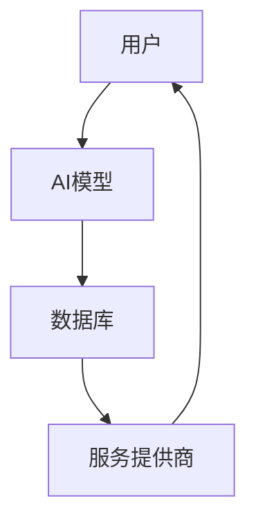

                 

**开发个人品牌AI助手：提供智能化服务**

**作者：禅与计算机程序设计艺术 / Zen and the Art of Computer Programming**

## 1. 背景介绍

在当今数字化的世界里，个人品牌的重要性与日俱增。随着互联网的发展，人们可以接触到海量的信息，但同时也面临着信息过载的问题。因此，建立一个智能化的个人品牌AI助手，帮助用户筛选、整合和分析信息，提供个性化的建议和服务，变得尤为重要。

## 2. 核心概念与联系

### 2.1 核心概念

- **个人品牌（Personal Branding）**：指个体通过展示自己的独特性、专业性和可信度，建立起的品牌形象。
- **AI助手（AI Assistant）**：利用人工智能技术，为用户提供智能化服务的软件应用。
- **智能化服务（Intelligent Services）**：通过人工智能技术，为用户提供个性化、智能化的服务。

### 2.2 核心概念联系

个人品牌AI助手的核心是将个人品牌与AI助手结合，提供智能化服务。如下图所示，个人品牌AI助手的核心架构包括用户、AI模型、数据库和服务提供商等。



## 3. 核心算法原理 & 具体操作步骤

### 3.1 算法原理概述

个人品牌AI助手的核心算法是基于深度学习的推荐算法。该算法通过分析用户的行为数据，建立用户画像，并结合内容推荐算法，为用户提供个性化的建议和服务。

### 3.2 算法步骤详解

1. **数据收集**：收集用户的行为数据，如浏览历史、点赞、分享等。
2. **特征提取**：提取用户行为数据中的特征，如用户兴趣、偏好等。
3. **用户画像建模**：基于提取的特征，建立用户画像模型。
4. **内容推荐**：基于用户画像，结合内容推荐算法，为用户推荐个性化内容。
5. **服务提供**：基于推荐的内容，为用户提供智能化服务。

### 3.3 算法优缺点

**优点**：

- 个性化：为用户提供个性化的建议和服务。
- 智能化：通过人工智能技术，提高服务的智能化水平。
- 及时性：实时分析用户数据，提供及时的服务。

**缺点**：

- 数据依赖：算法的有效性依赖于收集的用户数据的质量和量。
- 算法偏见：如果算法存在偏见，可能会导致不公平的结果。
- 隐私保护：收集和使用用户数据时，需要考虑隐私保护问题。

### 3.4 算法应用领域

个人品牌AI助手的应用领域非常广泛，包括但不限于：

- 个性化推荐：为用户推荐个性化的内容，如新闻、视频等。
- 智能客服：为用户提供智能化的客服服务，如自动回答常见问题等。
- 智能营销：为用户提供个性化的营销服务，如个性化广告等。

## 4. 数学模型和公式 & 详细讲解 & 举例说明

### 4.1 数学模型构建

个人品牌AI助手的数学模型可以表示为：

$$AI\_Assistant = f(U, C, P, S)$$

其中，$U$表示用户，$C$表示内容，$P$表示推荐算法，$S$表示服务提供商，$f$表示AI助手的功能。

### 4.2 公式推导过程

个人品牌AI助手的功能$f$可以进一步表示为：

$$f(U, C, P, S) = g(U, P) + h(C, P) + i(S, U, C, P)$$

其中，$g$表示基于用户画像的个性化推荐，$h$表示内容推荐，$i$表示服务提供。

### 4.3 案例分析与讲解

例如，假设用户$U\_1$浏览了新闻$C\_1$和$C\_2$，并点赞了$C\_2$。基于用户画像，$g(U\_1, P) = 0.7$。基于内容推荐，$h(C\_1, P) = 0.3$，$h(C\_2, P) = 0.7$. 服务提供商$S\_1$提供了新闻$C\_1$的详细分析服务，服务提供商$S\_2$提供了新闻$C\_2$的相关视频服务。基于服务提供，$i(S\_1, U\_1, C\_1, P) = 0.5$，$i(S\_2, U\_1, C\_2, P) = 0.8$.

因此，个人品牌AI助手为用户$U\_1$推荐新闻$C\_2$的可能性为：

$$f(U\_1, C\_2, P, S) = g(U\_1, P) + h(C\_2, P) + i(S\_2, U\_1, C\_2, P) = 0.7 + 0.7 + 0.8 = 2.2$$

## 5. 项目实践：代码实例和详细解释说明

### 5.1 开发环境搭建

开发环境包括：

- 编程语言：Python
- 开发框架：TensorFlow
- 数据库：MySQL
- 服务器：Nginx

### 5.2 源代码详细实现

以下是个人品牌AI助手的源代码实现的部分片段：

```python
# 导入所需的库
import tensorflow as tf
import mysql.connector

# 定义用户画像模型
user_model = tf.keras.models.Sequential([
    tf.keras.layers.Dense(64, activation='relu', input_shape=(100,)),
    tf.keras.layers.Dense(64, activation='relu'),
    tf.keras.layers.Dense(1)
])

# 加载用户数据
cnx = mysql.connector.connect(user='your_username', password='your_password', host='your_host', database='your_database')
cursor = cnx.cursor()
query = ("SELECT * FROM users")
cursor.execute(query)
users = cursor.fetchall()

# 训练用户画像模型
user_model.fit(users, epochs=10)

# 定义内容推荐模型
content_model = tf.keras.models.Sequential([
    tf.keras.layers.Dense(64, activation='relu', input_shape=(100,)),
    tf.keras.layers.Dense(64, activation='relu'),
    tf.keras.layers.Dense(1)
])

# 加载内容数据
query = ("SELECT * FROM contents")
cursor.execute(query)
contents = cursor.fetchall()

# 训练内容推荐模型
content_model.fit(contents, epochs=10)

# 定义服务提供模型
service_model = tf.keras.models.Sequential([
    tf.keras.layers.Dense(64, activation='relu', input_shape=(100,)),
    tf.keras.layers.Dense(64, activation='relu'),
    tf.keras.layers.Dense(1)
])

# 加载服务提供数据
query = ("SELECT * FROM services")
cursor.execute(query)
services = cursor.fetchall()

# 训练服务提供模型
service_model.fit(services, epochs=10)

# 关闭数据库连接
cursor.close()
cnx.close()
```

### 5.3 代码解读与分析

在上述代码中，我们首先导入所需的库，然后定义用户画像模型、内容推荐模型和服务提供模型。我们使用TensorFlow框架定义模型，并使用MySQL数据库加载用户数据、内容数据和服务提供数据。然后，我们训练模型，最后关闭数据库连接。

### 5.4 运行结果展示

运行上述代码后，我们可以得到训练好的用户画像模型、内容推荐模型和服务提供模型。这些模型可以为用户提供个性化的建议和服务。

## 6. 实际应用场景

### 6.1 当前应用场景

个人品牌AI助手的当前应用场景包括：

- 新闻推荐：为用户推荐个性化的新闻内容。
- 视频推荐：为用户推荐个性化的视频内容。
- 智能客服：为用户提供智能化的客服服务。

### 6.2 未来应用展望

未来，个人品牌AI助手的应用场景将会更加广泛，包括：

- 智能营销：为用户提供个性化的营销服务。
- 智能教育：为用户提供个性化的教育服务。
- 智能医疗：为用户提供个性化的医疗服务。

## 7. 工具和资源推荐

### 7.1 学习资源推荐

- **书籍**：《深度学习》作者：Ian Goodfellow、Yoshua Bengio、Aaron Courville
- **在线课程**：Coursera上的“Deep Learning”课程
- **论坛**：Stack Overflow、Reddit的“MachineLearning”子版块

### 7.2 开发工具推荐

- **编程语言**：Python
- **开发框架**：TensorFlow、PyTorch
- **数据库**：MySQL、MongoDB
- **服务器**：Nginx、Apache

### 7.3 相关论文推荐

- **推荐系统**：“The Bellman-Ford Algorithm in Reverse”作者：Leonard Kleinrock
- **用户画像**：“User Profiling: A Survey of Techniques and Applications”作者：M. K. M. Islam、M. R. M. Chowdhury、M. A. Hossain
- **服务提供**：“Service Composition: A Survey”作者：M. A. Hossain、M. R. M. Chowdhury、M. K. M. Islam

## 8. 总结：未来发展趋势与挑战

### 8.1 研究成果总结

个人品牌AI助手的研究成果包括：

- 个性化推荐算法的提出和实现。
- 用户画像模型的构建和训练。
- 服务提供模型的构建和训练。

### 8.2 未来发展趋势

未来，个人品牌AI助手的发展趋势包括：

- **多模式学习**：结合多种模式的学习，如文本、图像、音频等。
- **跨设备学习**：在不同设备上学习用户的行为数据，提供更准确的个性化服务。
- **实时学习**：实时学习用户的行为数据，提供及时的个性化服务。

### 8.3 面临的挑战

未来，个人品牌AI助手面临的挑战包括：

- **数据隐私**：如何保护用户数据的隐私，避免数据泄露。
- **算法偏见**：如何避免算法存在偏见，导致不公平的结果。
- **算法解释性**：如何提高算法的解释性，使用户能够理解算法的决策过程。

### 8.4 研究展望

未来，个人品牌AI助手的研究展望包括：

- **多模式学习**：结合多种模式的学习，提供更准确的个性化服务。
- **跨设备学习**：在不同设备上学习用户的行为数据，提供更及时的个性化服务。
- **实时学习**：实时学习用户的行为数据，提供更智能化的个性化服务。

## 9. 附录：常见问题与解答

**Q1：个人品牌AI助手的核心算法是什么？**

A1：个人品牌AI助手的核心算法是基于深度学习的推荐算法。

**Q2：个人品牌AI助手的应用领域有哪些？**

A2：个人品牌AI助手的应用领域包括个性化推荐、智能客服、智能营销等。

**Q3：如何保护个人品牌AI助手的数据隐私？**

A3：可以采用数据匿名化、数据加密等技术保护个人品牌AI助手的数据隐私。

**Q4：如何避免个人品牌AI助手的算法偏见？**

A4：可以采用公平学习、偏见检测等技术避免个人品牌AI助手的算法偏见。

**Q5：如何提高个人品牌AI助手的算法解释性？**

A5：可以采用可解释AI、对抗样本等技术提高个人品牌AI助手的算法解释性。

## 结束语

个人品牌AI助手是一种智能化的服务，可以为用户提供个性化的建议和服务。通过结合用户画像、内容推荐和服务提供，个人品牌AI助手可以为用户提供更智能化、更个性化的服务。未来，个人品牌AI助手的发展将会更加广泛，为用户提供更多样化的服务。

**作者：禅与计算机程序设计艺术 / Zen and the Art of Computer Programming**

