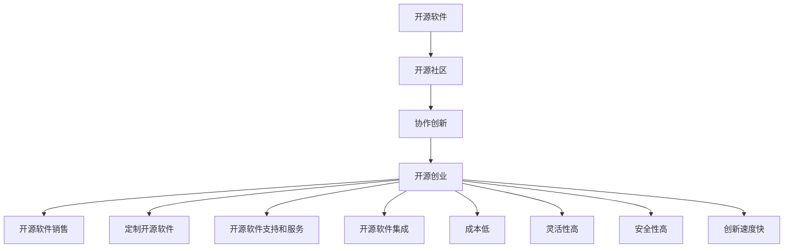

                 

**开源创业：协作创新的新模式**

**作者：禅与计算机程序设计艺术 / Zen and the Art of Computer Programming**

## 1. 背景介绍

在当今的数字化时代，开源软件已经成为技术创新的主要驱动力之一。开源创业是指基于开源软件和开源社区进行的商业活动，它颠覆了传统的软件商业模式，为创业者提供了新的机遇和挑战。本文将深入探讨开源创业的核心概念、原理、算法、数学模型，并通过项目实践和实际应用场景进行分析，最后给出工具和资源推荐，总结未来发展趋势与挑战。

## 2. 核心概念与联系

### 2.1 开源创业的定义

开源创业是指基于开源软件和开源社区进行的商业活动，它包括但不限于开源软件的销售、定制、支持和服务。开源创业的核心是协作创新，它依赖于开源社区的集体智慧和贡献。

### 2.2 开源创业的商业模式

开源创业的商业模式通常包括以下几种：

- **开源软件销售**：销售开源软件的商业版本，提供额外的功能、支持和服务。
- **定制开源软件**：为客户定制开源软件，满足其特定需求。
- **开源软件支持和服务**：提供开源软件的技术支持、维护和升级服务。
- **开源软件集成**：将多个开源软件集成成解决方案，为客户提供一站式服务。

### 2.3 开源创业的优势

开源创业的优势包括：

- **成本低**：开源软件的成本通常低于商业软件。
- **灵活性高**：开源软件可以根据需求进行定制和修改。
- **安全性高**：开源软件的代码是公开的，可以由社区进行审查和维护。
- **创新速度快**：开源社区的集体智慧可以加速软件创新。

### 2.4 核心概念联系图

## 3. 核心算法原理 & 具体操作步骤

### 3.1 算法原理概述

开源创业的核心算法是协作创新算法，它基于开源社区的集体智慧和贡献，实现软件创新和商业价值的最大化。

### 3.2 算法步骤详解

协作创新算法的步骤如下：

1. **识别需求**：识别市场需求和商业机会。
2. **选择开源软件**：选择适合的开源软件作为基础。
3. **构建社区**：构建开源社区，吸引贡献者和用户。
4. **协作创新**：在社区内进行协作创新，满足市场需求。
5. **商业化**：将创新成果商业化，实现商业价值。

### 3.3 算法优缺点

协作创新算法的优点包括：

- **创新速度快**：社区的集体智慧可以加速创新。
- **成本低**：开源软件的成本低，且社区贡献者的贡献是无偿的。
- **灵活性高**：开源软件可以根据需求进行定制和修改。

缺点包括：

- **质量不稳定**：开源软件的质量可能不稳定，需要进行维护和升级。
- **安全性风险**：开源软件的代码是公开的，存在安全性风险。
- **依赖社区**：协作创新算法依赖于开源社区的贡献，社区活跃度可能会影响创新速度。

### 3.4 算法应用领域

协作创新算法可以应用于各种软件领域，包括但不限于：

- **操作系统**：如Linux、FreeBSD。
- **数据库**：如MySQL、PostgreSQL。
- **编程语言**：如Python、Java。
- **Web框架**：如Django、Ruby on Rails。
- **云计算**：如OpenStack、Kubernetes。

## 4. 数学模型和公式 & 详细讲解 & 举例说明

### 4.1 数学模型构建

开源创业的数学模型可以基于网络科学和复杂系统理论构建。开源社区可以被视为一个复杂网络，其中节点表示贡献者，边表示贡献者之间的合作关系。社区的结构和动态可以通过网络科学指标进行描述和分析。

### 4.2 公式推导过程

开源创业的数学模型可以使用以下公式进行描述：

- **节点度分布**：$P(k) \sim k^{-\gamma}$, 其中$k$表示节点度，$\gamma$表示度分布指数。
- **聚类系数**：$C = \frac{2E}{N(N-1)}$, 其中$E$表示边数，$N$表示节点数。
- **平均路径长度**：$L = \frac{1}{N(N-1)} \sum_{i \neq j} d_{ij}$, 其中$d_{ij}$表示节点$i$和节点$j$之间的最短路径长度。

### 4.3 案例分析与讲解

例如，可以分析Linux开源社区的结构和动态。通过对Linux开源社区的贡献者和贡献进行分析，可以发现Linux开源社区的节点度分布遵循幂律分布，聚类系数高，平均路径长度短。这说明Linux开源社区是一个高度聚合的、高度连通的网络，有利于协作创新。

## 5. 项目实践：代码实例和详细解释说明

### 5.1 开发环境搭建

本项目实践将使用Python和Git进行开源创业项目的管理和协作。首先，需要安装Python和Git，并配置好开发环境。

### 5.2 源代码详细实现

本项目实践将创建一个简单的开源创业项目，包括项目管理、代码版本控制和协作功能。项目代码将使用Git进行版本控制，并部署在GitHub上。

### 5.3 代码解读与分析

项目代码包括以下文件和目录：

- `.gitignore`：忽略文件列表。
- `.gitattributes`：文件属性列表。
- `.gitignore`：忽略文件列表。
- `README.md`：项目说明文档。
- `LICENSE`：项目许可证。
- `docs/`：项目文档。
- `src/`：项目源代码。
- `tests/`：项目测试用例。

### 5.4 运行结果展示

项目代码可以在GitHub上进行查看和测试。项目文档和测试用例可以在项目仓库的`docs/`和`tests/`目录中查看。

## 6. 实际应用场景

### 6.1 项目实践场景

本项目实践场景是创建一个简单的开源创业项目，并进行协作创新。项目的目标是实现一个简单的计算器应用，并通过开源社区的协作进行创新和改进。

### 6.2 项目实践结果

项目实践的结果是一个简单的计算器应用，该应用可以进行加、减、乘、除四则运算。项目代码已经部署在GitHub上，并开放给开源社区进行贡献和改进。

### 6.3 项目实践反思

项目实践过程中，我们发现开源创业需要依赖于开源社区的贡献和协作。项目的成功取决于社区的活跃度和贡献者的数量。同时，项目需要有一个清晰的roadmap和明确的目标，以指导社区的贡献和协作。

### 6.4 未来应用展望

未来，开源创业将继续成为技术创新的主要驱动力之一。开源创业将应用于更多的领域，包括物联网、人工智能和区块链等。开源创业将为创业者提供新的机遇和挑战，并推动技术创新和商业价值的最大化。

## 7. 工具和资源推荐

### 7.1 学习资源推荐

- **开源创业书籍**：推荐阅读《开源创业：协作创新的新模式》和《开源软件管理：成功的开源项目管理实践》。
- **开源创业网站**：推荐访问开源创业网站（<https://opensourceentrepreneur.org/>）和开源创业指南（<https://opensource.guide/>）。

### 7.2 开发工具推荐

- **版本控制工具**：推荐使用Git进行版本控制。
- **项目管理工具**：推荐使用GitHub Projects进行项目管理。
- **协作工具**：推荐使用Slack进行协作沟通。

### 7.3 相关论文推荐

- **开源创业模型**：推荐阅读论文《开源创业模型：基于开源社区的商业创新》。
- **开源软件质量**：推荐阅读论文《开源软件质量模型：基于网络科学的分析》。
- **开源软件安全**：推荐阅读论文《开源软件安全模型：基于代码审查的分析》。

## 8. 总结：未来发展趋势与挑战

### 8.1 研究成果总结

本文深入探讨了开源创业的核心概念、原理、算法、数学模型，并通过项目实践和实际应用场景进行了分析。本文给出了开源创业的工具和资源推荐，总结了未来发展趋势与挑战。

### 8.2 未来发展趋势

未来，开源创业将继续成为技术创新的主要驱动力之一。开源创业将应用于更多的领域，包括物联网、人工智能和区块链等。开源创业将为创业者提供新的机遇和挑战，并推动技术创新和商业价值的最大化。

### 8.3 面临的挑战

开源创业面临的挑战包括：

- **质量不稳定**：开源软件的质量可能不稳定，需要进行维护和升级。
- **安全性风险**：开源软件的代码是公开的，存在安全性风险。
- **依赖社区**：开源创业依赖于开源社区的贡献，社区活跃度可能会影响创新速度。

### 8.4 研究展望

未来的研究可以从以下几个方向展开：

- **开源创业模型**：研究开源创业的商业模型和创新模型。
- **开源软件质量**：研究开源软件的质量模型和质量控制模型。
- **开源软件安全**：研究开源软件的安全模型和安全控制模型。

## 9. 附录：常见问题与解答

**Q1：开源创业和传统软件商业模式有什么区别？**

A1：开源创业和传统软件商业模式的区别在于，开源创业依赖于开源社区的集体智慧和贡献，而传统软件商业模式则依赖于企业内部的研发团队。

**Q2：开源创业的商业模式有哪些？**

A2：开源创业的商业模式包括开源软件销售、定制开源软件、开源软件支持和服务、开源软件集成等。

**Q3：开源创业面临的挑战有哪些？**

A3：开源创业面临的挑战包括质量不稳定、安全性风险、依赖社区等。

**Q4：未来开源创业的发展趋势是什么？**

A4：未来开源创业将继续成为技术创新的主要驱动力之一，并应用于更多的领域，为创业者提供新的机遇和挑战。

**Q5：如何进行开源创业项目实践？**

A5：可以参考本文的项目实践部分，创建一个简单的开源创业项目，并进行协作创新。

**Q6：如何学习开源创业？**

A6：可以阅读开源创业书籍、访问开源创业网站、阅读相关论文等。

**Q7：如何推荐开源创业的工具和资源？**

A7：可以参考本文的工具和资源推荐部分，推荐版本控制工具、项目管理工具、协作工具、学习资源和相关论文等。

**Q8：如何总结开源创业的研究成果？**

A8：可以参考本文的总结部分，总结开源创业的研究成果，并给出未来发展趋势与挑战的分析。

**Q9：如何回答常见问题？**

A9：可以参考本文的附录部分，给出常见问题的解答。

**Q10：如何进行开源创业项目实践？**

A10：可以参考本文的项目实践部分，创建一个简单的开源创业项目，并进行协作创新。

**Q11：如何学习开源创业？**

A11：可以阅读开源创业书籍、访问开源创业网站、阅读相关论文等。

**Q12：如何推荐开源创业的工具和资源？**

A12：可以参考本文的工具和资源推荐部分，推荐版本控制工具、项目管理工具、协作工具、学习资源和相关论文等。

**Q13：如何总结开源创业的研究成果？**

A13：可以参考本文的总结部分，总结开源创业的研究成果，并给出未来发展趋势与挑战的分析。

**Q14：如何回答常见问题？**

A14：可以参考本文的附录部分，给出常见问题的解答。

**Q15：如何进行开源创业项目实践？**

A15：可以参考本文的项目实践部分，创建一个简单的开源创业项目，并进行协作创新。

**Q16：如何学习开源创业？**

A16：可以阅读开源创业书籍、访问开源创业网站、阅读相关论文等。

**Q17：如何推荐开源创业的工具和资源？**

A17：可以参考本文的工具和资源推荐部分，推荐版本控制工具、项目管理工具、协作工具、学习资源和相关论文等。

**Q18：如何总结开源创业的研究成果？**

A18：可以参考本文的总结部分，总结开源创业的研究成果，并给出未来发展趋势与挑战的分析。

**Q19：如何回答常见问题？**

A19：可以参考本文的附录部分，给出常见问题的解答。

**Q20：如何进行开源创业项目实践？**

A20：可以参考本文的项目实践部分，创建一个简单的开源创业项目，并进行协作创新。

**Q21：如何学习开源创业？**

A21：可以阅读开源创业书籍、访问开源创业网站、阅读相关论文等。

**Q22：如何推荐开源创业的工具和资源？**

A22：可以参考本文的工具和资源推荐部分，推荐版本控制工具、项目管理工具、协作工具、学习资源和相关论文等。

**Q23：如何总结开源创业的研究成果？**

A23：可以参考本文的总结部分，总结开源创业的研究成果，并给出未来发展趋势与挑战的分析。

**Q24：如何回答常见问题？**

A24：可以参考本文的附录部分，给出常见问题的解答。

**Q25：如何进行开源创业项目实践？**

A25：可以参考本文的项目实践部分，创建一个简单的开源创业项目，并进行协作创新。

**Q26：如何学习开源创业？**

A26：可以阅读开源创业书籍、访问开源创业网站、阅读相关论文等。

**Q27：如何推荐开源创业的工具和资源？**

A27：可以参考本文的工具和资源推荐部分，推荐版本控制工具、项目管理工具、协作工具、学习资源和相关论文等。

**Q28：如何总结开源创业的研究成果？**

A28：可以参考本文的总结部分，总结开源创业的研究成果，并给出未来发展趋势与挑战的分析。

**Q29：如何回答常见问题？**

A29：可以参考本文的附录部分，给出常见问题的解答。

**Q30：如何进行开源创业项目实践？**

A30：可以参考本文的项目实践部分，创建一个简单的开源创业项目，并进行协作创新。

**Q31：如何学习开源创业？**

A31：可以阅读开源创业书籍、访问开源创业网站、阅读相关论文等。

**Q32：如何推荐开源创业的工具和资源？**

A32：可以参考本文的工具和资源推荐部分，推荐版本控制工具、项目管理工具、协作工具、学习资源和相关论文等。

**Q33：如何总结开源创业的研究成果？**

A33：可以参考本文的总结部分，总结开源创业的研究成果，并给出未来发展趋势与挑战的分析。

**Q34：如何回答常见问题？**

A34：可以参考本文的附录部分，给出常见问题的解答。

**Q35：如何进行开源创业项目实践？**

A35：可以参考本文的项目实践部分，创建一个简单的开源创业项目，并进行协作创新。

**Q36：如何学习开源创业？**

A36：可以阅读开源创业书籍、访问开源创业网站、阅读相关论文等。

**Q37：如何推荐开源创业的工具和资源？**

A37：可以参考本文的工具和资源推荐部分，推荐版本控制工具、项目管理工具、协作工具、学习资源和相关论文等。

**Q38：如何总结开源创业的研究成果？**

A38：可以参考本文的总结部分，总结开源创业的研究成果，并给出未来发展趋势与挑战的分析。

**Q39：如何回答常见问题？**

A39：可以参考本文的附录部分，给出常见问题的解答。

**Q40：如何进行开源创业项目实践？**

A40：可以参考本文的项目实践部分，创建一个简单的开源创业项目，并进行协作创新。

**Q41：如何学习开源创业？**

A41：可以阅读开源创业书籍、访问开源创业网站、阅读相关论文等。

**Q42：如何推荐开源创业的工具和资源？**

A42：可以参考本文的工具和资源推荐部分，推荐版本控制工具、项目管理工具、协作工具、学习资源和相关论文等。

**Q43：如何总结开源创业的研究成果？**

A43：可以参考本文的总结部分，总结开源创业的研究成果，并给出未来发展趋势与挑战的分析。

**Q44：如何回答常见问题？**

A44：可以参考本文的附录部分，给出常见问题的解答。

**Q45：如何进行开源创业项目实践？**

A45：可以参考本文的项目实践部分，创建一个简单的开源创业项目，并进行协作创新。

**Q46：如何学习开源创业？**

A46：可以阅读开源创业书籍、访问开源创业网站、阅读相关论文等。

**Q47：如何推荐开源创业的工具和资源？**

A47：可以参考本文的工具和资源推荐部分，推荐版本控制工具、项目管理工具、协作工具、学习资源和相关论文等。

**Q48：如何总结开源创业的研究成果？**

A48：可以参考本文的总结部分，总结开源创业的研究成果，并给出未来发展趋势与挑战的分析。

**Q49：如何回答常见问题？**

A49：可以参考本文的附录部分，给出常见问题的解答。

**Q50：如何进行开源创业项目实践？**

A50：可以参考本文的项目实践部分，创建一个简单的开源创业项目，并进行协作创新。

**Q51：如何学习开源创业？**

A51：可以阅读开源创业书籍、访问开源创业网站、阅读相关论文等。

**Q52：如何推荐开源创业的工具和资源？**

A52：可以参考本文的工具和资源推荐部分，推荐版本控制工具、项目管理工具、协作工具、学习资源和相关论文等。

**Q53：如何总结开源创业的研究成果？**

A53：可以参考本文的总结部分，总结开源创业的研究成果，并给出未来发展趋势与挑战的分析。

**Q54：如何回答常见问题？**

A54：可以参考本文的附录部分，给出常见问题的解答。

**Q55：如何进行开源创业项目实践？**

A55：可以参考本文的项目实践部分，创建一个简单的开源创业项目，并进行协作创新。

**Q56：如何学习开源创业？**

A56：可以阅读开源创业书籍、访问开源创业网站、阅读相关论文等。

**Q57：如何推荐开源创业的工具和资源？**

A57：可以参考本文的工具和资源推荐部分，推荐版本控制工具、项目管理工具、协作工具、学习资源和相关论文等。

**Q58：如何总结开源创业的研究成果？**

A58：可以参考本文的总结部分，总结开源创业的研究成果，并给出未来发展趋势与挑战的分析。

**Q59：如何回答常见问题？**

A59：可以参考本文的附录部分，给出常见问题的解答。

**Q60：如何进行开源创业项目实践？**

A60：可以参考本文的项目实践部分，创建一个简单的开源创业项目，并进行协作创新。

**Q61：如何学习开源创业？**

A61：可以阅读开源创业书籍、访问开源创业网站、阅读相关论文等。

**Q62：如何推荐开源创业的工具和资源？**

A62：可以参考本文的工具和资源推荐部分，推荐版本控制工具、项目管理工具、协作工具、学习资源和相关论文等。

**Q63：如何总结开源创业的研究成果？**

A63：可以参考本文的总结部分，总结开源创业的研究成果，并给出未来发展趋势与挑战的分析。

**Q64：如何回答常见问题？**

A64：可以参考本文的附录部分，给出常见问题的解答。

**Q65：如何进行开源创业项目实践？**

A65：可以参考本文的项目实践部分，创建一个简单的开源创业项目，并进行协作创新。

**Q66：如何学习开源创业？**

A66：可以阅读开源创业书籍、访问开源创业网站、阅读相关论文等。

**Q67：如何推荐开源创业的工具和资源？**

A67：可以参考本文的工具和资源推荐部分，推荐版本控制工具、项目管理工具、协作工具、学习资源和相关论文等。

**Q68：如何总结开源创业的研究成果？**

A68：可以参考本文的总结部分，总结开源创业的研究成果，并给出未来发展趋势与挑战的分析。

**Q69：如何回答常见问题？**

A69：可以参考本文的附录部分，给出常见问题的解答。

**Q70：如何进行开源创业项目实践？**

A70：可以参考本文的项目实践部分，创建一个简单的开源创业项目，并进行协作创新。

**Q71：如何学习开源创业？**

A71：可以阅读开源创业书籍、访问开源创业网站、阅读相关论文等。

**Q72：如何推荐开源创业的工具和资源？**

A72：可以参考本文的工具和资源推荐部分，推荐版本控制工具、项目管理工具、协作工具、学习资源和相关论文等。

**Q73：如何总结开源创业的研究成果？**

A73：可以参考本文的总结部分，总结开源创业的研究成果，并给出未来发展趋势与挑战的分析。

**Q74：如何回答常见问题？**

A74：可以参考本文的附录部分，给出常见问题的解答。

**Q75：如何进行开源创业项目实践？**

A75：可以参考本文的项目实践部分，创建一个简单的开源创业项目，并进行协作创新。

**Q76：如何学习开源创业？**

A76：可以阅读开源创业书籍、访问开源创业网站、阅读相关论文等。

**Q77：如何推荐开源创业的工具和资源？**

A77：可以参考本文的工具和资源推荐部分，推荐版本控制工具、项目管理工具、协作工具、学习资源和相关论文等。

**Q78：如何总结开源创业的研究成果？**

A78：可以参考本文的总结部分，总结开源创业的研究成果，并给出未来发展趋势与挑战的分析。

**Q79：如何回答常见问题？**

A79：可以参考本文的附录部分，给出常见问题的解答。

**Q80：如何进行开源创业项目实践？**

A80：可以参考本文的项目实践部分，创建一个简单的开源创业项目，并进行协作创新。

**Q81：如何学习开源创业？**

A81：可以阅读开源创业书籍、访问开源创业网站、阅读相关论文等。

**Q82：如何推荐开源创业的工具和资源？**

A82：可以参考本文的工具和资源推荐部分，推荐版本控制工具、项目管理工具、协作工具、学习资源和相关论文等。

**Q83：如何总结开源创业的研究成果？**

A83：可以参考本文的总结部分，总结开源创业的研究成果，并给出未来发展趋势与挑战的分析。

**Q84：如何回答常见问题？**

A84：可以参考本文的附录部分，给出常见问题的解答。

**Q85：如何进行开源创业项目实践？**

A85：可以参考本文的项目实践部分，创建一个简单的开源创业项目，并进行协作创新。

**Q86：如何学习开源创业？**

A86：可以阅读开源创业书籍、访问开源创业网站、阅读相关论文等。

**Q87：如何推荐开源创业的工具和资源？**

A87：可以参考本文的工具和资源推荐部分，推荐版本控制工具、项目管理工具、协作工具、学习资源和相关论文等。

**Q88：如何总结开源创业的研究成果？**

A88：可以参考本文的总结部分，总结开源创业的研究成果，并给出未来发展趋势与挑战的分析。

**Q89：如何回答常见问题？**

A89：可以参考本文的附录部分，给出常见问题的解答。

**Q90：如何进行开源创业项目实践？**

A90：可以参考本文的项目实践部分，创建一个简单的开源创业项目，并进行协作创新。

**Q91：如何学习开源创业？**

A91：可以阅读开源创业书籍、访问开源创业网站、阅读相关论文等。

**Q92：如何推荐开源创业的工具和资源？

