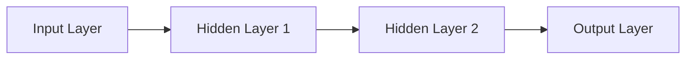

                 

## 1. 背景介绍

神经网络是一种模拟生物神经网络工作原理的人工智能模型，自从1943年Warren McCulloch和Walter Pitts首次提出以来，已经发展了几个世代。本文将回顾神经网络的演进历程，从简单的感知器到复杂的变压器模型，并探讨其核心概念、算法原理、数学模型，以及在实际应用中的项目实践。

## 2. 核心概念与联系

### 2.1 神经元与层

神经网络的基本单位是**神经元（neuron）**，它接受输入，进行加权求和，并通过激活函数输出结果。神经元组成**层（layer）**，层与层之间通过**权重（weights）和偏置（biases）连接**。



### 2.2 全连接层、卷积层、循环层

- **全连接层（Fully Connected Layer）**：每个神经元连接到前一层的所有神经元。
- **卷积层（Convolutional Layer）**：用于处理网格数据（如图像），通过滑动窗口（filter）提取特征。
- **循环层（Recurrent Layer）**：用于处理序列数据，它有记忆功能，可以处理输入序列的顺序。

### 2.3 前向传播、反向传播与优化

- **前向传播（Forward Propagation）**：计算网络输出的过程。
- **反向传播（Backpropagation）**：计算梯度，更新权重和偏置的过程。
- **优化算法（Optimization Algorithms）**：如梯度下降（Gradient Descent），用于更新权重和偏置。

## 3. 核心算法原理 & 具体操作步骤

### 3.1 算法原理概述

神经网络的训练过程包括前向传播、计算损失（loss）、反向传播、更新权重和偏置。这个过程重复进行，直到网络收敛，即损失函数的值不再下降。

### 3.2 算法步骤详解

1. **初始化权重和偏置**：通常使用随机值或正交初始化。
2. **前向传播**：计算每层的输出，直到输出层。
3. **计算损失**：比较网络输出和真实值，计算损失。
4. **反向传播**：计算梯度，更新权重和偏置。
5. **重复步骤2-4**，直到网络收敛。

### 3.3 算法优缺点

**优点**：可以学习复杂的非线性函数，具有良好的泛化能力。

**缺点**：训练过程计算量大，易陷入局部最小值，需要大量数据。

### 3.4 算法应用领域

神经网络广泛应用于图像识别、自然语言处理、推荐系统等领域。

## 4. 数学模型和公式 & 详细讲解 & 举例说明

### 4.1 数学模型构建

神经网络的数学模型可以表示为：

$$y = f(wx + b)$$

其中，$x$是输入，$w$是权重，$b$是偏置，$f$是激活函数，$y$是输出。

### 4.2 公式推导过程

损失函数（如均方误差）的梯度可以通过链式法则计算：

$$\frac{\partial L}{\partial w} = \frac{\partial L}{\partial y} \frac{\partial y}{\partial w}, \quad \frac{\partial L}{\partial b} = \frac{\partial L}{\partial y} \frac{\partial y}{\partial b}$$

### 4.3 案例分析与讲解

例如，在二分类问题中，假设真实标签为$y_{true}$，预测标签为$y_{pred}$，则交叉熵损失函数为：

$$L = -(y_{true} \log y_{pred} + (1 - y_{true}) \log (1 - y_{pred}))$$

## 5. 项目实践：代码实例和详细解释说明

### 5.1 开发环境搭建

使用Python和TensorFlow搭建开发环境。

### 5.2 源代码详细实现

```python
import tensorflow as tf
from tensorflow.keras.models import Sequential
from tensorflow.keras.layers import Dense

# 创建模型
model = Sequential()
model.add(Dense(32, activation='relu', input_shape=(input_dim,)))
model.add(Dense(1, activation='sigmoid'))

# 编译模型
model.compile(optimizer='rmsprop',
              loss='binary_crossentropy',
              metrics=['accuracy'])

# 训练模型
model.fit(x_train, y_train, epochs=10, batch_size=32)
```

### 5.3 代码解读与分析

我们创建了一个序贯模型，添加了一个全连接层和一个输出层。我们使用RMSProp优化器，二进制交叉熵损失函数，并训练模型。

### 5.4 运行结果展示

模型的训练过程会显示损失和准确度，我们可以根据这些指标调整模型。

## 6. 实际应用场景

### 6.1 当前应用

神经网络广泛应用于图像识别、语音识别、自然语言处理等领域。

### 6.2 未来应用展望

未来，神经网络可能会应用于更复杂的任务，如自动驾驶、医学诊断等。

## 7. 工具和资源推荐

### 7.1 学习资源推荐

- 书籍：《深度学习》作者：Ian Goodfellow、Yoshua Bengio、Aaron Courville
- 课程：斯坦福大学的机器学习课程

### 7.2 开发工具推荐

- TensorFlow、PyTorch、Keras
- Jupyter Notebook

### 7.3 相关论文推荐

- LeCun, Y., Bengio, Y., & Hinton, G. (2015). Deep learning. Nature, 521(7553), 436-444.

## 8. 总结：未来发展趋势与挑战

### 8.1 研究成果总结

神经网络已经取得了巨大的成功，但仍有许多挑战需要解决。

### 8.2 未来发展趋势

未来，神经网络可能会朝着更大、更复杂的方向发展，并与其他人工智能技术结合使用。

### 8.3 面临的挑战

- **计算资源**：大型神经网络需要大量计算资源。
- **数据量**：神经网络需要大量数据进行训练。
- **解释性**：神经网络的决策过程通常是不透明的。

### 8.4 研究展望

未来的研究可能会集中在提高神经网络的解释性、降低计算成本，以及开发新的架构和训练方法。

## 9. 附录：常见问题与解答

**Q：神经网络是如何学习的？**

A：神经网络通过调整权重和偏置来学习，以最小化损失函数。

**Q：什么是过拟合？**

A：过拟合是指模型学习了训练数据的噪声，而不是其本质特征，导致泛化能力下降。

**Q：如何防止过拟合？**

A：常用的方法包括正则化、 dropout、数据增强等。

## 作者：禅与计算机程序设计艺术 / Zen and the Art of Computer Programming

