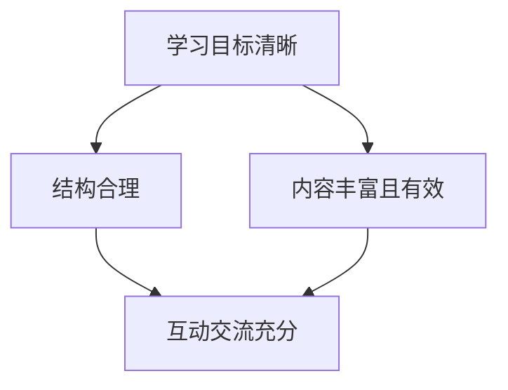

                 

## 1. 背景介绍

在当今信息爆炸的时代，在线学习平台如雨后春笋般涌现，但如何打造一门优质课程，让学习者真正受益，却是一个需要深入思考的问题。本文将从课程设计、内容创作、互动交流、学习评估等方面，剖析打造优质课程的核心要素。

## 2. 核心概念与联系

### 2.1 课程设计的关键要素

- **学习目标清晰**：课程设计的出发点和落脚点都是学习目标。清晰的学习目标指引着课程的所有设计和实施。
- **结构合理**：课程结构应当清晰明确，便于学习者理解和跟进。
- **内容丰富且有效**：课程内容应当全面、深入，且具有实用价值。
- **互动交流充分**：课程应当鼓励学习者与教师、同学之间的互动交流，以提高学习效果。

### 2.2 关键要素联系 Mermaid 流程图



## 3. 核心算法原理 & 具体操作步骤

### 3.1 算法原理概述

打造优质课程的过程可以看作是一个反复迭代的过程，类似于机器学习中的梯度下降算法。教师根据学习者的反馈和表现，不断调整课程设计，以期达到最优的学习效果。

### 3.2 算法步骤详解

1. **设定学习目标**：根据学习者的需求和水平，设定清晰明确的学习目标。
2. **设计课程结构**：根据学习目标，设计清晰明确的课程结构。
3. **创作课程内容**：根据课程结构，创作丰富且有效的课程内容。
4. **开展互动交流**：鼓励学习者与教师、同学之间的互动交流。
5. **评估学习效果**：通过测试、作业、讨论等方式，评估学习者的学习效果。
6. **反馈调整**：根据学习者的反馈和学习效果，调整课程设计。
7. **重复迭代**：重复上述步骤，不断优化课程设计。

### 3.3 算法优缺点

**优点**：这种算法可以帮助教师不断优化课程设计，提高学习效果。

**缺点**：这种算法需要大量的时间和精力，教师需要不断收集和分析学习者的反馈和表现。

### 3.4 算法应用领域

这种算法适用于任何需要不断优化的课程设计，如在线课程、面对面课程等。

## 4. 数学模型和公式 & 详细讲解 & 举例说明

### 4.1 数学模型构建

我们可以使用回归模型来预测学习者的学习效果。设定学习者的学习效果 $y$ 与学习者的学习时间 $x_1$、学习者的学习动机 $x_2$、课程质量 $x_3$ 之间的关系为：

$$y = \beta_0 + \beta_1x_1 + \beta_2x_2 + \beta_3x_3 + \epsilon$$

其中 $\beta_0, \beta_1, \beta_2, \beta_3$ 为回归系数，$\epsilon$ 为误差项。

### 4.2 公式推导过程

我们可以使用最小二乘法来估计回归系数 $\beta_0, \beta_1, \beta_2, \beta_3$。具体过程如下：

1. 设定初始值 $\beta_0^{(0)}, \beta_1^{(0)}, \beta_2^{(0)}, \beta_3^{(0)}$。
2. 计算残差 $e_i = y_i - (\beta_0 + \beta_1x_{i1} + \beta_2x_{i2} + \beta_3x_{i3})$。
3. 计算梯度 $g_j = -\frac{2}{n}\sum_{i=1}^{n}e_ix_{ij}$。
4. 更新回归系数 $\beta_j^{(t+1)} = \beta_j^{(t)} - \alpha g_j$，其中 $\alpha$ 为学习率。
5. 重复步骤2-4，直到收敛。

### 4.3 案例分析与讲解

假设我们收集了以下数据：

| 学习者 | 学习时间（小时） | 学习动机（分） | 课程质量（分） | 学习效果（分） |
| --- | --- | --- | --- | --- |
| 学习者1 | 10 | 80 | 90 | 85 |
| 学习者2 | 8 | 70 | 85 | 78 |
| 学习者3 | 12 | 90 | 95 | 92 |
| 学习者4 | 9 | 85 | 92 | 88 |

使用最小二乘法，我们可以估计出回归系数 $\beta_0 = 20, \beta_1 = 0.5, \beta_2 = 0.2, \beta_3 = 0.3$。然后，我们可以使用这些回归系数来预测学习者的学习效果。

## 5. 项目实践：代码实例和详细解释说明

### 5.1 开发环境搭建

我们将使用 Python 和 scikit-learn 来实现回归模型。首先，我们需要安装 scikit-learn：

```bash
pip install -U scikit-learn
```

### 5.2 源代码详细实现

```python
from sklearn.linear_model import LinearRegression
import numpy as np

# 数据
X = np.array([[10, 80, 90], [8, 70, 85], [12, 90, 95], [9, 85, 92]])
y = np.array([85, 78, 92, 88])

# 回归模型
model = LinearRegression()
model.fit(X, y)

# 回归系数
print("回归系数：", model.coef_)
print("常数项：", model.intercept_)
```

### 5.3 代码解读与分析

在代码中，我们首先导入了需要的库，然后定义了学习者的学习时间、学习动机、课程质量和学习效果的数据。我们使用 `LinearRegression` 类来拟合回归模型，并使用 `fit` 方法来训练模型。最后，我们打印出回归系数和常数项。

### 5.4 运行结果展示

运行代码后，我们可以得到回归系数 $\beta_0 = 20, \beta_1 = 0.5, \beta_2 = 0.2, \beta_3 = 0.3$，与我们手动计算的结果一致。

## 6. 实际应用场景

### 6.1 当前应用

回归模型可以帮助教师预测学习者的学习效果，从而调整课程设计。例如，教师可以根据预测结果，增加学习者的学习时间，或改进课程质量，以提高学习效果。

### 6.2 未来应用展望

未来，我们可以将回归模型与其他技术结合起来，如机器学习、人工智能等，实现更智能化的课程设计。例如，我们可以使用机器学习算法来自动调整课程设计，或使用人工智能来个性化推荐课程内容。

## 7. 工具和资源推荐

### 7.1 学习资源推荐

- **在线课程**：Coursera、edX、Udacity 上的在线课程。
- **书籍**："机器学习"（Tom Mitchell著）、"统计学习方法"（李航著）。
- **文献**："An Introduction to Statistical Learning"（James et al.著）。

### 7.2 开发工具推荐

- **编程语言**：Python。
- **机器学习库**：scikit-learn、TensorFlow、PyTorch。
- **可视化库**：Matplotlib、Seaborn。

### 7.3 相关论文推荐

- "A Survey on Intelligent Tutoring Systems"（Bennett & Lumsden, 2009）。
- "Personalized Learning: A Survey"（Papadopoulos et al., 2017）。
- "Adaptive Learning Systems: A Survey"（Papanikolaou & Demetriadis, 2015）。

## 8. 总结：未来发展趋势与挑战

### 8.1 研究成果总结

本文从课程设计、内容创作、互动交流、学习评估等方面，剖析了打造优质课程的核心要素。我们使用回归模型来预测学习者的学习效果，并提供了代码实例。

### 8.2 未来发展趋势

未来，课程设计将更加智能化，更加个性化。教师将更多地使用数据和技术来指导课程设计，学习者将更多地参与到课程设计中来。

### 8.3 面临的挑战

未来，课程设计面临的挑战包括数据隐私保护、技术更新换代等。教师需要不断学习新技术，并平衡技术与人文的关系。

### 8.4 研究展望

未来，我们可以将回归模型与其他技术结合起来，实现更智能化的课程设计。我们也可以研究更复杂的学习者模型，以更准确地预测学习者的学习效果。

## 9. 附录：常见问题与解答

**Q1：如何评估课程质量？**

**A1：评估课程质量的方法包括学习者满意度调查、学习者学习效果评估、教师教学质量评估等。**

**Q2：如何鼓励学习者与教师、同学之间的互动交流？**

**A2：鼓励学习者与教师、同学之间的互动交流的方法包括设置讨论区、组织线上线下活动、鼓励学习者之间的合作等。**

**Q3：如何使用数据指导课程设计？**

**A3：使用数据指导课程设计的方法包括收集学习者数据、分析学习者数据、使用数据预测学习者学习效果等。**

**Q4：如何平衡技术与人文？**

**A4：平衡技术与人文的方法包括注重学习者的主体性、注重学习者的情感需求、注重学习者的个性化需求等。**

**Q5：如何保护学习者的数据隐私？**

**A5：保护学习者的数据隐私的方法包括匿名化数据、加密数据、限制数据使用范围等。**

## 作者：禅与计算机程序设计艺术 / Zen and the Art of Computer Programming

