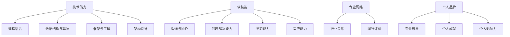

                 

**关键词：个人市场价值、技术能力、软技能、持续学习、职业发展、行业趋势**

## 1. 背景介绍

在当今快速变化的技术世界中，保持个人市场价值的提升至关重要。随着技术的不断发展，新的工具、框架和编程语言层出不穷，如果我们不持续学习和更新知识，很容易被淘汰。本文将讨论如何提升个人市场价值，包括技术能力的提升和软技能的培养，并结合实践项目和工具资源推荐，帮助读者更好地适应不断变化的技术环境。

## 2. 核心概念与联系

### 2.1 个人市场价值的构成要素

个人市场价值的构成要素包括技术能力、软技能、专业网络和个人品牌。其中，技术能力和软技能是最核心的要素，也是本文重点讨论的部分。



### 2.2 技术能力与软技能的关系

技术能力和软技能密切相关，互相促进。技术能力的提升有助于培养软技能，如问题解决能力和学习能力；而软技能的提升则有助于更好地理解和应用技术能力。两者的结合，可以帮助我们更有效地解决问题、创新和适应变化。

## 3. 核心算法原理 & 具体操作步骤

### 3.1 学习新技术的算法原理

学习新技术的过程可以看作是一个信息处理和知识构建的过程。根据信息加工理论，我们可以将学习新技术的过程分为以下几个步骤：

1. **注意（Attention）**：选择需要学习的技术，并将注意力集中在相关信息上。
2. **编码（Encoding）**：将注意到的信息转化为自己的知识结构，并与已有知识建立联系。
3. **存储（Storage）**：将编码后的信息储存在记忆中。
4. **提取（Retrieval）**：在需要时，从记忆中提取相关信息。
5. **应用（Application）**：将提取的信息应用于实际问题的解决。

### 3.2 学习新技术的步骤详解

根据上述算法原理，我们可以总结出学习新技术的具体操作步骤：

1. **选择需要学习的技术**：根据个人兴趣、职业发展需求和行业趋势，选择需要学习的技术。
2. **收集相关信息**：搜集相关信息，包括文档、教程、视频、论文等。
3. **建立基础知识**：从基础开始学习，建立技术的基本概念和原理。
4. **深入细节**：深入学习技术的细节，理解其内部原理和工作机制。
5. **实践应用**：通过实践项目或实际工作，将学习到的技术应用于问题的解决。
6. **持续更新**：技术更新速度很快，因此需要持续学习和更新知识，保持技术能力的提升。

### 3.3 学习新技术的优缺点

**优点**：

* 提升个人市场价值，增强就业竞争力。
* 丰富个人技能，提高问题解决能力。
* 扩展个人网络，获取更多资源和机会。

**缺点**：

* 学习新技术需要花费大量时间和精力。
* 学习过程中可能会面临挫折和失败。
* 过度关注技术能力提升可能会忽略软技能的培养。

### 3.4 学习新技术的应用领域

学习新技术的应用领域非常广泛，包括但不限于：

* 编程语言：如Python、JavaScript、Go、Rust等。
* 数据库：如MySQL、PostgreSQL、MongoDB、Redis等。
* 云平台：如AWS、Google Cloud、Azure等。
* 机器学习和人工智能：如TensorFlow、PyTorch、Keras等。
* 网络和安全：如网络协议、防火墙、入侵检测等。
* 移动开发：如iOS、Android、React Native等。

## 4. 数学模型和公式 & 详细讲解 & 举例说明

### 4.1 数学模型构建

学习新技术的过程可以看作是一个信息处理和知识构建的过程，我们可以使用信息加工理论构建数学模型。信息加工理论认为，信息加工过程包括注意、编码、存储、提取和应用五个步骤。我们可以使用图论模型来表示信息加工过程：

* **注意**：可以表示为一个选择过程，从信息集合中选择需要学习的信息。
* **编码**：可以表示为一个映射过程，将注意到的信息映射为自己的知识结构。
* **存储**：可以表示为一个储存过程，将编码后的信息储存在记忆中。
* **提取**：可以表示为一个搜索过程，在需要时从记忆中搜索相关信息。
* **应用**：可以表示为一个映射过程，将提取的信息映射为实际问题的解决方案。

### 4.2 公式推导过程

我们可以使用图论模型的公式来表示信息加工过程。设信息集合为$I = \{i_1, i_2,..., i_n\}$, 个人知识结构为$K = \{k_1, k_2,..., k_m\}$, 记忆储存为$M = \{m_1, m_2,..., m_p\}$, 实际问题集合为$P = \{p_1, p_2,..., p_q\}$, 解决方案集合为$S = \{s_1, s_2,..., s_r\}$.

* **注意**过程可以表示为选择函数$f_{attention} : I \rightarrow I$, 选择需要学习的信息集合$I' \subseteq I$.
* **编码**过程可以表示为映射函数$f_{encoding} : I' \rightarrow K$, 将注意到的信息映射为自己的知识结构$K'$.
* **存储**过程可以表示为映射函数$f_{storage} : K' \rightarrow M$, 将编码后的信息储存在记忆中$M'$.
* **提取**过程可以表示为搜索函数$f_{retrieval} : P \times M' \rightarrow K'$, 在需要时从记忆中搜索相关信息$K''$.
* **应用**过程可以表示为映射函数$f_{application} : K'' \times P \rightarrow S$, 将提取的信息映射为实际问题的解决方案$S'$.

### 4.3 案例分析与讲解

例如，学习新编程语言的过程可以看作是信息加工过程的一个实例。信息集合$I$包括编程语言的语法、数据结构、函数库等信息；个人知识结构$K$包括已有的编程经验和相关知识；记忆储存$M$包括学习过程中储存的新知识；实际问题集合$P$包括需要解决的编程任务；解决方案集合$S$包括编程语言的代码。

学习新编程语言的过程可以表示为：

1. **注意**：选择需要学习的编程语言，并将注意力集中在相关信息上。
2. **编码**：将注意到的信息映射为自己的知识结构，如语法规则和数据结构。
3. **存储**：将编码后的信息储存在记忆中，如通过练习和项目实践巩固新知识。
4. **提取**：在需要编写代码时，从记忆中搜索相关信息，如语法规则和函数库。
5. **应用**：将提取的信息映射为实际问题的解决方案，如编写代码解决编程任务。

## 5. 项目实践：代码实例和详细解释说明

### 5.1 开发环境搭建

在学习新技术的过程中，实践项目是非常有效的学习方法。下面我们以学习新编程语言为例，介绍如何搭建开发环境和实践项目。

1. **选择编程语言**：根据个人兴趣和需求，选择需要学习的编程语言，如Python、JavaScript、Go等。
2. **搭建开发环境**：下载并安装相关开发工具，如IDE（集成开发环境）、编译器、包管理器等。例如，学习Python时，可以使用PyCharm、Visual Studio Code等IDE，并安装Python解释器和包管理器pip。
3. **选择项目**：选择一个合适的项目，既能够帮助学习新技术，又不至于过于复杂。例如，可以选择一个简单的Web应用、数据分析项目或机器学习项目。

### 5.2 源代码详细实现

下面我们以一个简单的Web应用为例，介绍如何使用Python和Flask框架实现项目。

1. **创建新项目**：在命令行中，创建新的Python项目目录，并初始化版本控制系统。
```bash
mkdir my_web_app
cd my_web_app
git init
```
2. **安装依赖**：使用pip安装Flask框架和其他依赖。
```bash
pip install flask
```
3. **创建应用**：创建一个新文件`app.py`, 并编写简单的Web应用代码。
```python
from flask import Flask, render_template

app = Flask(__name__)

@app.route('/')
def home():
    return render_template('home.html')

if __name__ == '__main__':
    app.run(debug=True)
```
4. **创建模板**：创建一个新目录`templates`, 并创建一个新文件`home.html`, 编写简单的HTML代码。
```html
<!DOCTYPE html>
<html>
<head>
    <title>My Web App</title>
</head>
<body>
    <h1>Welcome to my web app!</h1>
</body>
</html>
```
5. **运行应用**：在命令行中，运行应用。
```bash
python app.py
```
6. **测试应用**：在浏览器中，访问`http://127.0.0.1:5000/`, 查看应用的运行结果。

### 5.3 代码解读与分析

在上述代码中，我们使用Flask框架创建了一个简单的Web应用。`app.py`文件是应用的入口点，其中定义了一个路由`@app.route('/')`, 当访问根路径时，会渲染`home.html`模板。`home.html`文件是应用的前端页面，其中包含简单的HTML代码。

### 5.4 运行结果展示

运行应用后，在浏览器中访问`http://127.0.0.1:5000/`, 可以看到应用的运行结果，如下图所示：


## 6. 实际应用场景

学习新技术的实际应用场景非常广泛，以下是一些常见的应用场景：

### 6.1 就业市场

学习新技术可以提升个人市场价值，增强就业竞争力。例如，学习新编程语言可以帮助我们应对新的就业机会，学习新的数据库系统可以帮助我们胜任新的工作岗位。

### 6.2 项目开发

学习新技术可以帮助我们更好地开发项目。例如，学习新的框架和工具可以提高开发效率，学习新的编程语言可以帮助我们解决更复杂的问题。

### 6.3 创业创新

学习新技术可以帮助我们发现新的商机，开发新的产品和服务。例如，学习新的机器学习算法可以帮助我们开发智能产品，学习新的云平台可以帮助我们开发云服务。

### 6.4 未来应用展望

未来技术的发展速度将会越来越快，学习新技术将会是一种常态。例如，未来可能会出现新的编程范式、新的数据库系统、新的云平台和新的机器学习算法。学习新技术将会是我们适应变化和保持竞争力的关键。

## 7. 工具和资源推荐

### 7.1 学习资源推荐

* **在线课程**： Coursera、Udemy、edX等平台提供大量在线课程，可以帮助我们学习新技术。
* **文档和教程**：官方文档和在线教程是学习新技术的重要资源，可以帮助我们快速入门。
* **书籍**：技术图书是学习新技术的经典资源，可以帮助我们深入理解技术原理。

### 7.2 开发工具推荐

* **IDE**：PyCharm、Visual Studio Code、IntelliJ IDEA等IDE可以帮助我们更高效地编写代码。
* **包管理器**：pip、npm、yarn等包管理器可以帮助我们管理项目依赖和安装新的包。
* **版本控制系统**：Git是当前最流行的版本控制系统，可以帮助我们管理项目版本和协作开发。

### 7.3 相关论文推荐

* **学术期刊**：IEEE、ACM、Springer等期刊发表大量技术论文，可以帮助我们了解技术前沿和最新进展。
* **会议论文**：ICSE、SIGSOFT、FSE等会议发表大量技术论文，可以帮助我们了解最新的研究成果。
* **博客和文章**：技术博客和文章是学习新技术的重要资源，可以帮助我们了解实践经验和最佳实践。

## 8. 总结：未来发展趋势与挑战

### 8.1 研究成果总结

学习新技术是提升个人市场价值的关键，可以帮助我们适应变化和保持竞争力。通过信息加工理论和项目实践，我们可以更好地理解和应用新技术。学习新技术的过程可以看作是一个信息处理和知识构建的过程，可以使用图论模型和公式表示和分析。

### 8.2 未来发展趋势

未来技术的发展速度将会越来越快，学习新技术将会是一种常态。我们需要持续学习和更新知识，保持技术能力的提升。未来可能会出现新的编程范式、新的数据库系统、新的云平台和新的机器学习算法，学习新技术将会是我们适应变化和保持竞争力的关键。

### 8.3 面临的挑战

学习新技术面临的挑战包括：

* **时间和精力有限**：学习新技术需要花费大量时间和精力，如何平衡学习和工作是一个挑战。
* **学习曲线**：学习新技术可能会面临学习曲线，需要花费时间和精力克服。
* **技术更新速度快**：技术更新速度很快，如何跟上技术潮流是一个挑战。

### 8.4 研究展望

未来的研究方向包括：

* **个性化学习**：如何根据个人特点和需求提供个性化学习路径。
* **协作学习**：如何通过协作学习提高学习效率和质量。
* **无障碍学习**：如何帮助有特殊需求的人群学习新技术。

## 9. 附录：常见问题与解答

**Q1：学习新技术需要花费多长时间？**

A1：学习新技术的时间取决于技术的复杂度和个人的学习能力。一般情况下，学习新技术需要几周到几个月的时间。

**Q2：如何选择需要学习的技术？**

A2：选择需要学习的技术时，需要考虑个人兴趣、职业发展需求和行业趋势。可以通过在线课程、文档和教程等资源获取相关信息，并与行业从业者交流，获取他们的建议和意见。

**Q3：如何克服学习新技术的学习曲线？**

A3：克服学习新技术的学习曲线需要时间和练习。可以通过实践项目、阅读文档和教程、与他人交流等方式加速学习。此外，保持学习动机和兴趣也很重要。

**Q4：如何跟上技术潮流？**

A4：跟上技术潮流需要持续学习和更新知识。可以通过关注技术博客和文章、参加技术会议和活动、与行业从业者交流等方式获取最新信息。此外，保持开放的心态和好奇心也很重要。

**Q5：如何平衡学习和工作？**

A5：平衡学习和工作需要合理安排时间和精力。可以通过设定学习目标、制订学习计划、合理安排时间等方式平衡学习和工作。此外，也可以考虑在工作中学习新技术，将学习和工作结合起来。

## 作者：禅与计算机程序设计艺术 / Zen and the Art of Computer Programming

