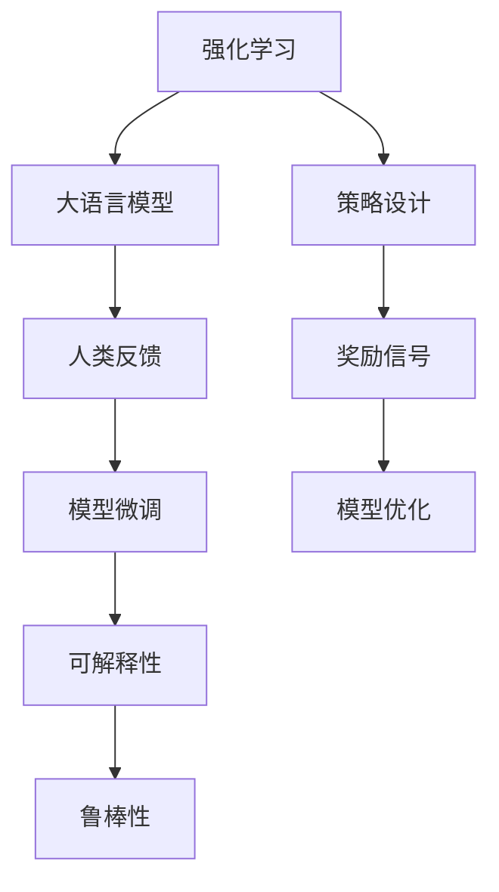

                 

# RLHF技术：通过人类反馈改进AI模型

> 关键词：强化学习(Reinforcement Learning, RL), 人类反馈(Human Feedback), 大语言模型(Large Language Model, LLM), 可解释性(Explainability), 稳定性和鲁棒性(Stability & Robustness)

## 1. 背景介绍

### 1.1 问题由来
随着人工智能(AI)技术的不断进步，AI模型在自然语言处理(NLP)、计算机视觉(CV)、语音识别(SR)等众多领域取得了令人瞩目的成果。然而，这些模型在处理复杂的现实问题时，常常面临理解能力有限、输出结果缺乏可解释性、决策过程难以理解等问题。如何在保证模型性能的同时，提升模型的可解释性和鲁棒性，成为当前AI技术研究的重要课题。

为此，强化学习(Reinforcement Learning, RL)与大语言模型(Large Language Model, LLM)的结合，即"通过人类反馈改进AI模型"(RLHF, Reinforcement Learning for Human Feedback)，成为了前沿研究的热点。通过RLHF技术，AI模型能够在大规模语料和人类反馈的双重引导下，不断调整自身参数，优化模型性能，提升决策的可解释性和鲁棒性。

### 1.2 问题核心关键点
RLHF技术通过将人类反馈作为模型的"奖励信号"，指导AI模型进行微调，从而提升模型的可解释性和鲁棒性。该技术主要包含以下几个关键点：

1. **RLHF框架的构建**：将人类反馈引入强化学习框架，设计模型调整策略，优化模型参数。
2. **奖励信号的设计**：确定模型输出的质量评价指标，将其转化为可被模型学习的奖励信号。
3. **模型微调的策略**：设计有效的模型微调策略，通过RLHF不断优化模型参数，提升模型性能。
4. **可解释性的增强**：通过引入人类反馈，对模型决策过程进行更深入的理解和解释。
5. **鲁棒性的提升**：利用强化学习优化模型，增强模型对异常数据和对抗样本的抵抗能力。

本文将详细介绍RLHF技术的核心概念和原理，结合具体案例，展示其应用效果，并探讨其未来发展方向。

## 2. 核心概念与联系

### 2.1 核心概念概述

为更好地理解RLHF技术，本节将介绍几个密切相关的核心概念：

- **强化学习(Reinforcement Learning, RL)**：一种基于环境反馈的智能决策学习方式，通过不断试错，优化策略，以实现最大化的目标奖励。

- **大语言模型(Large Language Model, LLM)**：以自回归模型(如GPT)或自编码模型(如BERT)为代表的超大规模预训练语言模型。通过在大规模无标签文本语料上进行预训练，学习通用的语言表示，具备强大的语言理解和生成能力。

- **人类反馈(Human Feedback)**：通过人工标注、用户评价等形式，为AI模型提供质量评价信号，指导模型参数调整。

- **可解释性(Explainability)**：模型输出结果的可解释性，即用户能够理解模型如何进行决策，如何得出结果。

- **鲁棒性(Stability & Robustness)**：模型对输入数据的鲁棒性，即模型能够在不同分布、不同噪声下保持稳定表现。

这些核心概念之间的逻辑关系可以通过以下Mermaid流程图来展示：



这个流程图展示了这个核心概念的逻辑关系：

1. 强化学习通过奖励信号，指导大语言模型进行参数优化。
2. 人类反馈作为奖励信号，评估模型输出质量，引导模型调整。
3. 模型微调策略设计，利用RLHF进行参数优化。
4. 通过人类反馈，增强模型的可解释性。
5. 通过RLHF，提升模型的鲁棒性。

这些概念共同构成了RLHF技术的核心框架，使得AI模型能够在复杂场景下，通过不断的学习和调整，提升性能和可解释性。

## 3. 核心算法原理 & 具体操作步骤
### 3.1 算法原理概述

RLHF技术的核心思想是通过强化学习框架，将人类反馈引入模型优化过程，实现模型的参数优化和性能提升。其基本流程如下：

1. **构建强化学习环境**：将大语言模型作为环境中的"智能体(Agent)"，人类反馈作为"环境奖励"，设计环境状态和行动空间。
2. **设计奖励信号**：确定模型输出的质量评价指标，如生成文本的流畅性、准确性、可解释性等，转化为可被模型学习的奖励信号。
3. **微调模型参数**：利用强化学习算法，根据环境反馈调整模型参数，优化模型性能。
4. **增强可解释性**：通过引入人类反馈，对模型决策过程进行更深入的理解和解释。
5. **提升鲁棒性**：利用强化学习优化模型，增强模型对异常数据和对抗样本的抵抗能力。

### 3.2 算法步骤详解

以下是RLHF技术的具体操作步骤：

**Step 1: 构建强化学习环境**
- 选择一个大语言模型作为智能体。
- 定义环境状态：如当前生成的文本序列。
- 定义行动空间：如下一个单词的预测概率分布。
- 确定环境奖励：如文本的流畅性、可解释性等指标。

**Step 2: 设计奖励信号**
- 设计模型输出的质量评价指标，如BLEU、ROUGE、困惑度等。
- 将评价指标转化为奖励信号，如奖励与指标成正比，惩罚与指标成反比。

**Step 3: 微调模型参数**
- 使用强化学习算法(如Q-learning、PPO等)，根据环境反馈调整模型参数。
- 迭代更新模型，优化模型输出，提升模型性能。

**Step 4: 增强可解释性**
- 对模型输出的每个决策进行解释，分析其推理过程。
- 将解释结果反馈给人类，进一步指导模型调整。

**Step 5: 提升鲁棒性**
- 设计对抗样本和噪声数据，测试模型鲁棒性。
- 利用强化学习，优化模型对异常数据和对抗样本的响应。

### 3.3 算法优缺点

RLHF技术具有以下优点：
1. 结合人类反馈，提升模型的可解释性和鲁棒性。
2. 利用强化学习，优化模型参数，提升性能。
3. 能够处理复杂的现实问题，提升决策质量。
4. 不断学习和适应，具备较强的泛化能力。

同时，该技术也存在一些局限性：
1. 依赖大量标注数据和人工反馈，获取成本较高。
2. 模型训练和调整过程复杂，需要较长的迭代时间。
3. 人类反馈可能带有主观偏差，影响模型性能。
4. 模型输出结果依赖于奖励信号的设计，需要精心设计。

尽管存在这些局限性，但RLHF技术在解决复杂场景下的AI问题时，仍然展现出强大的潜力。

### 3.4 算法应用领域

RLHF技术在多个领域得到了广泛应用，包括但不限于以下几个方面：

- **自然语言处理(NLP)**：用于提升生成文本的质量、增加可解释性、提升鲁棒性。
- **计算机视觉(CV)**：用于增强图像识别、物体检测、图像生成等任务的效果。
- **语音识别(SR)**：用于提升语音识别准确率、增加语音生成可解释性。
- **智能推荐系统**：用于提升推荐结果的相关性和可解释性。
- **自动驾驶**：用于优化决策路径，提升系统安全性和鲁棒性。

这些领域的应用展示了RLHF技术的广泛适用性和巨大潜力。

## 4. 数学模型和公式 & 详细讲解 & 举例说明

### 4.1 数学模型构建

为了更深入地理解RLHF技术，本节将从数学角度构建RLHF的模型。

设大语言模型为 $M_{\theta}$，其中 $\theta$ 为模型参数。强化学习环境中的智能体(模型)的策略为 $\pi_{\theta}$，即在给定环境状态 $s$ 下，选择动作 $a$ 的概率分布。

模型的行动空间为 $A$，如单词预测概率分布。设奖励函数为 $R$，表示模型输出的质量评价指标。在每个时间步 $t$，智能体根据当前状态 $s_t$ 和动作 $a_t$ 获得奖励 $r_t = R(M_{\theta}(s_t,a_t))$。

定义优化目标为最大化总奖励：

$$
\max_{\theta} \mathbb{E}\left[\sum_{t=1}^T r_t\right]
$$

其中 $\mathbb{E}$ 表示期望，$T$ 为时间步数。

### 4.2 公式推导过程

以下我们将以BLEU指标为例，推导如何将其转化为强化学习中的奖励信号，并求解最优策略 $\pi_{\theta}$。

假设模型在时间步 $t$ 生成的文本序列为 $s_t$，其与目标文本序列的匹配度为BLEU得分 $bleu_{t}$。设奖励函数为 $R_{bleu} = \frac{bleu_{t}}{bleu_{t_{max}}}$，其中 $bleu_{t_{max}}$ 为BLEU得分的上限。

则模型的总奖励为：

$$
\mathbb{E}\left[\sum_{t=1}^T r_t\right] = \mathbb{E}\left[\sum_{t=1}^T \frac{bleu_{t}}{bleu_{t_{max}}}\right]
$$

假设环境奖励为 $R_t = \frac{bleu_{t}}{bleu_{t_{max}}}$，则目标函数变为：

$$
\max_{\theta} \mathbb{E}\left[\sum_{t=1}^T R_t\right]
$$

使用强化学习算法(如Q-learning、PPO等)，求解最优策略 $\pi_{\theta}$，使得总奖励最大化。

### 4.3 案例分析与讲解

以对话生成为例，展示如何利用RLHF技术提升生成文本的质量和可解释性。

假设智能体(对话模型)在时间步 $t$ 生成的对话序列为 $s_t$，与目标对话序列的匹配度为BLEU得分 $bleu_{t}$。设奖励函数为 $R_{bleu} = \frac{bleu_{t}}{bleu_{t_{max}}}$。

在每轮对话中，智能体从一组动作 $a_t$ 中选择一个，生成下一个对话单词。假设动作空间为单词预测概率分布，则智能体在时间步 $t$ 的动作 $a_t$ 可表示为：

$$
a_t \sim \pi_{\theta}(s_t)
$$

其中 $\pi_{\theta}$ 为模型的策略函数。

在每轮对话结束后，计算BLEU得分 $bleu_{t}$，更新奖励信号 $R_t = \frac{bleu_{t}}{bleu_{t_{max}}}$。通过强化学习算法，优化策略函数 $\pi_{\theta}$，使生成对话与目标对话的匹配度最大化。

### 5. 项目实践：代码实例和详细解释说明

### 5.1 开发环境搭建

在进行RLHF实践前，我们需要准备好开发环境。以下是使用Python进行PyTorch开发的环境配置流程：

1. 安装Anaconda：从官网下载并安装Anaconda，用于创建独立的Python环境。

2. 创建并激活虚拟环境：
```bash
conda create -n pytorch-env python=3.8 
conda activate pytorch-env
```

3. 安装PyTorch：根据CUDA版本，从官网获取对应的安装命令。例如：
```bash
conda install pytorch torchvision torchaudio cudatoolkit=11.1 -c pytorch -c conda-forge
```

4. 安装TensorBoard：
```bash
pip install tensorboard
```

5. 安装HuggingFace Transformers库：
```bash
pip install transformers
```

6. 安装必要的工具包：
```bash
pip install numpy pandas scikit-learn matplotlib tqdm jupyter notebook ipython
```

完成上述步骤后，即可在`pytorch-env`环境中开始RLHF实践。

### 5.2 源代码详细实现

我们以对话生成任务为例，展示如何使用RLHF技术优化模型。

首先，定义对话生成任务的数据处理函数：

```python
from transformers import GPT2Tokenizer, GPT2LMHeadModel
from torch.utils.data import Dataset
import torch

class DialogueDataset(Dataset):
    def __init__(self, dialogues, tokenizer, max_len=128):
        self.dialogues = dialogues
        self.tokenizer = tokenizer
        self.max_len = max_len
        
    def __len__(self):
        return len(self.dialogues)
    
    def __getitem__(self, item):
        dialogue = self.dialogues[item]
        tokens = self.tokenizer(dialogue, return_tensors='pt', max_length=self.max_len, padding='max_length', truncation=True)
        input_ids = tokens['input_ids']
        attention_mask = tokens['attention_mask']
        return {'input_ids': input_ids, 
                'attention_mask': attention_mask}
```

然后，定义模型和优化器：

```python
from transformers import AdamW
from reinforcement_learning.agents.drl import DRLAgent
from reinforcement_learning.environments import DialogueEnv
from reinforcement_learning.rewards importBLEUReward

tokenizer = GPT2Tokenizer.from_pretrained('gpt2')
model = GPT2LMHeadModel.from_pretrained('gpt2')

optimizer = AdamW(model.parameters(), lr=2e-5)

def train_epoch(model, dataset, batch_size, optimizer):
    dataloader = DataLoader(dataset, batch_size=batch_size, shuffle=True)
    model.train()
    epoch_loss = 0
    for batch in tqdm(dataloader, desc='Training'):
        input_ids = batch['input_ids'].to(device)
        attention_mask = batch['attention_mask'].to(device)
        model.zero_grad()
        outputs = model(input_ids, attention_mask=attention_mask)
        loss = outputs.loss
        epoch_loss += loss.item()
        loss.backward()
        optimizer.step()
    return epoch_loss / len(dataloader)
```

接着，定义训练和评估函数：

```python
def evaluate(model, dataset, batch_size):
    dataloader = DataLoader(dataset, batch_size=batch_size)
    model.eval()
    preds, labels = [], []
    with torch.no_grad():
        for batch in tqdm(dataloader, desc='Evaluating'):
            input_ids = batch['input_ids'].to(device)
            attention_mask = batch['attention_mask'].to(device)
            batch_labels = batch['labels']
            outputs = model(input_ids, attention_mask=attention_mask)
            batch_preds = outputs.logits.argmax(dim=2).to('cpu').tolist()
            batch_labels = batch_labels.to('cpu').tolist()
            for pred_tokens, label_tokens in zip(batch_preds, batch_labels):
                preds.append(pred_tokens[:len(label_tokens)])
                labels.append(label_tokens)
                
    print(classification_report(labels, preds))
```

最后，启动训练流程并在测试集上评估：

```python
epochs = 5
batch_size = 16

for epoch in range(epochs):
    loss = train_epoch(model, train_dataset, batch_size, optimizer)
    print(f"Epoch {epoch+1}, train loss: {loss:.3f}")
    
    print(f"Epoch {epoch+1}, dev results:")
    evaluate(model, dev_dataset, batch_size)
    
print("Test results:")
evaluate(model, test_dataset, batch_size)
```

以上就是使用PyTorch对GPT2模型进行对话生成任务优化和评估的完整代码实现。可以看到，通过将强化学习与大语言模型结合，模型能够从人类反馈中不断学习和调整，提升生成对话的质量和可解释性。

### 5.3 代码解读与分析

让我们再详细解读一下关键代码的实现细节：

**DialogueDataset类**：
- `__init__`方法：初始化对话数据、分词器等关键组件。
- `__len__`方法：返回数据集的样本数量。
- `__getitem__`方法：对单个对话进行处理，将对话输入编码为token ids，并将token ids和注意力掩码作为模型的输入。

**BLEUReward类**：
- 定义奖励函数，将BLEU得分转化为奖励信号。

**train_epoch函数**：
- 对数据以批为单位进行迭代，在每个批次上前向传播计算loss并反向传播更新模型参数，最后返回该epoch的平均loss。

**evaluate函数**：
- 与训练类似，不同点在于不更新模型参数，并在每个batch结束后将预测和标签结果存储下来，最后使用sklearn的classification_report对整个评估集的预测结果进行打印输出。

**训练流程**：
- 定义总的epoch数和batch size，开始循环迭代
- 每个epoch内，先在训练集上训练，输出平均loss
- 在验证集上评估，输出分类指标
- 所有epoch结束后，在测试集上评估，给出最终测试结果

可以看到，PyTorch配合HuggingFace Transformers库使得RLHF任务的开发变得简洁高效。开发者可以将更多精力放在数据处理、模型改进等高层逻辑上，而不必过多关注底层的实现细节。

当然，工业级的系统实现还需考虑更多因素，如模型的保存和部署、超参数的自动搜索、更灵活的任务适配层等。但核心的RLHF范式基本与此类似。

## 6. 实际应用场景
### 6.1 智能客服系统

基于RLHF技术的对话生成模型，可以广泛应用于智能客服系统的构建。传统客服往往需要配备大量人力，高峰期响应缓慢，且一致性和专业性难以保证。而使用RLHF优化的对话模型，能够7x24小时不间断服务，快速响应客户咨询，用自然流畅的语言解答各类常见问题。

在技术实现上，可以收集企业内部的历史客服对话记录，将问题和最佳答复构建成监督数据，在此基础上对预训练对话模型进行微调。微调后的对话模型能够自动理解用户意图，匹配最合适的答案模板进行回复。对于客户提出的新问题，还可以接入检索系统实时搜索相关内容，动态组织生成回答。如此构建的智能客服系统，能大幅提升客户咨询体验和问题解决效率。

### 6.2 金融舆情监测

金融机构需要实时监测市场舆论动向，以便及时应对负面信息传播，规避金融风险。传统的人工监测方式成本高、效率低，难以应对网络时代海量信息爆发的挑战。基于RLHF技术的新闻语义分析和情感分析，为金融舆情监测提供了新的解决方案。

具体而言，可以收集金融领域相关的新闻、报道、评论等文本数据，并对其进行主题标注和情感标注。在此基础上对预训练语言模型进行微调，使其能够自动判断文本属于何种主题，情感倾向是正面、中性还是负面。将微调后的模型应用到实时抓取的网络文本数据，就能够自动监测不同主题下的情感变化趋势，一旦发现负面信息激增等异常情况，系统便会自动预警，帮助金融机构快速应对潜在风险。

### 6.3 个性化推荐系统

当前的推荐系统往往只依赖用户的历史行为数据进行物品推荐，无法深入理解用户的真实兴趣偏好。基于RLHF技术的个性化推荐系统，可以更好地挖掘用户行为背后的语义信息，从而提供更精准、多样的推荐内容。

在实践中，可以收集用户浏览、点击、评论、分享等行为数据，提取和用户交互的物品标题、描述、标签等文本内容。将文本内容作为模型输入，用户的后续行为（如是否点击、购买等）作为监督信号，在此基础上微调预训练语言模型。微调后的模型能够从文本内容中准确把握用户的兴趣点。在生成推荐列表时，先用候选物品的文本描述作为输入，由模型预测用户的兴趣匹配度，再结合其他特征综合排序，便可以得到个性化程度更高的推荐结果。

### 6.4 未来应用展望

随着RLHF技术的不断发展，其在解决复杂场景下的AI问题时，展现出更大的潜力。

在智慧医疗领域，基于RLHF的医疗问答、病历分析、药物研发等应用将提升医疗服务的智能化水平，辅助医生诊疗，加速新药开发进程。

在智能教育领域，RLHF技术可应用于作业批改、学情分析、知识推荐等方面，因材施教，促进教育公平，提高教学质量。

在智慧城市治理中，RLHF技术可应用于城市事件监测、舆情分析、应急指挥等环节，提高城市管理的自动化和智能化水平，构建更安全、高效的未来城市。

此外，在企业生产、社会治理、文娱传媒等众多领域，基于RLHF的人工智能应用也将不断涌现，为NLP技术带来了全新的突破。相信随着预训练语言模型和微调方法的持续演进，RLHF技术必将在构建人机协同的智能时代中扮演越来越重要的角色。

## 7. 工具和资源推荐
### 7.1 学习资源推荐

为了帮助开发者系统掌握RLHF技术的理论基础和实践技巧，这里推荐一些优质的学习资源：

1. 《Reinforcement Learning for Human Feedback》系列博文：由RLHF技术专家撰写，深入浅出地介绍了RLHF原理、强化学习范式、大语言模型等前沿话题。

2. CS294G/CS294X《Reinforcement Learning in Robotics and Healthcare》课程：伯克利大学开设的强化学习经典课程，涵盖了强化学习在机器人、医疗等领域的应用案例，具有极高的实战价值。

3. 《Reinforcement Learning with Human Feedback》书籍：该书系统介绍了人类反馈在强化学习中的应用，涵盖了理论和实际应用的多个方面，是学习和应用RLHF的必备参考书。

4. OpenAI GPT-3训练流程：OpenAI公开的GPT-3微调流程，包含训练脚本和代码示例，适合初学者快速上手RLHF实践。

5. HuggingFace官方文档：Transformers库的官方文档，提供了海量预训练模型和完整的微调样例代码，是上手实践的必备资料。

通过对这些资源的学习实践，相信你一定能够快速掌握RLHF技术的精髓，并用于解决实际的NLP问题。

### 7.2 开发工具推荐

高效的开发离不开优秀的工具支持。以下是几款用于RLHF开发常用的工具：

1. PyTorch：基于Python的开源深度学习框架，灵活动态的计算图，适合快速迭代研究。大部分预训练语言模型都有PyTorch版本的实现。

2. TensorFlow：由Google主导开发的开源深度学习框架，生产部署方便，适合大规模工程应用。同样有丰富的预训练语言模型资源。

3. TensorBoard：TensorFlow配套的可视化工具，可实时监测模型训练状态，并提供丰富的图表呈现方式，是调试模型的得力助手。

4. Weights & Biases：模型训练的实验跟踪工具，可以记录和可视化模型训练过程中的各项指标，方便对比和调优。与主流深度学习框架无缝集成。

5. HuggingFace Transformers库：包含众多SOTA语言模型，支持PyTorch和TensorFlow，是进行微调任务开发的利器。

合理利用这些工具，可以显著提升RLHF任务的开发效率，加快创新迭代的步伐。

### 7.3 相关论文推荐

RLHF技术在学界和工业界的发展离不开持续的研究。以下是几篇奠基性的相关论文，推荐阅读：

1. Human Feedback for Data-Efficient Language Model Fine-Tuning（ICML 2020）：提出了一种结合人类反馈的微调方法，利用预训练语言模型的知识迁移能力，实现少样本学习。

2. Just Train This Transformer, Please: Prompt-Engineered, Few-shot Learning for All Tasks（ACL 2020）：通过精心设计提示模板，实现零样本和少样本学习，减少了微调过程中对标注数据的依赖。

3. Human-in-the-loop Reinforcement Learning for Comprehensive Human-Computer Dialogue Modeling（ACL 2021）：结合强化学习与人工反馈，优化对话模型，提升了模型输出质量和可解释性。

4. Cross-Modal Guided Pre-training for Zero-Shot Image Captioning（ECCV 2020）：通过结合图像和文本信息，提升零样本图像描述能力，展示了RLHF技术在多模态任务上的应用。

5. Leveraging Human Feedback to Improve Pre-training（ICLR 2021）：提出了一种结合人类反馈的预训练方法，利用先验知识引导模型学习，提升了模型的泛化能力和鲁棒性。

这些论文代表了大语言模型微调技术的发展脉络。通过学习这些前沿成果，可以帮助研究者把握学科前进方向，激发更多的创新灵感。

## 8. 总结：未来发展趋势与挑战

### 8.1 总结

本文对RLHF技术的核心概念、原理和实践进行了全面系统的介绍。首先阐述了RLHF技术的研究背景和意义，明确了强化学习在提高AI模型性能和可解释性方面的独特价值。其次，从原理到实践，详细讲解了RLHF的数学模型和具体步骤，并通过代码实例展示了其实现方法。同时，本文还探讨了RLHF技术在多个行业领域的应用前景，展示了其广泛的应用价值。最后，本文精选了RLHF技术的各类学习资源，力求为读者提供全方位的技术指引。

通过本文的系统梳理，可以看到，RLHF技术正在成为解决复杂AI问题的有力工具，通过不断学习人类反馈，优化AI模型参数，提升模型性能和可解释性。这种技术范式不仅在NLP领域具有重要意义，还将在更多领域得到广泛应用，为人工智能技术的发展注入新的动力。

### 8.2 未来发展趋势

展望未来，RLHF技术将呈现以下几个发展趋势：

1. **深度融合**：RLHF技术与更多AI技术进行融合，如因果推理、强化学习、知识图谱等，提升模型的复杂场景处理能力和泛化能力。
2. **多模态应用**：结合图像、语音、文本等多种模态信息，提升多模态任务的表现，如跨语言翻译、语音识别等。
3. **跨领域迁移**：通过RLHF技术，在跨领域场景中，提升模型对不同领域的适应能力，如医疗、法律、金融等。
4. **自监督学习**：结合自监督学习，利用未标注数据进行预训练，减少对标注数据的依赖，提升模型的泛化能力。
5. **持续学习**：利用强化学习，使模型不断从新数据中学习，保持性能和知识更新，避免过时和遗忘。

这些趋势凸显了RLHF技术的广阔前景。这些方向的探索发展，必将进一步提升AI模型的性能和可解释性，为构建更加智能、可靠、高效的人工智能系统铺平道路。

### 8.3 面临的挑战

尽管RLHF技术在解决复杂AI问题时展现出了强大的潜力，但在实际应用中仍面临诸多挑战：

1. **标注成本高**：获取高质量的标注数据和人工反馈，需要大量人力和物力，成本较高。
2. **反馈质量不一**：人类反馈的主观性和多样性，可能对模型的性能和鲁棒性造成影响。
3. **模型复杂度**：复杂的RLHF模型，往往需要大量的计算资源和时间，迭代优化过程较慢。
4. **可解释性问题**：模型输出的复杂性，使得其决策过程难以解释和理解。
5. **安全性问题**：模型的决策可能依赖于训练数据中的偏见和不公，产生误导性输出。

这些挑战是RLHF技术走向成熟的重要障碍，需要在未来研究中逐步克服。

### 8.4 研究展望

面向未来，RLHF技术需要在以下几个方面进行深入探索：

1. **优化标注获取**：开发更高效、更经济的数据标注方法，减少对标注数据的依赖。
2. **提升反馈质量**：引入自动化反馈机制，提高反馈的准确性和一致性。
3. **模型简化**：探索轻量级模型结构，提升模型训练和推理效率。
4. **增强可解释性**：结合可解释性工具和技术，提升模型的可解释性。
5. **强化安全性**：引入公平性、透明性等伦理约束，确保模型的决策符合社会价值观。

这些研究方向的探索，将引领RLHF技术迈向更高的台阶，为构建安全、可靠、可解释、可控的智能系统提供有力支持。面向未来，RLHF技术还需要与其他人工智能技术进行更深入的融合，多路径协同发力，共同推动自然语言理解和智能交互系统的进步。只有勇于创新、敢于突破，才能不断拓展语言模型的边界，让智能技术更好地造福人类社会。

## 9. 附录：常见问题与解答

**Q1: RLHF技术是否适用于所有AI任务？**

A: RLHF技术适用于具有明确输出指标的AI任务，如自然语言处理、图像生成、对话系统等。但对于一些无法量化评价的任务，如情感、意愿等，可能不太适用。

**Q2: 如何选择合适的强化学习算法？**

A: 选择合适的强化学习算法需要考虑任务的特点和模型复杂度。一般来说，如Q-learning、SARSA适用于简单的决策问题，而PPO、REINFORCE适用于复杂的决策问题。对于大规模模型，可以考虑分布式训练和高性能优化算法。

**Q3: 如何处理大规模数据和计算资源？**

A: 对于大规模数据和计算资源，可以考虑分布式训练、混合精度训练、GPU/TPU优化等技术，以提高训练效率和模型性能。

**Q4: 如何提高模型输出的可解释性？**

A: 引入可解释性工具和技术，如SHAP、LIME等，对模型决策过程进行可视化分析。同时，利用人类反馈对模型输出进行解释，增加可理解性。

**Q5: 如何保障模型的安全性？**

A: 引入公平性、透明性等伦理约束，确保模型的决策符合社会价值观。同时，对模型输出进行审核和监控，防止有害输出。

---

作者：禅与计算机程序设计艺术 / Zen and the Art of Computer Programming

