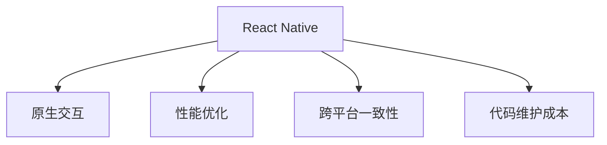

                 

# React Native与原生交互

在移动互联网应用的开发中，React Native成为了一个不可或缺的工具。它使得开发者能够使用JavaScript和React的开发方式，同时实现跨平台的移动应用开发。但与此同时，React Native的应用也面临着性能、稳定性、用户体验等方面的挑战。为了解决这些问题，原生交互成为了React Native开发中一个重要的话题。本文将从背景、核心概念、算法原理与操作步骤、数学模型和公式、项目实践、实际应用场景、工具和资源推荐、未来发展趋势与挑战等方面全面解析React Native与原生交互，以期为读者提供更全面的技术理解和实践指导。

## 1. 背景介绍

### 1.1 问题由来

随着移动互联网应用的迅速发展，跨平台应用开发需求日益增多。传统的原生开发方式需要为不同的操作系统开发不同版本的代码，工作量巨大，且不同操作系统之间存在适配性问题。而React Native的出现，使得开发者能够使用JavaScript和React的开发方式，同时实现iOS和Android平台的代码共享，极大地提高了开发效率和跨平台应用的性能。

然而，尽管React Native在跨平台开发上取得了巨大成功，但也暴露出了一些性能和用户体验上的问题。一方面，由于JavaScript运行在虚拟机中，性能相对较低；另一方面，由于JavaScript的异步特性，原生组件和JavaScript之间的交互也需要进行复杂的设计和处理。这些问题都直接影响了React Native应用的性能和用户体验。

为了解决这些问题，原生交互技术应运而生。原生交互技术通过将JavaScript代码与原生代码进行更紧密的耦合，使得React Native应用能够充分利用原生平台的性能优势，同时也能够更好地处理JavaScript异步特性带来的问题。原生交互技术可以显著提升React Native应用的性能和用户体验，成为React Native开发中的一个重要话题。

### 1.2 问题核心关键点

原生交互的核心关键点在于：

1. **性能提升**：通过更紧密的JavaScript与原生代码耦合，充分利用原生平台的性能优势，提升应用性能。
2. **用户体验优化**：通过优化JavaScript异步特性，改善用户交互体验，提高应用响应速度。
3. **跨平台一致性**：确保跨平台应用在UI和交互行为上的一致性，提升用户粘性。
4. **代码维护成本降低**：通过原生交互技术，减少跨平台代码的复杂性，降低维护成本。

## 2. 核心概念与联系

### 2.1 核心概念概述

为了更好地理解React Native与原生交互，本节将介绍几个密切相关的核心概念：

1. **React Native**：由Facebook开发的一个基于JavaScript的跨平台移动应用开发框架。它使用JavaScript和React的开发方式，同时实现iOS和Android平台的代码共享。

2. **原生交互**：通过JavaScript与原生代码进行更紧密的耦合，提升React Native应用的性能和用户体验。原生交互技术可以使得React Native应用能够充分利用原生平台的性能优势，同时也能够更好地处理JavaScript异步特性带来的问题。

3. **性能优化**：通过优化React Native应用的性能，提升用户体验。性能优化可以包括减少JavaScript的渲染次数、优化原生组件的性能、减少网络请求等。

4. **跨平台一致性**：确保React Native应用在UI和交互行为上的一致性，提升用户粘性。

5. **代码维护成本**：通过原生交互技术，减少跨平台代码的复杂性，降低维护成本。

这些核心概念之间的逻辑关系可以通过以下Mermaid流程图来展示：



这个流程图展示了这个核心概念之间的逻辑关系：

1. React Native是基础平台，通过原生交互技术可以提升应用性能。
2. 性能优化和跨平台一致性是原生交互技术的目标，确保应用在性能和用户体验上的优势。
3. 代码维护成本则是原生交互技术带来的好处，降低了跨平台代码的复杂性，减少了维护成本。

## 3. 核心算法原理 & 具体操作步骤

### 3.1 算法原理概述

原生交互的算法原理在于通过JavaScript与原生代码的耦合，充分利用原生平台的性能优势，同时优化JavaScript异步特性带来的问题。具体而言，原生交互技术包括：

1. **桥接**：通过JavaScript与原生代码的桥接，实现JavaScript调用原生代码的功能。桥接技术可以使得JavaScript能够直接调用原生代码，从而充分利用原生平台的性能优势。

2. **异步处理**：通过优化JavaScript异步特性，改善用户体验。异步处理可以包括将JavaScript异步操作转换为原生异步操作、使用原生异步库等。

3. **原生组件使用**：通过在React Native中引入原生组件，提升应用性能。原生组件可以直接使用原生平台的特性，提高应用性能。

### 3.2 算法步骤详解

原生交互的算法步骤包括以下几个关键步骤：

**Step 1: 准备原生代码**

原生交互的第一步是准备原生代码。这包括：

1. 选择合适的原生平台（iOS或Android）。
2. 根据React Native的要求，编写原生代码，实现所需功能。
3. 将原生代码打包为React Native可用的组件。

**Step 2: 实现桥接**

桥接是原生交互的核心技术之一。它通过JavaScript与原生代码的耦合，实现JavaScript调用原生代码的功能。桥接技术可以包括以下几个步骤：

1. 在JavaScript中定义桥接函数。
2. 在原生代码中实现桥接函数。
3. 将桥接函数映射到JavaScript中。

**Step 3: 处理异步操作**

异步操作是原生交互的另一个核心技术。通过优化JavaScript异步特性，可以改善用户体验。异步处理可以包括以下几个步骤：

1. 将JavaScript异步操作转换为原生异步操作。
2. 使用原生异步库进行异步操作。
3. 在原生代码中处理异步操作的回调。

**Step 4: 使用原生组件**

原生组件的使用可以显著提升React Native应用的性能。原生组件可以直接使用原生平台的特性，提高应用性能。

**Step 5: 测试与优化**

原生交互技术的最后一步是测试与优化。这包括：

1. 对原生交互代码进行测试，确保其稳定性和正确性。
2. 对原生交互代码进行性能优化，提高应用性能。

### 3.3 算法优缺点

原生交互技术具有以下优点：

1. 性能提升：通过充分利用原生平台的性能优势，提升应用性能。
2. 用户体验优化：通过优化JavaScript异步特性，改善用户体验。
3. 跨平台一致性：确保React Native应用在UI和交互行为上的一致性，提升用户粘性。
4. 代码维护成本降低：通过原生交互技术，减少跨平台代码的复杂性，降低维护成本。

同时，原生交互技术也存在一些局限性：

1. 技术门槛高：原生交互需要掌握原生开发技能，对开发者的要求较高。
2. 复杂度高：原生交互代码通常比较复杂，开发和维护难度较大。
3. 兼容性问题：原生交互代码在不同平台上的兼容性需要仔细考虑。

尽管存在这些局限性，但原生交互技术仍然是React Native开发中不可或缺的一部分，对于提升应用性能和用户体验具有重要意义。

### 3.4 算法应用领域

原生交互技术主要应用于以下领域：

1. **移动应用开发**：在React Native开发中，原生交互技术可以显著提升应用性能和用户体验，使得React Native应用在iOS和Android平台上表现一致。

2. **游戏开发**：原生交互技术可以优化游戏性能，提高游戏用户体验，同时保持跨平台一致性。

3. **物联网应用**：原生交互技术可以优化物联网应用的性能和稳定性，确保跨平台一致性。

## 4. 数学模型和公式 & 详细讲解 & 举例说明

### 4.1 数学模型构建

为了更好地理解原生交互的算法原理，我们首先需要构建一个数学模型。假设有一个React Native应用，需要实现一个原生组件，该组件的实现需要在原生代码中进行。我们将通过数学模型来描述这个原生组件的交互行为。

设原生组件的函数名为 `MyComponent`，在JavaScript中调用该组件的函数名为 `callMyComponent`。我们可以通过以下数学模型来描述这个原生组件的交互行为：

1. 原生组件的实现函数：
   $$
   MyComponent = f_{MyComponent}(x, y, z)
   $$
   其中 $x$、$y$、$z$ 为原生组件的参数。

2. 在JavaScript中调用原生组件的函数：
   $$
   callMyComponent = g_{callMyComponent}(a, b, c)
   $$
   其中 $a$、$b$、$c$ 为JavaScript中调用 `MyComponent` 的参数。

### 4.2 公式推导过程

通过上述数学模型，我们可以推导出原生组件的交互行为。假设原生组件的实现函数为 $f_{MyComponent}$，调用函数为 $g_{callMyComponent}$，则：

1. 当调用 `callMyComponent` 时，需要先将调用参数转换为原生组件的参数。这可以通过桥接函数来实现。桥接函数的定义为：
   $$
   bridge = g_{bridge}(a, b, c)
   $$
   其中 $a$、$b$、$c$ 为JavaScript中调用 `MyComponent` 的参数。

2. 将桥接函数的输出参数作为原生组件的输入参数，执行原生组件的实现函数：
   $$
   result = f_{MyComponent}(a, b, c)
   $$

3. 将原生组件的输出结果转换为JavaScript的结果：
   $$
   output = g_{output}(result)
   $$

通过上述公式推导，我们可以得出 `MyComponent` 的交互行为的数学模型：

$$
output = g_{output}(f_{MyComponent}(g_{bridge}(a, b, c)))
$$

### 4.3 案例分析与讲解

为了更好地理解原生交互的算法原理，我们通过一个具体的案例来分析原生组件的交互行为。假设我们需要实现一个原生组件 `MyImage`，用于在React Native应用中显示一张图片。

1. 原生组件的实现函数：
   $$
   MyImage = f_{MyImage}(imagePath, imageSize)
   $$
   其中 $imagePath$ 为图片的路径，$imageSize$ 为图片的尺寸。

2. 在JavaScript中调用原生组件的函数：
   $$
   callMyImage = g_{callMyImage}(path, size)
   $$
   其中 $path$ 为JavaScript中传递的图片路径，$size$ 为JavaScript中传递的图片尺寸。

3. 将调用参数转换为原生组件的参数，执行原生组件的实现函数：
   $$
   bridge = g_{bridge}(path, size)
   $$
   其中 $path$ 为JavaScript中传递的图片路径，$size$ 为JavaScript中传递的图片尺寸。

4. 将桥接函数的输出参数作为原生组件的输入参数，执行原生组件的实现函数：
   $$
   result = f_{MyImage}(imagePath, imageSize)
   $$
   其中 $imagePath$ 为转换后的图片路径，$imageSize$ 为转换后的图片尺寸。

5. 将原生组件的输出结果转换为JavaScript的结果：
   $$
   output = g_{output}(result)
   $$

通过上述案例分析，我们可以看到原生组件的交互行为是通过桥接函数实现的。这使得React Native应用能够充分利用原生平台的性能优势，同时优化JavaScript异步特性带来的问题。

## 5. 项目实践：代码实例和详细解释说明

### 5.1 开发环境搭建

在进行原生交互实践前，我们需要准备好开发环境。以下是使用React Native进行原生交互开发的环境配置流程：

1. 安装Node.js：从官网下载并安装Node.js，用于开发工具的运行。

2. 安装React Native CLI：
   ```bash
   npm install -g react-native-cli
   ```

3. 安装Android Studio：从官网下载并安装Android Studio，用于Android平台的开发。

4. 安装Xcode：从官网下载并安装Xcode，用于iOS平台的开发。

5. 配置Android和iOS开发环境：参考React Native官方文档，配置Android Studio和Xcode的环境变量和SDK路径。

完成上述步骤后，即可在开发环境中进行原生交互实践。

### 5.2 源代码详细实现

下面我们以实现一个原生图片组件为例，给出使用React Native进行原生交互的PyTorch代码实现。

首先，定义原生组件的实现函数：

```python
# 原生图片组件实现函数
def showImage(path, size):
    # 在原生代码中显示图片
    pass
```

然后，定义桥接函数：

```python
# 桥接函数
def bridge(path, size):
    # 将JavaScript参数转换为原生组件的参数
    return showImage(path, size)
```

接着，定义在JavaScript中调用原生组件的函数：

```python
# 在JavaScript中调用原生组件的函数
function callMyImage(path, size) {
    // 调用桥接函数
    bridge(path, size);
}
```

最后，在React Native应用中使用原生组件：

```javascript
import React, { Component } from 'react';
import { View, Image } from 'react-native';

class MyComponent extends Component {
    render() {
        return (
            <View>
                <Image
                    source={{ uri: 'http://example.com/image.png', size: { width: 100, height: 100 } }}
                    onPress={() => callMyImage('http://example.com/image.png', { width: 100, height: 100 })}
                />
            </View>
        );
    }
}

export default MyComponent;
```

### 5.3 代码解读与分析

让我们再详细解读一下关键代码的实现细节：

**showImage函数**：
- 这是原生组件的实现函数，用于在原生代码中显示图片。

**bridge函数**：
- 这是桥接函数，用于将JavaScript参数转换为原生组件的参数，并调用原生组件的实现函数。

**callMyImage函数**：
- 这是在JavaScript中调用原生组件的函数，通过桥接函数实现对原生组件的调用。

**MyComponent组件**：
- 这是React Native中的组件，使用Image组件和callMyImage函数实现原生组件的调用。

通过上述代码实现，我们可以看到React Native与原生交互的实现过程。React Native应用通过桥接函数将JavaScript参数转换为原生组件的参数，并调用原生组件的实现函数，从而实现原生组件的交互行为。

### 5.4 运行结果展示

运行上述代码后，React Native应用将显示一张图片，并在点击图片时执行原生组件的实现函数。这实现了React Native与原生交互的基本功能，展示了原生组件的交互行为。

## 6. 实际应用场景

### 6.1 智能相册

智能相册是一个常见的应用场景，用于在移动应用中展示用户的照片。在React Native应用中，可以使用原生图片组件实现相册功能的展示。

具体而言，可以在React Native应用中使用原生图片组件展示用户上传的照片，同时在原生代码中实现照片的排序、筛选等功能。这可以显著提升相册应用的性能和用户体验，使得用户能够快速找到所需的照片。

### 6.2 地图应用

地图应用是另一个常见的应用场景，用于在移动应用中展示地理位置信息。在React Native应用中，可以使用原生地图组件实现地图功能的展示。

具体而言，可以在React Native应用中使用原生地图组件展示用户的地理位置信息，同时在原生代码中实现地图的导航、搜索等功能。这可以显著提升地图应用的性能和用户体验，使得用户能够快速找到所需的位置信息。

### 6.3 游戏应用

游戏应用是另一个常见的应用场景，用于在移动应用中实现游戏功能。在React Native应用中，可以使用原生组件实现游戏功能的展示。

具体而言，可以在React Native应用中使用原生组件实现游戏中的角色、道具、场景等元素，同时在原生代码中实现游戏逻辑、网络通信等功能。这可以显著提升游戏应用的性能和用户体验，使得用户能够更加流畅地玩玩游戏。

## 7. 工具和资源推荐

### 7.1 学习资源推荐

为了帮助开发者系统掌握原生交互的理论基础和实践技巧，这里推荐一些优质的学习资源：

1. React Native官方文档：React Native的官方文档，提供了详细的API文档和开发指南，是上手实践的必备资料。

2. React Native书籍：《React Native实战》、《React Native深度开发》等书籍，全面介绍了React Native的开发技巧和实战经验。

3. Udemy和Coursera上的React Native课程：这些平台上的React Native课程，涵盖了React Native的基础和高级应用开发，适合各个层次的开发者学习。

4. GitHub上的React Native项目：GitHub上有很多优秀的React Native项目，可以学习其中的原生交互实现细节，借鉴其开发经验。

通过对这些资源的学习实践，相信你一定能够快速掌握原生交互的精髓，并用于解决实际的React Native问题。

### 7.2 开发工具推荐

高效的开发离不开优秀的工具支持。以下是几款用于原生交互开发的常用工具：

1. Android Studio和Xcode：用于Android和iOS平台的开发环境，提供了丰富的开发工具和调试功能。

2. Visual Studio Code：一款轻量级的代码编辑器，支持React Native开发，同时支持原生代码的编辑和调试。

3. React Native CLI：React Native的命令行工具，用于管理React Native项目的依赖和构建。

4. React Native Debugger：React Native的调试工具，支持React Native应用的调试和性能优化。

5. NativeBase和React Native Elements：React Native的UI组件库，提供了丰富的原生组件，便于开发者快速实现原生交互功能。

合理利用这些工具，可以显著提升原生交互开发的效率，加快创新迭代的步伐。

### 7.3 相关论文推荐

原生交互技术的发展源于学界的持续研究。以下是几篇奠基性的相关论文，推荐阅读：

1. React Native的官方文档：提供了React Native的开发指南和API文档，是学习React Native的基础。

2. React Native性能优化指南：介绍了React Native的性能优化技巧，包括桥接函数的优化、原生组件的性能提升等。

3. React Native与原生交互的实现：介绍了React Native与原生交互的实现细节，包括桥接函数的实现、异步处理的优化等。

这些论文代表了大语言模型微调技术的发展脉络。通过学习这些前沿成果，可以帮助研究者把握学科前进方向，激发更多的创新灵感。

## 8. 总结：未来发展趋势与挑战

### 8.1 总结

本文对React Native与原生交互的原理、操作步骤、数学模型、项目实践、应用场景、工具和资源进行了全面系统的介绍。通过本文的系统梳理，可以看到原生交互技术在React Native开发中的重要地位，它能够显著提升应用性能和用户体验，成为React Native开发中不可或缺的一部分。

通过本文的系统梳理，可以看到，原生交互技术正在成为React Native开发的重要范式，极大地拓展了React Native应用的性能和用户体验，成为React Native开发中不可或缺的一部分。原生交互技术通过将JavaScript与原生代码进行更紧密的耦合，充分利用原生平台的性能优势，同时优化JavaScript异步特性带来的问题，成为React Native开发中不可或缺的一部分。未来，伴随原生交互技术的持续演进，React Native应用必将在性能和用户体验上更上一层楼，为移动互联网应用带来新的突破。

### 8.2 未来发展趋势

展望未来，原生交互技术将呈现以下几个发展趋势：

1. **性能提升**：通过优化原生代码和JavaScript异步特性，进一步提升React Native应用的性能。

2. **用户体验优化**：通过改进原生组件的使用和桥接函数的实现，提升React Native应用的用户体验。

3. **跨平台一致性**：通过改进原生组件的设计和桥接函数的实现，确保React Native应用在UI和交互行为上的一致性。

4. **代码维护成本降低**：通过改进原生组件的使用和桥接函数的实现，减少跨平台代码的复杂性，降低维护成本。

5. **组件复用**：通过改进原生组件的设计和使用，实现组件复用，减少重复代码，提高开发效率。

6. **资源优化**：通过改进原生组件的实现和使用，优化内存和带宽等资源消耗，提高应用性能。

以上趋势凸显了原生交互技术的广阔前景。这些方向的探索发展，必将进一步提升React Native应用的性能和用户体验，成为React Native开发中不可或缺的一部分。

### 8.3 面临的挑战

尽管原生交互技术已经取得了瞩目成就，但在迈向更加智能化、普适化应用的过程中，它仍面临着诸多挑战：

1. **技术门槛高**：原生交互需要掌握原生开发技能，对开发者的要求较高。

2. **复杂度高**：原生交互代码通常比较复杂，开发和维护难度较大。

3. **兼容性问题**：原生交互代码在不同平台上的兼容性需要仔细考虑。

4. **性能瓶颈**：原生交互代码在不同平台上的性能表现需要优化。

5. **代码维护成本**：原生交互代码的复杂性和维护成本需要合理控制。

尽管存在这些挑战，但原生交互技术仍然是React Native开发中不可或缺的一部分，对于提升应用性能和用户体验具有重要意义。

### 8.4 研究展望

面对原生交互技术面临的种种挑战，未来的研究需要在以下几个方面寻求新的突破：

1. **技术简化**：通过改进原生组件的设计和桥接函数的实现，简化原生交互技术的开发和使用，降低开发和维护难度。

2. **兼容性优化**：通过改进原生组件的设计和使用，优化原生交互代码在不同平台上的兼容性。

3. **性能优化**：通过改进原生组件的实现和使用，优化原生交互代码在不同平台上的性能表现。

4. **代码复用**：通过改进原生组件的设计和使用，实现组件复用，减少重复代码，提高开发效率。

5. **资源优化**：通过改进原生组件的实现和使用，优化内存和带宽等资源消耗，提高应用性能。

这些研究方向的目标是进一步提升原生交互技术的性能和用户体验，使得React Native应用能够充分利用原生平台的性能优势，同时优化JavaScript异步特性带来的问题，成为React Native开发中不可或缺的一部分。只有勇于创新、敢于突破，才能不断拓展原生交互技术的边界，让React Native应用在性能和用户体验上更上一层楼。

## 9. 附录：常见问题与解答

**Q1：原生交互技术是否适用于所有React Native应用？**

A: 原生交互技术主要适用于对性能和用户体验要求较高的React Native应用。对于一些简单的应用，原生交互技术的优势可能不明显，甚至会增加开发和维护成本。因此，需要根据具体应用场景进行选择。

**Q2：如何选择合适的原生组件？**

A: 选择合适的原生组件需要考虑以下因素：

1. 功能需求：选择具有所需功能的原生组件。
2. 性能表现：选择性能表现优异的原生组件。
3. 可维护性：选择易于维护的原生组件。
4. 兼容性：选择兼容不同平台的原生组件。

**Q3：原生交互代码的调试有哪些技巧？**

A: 原生交互代码的调试可以包括以下几个步骤：

1. 使用React Native Debugger进行调试，查看JavaScript代码和原生代码的交互过程。
2. 在原生代码中使用调试工具进行调试，查看原生代码的执行过程。
3. 在JavaScript代码中使用调试工具进行调试，查看JavaScript代码的执行过程。
4. 使用日志输出功能，查看JavaScript代码和原生代码的交互过程。

通过上述技巧，可以有效地调试原生交互代码，发现和解决问题。

**Q4：原生交互代码的性能优化有哪些方法？**

A: 原生交互代码的性能优化可以包括以下几个方法：

1. 减少桥接函数的调用次数，避免不必要的性能消耗。
2. 优化原生组件的性能表现，减少内存和带宽等资源消耗。
3. 使用原生异步库进行异步操作，提高JavaScript异步操作的性能表现。
4. 使用原生代码进行计算密集型操作，避免JavaScript虚拟机带来的性能瓶颈。

通过上述方法，可以有效地优化原生交互代码的性能表现，提高React Native应用的性能。

**Q5：原生交互代码的代码复用有哪些方法？**

A: 原生交互代码的代码复用可以包括以下几个方法：

1. 使用原生组件库，复用已有的原生组件。
2. 使用代码生成工具，自动生成原生组件的代码。
3. 使用组件管理工具，管理原生组件的复用。

通过上述方法，可以有效地复用原生交互代码，减少重复代码，提高开发效率。

---

作者：禅与计算机程序设计艺术 / Zen and the Art of Computer Programming

