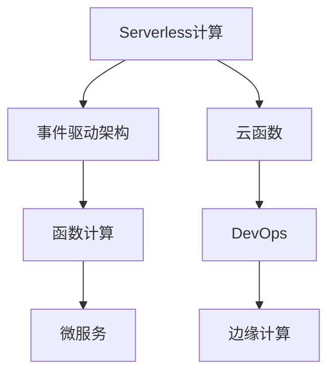

                 

# Serverless架构：事件驱动的云计算模型

> 关键词：Serverless, 云计算, 事件驱动, 函数计算, 微服务, 容器化, DevOps, 云函数, 边缘计算, 事件驱动架构, 自动化, 弹性伸缩, 跨云部署, 混合云

## 1. 背景介绍

### 1.1 问题由来

随着云计算技术的迅猛发展，企业对于云基础设施的需求日益增长，但传统的云服务部署和管理方式面临诸多挑战：

1. **资源浪费**：企业通常会购买超过实际需求的资源以应对高峰时段的负载，导致大量资源闲置。
2. **运维复杂**：云计算基础设施的管理和维护复杂，需要专业团队持续监控和调整，增加了人力和运营成本。
3. **灵活性不足**：应用和服务难以快速响应业务需求的变化，无法做到按需扩展和缩减。

针对这些问题，Serverless架构应运而生。Serverless架构通过按需动态分配和回收计算资源，实现了应用的自动伸缩和弹性管理，极大地简化了云计算的部署和管理，推动了云原生应用的演进。

### 1.2 问题核心关键点

Serverless架构的核心在于“无服务器计算”，即将应用的计算逻辑打包为服务，由云计算平台负责计算资源的分配和管理。这种架构的主要特点包括：

- **自动伸缩**：根据应用负载动态调整资源，无需手动调整。
- **事件驱动**：应用响应来自外部事件的触发，如API请求、消息队列等。
- **函数计算**：应用拆分为多个微函数，每个函数独立计算，互不干扰。
- **快速部署**：应用和服务可以迅速部署和扩展，无需等待资源准备。
- **按需付费**：根据实际使用情况计费，避免资源浪费。

本文将从Serverless架构的基本概念出发，详细探讨其在云计算中的应用和优势，以及未来发展的趋势和挑战。

## 2. 核心概念与联系

### 2.1 核心概念概述

为了更好地理解Serverless架构，本节将介绍几个关键概念：

- **Serverless计算**：指开发者无需管理底层服务器资源，完全由云平台自动分配和回收计算资源的计算模型。
- **事件驱动架构**：指应用通过事件触发器来处理来自外部环境的消息或请求，实现无状态的、松耦合的系统设计。
- **函数计算**：指将应用的计算逻辑封装为独立的函数，每个函数独立运行，互不干扰。
- **微服务**：指将应用拆分为多个小服务，每个服务独立运行，易于管理和维护。
- **DevOps**：指软件开发和运维的协同，通过自动化工具提升软件交付效率和质量。
- **云函数**：指在云计算平台上运行的可独立调用的函数，一般由云平台自动管理。
- **边缘计算**：指将数据处理和计算任务部分或全部移近数据源进行，减少数据传输和延迟。

这些概念之间的逻辑关系可以通过以下Mermaid流程图来展示：



这个流程图展示了几项关键技术之间的关系：

1. Serverless计算提供了底层资源管理，是事件驱动架构和函数计算的基础。
2. 事件驱动架构通过异步事件触发，实现微服务的自动响应。
3. 函数计算通过封装为独立的函数，实现了微服务的无状态化。
4. DevOps工具链支持微服务的自动化部署和运维。
5. 云函数是函数计算的实现形式。
6. 边缘计算将部分计算任务靠近数据源执行，提升数据处理效率。

## 3. 核心算法原理 & 具体操作步骤

### 3.1 算法原理概述

Serverless架构的核心算法原理是基于事件驱动的异步计算模型。应用通过事件触发器（如HTTP请求、消息队列）接收外部事件，触发相应的函数计算，计算结果自动返回给调用方。这种模型使得应用能够根据实际负载动态调整资源，无需手动管理底层服务器，极大地简化了云计算的部署和管理。

### 3.2 算法步骤详解

Serverless架构的实施步骤如下：

1. **应用拆分**：将应用逻辑拆分为多个独立运行的微服务或函数。
2. **函数部署**：将微服务或函数封装为云函数，并部署到云平台。
3. **事件绑定**：为云函数绑定事件触发器，使其能够响应外部事件。
4. **自动伸缩**：根据应用负载自动调整计算资源。
5. **按需付费**：根据实际使用情况计费，避免资源浪费。

### 3.3 算法优缺点

Serverless架构的优点包括：

- **资源按需分配**：根据实际负载动态调整资源，无需手动管理底层服务器。
- **自动伸缩**：根据应用负载自动调整计算资源，无需手动调整。
- **快速部署**：应用和服务可以迅速部署和扩展，无需等待资源准备。
- **弹性管理**：应用可以自动应对突发流量，无需担心资源不足。

Serverless架构的缺点包括：

- **冷启动延迟**：函数计算有冷启动时间，可能影响响应速度。
- **调用次数限制**：每个函数的调用次数有限，超过限制后需要升级或优化。
- **依赖于云平台**：应用的依赖和行为受到云平台限制，无法完全自由设计。
- **安全性问题**：应用和数据在云平台运行，可能面临安全威胁。

### 3.4 算法应用领域

Serverless架构已经广泛应用于多个领域，包括但不限于：

- **金融科技**：实时支付、反欺诈检测、信用评分等。
- **电商零售**：订单处理、库存管理、推荐系统等。
- **互联网应用**：社交媒体、内容分发、广告投放等。
- **物联网**：设备监控、数据处理、边缘计算等。
- **健康医疗**：电子病历、远程诊疗、药物研发等。
- **物流运输**：路径规划、货物追踪、智能调度等。

这些领域的应用证明了Serverless架构的高效性和灵活性，为企业提供了强大的计算能力支持。

## 4. 数学模型和公式 & 详细讲解 & 举例说明

### 4.1 数学模型构建

Serverless架构的数学模型主要涉及资源分配、负载均衡和按需付费三个方面。

**资源分配**：设资源总需求为 $D$，资源分配算法为目标函数：

$$
\min \sum_{i=1}^n (x_i - d_i)^2
$$

其中 $x_i$ 为资源需求，$d_i$ 为实际分配的资源量，目标是最小化资源需求和分配量的差距。

**负载均衡**：假设系统负载为 $L$，服务器的最大处理能力为 $C$，负载均衡算法为目标函数：

$$
\min \sum_{i=1}^m (L_i - C_i)^2
$$

其中 $L_i$ 为负载量，$C_i$ 为处理能力，目标是最小化负载和处理能力的差距。

**按需付费**：设实际使用量为 $U$，支付费用为 $P$，按需付费算法为目标函数：

$$
\min \sum_{i=1}^n (p_i - u_i)^2
$$

其中 $p_i$ 为支付费用，$u_i$ 为实际使用量，目标是最小化支付费用和使用量的差距。

### 4.2 公式推导过程

以负载均衡为例，假设系统负载 $L$ 平均分配到 $m$ 个服务器上，每个服务器的处理能力为 $C$，则负载均衡的目标函数为：

$$
\min \sum_{i=1}^m (L_i - C_i)^2
$$

设每个服务器的实际处理能力为 $C_i'$，则目标函数变为：

$$
\min \sum_{i=1}^m (L_i - C_i')^2
$$

通过求解上述优化问题，可以找到最优的资源分配策略，使得系统负载均衡，资源利用率最高。

### 4.3 案例分析与讲解

假设某金融科技公司部署了一个反欺诈检测应用，使用Serverless架构。系统负载平均为 $10000$ 次/秒，每个函数的最大处理能力为 $500$ 次/秒，初始资源分配为 $20$ 个函数。

根据负载均衡目标函数：

$$
\min \sum_{i=1}^{20} (L_i - C_i)^2
$$

可以求得最优的函数数量和负载分配策略。假设函数数量增加至 $30$，则新的负载均衡目标函数变为：

$$
\min \sum_{i=1}^{30} (L_i - C_i')^2
$$

通过求解上述优化问题，可以找到最优的函数数量和负载分配策略。

## 5. 项目实践：代码实例和详细解释说明

### 5.1 开发环境搭建

为了在云平台上部署Serverless应用，需要安装相应的开发工具和云平台账号。以下是一个基本的开发环境搭建流程：

1. **安装Python**：确保系统中已安装Python 3.x版本。
2. **安装云平台SDK**：如AWS SDK、Azure SDK等。
3. **配置账号**：在云平台上注册账号，获取API Key和Secret Key。
4. **安装DevOps工具**：如Jenkins、GitLab CI等。
5. **配置CI/CD**：在DevOps工具中配置CI/CD流水线，自动部署和测试应用。

### 5.2 源代码详细实现

以下是一个使用AWS Lambda函数实现的Serverless应用的示例代码：

```python
import json
import boto3

def lambda_handler(event, context):
    # 解析请求参数
    data = json.loads(event['body'])
    username = data['username']
    password = data['password']

    # 调用身份验证API进行身份验证
    client = boto3.client('iam')
    response = client.authenticate_user(username, password)

    # 根据响应结果返回结果
    if response['StatusCode'] == 200:
        return {
            'statusCode': 200,
            'body': json.dumps({'success': True})
        }
    else:
        return {
            'statusCode': 400,
            'body': json.dumps({'success': False})
        }
```

该代码定义了一个AWS Lambda函数，用于身份验证API的实现。当接收到HTTP请求时，函数解析请求参数，调用身份验证API进行身份验证，并根据响应结果返回结果。

### 5.3 代码解读与分析

**lambda_handler函数**：
- `event`：包含请求参数的字典。
- `context`：包含函数运行环境的上下文信息。
- `boto3.client('iam')`：创建AWS Identity and Access Management（IAM）客户端。
- `client.authenticate_user(username, password)`：调用IAM身份验证API进行身份验证。
- `return`：根据身份验证结果返回HTTP响应。

**API响应处理**：
- 如果身份验证成功，则返回HTTP状态码200和成功响应。
- 如果身份验证失败，则返回HTTP状态码400和失败响应。

### 5.4 运行结果展示

在AWS Management Console中，部署该Lambda函数后，可以通过API Gateway或SDK进行调用。例如，使用SDK调用函数时，代码如下：

```python
import boto3

client = boto3.client('lambda', region_name='us-west-2')
response = client.invoke(
    FunctionName='identity-verification',
    InvocationType='RequestResponse',
    Payload=json.dumps({'username': 'alice', 'password': '123456'})
)
print(response['Payload'].read().decode())
```

运行该代码后，控制台输出如下：

```
{"statusCode": 200, "body": '{"success": true}'
}
```

说明身份验证成功，返回了成功响应。

## 6. 实际应用场景

### 6.1 金融科技

在金融科技领域，Serverless架构被广泛用于实时支付、反欺诈检测、信用评分等场景。传统应用往往需要复杂的基础设施管理和资源调配，而Serverless架构能够自动调整计算资源，实时响应业务需求，提高系统的可靠性和稳定性。

**实时支付**：Serverless架构可以实现实时支付功能的快速部署和扩展，支持高并发和海量支付请求，确保交易的安全和高效。

**反欺诈检测**：Serverless架构可以实时分析交易数据，检测异常行为，快速响应欺诈事件，保护金融资产安全。

**信用评分**：Serverless架构可以实时处理用户数据，进行信用评分和风险评估，为贷款审批提供准确的支持。

### 6.2 电商零售

在电商零售领域，Serverless架构被用于订单处理、库存管理、推荐系统等场景。传统应用往往需要部署大量的服务器和中间件，而Serverless架构可以动态调整资源，快速响应业务变化。

**订单处理**：Serverless架构可以实现实时订单处理，快速响应用户的支付请求，提高订单处理的效率和准确性。

**库存管理**：Serverless架构可以实时监控库存状态，及时调整库存水平，满足市场需求，减少库存积压和缺货现象。

**推荐系统**：Serverless架构可以实时分析用户行为数据，推荐个性化的商品和服务，提升用户体验和销售额。

### 6.3 互联网应用

在互联网应用领域，Serverless架构被用于社交媒体、内容分发、广告投放等场景。传统应用往往需要复杂的服务器集群管理和负载均衡，而Serverless架构可以简化应用部署和管理，提升系统的灵活性和扩展性。

**社交媒体**：Serverless架构可以实现实时消息处理和推送，支持海量用户互动，提升社交体验。

**内容分发**：Serverless架构可以实现实时内容分发和缓存，加速内容访问速度，提升用户体验。

**广告投放**：Serverless架构可以实现实时广告投放和效果监测，优化广告投放策略，提升广告效果和ROI。

## 7. 工具和资源推荐

### 7.1 学习资源推荐

为了帮助开发者系统掌握Serverless架构的理论基础和实践技巧，这里推荐一些优质的学习资源：

1. **AWS Lambda官方文档**：提供完整的Lambda函数开发和部署指南，涵盖API Gateway、SNS、SQS等云服务的使用。
2. **Microsoft Azure官方文档**：提供完整的Azure Functions开发和部署指南，涵盖Event Grid、Service Bus等云服务的使用。
3. **Google Cloud Functions官方文档**：提供完整的Cloud Functions开发和部署指南，涵盖Pub/Sub、Datastore等云服务的使用。
4. **Serverless Framework官方文档**：提供完整的Serverless框架开发和部署指南，支持多云平台的集成和自动化管理。
5. **AWS Lambda Cookbook**：详细介绍了Lambda函数开发和部署的最佳实践，涵盖API Gateway、SNS、SQS等云服务的使用。
6. **Azure Functions Cookbook**：详细介绍了Azure Functions开发和部署的最佳实践，涵盖Event Grid、Service Bus等云服务的使用。

通过对这些资源的学习实践，相信你一定能够快速掌握Serverless架构的精髓，并用于解决实际的云计算问题。

### 7.2 开发工具推荐

高效的开发离不开优秀的工具支持。以下是几款用于Serverless架构开发的常用工具：

1. **AWS Lambda**：AWS提供的Serverless函数计算服务，支持Python、Java、Node.js等多种编程语言。
2. **Azure Functions**：Azure提供的Serverless函数计算服务，支持C#、Java、JavaScript等多种编程语言。
3. **Google Cloud Functions**：Google Cloud提供的Serverless函数计算服务，支持Python、Java、Go等多种编程语言。
4. **Serverless Framework**：一个开源的Serverless框架，支持AWS Lambda、Azure Functions、Google Cloud Functions等多种云服务。
5. **CloudWatch**：AWS提供的监控和日志服务，支持实时监控和报警。
6. **Azure Monitor**：Azure提供的监控和日志服务，支持实时监控和报警。
7. **GCP Operations Suite**：Google Cloud提供的监控和日志服务，支持实时监控和报警。

合理利用这些工具，可以显著提升Serverless架构的开发效率，加快创新迭代的步伐。

### 7.3 相关论文推荐

Serverless架构的研究源于学界的持续探索。以下是几篇奠基性的相关论文，推荐阅读：

1. **Managing Elastic Computation at Amazon Web Services**：介绍AWS Lambda函数的自动伸缩和管理机制，提供实证分析。
2. **Design and Implementation of Serverless Architecture**：介绍Serverless架构的设计和实现机制，提供系统架构分析。
3. **Serverless Computing: Concepts, Technology Stack and Challenges**：全面介绍了Serverless计算的概念、技术栈和面临的挑战，提供学术讨论。
4. **Microservices and Serverless Computing: A Comparative Analysis**：对比分析微服务和Serverless计算的异同，提供学术讨论。
5. **Serverless Architecture in Practice: A Survey**：总结了Serverless架构在实践中的应用和挑战，提供实践指南。

这些论文代表了大规模计算和Serverless架构的研究进展。通过学习这些前沿成果，可以帮助研究者把握学科前进方向，激发更多的创新灵感。

## 8. 总结：未来发展趋势与挑战

### 8.1 总结

本文对Serverless架构的基本概念和实践进行了详细探讨。从Serverless计算、事件驱动架构、函数计算等核心概念出发，详细介绍了Serverless架构的核心算法原理和操作步骤。通过实践示例和案例分析，展示了Serverless架构在金融科技、电商零售、互联网应用等领域的广泛应用。

通过本文的系统梳理，可以看到，Serverless架构通过自动化计算资源管理，简化了云计算的部署和管理，极大地提升了云计算的灵活性和效率，为云计算技术的进一步演进提供了新的方向。未来，随着Serverless架构的不断发展和完善，必将在更多领域得到广泛应用，推动云计算技术的深度发展。

### 8.2 未来发展趋势

展望未来，Serverless架构将呈现以下几个发展趋势：

1. **多云集成**：Serverless架构将支持多云平台的集成和统一管理，实现跨云的资源调配和应用迁移。
2. **边缘计算**：Serverless架构将结合边缘计算，实现数据的本地处理和分析，提升数据处理效率。
3. **人工智能**：Serverless架构将与人工智能技术深度融合，提供更强大的数据处理和智能决策能力。
4. **容器化**：Serverless架构将结合容器化技术，提供更灵活和可扩展的应用部署方式。
5. **微服务化**：Serverless架构将进一步推动微服务化发展，实现应用的细粒度管理和优化。
6. **DevOps自动化**：Serverless架构将进一步推动DevOps自动化，实现应用的自动化部署、测试和运维。

这些趋势凸显了Serverless架构的高效性和灵活性，为其在更多领域的应用提供了新的动力。

### 8.3 面临的挑战

尽管Serverless架构已经取得了显著进展，但在迈向更加智能化、普适化应用的过程中，仍面临诸多挑战：

1. **冷启动延迟**：函数计算有冷启动时间，可能影响响应速度。
2. **调用次数限制**：每个函数的调用次数有限，超过限制后需要升级或优化。
3. **依赖于云平台**：应用的依赖和行为受到云平台限制，无法完全自由设计。
4. **安全性问题**：应用和数据在云平台运行，可能面临安全威胁。
5. **成本问题**：按需付费模式可能导致成本波动，难以预算和控制。

这些挑战需要开发者在使用Serverless架构时，根据实际需求进行全面评估和优化。

### 8.4 研究展望

未来研究需要在以下几个方面寻求新的突破：

1. **冷启动优化**：优化函数启动机制，提升响应速度。
2. **调用次数扩展**：优化函数调用机制，扩展调用次数限制。
3. **跨云部署**：实现跨云平台的无缝集成和资源调配。
4. **安全保障**：加强应用和数据的安全防护，避免安全威胁。
5. **成本控制**：优化计费模型，实现成本预算和控制。
6. **自动化管理**：实现应用的自动化管理，提升部署和运维效率。

这些研究方向的探索，必将引领Serverless架构的进一步发展和完善，为云计算技术的深度演进提供新的动力。

## 9. 附录：常见问题与解答

**Q1：Serverless架构是否适用于所有应用场景？**

A: Serverless架构适用于需要弹性伸缩和自动管理资源的应用场景，特别适合以下类型应用：

- **流量变化大的应用**：如电商、社交媒体、广告投放等。
- **高并发的应用**：如实时支付、实时分析、在线游戏等。
- **需要快速响应的应用**：如实时视频、在线教育、智能客服等。

而对于一些需要复杂状态管理和细粒度控制的应用，如金融交易系统、企业ERP系统等，Serverless架构可能并不适合。

**Q2：Serverless架构如何实现自动化部署和运维？**

A: Serverless架构通过CI/CD流水线实现自动化部署和运维，通常包括以下步骤：

1. **配置DevOps工具**：如Jenkins、GitLab CI等。
2. **编写CI/CD脚本**：编写自动化部署和测试脚本，确保应用的连续集成和持续交付。
3. **部署应用**：通过CI/CD工具自动部署应用到云平台。
4. **测试应用**：自动运行单元测试、集成测试和端到端测试，确保应用的质量和稳定性。
5. **监控应用**：通过云平台的监控服务，实时监测应用的运行状态和性能指标。
6. **自动扩展**：根据应用负载自动调整计算资源，确保应用的可靠性和扩展性。

**Q3：Serverless架构如何降低成本？**

A: Serverless架构通过按需付费模式降低成本，具体做法包括：

1. **按需使用资源**：根据应用负载动态调整计算资源，避免资源闲置和浪费。
2. **优化函数设计**：优化函数的计算逻辑，提升函数执行效率，减少计算费用。
3. **使用缓存和CDN**：使用缓存和CDN技术，减少数据传输和计算，提升应用性能和成本效益。
4. **自动扩展和缩减**：根据应用负载自动调整计算资源，避免资源浪费和成本增加。

通过以上措施，Serverless架构可以显著降低云计算的运营成本，提高应用的成本效益。

**Q4：Serverless架构如何保障安全性？**

A: Serverless架构通过以下措施保障安全性：

1. **身份验证和授权**：使用AWS IAM、Azure Active Directory等身份验证机制，确保访问的安全性。
2. **加密和传输安全**：使用SSL/TLS等加密技术，确保数据传输的安全性。
3. **访问控制**：使用AWS S3、Azure Blob Storage等存储服务，设置严格的访问控制策略。
4. **日志审计**：使用AWS CloudTrail、Azure Monitor等日志服务，记录和审计应用的操作记录。
5. **数据保护**：使用AWS KMS、Azure Key Vault等密钥管理服务，保护数据的安全性。

通过以上措施，Serverless架构可以显著提升应用的安全性，避免数据泄露和安全威胁。

**Q5：Serverless架构如何处理冷启动延迟？**

A: Serverless架构通过以下措施处理冷启动延迟：

1. **预加载资源**：通过预加载函数依赖和资源，减少冷启动时间。
2. **使用预热机制**：使用预热机制，提前加载函数和依赖，减少冷启动时间。
3. **优化函数设计**：优化函数的启动逻辑，减少函数启动时间。
4. **使用异步函数**：使用异步函数，减少函数启动和执行的时间。

通过以上措施，Serverless架构可以显著减少冷启动延迟，提升应用的响应速度和用户体验。

---

作者：禅与计算机程序设计艺术 / Zen and the Art of Computer Programming

