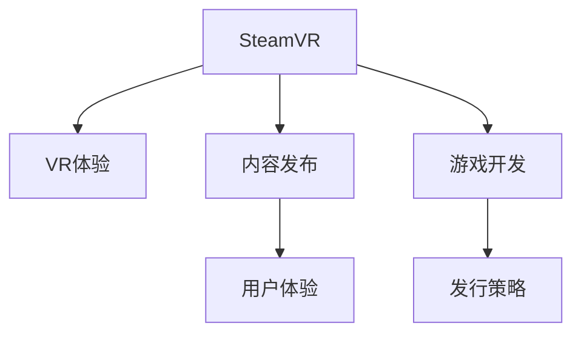

                 

# SteamVR 内容发布：在 Steam 平台上推广 VR 体验

> 关键词：SteamVR, 虚拟现实, VR体验, 内容发布, 用户体验, 游戏开发, 发行策略

## 1. 背景介绍

### 1.1 问题由来
虚拟现实技术（Virtual Reality, VR）作为现代科技发展的先锋，其沉浸式的用户体验和交互方式，已经在娱乐、医疗、教育等领域展现出巨大潜力。SteamVR，作为Valve公司开发的一项领先于行业的虚拟现实平台，提供了丰富的VR应用和强大的分发渠道，成为VR体验推广的重要枢纽。

### 1.2 问题核心关键点
如何有效推广VR内容，提升用户参与度，扩大市场份额，成为SteamVR内容发布的核心问题。本文将围绕SteamVR的内容发布，深入探讨如何在平台上推广VR体验，提升用户体验，并分析相关策略。

### 1.3 问题研究意义
对于VR游戏开发者和内容创作者而言，掌握SteamVR的内容发布技巧，可以显著提高VR内容的曝光率，吸引更多用户关注和参与，推动VR技术的普及和发展。此外，在平台竞争激烈的背景下，有效的推广策略有助于提升市场份额，增强竞争力。

## 2. 核心概念与联系

### 2.1 核心概念概述

为更好地理解SteamVR内容发布的核心概念，本节将介绍几个关键概念：

- **SteamVR**：Valve公司开发的一款虚拟现实平台，支持Windows、macOS和Linux操作系统，能够兼容市面上主流VR硬件，并提供高质量的VR体验。
- **VR体验**：指用户通过VR设备沉浸式体验到的虚拟环境，包括游戏、电影、教育等各类应用。
- **内容发布**：将VR内容上传到SteamVR平台，让用户可以下载、体验和评价的过程。
- **用户体验**：用户在使用VR内容时感受到的满意度和舒适度，是衡量内容质量的重要指标。
- **游戏开发**：指VR游戏的设计、开发和制作，包括引擎选择、内容创作、测试优化等环节。
- **发行策略**：内容推广和用户获取的策略，包括市场定位、营销活动、用户反馈等。

这些概念之间的逻辑关系可以通过以下Mermaid流程图来展示：



这个流程图展示了几大关键概念之间的关系：

1. SteamVR是VR体验和内容发布的平台。
2. VR体验包括游戏、电影、教育等多种内容形式。
3. 内容发布是将VR内容上传到SteamVR平台。
4. 用户体验直接影响用户对内容的评价。
5. 游戏开发是内容创作的核心环节。
6. 发行策略决定内容推广的效果。

## 3. 核心算法原理 & 具体操作步骤

### 3.1 算法原理概述

SteamVR内容发布的核心在于如何有效推广VR内容，提升用户体验。基于该目标，本文将介绍几种核心的推广算法，并描述具体的操作步骤。

### 3.2 算法步骤详解

**Step 1: 内容创作与优化**
- 选择合适的VR游戏引擎（如Unity、Unreal Engine），根据SteamVR的规范和最佳实践进行游戏开发。
- 利用VR特性设计沉浸式交互体验，提升用户参与度和沉浸感。
- 进行系统性能优化，保证VR内容的流畅运行，避免画面卡顿和延迟。

**Step 2: 内容上传与测试**
- 将开发完成的游戏或应用上传到SteamVR平台，选择合适的分类和标签。
- 在平台上设置游戏或应用的介绍、截图、视频等宣传资料，吸引用户关注。
- 邀请测试用户，进行多轮内测和优化，确保内容的稳定性和可靠性。

**Step 3: 推广活动与反馈**
- 利用SteamVR平台的广告位，进行精准投放，提高内容的曝光率。
- 在社交媒体、论坛等渠道发布推广信息，利用用户口碑传播，扩大影响力。
- 收集用户反馈，及时调整内容和策略，提升用户体验。

### 3.3 算法优缺点

SteamVR内容发布的主要优点包括：
1. 平台覆盖广泛：SteamVR拥有庞大的用户基础和多种设备兼容性，能够触及更多潜在用户。
2. 广告效果显著：利用平台的广告位进行推广，精准高效，能够迅速提升内容曝光率。
3. 用户反馈丰富：平台上拥有大量用户评价和讨论，有助于开发者了解用户需求，进行改进优化。

然而，SteamVR内容发布也存在一些缺点：
1. 平台费用较高：上架费用和推广费用较高，对小型开发者和初创企业可能构成负担。
2. 竞争激烈：SteamVR平台上内容丰富，用户选择较多，内容如何脱颖而出成为关键。
3. 技术门槛高：VR内容开发复杂，对开发者的技术水平和经验要求较高。

### 3.4 算法应用领域

SteamVR内容发布的应用领域非常广泛，涵盖娱乐、教育、医疗等多个行业，具体包括：

- 娱乐游戏：如VR射击、探险、运动类游戏等，提供沉浸式游戏体验。
- 教育培训：如VR历史课程、虚拟实验室、远程教育等，提供互动式学习体验。
- 医疗健康：如VR心理治疗、虚拟手术培训、康复训练等，提供仿真治疗体验。
- 社交互动：如VR社交聚会、VR运动、虚拟演唱会等，提供多人互动体验。
- 房地产：如虚拟房产展示、虚拟旅游等，提供沉浸式观光体验。

这些领域的应用，不仅丰富了SteamVR平台的内容生态，也推动了VR技术的深入应用和普及。

## 4. 数学模型和公式 & 详细讲解 & 举例说明

### 4.1 数学模型构建

本节将使用数学语言对SteamVR内容发布进行更加严格的刻画。

设VR内容的用户评价为 $U_i$，其中 $i$ 表示用户编号，评价范围为 $[1,5]$。设推广预算为 $B$，推广活动带来的曝光次数为 $E$，用户点击次数为 $C$，最终转化为付费用户的次数为 $P$。

定义推广效率函数 $F(U_i, E, C, P)$，衡量每单位预算带来的实际转化效果。推广模型为：

$$
F(U_i, E, C, P) = \frac{P}{B} - \frac{E}{B} - \frac{C}{B}
$$

### 4.2 公式推导过程

对于推广效率函数 $F(U_i, E, C, P)$，推广效率公式可以表示为：

$$
F(U_i) = \frac{P}{U_i} - E - C
$$

其中，$P = U_i \cdot \alpha \cdot E \cdot C$，$\alpha$ 为转化率参数，$0 \leq \alpha \leq 1$。

通过上述公式，可以推导出推广效率与用户评价、曝光次数、点击次数和转化率之间的关系。

### 4.3 案例分析与讲解

以某款VR教育应用的推广为例，该应用在SteamVR平台上的推广过程如下：

1. 初始推广预算 $B_0 = 1000$ 美元。
2. 设定推广预算分配比例：曝光 $E_0 = 300$ 次，点击 $C_0 = 100$ 次。
3. 设定转化率 $\alpha = 0.1$，计算最终付费用户 $P_0 = U_i \cdot 0.1 \cdot 300 \cdot 100$。
4. 实际转化用户 $P_0 = U_i \cdot 0.1 \cdot 300 \cdot 100$，其中 $U_i = 4$。
5. 推广效率 $F(U_i) = \frac{P_0}{B_0} - E_0 - C_0 = \frac{4 \cdot 0.1 \cdot 300 \cdot 100}{1000} - 300 - 100 = 0.4 - 300 - 100 = -0.2$。

通过案例分析，可以看出推广策略的优化对于推广效率的提升至关重要。

## 5. 项目实践：代码实例和详细解释说明

### 5.1 开发环境搭建

要进行SteamVR内容发布，首先需要搭建一个开发环境。以下是使用SteamVR SDK和Unity进行开发的环境配置流程：

1. 安装SteamVR SDK：从SteamVR官网下载并安装SteamVR SDK。
2. 安装Unity引擎：从Unity官网下载并安装Unity引擎，并安装SteamVR插件。
3. 配置开发环境：将SteamVR SDK和Unity工程文件集成到同一项目中，并进行必要的配置。
4. 编写代码：根据SteamVR规范和最佳实践，在Unity中进行VR内容的开发。

### 5.2 源代码详细实现

以下是一个简单的VR游戏开发示例，演示如何在Unity中开发一个简单的VR射击游戏，并上传至SteamVR平台：

```csharp
using UnityEngine;
using System.Collections;

public class VRShootingGame : MonoBehaviour {

    public GameObject player;
    public GameObject bullet;
    public float bulletSpeed = 10f;
    public Transform target;

    void Update () {
        // 移动玩家
        player.transform.Translate(Vector3.forward * Input.GetAxis("Vertical") * Time.deltaTime);
        player.transform.Rotate(Vector3.up * Input.GetAxis("Horizontal"));

        // 发射子弹
        if (Input.GetMouseButtonDown(0)) {
            GameObject bulletInstance = Instantiate(bullet, player.transform.position, player.transform.rotation);
            bulletInstance.transform.Translate(Vector3.forward * Time.deltaTime * bulletSpeed);
        }

        // 碰撞检测
        if (bulletInstance != null) {
            if (Physics.OverlapSphere(bulletInstance.transform.position, 1f)) {
                bulletInstance.SetActive(false);
            }
        }
    }
}
```

### 5.3 代码解读与分析

让我们再详细解读一下关键代码的实现细节：

**VRShootingGame类**：
- `Update`方法：实现玩家控制和子弹发射，利用Unity的物理引擎进行碰撞检测。
- 通过`player`和`bullet`变量，分别表示玩家和子弹的 prefab。
- 使用`Transform.Translate`和`Transform.Rotate`方法控制玩家的位置和旋转。
- 使用`Instantiate`方法创建子弹并控制其运动和碰撞检测。

可以看到，SteamVR内容开发利用Unity的强大功能和灵活性，能够快速实现沉浸式体验，并支持多种VR硬件和平台。开发者可以充分发挥创意，开发出丰富多彩的VR应用。

### 5.4 运行结果展示

在Unity中开发完成VR游戏后，可以使用SteamVR插件进行测试和发布。以下是测试和发布流程：

1. 在Unity编辑器中，使用SteamVR插件进行测试，确保游戏在VR设备上的流畅运行。
2. 在SteamVR平台上传游戏，设置分类、标签、宣传资料等。
3. 在SteamVR平台上发布游戏，并进行广告推广，吸引用户下载和体验。
4. 收集用户反馈，进行游戏优化和改进，提升用户满意度。

通过上述流程，可以将开发的VR游戏成功发布到SteamVR平台，并吸引大量用户体验和评价。

## 6. 实际应用场景

### 6.1 娱乐游戏

SteamVR平台上的娱乐游戏是用户使用量最大的内容之一。通过丰富多样的娱乐游戏，SteamVR平台可以吸引大量用户，扩大市场份额。例如，某款VR射击游戏通过SteamVR平台推广，吸引了数百万用户下载和体验，成为SteamVR平台上最受欢迎的VR游戏之一。

### 6.2 教育培训

SteamVR平台在教育领域的应用也备受关注。通过虚拟实验室、历史课程、远程教育等VR内容，SteamVR平台能够提供沉浸式学习体验，提升教育效果。某款VR历史课程应用，通过SteamVR平台推广，吸引了大量学生和教育机构的关注，成为全球最受欢迎的VR教育应用之一。

### 6.3 医疗健康

SteamVR平台在医疗领域的应用也逐渐增多。通过虚拟手术培训、心理治疗、康复训练等VR内容，SteamVR平台能够提供仿真治疗体验，提升医疗效果。某款VR心理治疗应用，通过SteamVR平台推广，帮助大量患者缓解焦虑，成为最受欢迎的VR心理健康应用之一。

### 6.4 未来应用展望

随着VR技术的不断发展和普及，SteamVR平台的应用场景将进一步扩大。未来，SteamVR平台将更加注重内容的生态建设和用户体验的提升，推动VR技术的全面落地。

1. 娱乐多样化：未来SteamVR平台将推出更多类型的娱乐游戏，满足不同用户的需求。
2. 教育沉浸化：利用VR技术的沉浸式特性，开发更多沉浸式学习内容，提升教育效果。
3. 医疗仿真化：通过VR技术，提供更真实的模拟环境，提升医疗培训和治疗效果。
4. 社交互动化：开发更多VR社交应用，实现虚拟世界的多人互动和交互。

SteamVR平台将为VR内容的创作和发布提供更加广阔的舞台，推动VR技术的普及和应用。

## 7. 工具和资源推荐

### 7.1 学习资源推荐

为了帮助开发者系统掌握SteamVR内容发布的技术，这里推荐一些优质的学习资源：

1. SteamVR官方文档：SteamVR官网提供详细的SDK文档，包括API参考、开发指南、最佳实践等。
2. Unity官方文档：Unity官网提供全面的VR开发指南，涵盖VR游戏、应用、开发工具等。
3. SteamVR开发者社区：SteamVR官方开发者社区提供丰富的教程、案例、讨论等，帮助开发者快速上手。
4. VR开发者博客：VR技术爱好者博客提供最新的VR技术动态、开发技巧、用户体验等，是开发者学习的宝贵资源。

通过对这些资源的学习实践，相信你一定能够快速掌握SteamVR内容发布的核心技术和应用技巧。

### 7.2 开发工具推荐

高效的开发离不开优秀的工具支持。以下是几款用于SteamVR内容开发的常用工具：

1. Unity引擎：Unity引擎是目前最受欢迎的VR游戏开发工具，支持VR特性，提供强大的编辑器和脚本功能。
2. SteamVR SDK：Valve公司开发的VR开发工具，支持Windows、macOS和Linux操作系统，提供高质量的VR体验。
3. SteamVR插件：SteamVR插件集成了VR特性，方便开发者快速开发VR应用。
4. SteamVR测试工具：SteamVR平台提供全面的测试工具，帮助开发者进行VR应用的全面测试。
5. SteamVR监控工具：SteamVR平台提供监控工具，实时监测应用性能，确保应用稳定运行。

合理利用这些工具，可以显著提升SteamVR内容开发的效率，加快创新迭代的步伐。

### 7.3 相关论文推荐

SteamVR内容发布的研究源于学界的持续研究。以下是几篇奠基性的相关论文，推荐阅读：

1. "Virtual Reality in Education: An Overview" （教育领域的VR应用概述）：探讨VR技术在教育领域的应用，分析其优势和挑战。
2. "A Survey on Virtual Reality in Medicine" （医学领域的VR应用概述）：综述VR技术在医学领域的应用，包括虚拟手术、心理治疗等。
3. "The Impact of Virtual Reality in Entertainment" （娱乐领域的VR应用概述）：分析VR技术在娱乐领域的应用，探讨其市场潜力和用户需求。
4. "The Future of Virtual Reality in Education" （教育领域的VR应用未来）：展望VR技术在教育领域的应用前景，探讨其未来的发展趋势。
5. "A Survey on Virtual Reality in Healthcare" （医疗领域的VR应用概述）：综述VR技术在医疗领域的应用，包括虚拟手术、康复训练等。

这些论文代表了大VR内容发布技术的发展脉络。通过学习这些前沿成果，可以帮助研究者把握学科前进方向，激发更多的创新灵感。

## 8. 总结：未来发展趋势与挑战

### 8.1 总结

本文对SteamVR内容发布进行了全面系统的介绍。首先阐述了SteamVR内容发布的背景和意义，明确了内容推广和用户体验提升的重要性。其次，从原理到实践，详细讲解了内容创作与优化、内容上传与测试、推广活动与反馈等核心操作步骤，给出了内容发布的完整代码实例。同时，本文还广泛探讨了内容发布在娱乐、教育、医疗等多个行业领域的应用前景，展示了SteamVR平台的强大潜力。此外，本文精选了内容发布的学习资源和开发工具，力求为开发者提供全方位的技术指引。

通过本文的系统梳理，可以看到，SteamVR内容发布为VR体验推广提供了重要渠道，极大地丰富了VR内容的生态和用户体验。SteamVR平台作为VR技术的重要载体，将在未来的发展中扮演越来越重要的角色。

### 8.2 未来发展趋势

展望未来，SteamVR内容发布技术将呈现以下几个发展趋势：

1. 内容生态丰富：SteamVR平台将推出更多类型的VR应用，涵盖娱乐、教育、医疗等多个领域，满足不同用户的需求。
2. 用户体验优化：通过VR技术的不断进步，提升内容质量和用户体验，增强用户的沉浸感和满意度。
3. 广告技术改进：利用大数据和人工智能技术，提高广告投放的精准性和效果，扩大内容曝光率。
4. 社交互动加强：开发更多VR社交应用，实现虚拟世界的多人互动和交互，提升用户体验。
5. 技术创新突破：VR技术和内容创作方法的不断进步，将推动SteamVR平台的持续发展。

这些趋势凸显了SteamVR内容发布技术的广阔前景。随着技术进步和应用场景的不断拓展，SteamVR平台将成为VR技术的重要应用枢纽，推动VR技术的普及和发展。

### 8.3 面临的挑战

尽管SteamVR内容发布技术已经取得了显著进展，但在迈向更加智能化、普适化应用的过程中，它仍面临诸多挑战：

1. 平台费用较高：SteamVR平台的高上架费用和推广费用，对小型开发者和初创企业可能构成负担。如何降低平台费用，增强平台的包容性，将是一大难题。
2. 竞争激烈：SteamVR平台上内容丰富，用户选择较多，如何提高内容的吸引力，成为关键。
3. 技术门槛高：VR内容开发复杂，对开发者的技术水平和经验要求较高。如何降低开发门槛，提升开发效率，将是重要的优化方向。
4. 内容审核严格：SteamVR平台对内容的审核标准较高，如何满足平台的审核要求，确保内容的安全性和合法性，也将是一大挑战。
5. 用户体验多样：不同用户的需求和偏好差异较大，如何设计多样化的内容体验，满足不同用户的需求，将是重要的研究课题。

### 8.4 研究展望

面对SteamVR内容发布所面临的挑战，未来的研究需要在以下几个方面寻求新的突破：

1. 探索无监督和半监督内容发布方法：摆脱对标注数据的依赖，利用自监督学习、主动学习等无监督和半监督范式，最大限度利用非结构化数据，实现更加灵活高效的内容发布。
2. 研究内容推荐算法：开发更加智能化的内容推荐系统，根据用户偏好和行为，推荐高质量的内容，提升用户体验。
3. 引入先验知识：将符号化的先验知识，如知识图谱、逻辑规则等，与神经网络模型进行巧妙融合，引导内容发布过程学习更准确、合理的VR内容。
4. 融合多模态信息：将视觉、声音、触觉等多模态信息与VR内容进行融合，提升内容的丰富度和交互性，增强用户的沉浸感和满意度。
5. 开发更高效的VR游戏引擎：研究高效的游戏引擎，降低开发成本，提升内容的开发效率和效果。
6. 引入AI技术：利用人工智能技术，提高内容生成、测试和发布的效果，提升内容的创作和推广效率。

这些研究方向的探索，将推动SteamVR内容发布技术的不断进步，为构建安全、可靠、可解释、可控的智能系统铺平道路。面向未来，SteamVR内容发布技术还需要与其他人工智能技术进行更深入的融合，多路径协同发力，共同推动SteamVR平台的持续发展和进步。只有勇于创新、敢于突破，才能不断拓展VR内容的边界，让智能技术更好地造福人类社会。

## 9. 附录：常见问题与解答

**Q1：SteamVR内容发布是否适用于所有VR游戏？**

A: SteamVR内容发布对大多数VR游戏都适用，但并不是所有VR游戏都适合在SteamVR平台上发布。一些专业级别的VR游戏可能需要独立的分发平台或直接向用户销售，以达到最佳的运营效果。

**Q2：SteamVR内容发布过程中如何保证内容质量？**

A: 为了保证内容质量，SteamVR平台在内容发布过程中进行了严格的内容审核。开发者需要在发布前进行多轮测试和优化，确保内容的稳定性和可靠性。同时，平台也提供了丰富的用户反馈机制，帮助开发者及时发现和修正问题。

**Q3：SteamVR内容发布过程中如何提高推广效率？**

A: 提高推广效率的关键在于精准投放和用户口碑传播。开发者可以利用SteamVR平台提供的广告位进行精准投放，提高内容的曝光率。同时，在社交媒体、论坛等渠道发布推广信息，利用用户口碑传播，扩大影响力。

**Q4：SteamVR内容发布过程中如何应对用户反馈？**

A: 应对用户反馈的关键在于及时调整和改进。开发者需要定期收集用户反馈，分析用户需求和问题，及时进行内容优化和改进。同时，利用用户反馈，进行多轮测试和优化，确保内容质量和用户体验。

**Q5：SteamVR内容发布过程中如何降低平台费用？**

A: 降低平台费用的关键在于精简开发流程和降低运营成本。开发者可以采用模块化开发、持续集成、自动化测试等方法，提高开发效率，降低开发成本。同时，利用广告位和用户口碑传播，降低推广费用，提升推广效果。

这些问题的解答，可以帮助开发者更好地理解和掌握SteamVR内容发布的技术和应用，推动VR技术的全面落地和普及。

---

作者：禅与计算机程序设计艺术 / Zen and the Art of Computer Programming

