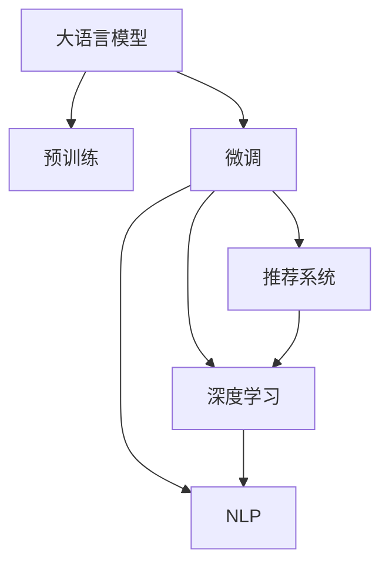

                 

# Survey：大语言模型推荐系统相关研究综述

> 关键词：大语言模型,推荐系统,深度学习,自然语言处理,NLP,Recommender System,协同过滤,神经网络,序列推荐,混合推荐,强化学习,多模态推荐,Reinforcement Learning,深度学习模型,优化算法

## 1. 背景介绍

### 1.1 问题由来
推荐系统作为数字时代核心的技术之一，广泛应用在电商、视频、音乐、社交网络等领域，帮助用户发现感兴趣的内容，提升用户体验，实现商业价值。推荐系统的核心思想是通过分析用户历史行为数据，挖掘用户兴趣模式，预测用户可能感兴趣的内容，并推荐给用户。传统推荐系统基于协同过滤、基于内容的推荐、混合推荐等方法，取得了不错的效果。然而，随着用户兴趣变化无常、数据稀疏性等问题逐渐凸显，推荐系统面临诸多挑战。

大语言模型的兴起，为推荐系统提供了一种全新的思路。大语言模型如BERT、GPT、XLNet等，通过自监督学习方式在大量无标签文本数据上预训练，获取了丰富的语言知识和表征能力，通过微调可针对具体任务进行优化，具备强大的文本处理和生成能力。近年来，利用大语言模型改进推荐系统，成为学术界和产业界的热点研究课题。

### 1.2 问题核心关键点
当前，大语言模型在推荐系统中的应用，主要集中在两个方面：

- 基于语言模型的用户兴趣表示。通过大语言模型预训练与微调，可以学习到更全面、准确的兴趣表征，改进用户兴趣建模。
- 基于语言模型的推荐策略优化。通过语言模型对推荐策略进行优化，可以获得更符合用户个性化需求的推荐结果。

本研究综述将系统总结大语言模型在推荐系统中的主要研究进展，分析其原理、方法、算法和应用效果，展望未来发展方向和面临的挑战。

## 2. 核心概念与联系

### 2.1 核心概念概述

为更好地理解大语言模型在推荐系统中的应用，本节将介绍几个关键概念：

- 大语言模型(Large Language Model, LLM)：以自回归(如GPT)或自编码(如BERT)模型为代表的大规模预训练语言模型。通过在大规模无标签文本语料上进行预训练，学习通用的语言表示，具备强大的语言理解和生成能力。

- 推荐系统(Recommender System)：通过分析用户历史行为数据，预测用户可能感兴趣的内容，并推荐给用户的系统。推荐系统分为基于协同过滤的推荐、基于内容的推荐、混合推荐等。

- 预训练(Pre-training)：指在大规模无标签文本语料上，通过自监督学习任务训练通用语言模型的过程。常见的预训练任务包括言语建模、遮挡语言模型等。预训练使得模型学习到语言的通用表示。

- 微调(Fine-tuning)：指在预训练模型的基础上，使用下游任务的少量标注数据，通过有监督地训练来优化模型在特定任务上的性能。通常只需要调整顶层分类器或解码器，并以较小的学习率更新全部或部分的模型参数。

- 深度学习(Deep Learning)：一种基于神经网络的机器学习方法，通过多个层级的神经网络结构实现对输入数据的复杂映射，广泛应用于图像、语音、自然语言处理等领域。

- 自然语言处理(Natural Language Processing, NLP)：研究计算机如何理解、处理和生成人类语言的技术，如文本分类、命名实体识别、情感分析、机器翻译等。

这些核心概念之间的逻辑关系可以通过以下Mermaid流程图来展示：



这个流程图展示了大语言模型在推荐系统中的核心概念及其之间的关系：

1. 大语言模型通过预训练获得基础能力。
2. 微调是对预训练模型进行任务特定的优化，可以针对特定任务进行微调。
3. 推荐系统将微调后的模型应用于用户推荐，从而提高推荐准确度。
4. 深度学习和NLP技术为微调和推荐提供了丰富的算法和模型。

这些概念共同构成了大语言模型在推荐系统中的应用框架，使其能够更好地适应和优化推荐任务。

## 3. 核心算法原理 & 具体操作步骤
### 3.1 算法原理概述

基于大语言模型推荐系统，本质上是一种深度学习与自然语言处理技术的结合。其核心思想是：通过大语言模型的预训练和微调，学习用户兴趣和内容特征的表示，构建推荐模型，实现个性化推荐。

形式化地，假设大语言模型为 $M_{\theta}$，其中 $\theta$ 为预训练得到的模型参数。给定推荐系统中的用户 $u$ 和物品 $i$，推荐任务 $T$ 的推荐目标为：

$$
\max_{\theta} \text{Prob}(T(u,i))
$$

即最大化用户 $u$ 对物品 $i$ 的评分概率。推荐系统使用用户兴趣表示 $\text{Enc}(u)$ 和物品特征表示 $\text{Enc}(i)$，通过语言模型 $\text{L}(\cdot)$ 计算预测评分，即：

$$
\text{Score}(u,i) = \text{L}(\text{Enc}(u), \text{Enc}(i))
$$

根据评分排序，选择推荐给用户 $u$ 的物品 $i$。

### 3.2 算法步骤详解

基于大语言模型推荐系统的一般步骤如下：

**Step 1: 准备预训练模型和数据集**
- 选择合适的预训练语言模型 $M_{\theta}$ 作为初始化参数，如 BERT、GPT 等。
- 准备推荐系统中的用户行为数据集 $D=\{(u_i,v_i)\}_{i=1}^N$，其中 $u_i$ 表示用户，$v_i$ 表示物品评分。

**Step 2: 设计用户兴趣表示和物品特征表示**
- 对用户 $u$ 和物品 $i$ 分别进行预处理，将文本数据转换为模型所需的格式。
- 使用大语言模型进行预训练和微调，得到用户兴趣表示 $\text{Enc}(u)$ 和物品特征表示 $\text{Enc}(i)$。

**Step 3: 构建推荐模型**
- 将用户兴趣表示 $\text{Enc}(u)$ 和物品特征表示 $\text{Enc}(i)$ 输入语言模型 $\text{L}(\cdot)$，计算预测评分 $\text{Score}(u,i)$。
- 设计推荐策略，如基于评分排序、基于分布式表示等，将评分排序后选择推荐给用户 $u$ 的物品 $i$。

**Step 4: 训练优化**
- 通过用户行为数据集 $D$ 对推荐模型进行有监督学习，最小化预测评分与真实评分之间的差异。
- 选择合适的优化算法和超参数，如 AdamW、SGD 等，设置学习率、批大小、迭代轮数等。

**Step 5: 评估与部署**
- 在测试集上评估推荐模型的性能，如准确率、召回率、F1值等。
- 使用微调后的模型对新用户和新物品进行推荐，集成到实际推荐系统中。
- 持续收集新的用户行为数据，定期重新微调模型，以适应数据分布的变化。

### 3.3 算法优缺点

基于大语言模型推荐系统具有以下优点：
1. 用户兴趣建模更全面。通过大语言模型的预训练和微调，可以学习到更加全面、深入的用户兴趣表示。
2. 推荐策略更灵活。语言模型具有强大的文本处理能力，可以设计更灵活的推荐策略。
3. 适应新任务能力强。大语言模型能够快速适应新的用户和物品，无需重新从头训练模型。
4. 易于迭代优化。微调过程可快速迭代，不断优化推荐效果。

同时，该方法也存在一定的局限性：
1. 对标注数据依赖较大。推荐系统的效果很大程度上取决于用户行为数据的质量和数量。
2. 训练成本较高。大语言模型需要在大规模无标签文本数据上进行预训练，消耗大量计算资源。
3. 泛化能力有限。当推荐系统面临新的用户或物品时，模型的泛化性能可能不足。
4. 模型复杂度高。大语言模型的参数量较大，推理效率较低，影响实时性。

尽管存在这些局限性，但就目前而言，基于大语言模型的推荐系统仍然是一种有效的推荐方法。未来相关研究的重点在于如何进一步降低对标注数据的依赖，提高推荐模型的泛化能力，同时兼顾实时性和可解释性等因素。

### 3.4 算法应用领域

基于大语言模型推荐系统的方法，在推荐系统中得到了广泛的应用，覆盖了以下领域：

- 电商推荐：如淘宝、京东等电商平台，推荐商品给用户，提升转化率。
- 视频推荐：如YouTube、Netflix等视频平台，推荐视频给用户，提高用户黏性。
- 音乐推荐：如Spotify、QQ音乐等音乐平台，推荐歌曲给用户，增加用户停留时间。
- 新闻推荐：如今日头条、腾讯新闻等新闻平台，推荐新闻给用户，提升阅读体验。

除了这些经典应用外，大语言模型推荐系统也被创新性地应用于更多场景中，如智能客服、个性化广告、游戏推荐、智能家居等，为推荐系统带来了新的突破。随着预训练语言模型和推荐技术的不断进步，相信推荐系统将在更广阔的应用领域大放异彩。

## 4. 数学模型和公式 & 详细讲解  
### 4.1 数学模型构建

本节将使用数学语言对基于大语言模型的推荐系统进行更加严格的刻画。

记预训练语言模型为 $M_{\theta}$，其中 $\theta$ 为预训练得到的模型参数。假设推荐系统中的用户为 $u$，物品为 $i$，推荐任务为 $T$，用户行为数据集为 $D=\{(u_i,v_i)\}_{i=1}^N$。

定义用户 $u$ 的兴趣表示为 $\text{Enc}(u)$，物品 $i$ 的特征表示为 $\text{Enc}(i)$，推荐任务 $T(u,i)$ 的预测评分 $\text{Score}(u,i)$ 为：

$$
\text{Score}(u,i) = \text{L}(\text{Enc}(u), \text{Enc}(i))
$$

其中 $\text{L}(\cdot)$ 为语言模型，$\text{Enc}(\cdot)$ 为用户兴趣表示和物品特征表示的编码函数。

推荐系统的目标是最小化预测评分与真实评分之间的差异，即：

$$
\min_{\theta} \mathcal{L}(\theta) = \frac{1}{N}\sum_{i=1}^N (v_i - \text{Score}(u_i, i))^2
$$

在实践中，我们通常使用基于梯度的优化算法（如AdamW、SGD等）来近似求解上述最优化问题。设 $\eta$ 为学习率，$\lambda$ 为正则化系数，则参数的更新公式为：

$$
\theta \leftarrow \theta - \eta \nabla_{\theta}\mathcal{L}(\theta) - \eta\lambda\theta
$$

其中 $\nabla_{\theta}\mathcal{L}(\theta)$ 为损失函数对参数 $\theta$ 的梯度，可通过反向传播算法高效计算。

### 4.2 公式推导过程

以下我们以二分类任务为例，推导交叉熵损失函数及其梯度的计算公式。

假设推荐系统中的任务为二分类任务，用户 $u$ 对物品 $i$ 的评分 $v_i$ 为 1 表示喜欢，为 0 表示不喜欢。

定义用户 $u$ 的兴趣表示为 $\text{Enc}(u)$，物品 $i$ 的特征表示为 $\text{Enc}(i)$，推荐任务 $T(u,i)$ 的预测评分 $\text{Score}(u,i)$ 为：

$$
\text{Score}(u,i) = \text{L}(\text{Enc}(u), \text{Enc}(i))
$$

推荐系统的目标是最小化预测评分与真实评分之间的差异，即：

$$
\min_{\theta} \mathcal{L}(\theta) = \frac{1}{N}\sum_{i=1}^N (v_i - \text{Score}(u_i, i))^2
$$

根据链式法则，损失函数对参数 $\theta_k$ 的梯度为：

$$
\frac{\partial \mathcal{L}(\theta)}{\partial \theta_k} = -\frac{2}{N}\sum_{i=1}^N (\text{Score}(u_i, i) - v_i) \frac{\partial \text{Score}(u_i, i)}{\partial \theta_k}
$$

其中 $\frac{\partial \text{Score}(u_i, i)}{\partial \theta_k}$ 可进一步递归展开，利用自动微分技术完成计算。

在得到损失函数的梯度后，即可带入参数更新公式，完成模型的迭代优化。重复上述过程直至收敛，最终得到适应推荐任务的最优模型参数 $\theta^*$。

## 5. 项目实践：代码实例和详细解释说明
### 5.1 开发环境搭建

在进行推荐系统微调实践前，我们需要准备好开发环境。以下是使用Python进行PyTorch开发的环境配置流程：

1. 安装Anaconda：从官网下载并安装Anaconda，用于创建独立的Python环境。

2. 创建并激活虚拟环境：
```bash
conda create -n pytorch-env python=3.8 
conda activate pytorch-env
```

3. 安装PyTorch：根据CUDA版本，从官网获取对应的安装命令。例如：
```bash
conda install pytorch torchvision torchaudio cudatoolkit=11.1 -c pytorch -c conda-forge
```

4. 安装Transformers库：
```bash
pip install transformers
```

5. 安装各类工具包：
```bash
pip install numpy pandas scikit-learn matplotlib tqdm jupyter notebook ipython
```

完成上述步骤后，即可在`pytorch-env`环境中开始推荐系统微调实践。

### 5.2 源代码详细实现

这里我们以BERT模型为例，给出使用Transformers库对推荐系统进行微调的PyTorch代码实现。

首先，定义推荐系统数据处理函数：

```python
from transformers import BertTokenizer
from torch.utils.data import Dataset
import torch

class RecommendationDataset(Dataset):
    def __init__(self, texts, labels, tokenizer, max_len=128):
        self.texts = texts
        self.labels = labels
        self.tokenizer = tokenizer
        self.max_len = max_len
        
    def __len__(self):
        return len(self.texts)
    
    def __getitem__(self, item):
        text = self.texts[item]
        label = self.labels[item]
        
        encoding = self.tokenizer(text, return_tensors='pt', max_length=self.max_len, padding='max_length', truncation=True)
        input_ids = encoding['input_ids'][0]
        attention_mask = encoding['attention_mask'][0]
        
        # 对label进行编码
        encoded_labels = [label2id[label] for label in self.labels] 
        encoded_labels.extend([label2id['None']] * (self.max_len - len(encoded_labels)))
        labels = torch.tensor(encoded_labels, dtype=torch.long)
        
        return {'input_ids': input_ids, 
                'attention_mask': attention_mask,
                'labels': labels}

# 标签与id的映射
label2id = {'1': 1, '0': 0}
id2label = {v: k for k, v in label2id.items()}

# 创建dataset
tokenizer = BertTokenizer.from_pretrained('bert-base-cased')

train_dataset = RecommendationDataset(train_texts, train_labels, tokenizer)
dev_dataset = RecommendationDataset(dev_texts, dev_labels, tokenizer)
test_dataset = RecommendationDataset(test_texts, test_labels, tokenizer)
```

然后，定义模型和优化器：

```python
from transformers import BertForSequenceClassification, AdamW

model = BertForSequenceClassification.from_pretrained('bert-base-cased', num_labels=len(label2id))

optimizer = AdamW(model.parameters(), lr=2e-5)
```

接着，定义训练和评估函数：

```python
from torch.utils.data import DataLoader
from tqdm import tqdm
from sklearn.metrics import classification_report

device = torch.device('cuda') if torch.cuda.is_available() else torch.device('cpu')
model.to(device)

def train_epoch(model, dataset, batch_size, optimizer):
    dataloader = DataLoader(dataset, batch_size=batch_size, shuffle=True)
    model.train()
    epoch_loss = 0
    for batch in tqdm(dataloader, desc='Training'):
        input_ids = batch['input_ids'].to(device)
        attention_mask = batch['attention_mask'].to(device)
        labels = batch['labels'].to(device)
        model.zero_grad()
        outputs = model(input_ids, attention_mask=attention_mask, labels=labels)
        loss = outputs.loss
        epoch_loss += loss.item()
        loss.backward()
        optimizer.step()
    return epoch_loss / len(dataloader)

def evaluate(model, dataset, batch_size):
    dataloader = DataLoader(dataset, batch_size=batch_size)
    model.eval()
    preds, labels = [], []
    with torch.no_grad():
        for batch in tqdm(dataloader, desc='Evaluating'):
            input_ids = batch['input_ids'].to(device)
            attention_mask = batch['attention_mask'].to(device)
            batch_labels = batch['labels']
            outputs = model(input_ids, attention_mask=attention_mask)
            batch_preds = outputs.logits.argmax(dim=2).to('cpu').tolist()
            batch_labels = batch_labels.to('cpu').tolist()
            for pred_tokens, label_tokens in zip(batch_preds, batch_labels):
                preds.append(pred_tokens[:len(label_tokens)])
                labels.append(label_tokens)
                
    print(classification_report(labels, preds))
```

最后，启动训练流程并在测试集上评估：

```python
epochs = 5
batch_size = 16

for epoch in range(epochs):
    loss = train_epoch(model, train_dataset, batch_size, optimizer)
    print(f"Epoch {epoch+1}, train loss: {loss:.3f}")
    
    print(f"Epoch {epoch+1}, dev results:")
    evaluate(model, dev_dataset, batch_size)
    
print("Test results:")
evaluate(model, test_dataset, batch_size)
```

以上就是使用PyTorch对BERT进行推荐系统微调的完整代码实现。可以看到，得益于Transformers库的强大封装，我们可以用相对简洁的代码完成BERT模型的加载和微调。

### 5.3 代码解读与分析

让我们再详细解读一下关键代码的实现细节：

**RecommendationDataset类**：
- `__init__`方法：初始化文本、标签、分词器等关键组件。
- `__len__`方法：返回数据集的样本数量。
- `__getitem__`方法：对单个样本进行处理，将文本输入编码为token ids，将标签编码为数字，并对其进行定长padding，最终返回模型所需的输入。

**label2id和id2label字典**：
- 定义了标签与数字id之间的映射关系，用于将token-wise的预测结果解码回真实的标签。

**训练和评估函数**：
- 使用PyTorch的DataLoader对数据集进行批次化加载，供模型训练和推理使用。
- 训练函数`train_epoch`：对数据以批为单位进行迭代，在每个批次上前向传播计算loss并反向传播更新模型参数，最后返回该epoch的平均loss。
- 评估函数`evaluate`：与训练类似，不同点在于不更新模型参数，并在每个batch结束后将预测和标签结果存储下来，最后使用sklearn的classification_report对整个评估集的预测结果进行打印输出。

**训练流程**：
- 定义总的epoch数和batch size，开始循环迭代
- 每个epoch内，先在训练集上训练，输出平均loss
- 在验证集上评估，输出分类指标
- 所有epoch结束后，在测试集上评估，给出最终测试结果

可以看到，PyTorch配合Transformers库使得BERT微调的代码实现变得简洁高效。开发者可以将更多精力放在数据处理、模型改进等高层逻辑上，而不必过多关注底层的实现细节。

当然，工业级的系统实现还需考虑更多因素，如模型的保存和部署、超参数的自动搜索、更灵活的任务适配层等。但核心的微调范式基本与此类似。

## 6. 实际应用场景
### 6.1 电商推荐

基于大语言模型的推荐系统，可以广泛应用于电商推荐系统的构建。传统的电商推荐系统基于用户的浏览记录、购买记录等数据，使用协同过滤、基于内容的推荐等方法，推荐用户可能感兴趣的商品。然而，随着电商平台的商品种类繁多，用户兴趣变化复杂，传统的推荐方法难以满足个性化需求。

通过大语言模型的微调，电商推荐系统可以学习到更加全面、深入的用户兴趣表示，结合商品特征表示，设计更灵活的推荐策略。例如，利用用户评论、商品描述等文本信息，进行情感分析和文本分类，将用户对商品的情感倾向作为兴趣权重，提升推荐效果。在商品推荐时，不仅考虑用户的历史行为数据，还结合商品的热销度、价格等信息，进行多维度综合推荐。

### 6.2 视频推荐

视频推荐系统同样面临数据稀疏性等问题，用户对视频的评分数据往往较少，难以直接用于推荐。通过大语言模型的微调，可以学习到用户对视频的综合评分，结合视频标签、时长、热度等信息，设计多维度综合推荐策略。例如，对于用户的每个视频评分，先使用大语言模型进行情感分析，将评分转化为情感倾向度，再结合视频的热门程度，进行排序推荐。同时，结合用户评论等文本信息，进行情感分析，提升推荐准确度。

### 6.3 音乐推荐

音乐推荐系统通常基于用户的听歌记录、评分记录等数据，使用协同过滤、基于内容的推荐等方法，推荐用户可能喜欢的歌曲。然而，随着音乐种类繁多，用户兴趣变化无常，传统的推荐方法难以满足个性化需求。

通过大语言模型的微调，音乐推荐系统可以学习到更加全面、深入的用户兴趣表示，结合歌曲特征表示，设计更灵活的推荐策略。例如，利用用户评论、歌词等信息，进行情感分析和文本分类，将用户对歌曲的情感倾向作为兴趣权重，提升推荐效果。在歌曲推荐时，不仅考虑用户的历史行为数据，还结合歌曲的流行度、时长等信息，进行多维度综合推荐。

### 6.4 游戏推荐

游戏推荐系统通常基于用户的游戏记录、评分记录等数据，使用协同过滤、基于内容的推荐等方法，推荐用户可能喜欢的游戏。然而，随着游戏种类繁多，用户兴趣变化无常，传统的推荐方法难以满足个性化需求。

通过大语言模型的微调，游戏推荐系统可以学习到更加全面、深入的用户兴趣表示，结合游戏特征表示，设计更灵活的推荐策略。例如，利用用户评论、游戏玩法等信息，进行情感分析和文本分类，将用户对游戏的情感倾向作为兴趣权重，提升推荐效果。在游戏推荐时，不仅考虑用户的历史行为数据，还结合游戏的评价、用户反馈等信息，进行多维度综合推荐。

### 6.5 智能家居推荐

智能家居推荐系统通常基于用户的家居设备使用记录、评分记录等数据，使用协同过滤、基于内容的推荐等方法，推荐用户可能喜欢的家居设备。然而，随着家居设备种类繁多，用户兴趣变化无常，传统的推荐方法难以满足个性化需求。

通过大语言模型的微调，智能家居推荐系统可以学习到更加全面、深入的用户兴趣表示，结合家居设备特征表示，设计更灵活的推荐策略。例如，利用用户评论、设备参数等信息，进行情感分析和文本分类，将用户对设备的情感倾向作为兴趣权重，提升推荐效果。在设备推荐时，不仅考虑用户的历史行为数据，还结合设备的评价、用户反馈等信息，进行多维度综合推荐。

### 6.6 未来应用展望

随着大语言模型推荐系统的不断发展，未来的推荐系统将在更多领域得到应用，为电商、视频、音乐、游戏、家居等多个行业带来变革性影响。

在智慧医疗领域，基于大语言模型的推荐系统可以用于推荐医生、医院、药品等医疗资源，提升医疗服务的可及性和质量。在智慧教育领域，推荐系统可以推荐合适的课程、学习资料，帮助学生个性化学习，提升教育效果。

在智能交通领域，推荐系统可以推荐最佳的出行路线、交通工具，提升出行效率和安全性。在智能城市治理中，推荐系统可以推荐最佳的城市规划方案、公共服务项目，提升城市管理的智能化水平，构建更宜居的智慧城市。

此外，在企业生产、社会治理、文娱传媒等众多领域，基于大语言模型的推荐系统也将不断涌现，为经济社会发展注入新的动力。相信随着技术的日益成熟，推荐系统必将在更广阔的应用领域大放异彩，深刻影响人类的生产生活方式。

## 7. 工具和资源推荐
### 7.1 学习资源推荐

为了帮助开发者系统掌握大语言模型推荐系统的方法，这里推荐一些优质的学习资源：

1. 《深度学习基础》系列博文：由大模型技术专家撰写，深入浅出地介绍了深度学习的基础概念和经典模型，适合初学者入门。

2. 《推荐系统原理与实践》课程：清华大学开设的推荐系统课程，涵盖推荐系统的基础原理和算法实现，适合进阶学习。

3. 《深度学习在推荐系统中的应用》书籍：系统介绍了深度学习在推荐系统中的应用，包括基于深度学习的协同过滤、基于深度学习的混合推荐等。

4. 《Recommender Systems》书籍：经典推荐系统教材，涵盖推荐系统的基础理论、算法实现、应用场景等，适合系统学习和研究。

5. 《推荐系统实战》书籍：KDD奖得主所著，介绍了推荐系统在电商、视频、社交网络等领域的实际应用案例，适合工程实践。

通过对这些资源的学习实践，相信你一定能够快速掌握大语言模型推荐系统的精髓，并用于解决实际的推荐问题。
###  7.2 开发工具推荐

高效的开发离不开优秀的工具支持。以下是几款用于大语言模型推荐系统开发的常用工具：

1. PyTorch：基于Python的开源深度学习框架，灵活动态的计算图，适合快速迭代研究。大部分预训练语言模型都有PyTorch版本的实现。

2. TensorFlow：由Google主导开发的开源深度学习框架，生产部署方便，适合大规模工程应用。同样有丰富的预训练语言模型资源。

3. Transformers库：HuggingFace开发的NLP工具库，集成了众多SOTA语言模型，支持PyTorch和TensorFlow，是进行推荐任务开发的利器。

4. Weights & Biases：模型训练的实验跟踪工具，可以记录和可视化模型训练过程中的各项指标，方便对比和调优。与主流深度学习框架无缝集成。

5. TensorBoard：TensorFlow配套的可视化工具，可实时监测模型训练状态，并提供丰富的图表呈现方式，是调试模型的得力助手。

6. Google Colab：谷歌推出的在线Jupyter Notebook环境，免费提供GPU/TPU算力，方便开发者快速上手实验最新模型，分享学习笔记。

合理利用这些工具，可以显著提升大语言模型推荐系统的开发效率，加快创新迭代的步伐。

### 7.3 相关论文推荐

大语言模型推荐系统的发展源于学界的持续研究。以下是几篇奠基性的相关论文，推荐阅读：

1. Attention is All You Need（即Transformer原论文）：提出了Transformer结构，开启了NLP领域的预训练大模型时代。

2. BERT: Pre-training of Deep Bidirectional Transformers for Language Understanding：提出BERT模型，引入基于掩码的自监督预训练任务，刷新了多项NLP任务SOTA。

3. Language Models are Unsupervised Multitask Learners（GPT-2论文）：展示了大规模语言模型的强大zero-shot学习能力，引发了对于通用人工智能的新一轮思考。

4. Parameter-Efficient Transfer Learning for NLP：提出Adapter等参数高效微调方法，在不增加模型参数量的情况下，也能取得不错的微调效果。

5. Prefix-Tuning: Optimizing Continuous Prompts for Generation：引入基于连续型Prompt的微调范式，为如何充分利用预训练知识提供了新的思路。

6. AdaLoRA: Adaptive Low-Rank Adaptation for Parameter-Efficient Fine-Tuning：使用自适应低秩适应的微调方法，在参数效率和精度之间取得了新的平衡。

这些论文代表了大语言模型推荐系统的发展脉络。通过学习这些前沿成果，可以帮助研究者把握学科前进方向，激发更多的创新灵感。

## 8. 总结：未来发展趋势与挑战

### 8.1 总结

本文对基于大语言模型的推荐系统进行了全面系统的介绍。首先阐述了推荐系统的背景和意义，明确了大语言模型推荐系统的研究目标和应用价值。其次，从原理到实践，详细讲解了大语言模型推荐系统的数学原理和关键步骤，给出了推荐系统微调的完整代码实例。同时，本文还广泛探讨了大语言模型在推荐系统中的应用场景，展示了其在电商、视频、音乐、游戏、智能家居等多个领域的创新应用。

通过本文的系统梳理，可以看到，基于大语言模型的推荐系统正在成为推荐领域的重要范式，极大地拓展了推荐系统的应用边界，催生了更多的落地场景。受益于大语言模型和大规模预训练技术，推荐系统将在更广阔的应用领域大放异彩，深刻影响人类的生产生活方式。

### 8.2 未来发展趋势

展望未来，大语言模型推荐系统将呈现以下几个发展趋势：

1. 推荐模型更加通用。通过大语言模型的预训练和微调，推荐模型可以学习到更加全面、深入的用户兴趣表示，设计更加灵活的推荐策略。

2. 推荐算法更加多样。除了传统的基于深度学习的推荐方法外，未来会涌现更多基于图神经网络、强化学习等新算法的推荐方法。

3. 推荐模型更加高效。通过参数高效微调、深度模型压缩等技术，推荐系统可以进一步提高推理效率，实现更高效的推荐。

4. 推荐系统更加普适。推荐系统可以应用到更多新领域，如医疗、法律、智能交通等，实现更广泛的落地应用。

5. 推荐系统更加个性化。通过结合多模态数据、因果推理等技术，推荐系统可以更加精准地预测用户兴趣，实现更个性化的推荐。

6. 推荐系统更加透明。推荐系统的决策过程需要更加可解释、可审计，避免“黑箱”系统带来的信任问题。

7. 推荐系统更加安全。推荐系统需要保护用户隐私，避免数据泄露和模型滥用，确保系统的安全性。

以上趋势凸显了大语言模型推荐系统的广阔前景。这些方向的探索发展，必将进一步提升推荐系统的性能和应用范围，为经济社会发展注入新的动力。

### 8.3 面临的挑战

尽管大语言模型推荐系统已经取得了瞩目成就，但在迈向更加智能化、普适化应用的过程中，它仍面临诸多挑战：

1. 用户隐私保护。推荐系统需要处理大量用户数据，如何保护用户隐私成为关键问题。

2. 模型鲁棒性不足。当推荐系统面临新的用户或物品时，模型的泛化性能可能不足。

3. 训练成本较高。大语言模型需要在大规模无标签文本数据上进行预训练，消耗大量计算资源。

4. 模型复杂度高。大语言模型的参数量较大，推理效率较低，影响实时性。

尽管存在这些局限性，但就目前而言，基于大语言模型的推荐系统仍然是一种有效的推荐方法。未来相关研究的重点在于如何进一步降低对标注数据的依赖，提高推荐模型的泛化能力，同时兼顾实时性和可解释性等因素。

### 8.4 研究展望

面对大语言模型推荐系统所面临的种种挑战，未来的研究需要在以下几个方面寻求新的突破：

1. 探索无监督和半监督推荐方法。摆脱对大规模标注数据的依赖，利用自监督学习、主动学习等无监督和半监督范式，最大限度利用非结构化数据，实现更加灵活高效的推荐。

2. 研究参数高效和计算高效的推荐范式。开发更加参数高效的推荐方法，在固定大部分预训练参数的同时，只更新极少量的任务相关参数。同时优化推荐模型的计算图，减少前向传播和反向传播的资源消耗，实现更加轻量级、实时性的部署。

3. 融合因果和对比学习范式。通过引入因果推断和对比学习思想，增强推荐模型建立稳定因果关系的能力，学习更加普适、鲁棒的用户和物品特征表示。

4. 引入更多先验知识。将符号化的先验知识，如知识图谱、逻辑规则等，与神经网络模型进行巧妙融合，引导推荐过程学习更准确、合理的用户和物品特征表示。

5. 结合因果分析和博弈论工具。将因果分析方法引入推荐系统，识别出推荐过程的关键特征，增强推荐系统的稳定性和可解释性。借助博弈论工具刻画人机交互过程，主动探索并规避推荐系统的脆弱点，提高系统稳定性。

6. 纳入伦理道德约束。在推荐系统训练目标中引入伦理导向的评估指标，过滤和惩罚有偏见、有害的推荐结果，确保系统的公正性和安全性。

这些研究方向的探索，必将引领大语言模型推荐系统技术迈向更高的台阶，为构建安全、可靠、可解释、可控的推荐系统铺平道路。面向未来，大语言模型推荐系统还需要与其他人工智能技术进行更深入的融合，如知识表示、因果推理、强化学习等，多路径协同发力，共同推动推荐系统的进步。只有勇于创新、敢于突破，才能不断拓展推荐系统的边界，让智能技术更好地造福人类社会。

## 9. 附录：常见问题与解答

**Q1：大语言模型推荐系统是否适用于所有推荐任务？**

A: 大语言模型推荐系统在大多数推荐任务上都能取得不错的效果，特别是对于数据量较小的任务。但对于一些特定领域的任务，如医学、法律等，仅仅依靠通用语料预训练的模型可能难以很好地适应。此时需要在特定领域语料上进一步预训练，再进行微调，才能获得理想效果。

**Q2：推荐系统使用大语言模型是否需要大量标注数据？**

A: 推荐系统使用大语言模型进行微调时，通常需要用户的行为数据作为监督信号，但并不需要大量标注数据。推荐系统可以利用用户的历史行为数据进行监督训练，学习用户的兴趣表示。如果推荐系统是基于少样本学习的方法，可以进一步降低对标注数据的依赖。

**Q3：大语言模型推荐系统的训练成本如何？**

A: 大语言模型推荐系统的训练成本较高，需要在大规模无标签文本数据上进行预训练，消耗大量计算资源。但在大规模数据上预训练的模型可以学习到更加全面、深入的语义表示，后续微调时所需的标注数据较少，训练效率更高。

**Q4：大语言模型推荐系统的推理效率如何？**

A: 大语言模型推荐系统的推理效率较低，尤其是在大规模模型上。为了提高推理效率，可以采用参数高效微调、深度模型压缩、混合精度训练等技术，减少推理时间和内存消耗。

**Q5：推荐系统如何避免过拟合？**

A: 推荐系统通常使用正则化技术（如L2正则、Dropout、Early Stopping等）来避免过拟合。此外，还可以使用对抗训练、数据增强等方法，提高模型的鲁棒性和泛化能力。

**Q6：推荐系统如何进行用户兴趣建模？**

A: 推荐系统可以使用大语言模型进行用户兴趣建模，通过预训练和微调，学习到用户对不同物品的情感倾向、偏好程度等兴趣特征。在推荐时，将这些特征与物品特征结合，进行多维度综合推荐。

**Q7：推荐系统如何进行个性化推荐？**

A: 推荐系统可以使用大语言模型进行个性化推荐，通过学习用户对不同物品的情感倾向、偏好程度等兴趣特征，结合物品的特征表示，进行多维度综合推荐。同时，可以采用混合推荐、协同过滤等方法，提高推荐效果。

**Q8：推荐系统如何进行用户隐私保护？**

A: 推荐系统需要进行用户隐私保护，通过差分隐私、联邦学习等技术，保护用户隐私数据。在数据收集和存储过程中，采取数据脱敏、加密等措施，防止数据泄露。

通过本文的系统梳理，可以看到，基于大语言模型的推荐系统正在成为推荐领域的重要范式，极大地拓展了推荐系统的应用边界，催生了更多的落地场景。受益于大语言模型和大规模预训练技术，推荐系统将在更广阔的应用领域大放异彩，深刻影响人类的生产生活方式。未来，伴随大语言模型推荐系统的持续演进，推荐系统必将在更多领域得到应用，为经济社会发展注入新的动力。

---

作者：禅与计算机程序设计艺术 / Zen and the Art of Computer Programming

