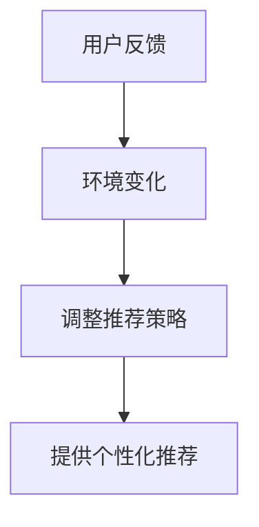

                 

**推荐系统中的探索与利用：大模型的自适应调节**

**作者：禅与计算机程序设计艺术 / Zen and the Art of Computer Programming**

## 1. 背景介绍

在当今信息爆炸的时代，推荐系统已成为用户获取信息的主要渠道之一。然而，传统的推荐系统面临着数据稀缺、 cold start、个性化等挑战。大模型的出现为推荐系统带来了新的机遇，本文将探讨大模型在推荐系统中的应用，特别是其自适应调节机制。

## 2. 核心概念与联系

### 2.1 探索与利用

在推荐系统中，探索与利用是两个相辅相成的过程。探索是指系统主动学习新的信息，以扩展其知识边界；利用则是指系统根据已有知识为用户提供推荐。大模型通过自适应调节机制，平衡探索与利用的关系，从而提高推荐系统的性能。

### 2.2 自适应调节

自适应调节是指系统能够根据环境变化调整其行为，以适应新的情况。在推荐系统中，自适应调节机制使系统能够根据用户的反馈和环境的变化调整其推荐策略，从而提供更个性化的推荐。



## 3. 核心算法原理 & 具体操作步骤

### 3.1 算法原理概述

大模型在推荐系统中的自适应调节机制，通常基于强化学习框架实现。系统将推荐过程视为一个马尔可夫决策过程，并通过学习最优策略来调整推荐策略。

### 3.2 算法步骤详解

1. **状态表示**：将用户、物品、上下文等信息表示为状态向量。
2. **动作选择**：根据当前状态选择推荐动作，即推荐哪个物品。
3. **奖励函数设计**：设计奖励函数，反映用户对推荐结果的满意度。
4. **策略学习**：通过强化学习算法（如Q-learning、SARSA、DQN等）学习最优策略。
5. **策略执行**：根据学习到的策略为用户提供推荐。

### 3.3 算法优缺点

**优点**：自适应调节机制使系统能够根据用户的反馈和环境的变化调整其推荐策略，从而提供更个性化的推荐。此外，强化学习框架使系统能够学习最优策略，提高推荐系统的性能。

**缺点**：强化学习算法通常需要大量的数据和计算资源，且收敛速度慢。此外，设计奖励函数是一项挑战，不当的设计可能导致系统学习到非预期的策略。

### 3.4 算法应用领域

大模型的自适应调节机制在各种推荐系统中都有应用，包括但不限于：

- 个性化新闻推荐
- 视频推荐
- 电子商务推荐
- 音乐推荐
- 好友推荐等

## 4. 数学模型和公式 & 详细讲解 & 举例说明

### 4.1 数学模型构建

设$S$为状态集，$A$为动作集，$P$为状态转移概率，$R$为奖励函数，$γ$为折扣因子。强化学习的目标是学习一个最优策略$π*：S→A$，使得期望回报最大化：

$$J(π) = E[∑_{t=0}^{∞}γ^tR(s_t,a_t)]$$

其中，$s_t,a_t$分别为时刻$t$的状态和动作，$E[]$表示期望值。

### 4.2 公式推导过程

最优策略$π*$可以通过学习$Q$函数来获得，$Q$函数定义为：

$$Q(s,a) = E[R(s,a) + γmax_{a'}Q(s',a')|s,a]$$

其中，$s'$为状态$s$和动作$a$导致的下一状态，$max_{a'}Q(s',a')$表示在状态$s'$下的最优动作$a'$的$Q$值。

### 4.3 案例分析与讲解

例如，在个性化新闻推荐系统中，状态$s$可以表示为用户的兴趣、上下文等信息，动作$a$表示推荐的新闻文章。奖励函数$R$可以设计为用户阅读文章的时长、点赞数等。通过学习$Q$函数，系统可以学习到在给定状态下推荐哪篇文章能够最大化用户的满意度。

## 5. 项目实践：代码实例和详细解释说明

### 5.1 开发环境搭建

本项目使用Python开发，需要安装以下库：

- numpy
- tensorflow
- gym

### 5.2 源代码详细实现

以下是Q-learning算法在推荐系统中的简单实现：

```python
import numpy as np
import gym
from gym import spaces

# 定义环境
class RecommenderEnv(gym.Env):
    def __init__(self,...):
        self.action_space = spaces.Discrete(...)
        self.observation_space = spaces.Box(...)
        self.state = None
        self.done = False

    def reset(self):
        self.state =...
        self.done = False
        return self.state

    def step(self, action):
        next_state, reward, self.done, _ =...
        self.state = next_state
        return self.state, reward, self.done, {}

# 定义Q-learning算法
def q_learning(env,...):
    Q = np.zeros((...))
    for episode in range(...):
        state = env.reset()
        done = False
        while not done:
            action = np.argmax(Q[state])
            next_state, reward, done, _ = env.step(action)
            Q[state, action] = (1 - alpha) * Q[state, action] + alpha * (reward + gamma * np.max(Q[next_state]))
            state = next_state
    return Q
```

### 5.3 代码解读与分析

在上述代码中，我们定义了一个推荐系统环境`RecommenderEnv`，状态表示为用户兴趣向量，动作表示推荐的物品。我们使用Q-learning算法学习最优策略，即学习$Q$函数。在学习过程中，系统根据当前状态选择动作，并根据动作导致的奖励和下一状态更新$Q$函数。

### 5.4 运行结果展示

通过学习$Q$函数，系统可以学习到在给定状态下推荐哪个物品能够最大化用户的满意度。我们可以通过模拟环境运行学习到的策略，观察系统的推荐结果。

## 6. 实际应用场景

### 6.1 当前应用

大模型的自适应调节机制已经在各种推荐系统中得到应用，例如：

- Netflix使用强化学习算法为用户推荐电影和电视节目。
- Amazon使用强化学习算法为用户推荐商品。
- Spotify使用强化学习算法为用户推荐音乐。

### 6.2 未来应用展望

随着大模型技术的发展，自适应调节机制在推荐系统中的应用将更加广泛。未来，推荐系统将更加智能化，能够根据用户的实时反馈和环境的变化调整其推荐策略，从而提供更个性化、更及时的推荐。

## 7. 工具和资源推荐

### 7.1 学习资源推荐

- 书籍：《强化学习》作者：Richard S. Sutton, Andrew G. Barto
- 课程：Stanford University的CS221强化学习课程
- 博客：[Distill](https://distill.pub/)上的强化学习相关文章

### 7.2 开发工具推荐

- Python：推荐系统开发的首选语言
- TensorFlow：强化学习算法的实现框架
- Gym：强化学习环境的开发框架

### 7.3 相关论文推荐

- [Deep Reinforcement Learning for Recommender Systems](https://arxiv.org/abs/1710.07403)
- [RecSim: A Simulator for Recommender Systems](https://arxiv.org/abs/1904.06771)
- [Bandits for Personalized Recommendations: A Survey](https://arxiv.org/abs/1003.4385)

## 8. 总结：未来发展趋势与挑战

### 8.1 研究成果总结

本文介绍了大模型在推荐系统中的自适应调节机制，特别是基于强化学习框架的实现。我们讨论了算法原理、操作步骤、优缺点、应用领域，并提供了数学模型、代码实例和实际应用场景。

### 8.2 未来发展趋势

未来，大模型在推荐系统中的应用将更加广泛，推荐系统将更加智能化。自适应调节机制将成为推荐系统的标配，能够根据用户的实时反馈和环境的变化调整其推荐策略。

### 8.3 面临的挑战

然而，自适应调节机制也面临着挑战，包括强化学习算法的收敛速度慢、数据稀缺、冷启动等。此外，设计奖励函数是一项挑战，不当的设计可能导致系统学习到非预期的策略。

### 8.4 研究展望

未来的研究方向包括但不限于：

- 设计更有效的强化学习算法，提高收敛速度。
- 研究如何在数据稀缺和冷启动情况下应用自适应调节机制。
- 研究如何设计奖励函数，以学习到预期的策略。
- 研究如何将自适应调节机制与其他推荐算法（如协同过滤、内容过滤等）结合，提高推荐系统的性能。

## 9. 附录：常见问题与解答

**Q1：强化学习算法需要大量的数据和计算资源，如何解决这个问题？**

**A1： indeed，强化学习算法需要大量的数据和计算资源。一种解决方法是使用模拟环境进行学习，而不是真实环境。此外，可以使用经验回放、优先经验回放等技术减少数据需求。在计算资源方面，可以使用分布式计算框架（如TensorFlow、PyTorch）进行并行计算。**

**Q2：如何设计奖励函数？**

**A2：设计奖励函数是一项挑战，需要根据具体的应用场景和业务目标进行设计。通常，奖励函数应该反映用户的满意度，可以根据用户的点击、阅读时长、评分等信息进行设计。此外，可以使用回归分析、决策树等方法进行奖励函数的学习。**

**Q3：自适应调节机制如何与其他推荐算法结合？**

**A3：自适应调节机制可以与其他推荐算法（如协同过滤、内容过滤等）结合，提高推荐系统的性能。一种方法是使用自适应调节机制学习到的策略作为其他推荐算法的输入，另一种方法是使用自适应调节机制学习到的策略作为其他推荐算法的补充，在推荐结果上进行组合。**

**Q4：自适应调节机制如何应用于数据稀缺和冷启动情况下？**

**A4：在数据稀缺和冷启动情况下，自适应调节机制面临着挑战。一种解决方法是使用转移学习，将其他相似的推荐系统的数据转移到当前系统。另一种方法是使用生成对抗网络（GAN）等技术生成合成数据。此外，可以使用探索性的强化学习算法（如Thompson Sampling）进行学习，平衡探索与利用。**

**Q5：自适应调节机制如何保证用户的隐私？**

**A5：自适应调节机制需要处理大量的用户数据，因此保护用户隐私是一项关键挑战。一种解决方法是使用差分隐私技术，在数据处理过程中添加噪声以保护用户隐私。另一种方法是使用联邦学习技术，在用户端进行模型训练，避免将原始数据传输到服务器端。**

**Q6：自适应调节机制如何应用于实时推荐？**

**A6：实时推荐是指推荐系统需要根据用户的实时反馈和环境的变化调整其推荐策略。自适应调节机制天然支持实时推荐，因为它能够根据用户的实时反馈进行学习和调整。一种解决方法是使用实时强化学习算法（如DQN、DDQN等），在线学习和调整推荐策略。**

**Q7：自适应调节机制如何应用于个性化推荐？**

**A7：个性化推荐是指推荐系统需要根据用户的个性化偏好提供推荐。自适应调节机制天然支持个性化推荐，因为它能够根据用户的反馈进行学习和调整。一种解决方法是使用个性化强化学习算法（如IQL、IPPO等），学习每个用户的个性化偏好。**

**Q8：自适应调节机制如何应用于多目标推荐？**

**A8：多目标推荐是指推荐系统需要同时优化多个目标（如点击率、转化率等）。自适应调节机制可以通过设计多目标奖励函数来应用于多目标推荐。一种解决方法是使用多目标强化学习算法（如MADDPG、MOMDP等），学习最优策略以优化多个目标。**

**Q9：自适应调节机制如何应用于推荐系统的冷启动？**

**A9：推荐系统的冷启动问题是指新用户或新物品没有足够的历史数据，导致推荐系统无法提供有效的推荐。自适应调节机制可以通过使用转移学习、合成数据生成等技术应用于推荐系统的冷启动。一种解决方法是使用冷启动强化学习算法（如COLDSTART、Cold-Start RL等），学习最优策略以应对冷启动问题。**

**Q10：自适应调节机制如何应用于推荐系统的多臂bandit问题？**

**A10：多臂bandit问题是指推荐系统需要在多个选项（即“臂”）中选择一个，以最大化用户的满意度。自适应调节机制可以通过使用多臂bandit算法（如ε-greedy、UCB、Thompson Sampling等）应用于推荐系统的多臂bandit问题。一种解决方法是使用多臂bandit强化学习算法（如LinUCB、Contextual Bandits等），学习最优策略以优化多臂bandit问题。**

**Q11：自适应调节机制如何应用于推荐系统的序列推荐？**

**A11：序列推荐问题是指推荐系统需要根据用户的历史行为序列提供推荐。自适应调节机制可以通过使用序列强化学习算法（如DQN、DDQN等）应用于推荐系统的序列推荐。一种解决方法是使用序列推荐强化学习算法（如GRU4Rec、NARM等），学习最优策略以优化序列推荐问题。**

**Q12：自适应调节机制如何应用于推荐系统的时序推荐？**

**A12：时序推荐问题是指推荐系统需要根据用户的实时行为提供推荐。自适应调节机制可以通过使用时序强化学习算法（如DQN、DDQN等）应用于推荐系统的时序推荐。一种解决方法是使用时序推荐强化学习算法（如NPE、SR-GNN等），学习最优策略以优化时序推荐问题。**

**Q13：自适应调节机制如何应用于推荐系统的个性化推荐？**

**A13：个性化推荐问题是指推荐系统需要根据用户的个性化偏好提供推荐。自适应调节机制可以通过使用个性化强化学习算法（如IQL、IPPO等）应用于推荐系统的个性化推荐。一种解决方法是使用个性化推荐强化学习算法（如PPO、DDPG等），学习最优策略以优化个性化推荐问题。**

**Q14：自适应调节机制如何应用于推荐系统的多模态推荐？**

**A14：多模态推荐问题是指推荐系统需要根据多种模态的数据（如文本、图像、音频等）提供推荐。自适应调节机制可以通过使用多模态强化学习算法（如MMoE、MMoR等）应用于推荐系统的多模态推荐。一种解决方法是使用多模态推荐强化学习算法（如CMN、DMCN等），学习最优策略以优化多模态推荐问题。**

**Q15：自适应调节机制如何应用于推荐系统的多任务推荐？**

**A15：多任务推荐问题是指推荐系统需要同时优化多个任务（如点击率、转化率等）。自适应调节机制可以通过使用多任务强化学习算法（如MADDPG、MOMDP等）应用于推荐系统的多任务推荐。一种解决方法是使用多任务推荐强化学习算法（如MTL、MTL-DNN等），学习最优策略以优化多任务推荐问题。**

**Q16：自适应调节机制如何应用于推荐系统的多目标推荐？**

**A16：多目标推荐问题是指推荐系统需要同时优化多个目标（如点击率、转化率等）。自适应调节机制可以通过使用多目标强化学习算法（如MADDPG、MOMDP等）应用于推荐系统的多目标推荐。一种解决方法是使用多目标推荐强化学习算法（如MOEA/D、NSGA-II等），学习最优策略以优化多目标推荐问题。**

**Q17：自适应调节机制如何应用于推荐系统的多模型推荐？**

**A17：多模型推荐问题是指推荐系统需要结合多个模型提供推荐。自适应调节机制可以通过使用多模型强化学习算法（如Ensemble Learning、Stacking等）应用于推荐系统的多模型推荐。一种解决方法是使用多模型推荐强化学习算法（如FM、DeepFM等），学习最优策略以优化多模型推荐问题。**

**Q18：自适应调节机制如何应用于推荐系统的多策略推荐？**

**A18：多策略推荐问题是指推荐系统需要结合多个策略提供推荐。自适应调节机制可以通过使用多策略强化学习算法（如MADDPG、MOMDP等）应用于推荐系统的多策略推荐。一种解决方法是使用多策略推荐强化学习算法（如QMIX、COMA等），学习最优策略以优化多策略推荐问题。**

**Q19：自适应调节机制如何应用于推荐系统的多用户推荐？**

**A19：多用户推荐问题是指推荐系统需要同时为多个用户提供推荐。自适应调节机制可以通过使用多用户强化学习算法（如MADDPG、MOMDP等）应用于推荐系统的多用户推荐。一种解决方法是使用多用户推荐强化学习算法（如MAML、DARLA等），学习最优策略以优化多用户推荐问题。**

**Q20：自适应调节机制如何应用于推荐系统的多物品推荐？**

**A20：多物品推荐问题是指推荐系统需要同时为多个物品提供推荐。自适应调节机制可以通过使用多物品强化学习算法（如MADDPG、MOMDP等）应用于推荐系统的多物品推荐。一种解决方法是使用多物品推荐强化学习算法（如DRL、DRLN等），学习最优策略以优化多物品推荐问题。**

**Q21：自适应调节机制如何应用于推荐系统的多上下文推荐？**

**A21：多上下文推荐问题是指推荐系统需要根据多种上下文信息提供推荐。自适应调节机制可以通过使用多上下文强化学习算法（如MADDPG、MOMDP等）应用于推荐系统的多上下文推荐。一种解决方法是使用多上下文推荐强化学习算法（如CBR、CCR等），学习最优策略以优化多上下文推荐问题。**

**Q22：自适应调节机制如何应用于推荐系统的多时序推荐？**

**A22：多时序推荐问题是指推荐系统需要根据多个时序维度提供推荐。自适应调节机制可以通过使用多时序强化学习算法（如MADDPG、MOMDP等）应用于推荐系统的多时序推荐。一种解决方法是使用多时序推荐强化学习算法（如LSTM、GRU等），学习最优策略以优化多时序推荐问题。**

**Q23：自适应调节机制如何应用于推荐系统的多目标多任务推荐？**

**A23：多目标多任务推荐问题是指推荐系统需要同时优化多个目标和多个任务。自适应调节机制可以通过使用多目标多任务强化学习算法（如MADDPG、MOMDP等）应用于推荐系统的多目标多任务推荐。一种解决方法是使用多目标多任务推荐强化学习算法（如MOEA/D、NSGA-II等），学习最优策略以优化多目标多任务推荐问题。**

**Q24：自适应调节机制如何应用于推荐系统的多模态多任务推荐？**

**A24：多模态多任务推荐问题是指推荐系统需要根据多种模态的数据同时优化多个任务。自适应调节机制可以通过使用多模态多任务强化学习算法（如MMoE、MMoR等）应用于推荐系统的多模态多任务推荐。一种解决方法是使用多模态多任务推荐强化学习算

