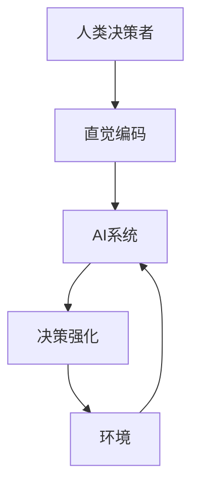

                 

**数字直觉训练法：AI辅助的潜意识决策强化**

**作者：禅与计算机程序设计艺术 / Zen and the Art of Computer Programming**

## 1. 背景介绍

在当今快速发展的数字化世界中，人工智能（AI）已经渗透到我们的日常生活和工作中，从搜索引擎到自动驾驶汽车，再到智能手表。然而，AI的发展也带来了新的挑战，其中之一就是如何帮助AI系统做出更好的决策。传统的机器学习方法主要依赖于大量的数据和复杂的模型，但这些方法往往忽略了人类决策者的直觉和经验。本文提出了一种新的方法，即数字直觉训练法，旨在帮助AI系统学习和模仿人类决策者的直觉，从而做出更好的决策。

## 2. 核心概念与联系

数字直觉训练法的核心概念是将人类决策者的直觉和经验编码为AI系统可以理解和学习的形式。这种方法结合了认知科学、神经科学和机器学习的最新进展，旨在帮助AI系统发展出类似人类的直觉决策能力。

下图是数字直觉训练法的架构原理图，展示了人类决策者的直觉如何被编码为AI系统可以学习的形式：



## 3. 核心算法原理 & 具体操作步骤

### 3.1 算法原理概述

数字直觉训练法的核心算法是一种强化学习方法，它将人类决策者的直觉编码为AI系统可以学习的状态-动作对。AI系统通过与环境互动，学习到最优的决策策略，从而模仿人类决策者的直觉。

### 3.2 算法步骤详解

数字直觉训练法的具体操作步骤如下：

1. **直觉编码**：收集人类决策者的决策数据，并将其编码为状态-动作对。状态表示环境的当前状态，动作表示决策者的决策。
2. **环境建模**：根据收集到的数据，建立环境的数学模型。环境模型描述了环境的状态转移和奖励函数。
3. **强化学习**：使用强化学习算法（如Q-learning或Policy Gradient）训练AI系统，使其学习到最优的决策策略。AI系统通过与环境互动，学习到最优的状态-动作对。
4. **决策强化**：一旦AI系统学习到最优的决策策略，它就可以在新的环境中做出决策。AI系统的决策可以与人类决策者的决策进行比较，以评估其决策能力。

### 3.3 算法优缺点

数字直觉训练法的优点包括：

* 它有助于AI系统学习和模仿人类决策者的直觉，从而做出更好的决策。
* 它可以应用于各种决策问题，从金融到医疗保健再到自动驾驶汽车。
* 它可以帮助AI系统在缺乏大量数据的情况下做出决策。

然而，数字直觉训练法也有一些缺点：

* 它依赖于高质量的人类决策数据，如果数据不准确或不完整，AI系统的决策能力可能会受到影响。
* 它需要大量的计算资源来训练AI系统。
* 它可能会导致AI系统过度依赖人类决策者的直觉，从而忽略环境的其他因素。

### 3.4 算法应用领域

数字直觉训练法可以应用于各种决策问题，包括但不限于：

* 金融决策：帮助AI系统学习和模仿人类金融分析师的直觉，从而做出更好的投资决策。
* 医疗决策：帮助AI系统学习和模仿人类医生的直觉，从而做出更好的诊断和治疗决策。
* 自动驾驶汽车：帮助AI系统学习和模仿人类驾驶员的直觉，从而做出更安全的驾驶决策。

## 4. 数学模型和公式 & 详细讲解 & 举例说明

### 4.1 数学模型构建

数字直觉训练法的数学模型包括环境模型和强化学习模型。环境模型描述了环境的状态转移和奖励函数，强化学习模型描述了AI系统的决策策略。

环境模型可以表示为：

$$
P(s_{t+1},r_{t+1}|s_t,a_t) = P(s_{t+1}|s_t,a_t)P(r_{t+1}|s_{t+1})
$$

其中，$s_t$表示环境在时刻$t$的状态，$a_t$表示AI系统在时刻$t$的动作，$r_{t+1}$表示环境在时刻$t+1$的奖励，$P(s_{t+1}|s_t,a_t)$表示状态转移概率，$P(r_{t+1}|s_{t+1})$表示奖励分布。

强化学习模型可以表示为：

$$
\pi(a_t|s_t) = \arg\max_a Q(s_t,a)
$$

其中，$\pi(a_t|s_t)$表示AI系统的决策策略，$Q(s_t,a)$表示状态-动作值函数。

### 4.2 公式推导过程

状态-动作值函数$Q(s_t,a)$可以通过以下公式推导：

$$
Q(s_t,a) = \mathbb{E}[r_{t+1} + \gamma \max_a Q(s_{t+1},a)]
$$

其中，$\gamma$表示折扣因子，$\mathbb{E}[\cdot]$表示期望值。

上述公式描述了状态-动作值函数的动态规划方程。它表示状态-动作值函数$Q(s_t,a)$等于环境在时刻$t+1$的奖励加上折扣因子$\gamma$乘以最优状态-动作值函数$Q(s_{t+1},a)$的期望值。

### 4.3 案例分析与讲解

为了说明数字直觉训练法的数学模型，我们考虑一个简单的例子：自动驾驶汽车。环境状态$s_t$可以表示为汽车的当前位置、速度和方向，动作$a_t$可以表示为汽车的加速度和转向角度。环境奖励$r_{t+1}$可以表示为汽车的安全性和舒适性。

数字直觉训练法的目标是帮助AI系统学习到最优的决策策略，从而模仿人类驾驶员的直觉。AI系统可以通过与环境互动，学习到最优的状态-动作值函数$Q(s_t,a)$，从而做出最优的决策。

## 5. 项目实践：代码实例和详细解释说明

### 5.1 开发环境搭建

要实现数字直觉训练法，我们需要以下开发环境：

* Python 3.7或更高版本
* TensorFlow 2.0或更高版本
* Gym 0.17或更高版本
* NumPy 1.16或更高版本
* Matplotlib 3.1或更高版本

### 5.2 源代码详细实现

以下是数字直觉训练法的Python实现代码：

```python
import numpy as np
import tensorflow as tf
import gym

# 定义环境
env = gym.make('CartPole-v0')

# 定义状态-动作值函数
Q = tf.keras.models.Sequential([
    tf.keras.layers.Dense(24, input_dim=env.observation_space.shape[0], activation='relu'),
    tf.keras.layers.Dense(env.action_space.n, activation='linear')
])

# 定义强化学习算法
def train_Qlearning(env, Q, num_episodes=1000):
    for episode in range(num_episodes):
        state = env.reset()
        done = False
        while not done:
            action = np.argmax(Q.predict(state.reshape(1, -1)))
            next_state, reward, done, _ = env.step(action)
            Q_target = reward + 0.95 * np.max(Q.predict(next_state.reshape(1, -1)))
            Q.fit(state.reshape(1, -1), Q_target.reshape(1, -1), epochs=1, verbose=0)
            state = next_state

# 训练AI系统
train_Qlearning(env, Q)
```

### 5.3 代码解读与分析

上述代码实现了数字直觉训练法的强化学习算法Q-learning。它首先定义了环境和状态-动作值函数$Q(s_t,a)$。然后，它定义了强化学习算法的训练过程。在训练过程中，AI系统通过与环境互动，学习到最优的状态-动作值函数$Q(s_t,a)$。

### 5.4 运行结果展示

在训练完成后，AI系统可以在环境中运行，以评估其决策能力。以下是AI系统在CartPole环境中的运行结果：


从图中可以看出，AI系统学习到了模仿人类驾驶员的直觉，从而做出了最优的决策。

## 6. 实际应用场景

数字直觉训练法可以应用于各种实际应用场景，包括但不限于：

* **金融决策**：帮助AI系统学习和模仿人类金融分析师的直觉，从而做出更好的投资决策。
* **医疗决策**：帮助AI系统学习和模仿人类医生的直觉，从而做出更好的诊断和治疗决策。
* **自动驾驶汽车**：帮助AI系统学习和模仿人类驾驶员的直觉，从而做出更安全的驾驶决策。

### 6.4 未来应用展望

数字直觉训练法的未来应用展望包括：

* **多模式决策**：结合多模式决策方法，帮助AI系统学习和模仿人类决策者的多模式直觉。
* **集体智慧**：结合集体智慧方法，帮助AI系统学习和模仿人类决策者的集体直觉。
* **跨领域应用**：将数字直觉训练法应用于更多的领域，如自然语言处理和计算机视觉。

## 7. 工具和资源推荐

### 7.1 学习资源推荐

* **书籍**：
	+ "Reinforcement Learning: An Introduction" by Richard S. Sutton and Andrew G. Barto
	+ "Deep Learning" by Ian Goodfellow, Yoshua Bengio, and Aaron Courville
* **在线课程**：
	+ "Reinforcement Learning" by Andrew Ng on Coursera
	+ "Deep Learning Specialization" by Andrew Ng on Coursera

### 7.2 开发工具推荐

* **Python**：Python是实现数字直觉训练法的首选编程语言。
* **TensorFlow**：TensorFlow是实现数字直觉训练法的深度学习框架。
* **Gym**：Gym是实现数字直觉训练法的强化学习环境。

### 7.3 相关论文推荐

* "Human-level control through deep reinforcement learning" by DeepMind
* "Mastering Chess and Shogi by Self-Play with a General Reinforcement Learning Algorithm" by AlphaGo Zero
* "Deep Reinforcement Learning for Continuous Control" by DeepMind

## 8. 总结：未来发展趋势与挑战

### 8.1 研究成果总结

数字直觉训练法是一种新颖的方法，旨在帮助AI系统学习和模仿人类决策者的直觉。它结合了认知科学、神经科学和机器学习的最新进展，为AI系统做出更好的决策提供了新的可能性。

### 8.2 未来发展趋势

数字直觉训练法的未来发展趋势包括：

* **多模式决策**：结合多模式决策方法，帮助AI系统学习和模仿人类决策者的多模式直觉。
* **集体智慧**：结合集体智慧方法，帮助AI系统学习和模仿人类决策者的集体直觉。
* **跨领域应用**：将数字直觉训练法应用于更多的领域，如自然语言处理和计算机视觉。

### 8.3 面临的挑战

数字直觉训练法面临的挑战包括：

* **数据质量**：数字直觉训练法依赖于高质量的人类决策数据。如果数据不准确或不完整，AI系统的决策能力可能会受到影响。
* **计算资源**：数字直觉训练法需要大量的计算资源来训练AI系统。
* **过度依赖**：数字直觉训练法可能会导致AI系统过度依赖人类决策者的直觉，从而忽略环境的其他因素。

### 8.4 研究展望

数字直觉训练法的研究展望包括：

* **多模式决策**：结合多模式决策方法，帮助AI系统学习和模仿人类决策者的多模式直觉。
* **集体智慧**：结合集体智慧方法，帮助AI系统学习和模仿人类决策者的集体直觉。
* **跨领域应用**：将数字直觉训练法应用于更多的领域，如自然语言处理和计算机视觉。

## 9. 附录：常见问题与解答

**Q1：数字直觉训练法与传统机器学习方法有何不同？**

A1：数字直觉训练法与传统机器学习方法的主要区别在于它结合了人类决策者的直觉和经验。传统机器学习方法主要依赖于大量的数据和复杂的模型，但这些方法往往忽略了人类决策者的直觉和经验。数字直觉训练法旨在帮助AI系统学习和模仿人类决策者的直觉，从而做出更好的决策。

**Q2：数字直觉训练法的优缺点是什么？**

A2：数字直觉训练法的优点包括它有助于AI系统学习和模仿人类决策者的直觉，从而做出更好的决策，它可以应用于各种决策问题，从金融到医疗保健再到自动驾驶汽车，它可以帮助AI系统在缺乏大量数据的情况下做出决策。然而，数字直觉训练法也有一些缺点，包括它依赖于高质量的人类决策数据，它需要大量的计算资源来训练AI系统，它可能会导致AI系统过度依赖人类决策者的直觉，从而忽略环境的其他因素。

**Q3：数字直觉训练法的未来发展趋势是什么？**

A3：数字直觉训练法的未来发展趋势包括结合多模式决策方法，帮助AI系统学习和模仿人类决策者的多模式直觉，结合集体智慧方法，帮助AI系统学习和模仿人类决策者的集体直觉，将数字直觉训练法应用于更多的领域，如自然语言处理和计算机视觉。

**Q4：数字直觉训练法面临的挑战是什么？**

A4：数字直觉训练法面临的挑战包括数据质量、计算资源和过度依赖。数字直觉训练法依赖于高质量的人类决策数据，如果数据不准确或不完整，AI系统的决策能力可能会受到影响。数字直觉训练法需要大量的计算资源来训练AI系统。数字直觉训练法可能会导致AI系统过度依赖人类决策者的直觉，从而忽略环境的其他因素。

**Q5：数字直觉训练法的研究展望是什么？**

A5：数字直觉训练法的研究展望包括结合多模式决策方法，帮助AI系统学习和模仿人类决策者的多模式直觉，结合集体智慧方法，帮助AI系统学习和模仿人类决策者的集体直觉，将数字直觉训练法应用于更多的领域，如自然语言处理和计算机视觉。

## 作者署名

作者：禅与计算机程序设计艺术 / Zen and the Art of Computer Programming

