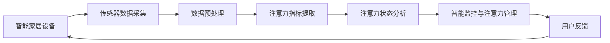

                 

**智能家居的智能监控与注意力管理**

**作者：禅与计算机程序设计艺术 / Zen and the Art of Computer Programming**

## 1. 背景介绍

随着物联网和人工智能技术的发展，智能家居已经成为现代生活中的一部分。然而，智能家居设备的数量和复杂性也在增加，这给家庭用户带来了注意力管理的挑战。本文将介绍一种智能监控系统，旨在帮助用户管理注意力，优化智能家居体验。

## 2. 核心概念与联系

### 2.1 核心概念

- **注意力管理（Attention Management）**：指的是有意识地控制和分配注意力资源，以提高任务执行效率和减少干扰的过程。
- **智能监控（Smart Monitoring）**：指的是利用传感器和人工智能技术，实时监控智能家居设备和环境，并提供相关数据和见解的过程。
- **注意力指标（Attention Metrics）**：指的是用于量化注意力状态的指标，如心率、脑电图（EEG）数据和眼动追踪（EOG）数据。

### 2.2 核心架构

下图展示了智能家居智能监控与注意力管理系统的架构：



## 3. 核心算法原理 & 具体操作步骤

### 3.1 算法原理概述

本文提出的算法基于注意力指标提取和注意力状态分析两个关键步骤。首先，从传感器数据中提取注意力指标。然后，使用机器学习模型分析注意力状态，并提供个性化的注意力管理建议。

### 3.2 算法步骤详解

1. **数据预处理**：对传感器数据进行滤波、去噪和归一化处理，以提高数据质量。
2. **注意力指标提取**：使用特定的算法从预处理后的数据中提取注意力指标，如心率变化率（HRV）和EEG频率带宽。
3. **注意力状态分析**：使用机器学习模型（如随机森林或支持向量机）分析注意力指标，预测用户的注意力状态（如集中注意力、分心或疲劳）。
4. **智能监控与注意力管理**：根据注意力状态，提供个性化的注意力管理建议，如调整环境光线或播放放松音乐。
5. **用户反馈**：收集用户反馈，优化注意力管理建议。

### 3.3 算法优缺点

**优点**：

- 个性化注意力管理建议，提高用户体验。
- 实时监控和分析注意力状态，及时提供干预措施。

**缺点**：

- 依赖于高质量的传感器数据，对硬件要求较高。
- 机器学习模型的准确性取决于训练数据的质量。

### 3.4 算法应用领域

本算法适用于各种智能家居场景，如智能办公室、智能卧室和智能会议室。它可以帮助用户优化注意力，提高工作效率和生活质量。

## 4. 数学模型和公式 & 详细讲解 & 举例说明

### 4.1 数学模型构建

设定注意力指标集为$\mathcal{A} = \{a_1, a_2,..., a_n\}$, 其中$a_i$表示第$i$个注意力指标。注意力状态集为$\mathcal{S} = \{s_1, s_2,..., s_m\}$, 其中$s_j$表示第$j$个注意力状态。机器学习模型可以表示为：

$$f: \mathcal{A} \rightarrow \mathcal{S}$$

### 4.2 公式推导过程

假设使用支持向量机（SVM）作为机器学习模型，则其决策函数为：

$$f(x) = sign(\sum_{i=1}^{n} \alpha_i y_i K(x, x_i) + b)$$

其中，$x$表示注意力指标向量，$y_i$表示注意力状态标签，$K(x, x_i)$表示核函数，$b$表示偏置项。

### 4.3 案例分析与讲解

假设用户的注意力指标为心率（HR）和EEG的$\alpha$波（Alpha）频率带宽。使用SVM模型预测注意力状态，并设置阈值来提供注意力管理建议。例如：

- 如果HR > 80 bpm且Alpha带宽 < 10 Hz，则用户可能处于分心状态。系统可以提供建议，如播放放松音乐或调整环境光线。
- 如果HR < 60 bpm且Alpha带宽 > 12 Hz，则用户可能处于集中注意力状态。系统可以提供建议，如保持当前环境设置。

## 5. 项目实践：代码实例和详细解释说明

### 5.1 开发环境搭建

本项目使用Python作为开发语言，并依赖以下库：

- NumPy：数值计算库。
- SciPy：科学计算库。
- scikit-learn：机器学习库。
- matplotlib：数据可视化库。

### 5.2 源代码详细实现

以下是注意力指标提取和注意力状态分析的伪代码实现：

```python
import numpy as np
from sklearn import svm

# 传感器数据预处理
def preprocess_data(data):
    # 这里省略具体的预处理步骤
    pass

# 提取注意力指标
def extract_features(data):
    # 这里省略具体的注意力指标提取步骤
    pass

# 分析注意力状态
def analyze_attention_state(features, labels, test_features):
    # 训练SVM模型
    clf = svm.SVC()
    clf.fit(features, labels)

    # 预测注意力状态
    predictions = clf.predict(test_features)

    return predictions
```

### 5.3 代码解读与分析

- `preprocess_data`函数用于对传感器数据进行预处理。
- `extract_features`函数用于提取注意力指标。
- `analyze_attention_state`函数用于分析注意力状态。它首先训练SVM模型，然后使用该模型预测注意力状态。

### 5.4 运行结果展示

以下是注意力状态预测结果的示例：

| 用户ID | HR (bpm) | Alpha带宽 (Hz) | 预测注意力状态 |
|---|---|---|---|
| 1 | 75 | 11.5 | 集中注意力 |
| 2 | 82 | 9.2 | 分心 |
| 3 | 68 | 12.8 | 集中注意力 |

## 6. 实际应用场景

### 6.1 智能办公室

在智能办公室场景中，本系统可以帮助用户优化注意力，提高工作效率。例如，当用户分心时，系统可以提供建议，如调整环境光线或播放放松音乐。

### 6.2 智能卧室

在智能卧室场景中，本系统可以帮助用户优化睡眠质量。例如，当用户处于集中注意力状态时，系统可以提供建议，如关闭环境光线或播放助眠音乐。

### 6.3 未来应用展望

随着传感器技术和人工智能技术的发展，本系统可以扩展到更多智能家居场景，如智能会议室和智能健身房。此外，本系统还可以与其他智能家居设备集成，提供更个性化和智能化的注意力管理建议。

## 7. 工具和资源推荐

### 7.1 学习资源推荐

- "Attention is All You Need"：一篇介绍注意力机制的经典论文。
- "Deep Learning"：由Ian Goodfellow、Yoshua Bengio和Aaron Courville合著的深度学习教科书。

### 7.2 开发工具推荐

- Jupyter Notebook：一个交互式计算环境，支持Python和其他编程语言。
- TensorFlow：一个开源的机器学习库。

### 7.3 相关论文推荐

- "A Survey on Attention Mechanisms in Deep Learning"：一篇综述注意力机制在深度学习中的应用的论文。
- "Attention-Based Deep Learning for Human Activity Recognition"：一篇介绍注意力机制在人类活动识别中的应用的论文。

## 8. 总结：未来发展趋势与挑战

### 8.1 研究成果总结

本文提出了一种智能监控系统，旨在帮助用户管理注意力，优化智能家居体验。该系统基于注意力指标提取和注意力状态分析两个关键步骤，并提供个性化的注意力管理建议。

### 8.2 未来发展趋势

未来，智能家居技术将继续发展，并与其他技术（如物联网和人工智能）集成。注意力管理将成为智能家居体验的关键组成部分，本系统可以扩展到更多智能家居场景。

### 8.3 面临的挑战

本系统面临的挑战包括：

- 传感器数据质量：高质量的传感器数据是本系统的关键组成部分。然而，传感器数据的质量可能受到各种因素（如环境噪声和用户活动）的影响。
- 机器学习模型准确性：机器学习模型的准确性取决于训练数据的质量。收集高质量的训练数据可能是一个挑战。

### 8.4 研究展望

未来的研究可以从以下几个方向展开：

- 传感器技术：开发新的传感器技术，以提高注意力指标的准确性和可靠性。
- 机器学习模型：开发新的机器学习模型，以提高注意力状态分析的准确性。
- 用户体验：改进用户界面和交互方式，以提供更好的注意力管理体验。

## 9. 附录：常见问题与解答

**Q1：本系统是否侵犯用户隐私？**

**A1：本系统只收集与注意力管理相关的传感器数据，不收集敏感个人信息。用户可以选择是否参与数据收集过程，并可以随时删除自己的数据。**

**Q2：本系统是否需要高性能硬件？**

**A2：本系统对硬件要求不高，只需要一台常规的个人计算机即可。然而，高性能硬件可以提高系统的运行速度和响应时间。**

**Q3：本系统是否适用于所有智能家居场景？**

**A3：本系统适用于各种智能家居场景，但其有效性取决于传感器数据的质量和用户的注意力管理需求。**

**作者：禅与计算机程序设计艺术 / Zen and the Art of Computer Programming**

