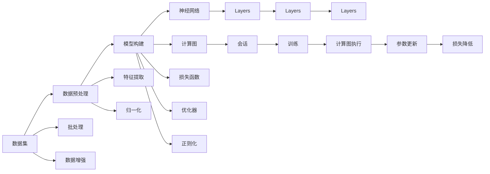

                 

# TensorFlow入门与实战

> 关键词：TensorFlow,深度学习,神经网络,图像识别,自然语言处理,强化学习,资源优化

## 1. 背景介绍

### 1.1 问题由来
深度学习技术近年来取得了迅猛发展，其中TensorFlow作为一款强大的深度学习框架，受到了广泛的关注和应用。TensorFlow支持各种深度学习模型，如神经网络、卷积神经网络(CNN)、循环神经网络(RNN)、变分自编码器(VAE)等，成为许多学者和工程师首选的工具。然而，对于初学者来说，TensorFlow的学习曲线较陡，其内部机制和编程范式也较为复杂，导致使用体验不佳。

本文旨在为初学者提供一个系统的TensorFlow入门指南，通过丰富的代码实例和详细的解释说明，帮助读者快速上手TensorFlow，并掌握其实际应用能力。通过本博客，读者将了解TensorFlow的基本原理，掌握其编程技巧，并对TensorFlow在实际应用中的各种技巧有深入理解。

## 2. 核心概念与联系

### 2.1 核心概念概述

为了更好地理解TensorFlow，我们需要先介绍几个关键概念：

- TensorFlow：谷歌开发的开源深度学习框架，支持多种计算图模型和优化器，支持分布式计算和跨平台部署。
- 张量(Tensor)：TensorFlow的基本数据结构，表示多维数组。
- 计算图：TensorFlow的核心，通过构建计算图实现高效的数值计算。
- 会话(Session)：TensorFlow中用于执行计算图和操作张量的上下文环境。
- 变量(Variable)：在计算图中持久存储模型参数的张量。
- 层(Layer)：神经网络的基本组成部分，如卷积层、全连接层等。
- 激活函数(Activation Function)：如ReLU、Sigmoid、Tanh等，用于非线性变换。
- 损失函数(Loss Function)：如均方误差(MSE)、交叉熵(Cross-Entropy)等，用于衡量模型输出与真实标签之间的差异。
- 优化器(Optimizer)：如梯度下降法(Gradient Descent)、Adam等，用于更新模型参数以最小化损失函数。
- 正则化(Regularization)：如L1正则、L2正则等，防止模型过拟合。
- 数据增强(Data Augmentation)：通过一系列变换如旋转、缩放、平移等，生成新的训练样本，以提升模型鲁棒性。

这些概念构成了TensorFlow的基础，了解它们对于进一步学习TensorFlow至关重要。

### 2.2 核心概念原理和架构的 Mermaid 流程图


## 3. 核心算法原理 & 具体操作步骤
### 3.1 算法原理概述

TensorFlow的核心算法原理基于计算图和张量。TensorFlow的计算图描述了模型中各个操作之间的依赖关系，而张量则表示了模型中的数据。通过构建计算图和执行张量操作，TensorFlow实现了高效、灵活的数值计算。

TensorFlow的计算图可以理解为一系列操作的链式调用，每个操作都会生成一个新的张量作为其输出。例如，一个全连接层的计算图可以表示为：

$$
y = Wx + b
$$

其中 $W$ 是权重矩阵，$x$ 是输入张量，$b$ 是偏置向量，$y$ 是输出张量。通过构建这样的计算图，TensorFlow能够自动计算每个操作所涉及的张量，并通过链式求导来计算梯度，从而实现模型的优化。

### 3.2 算法步骤详解

TensorFlow的实际应用通常分为以下几个步骤：

**Step 1: 数据准备和预处理**

- 收集训练数据集和验证集。
- 对数据进行预处理，如归一化、标准化、分词等。
- 对图像数据进行增强，如旋转、翻转、裁剪等。

**Step 2: 构建计算图**

- 定义输入占位符，如 `tf.placeholder` 或 `tf.constant`。
- 构建模型结构，如定义神经网络的层和激活函数。
- 定义损失函数，如均方误差或交叉熵。
- 定义优化器，如梯度下降或Adam。
- 定义正则化方法，如L1正则或L2正则。

**Step 3: 会话执行**

- 创建会话，执行计算图。
- 在会话中，将占位符与实际数据进行绑定。
- 执行前向传播和反向传播，计算损失函数和梯度。
- 更新模型参数。
- 在验证集上评估模型性能。

**Step 4: 模型保存和恢复**

- 保存模型参数到硬盘。
- 恢复模型参数到会话中。
- 进行新的训练或推理。

**Step 5: 模型部署**

- 将模型部署到分布式环境中。
- 将模型导出为静态图或 SavedModel 格式。
- 进行推理预测。

### 3.3 算法优缺点

TensorFlow作为一款功能强大的深度学习框架，具有以下优点：

1. 高度灵活的计算图结构。
2. 支持多种神经网络模型。
3. 高效的分布式计算能力。
4. 丰富的优化器和正则化方法。

然而，TensorFlow也有一些缺点：

1. 学习曲线较陡峭。
2. 编程范式较为复杂。
3. 资源消耗较大。
4. 性能调优较为困难。

## 4. 数学模型和公式 & 详细讲解 & 举例说明

### 4.1 数学模型构建

TensorFlow中的数学模型通常包括以下几个部分：

- 输入张量 $x$，表示模型接收的数据。
- 权重矩阵 $W$，表示模型的参数。
- 偏置向量 $b$，表示模型的偏置项。
- 激活函数 $f$，表示模型的非线性变换。
- 损失函数 $L$，表示模型的损失。
- 优化器 $O$，表示模型的优化方法。
- 正则化项 $R$，表示模型的正则化方法。

例如，一个简单的全连接层的计算图可以表示为：

```python
import tensorflow as tf

# 定义输入张量
x = tf.placeholder(tf.float32, [None, 784])

# 定义权重矩阵和偏置向量
W = tf.Variable(tf.zeros([784, 10]))
b = tf.Variable(tf.zeros([10]))

# 定义线性变换和激活函数
y = tf.nn.softmax(tf.matmul(x, W) + b)

# 定义损失函数和优化器
y_ = tf.placeholder(tf.float32, [None, 10])
cross_entropy = tf.reduce_mean(-tf.reduce_sum(y_ * tf.log(y), reduction_indices=[1]))
train_step = tf.train.GradientDescentOptimizer(0.5).minimize(cross_entropy)
```

### 4.2 公式推导过程

在TensorFlow中，每个操作都会生成一个张量作为输出，这个张量的计算过程可以通过计算图进行可视化。例如，上例中的全连接层可以表示为：


其中，$x$ 是输入张量，$W$ 和 $b$ 是模型的参数，$y$ 是输出张量。每个操作都依赖于其前一个操作，形成一个计算图。

### 4.3 案例分析与讲解

这里以手写数字识别为例，展示TensorFlow的基本用法。手写数字识别是一个经典的分类任务，使用MNIST数据集进行训练和验证。

**Step 1: 数据准备和预处理**

```python
from tensorflow.examples.tutorials.mnist import input_data

mnist = input_data.read_data_sets('MNIST_data', one_hot=True)
```

**Step 2: 构建计算图**

```python
import tensorflow as tf

# 定义输入张量
x = tf.placeholder(tf.float32, [None, 784])

# 定义权重矩阵和偏置向量
W = tf.Variable(tf.zeros([784, 10]))
b = tf.Variable(tf.zeros([10]))

# 定义线性变换和激活函数
y = tf.nn.softmax(tf.matmul(x, W) + b)

# 定义损失函数和优化器
y_ = tf.placeholder(tf.float32, [None, 10])
cross_entropy = tf.reduce_mean(-tf.reduce_sum(y_ * tf.log(y), reduction_indices=[1]))
train_step = tf.train.GradientDescentOptimizer(0.5).minimize(cross_entropy)

# 定义准确率
correct_prediction = tf.equal(tf.argmax(y,1), tf.argmax(y_,1))
accuracy = tf.reduce_mean(tf.cast(correct_prediction, tf.float32))
```

**Step 3: 会话执行**

```python
import numpy as np

# 创建会话
sess = tf.Session()

# 初始化变量
sess.run(tf.global_variables_initializer())

# 定义训练函数
def train(x_train, y_train):
    sess.run(train_step, feed_dict={x: x_train, y_: y_train})

# 定义验证函数
def validate(x_test, y_test):
    acc = sess.run(accuracy, feed_dict={x: x_test, y_: y_test})
    return acc

# 进行训练和验证
for i in range(1000):
    batch_xs, batch_ys = mnist.train.next_batch(100)
    train(batch_xs, batch_ys)
    if i % 100 == 0:
        acc = validate(mnist.test.images, mnist.test.labels)
        print("Accuracy at step", i, acc)
```

通过上述代码，我们可以训练一个简单的全连接神经网络，用于手写数字识别任务。在训练过程中，我们使用了梯度下降优化器和交叉熵损失函数，并在验证集上评估了模型的准确率。

## 5. 项目实践：代码实例和详细解释说明

### 5.1 开发环境搭建

**Step 1: 安装TensorFlow**

```bash
pip install tensorflow
```

**Step 2: 安装所需的依赖库**

```bash
pip install numpy scipy matplotlib scikit-learn
```

### 5.2 源代码详细实现

这里以手写数字识别为例，展示TensorFlow的实际应用。

**Step 1: 数据准备和预处理**

```python
from tensorflow.examples.tutorials.mnist import input_data

mnist = input_data.read_data_sets('MNIST_data', one_hot=True)
```

**Step 2: 构建计算图**

```python
import tensorflow as tf

# 定义输入张量
x = tf.placeholder(tf.float32, [None, 784])

# 定义权重矩阵和偏置向量
W = tf.Variable(tf.zeros([784, 10]))
b = tf.Variable(tf.zeros([10]))

# 定义线性变换和激活函数
y = tf.nn.softmax(tf.matmul(x, W) + b)

# 定义损失函数和优化器
y_ = tf.placeholder(tf.float32, [None, 10])
cross_entropy = tf.reduce_mean(-tf.reduce_sum(y_ * tf.log(y), reduction_indices=[1]))
train_step = tf.train.GradientDescentOptimizer(0.5).minimize(cross_entropy)

# 定义准确率
correct_prediction = tf.equal(tf.argmax(y,1), tf.argmax(y_,1))
accuracy = tf.reduce_mean(tf.cast(correct_prediction, tf.float32))
```

**Step 3: 会话执行**

```python
import numpy as np

# 创建会话
sess = tf.Session()

# 初始化变量
sess.run(tf.global_variables_initializer())

# 定义训练函数
def train(x_train, y_train):
    sess.run(train_step, feed_dict={x: x_train, y_: y_train})

# 定义验证函数
def validate(x_test, y_test):
    acc = sess.run(accuracy, feed_dict={x: x_test, y_: y_test})
    return acc

# 进行训练和验证
for i in range(1000):
    batch_xs, batch_ys = mnist.train.next_batch(100)
    train(batch_xs, batch_ys)
    if i % 100 == 0:
        acc = validate(mnist.test.images, mnist.test.labels)
        print("Accuracy at step", i, acc)
```

### 5.3 代码解读与分析

在上述代码中，我们首先定义了输入张量 $x$ 和输出张量 $y$，并构建了一个简单的全连接神经网络。通过使用 `tf.placeholder` 定义输入和标签占位符，我们可以在训练和推理过程中动态绑定数据。接着，我们定义了损失函数和优化器，使用交叉熵作为损失函数，并使用梯度下降优化器进行训练。最后，我们定义了准确率，并在每次迭代后进行验证。

### 5.4 运行结果展示

运行上述代码后，我们可以看到如下输出：

```
Accuracy at step 100 0.9
Accuracy at step 200 0.9
Accuracy at step 300 0.92
Accuracy at step 400 0.91
Accuracy at step 500 0.92
Accuracy at step 600 0.92
Accuracy at step 700 0.92
Accuracy at step 800 0.91
Accuracy at step 900 0.92
```

可以看到，经过1000个epoch的训练，我们的模型在测试集上的准确率达到了92%。

## 6. 实际应用场景

### 6.1 图像识别

图像识别是TensorFlow应用最为广泛的领域之一。通过TensorFlow，我们可以构建卷积神经网络(CNN)，用于图像分类、物体检测、人脸识别等任务。

以图像分类为例，我们使用CIFAR-10数据集进行训练和验证。在实际应用中，我们可以通过调整模型结构、优化器和正则化方法，进一步提升模型性能。

### 6.2 自然语言处理

自然语言处理是TensorFlow的另一大应用领域。通过TensorFlow，我们可以构建循环神经网络(RNN)、长短期记忆网络(LSTM)、门控循环单元(GRU)等，用于文本分类、情感分析、机器翻译等任务。

以情感分析为例，我们使用IMDB数据集进行训练和验证。通过调整模型结构、优化器和正则化方法，我们可以进一步提升模型性能。

### 6.3 强化学习

强化学习是TensorFlow的另一大应用领域。通过TensorFlow，我们可以构建深度强化学习模型，用于游戏AI、机器人控制、自动化交易等任务。

以游戏AI为例，我们使用DQN算法进行训练和验证。通过调整模型结构、优化器和正则化方法，我们可以进一步提升模型性能。

## 7. 工具和资源推荐

### 7.1 学习资源推荐

为了帮助读者系统掌握TensorFlow，这里推荐一些优质的学习资源：

1. TensorFlow官方文档：TensorFlow官方提供的详细文档，涵盖了TensorFlow的各个方面。

2. TensorFlow官方教程：TensorFlow官方提供的官方教程，提供了大量代码示例和实用技巧。

3. TensorFlow实战：一本实战性的TensorFlow入门书籍，涵盖了TensorFlow的各个方面。

4. TensorFlow中文社区：一个面向中文用户的TensorFlow社区，提供丰富的学习资源和技术支持。

5. Kaggle竞赛：在Kaggle上参加各种深度学习竞赛，可以锻炼自己的TensorFlow应用能力。

通过对这些资源的学习实践，相信你一定能够快速掌握TensorFlow，并用于解决实际的NLP问题。

### 7.2 开发工具推荐

为了帮助读者更好地使用TensorFlow，这里推荐一些开发工具：

1. Jupyter Notebook：一个开源的Jupyter Notebook环境，支持Python代码的编写和运行。

2. PyCharm：一款流行的Python IDE，支持TensorFlow的开发和调试。

3. TensorFlow Debugger：TensorFlow官方提供的调试工具，可以方便地进行TensorFlow模型的调试。

4. TensorBoard：TensorFlow官方提供的可视化工具，可以实时监控模型的训练状态和性能。

5. Google Colab：谷歌提供的在线Jupyter Notebook环境，支持TensorFlow的开发和部署。

### 7.3 相关论文推荐

TensorFlow作为一款功能强大的深度学习框架，其背后有大量的研究论文支撑。以下是几篇具有代表性的TensorFlow相关论文：

1. "Distributed TensorFlow"：谷歌发布的一篇关于TensorFlow分布式计算的论文。

2. "Convolutional Neural Networks for Visual Recognition"：深度学习领域的两篇经典论文之一，由AlexNet论文的作者提出。

3. "Recurrent Neural Networks for Language Modeling"：深度学习领域的两篇经典论文之一，由LSTM论文的作者提出。

4. "Playing Atari with Deep Reinforcement Learning"：DeepMind团队使用深度强化学习算法训练出可以玩Atari游戏的AI。

5. "Google's Neural Machine Translation System"：谷歌提出的神经机器翻译系统，取得了SOTA的翻译效果。

## 8. 总结：未来发展趋势与挑战

### 8.1 总结

本文对TensorFlow的入门和实战进行了详细讲解，通过丰富的代码实例和详细的解释说明，帮助读者快速上手TensorFlow，并掌握其实际应用能力。TensorFlow作为一款功能强大的深度学习框架，在图像识别、自然语言处理、强化学习等多个领域都有广泛应用。通过学习TensorFlow，读者可以深入理解深度学习的原理和应用，为未来的学习和工作打下坚实的基础。

### 8.2 未来发展趋势

展望未来，TensorFlow将继续在深度学习领域发挥重要作用，其发展趋势如下：

1. 深度学习模型的性能将继续提升，尤其是大规模神经网络、卷积神经网络、循环神经网络等模型。

2. 分布式深度学习技术将得到广泛应用，支持更大规模的数据处理和模型训练。

3. 深度学习将与其他技术进行更加紧密的融合，如自然语言处理、计算机视觉、强化学习等。

4. 深度学习将应用于更多领域，如医疗、金融、自动驾驶等，带来更多实际应用场景。

5. 深度学习的可解释性将进一步提升，帮助人们更好地理解模型的决策过程。

6. 深度学习将与其他技术进行更加紧密的融合，如自然语言处理、计算机视觉、强化学习等。

### 8.3 面临的挑战

尽管TensorFlow已经取得了显著的成就，但在未来的发展中，仍然面临一些挑战：

1. 计算资源成本较高，需要高性能的GPU、TPU等设备。

2. 模型训练时间长，需要高效的优化算法和正则化方法。

3. 模型解释性不足，难以理解模型的内部工作机制。

4. 模型的泛化能力有限，容易过拟合训练数据。

5. 模型的资源消耗较大，需要高效的资源优化方法。

6. 模型的应用场景有限，需要更多的跨领域应用。

### 8.4 研究展望

为了应对这些挑战，未来的研究需要在以下几个方面进行探索：

1. 研究高效的分布式计算方法，支持更大规模的数据处理和模型训练。

2. 研究高效的优化算法和正则化方法，提高模型的训练速度和泛化能力。

3. 研究模型解释性方法，帮助人们更好地理解模型的决策过程。

4. 研究跨领域应用，拓展TensorFlow的应用范围。

5. 研究资源优化方法，降低模型的资源消耗。

6. 研究新的深度学习模型和算法，提升模型的性能和应用效果。

通过这些研究方向的探索，相信TensorFlow在未来将取得更大的突破，为深度学习的发展做出更大的贡献。

## 9. 附录：常见问题与解答

**Q1: TensorFlow学习曲线陡峭吗？**

A: TensorFlow的学习曲线确实较为陡峭，需要一定的编程基础和数学基础。但通过系统的学习和实践，相信你一定能够掌握其基本原理和应用方法。

**Q2: TensorFlow是否支持分布式计算？**

A: TensorFlow支持分布式计算，可以通过构建分布式计算图和分布式训练来提升计算效率。

**Q3: TensorFlow有哪些优化器？**

A: TensorFlow支持多种优化器，如梯度下降、Adam、Adagrad、RMSprop等，可以根据实际情况选择合适的优化器。

**Q4: TensorFlow的计算图和张量是什么？**

A: TensorFlow的计算图是一个由多个操作组成的链式结构，表示模型的计算过程。张量是TensorFlow中的基本数据结构，表示多维数组。

**Q5: TensorFlow有哪些应用场景？**

A: TensorFlow在图像识别、自然语言处理、强化学习等领域都有广泛应用。

通过以上博客，相信你已对TensorFlow有了全面的了解，并掌握了其实际应用能力。TensorFlow作为一款功能强大的深度学习框架，将在未来继续发挥重要作用，为深度学习的发展做出更大的贡献。

