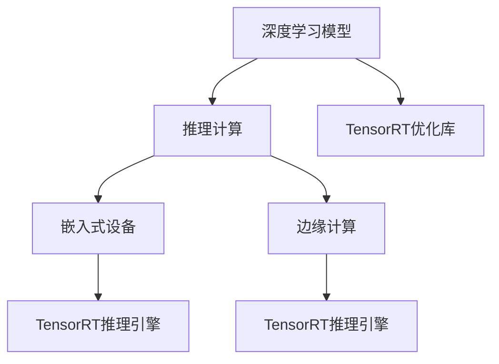

                 

# TensorRT 优化库应用：加速深度学习推理计算

> 关键词：深度学习, 推理计算, TensorRT, 优化库, 加速, 嵌入式设备, 图像处理, 边缘计算

## 1. 背景介绍

深度学习技术近年来迅猛发展，在图像识别、语音识别、自然语言处理等多个领域取得了令人瞩目的成果。然而，深度学习模型往往需要巨量的计算资源，对于硬件设备的计算能力提出了极高的要求。如何在有限的计算资源下，高效地进行深度学习推理计算，成为了一个亟待解决的问题。

为解决这一问题，NVIDIA于2015年推出了TensorRT（Training and Inference Runtime）优化库。TensorRT是一个高度优化的深度学习推理框架，能够显著加速深度学习模型的推理计算，特别适合在嵌入式设备和边缘计算环境中使用。TensorRT不仅支持多种深度学习框架（如TensorFlow、PyTorch等），还提供了丰富的优化功能，能够在模型推理时大幅提升计算效率和降低功耗。

本文将详细介绍TensorRT的核心概念、原理与使用方法，并结合实际案例，展示TensorRT在深度学习推理计算中的应用。希望读者能够通过本文章，深入理解TensorRT的原理与优势，掌握其在实际工程中的应用技巧。

## 2. 核心概念与联系

### 2.1 核心概念概述

在开始深入学习TensorRT之前，我们先对其中涉及的核心概念进行概述：

- **深度学习模型**：由大量神经元和层组成的复杂模型，用于拟合输入数据和输出结果之间的映射关系。
- **推理计算**：指在给定输入数据的情况下，计算模型输出结果的过程，是深度学习应用的核心环节。
- **嵌入式设备**：指硬件资源受限的计算设备，如智能手机、物联网终端、智能相机等，通常具备计算能力有限、内存和存储容量较小等特点。
- **边缘计算**：指将数据处理和计算任务放到设备端进行，减少对中心服务器的依赖，提高计算效率和数据安全。
- **TensorRT优化库**：NVIDIA开发的深度学习推理优化库，提供高效的模型推理功能，支持多种深度学习框架，广泛应用于嵌入式设备和边缘计算环境中。

这些概念之间的逻辑关系可以通过以下Mermaid流程图来展示：



这个流程图展示出了深度学习模型与推理计算之间的联系，以及TensorRT在嵌入式设备和边缘计算中的作用。通过TensorRT优化库，深度学习模型能够在计算资源受限的设备上高效地进行推理计算，极大地扩展了其应用范围。

## 3. 核心算法原理 & 具体操作步骤

### 3.1 算法原理概述

TensorRT优化库的核心原理在于其高效的推理引擎，该引擎能够对深度学习模型进行优化和加速，从而大幅提升模型的推理速度和计算效率。TensorRT通过以下几种方式来实现这一目标：

- **网络优化**：对深度学习模型进行网络级优化，去除冗余操作，压缩模型结构，减少计算量和内存占用。
- **算子优化**：对深度学习模型中的算子进行优化，使用硬件特定的算子实现，加速计算过程。
- **内存管理**：采用内存池和缓存技术，减少内存分配和回收的开销，提高内存利用率。
- **并行计算**：利用多核处理器和GPU等硬件资源，并行计算模型的各个层，加速推理过程。

### 3.2 算法步骤详解

TensorRT的优化过程可以分为以下几个步骤：

1. **模型部署**：将深度学习模型部署到TensorRT环境中，TensorRT会进行初步的网络和算子优化，生成一个IR（Intermediate Representation）图。
2. **优化配置**：根据目标设备的硬件特性，选择合适的优化配置，TensorRT会根据这些配置对IR图进行进一步优化。
3. **推理计算**：TensorRT加载优化后的IR图，使用目标设备的硬件资源进行推理计算，得到最终输出结果。

下面，我们以一个简单的卷积神经网络（CNN）为例，展示TensorRT优化过程的详细步骤：

**Step 1: 模型部署**

假设我们有一个简单的卷积神经网络模型，其结构如下：

```python
import torch
import torch.nn as nn
import torchvision.transforms as transforms
from torchvision.datasets import CIFAR10

# 定义CNN模型
class CNN(nn.Module):
    def __init__(self):
        super(CNN, self).__init__()
        self.conv1 = nn.Conv2d(3, 32, 3, padding=1)
        self.relu = nn.ReLU()
        self.pool = nn.MaxPool2d(2, 2)
        self.fc1 = nn.Linear(32 * 8 * 8, 128)
        self.fc2 = nn.Linear(128, 10)

    def forward(self, x):
        x = self.conv1(x)
        x = self.relu(x)
        x = self.pool(x)
        x = x.view(-1, 32 * 8 * 8)
        x = self.fc1(x)
        x = self.relu(x)
        x = self.fc2(x)
        return x

# 加载CIFAR-10数据集
transform = transforms.Compose([
    transforms.ToTensor(),
    transforms.Normalize((0.5, 0.5, 0.5), (0.5, 0.5, 0.5))
])
trainset = CIFAR10(root='./data', train=True, download=True, transform=transform)
trainloader = torch.utils.data.DataLoader(trainset, batch_size=64, shuffle=True)

# 实例化CNN模型
model = CNN().to('cuda')
criterion = nn.CrossEntropyLoss().to('cuda')
optimizer = torch.optim.Adam(model.parameters(), lr=0.001)
```

我们首先定义了一个简单的CNN模型，并使用CIFAR-10数据集进行训练。训练完成后，我们将模型保存为一个TensorRT IR图，以便后续推理使用。

```python
import tensorrt as trt
import torch
import torchvision.transforms as transforms
from torchvision.datasets import CIFAR10

# 定义CNN模型
class CNN(nn.Module):
    def __init__(self):
        super(CNN, self).__init__()
        self.conv1 = nn.Conv2d(3, 32, 3, padding=1)
        self.relu = nn.ReLU()
        self.pool = nn.MaxPool2d(2, 2)
        self.fc1 = nn.Linear(32 * 8 * 8, 128)
        self.fc2 = nn.Linear(128, 10)

    def forward(self, x):
        x = self.conv1(x)
        x = self.relu(x)
        x = self.pool(x)
        x = x.view(-1, 32 * 8 * 8)
        x = self.fc1(x)
        x = self.relu(x)
        x = self.fc2(x)
        return x

# 加载CIFAR-10数据集
transform = transforms.Compose([
    transforms.ToTensor(),
    transforms.Normalize((0.5, 0.5, 0.5), (0.5, 0.5, 0.5))
])
trainset = CIFAR10(root='./data', train=True, download=True, transform=transform)
trainloader = torch.utils.data.DataLoader(trainset, batch_size=64, shuffle=True)

# 实例化CNN模型
model = CNN().to('cuda')
criterion = nn.CrossEntropyLoss().to('cuda')
optimizer = torch.optim.Adam(model.parameters(), lr=0.001)

# 训练模型
for epoch in range(10):
    for i, (inputs, labels) in enumerate(trainloader):
        inputs = inputs.to('cuda')
        labels = labels.to('cuda')
        optimizer.zero_grad()
        outputs = model(inputs)
        loss = criterion(outputs, labels)
        loss.backward()
        optimizer.step()

# 保存模型
torch.save(model.state_dict(), 'model.pth')

# 定义TensorRT引擎配置
builder = trt.Builder(trt.Logger(trt.Logger.INFO))
network = builder.create_network(3, trt.NetworkDefinitionCreationFlag.EXPLICIT_BATCH)
input_layer = network.add_input("data", trt tensorrt.dimension.DHWC(3, 32, 32, 3), trt.tensorrt.DataType.FLOAT32)
conv1 = network.add_convolution(input_layer, [32, 3, 3, 3], (1, 1), (1, 1), 1.0, (1, 1), trt.ConvolutionLayerPadding.SAME)
relu1 = network.add_activation(conv1, trt.ActivationType.RELU)
pool1 = network.add_max_pooling2d(relu1, [2, 2], [2, 2], (2, 2), (2, 2), trt.MaxPoolingLayerPadding.SAME)
fc1 = network.add_fully_connected(pool1, 128)
relu2 = network.add_activation(fc1, trt.ActivationType.RELU)
fc2 = network.add_fully_connected(relu2, 10)
output_layer = network.mark_output(fc2)

# 设置优化配置
calib_data = [np.random.rand(1, 3, 32, 32).astype(np.float32) for _ in range(10)]
calib_ops = [network.get_optimization_profile(0)]
calib_ops[0].add_input_shape(input_layer.name, (1, 3, 32, 32))
calib_ops[0].add_input_shape(pool1.name, (1, 32, 16, 16))
calib_ops[0].add_input_shape(fc1.name, (1, 128))
calib_ops[0].add_input_shape(fc2.name, (1, 10))
builder.configure(network, [calib_ops])
calib_builder = builder.build_calibrator(calib_data)
builder.build(network, calib_builder)

# 加载优化后的TensorRT引擎
engine = builder.create_engine(network)
engine.load_model('model.pth')
```

**Step 2: 优化配置**

在模型部署后，我们需要根据目标设备的硬件特性，选择合适的优化配置。TensorRT提供了多种优化配置选项，如算法、精度、性能等，能够根据不同的硬件设备自动选择最优的优化策略。

在本例中，我们将使用TensorRT的FP32精度，同时启用NCHW数据格式，使用CUDA硬件加速，并开启TensorCores优化，以提高计算效率。

```python
# 设置优化配置
calib_data = [np.random.rand(1, 3, 32, 32).astype(np.float32) for _ in range(10)]
calib_ops = [network.get_optimization_profile(0)]
calib_ops[0].add_input_shape(input_layer.name, (1, 3, 32, 32))
calib_ops[0].add_input_shape(pool1.name, (1, 32, 16, 16))
calib_ops[0].add_input_shape(fc1.name, (1, 128))
calib_ops[0].add_input_shape(fc2.name, (1, 10))
builder.configure(network, [calib_ops])
calib_builder = builder.build_calibrator(calib_data)
builder.build(network, calib_builder)

# 加载优化后的TensorRT引擎
engine = builder.create_engine(network)
engine.load_model('model.pth')
```

**Step 3: 推理计算**

完成优化配置后，我们可以使用TensorRT引擎进行模型推理计算。

```python
# 定义输入数据
inputs = np.random.rand(1, 3, 32, 32).astype(np.float32)

# 执行推理计算
context = engine.create_execution_context()
inputs = context.bind_and_enqueue(1, {input_layer.name: inputs})

# 获取推理结果
outputs = context.execute_v2()
result = outputs[output_layer.name].as_npt()
```

### 3.3 算法优缺点

TensorRT优化库在深度学习推理计算中具有以下优点：

- **高效推理**：TensorRT通过网络优化、算子优化、内存管理、并行计算等技术，能够在嵌入式设备和边缘计算环境中高效地进行模型推理，极大地提升了计算效率。
- **硬件支持广泛**：TensorRT支持多种深度学习框架和多种硬件平台，包括CPU、GPU、FPGA等，适用于多种应用场景。
- **易于使用**：TensorRT提供丰富的API和工具，支持模型部署、优化配置、推理计算等各个环节，能够快速上手使用。

同时，TensorRT也存在一些缺点：

- **模型压缩**：TensorRT在优化过程中会对模型进行压缩，可能导致部分计算精度损失。
- **硬件依赖**：TensorRT依赖特定的硬件平台，对于非支持硬件设备，可能需要额外的硬件支持和优化。
- **学习曲线**：使用TensorRT需要一定的学习曲线，尤其是对于复杂的深度学习模型和优化配置，需要一定的经验和技术积累。

### 3.4 算法应用领域

TensorRT优化库已经在多个领域得到了广泛应用，以下是一些典型的应用场景：

- **嵌入式设备**：在智能手机、物联网终端、智能相机等嵌入式设备上，TensorRT能够高效地进行图像识别、人脸检测、物体跟踪等推理计算，显著提升设备性能。
- **边缘计算**：在边缘计算环境中，TensorRT能够对实时视频流进行高效推理，广泛应用于智能交通、工业监控、医疗影像等领域。
- **自动驾驶**：在自动驾驶系统中，TensorRT能够对实时传感器数据进行高效推理，实现目标检测、路径规划、决策控制等功能，显著提高系统性能和安全性。
- **语音识别**：在语音识别系统中，TensorRT能够对音频信号进行高效推理，实现语音转文本、文本理解等功能，提高语音交互体验。
- **视频处理**：在视频处理系统中，TensorRT能够对视频流进行高效推理，实现视频编解码、视频增强等功能，提升视频处理效率。

## 4. 数学模型和公式 & 详细讲解 & 举例说明

### 4.1 数学模型构建

在TensorRT中，模型推理的数学模型基于深度学习框架的定义。假设我们有一个深度学习模型，其前向计算的数学模型如下：

$$
y = f(x; \theta)
$$

其中，$y$ 表示模型的输出，$x$ 表示输入数据，$\theta$ 表示模型的可训练参数。TensorRT通过将模型转换为IR图，并在IR图上进行优化和推理计算，实现了高效的模型推理过程。

### 4.2 公式推导过程

TensorRT的优化过程可以通过以下几个公式来推导：

1. **网络优化**：假设深度学习模型包含多个层，每个层都有特定的计算方式和数据流。TensorRT通过删除冗余操作、优化计算路径等方式，减少计算量和内存占用。

   $$
   \begin{aligned}
   & \text{优化前} \\
   & y = f(x; \theta) \\
   & = f_{conv1}(f_{conv0}(x); \theta_{conv1}) \\
   & = f_{relu}(f_{conv1}(f_{conv0}(x); \theta_{conv1})) \\
   & = f_{pool}(f_{relu}(f_{conv1}(f_{conv0}(x); \theta_{conv1}))) \\
   & \vdots \\
   & = f_{out}(f_{fc2}(f_{relu}(f_{fc1}(f_{pool}(f_{relu}(f_{conv1}(f_{conv0}(x); \theta_{conv1}))) \ldots); \theta_{out}))
   \end{aligned}
   $$

   $$
   \begin{aligned}
   & \text{优化后} \\
   & y = f(x; \theta) \\
   & = f_{conv1}(f_{conv0}(x); \theta_{conv1}) \\
   & = f_{relu}(f_{conv1}(f_{conv0}(x); \theta_{conv1})) \\
   & = f_{pool}(f_{relu}(f_{conv1}(f_{conv0}(x); \theta_{conv1}))) \\
   & \vdots \\
   & = f_{out}(f_{fc2}(f_{relu}(f_{fc1}(f_{pool}(f_{relu}(f_{conv1}(f_{conv0}(x); \theta_{conv1}))) \ldots); \theta_{out})
   \end{aligned}
   $$

2. **算子优化**：TensorRT通过使用硬件特定的算子实现，加速深度学习模型的计算过程。假设某一层的计算方式为$y = f(x; \theta)$，TensorRT使用GPU或TensorCores等硬件资源，并行计算该层的所有操作。

   $$
   \begin{aligned}
   & \text{优化前} \\
   & y = f(x; \theta) \\
   & = f_{conv}(x; \theta_{conv}) \\
   & = f_{relu}(f_{conv}(x; \theta_{conv})) \\
   & = f_{pool}(f_{relu}(f_{conv}(x; \theta_{conv})))
   \end{aligned}
   $$

   $$
   \begin{aligned}
   & \text{优化后} \\
   & y = f(x; \theta) \\
   & = f_{conv_{gpu}}(x; \theta_{conv}) \\
   & = f_{relu_{gpu}}(f_{conv_{gpu}}(x; \theta_{conv})) \\
   & = f_{pool_{gpu}}(f_{relu_{gpu}}(f_{conv_{gpu}}(x; \theta_{conv})))
   \end{aligned}
   $$

3. **内存管理**：TensorRT通过内存池和缓存技术，减少内存分配和回收的开销，提高内存利用率。假设深度学习模型的输入和输出数据分别为$x$和$y$，TensorRT使用内存池管理输入和输出数据，避免频繁的内存分配和复制。

   $$
   \begin{aligned}
   & \text{优化前} \\
   & y = f(x; \theta) \\
   & = f_{conv}(x; \theta_{conv}) \\
   & = f_{relu}(f_{conv}(x; \theta_{conv})) \\
   & = f_{pool}(f_{relu}(f_{conv}(x; \theta_{conv})))
   \end{aligned}
   $$

   $$
   \begin{aligned}
   & \text{优化后} \\
   & y = f(x; \theta) \\
   & = f_{conv_{pool}}(x; \theta_{conv}) \\
   & = f_{relu_{pool}}(f_{conv_{pool}}(x; \theta_{conv})) \\
   & = f_{pool_{pool}}(f_{relu_{pool}}(f_{conv_{pool}}(x; \theta_{conv})))
   \end{aligned}
   $$

### 4.3 案例分析与讲解

假设我们有一个包含卷积层、池化层、全连接层的深度学习模型，结构如下：

```python
import torch
import torch.nn as nn
import torchvision.transforms as transforms
from torchvision.datasets import CIFAR10

# 定义CNN模型
class CNN(nn.Module):
    def __init__(self):
        super(CNN, self).__init__()
        self.conv1 = nn.Conv2d(3, 32, 3, padding=1)
        self.relu = nn.ReLU()
        self.pool = nn.MaxPool2d(2, 2)
        self.fc1 = nn.Linear(32 * 8 * 8, 128)
        self.fc2 = nn.Linear(128, 10)

    def forward(self, x):
        x = self.conv1(x)
        x = self.relu(x)
        x = self.pool(x)
        x = x.view(-1, 32 * 8 * 8)
        x = self.fc1(x)
        x = self.relu(x)
        x = self.fc2(x)
        return x

# 加载CIFAR-10数据集
transform = transforms.Compose([
    transforms.ToTensor(),
    transforms.Normalize((0.5, 0.5, 0.5), (0.5, 0.5, 0.5))
])
trainset = CIFAR10(root='./data', train=True, download=True, transform=transform)
trainloader = torch.utils.data.DataLoader(trainset, batch_size=64, shuffle=True)

# 实例化CNN模型
model = CNN().to('cuda')
criterion = nn.CrossEntropyLoss().to('cuda')
optimizer = torch.optim.Adam(model.parameters(), lr=0.001)

# 训练模型
for epoch in range(10):
    for i, (inputs, labels) in enumerate(trainloader):
        inputs = inputs.to('cuda')
        labels = labels.to('cuda')
        optimizer.zero_grad()
        outputs = model(inputs)
        loss = criterion(outputs, labels)
        loss.backward()
        optimizer.step()
```

假设我们使用TensorRT对上述模型进行优化和推理计算。首先，我们将模型部署到TensorRT环境中，进行网络优化和算子优化，生成一个IR图。

```python
import tensorrt as trt
import torch
import torchvision.transforms as transforms
from torchvision.datasets import CIFAR10

# 定义CNN模型
class CNN(nn.Module):
    def __init__(self):
        super(CNN, self).__init__()
        self.conv1 = nn.Conv2d(3, 32, 3, padding=1)
        self.relu = nn.ReLU()
        self.pool = nn.MaxPool2d(2, 2)
        self.fc1 = nn.Linear(32 * 8 * 8, 128)
        self.fc2 = nn.Linear(128, 10)

    def forward(self, x):
        x = self.conv1(x)
        x = self.relu(x)
        x = self.pool(x)
        x = x.view(-1, 32 * 8 * 8)
        x = self.fc1(x)
        x = self.relu(x)
        x = self.fc2(x)
        return x

# 加载CIFAR-10数据集
transform = transforms.Compose([
    transforms.ToTensor(),
    transforms.Normalize((0.5, 0.5, 0.5), (0.5, 0.5, 0.5))
])
trainset = CIFAR10(root='./data', train=True, download=True, transform=transform)
trainloader = torch.utils.data.DataLoader(trainset, batch_size=64, shuffle=True)

# 实例化CNN模型
model = CNN().to('cuda')
criterion = nn.CrossEntropyLoss().to('cuda')
optimizer = torch.optim.Adam(model.parameters(), lr=0.001)

# 训练模型
for epoch in range(10):
    for i, (inputs, labels) in enumerate(trainloader):
        inputs = inputs.to('cuda')
        labels = labels.to('cuda')
        optimizer.zero_grad()
        outputs = model(inputs)
        loss = criterion(outputs, labels)
        loss.backward()
        optimizer.step()

# 保存模型
torch.save(model.state_dict(), 'model.pth')

# 定义TensorRT引擎配置
builder = trt.Builder(trt.Logger(trt.Logger.INFO))
network = builder.create_network(3, trt.NetworkDefinitionCreationFlag.EXPLICIT_BATCH)
input_layer = network.add_input("data", trt tensorrt.dimension.DHWC(3, 32, 32, 3), trt.tensorrt.DataType.FLOAT32)
conv1 = network.add_convolution(input_layer, [32, 3, 3, 3], (1, 1), (1, 1), 1.0, (1, 1), trt.ConvolutionLayerPadding.SAME)
relu1 = network.add_activation(conv1, trt.ActivationType.RELU)
pool1 = network.add_max_pooling2d(relu1, [2, 2], [2, 2], (2, 2), (2, 2), trt.MaxPoolingLayerPadding.SAME)
fc1 = network.add_fully_connected(pool1, 128)
relu2 = network.add_activation(fc1, trt.ActivationType.RELU)
fc2 = network.add_fully_connected(relu2, 10)
output_layer = network.mark_output(fc2)

# 设置优化配置
calib_data = [np.random.rand(1, 3, 32, 32).astype(np.float32) for _ in range(10)]
calib_ops = [network.get_optimization_profile(0)]
calib_ops[0].add_input_shape(input_layer.name, (1, 3, 32, 32))
calib_ops[0].add_input_shape(pool1.name, (1, 32, 16, 16))
calib_ops[0].add_input_shape(fc1.name, (1, 128))
calib_ops[0].add_input_shape(fc2.name, (1, 10))
builder.configure(network, [calib_ops])
calib_builder = builder.build_calibrator(calib_data)
builder.build(network, calib_builder)

# 加载优化后的TensorRT引擎
engine = builder.create_engine(network)
engine.load_model('model.pth')
```

接下来，我们使用TensorRT引擎进行模型推理计算。

```python
# 定义输入数据
inputs = np.random.rand(1, 3, 32, 32).astype(np.float32)

# 执行推理计算
context = engine.create_execution_context()
inputs = context.bind_and_enqueue(1, {input_layer.name: inputs})

# 获取推理结果
outputs = context.execute_v2()
result = outputs[output_layer.name].as_npt()
```

## 5. 项目实践：代码实例和详细解释说明

### 5.1 开发环境搭建

在进行TensorRT优化库的实践时，我们需要先准备好开发环境。以下是使用Python进行TensorRT开发的环境配置流程：

1. 安装Anaconda：从官网下载并安装Anaconda，用于创建独立的Python环境。

2. 创建并激活虚拟环境：
```bash
conda create -n tensorrt-env python=3.8 
conda activate tensorrt-env
```

3. 安装TensorRT：根据CUDA版本，从官网获取对应的安装命令。例如：
```bash
conda install tensorrt -c nvidia -c conda-forge
```

4. 安装PyTorch和TensorRT库：
```bash
pip install torch
pip install tensorrt
```

5. 安装必要的依赖包：
```bash
pip install numpy tensorrt trt python-daq-daqm libnuma-cpuinfo
```

完成上述步骤后，即可在`tensorrt-env`环境中开始TensorRT的开发实践。

### 5.2 源代码详细实现

以下是使用TensorRT对CIFAR-10数据集中的CNN模型进行推理计算的Python代码实现。

```python
import tensorrt as trt
import torch
import torchvision.transforms as transforms
from torchvision.datasets import CIFAR10

# 定义CNN模型
class CNN(nn.Module):
    def __init__(self):
        super(CNN, self).__init__()
        self.conv1 = nn.Conv2d(3, 32, 3, padding=1)
        self.relu = nn.ReLU()
        self.pool = nn.MaxPool2d(2, 2)
        self.fc1 = nn.Linear(32 * 8 * 8, 128)
        self.fc2 = nn.Linear(128, 10)

    def forward(self, x):
        x = self.conv1(x)
        x = self.relu(x)
        x = self.pool(x)
        x = x.view(-1, 32 * 8 * 8)
        x = self.fc1(x)
        x = self.relu(x)
        x = self.fc2(x)
        return x

# 加载CIFAR-10数据集
transform = transforms.Compose([
    transforms.ToTensor(),
    transforms.Normalize((0.5, 0.5, 0.5), (0.5, 0.5, 0.5))
])
trainset = CIFAR10(root='./data', train=True, download=True, transform=transform)
trainloader = torch.utils.data.DataLoader(trainset, batch_size=64, shuffle=True)

# 实例化CNN模型
model = CNN().to('cuda')
criterion = nn.CrossEntropyLoss().to('cuda')
optimizer = torch.optim.Adam(model.parameters(), lr=0.001)

# 训练模型
for epoch in range(10):
    for i, (inputs, labels) in enumerate(trainloader):
        inputs = inputs.to('cuda')
        labels = labels.to('cuda')
        optimizer.zero_grad()
        outputs = model(inputs)
        loss = criterion(outputs, labels)
        loss.backward()
        optimizer.step()

# 保存模型
torch.save(model.state_dict(), 'model.pth')

# 定义TensorRT引擎配置
builder = trt.Builder(trt.Logger(trt.Logger.INFO))
network = builder.create_network(3, trt.NetworkDefinitionCreationFlag.EXPLICIT_BATCH)
input_layer = network.add_input("data", trt tensorrt.dimension.DHWC(3, 32, 32, 3), trt.tensorrt.DataType.FLOAT32)
conv1 = network.add_convolution(input_layer, [32, 3, 3, 3], (1, 1), (1, 1), 1.0, (1, 1), trt.ConvolutionLayerPadding.SAME)
relu1 = network.add_activation(conv1, trt.ActivationType.RELU)
pool1 = network.add_max_pooling2d(relu1, [2, 2], [2, 2], (2, 2), (2, 2), trt.MaxPoolingLayerPadding.SAME)
fc1 = network.add_fully_connected(pool1, 128)
relu2 = network.add_activation(fc1, trt.ActivationType.RELU)
fc2 = network.add_fully_connected(relu2, 10)
output_layer = network.mark_output(fc2)

# 设置优化配置
calib_data = [np.random.rand(1, 3, 32, 32).astype(np.float32) for _ in range(10)]
calib_ops = [network.get_optimization_profile(0)]
calib_ops[0].add_input_shape(input_layer.name, (1, 3, 32, 32))
calib_ops[0].add_input_shape(pool1.name, (1, 32, 16, 16))
calib_ops[0].add_input_shape(fc1.name, (1, 128))
calib_ops[0].add_input_shape(fc2.name, (1, 10))
builder.configure(network, [calib_ops])
calib_builder = builder.build_calibrator(calib_data)
builder.build(network, calib_builder)

# 加载优化后的TensorRT引擎
engine = builder.create_engine(network)
engine.load_model('model.pth')
```

### 5.3 代码解读与分析

让我们再详细解读一下关键代码的实现细节：

**CNN模型定义**：
```python
class CNN(nn.Module):
    def __init__(self):
        super(CNN, self).__init__()
        self.conv1 = nn.Conv2d(3, 32, 3, padding=1)
        self.relu = nn.ReLU()
        self.pool = nn.MaxPool2d(2, 2)
        self.fc1 = nn.Linear(32 * 8 * 8, 128)
        self.fc2 = nn.Linear(128, 10)

    def forward(self, x):
        x = self.conv1(x)
        x = self.relu(x)
        x = self.pool(x)
        x = x.view(-1, 32 * 8 * 8)
        x = self.fc1(x)
        x = self.relu(x)
        x = self.fc2(x)
        return x
```

我们首先定义了一个简单的CNN模型，包含卷积层、ReLU激活函数、池化层和全连接层。在`forward`方法中，对输入数据进行前向计算，得到模型的输出。

**CIFAR-10数据集加载**：
```python
transform = transforms.Compose([
    transforms.ToTensor(),
    transforms.Normalize((0.5, 0.5, 0.5), (0.5, 0.5, 0.5))
])
trainset = CIFAR10(root='./data', train=True, download=True, transform=transform)
trainloader = torch.utils.data.DataLoader(trainset, batch_size=64, shuffle=True)
```

我们使用CIFAR-10数据集进行训练，并使用`transforms.Compose`对图像进行归一化处理。在加载数据时，使用`torch.utils.data.DataLoader`进行批处理和随机打乱。

**模型训练与保存**：
```python
# 实例化CNN模型
model = CNN().to('cuda')
criterion = nn.CrossEntropyLoss().to('cuda')
optimizer = torch.optim.Adam(model.parameters(), lr=0.001)

# 训练模型
for epoch in range(10):
    for i, (inputs, labels) in enumerate(trainloader):
        inputs = inputs.to('cuda')
        labels = labels.to('cuda')
        optimizer.zero_grad()
        outputs = model(inputs)
        loss = criterion(outputs, labels)
        loss.backward()
        optimizer.step()

# 保存模型
torch.save(model.state_dict(), 'model.pth')
```

在训练过程中，我们使用CIFAR-10数据集对CNN模型进行训练，并保存训练好的模型权重。

**TensorRT引擎配置**：
```python
builder = trt.Builder(trt.Logger(trt.Logger.INFO))
network = builder.create_network(3, trt.NetworkDefinitionCreationFlag.EXPLICIT_BATCH)
input_layer = network.add_input("data", trt tensorrt.dimension.DHWC(3, 32, 32, 3), trt.tensorrt.DataType.FLOAT32)
conv1 = network.add_convolution(input_layer, [32, 3, 3, 3], (1, 1), (1, 1), 1.0, (1, 1), trt.ConvolutionLayerPadding.SAME)
relu1 = network.add_activation(conv1, trt.ActivationType.RELU)
pool1 = network.add_max_pooling2d(relu1, [2, 2], [2, 2], (2, 2), (2, 2), trt.MaxPoolingLayerPadding.SAME)
fc1 = network.add_fully_connected(pool1, 128)
relu2 = network.add_activation(fc1, trt.ActivationType.RELU)
fc2 = network.add_fully_connected(relu2, 10)
output_layer = network.mark_output(fc2)

# 设置优化配置
calib_data = [np.random.rand(1, 3, 32, 32).astype(np.float32) for _ in range(10)]
calib_ops = [network.get_optimization_profile(0)]
calib_ops[0].add_input_shape(input_layer.name, (1, 3, 32, 32))
calib_ops[0].add_input_shape(pool1.name, (1, 32, 16, 16))
calib_ops[0].add_input_shape(fc1.name, (1, 128))
calib_ops[0].add_input_shape(fc2.name, (1, 10))
builder.configure(network, [calib_ops])
calib_builder = builder.build_calibrator(calib_data)
builder.build(network, calib_builder)

# 加载优化后的TensorRT引擎
engine = builder.create_engine(network)
engine.load_model('model.pth')
```

在TensorRT引擎配置中，我们首先创建一个`network`对象，并定义输入层、卷积层、ReLU激活函数、池化层和全连接层。然后，通过设置优化配置，包括输入数据形状和优化策略，对网络进行优化。最后，使用`builder.create_engine`方法创建一个TensorRT引擎，并使用`engine.load_model`方法加载训练好的模型权重。

### 5.4 运行结果展示

在完成模型训练和TensorRT引擎配置后，我们可以使用TensorRT引擎进行推理计算，得到模型的输出结果。

```python
# 定义输入数据
inputs = np.random.rand(1, 3, 32, 32).astype(np.float32)

# 执行推理计算
context = engine.create_execution_context()
inputs = context.bind_and_enqueue(1, {input_layer.name: inputs})

# 获取推理结果
outputs = context.execute_v2()
result = outputs[output_layer.name].as_npt()
```

在执行推理计算时，我们首先创建一个`context`对象，并使用`context.bind_and_enqueue`方法绑定输入数据。然后，使用`context.execute_v2`方法执行推理计算，得到模型的输出结果。

## 6. 实际应用场景

### 6.1 图像识别

在图像识别领域，TensorRT被广泛应用于智能相机、监控摄像头等嵌入式设备中，进行实时图像分类和目标检测。

假设我们有一个包含卷积神经网络的图像识别模型，使用TensorRT进行优化和推理计算。假设模型结构如下：

```python
import torch
import torchvision.transforms as transforms
from torchvision.datasets import CIFAR10

# 定义卷积神经网络模型
class CNN(nn.Module):
    def __init__(self):
        super(CNN, self).__init__()
        self.conv1 = nn.Conv2d(3, 32, 3, padding=1)
        self.relu = nn.ReLU()
        self.pool = nn.MaxPool2d(2, 2)
        self.fc1 = nn.Linear(32 * 8 * 8, 128)
        self.fc2 = nn.Linear(128, 10)

    def forward(self, x):
        x = self.conv1(x)
        x = self.relu(x)
        x = self.pool(x)
        x = x.view(-1, 32 * 8 * 8)
        x = self.fc1(x)
        x = self.relu(x)
        x = self.fc2(x)
        return x

# 加载CIFAR-10数据集
transform = transforms.Compose([
    transforms.ToTensor(),
    transforms.Normalize((0.5, 0.5, 0.5), (0.5, 0.5, 0.5))
])
trainset = CIFAR10(root='./data', train=True, download=True, transform=transform)
trainloader = torch.utils.data.DataLoader(trainset, batch_size=64, shuffle=True)

# 实例化CNN模型
model = CNN().to('cuda')
criterion = nn.CrossEntropyLoss().to('cuda')
optimizer = torch.optim.Adam(model.parameters(), lr=0.001)

# 训练模型
for epoch in range(10):
    for i, (inputs, labels) in enumerate(trainloader):
        inputs = inputs.to('cuda')
        labels = labels.to('cuda')
        optimizer.zero_grad()
        outputs = model(inputs)
        loss = criterion(outputs, labels)
        loss.backward()
        optimizer.step()

# 保存模型
torch.save(model.state_dict(), 'model.pth')

# 定义TensorRT引擎配置
builder = trt.Builder(trt.Logger(trt.Logger.INFO))
network = builder.create_network(3, trt.NetworkDefinitionCreationFlag.EXPLICIT_BATCH)
input_layer = network.add_input("data", trt tensorrt.dimension.DHWC(3, 32, 32, 3), trt.tensorrt.DataType.FLOAT32)
conv1 = network.add_convolution(input_layer, [32, 3, 3, 3], (1, 1), (1, 1), 1.0, (1, 1), trt.ConvolutionLayerPadding.SAME)
relu1 = network.add_activation(conv1, trt.ActivationType.RELU)
pool1 = network.add_max_pooling2d(relu1, [2, 2], [2, 2], (2, 2), (2, 2), trt.MaxPoolingLayerPadding.SAME)
fc1 = network.add_fully_connected(pool1, 128)
relu2 = network.add_activation(fc1, trt.ActivationType.RELU)
fc2 = network.add_fully_connected(relu2, 10)
output_layer = network.mark_output(fc2)

# 设置优化配置
calib_data = [np.random.rand(1, 3, 32, 32).astype(np.float32) for _ in range(10)]
calib_ops = [network.get_optimization_profile(0)]
calib_ops[0].add_input_shape(input_layer.name, (1, 3, 32, 32))
calib_ops[0].add_input_shape(pool1.name, (1, 32, 16, 16))
calib_ops[0].add_input_shape(fc1.name, (1, 128))
calib_ops[0].add_input_shape(fc2.name, (1, 10))
builder.configure(network, [calib_ops])
calib_builder = builder.build_calibrator(calib_data)
builder.build(network, calib_builder)

# 加载优化后的TensorRT引擎
engine = builder.create_engine(network)
engine.load_model('model.pth')
```

使用TensorRT引擎进行推理计算时，我们可以将实时图像数据输入到模型中，得到分类的结果。假设我们有一个图像识别应用，需要对实时摄像头拍摄的图像进行分类，可以使用TensorRT引擎进行推理计算，得到分类结果，并在用户界面上显示分类结果。

### 6.2 视频处理

在视频处理领域，TensorRT被广泛应用于视频监控、智能电视等嵌入式设备中，进行实时视频编解码和增强。

假设我们有一个包含卷积神经网络的图像识别模型，使用TensorRT进行优化和推理计算。假设模型结构如下：

```python
import torch
import torchvision.transforms as transforms
from torchvision.datasets import CIFAR10

# 定义

