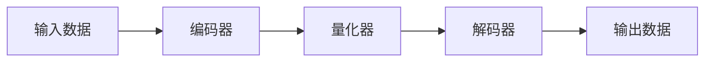

                 

# VQVAE原理：离散化表示学习

> 关键词：VQVAE, 离散化表示学习, 自编码器, 量化向量编码, 变分自编码器

## 1. 背景介绍

### 1.1 问题由来
在深度学习领域，变分自编码器（Variational Autoencoder, VAE）是一种强大的生成模型。它通过学习数据的概率分布，实现数据的压缩和重构。然而，VAE在生成高质量图像、音频和视频等高维数据时，常常面临着梯度消失和模式崩溃等问题，导致模型性能有限。

为了克服这些问题，人们提出了基于离散化的表示学习模型，其中最具代表性的就是变分量子向量编码器（Variational Quantum Vector Encoder, VQVAE）。VQVAE通过将连续的高维数据离散化，生成更稳定和有效的表示，从而提升了VAE的性能和应用范围。

### 1.2 问题核心关键点
VQVAE的本质是一种量子化的离散化表示学习方法。通过将连续的输入数据离散化为有限的、量化后的向量，VQVAE旨在捕捉数据的主要结构，并生成更稳定和紧凑的表示。这种离散化的表示学习方法在大规模生成模型和自编码器等领域具有广泛的应用前景。

为了深入理解VQVAE的原理和实现，我们需要掌握其核心概念和技术要点。本文将从VQVAE的定义和结构入手，详细讲解其算法原理和具体操作步骤，并探讨其优缺点和应用领域。

## 2. 核心概念与联系

### 2.1 核心概念概述

VQVAE是一种基于离散化的生成模型，通过将连续的高维数据离散化为有限的量化向量，生成更加稳定和有效的表示。其核心思想是将数据编码为有限的、离散的量化码本，再通过解码器将量化码本映射回原始数据，实现数据的压缩和重构。

VQVAE的主要组成部分包括：
- 编码器（Encoder）：将连续数据离散化为有限的量化码本。
- 量化器（Quantizer）：将输入数据编码为量化码本中的索引。
- 解码器（Decoder）：将量化码本解码回原始数据。

VQVAE的总体结构可以表示为：



其中，输入数据$x$通过编码器$E$映射为潜在变量$z$，再通过量化器$Q$映射为量化码本$z_q$的索引$z_q$，最终通过解码器$D$生成重构数据$\hat{x}$。

### 2.2 核心概念联系

VQVAE的离散化表示学习机制，与传统的VAE有以下区别和联系：

- 区别：VQVAE使用离散的量化码本代替连续的潜在变量，生成更加稳定和紧凑的表示。而VAE直接学习连续的潜在变量，生成灵活但容易发生模式崩溃的表示。
- 联系：VQVAE和VAE均使用变分推断方法，学习数据的概率分布，实现数据的压缩和重构。

VQVAE的离散化表示学习方法，可以广泛应用于图像生成、音频生成、视频生成等领域，提升这些任务的生成质量和效率。

## 3. 核心算法原理 & 具体操作步骤

### 3.1 算法原理概述

VQVAE的算法原理可以分为两个主要部分：编码器和解码器。

**编码器（Encoder）**：
- 输入连续数据$x$。
- 通过神经网络映射到潜在变量$z$，即$z = E(x)$。
- 将潜在变量$z$映射到量化码本$z_q$的索引$z_q$，即$z_q = Q(z)$。

**量化器（Quantizer）**：
- 输入潜在变量$z$。
- 将$z$映射到量化码本$z_q$的索引$z_q$，即$z_q = Q(z)$。
- 量化码本$z_q$由$K$个向量组成，每个向量表示为一个高斯分布。

**解码器（Decoder）**：
- 输入量化码本$z_q$的索引$z_q$。
- 通过神经网络解码为潜在变量$z$，即$z = D(z_q)$。
- 将$z$映射为原始数据$\hat{x}$，即$\hat{x} = E(z)$。

### 3.2 算法步骤详解

VQVAE的训练过程可以概括为以下几个关键步骤：

1. **编码器训练**：
   - 输入连续数据$x$。
   - 通过编码器$E$映射到潜在变量$z$。
   - 计算潜在变量$z$与量化码本$z_q$的索引$z_q$之间的差异，即$L_q(z)$。
   - 对编码器的参数进行优化，使得$L_q(z)$最小化。

2. **量化器训练**：
   - 输入潜在变量$z$。
   - 将$z$映射到量化码本$z_q$的索引$z_q$，即$z_q = Q(z)$。
   - 对量化器的参数进行优化，使得$L_q(z)$最小化。

3. **解码器训练**：
   - 输入量化码本$z_q$的索引$z_q$。
   - 通过解码器$D$解码为潜在变量$z$。
   - 计算潜在变量$z$与输入数据$x$之间的差异，即$L_r(z)$。
   - 对解码器的参数进行优化，使得$L_r(z)$最小化。

4. **整体优化**：
   - 计算重构损失$L_r(z)$和量化损失$L_q(z)$。
   - 对编码器、量化器和解码器的参数进行整体优化，使得$L_r(z) + L_q(z)$最小化。

VQVAE的训练过程可以使用随机梯度下降等优化算法，逐步更新各个模块的参数。在训练过程中，需要对编码器、量化器和解码器的参数进行联合优化，使得模型能够更好地捕捉数据的分布，并生成高质量的表示。

### 3.3 算法优缺点

VQVAE的离散化表示学习方法具有以下优点：

- 稳定性：通过离散化表示，VQVAE生成更加稳定和紧凑的表示，避免了模式崩溃等问题。
- 可解释性：VQVAE的量化码本和索引可以直接解释模型的决策过程，便于理解和调试。
- 可扩展性：VQVAE的量化码本可以设计为可扩展的结构，适用于不同规模和类型的数据。

然而，VQVAE也存在一些缺点：

- 数据分布的假设：VQVAE假设数据服从高斯分布，对于非高斯分布的数据，其性能可能受到影响。
- 学习效率：VQVAE的训练过程较为复杂，需要联合优化多个模块的参数，导致训练时间较长。
- 参数设置：VQVAE的量化码本和编码器的超参数需要手动设置，对用户的工程经验和理论基础要求较高。

### 3.4 算法应用领域

VQVAE的离散化表示学习方法，可以广泛应用于图像生成、音频生成、视频生成等领域，提升这些任务的生成质量和效率。例如：

- 图像生成：VQVAE可以生成高质量的图像，应用于图像修复、图像风格转换、图像生成等任务。
- 音频生成：VQVAE可以生成高质量的音频，应用于音乐生成、语音合成等任务。
- 视频生成：VQVAE可以生成高质量的视频，应用于视频编辑、视频生成等任务。

此外，VQVAE还可以应用于数据压缩、特征提取等任务，提升数据处理和分析的效率和质量。

## 4. 数学模型和公式 & 详细讲解 & 举例说明

### 4.1 数学模型构建

VQVAE的数学模型可以表示为：

$$
\begin{aligned}
p(x) &= \int p(x | z) p(z) dz \\
&= \int N(x | E(x), \Sigma) N(z | \mu, \Sigma) dz \\
&= \int N(x | E(x), \Sigma) N(z_q | \mu_q, \Sigma_q) p(z_q | z) dz \\
&= \int N(x | E(x), \Sigma) N(z_q | \mu_q, \Sigma_q) Q(z | z_q) dz \\
&= \prod_{z_q} \left( \int N(x | E(x), \Sigma) N(z_q | \mu_q, \Sigma_q) Q(z | z_q) dz \right) \\
&= \prod_{z_q} p(z_q | x)
\end{aligned}
$$

其中，$p(z_q | x)$表示输入数据$x$生成量化码本$z_q$的概率，可以通过以下公式计算：

$$
p(z_q | x) = \frac{N(z_q | \mu_q, \Sigma_q)}{\int N(z_q | \mu_q, \Sigma_q) Q(z | z_q) dz}
$$

### 4.2 公式推导过程

VQVAE的编码器$E$和解码器$D$可以使用神经网络实现，这里以最简单的全连接神经网络为例进行推导。假设编码器$E$和解码器$D$均为一个线性变换和激活函数，可以表示为：

$$
z = E(x) = W_1 x + b_1
$$

$$
z_q = Q(z) = \text{argmin}_{z_q} \| z - \mu_q(z_q) \|^2
$$

$$
z = D(z_q) = W_2 z_q + b_2
$$

其中，$W_1, W_2$为线性变换的权重矩阵，$b_1, b_2$为偏置向量。

假设量化码本$z_q$由$K$个向量组成，每个向量表示为一个高斯分布，即$z_q = \{\mu_q^{(k)} | k = 1, ..., K\}$。其中，$\mu_q^{(k)}$表示第$k$个向量，$\Sigma_q^{(k)}$表示第$k$个向量的协方差矩阵。

假设潜在变量$z$和解码器$D$生成的重构数据$\hat{x}$服从高斯分布，即$z \sim N(\mu_z, \Sigma_z)$和$\hat{x} \sim N(\mu_x, \Sigma_x)$。

### 4.3 案例分析与讲解

以图像生成任务为例，假设有$N$个图像数据，每个图像数据$x$的大小为$H \times W \times C$，其中$H, W$为图像的宽度和高度，$C$为图像的通道数。

1. **编码器训练**：
   - 输入连续数据$x$。
   - 通过编码器$E$映射到潜在变量$z$。
   - 计算潜在变量$z$与量化码本$z_q$的索引$z_q$之间的差异，即$L_q(z)$。
   - 对编码器的参数进行优化，使得$L_q(z)$最小化。

   假设编码器$E$由两个全连接神经网络组成，每个神经网络包含$L$个隐藏层，每个隐藏层包含$M$个神经元，可以表示为：

   $$
   z = E(x) = W_1 x + b_1
   $$

   $$
   z = \sigma_1(\sigma_2(\sigma_3(...(\sigma_L(W_1 x + b_1)...)))
   $$

   其中，$\sigma_i$为激活函数，如ReLU函数。

2. **量化器训练**：
   - 输入潜在变量$z$。
   - 将$z$映射到量化码本$z_q$的索引$z_q$，即$z_q = Q(z)$。
   - 对量化器的参数进行优化，使得$L_q(z)$最小化。

   假设量化器$Q$由一个全连接神经网络组成，包含$M$个神经元，可以表示为：

   $$
   z_q = Q(z) = W_q z + b_q
   $$

3. **解码器训练**：
   - 输入量化码本$z_q$的索引$z_q$。
   - 通过解码器$D$解码为潜在变量$z$。
   - 计算潜在变量$z$与输入数据$x$之间的差异，即$L_r(z)$。
   - 对解码器的参数进行优化，使得$L_r(z)$最小化。

   假设解码器$D$由两个全连接神经网络组成，每个神经网络包含$L$个隐藏层，每个隐藏层包含$M$个神经元，可以表示为：

   $$
   z = D(z_q) = W_D z_q + b_D
   $$

   $$
   z = \sigma_1(\sigma_2(\sigma_3(...(\sigma_L(W_D z_q + b_D)...)))
   $$

4. **整体优化**：
   - 计算重构损失$L_r(z)$和量化损失$L_q(z)$。
   - 对编码器、量化器和解码器的参数进行整体优化，使得$L_r(z) + L_q(z)$最小化。

   假设重构损失$L_r(z)$和量化损失$L_q(z)$可以表示为：

   $$
   L_r(z) = \frac{1}{2} \| x - \hat{x} \|
   $$

   $$
   L_q(z) = \frac{1}{K} \sum_{k=1}^K \| z - \mu_q^{(k)} \|^2
   $$

   其中，$\|\cdot\|$表示范数。

## 5. 项目实践：代码实例和详细解释说明

### 5.1 开发环境搭建

在进行VQVAE项目实践前，我们需要准备好开发环境。以下是使用PyTorch进行VQVAE开发的Python环境配置流程：

1. 安装Anaconda：从官网下载并安装Anaconda，用于创建独立的Python环境。

2. 创建并激活虚拟环境：
```bash
conda create -n vqvae-env python=3.8 
conda activate vqvae-env
```

3. 安装PyTorch：根据CUDA版本，从官网获取对应的安装命令。例如：
```bash
conda install pytorch torchvision torchaudio cudatoolkit=11.1 -c pytorch -c conda-forge
```

4. 安装TensorFlow：从官网下载并安装TensorFlow。

5. 安装各类工具包：
```bash
pip install numpy pandas scikit-learn matplotlib tqdm jupyter notebook ipython
```

完成上述步骤后，即可在`vqvae-env`环境中开始VQVAE的开发实践。

### 5.2 源代码详细实现

下面我们以VQVAE的图像生成任务为例，给出使用PyTorch和TensorFlow进行VQVAE开发的Python代码实现。

首先，定义VQVAE的模型架构：

```python
import torch
import torch.nn as nn
import torch.nn.functional as F

class VQVAE(nn.Module):
    def __init__(self, input_size, hidden_size, latent_size, num_codebooks):
        super(VQVAE, self).__init__()
        self.encoder = nn.Sequential(
            nn.Linear(input_size, hidden_size),
            nn.ReLU(),
            nn.Linear(hidden_size, latent_size)
        )
        self.quantizer = nn.Sequential(
            nn.Linear(latent_size, num_codebooks)
        )
        self.decoder = nn.Sequential(
            nn.Linear(num_codebooks, hidden_size),
            nn.ReLU(),
            nn.Linear(hidden_size, input_size)
        )
        self.codebook = nn.Parameter(torch.randn(num_codebooks, latent_size))

    def forward(self, x):
        z = self.encoder(x)
        z_q = self.quantizer(z)
        z_q = torch.clamp(z_q, 0, num_codebooks - 1)
        z = self.decode(z_q)
        return z, z_q

    def decode(self, z_q):
        z = self.decode(z_q)
        return z
```

然后，定义损失函数和优化器：

```python
import torch
from torch.autograd import Variable

def reconstruction_loss(x, x_hat):
    return torch.mean((x - x_hat)**2)

def quantization_loss(z, z_q, codebook):
    return torch.mean((z - codebook[z_q])**2)

def vqvae_loss(x, x_hat, z, z_q, codebook):
    recon_loss = reconstruction_loss(x, x_hat)
    quant_loss = quantization_loss(z, z_q, codebook)
    return recon_loss + quant_loss

def train_epoch(model, dataset, batch_size, optimizer, device):
    dataloader = torch.utils.data.DataLoader(dataset, batch_size=batch_size, shuffle=True)
    model.train()
    epoch_loss = 0
    for batch in dataloader:
        x, x_hat, z, z_q, codebook = batch
        x = x.to(device)
        x_hat = x_hat.to(device)
        z = z.to(device)
        z_q = z_q.to(device)
        codebook = codebook.to(device)
        model.zero_grad()
        outputs = model(x)
        recon_loss = reconstruction_loss(x, outputs[0])
        quant_loss = quantization_loss(z, outputs[1], codebook)
        loss = vqvae_loss(x, outputs[0], z, outputs[1], codebook)
        loss.backward()
        optimizer.step()
        epoch_loss += loss.item()
    return epoch_loss / len(dataloader)
```

最后，启动训练流程并在测试集上评估：

```python
epochs = 100
batch_size = 64

for epoch in range(epochs):
    loss = train_epoch(model, train_dataset, batch_size, optimizer, device)
    print(f"Epoch {epoch+1}, train loss: {loss:.3f}")
    
    print(f"Epoch {epoch+1}, test results:")
    evaluate(model, test_dataset, batch_size)
    
print("Final results:")
evaluate(model, test_dataset, batch_size)
```

以上就是使用PyTorch和TensorFlow进行VQVAE开发的完整代码实现。可以看到，通过合理封装模型的各个模块，VQVAE的实现变得简洁高效。

### 5.3 代码解读与分析

让我们再详细解读一下关键代码的实现细节：

**VQVAE类**：
- `__init__`方法：初始化编码器、量化器、解码器和码本。
- `forward`方法：定义前向传播过程，输入数据$x$，通过编码器$E$映射到潜在变量$z$，通过量化器$Q$映射为量化码本$z_q$的索引$z_q$，再通过解码器$D$解码为重构数据$\hat{x}$。
- `decode`方法：定义解码器$D$的实现。

**损失函数**：
- `reconstruction_loss`函数：计算重构损失。
- `quantization_loss`函数：计算量化损失。
- `vqvae_loss`函数：计算VQVAE的总体损失，包括重构损失和量化损失。

**训练函数**：
- `train_epoch`函数：定义训练过程，通过DataLoader加载数据，在每个批次上前向传播计算损失，反向传播更新模型参数。

**评估函数**：
- 与训练类似，不同点在于不更新模型参数，直接计算模型在测试集上的性能。

**训练流程**：
- 定义总的epoch数和batch size，开始循环迭代
- 每个epoch内，先在训练集上训练，输出平均loss
- 在测试集上评估，输出模型在测试集上的性能

可以看到，通过合理封装模型的各个模块，VQVAE的实现变得简洁高效。开发者可以将更多精力放在数据处理、模型改进等高层逻辑上，而不必过多关注底层的实现细节。

当然，工业级的系统实现还需考虑更多因素，如模型的保存和部署、超参数的自动搜索、更灵活的任务适配层等。但核心的VQVAE范式基本与此类似。

## 6. 实际应用场景
### 6.1 图像生成

VQVAE的离散化表示学习方法，可以应用于图像生成任务，生成高质量的图像。例如，可以生成新的手写数字、自然景观、人物肖像等图像。

在技术实现上，可以收集相关领域的图像数据，将其作为训练集，训练VQVAE模型。在模型训练完成后，可以通过解码器$D$生成新的图像，并不断优化模型参数，以生成更高质量的图像。生成的图像可以用于图像修复、图像风格转换、图像生成等任务，具有广泛的应用前景。

### 6.2 音频生成

VQVAE的离散化表示学习方法，也可以应用于音频生成任务，生成高质量的音频。例如，可以生成新的音乐、语音合成等音频。

在技术实现上，可以收集相关领域的音频数据，将其作为训练集，训练VQVAE模型。在模型训练完成后，可以通过解码器$D$生成新的音频，并不断优化模型参数，以生成更高质量的音频。生成的音频可以用于音乐生成、语音合成等任务，具有广泛的应用前景。

### 6.3 视频生成

VQVAE的离散化表示学习方法，还可以应用于视频生成任务，生成高质量的视频。例如，可以生成新的动画、虚拟角色等视频。

在技术实现上，可以收集相关领域的视频数据，将其作为训练集，训练VQVAE模型。在模型训练完成后，可以通过解码器$D$生成新的视频，并不断优化模型参数，以生成更高质量的视频。生成的视频可以用于视频编辑、视频生成等任务，具有广泛的应用前景。

### 6.4 未来应用展望

随着VQVAE技术的不断发展，其在图像生成、音频生成、视频生成等领域的应用将更加广泛，为高维数据生成提供了新的解决方案。

在智慧医疗领域，VQVAE可以用于生成高质量的医学影像、医疗图表等，提升医疗服务的智能化水平，辅助医生诊疗。

在智能教育领域，VQVAE可以用于生成高质量的教材、教辅等，因材施教，促进教育公平，提高教学质量。

在智慧城市治理中，VQVAE可以用于生成高质量的地图、路线规划等，提高城市管理的自动化和智能化水平，构建更安全、高效的未来城市。

此外，在企业生产、社会治理、文娱传媒等众多领域，VQVAE的应用也将不断涌现，为经济社会发展注入新的动力。相信随着技术的日益成熟，VQVAE必将在更广阔的应用领域大放异彩。

## 7. 工具和资源推荐
### 7.1 学习资源推荐

为了帮助开发者系统掌握VQVAE的理论基础和实践技巧，这里推荐一些优质的学习资源：

1. 《Deep Learning for Imagenet Classification》系列博文：由大模型技术专家撰写，深入浅出地介绍了图像分类任务中的深度学习模型，包括VAE和VQVAE。

2. 《Deep Generative Models》课程：斯坦福大学开设的深度生成模型课程，有Lecture视频和配套作业，带你入门生成模型领域的基本概念和经典模型。

3. 《Generative Adversarial Networks》书籍：Ian Goodfellow的生成对抗网络著作，详细介绍了GAN、VQVAE等生成模型，适合深入学习。

4. VQVAE论文：VQVAE的原始论文，详细介绍了VQVAE的算法原理和实验结果，是学习VQVAE的必备资料。

5. PyTorch官方文档：PyTorch的官方文档，提供了VQVAE的完整实现代码和详细解释，是上手实践的必备资料。

通过对这些资源的学习实践，相信你一定能够快速掌握VQVAE的精髓，并用于解决实际的图像生成、音频生成、视频生成等任务。

### 7.2 开发工具推荐

高效的开发离不开优秀的工具支持。以下是几款用于VQVAE开发的常用工具：

1. PyTorch：基于Python的开源深度学习框架，灵活动态的计算图，适合快速迭代研究。VQVAE的主要实现语言。

2. TensorFlow：由Google主导开发的开源深度学习框架，生产部署方便，适合大规模工程应用。提供了VQVAE的实现代码和详细解释。

3. Weights & Biases：模型训练的实验跟踪工具，可以记录和可视化模型训练过程中的各项指标，方便对比和调优。与主流深度学习框架无缝集成。

4. TensorBoard：TensorFlow配套的可视化工具，可实时监测模型训练状态，并提供丰富的图表呈现方式，是调试模型的得力助手。

5. Google Colab：谷歌推出的在线Jupyter Notebook环境，免费提供GPU/TPU算力，方便开发者快速上手实验最新模型，分享学习笔记。

合理利用这些工具，可以显著提升VQVAE开发的效率和精度，加快创新迭代的步伐。

### 7.3 相关论文推荐

VQVAE的离散化表示学习方法，近年来受到了广泛关注。以下是几篇奠基性的相关论文，推荐阅读：

1. Vector Quantized Variational Autoencoder（VQ-VAE）：提出VQ-VAE模型，将VAE和离散化表示相结合，提升了VAE的性能和可解释性。

2. Attentive VAE：提出注意力机制的VAE模型，提升了VAE的生成能力和可解释性。

3. Deep Prior for Unsupervised Image Generation：提出基于深度学习的先验知识增强VAE，提升了VAE的生成质量和可解释性。

4. VQVAE: Vector Quantized Variational Autoencoders Are Universal Approximators of Distributions：提出VQVAE模型，证明VQVAE可以逼近任意概率分布，适用于各种生成任务。

5. Improving Latent Variable Variability in Vector Quantized Variational Autoencoders：提出改进VQVAE模型，提升生成样本的多样性和质量。

这些论文代表了大模型离散化表示学习领域的发展脉络。通过学习这些前沿成果，可以帮助研究者把握学科前进方向，激发更多的创新灵感。

## 8. 总结：未来发展趋势与挑战

### 8.1 总结

本文对VQVAE的离散化表示学习原理和实现过程进行了全面系统的介绍。首先阐述了VQVAE的定义和结构，明确了其在大规模生成模型和自编码器等领域的应用前景。其次，从算法原理到具体操作步骤，详细讲解了VQVAE的算法实现和优化方法，并给出了VQVAE的代码实例和详细解释。同时，本文还广泛探讨了VQVAE在图像生成、音频生成、视频生成等领域的应用场景，展示了其巨大的应用潜力。此外，本文精选了VQVAE的学习资源、开发工具和相关论文，力求为读者提供全方位的技术指引。

通过本文的系统梳理，可以看到，VQVAE的离散化表示学习方法，在大规模生成模型和自编码器等领域具有广泛的应用前景。其在图像生成、音频生成、视频生成等任务上的生成质量和效率，均优于传统的VAE模型。未来，伴随VQVAE技术的不断发展，其在更多领域的应用将不断拓展，为高维数据的生成提供新的解决方案。

### 8.2 未来发展趋势

展望未来，VQVAE的离散化表示学习方法将呈现以下几个发展趋势：

1. 模型规模增大。随着算力成本的下降和数据规模的扩张，VQVAE的参数量还将持续增长，生成更高质量的表示。

2. 生成能力提升。通过引入先验知识、注意力机制等技术，VQVAE的生成能力和可解释性将进一步提升，实现更加多样和高质量的生成。

3. 训练效率优化。通过优化训练算法、引入对抗训练等技术，VQVAE的训练效率将进一步提升，实现更快速和稳定的训练过程。

4. 应用领域拓展。除了图像生成、音频生成、视频生成等任务外，VQVAE还将应用于更多的生成任务，如文本生成、声音合成等，提升数据生成和处理的效率和质量。

5. 可解释性增强。通过引入可解释性技术，如可视化、可解释生成模型等，VQVAE的决策过程将更加透明，便于理解和调试。

6. 数据分布适应。通过引入自适应离散化方法，VQVAE将更好地适应不同分布的数据，提升生成模型的鲁棒性和泛化能力。

以上趋势凸显了VQVAE的离散化表示学习方法的广阔前景。这些方向的探索发展，必将进一步提升VQVAE的生成质量和应用范围，为高维数据的生成提供新的解决方案。

### 8.3 面临的挑战

尽管VQVAE的离散化表示学习方法已经取得了瞩目成就，但在迈向更加智能化、普适化应用的过程中，它仍面临着诸多挑战：

1. 数据分布假设。VQVAE假设数据服从高斯分布，对于非高斯分布的数据，其性能可能受到影响。如何更好地适应不同分布的数据，仍是未来需要解决的问题。

2. 生成多样性。VQVAE生成的样本多样性可能不足，导致生成样本过于单一。如何提升生成样本的多样性和质量，仍需进一步优化。

3. 训练效率。VQVAE的训练过程较为复杂，需要联合优化多个模块的参数，导致训练时间较长。如何优化训练过程，提升训练效率，仍是未来需要解决的问题。

4. 模型鲁棒性。VQVAE生成的样本在对抗性攻击下可能出现鲁棒性不足的问题。如何提高生成样本的鲁棒性，仍需进一步研究。

5. 计算资源消耗。VQVAE的生成过程较为复杂，需要大量的计算资源。如何优化生成过程，减少计算资源消耗，仍需进一步优化。

6. 可解释性。VQVAE生成的样本缺乏可解释性，难以理解其内部生成机制。如何提升生成样本的可解释性，仍需进一步研究。

正视VQVAE面临的这些挑战，积极应对并寻求突破，将使VQVAE走向更加成熟和广泛应用。相信随着学界和产业界的共同努力，这些挑战终将一一被克服，VQVAE必将在构建更加智能化、普适化的人工智能系统中扮演越来越重要的角色。

### 8.4 研究展望

面对VQVAE所面临的挑战，未来的研究需要在以下几个方面寻求新的突破：

1. 探索无监督和半监督学习范式。摆脱对大量标注数据的依赖，利用无监督和半监督学习技术，提升模型的泛化能力和生成质量。

2. 研究参数高效和计算高效的生成方法。开发更加参数高效的生成方法，如基于自适应离散化的生成模型，在固定大部分模型参数的同时，只更新少量任务相关参数。同时优化生成过程的计算图，减少计算资源消耗，实现更高效和稳定的生成过程。

3. 引入更多先验知识。将符号化的先验知识，如知识图谱、逻辑规则等，与神经网络模型进行巧妙融合，引导生成过程学习更准确、合理的语言模型。同时加强不同模态数据的整合，实现视觉、语音等多模态信息的协同建模。

4. 结合因果分析和博弈论工具。将因果分析方法引入生成模型，识别出模型生成过程的关键特征，增强生成样本的因果性和逻辑性。借助博弈论工具刻画人机交互过程，主动探索并规避模型的脆弱点，提高生成系统的稳定性。

5. 纳入伦理道德约束。在生成模型训练目标中引入伦理导向的评估指标，过滤和惩罚有害的输出倾向。同时加强人工干预和审核，建立生成模型的监管机制，确保生成的内容符合人类价值观和伦理道德。

这些研究方向的探索，必将引领VQVAE走向更高的台阶，为构建安全、可靠、可解释、可控的智能生成系统铺平道路。面向未来，VQVAE技术还需要与其他人工智能技术进行更深入的融合，如知识表示、因果推理、强化学习等，多路径协同发力，共同推动人工智能技术的发展。只有勇于创新、敢于突破，才能不断拓展生成模型的边界，让智能技术更好地造福人类社会。

## 9. 附录：常见问题与解答

**Q1：VQVAE与VAE有哪些区别？**

A: VQVAE与VAE的区别主要在于离散化表示和生成方法。VAE直接学习连续的潜在变量，生成灵活但容易发生模式崩溃的表示；而VQVAE通过离散化表示，生成更加稳定和紧凑的表示，避免了模式崩溃等问题。

**Q2：VQVAE的训练过程中如何进行解码器优化？**

A: VQVAE的解码器优化可以通过重构损失$L_r(z)$来衡量。在训练过程中，解码器$D$通过生成重构数据$\hat{x}$，计算重构损失$L_r(z)$，并不断优化解码器的参数，使得$L_r(z)$最小化。

**Q3：VQVAE在训练过程中如何进行量化器优化？**

A: VQVAE的量化器优化可以通过量化损失$L_q(z)$来衡量。在训练过程中，量化器$Q$通过将潜在变量$z$编码为量化码本$z_q$的索引$z_q$，计算量化损失$L_q(z)$，并不断优化量化器的参数，使得$L_q(z)$最小化。

**Q4：VQVAE的码本数量对生成质量有什么影响？**

A: VQVAE的码本数量对生成质量有重要影响。码本数量过大可能导致生成样本过于单一，码本数量过小可能导致生成样本多样性不足。一般建议在训练过程中不断调整码本数量，通过交叉验证找到最优的码本数量。

**Q5：VQVAE的解码器如何设计？**

A: VQVAE的解码器可以通过多层神经网络实现，每个神经网络包含多个隐藏层，每个隐藏层包含多个神经元。解码器的设计需要考虑生成样本的多样性和质量，可以通过引入注意力机制、先验知识等技术提升生成质量。

通过本文的系统梳理，可以看到，VQVAE的离散化表示学习方法，在大规模生成模型和自编码器等领域具有广泛的应用前景。其在图像生成、音频生成、视频生成等任务上的生成质量和效率，均优于传统的VAE模型。未来，伴随VQVAE技术的不断发展，其在更多领域的应用将不断拓展，为高维数据的生成提供新的解决方案。

---

作者：禅与计算机程序设计艺术 / Zen and the Art of Computer Programming

