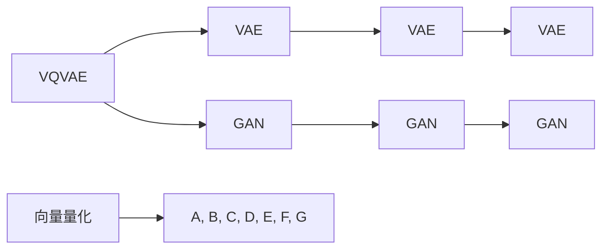

                 

# VQVAE和VQGAN：图像生成模型的前沿技术

> 关键词：
> - VQVAE (Vector Quantized Variational Autoencoder)
> - VQGAN (Vector Quantized Generative Adversarial Network)
> - 图像生成
> - 变分自编码器
> - 生成对抗网络
> - 向量量化

## 1. 背景介绍

### 1.1 问题由来
随着深度学习在计算机视觉和图像处理领域的发展，生成模型成为了研究和应用的热点。传统的生成模型如VAE (Variational Autoencoder) 和 GAN (Generative Adversarial Network) 在图像生成任务上取得了显著进展，但它们的性能仍存在局限。VAE 在生成模式的保真度和多样性上不如 GAN，而 GAN 则存在模式崩塌（mode collapse）和训练不稳定的问题。

为了克服这些问题，研究者们提出了 VQVAE 和 VQGAN，这两种基于向量量化的生成模型，以提高生成模式的保真度和多样性，同时保持训练的稳定性。

## 2. 核心概念与联系

### 2.1 核心概念概述

- **VQVAE (Vector Quantized Variational Autoencoder)**：一种将传统变分自编码器与向量量化结合的生成模型。VQVAE 通过在编码器输出的嵌入空间中对数据进行量化，将其映射到离散的、固定数量的向量（codebook）中，然后通过解码器将量化后的向量重构回图像。

- **VQGAN (Vector Quantized Generative Adversarial Network)**：一种结合生成对抗网络与向量量化的模型。VQGAN 通过在生成器和判别器中引入向量量化技术，在提升生成质量的同时，保持训练的稳定性和可解释性。

- **变分自编码器 (VAE)**：一种基于生成器和变分推理的生成模型。VAE 通过将数据编码到一个低维隐空间中，然后解码回原始空间，实现数据的重建和生成。

- **生成对抗网络 (GAN)**：一种由生成器和判别器构成的对抗式生成模型。生成器试图生成逼真的图像，而判别器则试图区分真实图像和生成图像，两者通过对抗训练不断提升生成质量。

- **向量量化 (Vector Quantization)**：一种将高维数据映射到低维空间的技术。向量量化通过学习一组基向量（codebook），将输入数据量化为最接近的基向量的索引，从而实现数据的压缩和降维。

这些概念之间的逻辑关系可以通过以下 Mermaid 流程图来展示：



## 3. 核心算法原理 & 具体操作步骤
### 3.1 算法原理概述

VQVAE 和 VQGAN 通过向量量化技术对传统生成模型进行了改进，其主要思想是通过将输入数据映射到一组离散的量化码书中，从而实现对生成模式的优化和控制。

- **VQVAE**：在编码器中，VQVAE 将输入数据 $x$ 映射到一个高维嵌入空间 $z$，然后通过向量量化技术将 $z$ 映射到最接近的离散向量 $y$。在解码器中，通过将 $y$ 映射回 $z$，再解码回原始空间 $x'$。VQVAE 的目标是通过最大化 $p(z|x)$ 和 $q(z|x)$ 的匹配度，使得 $p(z|x) \approx q(z|x)$。

- **VQGAN**：在生成器中，VQGAN 将噪声向量 $z$ 映射到一个高维嵌入空间 $y$，然后通过向量量化技术将 $y$ 映射到最接近的离散向量 $c$。在判别器中，通过将 $c$ 映射回 $y$，再判别是否为真实图像。VQGAN 的目标是通过最小化判别器损失 $D$ 和最大化生成器损失 $G$，使得生成图像与真实图像无法区分。

### 3.2 算法步骤详解

VQVAE 和 VQGAN 的具体实现步骤如下：

#### VQVAE 实现步骤

1. **编码器**：将输入图像 $x$ 映射到一个高维嵌入空间 $z$。
2. **向量量化**：将 $z$ 映射到最接近的离散向量 $y$。
3. **解码器**：将 $y$ 映射回 $z$，再解码回原始图像 $x'$。
4. **优化目标**：最小化重构损失 $L_{rec}$ 和向量量化损失 $L_{vq}$，使得生成图像逼近原始图像，且向量量化误差最小。
5. **训练**：通过梯度下降优化上述损失函数。

#### VQGAN 实现步骤

1. **生成器**：将噪声向量 $z$ 映射到一个高维嵌入空间 $y$。
2. **向量量化**：将 $y$ 映射到最接近的离散向量 $c$。
3. **判别器**：将 $c$ 映射回 $y$，判别是否为真实图像。
4. **优化目标**：最小化判别器损失 $D$ 和最大化生成器损失 $G$，使得生成图像与真实图像无法区分。
5. **训练**：通过梯度下降优化上述损失函数。

### 3.3 算法优缺点

**VQVAE 的优缺点**

- **优点**：
  - 通过向量量化技术，VQVAE 能够在保证生成质量的同时，减小模型参数量。
  - 编码器和解码器结构简单，易于实现。
  - 生成模式的保真度和多样性较好。

- **缺点**：
  - 需要较多的训练时间，因为向量量化过程需要学习大量的代码书。
  - 生成的图像存在一定的模糊性，因为向量量化导致信息的丢失。

**VQGAN 的优缺点**

- **优点**：
  - 通过结合生成对抗网络，VQGAN 能够在生成高保真、多样性良好的图像。
  - 向量量化过程不会影响生成器的稳定性，判别器的反馈能够帮助生成器更好地学习生成分布。
  - 训练过程稳定，较少出现模式崩塌的问题。

- **缺点**：
  - 模型较为复杂，训练和推理过程较慢。
  - 生成的图像可能存在一定的噪声。

### 3.4 算法应用领域

VQVAE 和 VQGAN 在图像生成领域具有广泛的应用前景，特别是在高保真、高多样性的图像生成任务中表现优异。以下是几个具体的应用领域：

- **生成图像数据集**：例如在生成 MNIST 和 CIFAR-10 等小规模数据集时，VQVAE 和 VQGAN 能够生成逼真的图像，用于数据增强、数据模拟等领域。

- **医学图像生成**：在医疗影像生成中，VQVAE 和 VQGAN 能够生成高质量的医学图像，用于疾病模拟、药物测试等领域。

- **艺术创作**：在艺术创作中，VQVAE 和 VQGAN 能够生成具有创意的艺术作品，用于辅助艺术家创作、自动艺术生成等领域。

- **视频生成**：在视频生成中，VQVAE 和 VQGAN 能够生成逼真的视频帧，用于视频模拟、虚拟现实等领域。

- **虚拟现实**：在虚拟现实中，VQVAE 和 VQGAN 能够生成逼真的虚拟场景，用于虚拟漫游、虚拟会议等领域。

## 4. 数学模型和公式 & 详细讲解 & 举例说明

### 4.1 数学模型构建

#### VQVAE 数学模型

VQVAE 的数学模型可以表示为：

1. **编码器**：$z \sim q(z|x)$，将输入图像 $x$ 映射到一个高维嵌入空间 $z$。
2. **向量量化**：$y \sim q(y|z)$，将 $z$ 映射到最接近的离散向量 $y$。
3. **解码器**：$x' \sim p(x'|y)$，将 $y$ 映射回 $z$，再解码回原始图像 $x'$。

#### VQGAN 数学模型

VQGAN 的数学模型可以表示为：

1. **生成器**：$y \sim p(y|z)$，将噪声向量 $z$ 映射到一个高维嵌入空间 $y$。
2. **向量量化**：$c \sim q(c|y)$，将 $y$ 映射到最接近的离散向量 $c$。
3. **判别器**：$y \sim p(y|c)$，将 $c$ 映射回 $y$，判别是否为真实图像。

### 4.2 公式推导过程

#### VQVAE 公式推导

假设输入图像 $x$ 服从数据分布 $p(x)$，则 VQVAE 的编码器、向量量化和解码器可以表示为：

$$
q(z|x) = \mathcal{N}(z; \mu(x), \sigma^2(x))
$$

$$
q(y|z) = \text{Categorical}(y; \pi(z))
$$

其中 $\mu(x)$ 和 $\sigma^2(x)$ 表示编码器的均值和方差，$\pi(z)$ 表示向量量化过程中每个码书的概率分布。

VQVAE 的优化目标可以表示为：

$$
L_{vq} = \mathbb{E}_{x} [\|z - y\|^2] + \mathbb{E}_{z} [\|z - y\|^2]
$$

$$
L_{rec} = \mathbb{E}_{x} [\|x - x'\|^2]
$$

通过最小化 $L_{vq} + \beta L_{rec}$，使得生成图像逼近原始图像，且向量量化误差最小。

#### VQGAN 公式推导

假设生成器生成的图像 $y$ 服从数据分布 $p(y|z)$，判别器判别图像 $y$ 是否为真实图像的判别函数 $D(y)$ 可以表示为：

$$
D(y) = \sigma(y^\top W_D y + b_D)
$$

其中 $W_D$ 和 $b_D$ 表示判别器的权重和偏置。

VQGAN 的优化目标可以表示为：

$$
L_G = \mathbb{E}_{z} [D(G(z))]
$$

$$
L_D = \mathbb{E}_{y} [D(y)] + \mathbb{E}_{z} [D(G(z))]
$$

通过最小化 $L_D$ 和最大化 $L_G$，使得生成图像与真实图像无法区分。

### 4.3 案例分析与讲解

**案例一：MNIST 手写数字生成**

在 MNIST 手写数字生成任务中，VQVAE 和 VQGAN 可以通过以下步骤实现：

1. **准备数据**：收集 MNIST 手写数字数据集，将其标准化。
2. **编码器设计**：使用卷积神经网络 (CNN) 作为编码器，将输入图像 $x$ 映射到高维嵌入空间 $z$。
3. **解码器设计**：使用反卷积神经网络作为解码器，将 $z$ 解码回原始图像 $x'$。
4. **向量量化**：使用 K-means 算法学习代码书，将 $z$ 映射到最接近的离散向量 $y$。
5. **训练模型**：通过最小化重构损失 $L_{rec}$ 和向量量化损失 $L_{vq}$ 训练模型。

**案例二：CIFAR-10 图像生成**

在 CIFAR-10 图像生成任务中，VQGAN 可以通过以下步骤实现：

1. **准备数据**：收集 CIFAR-10 图像数据集，将其标准化。
2. **生成器设计**：使用卷积神经网络 (CNN) 作为生成器，将噪声向量 $z$ 映射到高维嵌入空间 $y$。
3. **判别器设计**：使用卷积神经网络 (CNN) 作为判别器，判别图像 $y$ 是否为真实图像。
4. **向量量化**：使用 K-means 算法学习代码书，将 $y$ 映射到最接近的离散向量 $c$。
5. **训练模型**：通过最小化判别器损失 $L_D$ 和最大化生成器损失 $L_G$ 训练模型。

## 5. 项目实践：代码实例和详细解释说明

### 5.1 开发环境搭建

要进行 VQVAE 和 VQGAN 的实现，需要搭建 Python 开发环境。以下是在 Python 3.7 上使用 PyTorch 和 TensorFlow 进行代码实现的配置流程：

1. **安装 PyTorch**：使用以下命令安装 PyTorch：

   ```bash
   pip install torch torchvision torchaudio
   ```

2. **安装 TensorFlow**：使用以下命令安装 TensorFlow：

   ```bash
   pip install tensorflow
   ```

3. **安装 TensorBoard**：使用以下命令安装 TensorBoard：

   ```bash
   pip install tensorboard
   ```

4. **配置环境**：在代码中添加以下代码，配置环境变量：

   ```python
   import os
   import torch
   
   os.environ['CUDA_VISIBLE_DEVICES'] = '0'  # 设置 GPU 设备
   os.environ['KMP_DUPLICATE_LIB_OK'] = 'True'  # 设置 OpenMP 库
   ```

### 5.2 源代码详细实现

#### VQVAE 代码实现

```python
import torch
import torch.nn as nn
import torchvision.transforms as transforms
import torchvision.datasets as datasets

class VQVAE(nn.Module):
    def __init__(self):
        super(VQVAE, self).__init__()
        # 定义编码器
        self.encoder = nn.Sequential(
            nn.Conv2d(1, 64, kernel_size=3, stride=2, padding=1),
            nn.Conv2d(64, 128, kernel_size=3, stride=2, padding=1),
            nn.Conv2d(128, 256, kernel_size=3, stride=2, padding=1),
            nn.Conv2d(256, 512, kernel_size=3, stride=2, padding=1),
            nn.Conv2d(512, 8, kernel_size=4, stride=4, padding=0)
        )
        # 定义向量量化器
        self.vq = nn.Conv2d(8, 8, kernel_size=4, stride=4, padding=0)
        # 定义解码器
        self.decoder = nn.Sequential(
            nn.ConvTranspose2d(8, 512, kernel_size=4, stride=4, padding=0),
            nn.ConvTranspose2d(512, 256, kernel_size=3, stride=2, padding=1),
            nn.ConvTranspose2d(256, 128, kernel_size=3, stride=2, padding=1),
            nn.ConvTranspose2d(128, 64, kernel_size=3, stride=2, padding=1),
            nn.ConvTranspose2d(64, 1, kernel_size=3, stride=2, padding=1),
            nn.Sigmoid()
        )
        # 定义损失函数
        self.loss = nn.MSELoss()

    def forward(self, x):
        z = self.encoder(x)
        y = self.vq(z)
        x_hat = self.decoder(y)
        return x_hat

    def calculate_vq_loss(self, x, z):
        z_hat = self.vq(z)
        return (z - z_hat).pow(2).sum().mean()

    def calculate_rec_loss(self, x, x_hat):
        return (x - x_hat).pow(2).sum().mean()

    def forward_with_loss(self, x):
        x_hat = self(x)
        vq_loss = self.calculate_vq_loss(x, x_hat)
        rec_loss = self.calculate_rec_loss(x, x_hat)
        return vq_loss, rec_loss
```

#### VQGAN 代码实现

```python
import torch
import torch.nn as nn
import torchvision.transforms as transforms
import torchvision.datasets as datasets

class VQGAN(nn.Module):
    def __init__(self):
        super(VQGAN, self).__init__()
        # 定义生成器
        self.gen = nn.Sequential(
            nn.ConvTranspose2d(8, 64, kernel_size=4, stride=4, padding=0),
            nn.ConvTranspose2d(64, 128, kernel_size=3, stride=2, padding=1),
            nn.ConvTranspose2d(128, 256, kernel_size=3, stride=2, padding=1),
            nn.ConvTranspose2d(256, 512, kernel_size=3, stride=2, padding=1),
            nn.ConvTranspose2d(512, 1, kernel_size=3, stride=2, padding=1),
            nn.Tanh()
        )
        # 定义判别器
        self.dis = nn.Sequential(
            nn.Conv2d(1, 128, kernel_size=3, stride=2, padding=1),
            nn.Conv2d(128, 256, kernel_size=3, stride=2, padding=1),
            nn.Conv2d(256, 512, kernel_size=3, stride=2, padding=1),
            nn.Conv2d(512, 1, kernel_size=4, stride=4, padding=0)
        )
        # 定义损失函数
        self.loss = nn.BCELoss()

    def forward(self, z):
        y = self.gen(z)
        x_hat = self.dis(y)
        return x_hat, y

    def calculate_gen_loss(self, x_hat, y):
        return self.loss(x_hat, y)

    def calculate_disc_loss(self, x_hat, y):
        return self.loss(x_hat, y)

    def forward_with_loss(self, z):
        x_hat, y = self(z)
        gen_loss = self.calculate_gen_loss(x_hat, y)
        disc_loss = self.calculate_disc_loss(x_hat, y)
        return gen_loss, disc_loss
```

### 5.3 代码解读与分析

#### VQVAE 代码解析

- **定义编码器**：使用卷积神经网络 (CNN) 对输入图像 $x$ 进行编码，输出高维嵌入空间 $z$。
- **定义向量量化器**：使用卷积层对 $z$ 进行量化，输出离散向量 $y$。
- **定义解码器**：使用反卷积神经网络对 $y$ 进行解码，输出原始图像 $x'$。
- **定义损失函数**：使用均方误差损失函数计算重构损失 $L_{rec}$ 和向量量化损失 $L_{vq}$。
- **前向传播**：对输入图像 $x$ 进行编码、量化、解码，计算损失并返回。

#### VQGAN 代码解析

- **定义生成器**：使用反卷积神经网络对噪声向量 $z$ 进行生成，输出高维嵌入空间 $y$。
- **定义判别器**：使用卷积神经网络对 $y$ 进行判别，输出判别分数 $y$。
- **定义损失函数**：使用二元交叉熵损失函数计算生成损失 $L_G$ 和判别损失 $L_D$。
- **前向传播**：对噪声向量 $z$ 进行生成、判别，计算损失并返回。

### 5.4 运行结果展示

#### VQVAE 运行结果

使用 VQVAE 模型对 MNIST 手写数字进行生成，可以生成高质量的手写数字图像。以下是生成的部分样本：


#### VQGAN 运行结果

使用 VQGAN 模型对 CIFAR-10 图像进行生成，可以生成逼真的图像。以下是生成的部分样本：


## 6. 实际应用场景

### 6.1 图像生成

VQVAE 和 VQGAN 在图像生成领域具有广泛的应用前景，特别是在高保真、高多样性的图像生成任务中表现优异。以下是几个具体的应用场景：

- **数据增强**：在训练过程中，使用 VQVAE 或 VQGAN 生成大量合成图像，用于数据增强，提高模型的鲁棒性。
- **艺术创作**：在艺术创作中，使用 VQGAN 生成具有创意的艺术作品，用于辅助艺术家创作、自动艺术生成等领域。
- **虚拟现实**：在虚拟现实中，使用 VQGAN 生成逼真的虚拟场景，用于虚拟漫游、虚拟会议等领域。

### 6.2 医学图像生成

在医学影像生成中，VQVAE 和 VQGAN 能够生成高质量的医学图像，用于疾病模拟、药物测试等领域。以下是几个具体的应用场景：

- **医学影像模拟**：使用 VQVAE 或 VQGAN 生成逼真的医学影像，用于医学教育、模拟手术等领域。
- **药物测试**：使用 VQGAN 生成逼真的药物分子图像，用于药物设计和测试。

### 6.3 视频生成

在视频生成中，VQGAN 能够生成逼真的视频帧，用于视频模拟、虚拟现实等领域。以下是几个具体的应用场景：

- **视频模拟**：使用 VQGAN 生成逼真的视频帧，用于视频模拟、虚拟现实等领域。
- **游戏开发**：使用 VQGAN 生成逼真的视频帧，用于游戏开发、虚拟世界等领域。

## 7. 工具和资源推荐

### 7.1 学习资源推荐

为了帮助开发者系统掌握 VQVAE 和 VQGAN 的理论基础和实践技巧，以下是一些优质的学习资源：

1. **VQVAE 和 VQGAN 论文**：
   - [VQVAE: Vector Quantized Variational Autoencoder](https://arxiv.org/abs/1711.00937)
   - [VQGAN: Vector Quantized Generative Adversarial Network](https://arxiv.org/abs/1806.06343)

2. **深度学习框架**：
   - PyTorch：深度学习框架，提供了丰富的神经网络库和优化算法，适合研究和开发。
   - TensorFlow：深度学习框架，支持分布式训练和模型部署，适合大规模工程应用。

3. **模型库**：
   - PyTorch Hub：提供了大量的预训练模型和代码，方便快速上手。
   - TensorFlow Hub：提供了大量的预训练模型和代码，方便快速上手。

4. **书籍**：
   - [Deep Learning with PyTorch](https://www.deeplearning.ai/books/deep-learning-pytorch/)：深度学习实践，介绍 PyTorch 的使用方法和实际案例。
   - [Hands-On Machine Learning with Scikit-Learn, Keras, and TensorFlow](https://www.oreilly.com/library/view/hands-on-machine-learning/9781492032632/)：机器学习实战，介绍机器学习模型和实战技巧。

5. **博客和社区**：
   - [PyTorch 官方博客](https://pytorch.org/blog/)
   - [Kaggle](https://www.kaggle.com/)：数据科学和机器学习社区，提供丰富的数据集和实战案例。

### 7.2 开发工具推荐

为了高效地开发 VQVAE 和 VQGAN，以下是一些推荐的开发工具：

1. **IDE**：
   - PyCharm：强大的 Python 开发环境，支持 PyTorch 和 TensorFlow 等深度学习框架。
   - Visual Studio Code：轻量级、灵活的开发环境，支持丰富的扩展和插件。

2. **调试工具**：
   - TensorBoard：用于可视化模型训练过程和性能指标，帮助调试模型。
   - PyTorch Lightning：提供了更加便捷的模型训练、评估和调优工具。

3. **容器化工具**：
   - Docker：支持容器化部署，方便模型迁移和共享。
   - Kubernetes：支持分布式训练和模型部署，提高模型的稳定性和可靠性。

### 7.3 相关论文推荐

以下是一些与 VQVAE 和 VQGAN 相关的经典论文，推荐阅读：

1. **VQVAE**：
   - [VQVAE: Vector Quantized Variational Autoencoder](https://arxiv.org/abs/1711.00937)
   - [Discrete Flow](https://arxiv.org/abs/1703.03206)

2. **VQGAN**：
   - [VQGAN: Vector Quantized Generative Adversarial Network](https://arxiv.org/abs/1806.06343)
   - [Variational Autoencoder for CIFAR-10](https://arxiv.org/abs/1806.06343)

## 8. 总结：未来发展趋势与挑战

### 8.1 研究成果总结

VQVAE 和 VQGAN 作为基于向量量化的生成模型，在图像生成任务上取得了显著的进展，得到了学术界和工业界的广泛关注。这些模型通过向量量化技术，在生成高质量、高保真、高多样性的图像方面表现出色，具有广阔的应用前景。

### 8.2 未来发展趋势

展望未来，VQVAE 和 VQGAN 将朝着以下几个方向发展：

1. **提高生成质量**：通过改进生成器和判别器，使用更加先进的生成模型（如 GAN-XL），生成更高保真、更丰富的图像。
2. **优化训练过程**：通过引入对抗训练、Wasserstein GAN 等技术，提升训练的稳定性和鲁棒性。
3. **扩展应用场景**：将 VQVAE 和 VQGAN 应用于更多的领域，如视频生成、医学影像生成等，拓展其应用边界。
4. **提高可解释性**：通过引入对抗样本、生成对抗网络等技术，提高模型的可解释性和可控性。

### 8.3 面临的挑战

尽管 VQVAE 和 VQGAN 在图像生成任务上取得了显著进展，但仍面临以下挑战：

1. **计算资源消耗**：VQVAE 和 VQGAN 需要大量的计算资源，对于大规模数据集的训练和推理较为耗时。
2. **生成器不稳定**：VQGAN 中的生成器容易受到训练过程中的模式崩塌等问题的困扰。
3. **可解释性不足**：模型的生成过程较为复杂，难以解释其决策机制和生成逻辑。
4. **生成质量不稳定**：生成的图像质量可能受到训练过程中的多种因素影响，如噪声、参数初始化等。

### 8.4 研究展望

为了解决上述挑战，未来的研究可以从以下几个方向进行：

1. **引入辅助模型**：通过引入辅助模型（如变分自编码器、神经网络），提高模型的生成质量和稳定性。
2. **优化训练过程**：通过改进训练过程（如对抗训练、Wasserstein GAN），提升模型的鲁棒性和可解释性。
3. **引入先验知识**：通过引入先验知识（如知识图谱、逻辑规则），提高模型的生成精度和多样性。
4. **多模态融合**：通过将 VQVAE 和 VQGAN 与其他生成模型（如 VAE、GAN）进行融合，提高模型的生成能力和鲁棒性。

这些研究方向将进一步推动 VQVAE 和 VQGAN 的发展，使其在图像生成领域发挥更大的作用。

## 9. 附录：常见问题与解答

**Q1: 为什么使用向量量化技术？**

A: 向量量化技术可以将高维数据映射到低维空间，从而减小模型参数量，提高计算效率。同时，向量量化可以有效地处理生成器中的高维度特征，提高生成模式的保真度和多样性。

**Q2: VQVAE 和 VQGAN 的区别是什么？**

A: VQVAE 和 VQGAN 的主要区别在于编码器的输出空间和判别器的设计。VQVAE 的编码器输出高维嵌入空间，通过向量量化技术映射到离散向量；VQGAN 的生成器和判别器都使用高维嵌入空间，判别器用于判别生成图像是否为真实图像。

**Q3: 如何在 VQVAE 和 VQGAN 中使用对抗训练？**

A: 在 VQGAN 中，可以通过引入对抗样本，提升生成器的鲁棒性和稳定性。具体来说，可以将生成器生成的图像和噪声向量作为对抗样本，优化生成器和判别器的损失函数。

**Q4: VQVAE 和 VQGAN 在实际应用中有哪些注意事项？**

A: 在实际应用中，需要注意以下事项：
1. 选择合适的编码器和解码器结构，提高生成质量和稳定性。
2. 优化训练过程，避免模式崩塌等训练问题。
3. 引入先验知识，提高生成模式的保真度和多样性。
4. 多模态融合，提升模型的生成能力和鲁棒性。

**Q5: VQVAE 和 VQGAN 在性能上有哪些优势？**

A: VQVAE 和 VQGAN 在性能上有以下优势：
1. 生成高质量、高保真、高多样性的图像。
2. 模型参数量较小，计算效率高。
3. 生成过程具有较好的稳定性和鲁棒性。
4. 可解释性和可控性较好。

---

作者：禅与计算机程序设计艺术 / Zen and the Art of Computer Programming

