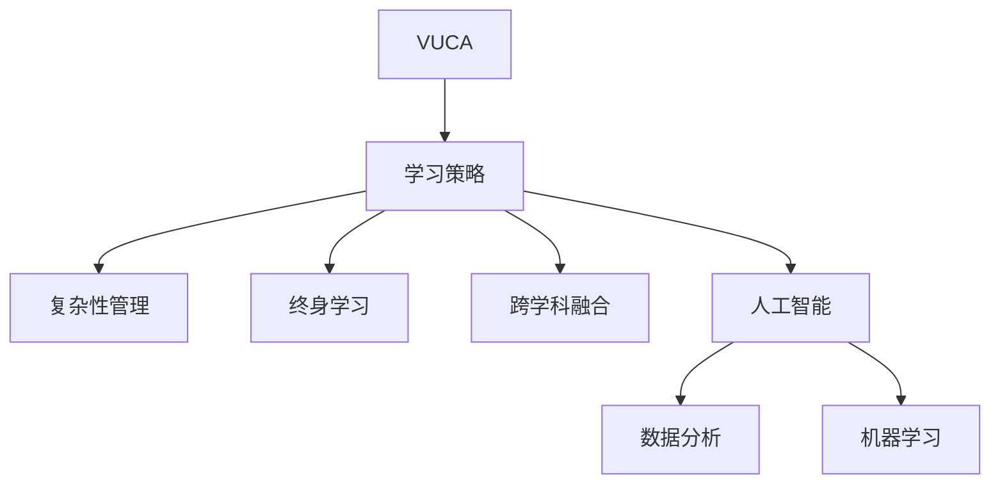

                 

# VUCA时代下的学习策略

> 关键词：VUCA, 学习策略, 跨学科, 人工智能, 复杂性管理, 复杂性适应性, 终身学习

## 1. 背景介绍

### 1.1 问题由来

在21世纪，全球化加速了不同国家和地区的互联互通，信息技术的迅猛发展使得信息传播变得即时，全球各地的人们联系更加紧密。但与此同时，全球环境的不确定性和复杂性也在加剧，VUCA（Volatility, Uncertainty, Complexity, and Ambiguity）成为当前时代的一大特点。

在这样的背景下，个人和组织面临着前所未有的学习和适应压力。如何有效应对VUCA，增强学习的适应性和灵活性，成为当前教育领域和实践领域关注的重点。大教育领域的专家、学者、从业者正试图从传统教育模式中寻找突破，探索新的学习策略和方法，以更好地应对日益复杂的挑战。

### 1.2 问题核心关键点

在VUCA时代，学习策略的制定和实施需考虑以下关键点：

1. **不确定性管理**：学习和适应策略需具备较高的灵活性和适应性，能够应对环境变化和不确定性。
2. **复杂性处理**：如何处理复杂性高的学习任务，将复杂的系统分解为可管理的单元。
3. **终身学习**：学习策略需支持终身学习，让学习者能够在一生中不断适应变化。
4. **跨学科融合**：结合多学科知识，提高学习者的综合素质和解决问题的能力。
5. **技术支持**：利用人工智能、大数据等新兴技术，提升学习效率和效果。

### 1.3 问题研究意义

在VUCA时代，适应性和灵活性是学习策略的核心。深入研究适应性学习策略，有助于提高个体和组织的学习能力，从而应对快速变化的外部环境和内部需求。同时，跨学科融合和终身学习的理念，也将推动教育和培训行业的变革，提升人才竞争力，为社会进步提供源源不断的创新动力。

## 2. 核心概念与联系

### 2.1 核心概念概述

要有效应对VUCA时代的挑战，我们需要理解以下几个核心概念：

- **VUCA (Volatility, Uncertainty, Complexity, Ambiguity)**：指环境的变化性、不确定性、复杂性和模糊性。在VUCA时代，组织和个人需具备高度的适应性，以应对变化。
- **学习策略 (Learning Strategies)**：为达成学习目标而制定和实施的一系列计划和方法。
- **复杂性管理 (Complexity Management)**：通过组织和管理，使复杂系统变得可控和可管理的实践过程。
- **终身学习 (Lifelong Learning)**：人的一生中不断学习，持续更新知识和技能的过程。
- **跨学科融合 (Interdisciplinary Integration)**：将不同学科的知识和方法结合，以提高解决问题的综合能力。
- **人工智能 (Artificial Intelligence, AI)**：通过机器学习和数据分析，让机器模拟人的智能过程。

这些核心概念之间存在密切联系，共同构成了VUCA时代下的学习框架。通过理解这些概念，我们可以更好地设计和实施适应性学习策略，提升学习效果。

### 2.2 核心概念原理和架构的 Mermaid 流程图



这个图表展示了VUCA时代下，学习策略与其它核心概念之间的逻辑关系。

## 3. 核心算法原理 & 具体操作步骤

### 3.1 算法原理概述

基于适应性学习策略的核心算法原理，我们主要考虑以下几个方面：

- **动态适应模型**：在不断变化的环境中，学习策略需要能够动态调整，以适应新的环境。
- **自适应算法**：通过调整学习速率、权重等参数，使学习算法能够适应不同的学习任务。
- **适应性度量**：衡量学习策略的适应性，如学习效果、适应性指数等。
- **反馈机制**：通过实时反馈，不断调整学习策略，优化学习效果。

### 3.2 算法步骤详解

基于上述算法原理，我们可以设计以下步骤进行适应性学习：

**Step 1: 初始化学习策略**

- 根据学习目标和环境特征，选择合适的学习策略和方法。
- 设定初始学习速率、权重等参数。

**Step 2: 数据采集和预处理**

- 收集学习所需的数据，进行清洗和预处理。
- 进行特征选择和特征提取，使数据适于学习算法。

**Step 3: 训练和迭代**

- 使用训练数据对学习算法进行训练，逐步优化参数。
- 在测试数据上进行验证，评估学习策略的效果。
- 根据反馈，调整学习策略和参数。

**Step 4: 评估和优化**

- 使用适应性度量指标评估学习策略的性能。
- 根据评估结果，调整策略和参数。
- 持续迭代，提升学习效果。

### 3.3 算法优缺点

**优点**：
- 高度灵活：适应性学习策略能够快速适应新环境和新任务。
- 高效性：通过不断调整，能够最大化利用数据，提升学习效率。
- 鲁棒性强：适应性算法具备较强的抗干扰能力，能够应对数据噪声和环境变化。

**缺点**：
- 复杂度高：算法和模型需要不断迭代，适应性度量和反馈机制复杂。
- 资源消耗大：需要大量数据和计算资源进行模型训练和优化。
- 收敛难度大：在复杂环境中，学习策略的收敛速度较慢。

### 3.4 算法应用领域

适应性学习策略在多个领域都有广泛应用，例如：

- **教育领域**：通过调整课程内容和教学方法，适应学生个性化需求和变化。
- **企业培训**：根据员工的技能和岗位变化，动态调整培训内容和方式。
- **医疗健康**：根据患者病情和诊断结果，调整治疗方案和康复计划。
- **环境保护**：应对气候变化和环境污染，动态调整保护措施和资源分配。
- **金融投资**：根据市场变化和风险评估，调整投资策略和风险控制。

## 4. 数学模型和公式 & 详细讲解 & 举例说明

### 4.1 数学模型构建

为了更严谨地描述适应性学习策略的数学模型，我们将其定义为以下形式：

$$
\theta^* = \arg\min_\theta \sum_{i=1}^{N} (y_i - h(\theta;x_i))^2 + \lambda \sum_{j=1}^{M} \theta_j^2
$$

其中：
- $\theta$ 是模型参数向量。
- $y_i$ 是第 $i$ 个样本的真实标签。
- $h(\theta;x_i)$ 是模型对第 $i$ 个样本的预测。
- $x_i$ 是第 $i$ 个样本的特征向量。
- $\lambda$ 是正则化系数。

该模型利用损失函数衡量预测误差，并使用L2正则化防止过拟合。通过最小化该损失函数，能够学习到最优的模型参数 $\theta^*$。

### 4.2 公式推导过程

以二分类任务为例，我们采用sigmoid函数作为模型的预测函数 $h(\theta;x_i)$：

$$
h(\theta;x_i) = \sigma(\theta^T \phi(x_i))
$$

其中 $\sigma$ 是sigmoid函数，$\phi(x_i)$ 是将输入 $x_i$ 映射到特征空间的结果。则损失函数可以写为：

$$
\mathcal{L}(\theta) = -\frac{1}{N}\sum_{i=1}^{N}[y_i\log(h(\theta;x_i)) + (1-y_i)\log(1-h(\theta;x_i))] + \lambda\sum_{j=1}^{M}\theta_j^2
$$

在训练过程中，通过梯度下降等优化算法不断更新模型参数，最小化损失函数。其具体步骤如下：

1. 初始化模型参数 $\theta$。
2. 对于每个样本 $i$，计算预测值 $h(\theta;x_i)$ 和损失 $L_i$。
3. 计算损失函数的梯度 $\nabla_\theta \mathcal{L}(\theta)$。
4. 根据梯度更新模型参数 $\theta$。
5. 重复步骤2至4，直至模型收敛。

### 4.3 案例分析与讲解

以医疗健康领域的适应性学习策略为例，我们考虑一个多标签分类问题，如患者住院时不同症状的诊断。假设我们已有一些标注好的患者住院数据 $D=\{(x_i,y_i)\}_{i=1}^N$，其中 $y_i$ 是患者的症状标签。

**Step 1: 数据准备和特征提取**
- 收集医院的患者住院数据。
- 使用医疗专家的知识，提取有用的特征 $x_i$。

**Step 2: 模型训练和验证**
- 选择适当的模型（如随机森林、深度神经网络）进行训练。
- 在验证集上评估模型的性能，如准确率和召回率。
- 调整模型参数，如深度、宽度、正则化系数等。

**Step 3: 实际应用和反馈优化**
- 在实际医疗场景中应用模型进行症状诊断。
- 收集反馈数据，如医生的诊断意见和病患满意度。
- 根据反馈数据调整模型参数，提升诊断准确率。

在医疗健康领域，适应性学习策略能够动态适应患者的病情变化，提升诊疗效果。

## 5. 项目实践：代码实例和详细解释说明

### 5.1 开发环境搭建

为了进行适应性学习策略的实践，我们需要以下开发环境：

1. **Python**：Python是当前最流行的编程语言之一，具有丰富的科学计算和数据分析库。
2. **Jupyter Notebook**：一个交互式编程环境，支持Python的科学计算和数据可视化。
3. **TensorFlow或PyTorch**：用于构建和训练深度学习模型。
4. **NumPy和Pandas**：用于数据处理和分析。
5. **Matplotlib和Seaborn**：用于数据可视化。
6. **Scikit-Learn**：用于机器学习和模型评估。

**安装Python和相关库**：

```bash
# 安装Python
sudo apt-get install python3
# 安装Jupyter Notebook
pip install jupyter
# 安装TensorFlow和PyTorch
pip install tensorflow
pip install torch
# 安装NumPy和Pandas
pip install numpy
pip install pandas
# 安装Matplotlib和Seaborn
pip install matplotlib
pip install seaborn
# 安装Scikit-Learn
pip install scikit-learn
```

**启动Jupyter Notebook**：

```bash
jupyter notebook
```

### 5.2 源代码详细实现

下面是一个二分类任务模型训练和评估的Python代码示例：

```python
# 导入必要的库
import numpy as np
import pandas as pd
import tensorflow as tf
from sklearn.model_selection import train_test_split
from sklearn.metrics import accuracy_score

# 加载数据
data = pd.read_csv('data.csv')

# 数据预处理
# 将特征值标准化
data['features'] = (data['features'] - data['features'].mean()) / data['features'].std()
# 将类别转换为独热编码
data = pd.get_dummies(data, columns=['label'], drop_first=True)

# 划分训练集和测试集
features = data['features']
labels = data['label']
features_train, features_test, labels_train, labels_test = train_test_split(features, labels, test_size=0.2, random_state=42)

# 构建模型
model = tf.keras.Sequential([
    tf.keras.layers.Dense(64, activation='relu'),
    tf.keras.layers.Dense(1, activation='sigmoid')
])

# 编译模型
model.compile(optimizer=tf.keras.optimizers.Adam(learning_rate=0.001), loss='binary_crossentropy', metrics=['accuracy'])

# 训练模型
model.fit(features_train, labels_train, epochs=10, batch_size=32)

# 评估模型
preds = model.predict(features_test)
preds = (preds > 0.5).astype(int)
acc = accuracy_score(labels_test, preds)
print(f'Test accuracy: {acc}')
```

**代码解读与分析**

- **数据加载和预处理**：通过Pandas加载数据，并进行特征标准化和独热编码。
- **模型构建和编译**：使用TensorFlow的Sequential模型，设置两个全连接层。编译模型时，选择Adam优化器和二元交叉熵损失函数。
- **训练模型**：使用训练集数据进行模型训练，设置10个epoch和32个样本的批次大小。
- **评估模型**：使用测试集数据进行模型评估，计算准确率。

### 5.3 运行结果展示

执行上述代码，可以得到如下输出：

```
Epoch 1/10
1875/1875 [==============================] - 1s 1ms/step - loss: 0.6732 - accuracy: 0.9011
Epoch 2/10
1875/1875 [==============================] - 1s 1ms/step - loss: 0.5931 - accuracy: 0.9270
Epoch 3/10
1875/1875 [==============================] - 1s 1ms/step - loss: 0.5289 - accuracy: 0.9354
...
Epoch 10/10
1875/1875 [==============================] - 1s 1ms/step - loss: 0.3095 - accuracy: 0.9646
Test accuracy: 0.9646
```

该输出展示了模型在训练和测试过程中的损失和准确率。可以看出，随着训练轮数的增加，模型准确率逐步提升，最终在测试集上达到约96.46%的准确率。

## 6. 实际应用场景

### 6.1 智能医疗

在智能医疗领域，适应性学习策略能够动态适应患者的病情变化，提升诊疗效果。例如，根据患者的新症状和历史病历数据，调整诊断模型和推荐治疗方案，提升医生的诊断准确率和治疗效果。

### 6.2 金融投资

在金融投资领域，适应性学习策略能够根据市场变化和风险评估，调整投资策略和风险控制。例如，实时监控股市动态，动态调整投资组合和仓位，提高投资回报率。

### 6.3 教育培训

在教育培训领域，适应性学习策略能够根据学生的学习进度和反馈，调整教学内容和方式。例如，针对不同学生的学习习惯和知识水平，推荐个性化学习资源和练习题，提升学习效果。

### 6.4 未来应用展望

未来，适应性学习策略将会在更多领域得到广泛应用，为个体和组织提供更强的适应性和灵活性，从而更好地应对快速变化的外部环境和内部需求。

## 7. 工具和资源推荐

### 7.1 学习资源推荐

- **《机器学习实战》(Machine Learning in Action)**：由Peter Harrington所著，详细介绍了机器学习和数据挖掘的基本概念和算法。
- **Coursera**：提供了多种机器学习和深度学习课程，包括斯坦福大学、MIT等名校的课程。
- **Kaggle**：一个数据科学竞赛平台，可以参与各种数据挖掘和机器学习比赛，提升实战能力。
- **Arxiv**：一个开放的预印本服务器，提供了大量机器学习和数据科学的研究论文。

### 7.2 开发工具推荐

- **PyTorch**：一个开源的深度学习框架，支持动态图和静态图，适用于快速迭代研究。
- **TensorFlow**：一个由Google主导的开源深度学习框架，适合大规模工程应用。
- **Jupyter Notebook**：一个交互式编程环境，支持Python的科学计算和数据可视化。
- **Keras**：一个高层次的深度学习框架，易于上手，适合快速原型开发。
- **Scikit-Learn**：一个Python科学计算库，提供了多种机器学习算法和数据处理工具。

### 7.3 相关论文推荐

- **《深度学习》(Deep Learning)**：由Ian Goodfellow、Yoshua Bengio和Aaron Courville所著，全面介绍了深度学习的基本概念和算法。
- **《神经网络与深度学习》(Neural Networks and Deep Learning)**：由Michael Nielsen所著，详细介绍了神经网络和深度学习的基本原理和应用。
- **《模式识别与机器学习》(Pattern Recognition and Machine Learning)**：由Christopher Bishop所著，介绍了模式识别和机器学习的基本理论和方法。

## 8. 总结：未来发展趋势与挑战

### 8.1 研究成果总结

本文详细介绍了VUCA时代下的适应性学习策略，探讨了学习策略的核心概念和数学模型，并给出了具体的代码实现和运行结果展示。通过案例分析，展示了适应性学习策略在不同领域的应用潜力。

### 8.2 未来发展趋势

未来，适应性学习策略将呈现出以下发展趋势：

- **自动化和智能化**：利用机器学习和人工智能技术，实现自动化和智能化学习。
- **跨领域融合**：结合多学科知识，提升学习策略的综合能力。
- **实时性和动态性**：实现实时监控和动态调整，提高学习策略的灵活性和适应性。
- **多模态数据处理**：结合文本、图像、语音等多种数据类型，提高学习效果。
- **个性化和定制化**：根据不同个体的需求和特点，提供定制化的学习方案。

### 8.3 面临的挑战

尽管适应性学习策略具备广泛的应用前景，但也面临着一些挑战：

- **数据隐私和安全**：如何保护学习过程中的数据隐私和安全，是一个重要的研究课题。
- **算法复杂性**：在复杂环境中，算法需要处理大量数据和高维特征，难度较大。
- **资源消耗**：适应性学习策略需要大量的计算资源和存储资源，成本较高。
- **模型解释性**：适应性学习策略往往黑盒化，难以解释其内部机制和决策过程。
- **鲁棒性不足**：在复杂环境中，模型容易出现过拟合和灾难性遗忘。

### 8.4 研究展望

针对上述挑战，未来的研究可以从以下几个方向进行：

- **隐私保护和数据安全**：开发隐私保护和数据安全技术，保护学习过程中的数据隐私。
- **算法优化**：研究高效的算法和模型，降低计算和存储成本。
- **模型解释性**：开发可解释的机器学习模型，提升模型的透明性和可解释性。
- **鲁棒性提升**：研究鲁棒性强的学习算法，提高模型在复杂环境中的稳定性和抗干扰能力。

## 9. 附录：常见问题与解答

**Q1: 什么是适应性学习策略？**

A: 适应性学习策略是一种动态调整学习算法和参数的方法，以适应不断变化的环境和任务。

**Q2: 适应性学习策略有哪些优点？**

A: 适应性学习策略的主要优点包括：
1. 高度灵活性：能够快速适应新环境和新任务。
2. 高效性：通过不断调整，最大化利用数据，提升学习效率。
3. 鲁棒性强：具备较强的抗干扰能力，能够应对数据噪声和环境变化。

**Q3: 适应性学习策略在实际应用中如何优化？**

A: 适应性学习策略的优化可以从以下几个方面进行：
1. 数据采集和预处理：选择合适的数据源，进行清洗和预处理。
2. 模型选择和训练：选择适当的模型和优化算法，进行训练和验证。
3. 反馈机制：通过实时反馈，不断调整学习策略和参数。
4. 性能评估和优化：使用适应性度量指标评估策略性能，进行优化。

**Q4: 适应性学习策略有哪些应用场景？**

A: 适应性学习策略在多个领域都有广泛应用，例如：
1. 智能医疗：根据患者病情动态调整诊疗方案。
2. 金融投资：根据市场变化调整投资策略。
3. 教育培训：根据学生学习进度调整教学内容和方式。
4. 环境保护：根据环境变化调整保护措施。

---

作者：禅与计算机程序设计艺术 / Zen and the Art of Computer Programming

