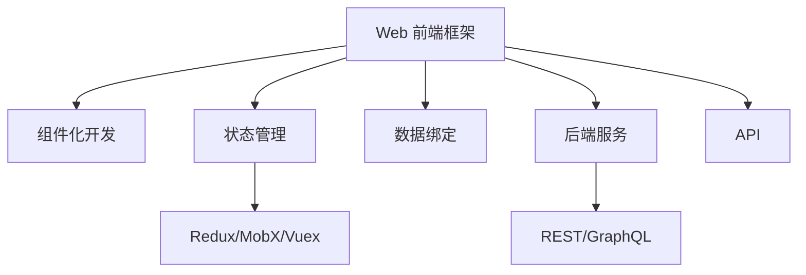

                 

# Web 前端框架高级应用：构建复杂和可扩展的界面

## 1. 背景介绍

随着Web技术的不断发展，前端框架已经成为现代Web开发不可或缺的工具。从早期的DOM操作，到jQuery等框架的兴起，再到现代React、Vue等框架的普及，前端技术不断演进，带来了开发效率和用户体验的大幅提升。特别是大前端框架如React、Vue等，凭借其组件化、可复用、高性能等特性，成为构建复杂和可扩展界面的首选。

然而，随着应用的复杂度不断提高，仅仅使用前端框架已经难以应对业务逻辑和交互逻辑的深度耦合。如何将前端框架的强大能力与后端服务进行高效协同，构建稳定、可靠、可维护的Web应用，成为当前前端开发者面临的主要挑战。本文旨在介绍Web前端框架的高级应用，探讨如何利用前端框架构建复杂和可扩展的界面，以及如何在实际应用中实现前端和后端的无缝集成。

## 2. 核心概念与联系

### 2.1 核心概念概述

为更好地理解Web前端框架的高级应用，本节将介绍几个密切相关的核心概念：

- **Web 前端框架**：如React、Vue、Angular等，提供组件化开发、状态管理、数据绑定等功能，极大提高了前端开发的效率和可维护性。
- **组件化开发**：将UI界面拆分为多个独立的组件，每个组件负责独立功能，通过组合实现复杂界面。
- **状态管理**：用于管理组件间的数据传递和状态同步，常见的状态管理工具包括Redux、MobX、Vuex等。
- **数据绑定**：将组件的状态和UI界面绑定，当数据变化时自动更新UI，提升用户体验。
- **后端服务**：提供数据处理、业务逻辑实现等功能，与前端进行交互。
- **API**：用于前端和后端通信的接口，常见的API协议包括REST、GraphQL等。
- **全栈开发**：前端和后端的技术栈整合，通常使用同一技术栈或相似技术栈，实现无缝集成。

这些核心概念之间的逻辑关系可以通过以下Mermaid流程图来展示：



这个流程图展示了一些核心概念的逻辑关系：

1. 前端框架为组件化开发、状态管理和数据绑定提供基础支持。
2. 组件化开发通过组合多个独立的组件，实现复杂界面。
3. 状态管理用于同步组件间的数据状态，确保状态一致性。
4. 数据绑定确保数据和UI同步更新，提升用户体验。
5. 后端服务提供数据处理和业务逻辑，与前端进行数据交互。
6. API是前端和后端通信的接口，常见的API协议包括REST和GraphQL。
7. 全栈开发实现前后端技术栈整合，提升开发效率和系统稳定性。

## 3. 核心算法原理 & 具体操作步骤
### 3.1 算法原理概述

Web前端框架的高级应用主要涉及两个方面：组件化开发和状态管理。以下将详细阐述这两个方面的算法原理及其操作步骤。

### 3.2 算法步骤详解

#### 3.2.1 组件化开发

组件化开发是通过将UI界面拆分为独立的组件，每个组件负责独立功能，通过组合实现复杂界面的过程。以下是一个简单的步骤：

1. **分析界面结构**：将UI界面拆分为独立的模块，每个模块负责独立功能。如一个电商应用，可以分为商品展示、购物车、结算页等模块。

2. **设计组件结构**：为每个模块设计组件结构，包括组件的输入、输出和状态。如商品展示组件需要展示商品列表，需要输入商品数据，输出商品列表和操作按钮，状态包括当前筛选条件和排序方式。

3. **实现组件功能**：为每个组件编写具体的业务逻辑和UI实现。如商品展示组件需要调用API获取商品数据，并将数据展示到页面上。

4. **组合组件**：将各个组件通过组合方式实现复杂界面。如电商应用可以通过组合商品展示组件、购物车组件、结算页组件等，实现完整的电商功能。

#### 3.2.2 状态管理

状态管理用于管理组件间的数据传递和状态同步，常见的状态管理工具包括Redux、MobX、Vuex等。以下是一个简单的状态管理步骤：

1. **分析组件依赖关系**：分析各个组件之间的数据依赖关系，确定哪些数据需要共享和管理。如电商应用中的商品数据、用户数据、购物车数据等。

2. **设计状态结构**：为共享状态设计数据结构，包括数据类型、存储位置和更新方式。如商品数据可以存储在状态中，通过修改状态来更新UI。

3. **实现状态更新**：为状态设计更新方法，确保状态更新对UI的影响最小化。如商品数据更新时，只更新需要展示的商品列表，而不影响其他页面。

4. **使用状态管理工具**：选择一个合适的状态管理工具，将状态管理逻辑封装起来。如使用Redux，通过Action、Reducer、Store等概念实现状态管理。

5. **同步组件状态**：将组件与状态进行绑定，当状态发生变化时，自动更新UI。如商品展示组件的展示列表根据状态中的商品数据更新。

### 3.3 算法优缺点

组件化开发和状态管理各有优缺点：

**组件化开发**：

优点：
1. 提升开发效率：通过组件化开发，可以快速构建复杂界面。
2. 提升可维护性：通过组件化开发，各个模块独立开发和维护，便于扩展和修改。
3. 提升代码复用性：通过组件化开发，可以复用已有的组件，减少代码冗余。

缺点：
1. 组件间通信复杂：组件间需要传递大量数据，容易导致数据混乱和错误。
2. 状态管理复杂：需要设计好组件之间的依赖关系，确保状态一致性。
3. 学习成本高：需要学习新的开发模式和工具，增加开发难度。

**状态管理**：

优点：
1. 提升数据一致性：通过状态管理，确保各个组件的数据一致性。
2. 提升开发效率：通过状态管理，减少了重复的数据处理逻辑。
3. 提升可维护性：通过状态管理，便于追踪和调试数据变化。

缺点：
1. 学习成本高：需要学习新的状态管理工具和概念。
2. 状态更新复杂：需要设计好状态更新方法，确保最小化对UI的影响。
3. 性能开销大：状态管理工具会增加额外的性能开销。

### 3.4 算法应用领域

组件化开发和状态管理技术广泛应用于各种Web应用开发中，以下是一些具体的应用领域：

1. **电商平台**：电商平台需要展示大量商品数据，通过组件化开发和状态管理，可以实现商品列表、购物车、结算页等复杂界面。
2. **社交应用**：社交应用需要实时更新消息和用户状态，通过状态管理，可以实现消息列表、好友列表、聊天界面等复杂界面。
3. **企业管理系统**：企业管理系统需要展示大量的业务数据，通过组件化开发和状态管理，可以实现报表、任务列表、日历等复杂界面。
4. **在线教育平台**：在线教育平台需要展示大量的课程和学生数据，通过组件化开发和状态管理，可以实现课程列表、作业提交、考试界面等复杂界面。

## 4. 数学模型和公式 & 详细讲解 & 举例说明

### 4.1 数学模型构建

在Web前端框架的高级应用中，数学模型通常用于描述组件间的数据传递和状态同步。以下是一个简单的数学模型：

假设电商应用中有商品展示组件和购物车组件，它们共享商品数据。设商品数据为`item`，商品展示组件的状态为`itemList`，购物车组件的状态为`cartList`。则状态管理模型可以表示为：

$$
itemList = itemList \cup item
$$

其中`itemList`表示所有展示的商品列表，`item`表示新增的商品数据。当`item`更新时，`itemList`也会相应更新。

### 4.2 公式推导过程

根据状态管理模型，可以推导出状态更新公式：

1. **添加商品**：当添加新商品时，需要将商品数据添加到`itemList`中。
2. **更新商品**：当更新商品信息时，需要将商品数据更新到`itemList`中。
3. **删除商品**：当删除商品时，需要从`itemList`中移除商品数据。

例如，当添加新商品时，状态更新公式为：

$$
itemList = itemList + item
$$

其中`+`表示添加操作，即在`itemList`中添加一个新商品。

### 4.3 案例分析与讲解

**案例1：电商应用的商品展示和购物车**

电商应用中，商品展示组件和购物车组件共享商品数据。假设用户点击一个商品后，需要将该商品添加到购物车中。

**步骤1：** 设计组件结构

```
商品展示组件：
- 展示商品列表
- 商品详情

购物车组件：
- 显示购物车列表
- 添加商品
```

**步骤2：** 实现组件功能

```javascript
// 商品展示组件
class ItemListComponent extends React.Component {
    constructor(props) {
        super(props);
        this.state = { itemList: [] };
    }

    componentDidMount() {
        fetchItems();
    }

    render() {
        const { itemList } = this.state;
        return (
            <div>
                <ul>
                    {itemList.map(item => (
                        <li key={item.id}>{item.name}</li>
                    ))}
                </ul>
                <ItemDetailComponent />
            </div>
        );
    }
}

// 购物车组件
class CartComponent extends React.Component {
    constructor(props) {
        super(props);
        this.state = { cartList: [] };
    }

    componentDidMount() {
        fetchCart();
    }

    render() {
        const { cartList } = this.state;
        return (
            <div>
                <h2>购物车</h2>
                <ul>
                    {cartList.map(item => (
                        <li key={item.id}>{item.name}</li>
                    ))}
                </ul>
                <button onClick={() => addToCart(item)}>Add to cart</button>
            </div>
        );
    }
}
```

**步骤3：** 实现状态管理

```javascript
// 状态管理工具：Redux
import { createStore } from 'redux';

// 状态更新函数：
const reducer = (state = { itemList: [], cartList: [] }, action) => {
    switch (action.type) {
        case 'ADD_ITEM':
            return { ...state, itemList: [...state.itemList, action.payload] };
        case 'ADD_TO_CART':
            return { ...state, cartList: [...state.cartList, action.payload] };
        default:
            return state;
    }
};

// 创建 Redux store
const store = createStore(reducer);
```

通过Redux，商品展示组件和购物车组件可以共享商品数据，当用户点击商品时，触发`addToCart`操作，状态更新函数将商品添加到购物车列表中，并更新UI。

**案例2：社交应用的聊天记录**

社交应用中，聊天记录需要实时更新。假设用户发送了一条消息，需要将该消息添加到聊天记录中。

**步骤1：** 设计组件结构

```
消息展示组件：
- 展示聊天记录
- 添加新消息

消息输入框：
- 输入消息
```

**步骤2：** 实现组件功能

```javascript
// 消息展示组件
class MessageListComponent extends React.Component {
    constructor(props) {
        super(props);
        this.state = { messageList: [] };
    }

    componentDidMount() {
        fetchMessages();
    }

    render() {
        const { messageList } = this.state;
        return (
            <div>
                <ul>
                    {messageList.map(message => (
                        <li key={message.id}>{message.text}</li>
                    ))}
                </ul>
                <MessageInputComponent />
            </div>
        );
    }
}

// 消息输入框组件
class MessageInputComponent extends React.Component {
    constructor(props) {
        super(props);
        this.state = { inputText: '' };
    }

    handleInputChange = event => {
        this.setState({ inputText: event.target.value });
    };

    handleSubmit = () => {
        const { inputText } = this.state;
        if (inputText) {
            sendMessage(inputText);
            this.setState({ inputText: '' });
        }
    };

    render() {
        const { inputText } = this.state;
        return (
            <div>
                <input type="text" value={inputText} onChange={this.handleInputChange} />
                <button onClick={this.handleSubmit}>Send</button>
            </div>
        );
    }
}
```

**步骤3：** 实现状态管理

```javascript
// 状态管理工具：Redux
import { createStore } from 'redux';

// 状态更新函数：
const reducer = (state = { messageList: [] }, action) => {
    switch (action.type) {
        case 'SEND_MESSAGE':
            return { ...state, messageList: [...state.messageList, action.payload] };
        default:
            return state;
    }
};

// 创建 Redux store
const store = createStore(reducer);
```

通过Redux，消息展示组件可以实时更新聊天记录，当用户发送消息时，触发`sendMessage`操作，状态更新函数将消息添加到聊天记录中，并更新UI。

## 5. 项目实践：代码实例和详细解释说明

### 5.1 开发环境搭建

在Web前端框架高级应用中，开发环境通常包括前端框架、状态管理工具、API工具等。以下是常用的开发环境搭建步骤：

1. **安装Node.js和npm**：Node.js是前端框架和状态管理工具的运行环境，npm用于管理第三方依赖。
2. **安装React、Vue等前端框架**：选择合适的前端框架，并通过npm安装。如安装React：
   ```
   npm install react react-dom
   ```
3. **安装状态管理工具**：选择适合的状态管理工具，并通过npm安装。如安装Redux：
   ```
   npm install redux react-redux
   ```
4. **安装API工具**：选择适合的API工具，并通过npm安装。如安装Axios：
   ```
   npm install axios
   ```

### 5.2 源代码详细实现

以下是一个简单的Web前端框架高级应用案例：

**步骤1：** 设计UI界面

```javascript
// App.js
import React from 'react';
import ItemListComponent from './ItemListComponent';
import CartComponent from './CartComponent';

class App extends React.Component {
    render() {
        return (
            <div>
                <ItemListComponent />
                <CartComponent />
            </div>
        );
    }
}

export default App;
```

**步骤2：** 实现组件功能

```javascript
// ItemListComponent.js
import React from 'react';
import axios from 'axios';

class ItemListComponent extends React.Component {
    constructor(props) {
        super(props);
        this.state = { itemList: [] };
    }

    componentDidMount() {
        fetchItems();
    }

    render() {
        const { itemList } = this.state;
        return (
            <div>
                <ul>
                    {itemList.map(item => (
                        <li key={item.id}>{item.name}</li>
                    ))}
                </ul>
                <ItemDetailComponent />
            </div>
        );
    }

    fetchItems = async () => {
        const response = await axios.get('/items');
        this.setState({ itemList: response.data });
    };
}

export default ItemListComponent;
```

**步骤3：** 实现状态管理

```javascript
// reducer.js
const initialState = { itemList: [], cartList: [] };

const reducer = (state = initialState, action) => {
    switch (action.type) {
        case 'ADD_ITEM':
            return { ...state, itemList: [...state.itemList, action.payload] };
        case 'ADD_TO_CART':
            return { ...state, cartList: [...state.cartList, action.payload] };
        default:
            return state;
    }
};

export default reducer;
```

**步骤4：** 创建Redux store

```javascript
// index.js
import React from 'react';
import ReactDOM from 'react-dom';
import { createStore } from 'redux';
import { Provider } from 'react-redux';
import App from './App';
import reducer from './reducer';

const store = createStore(reducer);

ReactDOM.render(
    <Provider store={store}>
        <App />
    </Provider>,
    document.getElementById('root')
);
```

### 5.3 代码解读与分析

**步骤1：** 设计UI界面

```javascript
import React from 'react';
import ItemListComponent from './ItemListComponent';
import CartComponent from './CartComponent';

class App extends React.Component {
    render() {
        return (
            <div>
                <ItemListComponent />
                <CartComponent />
            </div>
        );
    }
}

export default App;
```

**解读：**
- 使用React框架构建UI界面。
- 通过`<ItemListComponent />`和`<CartComponent />`组件展示商品列表和购物车。

**步骤2：** 实现组件功能

```javascript
import React from 'react';
import axios from 'axios';

class ItemListComponent extends React.Component {
    constructor(props) {
        super(props);
        this.state = { itemList: [] };
    }

    componentDidMount() {
        fetchItems();
    }

    render() {
        const { itemList } = this.state;
        return (
            <div>
                <ul>
                    {itemList.map(item => (
                        <li key={item.id}>{item.name}</li>
                    ))}
                </ul>
                <ItemDetailComponent />
            </div>
        );
    }

    fetchItems = async () => {
        const response = await axios.get('/items');
        this.setState({ itemList: response.data });
    };
}

export default ItemListComponent;
```

**解读：**
- 使用React框架构建`ItemListComponent`组件。
- 通过`fetchItems`方法获取商品数据，并将数据展示在UI上。

**步骤3：** 实现状态管理

```javascript
const initialState = { itemList: [], cartList: [] };

const reducer = (state = initialState, action) => {
    switch (action.type) {
        case 'ADD_ITEM':
            return { ...state, itemList: [...state.itemList, action.payload] };
        case 'ADD_TO_CART':
            return { ...state, cartList: [...state.cartList, action.payload] };
        default:
            return state;
    }
};

export default reducer;
```

**解读：**
- 使用Redux实现状态管理。
- 定义初始状态和状态更新函数。

**步骤4：** 创建Redux store

```javascript
import React from 'react';
import ReactDOM from 'react-dom';
import { createStore } from 'redux';
import { Provider } from 'react-redux';
import App from './App';
import reducer from './reducer';

const store = createStore(reducer);

ReactDOM.render(
    <Provider store={store}>
        <App />
    </Provider>,
    document.getElementById('root')
);
```

**解读：**
- 使用Redux创建store，并使用`<Provider>`将store提供给App组件。
- 将App组件渲染到页面上。

### 5.4 运行结果展示

运行上述代码，可以在页面中展示商品列表和购物车，当添加商品时，商品将自动添加到购物车中。

## 6. 实际应用场景

Web前端框架高级应用已经广泛应用于各种Web应用开发中，以下是一些具体的实际应用场景：

**电商应用**：电商平台需要展示大量商品数据和用户操作，通过组件化开发和状态管理，可以实现复杂的商品展示和购物车功能。

**社交应用**：社交应用需要实时更新消息和用户状态，通过状态管理，可以实现消息列表和聊天记录等功能。

**企业管理系统**：企业管理系统需要展示大量的业务数据和操作界面，通过组件化开发和状态管理，可以实现报表、任务列表、日历等功能。

**在线教育平台**：在线教育平台需要展示大量的课程和学生数据，通过组件化开发和状态管理，可以实现课程列表、作业提交、考试界面等功能。

## 7. 工具和资源推荐

### 7.1 学习资源推荐

为帮助开发者系统掌握Web前端框架高级应用，以下是一些推荐的学习资源：

1. **《React官方文档》**：React官方文档提供了详细的API和最佳实践，是学习React的最佳入门资料。
2. **《Vue官方文档》**：Vue官方文档介绍了Vue框架的API和使用方法，是学习Vue的重要资源。
3. **《Redux官方文档》**：Redux官方文档提供了详细的API和最佳实践，是学习Redux的最佳入门资料。
4. **《Frontend Masters》**：Frontend Masters提供大量高质量的前端开发课程，涵盖React、Vue、Redux等技术。
5. **《Udemy》**：Udemy提供大量前端开发课程，包括React、Vue、Angular等。
6. **《Coursera》**：Coursera提供大量计算机科学和数据科学的课程，涵盖前端开发和全栈开发。

通过这些学习资源，可以系统掌握Web前端框架高级应用的技术原理和实践技巧，成为前端开发的高手。

### 7.2 开发工具推荐

为提升Web前端框架高级应用的开发效率，以下是一些推荐的开发工具：

1. **Visual Studio Code**：一款轻量级、高效的开发工具，支持代码高亮、自动补全、代码片段等功能，是前端开发的必备工具。
2. **Git**：版本控制系统，用于代码的托管和协作开发。
3. **npm/yarn**：包管理工具，用于安装和管理第三方依赖。
4. **Webpack**：模块打包工具，用于构建前端应用的开发和部署。
5. **React Developer Tools**：Chrome插件，用于调试React应用。
6. **Vue DevTools**：Chrome插件，用于调试Vue应用。

通过这些开发工具，可以显著提升Web前端框架高级应用的开发效率和质量，保障项目顺利推进。

### 7.3 相关论文推荐

Web前端框架高级应用的发展得益于学界的持续研究，以下是几篇奠基性的相关论文，推荐阅读：

1. **《React原理与实战》**：讲解React框架的原理和实战技巧，是React学习的重要参考资料。
2. **《Vue实战》**：讲解Vue框架的原理和实战技巧，是Vue学习的重要参考资料。
3. **《Redux原理与实战》**：讲解Redux框架的原理和实战技巧，是Redux学习的重要参考资料。
4. **《面向组件的Web开发》**：讲解组件化开发和状态管理的原理和应用，是Web前端开发的重要参考资料。

通过这些论文，可以深入理解Web前端框架高级应用的理论基础和实践技巧，为未来开发提供指导。

## 8. 总结：未来发展趋势与挑战

### 8.1 研究成果总结

本文介绍了Web前端框架高级应用的理论基础和实践技巧，通过组件化开发和状态管理，实现了复杂和可扩展的界面。文章从原理到实践，详细讲解了Web前端框架高级应用的技术细节，并给出了实用的代码实例和分析。通过这篇文章，开发者可以系统掌握Web前端框架高级应用的技术原理和实践技巧，提升开发效率和系统稳定性。

### 8.2 未来发展趋势

展望未来，Web前端框架高级应用将呈现以下几个发展趋势：

1. **组件化开发的应用拓展**：组件化开发将逐步应用于更多场景，如表单验证、状态管理、数据可视化等，提升开发效率和可维护性。
2. **状态管理的优化提升**：状态管理工具将不断优化，提升性能和可维护性，如使用上下文API、使用Immutable状态等。
3. **跨平台应用开发**：Web前端框架高级应用将逐步应用于移动端和桌面端，实现跨平台开发。
4. **低代码开发平台**：低代码开发平台将提供组件库、状态管理等功能，帮助开发者快速构建应用。
5. **Serverless架构**：Web前端框架高级应用将逐步与Serverless架构结合，实现无服务器前端开发。

### 8.3 面临的挑战

尽管Web前端框架高级应用取得了显著进展，但仍面临以下挑战：

1. **学习成本高**：Web前端框架高级应用需要学习新的开发模式和工具，增加了学习难度。
2. **组件间通信复杂**：组件间需要传递大量数据，容易导致数据混乱和错误。
3. **状态管理复杂**：需要设计好组件之间的依赖关系，确保状态一致性。
4. **性能开销大**：状态管理工具会增加额外的性能开销，影响应用性能。
5. **兼容性问题**：不同前端框架的兼容性问题可能导致开发困难。

### 8.4 研究展望

为了应对这些挑战，未来的研究需要在以下几个方面寻求新的突破：

1. **组件化开发的优化**：优化组件化的设计模式和开发工具，提升组件间通信和状态管理的效果。
2. **状态管理的优化**：提升状态管理的性能和可维护性，减少状态管理的开销。
3. **跨平台开发**：研究和实现跨平台开发技术，实现前后端无缝集成。
4. **低代码开发平台**：研究和实现低代码开发平台，帮助开发者快速构建应用。
5. **Serverless架构**：研究和实现Serverless架构，提升应用性能和扩展性。

这些研究方向将进一步提升Web前端框架高级应用的开发效率和系统稳定性，为未来开发提供指导。

## 9. 附录：常见问题与解答

**Q1：Web前端框架高级应用的主要优势是什么？**

A: Web前端框架高级应用的主要优势在于其组件化开发和状态管理功能，可以提升开发效率、可维护性和代码复用性。通过组件化开发，可以快速构建复杂界面；通过状态管理，可以确保组件间数据的一致性，提升开发效率和可维护性。

**Q2：如何选择前端框架和状态管理工具？**

A: 选择前端框架和状态管理工具需要考虑项目的需求和团队的技术栈。React、Vue、Angular等框架各有优缺点，需要根据项目的复杂度和团队的技术栈选择。Redux、MobX、Vuex等状态管理工具也需要根据项目需求选择。

**Q3：如何提升Web前端框架高级应用的性能？**

A: 提升Web前端框架高级应用的性能可以从以下几个方面入手：
1. 优化组件间通信，减少数据传递量。
2. 使用Immutable状态，减少状态更新带来的性能开销。
3. 使用缓存和懒加载技术，减少页面加载时间。
4. 使用代码分割和代码压缩技术，减少页面大小。

**Q4：如何提升Web前端框架高级应用的可维护性？**

A: 提升Web前端框架高级应用的可维护性可以从以下几个方面入手：
1. 设计好组件之间的依赖关系，确保状态一致性。
2. 使用版本控制工具，便于团队协作开发。
3. 编写清晰、简洁的代码，便于后续维护。
4. 使用代码规范和工具，提升代码质量。

**Q5：如何应对Web前端框架高级应用中的挑战？**

A: 应对Web前端框架高级应用中的挑战需要从以下几个方面入手：
1. 提升开发者的技术水平，减少学习成本。
2. 使用新的开发模式和工具，提升组件间通信和状态管理的效果。
3. 优化状态管理工具的性能和可维护性，减少状态管理的开销。
4. 研究和实现跨平台开发和Serverless架构，提升应用性能和扩展性。

通过这些方法，可以有效地应对Web前端框架高级应用中的挑战，提升开发效率和系统稳定性。

---

作者：禅与计算机程序设计艺术 / Zen and the Art of Computer Programming

