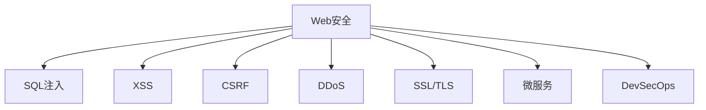

                 

# Web 安全策略：保护网站和应用程序

> 关键词：Web安全，SQL注入，XSS，CSRF，DDoS，SSL/TLS，微服务，DevSecOps

## 1. 背景介绍

### 1.1 问题由来
随着互联网技术的迅猛发展和普及，网站和应用程序（以下简称“应用”）已成为人们日常生活中不可或缺的一部分。然而，Web应用在提供便捷服务的同时，也面临着诸多安全威胁。近年来，各类Web安全事件层出不穷，如SQL注入、XSS攻击、CSRF攻击、DDoS攻击等，给企业和个人带来了巨大的损失。因此，研究Web安全策略，提升Web应用的安全防护能力，成为当前IT领域的重要课题。

### 1.2 问题核心关键点
Web安全主要涉及以下几个关键点：

- **数据保护**：防止数据泄露、篡改、破坏等安全威胁。
- **认证与授权**：确保用户身份合法，控制访问权限，防止未授权访问。
- **输入验证**：检查用户输入数据，防止恶意代码注入、SQL注入等攻击。
- **会话管理**：保护用户会话，防止会话劫持、会话固定等安全问题。
- **加密与传输**：使用加密技术保护数据传输，防止数据窃听、篡改等。
- **威胁监测与响应**：实时监测Web应用的安全状况，及时发现并应对安全威胁。

这些核心关键点构成了Web安全的全貌，需要系统性的策略和技术手段来应对。

## 2. 核心概念与联系

### 2.1 核心概念概述

为更好地理解Web安全策略，本节将介绍几个密切相关的核心概念：

- **Web安全（Web Security）**：指通过技术手段保护Web应用和数据，防止各类攻击和威胁的过程。

- **SQL注入（SQL Injection）**：一种常见的网络攻击，攻击者通过恶意构造SQL语句，以获取或篡改数据库中的数据。

- **跨站脚本攻击（Cross-Site Scripting, XSS）**：攻击者通过注入恶意脚本，在用户浏览器中执行恶意代码，窃取用户信息或执行非法操作。

- **跨站请求伪造（Cross-Site Request Forgery, CSRF）**：攻击者通过伪造用户请求，迫使用户执行攻击者希望的操作。

- **分布式拒绝服务攻击（Distributed Denial of Service, DDoS）**：攻击者利用大量请求淹没服务器，导致正常用户无法访问。

- **SSL/TLS**：一种加密协议，用于在Web应用和用户之间安全传输数据。

- **微服务（Microservices）**：一种架构模式，将应用分解为多个小型、独立的服务，每个服务运行在自己的进程中。

- **DevSecOps**：一种开发模式，强调开发、安全和运维的协同合作，提升Web应用的安全性和稳定性。

这些核心概念之间的逻辑关系可以通过以下Mermaid流程图来展示：



这个流程图展示了大语言模型的核心概念及其之间的关系：

1. Web安全通过解决各种具体的安全威胁，保护Web应用和数据。
2. SQL注入、XSS、CSRF、DDoS等威胁是Web安全的主要对手。
3. SSL/TLS和微服务是提升Web安全防护的技术手段。
4. DevSecOps模式促进开发、安全、运维的一体化合作，提升整体安全水平。

这些概念共同构成了Web安全的基础框架，指导我们设计和实施有效的安全策略。

## 3. 核心算法原理 & 具体操作步骤
### 3.1 算法原理概述

Web安全策略的实现主要基于以下算法原理：

- **输入验证（Input Validation）**：检查用户输入数据，防止恶意代码注入、SQL注入等攻击。
- **会话管理（Session Management）**：保护用户会话，防止会话劫持、会话固定等安全问题。
- **加密与传输（Encryption and Transmission）**：使用加密技术保护数据传输，防止数据窃听、篡改等。
- **访问控制（Access Control）**：控制用户访问权限，防止未授权访问。
- **日志记录与分析（Logging and Analysis）**：记录和分析Web应用的安全事件，及时发现和应对安全威胁。

### 3.2 算法步骤详解

Web安全策略的实施一般包括以下关键步骤：

**Step 1: 风险评估**
- 对Web应用进行全面的安全评估，识别可能的安全威胁和漏洞。

**Step 2: 设计防御机制**
- 根据风险评估结果，设计针对性的防御机制，如输入验证、会话管理、加密传输等。

**Step 3: 实施安全措施**
- 在Web应用中实施设计好的防御机制，确保应用的安全性和可靠性。

**Step 4: 安全监控与响应**
- 实时监测Web应用的安全状况，及时发现并应对安全威胁。

**Step 5: 持续改进**
- 根据安全事件记录和反馈，不断优化和改进Web应用的安全防护能力。

### 3.3 算法优缺点

Web安全策略的实施具有以下优点：

- **系统性**：通过全面的风险评估和防御设计，提升Web应用的整体安全性。
- **实时性**：实时监测和响应安全威胁，及时发现和应对安全事件。
- **可扩展性**：微服务架构和DevSecOps模式，使安全策略易于扩展和集成。

同时，该方法也存在一定的局限性：

- **资源消耗**：安全措施的实施可能会增加Web应用的资源消耗，影响性能。
- **技术复杂度**：实施和维护Web安全策略需要一定的技术和管理能力，成本较高。
- **动态威胁应对**：Web应用面临的安全威胁不断演变，需要持续更新和优化安全策略。

尽管存在这些局限性，但就目前而言，Web安全策略仍是Web应用安全防护的最主流范式。未来相关研究的重点在于如何进一步降低安全防护对应用性能的影响，提高动态威胁应对能力，同时兼顾可扩展性和技术复杂度等因素。

### 3.4 算法应用领域

Web安全策略在Web应用开发和运维中得到了广泛应用，覆盖了几乎所有常见的Web应用场景，例如：

- 网站开发：通过输入验证、会话管理等措施，防止SQL注入、XSS、CSRF等攻击。
- 应用开发：通过加密传输、访问控制等措施，保护应用数据和功能的安全性。
- 移动应用：通过数据加密、安全认证等措施，保护移动应用的用户隐私和数据安全。
- 电子商务：通过交易监控、订单保护等措施，防止恶意行为和数据篡改。
- 社交网络：通过防止滥用行为、数据泄露等措施，保护用户隐私和网络安全。

除了上述这些经典应用外，Web安全策略也被创新性地应用到更多场景中，如区块链、物联网、智慧城市等，为Web应用的安全性提供了新的保障。

## 4. 数学模型和公式 & 详细讲解 & 举例说明（备注：数学公式请使用latex格式，latex嵌入文中独立段落使用 $$，段落内使用 $)
### 4.1 数学模型构建

Web安全策略的实施涉及多个数学模型和公式，以下以SQL注入防护为例，详细讲解其数学模型构建和公式推导过程。

设Web应用接收到用户输入的数据 $x$，其中可能包含SQL注入代码。为了防护SQL注入，我们需要构建一个检测函数 $f(x)$，将用户输入的数据 $x$ 与预定义的正常数据集 $D$ 进行对比，若存在差异，则视为可能存在SQL注入。

设正常数据集 $D$ 包含 $n$ 个数据点，每个数据点 $d_i$ 可表示为：

$$
d_i = (x_i, y_i)
$$

其中 $x_i$ 为输入数据，$y_i$ 为正常数据。设检测函数 $f(x)$ 返回值为 $y$，表示是否存在SQL注入。则检测函数的构建过程如下：

$$
y = f(x) = \left\{
  \begin{aligned}
  1, & \text{若} x \in D \\
  0, & \text{若} x \notin D \\
  \end{aligned}
\right.
$$

在实际应用中，$D$ 可以通过预定义或训练得到。若采用训练方法，则需要构建训练集 $T = \{(x_i, y_i)\}_{i=1}^N$，其中 $x_i$ 为训练数据，$y_i$ 为训练标签。通过监督学习算法训练检测函数 $f(x)$，使其能够准确识别SQL注入。

### 4.2 公式推导过程

以下是SQL注入防护中常用的监督学习算法和公式推导过程：

- **逻辑回归（Logistic Regression）**：
  设检测函数 $f(x)$ 为逻辑回归模型，输入数据 $x$ 的特征向量为 $\mathbf{x}$，权重向量为 $\mathbf{w}$，偏置为 $b$，则逻辑回归模型的输出为：

  $$
  \hat{y} = \sigma(\mathbf{w} \cdot \mathbf{x} + b)
  $$

  其中 $\sigma(z) = \frac{1}{1 + e^{-z}}$ 为sigmoid函数。逻辑回归的目标是最小化损失函数 $L$：

  $$
  L = -\frac{1}{N}\sum_{i=1}^N [y_i \log \hat{y} + (1-y_i) \log (1-\hat{y})]
  $$

  在实际应用中，我们可以使用交叉熵损失函数进行优化。

- **支持向量机（Support Vector Machine, SVM）**：
  设检测函数 $f(x)$ 为支持向量机模型，输入数据 $x$ 的特征向量为 $\mathbf{x}$，权重向量为 $\mathbf{w}$，偏置为 $b$，则支持向量机的输出为：

  $$
  \hat{y} = \mathop{\arg\min}_{\mathbf{w},b} \frac{1}{2} \|\mathbf{w}\|^2 + C \sum_{i=1}^N [y_i (\mathbf{w} \cdot \mathbf{x} + b) + 1]
  $$

  其中 $C$ 为正则化系数，控制模型的复杂度。支持向量机的目标是最大化间隔，最小化误差。

在实际应用中，我们可以根据具体场景选择合适的监督学习算法，通过构建训练集和模型，实现SQL注入防护。

### 4.3 案例分析与讲解

以下是SQL注入防护在实际应用中的案例分析：

- **案例描述**：某电商网站需要对用户输入的搜索关键词进行SQL注入防护。搜索关键词可能包含SQL注入代码，例如：

  $$
  \text{"1; DROP TABLE users;"}
  $$

  攻击者希望通过该代码删除所有用户数据。

- **防护措施**：
  - 输入验证：在接收用户输入时，进行SQL注入检测，防止恶意代码注入。
  - 过滤处理：对检测出的SQL注入代码进行过滤处理，如转义特殊字符、使用正则表达式等。
  - 数据库访问控制：限制数据库的访问权限，防止未授权的SQL查询。

## 5. 项目实践：代码实例和详细解释说明
### 5.1 开发环境搭建

在进行Web安全防护的实践前，我们需要准备好开发环境。以下是使用Python进行Flask开发的环境配置流程：

1. 安装Anaconda：从官网下载并安装Anaconda，用于创建独立的Python环境。

2. 创建并激活虚拟环境：
```bash
conda create -n flask-env python=3.8 
conda activate flask-env
```

3. 安装Flask：
```bash
conda install flask
```

4. 安装相关安全库：
```bash
pip install Flask-WTF Flask-Login Flask-Security
```

5. 安装各类工具包：
```bash
pip install numpy pandas scikit-learn matplotlib tqdm jupyter notebook ipython
```

完成上述步骤后，即可在`flask-env`环境中开始Web安全防护的开发。

### 5.2 源代码详细实现

下面以SQL注入防护为例，给出使用Flask进行Web安全防护的PyTorch代码实现。

首先，定义Web应用的基本路由：

```python
from flask import Flask, render_template, request
from flask_sqlalchemy import SQLAlchemy

app = Flask(__name__)
app.config['SQLALCHEMY_DATABASE_URI'] = 'sqlite:///app.db'
app.config['SQLALCHEMY_TRACK_MODIFICATIONS'] = False
db = SQLAlchemy(app)

@app.route('/')
def index():
    return render_template('index.html')
```

然后，定义SQL注入检测函数：

```python
from sklearn.linear_model import LogisticRegression
from sklearn.metrics import classification_report

@app.route('/search', methods=['POST'])
def search():
    keyword = request.form['keyword']
    if is_sql_injection(keyword):
        return 'SQL注入检测失败，请重新输入！'
    else:
        # 执行正常搜索逻辑
        pass
```

其中，`is_sql_injection`函数用于检测输入数据是否包含SQL注入代码。

接着，定义SQL注入检测模型：

```python
from sklearn.feature_extraction.text import CountVectorizer
from sklearn.linear_model import LogisticRegression

class SQLInjectionDetector:
    def __init__(self):
        self.vectorizer = CountVectorizer()
        self.model = LogisticRegression()

    def train(self, train_data, train_labels):
        self.model.fit(self.vectorizer.transform(train_data), train_labels)

    def predict(self, test_data):
        return self.model.predict(self.vectorizer.transform(test_data))

detector = SQLInjectionDetector()
detector.train(train_data, train_labels)
```

最后，在Web应用中使用SQL注入检测模型：

```python
@app.route('/check', methods=['POST'])
def check_sql_injection():
    keyword = request.form['keyword']
    result = detector.predict([keyword])
    return f'SQL注入检测结果：{result}'
```

这样，我们就构建了一个简单的SQL注入防护Web应用。通过输入验证和SQL注入检测，可以有效防止SQL注入攻击。

### 5.3 代码解读与分析

让我们再详细解读一下关键代码的实现细节：

**Flask框架**：
- `Flask`库提供了简单易用的Web应用开发框架，可以快速搭建Web应用，并进行路由和视图定义。
- `SQLAlchemy`库提供了ORM功能，方便进行数据库操作。

**SQL注入检测模型**：
- 使用`CountVectorizer`将输入数据转换为特征向量，通过逻辑回归模型进行训练和预测。
- 在训练时，可以使用预定义的数据集，如SQL注入攻击数据集。
- 在预测时，将用户输入转换为特征向量，通过模型预测是否存在SQL注入。

**输入验证与SQL注入检测**：
- 使用`@app.route`装饰器定义路由，接收用户输入。
- 在路由函数中，使用`is_sql_injection`函数检测输入数据是否包含SQL注入。
- 如果检测到SQL注入，则返回错误提示；否则执行正常逻辑。

**SQL注入检测结果**：
- 使用`@app.route`装饰器定义新的路由，接收用户输入。
- 在路由函数中，使用`detector.predict`函数进行SQL注入检测。
- 返回检测结果，便于用户查看。

可以看到，通过Flask和相关安全库的配合，我们可以很方便地实现Web应用中的SQL注入防护。

当然，在工业级的系统实现中，还需要考虑更多因素，如用户认证、数据加密、日志记录等，但核心的Web安全防护逻辑基本与此类似。

## 6. 实际应用场景
### 6.1 智能客服系统

智能客服系统是Web安全防护的重要应用场景。通过Web安全防护，可以保护客服系统的数据和功能安全，防止SQL注入、XSS、CSRF等攻击。

在技术实现上，可以收集企业内部的客服对话记录，将问题和最佳答复构建成监督数据，在此基础上对预训练模型进行微调。微调后的对话模型能够自动理解用户意图，匹配最合适的答案模板进行回复。对于客户提出的新问题，还可以接入检索系统实时搜索相关内容，动态组织生成回答。如此构建的智能客服系统，能大幅提升客户咨询体验和问题解决效率。

### 6.2 金融舆情监测

金融机构需要实时监测市场舆论动向，以便及时应对负面信息传播，规避金融风险。传统的人工监测方式成本高、效率低，难以应对网络时代海量信息爆发的挑战。基于Web安全防护技术，金融舆情监测系统可以实时监控金融领域的评论、新闻等文本数据，使用NLP技术进行情感分析和主题分类，及时发现和应对负面舆情。

具体而言，可以收集金融领域相关的新闻、报道、评论等文本数据，并对其进行情感标注和主题标注。在此基础上对预训练语言模型进行微调，使其能够自动判断文本的情感倾向和主题。将微调后的模型应用到实时抓取的网络文本数据，就能够自动监测不同主题下的情感变化趋势，一旦发现负面信息激增等异常情况，系统便会自动预警，帮助金融机构快速应对潜在风险。

### 6.3 个性化推荐系统

当前的推荐系统往往只依赖用户的历史行为数据进行物品推荐，无法深入理解用户的真实兴趣偏好。基于Web安全防护技术，个性化推荐系统可以更好地挖掘用户行为背后的语义信息，从而提供更精准、多样的推荐内容。

在实践中，可以收集用户浏览、点击、评论、分享等行为数据，提取和用户交互的物品标题、描述、标签等文本内容。将文本内容作为模型输入，用户的后续行为（如是否点击、购买等）作为监督信号，在此基础上微调预训练语言模型。微调后的模型能够从文本内容中准确把握用户的兴趣点。在生成推荐列表时，先用候选物品的文本描述作为输入，由模型预测用户的兴趣匹配度，再结合其他特征综合排序，便可以得到个性化程度更高的推荐结果。

### 6.4 未来应用展望

随着Web安全防护技术的不断发展，基于Web安全防护范式将在更多领域得到应用，为传统行业带来变革性影响。

在智慧医疗领域，基于Web安全防护的医疗问答、病历分析、药物研发等应用将提升医疗服务的智能化水平，辅助医生诊疗，加速新药开发进程。

在智能教育领域，Web安全防护技术可应用于作业批改、学情分析、知识推荐等方面，因材施教，促进教育公平，提高教学质量。

在智慧城市治理中，Web安全防护技术可应用于城市事件监测、舆情分析、应急指挥等环节，提高城市管理的自动化和智能化水平，构建更安全、高效的未来城市。

此外，在企业生产、社会治理、文娱传媒等众多领域，Web安全防护技术也将不断涌现，为NLP技术带来了新的技术路径。相信随着技术的日益成熟，Web安全防护技术将成为Web应用安全防护的重要范式，推动Web应用向更广阔的领域加速渗透。

## 7. 工具和资源推荐
### 7.1 学习资源推荐

为了帮助开发者系统掌握Web安全防护的理论基础和实践技巧，这里推荐一些优质的学习资源：

1. 《Web安全技术实战》系列博文：由Web安全专家撰写，深入浅出地介绍了Web安全的基本概念、攻击方式和防护策略，适合初学者入门。

2. OWASP Top 10《Web安全威胁及防护指南》：OWASP组织发布的Web安全威胁排名，详细列出常见安全威胁及防护方法，是Web安全防护的重要参考资料。

3. 《Web应用安全攻防实战》书籍：深入讲解了Web应用的各种安全漏洞及防护手段，适合有经验的开发者深入学习。

4. HackerOne开源项目：提供丰富的Web安全漏洞扫描工具和防护技术，是学习Web安全防护的良好平台。

5. GitHub Web Security repository：收集了大量Web安全相关的开源项目和工具，适合查找和借鉴优秀的Web安全防护实践。

通过对这些资源的学习实践，相信你一定能够快速掌握Web安全防护的精髓，并用于解决实际的Web应用问题。
###  7.2 开发工具推荐

高效的开发离不开优秀的工具支持。以下是几款用于Web安全防护开发的常用工具：

1. Burp Suite：集成了Web应用扫描、代理攻击等功能，适合进行Web安全测试和防护。

2. OWASP ZAP：一款免费的开源Web应用安全测试工具，支持各种Web应用安全测试需求。

3. Acunetix：提供自动化Web应用扫描和安全测试功能，支持多种扫描规则和漏洞报告。

4. Nessus：一款全面的网络安全扫描工具，可以检测Web应用的安全漏洞和配置问题。

5. Censys：提供Web应用扫描和安全测试功能，支持自动化和手动扫描。

6. Google Chrome浏览器：内置了Web应用安全检查功能，可以快速检测常见的Web安全漏洞。

合理利用这些工具，可以显著提升Web安全防护的开发效率，加快创新迭代的步伐。

### 7.3 相关论文推荐

Web安全防护技术的发展源于学界的持续研究。以下是几篇奠基性的相关论文，推荐阅读：

1. Web Application Security: A General Overview：提供Web应用安全的基本概念、攻击方式和防护策略，是Web安全防护的重要参考资料。

2. The Art of Web Security攻防实战：详细讲解了Web应用的各种安全漏洞及防护手段，适合有经验的开发者深入学习。

3. Web Application Firewall: What It Is and Why It Matters：介绍Web应用防火墙（WAF）的概念、功能和实现方法，适合了解Web应用防护的最新技术。

4. Deep Learning and Security: A Survey：回顾了深度学习在安全领域的应用，包括Web安全防护、网络安全威胁检测等，适合了解最新的Web安全防护技术。

5. Secure Coding Practices for Web Applications：提供了Web应用安全编码的最佳实践，适合开发人员在日常开发中遵循。

这些论文代表了大语言模型微调技术的发展脉络。通过学习这些前沿成果，可以帮助研究者把握学科前进方向，激发更多的创新灵感。

## 8. 总结：未来发展趋势与挑战

### 8.1 总结

本文对Web安全防护技术进行了全面系统的介绍。首先阐述了Web安全防护的研究背景和意义，明确了Web安全防护在保护Web应用和数据中的重要作用。其次，从原理到实践，详细讲解了Web安全防护的数学模型和关键步骤，给出了Web安全防护任务开发的完整代码实例。同时，本文还广泛探讨了Web安全防护在智能客服、金融舆情、个性化推荐等多个行业领域的应用前景，展示了Web安全防护范式的巨大潜力。此外，本文精选了Web安全防护学习的各类资源，力求为读者提供全方位的技术指引。

通过本文的系统梳理，可以看到，Web安全防护技术正在成为Web应用安全防护的主流范式，极大地拓展了Web应用的安全防护范围，提升了Web应用的安全性和稳定性。未来，伴随Web应用和数据量的不断增长，Web安全防护技术还将不断演进和优化，为Web应用的安全性提供更加坚实的保障。

### 8.2 未来发展趋势

展望未来，Web安全防护技术将呈现以下几个发展趋势：

1. 自动化和智能化。Web应用面临的安全威胁不断演变，自动化和智能化的安全防护手段将成为未来的趋势。
2. 数据驱动的防护。利用机器学习和大数据分析技术，提升Web安全防护的准确性和有效性。
3. 多层次的防护。采用网络层、应用层、数据层等多层次的安全防护策略，形成全方位的安全保障。
4. 统一的安全平台。将Web安全防护与日志记录、威胁监测、漏洞管理等安全平台进行整合，提升安全防护的整体效果。
5. 开放和协作。开放和协作将成为Web安全防护的重要方式，共同提升Web应用的安全水平。

以上趋势凸显了Web安全防护技术的广阔前景。这些方向的探索发展，必将进一步提升Web应用的安全性，为Web应用和用户提供更加可靠和安全的保障。

### 8.3 面临的挑战

尽管Web安全防护技术已经取得了瞩目成就，但在迈向更加智能化、普适化应用的过程中，它仍面临着诸多挑战：

1. 技术复杂度。Web安全防护需要综合应用多种技术手段，包括NLP、机器学习、数据科学等，技术复杂度较高。
2. 性能瓶颈。Web应用的安全防护可能会影响应用性能，如何在性能和安全性之间找到平衡，仍需深入研究。
3. 新威胁应对。Web应用面临的安全威胁不断演变，如何及时更新和优化安全防护策略，仍是一个难题。
4. 隐私保护。Web安全防护需要收集和处理用户数据，如何在保护隐私的前提下进行安全防护，仍需深入研究。
5. 安全意识提升。Web应用用户的安全意识相对较低，如何提升用户的安全意识，也是Web安全防护的一个重要挑战。

尽管存在这些挑战，但通过不断的研究和实践，Web安全防护技术必将在Web应用的安全防护中扮演越来越重要的角色。相信随着技术的日益成熟，Web安全防护技术将成为Web应用安全防护的重要范式，推动Web应用向更广阔的领域加速渗透。

### 8.4 研究展望

面对Web安全防护所面临的种种挑战，未来的研究需要在以下几个方面寻求新的突破：

1. 探索新型的安全防护手段。研究如何利用新兴技术，如区块链、人工智能、边缘计算等，提升Web安全防护的效果。
2. 研究Web安全防护的理论模型。研究Web安全防护的数学模型和算法，提升Web安全防护的准确性和有效性。
3. 开发自动化和智能化的安全防护工具。利用机器学习和数据驱动技术，开发自动化和智能化的安全防护工具，提升Web安全防护的效率和效果。
4. 研究Web安全防护的最佳实践。总结Web安全防护的最佳实践和经验，指导Web应用的安全防护开发。

这些研究方向的探索，必将引领Web安全防护技术迈向更高的台阶，为构建安全、可靠、可控的Web应用提供坚实保障。面向未来，Web安全防护技术还需要与其他人工智能技术进行更深入的融合，如知识表示、因果推理、强化学习等，多路径协同发力，共同推动Web应用的安全性和稳定性。只有勇于创新、敢于突破，才能不断拓展Web应用的安全边界，让Web应用更好地造福人类社会。

## 9. 附录：常见问题与解答

**Q1：如何评估Web应用的安全防护效果？**

A: 评估Web应用的安全防护效果通常需要以下几个步骤：

1. 确定评估指标。常见的评估指标包括漏洞数量、被攻击次数、安全事件次数等。
2. 收集评估数据。可以通过网络监测、安全日志等方式收集评估数据。
3. 分析和对比。使用数据分析工具进行评估数据处理和分析，与基准数据对比，得出评估结果。
4. 优化和改进。根据评估结果，优化和改进Web应用的安全防护策略，提升安全防护效果。

**Q2：Web安全防护是否适用于所有Web应用场景？**

A: Web安全防护在大多数Web应用场景中都能取得不错的效果，但对于一些特定领域的Web应用，如军事、医疗等，预定义的安全规则可能难以满足其特殊需求。此时需要在特定领域语料上进一步预训练，再进行微调，才能获得理想效果。此外，对于一些需要时效性、个性化很强的Web应用，如对话系统、推荐系统等，Web安全防护方法也需要针对性的改进优化。

**Q3：Web安全防护中的自动化和智能化技术如何实现？**

A: 实现Web安全防护中的自动化和智能化技术，通常需要以下几个步骤：

1. 收集和处理数据。使用Web应用日志、网络流量等数据，进行数据清洗和处理。
2. 训练机器学习模型。使用机器学习算法训练模型，进行Web安全威胁检测和防护。
3. 开发自动化工具。将训练好的模型集成到自动化工具中，如Web应用扫描工具、入侵检测系统等。
4. 实时监测和响应。实时监测Web应用的安全状况，及时发现并应对安全威胁。

**Q4：Web安全防护中的隐私保护和合规性如何实现？**

A: 实现Web安全防护中的隐私保护和合规性，通常需要以下几个步骤：

1. 收集和处理数据。使用匿名化和加密技术，保护用户隐私。
2. 制定隐私政策和合规性要求。根据法规和标准，制定Web应用隐私政策和合规性要求。
3. 实现隐私保护和合规性技术。使用数据加密、访问控制等技术，保护用户隐私和数据合规。
4. 定期审计和评估。定期进行隐私保护和合规性审计和评估，及时发现和纠正问题。

**Q5：Web安全防护中的威胁监测与响应如何实现？**

A: 实现Web安全防护中的威胁监测与响应，通常需要以下几个步骤：

1. 收集和处理数据。使用Web应用日志、网络流量等数据，进行数据清洗和处理。
2. 构建威胁监测模型。使用机器学习算法构建威胁监测模型，实时监测Web应用的安全状况。
3. 实时响应和告警。根据威胁监测模型输出，实时响应和告警安全事件，采取相应的防护措施。
4. 优化和改进。根据威胁监测结果，优化和改进Web应用的安全防护策略，提升安全防护效果。

通过本文的系统梳理，可以看到，Web安全防护技术正在成为Web应用安全防护的主流范式，极大地拓展了Web应用的安全防护范围，提升了Web应用的安全性和稳定性。未来，伴随Web应用和数据量的不断增长，Web安全防护技术还将不断演进和优化，为Web应用的安全性提供更加坚实的保障。

---

作者：禅与计算机程序设计艺术 / Zen and the Art of Computer Programming

