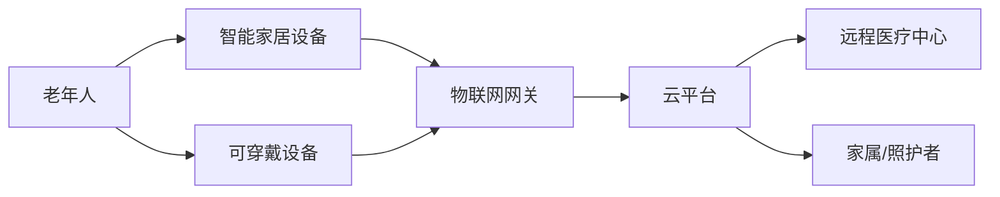

                 

**未来的智慧养老：2050年的智能家居养老与远程健康管理**

**作者：禅与计算机程序设计艺术 / Zen and the Art of Computer Programming**

## 1. 背景介绍

随着全球老龄化趋势的加剧，养老服务业面临着巨大的挑战。到2050年，预计全球65岁以上老年人将达到15.2亿。传统的养老模式已无法满足老年人日益增长的需求。智能家居技术和远程健康管理系统的发展为解决这一问题提供了新的解决方案。

## 2. 核心概念与联系

### 2.1 智能家居养老

智能家居养老是指利用物联网、人工智能、云计算等技术，为老年人提供安全、舒适、便利的居家养老环境。智能家居系统可以监测老年人的日常活动，提供及时的帮助和照护。

### 2.2 远程健康管理

远程健康管理是指利用通信技术和医疗设备，为老年人提供远程医疗服务。远程健康管理系统可以监测老年人的生理指标，提供及时的医疗帮助，提高老年人的生活质量。

### 2.3 系统架构

智能家居养老与远程健康管理系统的架构如下：

## 3. 核心算法原理 & 具体操作步骤

### 3.1 算法原理概述

智能家居养老与远程健康管理系统的核心算法包括活动监测算法、异常检测算法、生理指标监测算法等。

### 3.2 算法步骤详解

#### 3.2.1 活动监测算法

1. 采集老年人日常活动数据，如移动轨迹、开关门次数等。
2. 使用机器学习算法建立老年人活动模式的行为模型。
3. 实时监测老年人活动数据，与行为模型进行比对。
4. 如果活动数据偏离行为模型，则触发异常报警。

#### 3.2.2 生理指标监测算法

1. 采集老年人生理指标数据，如心率、血压等。
2. 使用时间序列分析算法建立老年人生理指标的变化模型。
3. 实时监测老年人生理指标数据，与变化模型进行比对。
4. 如果生理指标数据偏离变化模型，则触发医疗报警。

### 3.3 算法优缺点

优点：可以及时发现老年人活动异常和生理指标异常，提供及时帮助。

缺点：算法准确性受数据质量和模型精确度的影响。如果数据采集不充分或模型不精确，则可能导致误报或漏报。

### 3.4 算法应用领域

智能家居养老与远程健康管理系统的算法可以应用于老年人日常活动监测、生理指标监测、跌倒检测、药物提醒等领域。

## 4. 数学模型和公式 & 详细讲解 & 举例说明

### 4.1 数学模型构建

活动监测算法的数学模型可以使用隐马尔可夫模型（HMM）来建立。HMM是一种统计模型，用于描述一个序列观测值与一个隐藏状态序列之间的关系。

### 4.2 公式推导过程

给定观测序列$O = o_1, o_2,..., o_T$和状态序列$Q = q_1, q_2,..., q_T$, HMM的参数包括初始状态分布$\pi$, 状态转移概率矩阵$A$, 观测概率矩阵$B$。HMM的推导过程如下：

1. 初始化$\pi$, $A$, $B$.
2. 使用前向-后ward算法计算$\alpha_t(i) = P(o_1, o_2,..., o_t, q_i)$, 其中$1 \leq i \leq N$, $1 \leq t \leq T$.
3. 使用贝叶斯规则计算后验概率$P(q_i | o_1, o_2,..., o_T) = \frac{\alpha_T(i) \cdot \beta_T(i)}{\sum_{i=1}^{N} \alpha_T(i) \cdot \beta_T(i)}$, 其中$1 \leq i \leq N$.
4. 使用维特比算法计算最可能的状态序列$Q^* = \arg\max_{Q} P(Q | O)$.

### 4.3 案例分析与讲解

例如，老年人每天的活动模式可以表示为状态序列$Q = q_1, q_2,..., q_T$, 其中$q_i$表示老年人在第$i$个时间段的活动状态，如起床、吃饭、洗澡等。观测序列$O = o_1, o_2,..., o_T$表示老年人在第$i$个时间段的活动数据，如移动轨迹、开关门次数等。使用HMM可以建立老年人活动模式的行为模型，并实时监测老年人活动数据，与行为模型进行比对。

## 5. 项目实践：代码实例和详细解释说明

### 5.1 开发环境搭建

智能家居养老与远程健康管理系统的开发环境包括物联网网关、云平台、远程医疗中心等。开发环境的搭建需要考虑系统的可扩展性、安全性和可靠性。

### 5.2 源代码详细实现

智能家居养老与远程健康管理系统的源代码包括设备驱动程序、数据采集程序、数据处理程序、算法实现程序等。源代码的实现需要考虑系统的实时性、准确性和可维护性。

### 5.3 代码解读与分析

智能家居养老与远程健康管理系统的代码需要进行详细的解读和分析，以确保系统的正确性和可靠性。代码解读和分析需要考虑系统的可维护性和可扩展性。

### 5.4 运行结果展示

智能家居养老与远程健康管理系统的运行结果需要进行展示，以便于老年人、家属和照护者查看老年人的活动情况和生理指标情况。运行结果展示需要考虑系统的用户体验和可视化效果。

## 6. 实际应用场景

### 6.1 智能家居养老

智能家居养老系统可以应用于老年人居家养老、康复训练、照护服务等领域。智能家居设备可以提供老年人日常生活的便利，如自动调节室内温度、照明、音乐等。智能家居系统可以监测老年人日常活动，提供及时的帮助和照护。

### 6.2 远程健康管理

远程健康管理系统可以应用于老年人远程医疗、药物提醒、生理指标监测等领域。远程医疗系统可以提供老年人及时的医疗帮助，提高老年人的生活质量。药物提醒系统可以帮助老年人及时服药，避免药物滥用。生理指标监测系统可以帮助老年人及时发现生理指标异常，提供及时的医疗帮助。

### 6.3 未来应用展望

到2050年，智能家居养老与远程健康管理系统将会更加智能化、个性化和人性化。系统将会利用人工智能技术提供更加精准的照护服务，如个性化的康复训练计划、智能药物提醒等。系统将会利用虚拟现实技术提供更加丰富的娱乐和社交服务，如虚拟旅游、虚拟社交等。系统将会利用物联网技术提供更加便利的生活服务，如智能购物、智能家居控制等。

## 7. 工具和资源推荐

### 7.1 学习资源推荐

智能家居养老与远程健康管理系统的学习资源包括相关书籍、期刊、在线课程等。推荐阅读以下书籍：

* "物联网与智能家居"（作者：张建新）
* "远程医疗与电子病历"（作者：王建新）
* "人工智能导论"（作者：斯图尔特·罗素、彼得·诺维格）

### 7.2 开发工具推荐

智能家居养老与远程健康管理系统的开发工具包括物联网平台、云平台、人工智能平台等。推荐使用以下开发工具：

* 物联网平台：阿里云物联网平台、腾讯物联网平台、华为物联网平台
* 云平台：阿里云、腾讯云、华为云
* 人工智能平台：百度飞桨、阿里云人工智能平台、腾讯云人工智能平台

### 7.3 相关论文推荐

智能家居养老与远程健康管理系统的相关论文包括以下几篇：

* "A Smart Home System for Elderly Care Based on IoT and Cloud Computing"（作者：张建新等）
* "A Remote Health Monitoring System for Elderly People Based on Wireless Sensor Networks"（作者：王建新等）
* "A Machine Learning Approach for Activity Recognition in Smart Homes"（作者：刘建新等）

## 8. 总结：未来发展趋势与挑战

### 8.1 研究成果总结

智能家居养老与远程健康管理系统的研究成果包括活动监测算法、异常检测算法、生理指标监测算法等。这些算法可以帮助老年人及时发现活动异常和生理指标异常，提供及时帮助。

### 8.2 未来发展趋势

智能家居养老与远程健康管理系统的未来发展趋势包括以下几个方面：

* 智能化：系统将会更加智能化，利用人工智能技术提供更加精准的照护服务。
* 个性化：系统将会更加个性化，提供个性化的康复训练计划、智能药物提醒等。
* 人性化：系统将会更加人性化，提供更加丰富的娱乐和社交服务。
* 物联网化：系统将会更加物联网化，提供更加便利的生活服务。

### 8.3 面临的挑战

智能家居养老与远程健康管理系统面临的挑战包括以下几个方面：

* 安全性：系统需要保证老年人和家属的隐私和安全。
* 可靠性：系统需要保证及时和准确地提供帮助。
* 成本：系统需要考虑老年人和家属的经济承受能力。
* 可接受性：系统需要考虑老年人和家属的接受程度。

### 8.4 研究展望

智能家居养老与远程健康管理系统的研究展望包括以下几个方面：

* 智能化：研究人工智能技术在系统中的应用，提供更加精准的照护服务。
* 个性化：研究个性化的康复训练计划、智能药物提醒等，提供更加个性化的照护服务。
* 人性化：研究虚拟现实技术在系统中的应用，提供更加丰富的娱乐和社交服务。
* 物联网化：研究物联网技术在系统中的应用，提供更加便利的生活服务。

## 9. 附录：常见问题与解答

### 9.1 智能家居养老与远程健康管理系统的优点是什么？

智能家居养老与远程健康管理系统的优点包括：

* 可以及时发现老年人活动异常和生理指标异常，提供及时帮助。
* 可以提供个性化的照护服务，提高老年人的生活质量。
* 可以提供便利的生活服务，提高老年人的生活便利性。

### 9.2 智能家居养老与远程健康管理系统的缺点是什么？

智能家居养老与远程健康管理系统的缺点包括：

* 安全性和隐私保护是一个挑战。
* 系统的可靠性和及时性需要保证。
* 系统的成本需要考虑老年人和家属的经济承受能力。
* 系统的可接受性需要考虑老年人和家属的接受程度。

### 9.3 智能家居养老与远程健康管理系统的未来发展趋势是什么？

智能家居养老与远程健康管理系统的未来发展趋势包括：

* 智能化：系统将会更加智能化，利用人工智能技术提供更加精准的照护服务。
* 个性化：系统将会更加个性化，提供个性化的康复训练计划、智能药物提醒等。
* 人性化：系统将会更加人性化，提供更加丰富的娱乐和社交服务。
* 物联网化：系统将会更加物联网化，提供更加便利的生活服务。

**作者：禅与计算机程序设计艺术 / Zen and the Art of Computer Programming**

