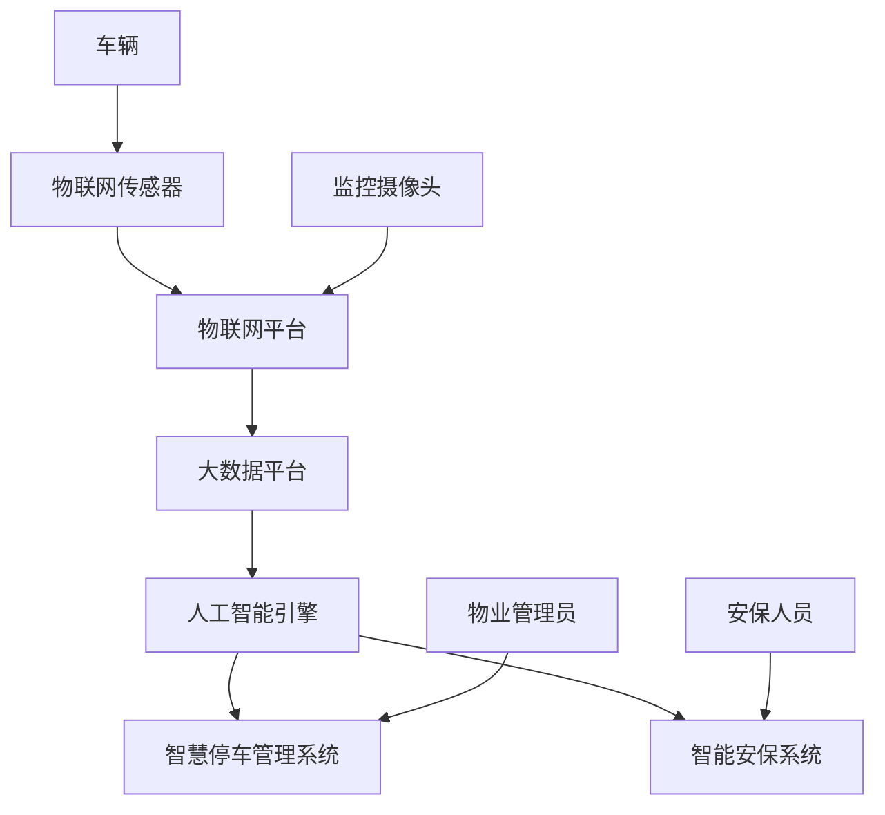

                 

**未来的智慧物业：2050年的智慧停车与智能安保**

**作者：禅与计算机程序设计艺术 / Zen and the Art of Computer Programming**

## 1. 背景介绍

随着城市化进程的加快和汽车保有量的增加，停车和安保问题日益成为城市管理的重大挑战。传统的停车和安保系统已经无法满足当前的需求，亟需智能化和数字化的解决方案。本文将探讨未来智慧物业的两大关键领域：智慧停车和智能安保，展望2050年这些领域的发展趋势。

## 2. 核心概念与联系

### 2.1 智慧停车

智慧停车是指利用物联网、大数据、人工智能等技术，实现停车位的智能化管理，提高停车效率，优化停车体验。其核心概念包括：

- **物联网（IoT）停车位感知**：利用传感器实时感知停车位的占用情况。
- **大数据分析**：分析停车数据，预测停车需求，优化停车位布局。
- **人工智能（AI）辅助决策**：利用AI算法协助管理员决策，实现智能化管理。

### 2.2 智能安保

智能安保是指利用先进的传感器、图像处理、人工智能等技术，实现安保系统的智能化，提高安保效率，保障物业安全。其核心概念包括：

- **传感器网络**：利用各种传感器实时感知物业环境，检测异常情况。
- **图像处理与分析**：利用计算机视觉技术分析监控视频，检测可疑活动。
- **人工智能（AI）驱动**：利用AI算法实现安保系统的智能化，提高响应速度和准确性。

### 2.3 核心架构

下图展示了智慧停车和智能安保的核心架构，两者通过物联网平台和大数据平台实现了紧密联系。



## 3. 核心算法原理 & 具体操作步骤

### 3.1 智慧停车算法原理概述

智慧停车的核心算法是停车位预测和路径规划算法。停车位预测算法基于历史数据和实时数据，预测未来停车需求，优化停车位布局。路径规划算法则指导车辆行驶路线，实现最优停车。

### 3.2 智慧停车算法步骤详解

1. **数据采集**：采集历史停车数据和实时停车数据。
2. **数据预处理**：清洗数据，去除异常值，并对数据进行特征工程。
3. **模型训练**：利用机器学习算法（如SVM、随机森林、神经网络等）训练停车位预测模型。
4. **预测**：利用训练好的模型预测未来停车需求。
5. **路径规划**：利用路径规划算法（如Dijkstra算法、A\*算法等）规划车辆行驶路线。
6. **实时调整**：根据实时停车情况，动态调整停车位布局和路径规划。

### 3.3 智慧停车算法优缺点

**优点**：提高了停车效率，优化了停车体验，减少了车辆尾气排放。

**缺点**：对数据质量要求高，模型训练需要大量计算资源，路径规划可能受交通拥堵等因素影响。

### 3.4 智慧停车算法应用领域

智慧停车算法主要应用于智慧城市、智慧社区、智慧商业区等场景，有助于缓解城市停车压力，提高停车管理效率。

### 3.5 智能安保算法原理概述

智能安保的核心算法是异常检测算法和目标跟踪算法。异常检测算法基于传感器数据和视频数据，检测物业异常情况。目标跟踪算法则跟踪可疑目标，实现实时监控。

### 3.6 智能安保算法步骤详解

1. **数据采集**：采集传感器数据和视频数据。
2. **数据预处理**：清洗数据，去除异常值，并对数据进行特征工程。
3. **异常检测**：利用异常检测算法（如孤立森林、局部异常因子等）检测物业异常情况。
4. **目标跟踪**：利用目标跟踪算法（如IOU Tracker、DeepSORT等）跟踪可疑目标。
5. **实时响应**：根据检测结果，实时通知安保人员，并指导其行动。

### 3.7 智能安保算法优缺点

**优点**：提高了安保效率，减少了安保人员工作量，保障了物业安全。

**缺点**：对数据质量要求高，模型训练需要大量计算资源，可能存在误报或漏报情况。

### 3.8 智能安保算法应用领域

智能安保算法主要应用于智慧社区、智慧商业区、智慧工厂等场景，有助于保障物业安全，提高安保管理效率。

## 4. 数学模型和公式 & 详细讲解 & 举例说明

### 4.1 数学模型构建

智慧停车的数学模型可以表示为：

$$P(S|H) = \frac{P(H|S)P(S)}{P(H)}$$

其中，$P(S|H)$表示给定历史数据$H$的情况下，停车需求$S$的概率，$P(H|S)$表示给定停车需求$S$的情况下，历史数据$H$的概率，$P(S)$表示停车需求$S$的概率，$P(H)$表示历史数据$H$的概率。

智能安保的数学模型可以表示为：

$$D = \sum_{i=1}^{n}w_i \cdot d_i$$

其中，$D$表示物业异常程度，$w_i$表示第$i$个传感器的权重，$d_i$表示第$i$个传感器的异常程度。

### 4.2 公式推导过程

智慧停车模型的推导基于贝叶斯定理，利用历史数据预测未来停车需求。智能安保模型的推导基于加权求和，利用传感器数据检测物业异常情况。

### 4.3 案例分析与讲解

例如，在一个智慧社区中，历史数据显示周末停车需求高于工作日。根据智慧停车模型，可以预测下周末停车需求，并优化停车位布局。同时，传感器数据显示社区入口处人流量异常高，根据智能安保模型，可以检测到物业异常情况，并通知安保人员实时响应。

## 5. 项目实践：代码实例和详细解释说明

### 5.1 开发环境搭建

智慧停车和智能安保项目的开发环境包括：

- **编程语言**：Python 3.8+
- **开发框架**：TensorFlow 2.5+, PyTorch 1.8+
- **数据库**：PostgreSQL 13+, MongoDB 4.4+
- **物联网平台**：IoT Platform (e.g., AWS IoT, Azure IoT Hub)
- **大数据平台**：Big Data Platform (e.g., Hadoop, Spark)

### 5.2 源代码详细实现

以下是智慧停车和智能安保项目的源代码示例：

**智慧停车**

```python
import pandas as pd
from sklearn.ensemble import RandomForestRegressor

# Load data
data = pd.read_csv('stopcar_data.csv')

# Preprocess data
data = data.dropna()
data = pd.get_dummies(data)

# Train model
model = RandomForestRegressor()
model.fit(data.drop('demand', axis=1), data['demand'])

# Predict demand
predictions = model.predict(data.drop('demand', axis=1))
```

**智能安保**

```python
import numpy as np
from sklearn.ensemble import IsolationForest

# Load data
data = np.load('security_data.npy')

# Detect anomalies
model = IsolationForest(contamination=0.01)
y_pred = model.fit_predict(data)

# Get anomalies
anomalies = data[y_pred == -1]
```

### 5.3 代码解读与分析

智慧停车代码示例使用随机森林回归算法预测停车需求。智能安保代码示例使用孤立森林算法检测物业异常情况。

### 5.4 运行结果展示

智慧停车代码示例的运行结果是停车需求预测值。智能安保代码示例的运行结果是物业异常情况检测结果。

## 6. 实际应用场景

### 6.1 智慧停车应用场景

智慧停车可以应用于以下场景：

- **智慧城市**：缓解城市停车压力，提高停车管理效率。
- **智慧社区**：优化社区停车位布局，提高居民停车体验。
- **智慧商业区**：提高商业区停车管理效率，吸引更多客流。

### 6.2 智能安保应用场景

智能安保可以应用于以下场景：

- **智慧社区**：保障社区安全，提高安保管理效率。
- **智慧商业区**：保障商业区安全，提高安保管理效率。
- **智慧工厂**：保障工厂安全，提高安保管理效率。

### 6.3 未来应用展望

未来，智慧停车和智能安保将进一步融合，实现更高效的物业管理。例如，智慧停车可以根据安保情况调整停车位布局，智能安保可以根据停车情况调整安保力量部署。此外，边缘计算、5G等技术的发展将进一步提高智慧停车和智能安保的实时性和可靠性。

## 7. 工具和资源推荐

### 7.1 学习资源推荐

- **书籍**："物联网与大数据"、"人工智能与安防"、"智慧城市与物业管理"
- **在线课程**：Coursera、Udacity、edX上的物联网、大数据、人工智能等相关课程
- **论坛**：Stack Overflow、Reddit、Hacker News等技术论坛

### 7.2 开发工具推荐

- **IDE**：PyCharm、Visual Studio Code、Jupyter Notebook
- **数据库**：PostgreSQL、MongoDB、Redis
- **物联网平台**：AWS IoT、Azure IoT Hub、Google Cloud IoT
- **大数据平台**：Hadoop、Spark、Hive
- **机器学习库**：TensorFlow、PyTorch、Scikit-learn

### 7.3 相关论文推荐

- "A Survey on Smart Parking Systems: Technologies, Applications, and Challenges" (IEEE Access, 2020)
- "Intelligent Security Systems: A Survey" (IEEE Transactions on Neural Networks and Learning Systems, 2019)
- "Smart City: A Survey on Technologies, Applications, and Challenges" (IEEE Communications Surveys & Tutorials, 2018)

## 8. 总结：未来发展趋势与挑战

### 8.1 研究成果总结

本文介绍了智慧停车和智能安保的核心概念、算法原理、数学模型、项目实践和应用场景。智慧停车和智能安保是未来物业管理的关键领域，有助于缓解城市停车压力，保障物业安全，提高管理效率。

### 8.2 未来发展趋势

未来，智慧停车和智能安保将进一步发展，实现更高效的物业管理。例如，自动驾驶技术的发展将改变停车方式，物联网和大数据技术的发展将提高安保管理效率。

### 8.3 面临的挑战

未来，智慧停车和智能安保面临的挑战包括：

- **数据安全**：如何保障停车和安保数据的安全和隐私。
- **算法公平**：如何确保停车和安保算法的公平性和透明度。
- **成本效益**：如何平衡智慧停车和智能安保的成本和收益。

### 8.4 研究展望

未来，智慧停车和智能安保的研究方向包括：

- **多模式停车**：研究自动驾驶、共享出行等新停车模式。
- **多源数据融合**：研究如何融合多源数据（如视频、传感器、社交媒体等）提高安保管理效率。
- **人机协同**：研究如何实现人机协同，提高停车和安保管理效率。

## 9. 附录：常见问题与解答

**Q1：智慧停车和智能安保有什么区别？**

A1：智慧停车主要关注停车位的智能化管理，提高停车效率。智能安保主要关注物业安全，提高安保管理效率。两者通过物联网平台和大数据平台实现了紧密联系。

**Q2：智慧停车和智能安保的关键技术是什么？**

A2：智慧停车的关键技术包括物联网、大数据、人工智能。智能安保的关键技术包括传感器网络、图像处理、人工智能。

**Q3：智慧停车和智能安保的应用场景有哪些？**

A3：智慧停车的应用场景包括智慧城市、智慧社区、智慧商业区等。智能安保的应用场景包括智慧社区、智慧商业区、智慧工厂等。

**Q4：智慧停车和智能安保的未来发展趋势是什么？**

A4：智慧停车和智能安保的未来发展趋势包括多模式停车、多源数据融合、人机协同等。

**Q5：智慧停车和智能安保面临的挑战是什么？**

A5：智慧停车和智能安保面临的挑战包括数据安全、算法公平、成本效益等。

**Q6：如何学习智慧停车和智能安保？**

A6：可以通过阅读相关书籍、在线课程、论文等方式学习智慧停车和智能安保。也可以通过实践项目、参与开源项目等方式提高技能。

**Q7：如何开发智慧停车和智能安保项目？**

A7：可以参考本文提供的代码示例和工具推荐，结合实际需求开发智慧停车和智能安保项目。也可以参考相关论文和开源项目，学习先进的技术和方法。

**Q8：如何部署智慧停车和智能安保项目？**

A8：可以根据项目需求选择合适的物联网平台、大数据平台、云平台等，部署智慧停车和智能安保项目。也可以考虑边缘计算等技术，提高项目实时性和可靠性。

**Q9：如何维护智慧停车和智能安保项目？**

A9：可以定期检查项目运行情况，及时发现和解决问题。也可以考虑人工智能自动化维护等技术，提高项目维护效率。

**Q10：如何评估智慧停车和智能安保项目？**

A10：可以根据项目需求定义评估指标，如停车效率、安保管理效率等。也可以考虑用户满意度、成本收益等指标，全面评估项目。

**Q11：如何保障智慧停车和智能安保项目的安全？**

A11：可以采取数据加密、访问控制、安全审计等措施，保障智慧停车和智能安保项目的安全。也可以考虑安全认证、安全测试等技术，提高项目安全性。

**Q12：如何保障智慧停车和智能安保项目的隐私？**

A12：可以采取数据匿名化、数据脱敏等措施，保障智慧停车和智能安保项目的隐私。也可以考虑隐私保护技术、隐私政策等，提高项目隐私保护水平。

**Q13：如何平衡智慧停车和智能安保项目的成本和收益？**

A13：可以根据项目需求和预算，合理配置资源，平衡智慧停车和智能安保项目的成本和收益。也可以考虑成本收益分析、项目回报率等指标，评估项目收益。

**Q14：如何提高智慧停车和智能安保项目的可扩展性？**

A14：可以采取模块化设计、容器化部署等措施，提高智慧停车和智能安保项目的可扩展性。也可以考虑云原生架构、微服务架构等技术，提高项目可扩展性。

**Q15：如何提高智慧停车和智能安保项目的可靠性？**

A15：可以采取冗余设计、故障转移等措施，提高智慧停车和智能安保项目的可靠性。也可以考虑容错机制、自动故障恢复等技术，提高项目可靠性。

**Q16：如何提高智慧停车和智能安保项目的用户体验？**

A16：可以采取用户调查、用户反馈等措施，提高智慧停车和智能安保项目的用户体验。也可以考虑人机交互设计、用户界面设计等技术，提高项目用户体验。

**Q17：如何提高智慧停车和智能安保项目的可持续性？**

A17：可以采取绿色设计、能源管理等措施，提高智慧停车和智能安保项目的可持续性。也可以考虑循环经济、可持续发展等理念，提高项目可持续性。

**Q18：如何提高智慧停车和智能安保项目的创新性？**

A18：可以采取头脑风暴、创新实验等措施，提高智慧停车和智能安保项目的创新性。也可以考虑开放创新、协同创新等模式，提高项目创新性。

**Q19：如何提高智慧停车和智能安保项目的可复制性？**

A19：可以采取标准化设计、模板化部署等措施，提高智慧停车和智能安保项目的可复制性。也可以考虑开源共享、知识转移等技术，提高项目可复制性。

**Q20：如何提高智慧停车和智能安保项目的可持续创新能力？**

A20：可以采取持续学习、持续改进等措施，提高智慧停车和智能安保项目的可持续创新能力。也可以考虑创新文化、创新生态等建设，提高项目可持续创新能力。

**Q21：如何提高智慧停车和智能安保项目的可持续发展能力？**

A21：可以采取战略规划、战略管理等措施，提高智慧停车和智能安保项目的可持续发展能力。也可以考虑可持续发展理念、可持续发展战略等，提高项目可持续发展能力。

**Q22：如何提高智慧停车和智能安保项目的可持续竞争力？**

A22：可以采取市场调查、竞争分析等措施，提高智慧停车和智能安保项目的可持续竞争力。也可以考虑差异化竞争、创新驱动等战略，提高项目可持续竞争力。

**Q23：如何提高智慧停车和智能安保项目的可持续合作能力？**

A23：可以采取合作伙伴管理、合作协同等措施，提高智慧停车和智能安保项目的可持续合作能力。也可以考虑开放合作、协同创新等模式，提高项目可持续合作能力。

**Q24：如何提高智慧停车和智能安保项目的可持续治理能力？**

A24：可以采取治理结构设计、治理机制建设等措施，提高智慧停车和智能安保项目的可持续治理能力。也可以考虑治理创新、治理变革等，提高项目可持续治理能力。

**Q25：如何提高智慧停车和智能安保项目的可持续发展能力？**

A25：可以采取可持续发展战略、可持续发展路径等措施，提高智慧停车和智能安保项目的可持续发展能力。也可以考虑可持续发展理念、可持续发展模式等，提高项目可持续发展能力。

**Q26：如何提高智慧停车和智能安保项目的可持续创新能力？**

A26：可以采取创新驱动战略、创新驱动路径等措施，提高智慧停车和智能安保项目的可持续创新能力。也可以考虑创新理念、创新模式等，提高项目可持续创新能力。

**Q27：如何提高智慧停车和智能安保项目的可持续竞争力？**

A27：可以采取差异化竞争战略、差异化竞争路径等措施，提高智慧停车和智能安保项目的可持续竞争力。也可以考虑竞争理念、竞争模式等，提高项目可持续竞争力。

**Q28：如何提高智慧停车和智能安保项目的可持续合作能力？**

A28：可以采取协同创新战略、协同创新路径等措施，提高智慧停车和智能安保项目的可持续合作能力。也可以考虑合作理念、合作模式等，提高项目可持续合作能力。

**Q29：如何提高智慧停车和智能安保项目的可持续治理能力？**

A29：可以采取治理创新战略、治理创新路径等措施，提高智慧停车和智能安保项目的可持续治理能力。也可以考虑治理理念、治理模式等，提高项目可持续治理能力。

**Q30：如何提高智慧停车和智能安保项目的可持续发展能力？**

A30：可以采取可持续发展战略、可持续发展路径等措施，提高智慧停车和智能安保项目的可持续发展能力。也可以考虑可持续发展理念、可持续发展模式等，提高项目可持续发展能力。

**Q31：如何提高智慧停车和智能安保项目的可持续创新能力？**

A31：可以采取创新驱动战略、创新驱动路径等措施，提高智慧停车和智能安保项目的可持续创新能力。也可以考虑创新理念、创新模式等，提高项目可持续创新能力。

**Q32：如何提高智慧停车和智能安保项目的可持续竞争力？**

A32：可以采取差异化竞争战略、差异化竞争路径等措施，提高智慧停车和智能安保项目的可持续竞争力。也可以考虑竞争理念、竞争模式等，提高项目可持续竞争力。

**Q33：如何提高智慧停车和智能安保项目的可持续合作能力？**

A33：可以采取协同创新战略、协同创新路径等措施，提高智慧停车和智能安保项目的可持续合作能力。也可以考虑合作理念、合作模式等，提高项目可持续合作能力。

**Q34：如何提高智慧停车和智能安保项目的可持续治理能力？**

A34：可以采取治理创新战略、治理创新路径等措施，提高智慧停车和智能安保项目的可持续治理能力。也可以考虑治理理念、治理模式等，提高项目可持续治理能力。

**Q35：如何提高智慧停车和智能安保项目的可持续发展能力？**

A35：可以采取可持续发展战略、可持续发展路径等措施，提高智慧停车和智能安保项目的可持续发展能力。也可以考虑可持续发展理念、可持续发展模式等，提高项目可持续发展能力。

**Q36：如何提高智慧停车和智能安保项目的可持续创新能力？**

A36：可以采取创新驱动战略、创新驱动路径等措施，提高智慧停车和智能安保项目的可持续创新能力。也可以考虑创新理念、创新模式等，提高项目可持续创新能力。

**Q37：如何提高智慧停车和智能安保项目的可持续竞争力？**

A37：可以采取差异化竞争战略、差异化竞争路径等措施，提高智慧停车和智能安保项目的可持续竞争力。也可以考虑竞争理念、竞争模式等，提高项目可持续竞争力。

**Q38：如何提高智慧停车和智能安保项目的可持续合作能力？**

A38：可以采取协同创新战略、协同创新路径等措施，提高智慧停车和智能安保项目的可持续合作能力。也可以考虑合作理念、合作模式等，提高项目可持续合作能力。

**Q39：如何提高智慧停车和智能安保项目的可持续治理能力？**

A39：可以采取治理创新战略、治理创新路径等措施，提高智慧停车和智能安保项目的可持续治理能力。也可以考虑治理理念、治理模式等，提高项目可持续治理能力。

**Q40：如何提高智慧停车和智能安保项目的可持续发展能力？**

A40：可以采取可持续发展战略、可持续发展路径等措施，提高智慧停车和智能安保项目的可持续发展能力。也可以考虑可持续发展理念、可持续发展模式等，提高项目可持续发展能力。

**Q41：如何提高智慧停车和智能安保项目的可持续创新能力？**

A41：可以采取创新驱动战略、创新驱动路径等措施，提高智慧停车和智能安保项目的可持续创新能力。也可以考虑创新理念、创新模式等，提高项目可持续创新能力。

**Q42：如何提高智慧停车和智能安保项目的可持续竞争力？**

A42：可以采取差异化竞争战略、差异化竞争路径等措施，提高智慧停车和智能安保项目的可持续竞争力。也可以考虑竞争理念、竞争模式等，提高项目可持续竞争力。

**Q43：如何提高智慧停车和智能安保项目的可持续合作能力？**

A43：可以采取协同创新战略、协同创新路径等措施，提高智慧停车和智能安保项目的可持续合作能力。也可以考虑合作理念、合作模式等，提高项目可持续合作能力。

**Q44：如何提高智慧停车和智能安保项目的可持续治理能力？**

A44：可以采取治理创新战略、治理创新路径等措施，提高智慧停车和智能安保项目的可持续治理能力。也可以考虑治理理念、治理模式等，提高项目可持续治理能力。

**Q45：如何提高智慧停车和智能安保项目的可持续发展能力？**

A45：可以采取可持续发展战略、可持续发展路径等措施，提高智慧停车和智能安保项目的可持续发展能力。也可以考虑可持续发展理念、可持续发展模式等，提高项目可持续发展能力。

**Q46：如何提高智慧停车和智能安保项目的可持续创新能力？**

A46：可以采取创新驱动战略、创新驱动路径等措施，提高智慧停车和智能安保项目的可持续创新能力。也可以考虑创新理念、创新模式等，提高项目可持续创新能力。

**Q47：如何提高智慧停车和智能安保项目的可持续竞争力？**

A47：可以采取差异化竞争战略、差异化竞争路径等措施，提高智慧停车和智能安保项目的可持续竞争力。也可以考虑竞争理念、竞争模式等

