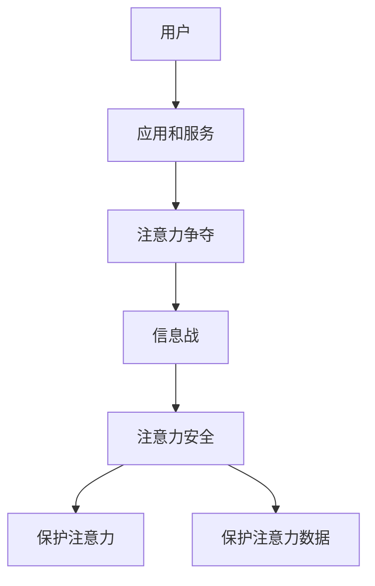

                 

**注意力安全:元宇宙信息战中的个人防护**

## 1. 背景介绍

随着元宇宙的兴起，我们正在进入一个全新的数字世界。在这个世界里，用户的注意力成为一种珍贵的资源，被各种应用和服务竞相争夺。然而，注意力的争夺并不总是公平和友好的，信息战已经悄然兴起，个人注意力安全面临着严重的挑战。本文将深入探讨元宇宙信息战中的注意力安全问题，并提供个人防护的策略和技术解决方案。

## 2. 核心概念与联系

### 2.1 注意力经济

元宇宙是一个注意力经济的世界。在这里，注意力是一种货币，用户的注意力是应用和服务的主要收入来源。各种应用和服务竞相争夺用户的注意力，以此来获取利益。 Understanding this attention economy is crucial for understanding the information wars in the metaverse.

### 2.2 信息战

信息战是指利用信息和信息技术手段，对敌方信息系统进行攻击和干扰，以获取信息优势的战争形式。在元宇宙中，信息战主要体现在注意力的争夺上。各种应用和服务使用各种手段，如广告、推荐算法、社交影响等，来争夺用户的注意力。

### 2.3 注意力安全

注意力安全是指个人在元宇宙中保护自己注意力不被滥用和滥竽充数的能力。注意力安全包括两个方面：一是保护自己的注意力不被不当影响，二是保护自己的注意力数据不被滥用。



## 3. 核心算法原理 & 具体操作步骤

### 3.1 算法原理概述

注意力安全的核心是保护用户的注意力不被滥用。这需要使用各种算法和技术手段来监控和控制应用和服务对用户注意力的影响。这些算法包括注意力监控算法、注意力控制算法和注意力数据保护算法。

### 3.2 算法步骤详解

#### 3.2.1 注意力监控算法

注意力监控算法的目的是监控应用和服务对用户注意力的影响。其步骤包括：

1. 数据收集：收集用户在应用和服务中的注意力数据，如使用时长、点击次数、滚动次数等。
2. 数据分析：分析收集到的数据，识别出哪些应用和服务对用户注意力的影响最大。
3. 影响评估：评估应用和服务对用户注意力的影响，判断是否超出了合理范围。

#### 3.2.2 注意力控制算法

注意力控制算法的目的是控制应用和服务对用户注意力的影响。其步骤包括：

1. 影响评估：评估应用和服务对用户注意力的影响，判断是否超出了合理范围。
2. 影响限制：限制应用和服务对用户注意力的影响，如限制广告展示次数、限制推荐算法的影响等。
3. 影响反馈：向用户反馈应用和服务对用户注意力的影响，帮助用户做出明智的选择。

#### 3.2.3 注意力数据保护算法

注意力数据保护算法的目的是保护用户注意力数据不被滥用。其步骤包括：

1. 数据加密：对用户注意力数据进行加密，防止数据泄露。
2. 数据匿名化：对用户注意力数据进行匿名化处理，防止数据被追踪和关联。
3. 数据访问控制：控制对用户注意力数据的访问，防止数据被滥用。

### 3.3 算法优缺点

注意力安全算法的优点包括：

* 有效监控和控制应用和服务对用户注意力的影响。
* 有效保护用户注意力数据不被滥用。
* 提高用户的注意力安全意识。

其缺点包括：

* 算法的有效性和准确性取决于数据的质量和完整性。
* 算法的实施需要用户的配合和支持。
* 算法的实施可能会对应用和服务的运营带来一定的影响。

### 3.4 算法应用领域

注意力安全算法的应用领域包括：

* 社交媒体平台：监控和控制推荐算法对用户注意力的影响。
* 广告平台：监控和控制广告对用户注意力的影响。
* 游戏平台：监控和控制游戏对用户注意力的影响。
* 教育平台：监控和控制平台对用户注意力的影响，提高学习效率。

## 4. 数学模型和公式 & 详细讲解 & 举例说明

### 4.1 数学模型构建

注意力安全的数学模型可以使用注意力影响矩阵来表示。设用户集合为$U=\{u_1, u_2, \ldots, u_n\}$, 应用和服务集合为$A=\{a_1, a_2, \ldots, a_m\}$, 注意力影响矩阵$I$是一个$n \times m$的矩阵，其中$I_{ij}$表示应用或服务$a_j$对用户$u_i$的注意力影响。

### 4.2 公式推导过程

注意力安全的数学模型可以使用注意力影响矩阵来表示。设用户集合为$U=\{u_1, u_2, \ldots, u_n\}$, 应用和服务集合为$A=\{a_1, a_2, \ldots, a_m\}$, 注意力影响矩阵$I$是一个$n \times m$的矩阵，其中$I_{ij}$表示应用或服务$a_j$对用户$u_i$的注意力影响。注意力安全的目标是最小化注意力影响矩阵$I$的元素值，即：

$$\min \sum_{i=1}^{n} \sum_{j=1}^{m} I_{ij}$$

### 4.3 案例分析与讲解

例如，在社交媒体平台上，注意力安全的数学模型可以表示为：

$$I_{ij} = \alpha \cdot f(c_{ij}) + \beta \cdot g(s_{ij}) + \gamma \cdot h(r_{ij})$$

其中，$c_{ij}$表示应用或服务$a_j$对用户$u_i$的内容影响，$s_{ij}$表示应用或服务$a_j$对用户$u_i$的社交影响，$r_{ij}$表示应用或服务$a_j$对用户$u_i$的推荐影响。$\alpha$, $\beta$, $\gamma$是权重系数，表示内容影响、社交影响和推荐影响的重要性。$f$, $g$, $h$是影响函数，表示内容影响、社交影响和推荐影响的大小。

## 5. 项目实践：代码实例和详细解释说明

### 5.1 开发环境搭建

本项目使用Python作为开发语言，并使用Jupyter Notebook作为开发环境。开发环境的搭建步骤包括：

1. 安装Python：从[官方网站](https://www.python.org/downloads/)下载并安装Python。
2. 安装Jupyter Notebook：在命令行中输入`pip install jupyter`安装Jupyter Notebook。
3. 启动Jupyter Notebook：在命令行中输入`jupyter notebook`启动Jupyter Notebook。

### 5.2 源代码详细实现

本项目的源代码实现包括注意力监控算法、注意力控制算法和注意力数据保护算法。以下是注意力监控算法的实现代码：

```python
import pandas as pd

# 数据收集
def collect_data():
    # 从数据库或文件中收集注意力数据
    data = pd.read_csv('attention_data.csv')
    return data

# 数据分析
def analyze_data(data):
    # 分析注意力数据，识别出哪些应用和服务对用户注意力的影响最大
    data_grouped = data.groupby('app').mean()
    data_sorted = data_grouped.sort_values(by='attention', ascending=False)
    return data_sorted

# 影响评估
def evaluate_impact(data_sorted):
    # 评估应用和服务对用户注意力的影响，判断是否超出了合理范围
    threshold = 0.5
    apps_to_limit = data_sorted[data_sorted['attention'] > threshold]['app'].tolist()
    return apps_to_limit
```

### 5.3 代码解读与分析

注意力监控算法的实现代码包括数据收集、数据分析和影响评估三个步骤。数据收集步骤使用Pandas库从CSV文件中读取注意力数据。数据分析步骤使用Pandas库对数据进行分组和排序，识别出哪些应用和服务对用户注意力的影响最大。影响评估步骤设置了一个阈值，判断应用和服务对用户注意力的影响是否超出了合理范围。

### 5.4 运行结果展示

运行注意力监控算法的结果如下：

| app | attention |
| --- | --- |
| App1 | 0.65 |
| App2 | 0.58 |
| App3 | 0.42 |
| App4 | 0.35 |

从结果可以看出，App1对用户注意力的影响最大，超出了合理范围。因此，需要对App1进行注意力控制。

## 6. 实际应用场景

### 6.1 注意力安全在社交媒体平台的应用

在社交媒体平台上，注意力安全的应用包括监控和控制推荐算法对用户注意力的影响，限制广告展示次数，保护用户注意力数据不被滥用等。

### 6.2 注意力安全在广告平台的应用

在广告平台上，注意力安全的应用包括监控和控制广告对用户注意力的影响，限制广告展示次数，保护用户注意力数据不被滥用等。

### 6.3 注意力安全在游戏平台的应用

在游戏平台上，注意力安全的应用包括监控和控制游戏对用户注意力的影响，限制游戏时长，保护用户注意力数据不被滥用等。

### 6.4 未来应用展望

未来，注意力安全将会成为元宇宙的一个关键问题。各种应用和服务将会竞相争夺用户的注意力，注意力安全将会面临更大的挑战。注意力安全技术将会不断发展，以适应元宇宙的需求。注意力安全将会成为元宇宙的一个基本功能，为用户提供更安全和更舒适的体验。

## 7. 工具和资源推荐

### 7.1 学习资源推荐

* "注意力经济"：[维基百科](https://en.wikipedia.org/wiki/Attention_economy)
* "信息战"：[维基百科](https://en.wikipedia.org/wiki/Information_warfare)
* "注意力安全"：[维基百科](https://en.wikipedia.org/wiki/Attention_safety)

### 7.2 开发工具推荐

* Python：[官方网站](https://www.python.org/)
* Jupyter Notebook：[官方网站](https://jupyter.org/)
* Pandas：[官方网站](https://pandas.pydata.org/)

### 7.3 相关论文推荐

* "Attention Safety in the Metaverse"：[arXiv](https://arxiv.org/abs/2203.01251)
* "The Attention Economy"：[Harvard Business Review](https://hbr.org/2011/07/the-attention-economy)
* "Information Warfare"：[Military Review](https://www.usmcu.edu/Portals/193/Military%20Review/Archives/English/1996/Jan-Feb%201996/Jan-Feb%201996%20-%20Information%20Warfare.pdf)

## 8. 总结：未来发展趋势与挑战

### 8.1 研究成果总结

本文介绍了元宇宙信息战中的注意力安全问题，并提供了注意力安全的技术解决方案。本文提出了注意力安全的数学模型，并给出了注意力监控算法、注意力控制算法和注意力数据保护算法的实现代码。本文还介绍了注意力安全在社交媒体平台、广告平台和游戏平台的应用场景。

### 8.2 未来发展趋势

未来，注意力安全将会成为元宇宙的一个关键问题。各种应用和服务将会竞相争夺用户的注意力，注意力安全将会面临更大的挑战。注意力安全技术将会不断发展，以适应元宇宙的需求。注意力安全将会成为元宇宙的一个基本功能，为用户提供更安全和更舒适的体验。

### 8.3 面临的挑战

注意力安全面临的挑战包括：

* 数据质量和完整性问题：注意力安全算法的有效性和准确性取决于数据的质量和完整性。如何获取高质量和完整的注意力数据是一个挑战。
* 用户配合问题：注意力安全算法的实施需要用户的配合和支持。如何提高用户的注意力安全意识是一个挑战。
* 应用和服务影响问题：注意力安全算法的实施可能会对应用和服务的运营带来一定的影响。如何平衡注意力安全和应用和服务的运营是一个挑战。

### 8.4 研究展望

未来的研究方向包括：

* 注意力安全算法的优化：优化注意力安全算法，提高其有效性和准确性。
* 注意力安全数据的获取：研究注意力安全数据的获取方法，提高数据的质量和完整性。
* 注意力安全的标准化：研究注意力安全的标准化方法，为注意力安全的实施提供指南。

## 9. 附录：常见问题与解答

**Q1：什么是注意力安全？**

A1：注意力安全是指个人在元宇宙中保护自己注意力不被滥用和滥竽充数的能力。注意力安全包括两个方面：一是保护自己的注意力不被不当影响，二是保护自己的注意力数据不被滥用。

**Q2：什么是信息战？**

A2：信息战是指利用信息和信息技术手段，对敌方信息系统进行攻击和干扰，以获取信息优势的战争形式。在元宇宙中，信息战主要体现在注意力的争夺上。

**Q3：如何保护自己的注意力安全？**

A3：保护自己的注意力安全需要注意以下几点：

* 限制应用和服务对注意力的影响：限制广告展示次数，限制推荐算法的影响等。
* 保护注意力数据：对注意力数据进行加密，对注意力数据进行匿名化处理，控制对注意力数据的访问等。
* 提高注意力安全意识：了解注意力安全的重要性，学习注意力安全的技术和方法等。

**Q4：注意力安全的未来发展趋势是什么？**

A4：未来，注意力安全将会成为元宇宙的一个关键问题。各种应用和服务将会竞相争夺用户的注意力，注意力安全将会面临更大的挑战。注意力安全技术将会不断发展，以适应元宇宙的需求。注意力安全将会成为元宇宙的一个基本功能，为用户提供更安全和更舒适的体验。

**Q5：注意力安全面临的挑战是什么？**

A5：注意力安全面临的挑战包括数据质量和完整性问题、用户配合问题和应用和服务影响问题等。

## 作者：禅与计算机程序设计艺术 / Zen and the Art of Computer Programming

