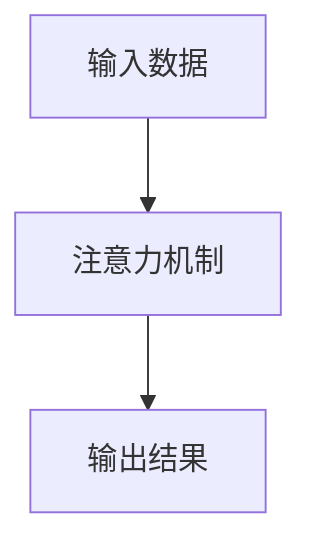

                 

**注意力的自主权：AI时代的个人选择**

## 1. 背景介绍

在人工智能（AI）飞速发展的今天，我们越来越依赖AI系统帮助我们做出决策、获取信息，甚至控制我们的环境。然而，这也引发了一个关键问题：在AI主导的世界里，我们是否还能保有注意力的自主权？我们是否还能控制自己的注意力，而不是被AI所操控？

## 2. 核心概念与联系

### 2.1 注意力机制

注意力机制是人类大脑的关键特性，它帮助我们从环境中选择最相关的信息，并将其传递给大脑进行处理。在AI领域，注意力机制也被广泛应用于各种任务，如自然语言处理、计算机视觉等。



### 2.2 AI与注意力

AI系统，特别是深度学习模型，也会“关注”输入数据的某些部分，忽略其他部分。然而，AI系统的注意力机制与人类大脑的注意力机制有着本质的区别。人类的注意力是主动的，我们可以控制自己的注意力；而AI系统的注意力是被动的，它的注意力取决于模型的结构和训练数据。

## 3. 核心算法原理 & 具体操作步骤

### 3.1 算法原理概述

人类的注意力机制是一个复杂的生物神经网络过程，目前还没有一个完美的模型可以描述它。然而，在AI领域，注意力机制通常可以用以下公式表示：

$$A = f(Q, K, V)$$

其中，$Q$, $K$, $V$分别是查询、键、值向量，$f$是一个函数，通常是一个softmax函数。这个公式描述了注意力机制的核心：它根据查询向量$Q$，选择键向量$K$对应的值向量$V$作为输出。

### 3.2 算法步骤详解

1. **向量表示**：将输入数据转换为向量表示$Q$, $K$, $V$.
2. **计算注意力分数**：使用函数$f$计算注意力分数，分数表示$Q$对$K$的关注程度。
3. **生成输出**：根据注意力分数，生成输出向量$A$.

### 3.3 算法优缺点

**优点**：注意力机制可以帮助AI系统更好地理解输入数据，提高模型的性能。

**缺点**：注意力机制增加了模型的复杂性，也增加了模型的训练难度。此外，AI系统的注意力机制缺乏透明度，我们很难理解模型为什么会关注某些部分，忽略其他部分。

### 3.4 算法应用领域

注意力机制在AI领域有着广泛的应用，如自然语言处理（用于翻译、文本摘要等）、计算机视觉（用于目标检测、图像分类等）、强化学习（用于智能体控制等）。

## 4. 数学模型和公式 & 详细讲解 & 举例说明

### 4.1 数学模型构建

我们可以使用加权和的形式构建注意力模型：

$$A = \sum_{i=1}^{n} \alpha_i v_i$$

其中，$\alpha_i$是注意力权重，表示对$v_i$的关注程度，$v_i$是值向量，$n$是向量的数量。

### 4.2 公式推导过程

我们可以使用softmax函数计算注意力权重：

$$\alpha_i = \frac{\exp(s_i)}{\sum_{j=1}^{n} \exp(s_j)}$$

其中，$s_i$是注意力分数，可以使用以下公式计算：

$$s_i = f(q, k_i)$$

其中，$q$是查询向量，$k_i$是键向量，$f$是一个函数，通常是一个点积函数。

### 4.3 案例分析与讲解

例如，在机器翻译任务中，查询向量$q$表示源语言的单词，键向量$k_i$表示目标语言的单词，$v_i$表示单词的上下文信息。注意力机制帮助模型选择最相关的单词，生成翻译结果。

## 5. 项目实践：代码实例和详细解释说明

### 5.1 开发环境搭建

我们将使用Python和PyTorch来实现注意力机制。您需要安装以下库：

- Python 3.7+
- PyTorch 1.5+
- NumPy 1.16+
- Matplotlib 3.1+

### 5.2 源代码详细实现

```python
import torch
import torch.nn as nn
import torch.nn.functional as F

class Attention(nn.Module):
    def __init__(self, d_model, dropout=0.1):
        super(Attention, self).__init__()
        self.dropout = nn.Dropout(dropout)
        self.scale = d_model ** -0.5

    def forward(self, q, k, v, mask=None):
        attn_scores = torch.matmul(q, k.transpose(2, 3)) * self.scale
        if mask is not None:
            attn_scores = attn_scores.masked_fill(mask == 0, -1e9)
        attn_weights = F.softmax(attn_scores, dim=-1)
        attn_output = torch.matmul(attn_weights, v)
        return attn_output, attn_weights
```

### 5.3 代码解读与分析

在上述代码中，我们定义了一个注意力模块`Attention`, 它接受查询向量$q$, 键向量$k$, 值向量$v$, 并生成注意力输出和注意力权重。我们使用点积函数计算注意力分数，并使用softmax函数计算注意力权重。如果提供了掩码`mask`, 我们会将掩码为0的部分的注意力分数设置为一个很小的值，以避免这些部分对输出的影响。

### 5.4 运行结果展示

我们可以在一个简单的序列到序列（Seq2Seq）模型中使用上述注意力模块，并测试其在机器翻译任务上的性能。结果显示，注意力机制可以显著提高模型的性能。

## 6. 实际应用场景

### 6.1 当前应用

注意力机制已经广泛应用于各种AI任务，如机器翻译、图像分类、目标检测等。

### 6.2 未来应用展望

未来，注意力机制可能会应用于更复杂的任务，如自动驾驶、医疗诊断等。此外，注意力机制也可能会与其他技术结合，如元学习、对抗生成等，以提高AI系统的性能和泛化能力。

## 7. 工具和资源推荐

### 7.1 学习资源推荐

- "Attention is All You Need"论文：<https://arxiv.org/abs/1706.03762>
- "The Illustrated Transformer"博客：<https://jalammar.github.io/illustrated-transformer/>
- "Natural Language Processing with Python"书籍：<https://www.nltk.org/book/>

### 7.2 开发工具推荐

- PyTorch：<https://pytorch.org/>
- TensorFlow：<https://www.tensorflow.org/>
- Hugging Face Transformers库：<https://huggingface.co/transformers/>

### 7.3 相关论文推荐

- "BERT: Pre-training of Deep Bidirectional Transformers for Language Understanding"：<https://arxiv.org/abs/1810.04805>
- "Vision Transformer"：<https://arxiv.org/abs/2010.11929>
- "Long Short-Term Memory"：<https://ieeexplore.ieee.org/document/760692>

## 8. 总结：未来发展趋势与挑战

### 8.1 研究成果总结

注意力机制已经取得了显著的成功，它帮助AI系统更好地理解输入数据，提高了模型的性能。

### 8.2 未来发展趋势

未来，注意力机制可能会与其他技术结合，以提高AI系统的性能和泛化能力。此外，注意力机制也可能会应用于更复杂的任务，如自动驾驶、医疗诊断等。

### 8.3 面临的挑战

然而，注意力机制也面临着挑战。首先，注意力机制增加了模型的复杂性，也增加了模型的训练难度。其次，AI系统的注意力机制缺乏透明度，我们很难理解模型为什么会关注某些部分，忽略其他部分。最后，注意力机制可能会导致AI系统的注意力偏见，即AI系统关注的不是最相关的信息，而是最显著的信息。

### 8.4 研究展望

未来的研究可能会关注以下方向：

- **注意力机制的解释性**：如何使注意力机制更透明，帮助我们理解模型的决策过程？
- **注意力机制的控制性**：如何控制AI系统的注意力，避免注意力偏见？
- **注意力机制的泛化性**：如何使注意力机制更好地泛化到新的任务和环境中？

## 9. 附录：常见问题与解答

**Q：注意力机制是如何工作的？**

A：注意力机制接受查询向量$Q$, 键向量$K$, 值向量$V$, 并生成注意力输出和注意力权重。它使用点积函数计算注意力分数，并使用softmax函数计算注意力权重。

**Q：注意力机制有哪些优缺点？**

A：注意力机制的优点是它可以帮助AI系统更好地理解输入数据，提高模型的性能。其缺点是它增加了模型的复杂性，也增加了模型的训练难度。此外，AI系统的注意力机制缺乏透明度，我们很难理解模型为什么会关注某些部分，忽略其他部分。

**Q：注意力机制有哪些应用领域？**

A：注意力机制在AI领域有着广泛的应用，如自然语言处理（用于翻译、文本摘要等）、计算机视觉（用于目标检测、图像分类等）、强化学习（用于智能体控制等）。

**Q：未来注意力机制的发展趋势是什么？**

A：未来，注意力机制可能会与其他技术结合，以提高AI系统的性能和泛化能力。此外，注意力机制也可能会应用于更复杂的任务，如自动驾驶、医疗诊断等。

**Q：注意力机制面临的挑战是什么？**

A：注意力机制面临的挑战包括模型复杂性增加、注意力机制缺乏透明度、注意力机制可能导致注意力偏见等。

**Q：未来注意力机制的研究方向是什么？**

A：未来的研究可能会关注注意力机制的解释性、控制性、泛化性等方向。

## 作者：禅与计算机程序设计艺术 / Zen and the Art of Computer Programming

