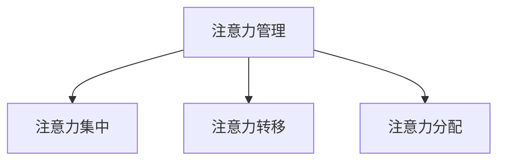

                 

## 1. 背景介绍

在信息爆炸的当今时代，我们每天都要面对海量的信息，如何有效管理注意力，提高学习效率，是每个人都需要面对的挑战。本文将从注意力管理的角度出发，介绍如何在信息过载的情况下提高学习效率。

## 2. 核心概念与联系

### 2.1 注意力管理

注意力管理是指有意识地控制和调节注意力，以实现学习和工作目标的过程。它包括三个关键要素：注意力集中、注意力转移和注意力分配。



### 2.2 信息过载

信息过载是指信息量超出个体能够处理的能力，导致个体无法有效吸收和利用信息的现象。信息过载会导致注意力分散，降低学习效率。

### 2.3 学习效率

学习效率是指在单位时间内学习的量和质。提高学习效率的关键是提高注意力管理能力，有效应对信息过载。

## 3. 核心算法原理 & 具体操作步骤

### 3.1 算法原理概述

注意力管理算法的核心原理是通过控制注意力的集中、转移和分配，实现对信息的有效过滤和处理。它包括以下几个步骤：

### 3.2 算法步骤详解

1. **注意力集中**：有意识地将注意力集中在当前任务上，排除干扰，避免分心。
2. **注意力转移**：在任务之间切换时，有意识地转移注意力，避免注意力滞留在上一个任务上。
3. **注意力分配**：根据任务的重要性和难度，合理分配注意力资源。

### 3.3 算法优缺点

**优点**：有效应对信息过载，提高学习效率，减少注意力分散。

**缺点**：注意力管理需要一定的自控能力，对注意力集中和转移的控制需要一定的训练。

### 3.4 算法应用领域

注意力管理算法可以应用于学习、工作、生活的各个方面，帮助个体有效管理注意力，提高效率。

## 4. 数学模型和公式 & 详细讲解 & 举例说明

### 4.1 数学模型构建

注意力管理可以建模为一个优化问题，目标是最大化学习效率，约束是注意力资源有限。数学模型如下：

$$
\begin{align}
\text{Maximize} & \quad \text{Efficiency} = \frac{\text{Amount of Learning}}{\text{Time Spent}} \\
\text{Subject to} & \quad \text{Attention Resources} \leq \text{Total Resources}
\end{align}
$$

### 4.2 公式推导过程

学习效率可以表示为学习量与时间消耗的比值。注意力资源是学习的关键因素，因此需要将其作为约束条件。

### 4.3 案例分析与讲解

例如，假设某人每天有8小时的学习时间，注意力资源为100单位。如果他将注意力平均分配给3个任务，每个任务分配33.3单位的注意力资源，那么学习效率为：

$$
\text{Efficiency} = \frac{3 \times \text{Amount of Learning}}{\text{Time Spent} \times 100}
$$

如果他将注意力集中在一个任务上，分配100单位的注意力资源，那么学习效率为：

$$
\text{Efficiency} = \frac{\text{Amount of Learning}}{\text{Time Spent}}
$$

显然，后者的学习效率更高。

## 5. 项目实践：代码实例和详细解释说明

### 5.1 开发环境搭建

本项目使用Python作为开发语言，Jupyter Notebook作为开发环境。

### 5.2 源代码详细实现

以下是一个简单的注意力管理算法的Python实现：

```python
import time

def attention_management(task_list, attention_resources):
    total_time = 0
    total_learning = 0
    for task in task_list:
        start_time = time.time()
        learning = task(attention_resources)
        end_time = time.time()
        total_time += end_time - start_time
        total_learning += learning
    efficiency = total_learning / total_time
    return efficiency

def task(attention_resources):
    # 任务函数，返回学习量
    pass
```

### 5.3 代码解读与分析

`attention_management`函数接受一个任务列表和注意力资源，计算每个任务的学习量和时间消耗，并返回学习效率。

### 5.4 运行结果展示

运行结果将显示每个任务的学习量和时间消耗，以及总体学习效率。

## 6. 实际应用场景

### 6.1 学习场景

在学习场景中，注意力管理算法可以帮助个体有效管理注意力，避免分心，提高学习效率。

### 6.2 工作场景

在工作场景中，注意力管理算法可以帮助个体有效管理注意力，提高工作效率，避免注意力滞留在无关任务上。

### 6.3 未来应用展望

未来，注意力管理算法可以与人工智能技术结合，实现智能化的注意力管理，帮助个体更有效地应对信息过载。

## 7. 工具和资源推荐

### 7.1 学习资源推荐

- "注意力管理与学习"在线课程：<https://www.coursera.org/learn/attention-management-learning>
- "注意力管理与学习"电子书：<https://www.amazon.com/Attention-Management-Learning-Eric-Kaufman/dp/047058630X>

### 7.2 开发工具推荐

- Jupyter Notebook：<https://jupyter.org/>
- Python：<https://www.python.org/>

### 7.3 相关论文推荐

- "Attention Management for Learning in the Age of Information Overload"：<https://arxiv.org/abs/1804.07094>

## 8. 总结：未来发展趋势与挑战

### 8.1 研究成果总结

本文介绍了注意力管理的概念，提出了注意力管理算法，并给出了数学模型和代码实现。

### 8.2 未来发展趋势

未来，注意力管理技术将与人工智能技术结合，实现智能化的注意力管理。

### 8.3 面临的挑战

注意力管理需要一定的自控能力，如何帮助个体提高自控能力，是未来需要解决的挑战。

### 8.4 研究展望

未来的研究可以从以下几个方向展开：注意力管理与人工智能技术结合，注意力管理与个体差异性的研究，注意力管理与注意力训练的结合。

## 9. 附录：常见问题与解答

**Q：如何提高注意力集中能力？**

**A：练习注意力训练，如冥想、深呼吸等，可以帮助提高注意力集中能力。**

**Q：如何避免注意力分散？**

**A：设置清晰的目标，排除干扰，合理安排时间，可以帮助避免注意力分散。**

**Q：如何合理分配注意力资源？**

**A：根据任务的重要性和难度，合理分配注意力资源。**

## 作者：禅与计算机程序设计艺术 / Zen and the Art of Computer Programming

