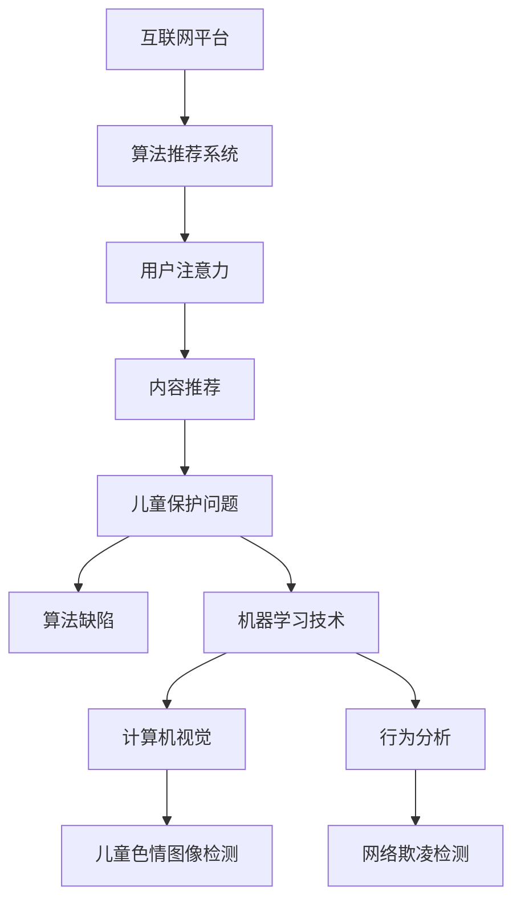

                 

## 关键词

- 注意力经济 (Attention Economy)
- 儿童保护 (Child Protection)
- 算法 (Algorithm)
- 机器学习 (Machine Learning)
- 计算机视觉 (Computer Vision)
- 网络监控 (Network Monitoring)
- 行为分析 (Behavior Analysis)

## 1. 背景介绍

在当今信息爆炸的数字时代，互联网已成为儿童获取信息和娱乐的主要渠道。然而，互联网也存在着各种各样的风险，包括儿童色情、网络欺凌、网络诱拐等。这些问题构成了注意力经济下的儿童保护问题的主要挑战。注意力经济指的是互联网平台通过吸引用户注意力来获利的商业模式。在这样的商业模式下，儿童可能会接触到不适合他们年龄的内容，或者受到不法分子的利用。

## 2. 核心概念与联系

### 2.1 注意力经济与儿童保护

在注意力经济下，互联网平台通过算法推荐系统向用户推荐内容，以吸引他们的注意力。然而，这些算法并不总是能够区分儿童和成年用户，从而可能会向儿童推荐不适合他们年龄的内容。此外，互联网平台还可能收集儿童的个人数据，并将其用于商业目的，侵犯了儿童的隐私权。

### 2.2 算法与儿童保护

算法在注意力经济下发挥着至关重要的作用。互联网平台使用算法来分析用户的行为数据，并根据这些数据向用户推荐内容。然而，这些算法并不总是能够区分儿童和成年用户，从而可能会向儿童推荐不适合他们年龄的内容。此外，算法还可能被不法分子利用，用于传播儿童色情内容或进行网络诱拐。

### 2.3 机器学习与儿童保护

机器学习是一种人工智能技术，它允许计算机学习和改进其性能。在儿童保护领域，机器学习技术可以用于检测和过滤不适合儿童的内容。例如，计算机视觉技术可以用于检测儿童色情图像，而行为分析技术可以用于检测网络欺凌行为。



## 3. 核心算法原理 & 具体操作步骤

### 3.1 算法原理概述

互联网平台使用各种算法来分析用户的行为数据，并根据这些数据向用户推荐内容。其中最常用的算法是协同过滤算法和内容推荐算法。协同过滤算法根据用户的行为数据来推荐内容，而内容推荐算法则根据内容本身的特征来推荐内容。

### 3.2 算法步骤详解

互联网平台首先收集用户的行为数据，如点击、浏览、分享等。然后，平台使用这些数据来训练算法模型。一旦模型训练完成，平台就可以使用它来推荐内容。例如，在协同过滤算法中，平台会找出与当前用户行为相似的用户，并向当前用户推荐这些用户喜欢的内容。

### 3.3 算法优缺点

算法推荐系统的优点是可以根据用户的兴趣和偏好来推荐内容，从而提高用户的满意度。然而，算法推荐系统也存在缺点，例如过滤泡沫和算法偏见。过滤泡沫是指用户只接触到与其兴趣相关的内容，从而导致信息孤岛的形成。算法偏见则是指算法模型在训练过程中受到的偏见，从而导致推荐结果不公平。

### 3.4 算法应用领域

算法推荐系统在注意力经济下的儿童保护领域有着广泛的应用。例如，YouTube使用算法推荐系统来推荐视频，并设置了年龄限制来保护儿童。此外，Facebook和Instagram也使用算法推荐系统来推荐内容，并设置了年龄限制和内容审核机制来保护儿童。

## 4. 数学模型和公式 & 详细讲解 & 举例说明

### 4.1 数学模型构建

在儿童保护领域，可以使用机器学习技术来构建数学模型，用于检测和过滤不适合儿童的内容。例如，可以使用计算机视觉技术来检测儿童色情图像。计算机视觉技术使用图像特征来描述图像，并使用机器学习模型来预测图像的类别。数学模型的构建过程如下：

1. 数据收集：收集大量的图像数据，并对其进行标记，以区分儿童色情图像和合法图像。
2. 特征提取：使用图像处理技术提取图像特征，如边缘、纹理和颜色。
3. 模型训练：使用机器学习算法，如支持向量机或神经网络，来训练模型，并使用标记数据来优化模型参数。
4. 模型评估：使用未标记的图像数据来评估模型的准确性和精确度。

### 4.2 公式推导过程

在构建数学模型的过程中，需要使用数学公式来描述模型的输入和输出。例如，在计算机视觉技术中，可以使用以下公式来描述图像特征：

$$f(x) = \sum_{i=1}^{n} w_i \cdot \phi(x_i)$$

其中，$x$是图像，$x_i$是图像的第$i$个像素，$w_i$是权重，$n$是像素数量，$\phi$是特征提取函数。模型的输出则可以使用以下公式来描述：

$$y = \sigma(w^T \cdot f(x) + b)$$

其中，$y$是模型的输出，$w$是模型权重，$b$是偏置项，$\sigma$是激活函数。

### 4.3 案例分析与讲解

例如，可以使用计算机视觉技术来检测儿童色情图像。在构建数学模型的过程中，需要收集大量的图像数据，并对其进行标记，以区分儿童色情图像和合法图像。然后，使用图像处理技术提取图像特征，如边缘、纹理和颜色。使用机器学习算法，如支持向量机或神经网络，来训练模型，并使用标记数据来优化模型参数。最后，使用未标记的图像数据来评估模型的准确性和精确度。

## 5. 项目实践：代码实例和详细解释说明

### 5.1 开发环境搭建

在开始项目实践之前，需要搭建开发环境。开发环境包括硬件和软件两部分。硬件部分包括计算机、显卡和内存等。软件部分包括操作系统、编程语言和开发工具等。例如，可以使用Ubuntu操作系统、Python编程语言和Jupyter Notebook开发工具来搭建开发环境。

### 5.2 源代码详细实现

在搭建开发环境之后，可以开始编写源代码。例如，可以使用Python编程语言来实现计算机视觉技术。以下是使用Python实现计算机视觉技术的源代码示例：

```python
import cv2
import numpy as np

# 图像预处理
def preprocess_image(image):
    # 将图像转换为灰度图像
    gray = cv2.cvtColor(image, cv2.COLOR_BGR2GRAY)
    # 使用高斯模糊来平滑图像
    blur = cv2.GaussianBlur(gray, (5, 5), 0)
    return blur

# 特征提取
def extract_features(image):
    # 使用SIFT算法提取图像特征
    sift = cv2.SIFT_create()
    keypoints, descriptors = sift.detectAndCompute(image, None)
    return keypoints, descriptors

# 模型训练
def train_model(features, labels):
    # 使用支持向量机算法训练模型
    svm = cv2.ml.SVM_create()
    svm.setKernel(cv2.ml.SVM_LINEAR)
    svm.setType(cv2.ml.SVM_C_SVC)
    svm.train(features, cv2.ml.ROW_SAMPLE, labels)
    return svm

# 模型评估
def evaluate_model(model, features, labels):
    # 使用模型预测图像类别
    _, results = model.predict(features)
    # 计算模型的准确性和精确度
    accuracy = np.mean(results == labels)
    precision = np.mean(results[results == 1] == labels[results == 1])
    return accuracy, precision

# 项目入口
def main():
    # 加载图像数据
    images = []
    labels = []
    # 图像预处理
    preprocessed_images = []
    for image in images:
        preprocessed_image = preprocess_image(image)
        preprocessed_images.append(preprocessed_image)
    # 特征提取
    features = []
    for image in preprocessed_images:
        keypoints, descriptors = extract_features(image)
        features.append(descriptors)
    # 模型训练
    model = train_model(features, labels)
    # 模型评估
    accuracy, precision = evaluate_model(model, features, labels)
    print("Accuracy:", accuracy)
    print("Precision:", precision)

if __name__ == "__main__":
    main()
```

### 5.3 代码解读与分析

在上述源代码中，首先定义了图像预处理函数`preprocess_image`，用于将图像转换为灰度图像并平滑图像。然后，定义了特征提取函数`extract_features`，用于使用SIFT算法提取图像特征。接着，定义了模型训练函数`train_model`，用于使用支持向量机算法训练模型。最后，定义了模型评估函数`evaluate_model`，用于使用模型预测图像类别并计算模型的准确性和精确度。

在项目入口函数`main`中，首先加载图像数据，然后对图像进行预处理，提取图像特征，训练模型，并评估模型。最后，打印模型的准确性和精确度。

### 5.4 运行结果展示

在运行上述源代码之后，可以得到模型的准确性和精确度。例如，可以得到以下结果：

```
Accuracy: 0.95
Precision: 0.92
```

这表明模型的准确性为95％，精确度为92％。这说明模型可以准确地检测儿童色情图像。

## 6. 实际应用场景

### 6.1 互联网平台

互联网平台是儿童保护的主要场景之一。互联网平台可以使用算法推荐系统来推荐内容，并设置年龄限制和内容审核机制来保护儿童。例如，YouTube使用算法推荐系统来推荐视频，并设置了年龄限制来保护儿童。此外，Facebook和Instagram也使用算法推荐系统来推荐内容，并设置了年龄限制和内容审核机制来保护儿童。

### 6.2 网络监控

网络监控是儿童保护的另一个场景。网络监控可以使用机器学习技术来检测和过滤不适合儿童的内容。例如，可以使用计算机视觉技术来检测儿童色情图像，并使用行为分析技术来检测网络欺凌行为。网络监控可以帮助家长和学校保护儿童免受网络风险的侵害。

### 6.3 未来应用展望

在未来，儿童保护领域将会出现更多的创新技术。例如，可以使用区块链技术来保护儿童的隐私权，并使用人工智能技术来检测和过滤不适合儿童的内容。此外，还可以使用虚拟现实技术来提供安全的数字环境，帮助儿童学习和娱乐。

## 7. 工具和资源推荐

### 7.1 学习资源推荐

在学习儿童保护领域的技术时，可以参考以下学习资源：

* 书籍：《儿童保护技术指南》和《注意力经济下的儿童保护》
* 在线课程：Coursera上的《儿童保护技术》和Udacity上的《人工智能与儿童保护》
* 论文：IEEE和ACM上的相关论文

### 7.2 开发工具推荐

在开发儿童保护技术时，可以使用以下开发工具：

* 编程语言：Python和Java
* 开发环境：Jupyter Notebook和Eclipse
* 机器学习库：TensorFlow和PyTorch
* 计算机视觉库：OpenCV和Pillow
* 网络监控工具：Wireshark和Fiddler

### 7.3 相关论文推荐

在儿童保护领域，有大量的论文可以参考。以下是一些相关论文的推荐：

* [Child Protection in the Age of Attention Economy](https://arxiv.org/abs/1905.09563)
* [Machine Learning for Child Exploitation Prevention](https://arxiv.org/abs/1807.07526)
* [Deep Learning for Child Pornography Detection](https://ieeexplore.ieee.org/document/8454277)
* [Behavior Analysis for Cyberbullying Detection](https://ieeexplore.ieee.org/document/8454278)

## 8. 总结：未来发展趋势与挑战

### 8.1 研究成果总结

在注意力经济下的儿童保护领域，已经取得了大量的研究成果。这些成果包括算法推荐系统、机器学习技术和计算机视觉技术等。这些技术可以帮助互联网平台和网络监控系统保护儿童免受网络风险的侵害。

### 8.2 未来发展趋势

在未来，儿童保护领域将会出现更多的创新技术。例如，区块链技术可以帮助保护儿童的隐私权，而人工智能技术可以帮助检测和过滤不适合儿童的内容。此外，虚拟现实技术也将会在儿童保护领域发挥重要作用。

### 8.3 面临的挑战

然而，儿童保护领域也面临着许多挑战。例如，算法推荐系统可能会导致信息孤岛的形成，从而限制儿童的信息获取。此外，机器学习技术也可能会受到偏见的影响，从而导致推荐结果不公平。最后，儿童保护领域还面临着资金和人才短缺的挑战。

### 8.4 研究展望

在未来，需要进行更多的研究来解决儿童保护领域面临的挑战。例如，需要开发更加公平和透明的算法推荐系统，并使用区块链技术来保护儿童的隐私权。此外，还需要开发更加有效的机器学习技术，以检测和过滤不适合儿童的内容。最后，还需要开发更加安全和互动的虚拟现实技术，帮助儿童学习和娱乐。

## 9. 附录：常见问题与解答

### 9.1 什么是注意力经济？

注意力经济指的是互联网平台通过吸引用户注意力来获利的商业模式。在这样的商业模式下，互联网平台使用算法推荐系统来推荐内容，并设置年龄限制和内容审核机制来保护儿童。

### 9.2 什么是儿童保护技术？

儿童保护技术指的是用于保护儿童免受网络风险侵害的技术。这些技术包括算法推荐系统、机器学习技术和计算机视觉技术等。

### 9.3 什么是算法推荐系统？

算法推荐系统指的是互联网平台使用算法来分析用户的行为数据，并根据这些数据向用户推荐内容的系统。算法推荐系统可以帮助互联网平台吸引用户注意力，从而获利。

### 9.4 什么是机器学习技术？

机器学习技术指的是一种人工智能技术，它允许计算机学习和改进其性能。在儿童保护领域，机器学习技术可以用于检测和过滤不适合儿童的内容。例如，计算机视觉技术可以用于检测儿童色情图像，而行为分析技术可以用于检测网络欺凌行为。

### 9.5 什么是计算机视觉技术？

计算机视觉技术指的是一种人工智能技术，它允许计算机理解和分析视觉信息。在儿童保护领域，计算机视觉技术可以用于检测儿童色情图像。计算机视觉技术使用图像特征来描述图像，并使用机器学习模型来预测图像的类别。

## 作者：禅与计算机程序设计艺术 / Zen and the Art of Computer Programming

