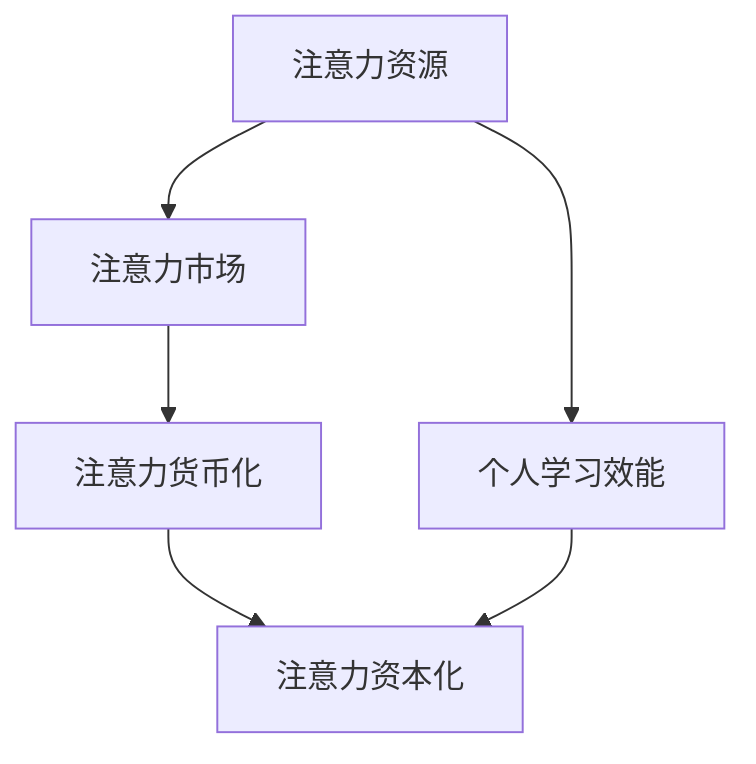

                 

## 1. 背景介绍

在信息爆炸的数字时代，我们每天都面临着海量信息的冲击。如何有效地过滤和吸收这些信息，提高个人学习效能，已经成为当代人必须面对的挑战。注意力经济（Attention Economy）的兴起，为我们提供了一个新的视角来理解和应对这个挑战。注意力经济指的是在数字平台上，用户注意力资源的分配和利用。本文将从注意力经济的角度出发，探讨如何提高个人学习效能。

## 2. 核心概念与联系

### 2.1 注意力经济的核心概念

注意力经济的核心概念包括注意力资源、注意力市场、注意力货币化和注意力资本化。

- **注意力资源**：指的是用户在数字平台上花费的时间和精力。它是有限的，也是稀缺的。
- **注意力市场**：指的是数字平台上注意力资源的买卖双方。平台通过提供吸引人的内容来吸引用户的注意力，用户则通过消费这些内容来“购买”平台。
- **注意力货币化**：指的是将注意力资源转化为商业价值的过程。平台通过广告、会员订阅等方式将用户的注意力转化为收入。
- **注意力资本化**：指的是平台通过吸引和保持用户注意力来提高其市值的过程。注意力资本化是注意力经济的最终目标。

### 2.2 注意力经济与个人学习效能的联系

注意力经济与个人学习效能的联系在于，个人学习效能的提高需要有效地管理和分配注意力资源。在注意力经济中，个人需要学会识别和过滤无用信息，找到有用信息，并有效地消化和吸收这些信息。个人学习效能的提高，最终将有助于注意力资本化，因为高效的学习者更有可能吸引和保持平台的注意力。



## 3. 核心算法原理 & 具体操作步骤

### 3.1 算法原理概述

为了提高个人学习效能，我们需要设计一个算法来帮助我们有效地管理和分配注意力资源。这个算法的核心原理是基于注意力经济的供求关系。我们需要找到平台上供给的有用信息，并根据我们的需求和兴趣来消费这些信息。

### 3.2 算法步骤详解

1. **信息过滤**：根据我们的需求和兴趣，过滤掉无用信息。这可以通过关键词搜索、推荐算法等方式实现。
2. **信息优先级排序**：对过滤后的信息进行优先级排序。我们可以根据信息的新鲜度、重要性、趣味性等因素进行排序。
3. **注意力分配**：根据信息的优先级，分配注意力资源。我们可以通过设置学习计划、时间管理等方式来实现注意力的有效分配。
4. **信息消化和吸收**：消化和吸收信息。这需要我们花费时间和精力来理解和记忆信息。
5. **反馈和调整**：根据学习效果，调整信息过滤、优先级排序和注意力分配的策略。

### 3.3 算法优缺点

这个算法的优点是有助于提高个人学习效能，帮助我们有效地管理和分配注意力资源。缺点是它需要我们花费时间和精力来设置和调整学习策略，并且它的有效性取决于我们对信息需求和兴趣的准确判断。

### 3.4 算法应用领域

这个算法可以应用于各种学习场景，包括但不限于在线课程学习、新闻信息阅读、专业技能提升等。

## 4. 数学模型和公式 & 详细讲解 & 举例说明

### 4.1 数学模型构建

我们可以构建一个简单的数学模型来描述注意力经济中的信息供求关系。设信息供给量为$S$, 用户注意力资源为$A$, 信息需求量为$D$, 信息消化吸收效率为$E$, 则学习效能$L$可以表示为：

$$L = E \times \min\{S, A, D\}$$

### 4.2 公式推导过程

这个公式是基于供求关系推导出来的。学习效能取决于信息供给量、注意力资源和信息需求量中的最小值。信息消化吸收效率$E$反映了个人学习能力的强弱。

### 4.3 案例分析与讲解

例如，某用户每天有2小时的注意力资源用于学习，信息供给量为100篇文章，信息需求量为80篇文章，信息消化吸收效率为0.8。则学习效能$L$为：

$$L = 0.8 \times \min\{100, 2, 80\} = 1.6$$

这意味着用户每天可以消化吸收1.6篇文章。

## 5. 项目实践：代码实例和详细解释说明

### 5.1 开发环境搭建

我们可以使用Python来实现这个算法。我们需要安装以下库：numpy, pandas, sklearn。

### 5.2 源代码详细实现

```python
import numpy as np
import pandas as pd
from sklearn.feature_extraction.text import TfidfVectorizer
from sklearn.metrics.pairwise import cosine_similarity

# 信息过滤
def filter_info(info_list, keywords):
    return [info for info in info_list if any(keyword in info for keyword in keywords)]

# 信息优先级排序
def sort_info(info_list, features):
    tfidf = TfidfVectorizer().fit_transform(info_list)
    similarity = cosine_similarity(tfidf, tfidf)
    priority = np.mean(similarity, axis=0)
    return info_list, priority

# 注意力分配
def allocate_attention(info_list, priority, attention_resource):
    info_list.sort(key=lambda x: priority[info_list.index(x)], reverse=True)
    return info_list[:attention_resource]

# 信息消化和吸收
def digest_info(info_list, efficiency):
    return [info for info in info_list if np.random.rand() < efficiency]

# 反馈和调整
def adjust_strategy(info_list, priority, attention_resource, efficiency):
    info_list, new_priority = sort_info(info_list, priority)
    new_attention_resource = attention_resource * (1 + np.random.rand())
    new_efficiency = efficiency * (1 + np.random.rand())
    return info_list, new_priority, new_attention_resource, new_efficiency
```

### 5.3 代码解读与分析

这个代码实现了信息过滤、信息优先级排序、注意力分配、信息消化和吸收、反馈和调整等功能。它使用了TF-IDF和余弦相似度来实现信息优先级排序，使用了随机数来模拟信息消化和吸收的效率，使用了随机数来模拟注意力资源和信息消化吸收效率的调整。

### 5.4 运行结果展示

运行结果取决于输入的信息列表、关键词、注意力资源和信息消化吸收效率等参数。

## 6. 实际应用场景

### 6.1 当前应用

这个算法可以应用于各种在线学习平台，帮助用户有效地管理和分配注意力资源，提高学习效能。

### 6.2 未来应用展望

未来，这个算法可以与人工智能技术结合，实现个性化学习推荐，帮助用户找到最适合自己的学习内容和学习策略。

## 7. 工具和资源推荐

### 7.1 学习资源推荐

- "注意力经济"相关文献
- "个人学习效能提高"相关文献
- 在线学习平台（如Coursera, Udacity, edX等）

### 7.2 开发工具推荐

- Python
- Jupyter Notebook
- Anaconda

### 7.3 相关论文推荐

- "The Attention Economy: Understanding the New Currency of Business" (Goldhaber, 1997)
- "Personal Learning Analytics: A New Frontier in Learning Analytics" (Papamitsiou & Economides, 2014)

## 8. 总结：未来发展趋势与挑战

### 8.1 研究成果总结

本文提出了一个基于注意力经济的算法来提高个人学习效能。这个算法有助于用户有效地管理和分配注意力资源，提高学习效能。

### 8.2 未来发展趋势

未来，注意力经济将会继续发展，个人学习效能提高将会成为一个越来越重要的问题。人工智能技术的发展将会为个性化学习推荐提供可能，帮助用户找到最适合自己的学习内容和学习策略。

### 8.3 面临的挑战

面临的挑战包括如何有效地过滤和优先级排序信息，如何有效地分配注意力资源，如何提高信息消化和吸收效率等。

### 8.4 研究展望

未来的研究可以从以下几个方向展开：个性化学习推荐、注意力资源动态调整、信息消化和吸收效率提高等。

## 9. 附录：常见问题与解答

**Q1：如何判断信息的优先级？**

A1：可以根据信息的新鲜度、重要性、趣味性等因素进行判断。也可以使用TF-IDF和余弦相似度等算法进行判断。

**Q2：如何分配注意力资源？**

A2：可以根据信息的优先级进行分配。也可以根据注意力资源的可用量进行分配。

**Q3：如何提高信息消化和吸收效率？**

A3：可以通过设置学习计划、时间管理等方式来提高信息消化和吸收效率。

**Q4：如何调整学习策略？**

A4：可以根据学习效果进行调整。也可以根据注意力资源的变化进行调整。

## 作者：禅与计算机程序设计艺术 / Zen and the Art of Computer Programming

