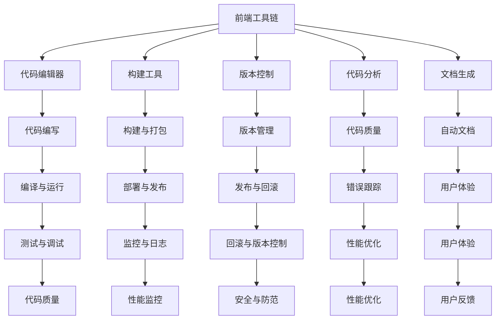

                 

# Web前端工程化最佳实践

> 关键词：Web前端工程化, 前端工具链, 组件化, 架构设计, 性能优化, 用户体验

## 1. 背景介绍

在过去的十年中，Web前端技术经历了翻天覆地的变化。从最初的DOM操作，到框架的崛起，再到组件化、工程化、微服务化等新概念的涌现，Web前端技术的发展越来越成熟，也越来越复杂。然而，随着项目规模的不断扩大，前端工程化的需求日益迫切。如何通过工程化的手段，提升项目的开发效率、代码质量和用户体验，成为前端开发者必须面对的重要问题。本文将从Web前端工程化的核心概念和最佳实践出发，详细阐述前端工程化的重要性和操作方法。

## 2. 核心概念与联系

### 2.1 核心概念概述

Web前端工程化是指通过系统化、标准化的工程手段，来提升Web前端项目的开发效率、代码质量、可维护性和用户体验的过程。其核心概念包括前端工具链、组件化、架构设计、性能优化、用户体验等方面。

**前端工具链**：指的是前端开发者常用的各种工具，包括构建工具、代码编辑器、版本控制、文档生成、代码分析等。这些工具可以极大地提升开发效率，减少人为错误。

**组件化**：是指将大型项目拆分为可复用的模块或组件，以提高代码的可维护性和可扩展性。通过组件化，前端项目能够更好地适应变化，同时降低开发和维护成本。

**架构设计**：包括前端项目的整体结构和模块划分。良好的架构设计能够帮助项目构建稳定、可扩展的生态系统，同时提高代码的可读性和可维护性。

**性能优化**：是指通过各种技术和手段，来提升Web应用的速度和响应性能，以提高用户体验。性能优化包括代码优化、资源压缩、异步加载、CDN等方法。

**用户体验**：是指通过提升Web应用的响应速度、交互流畅性、易用性等，来提高用户的使用感受。优秀的用户体验不仅能提升用户满意度，还能增加用户的黏性和留存率。

这些核心概念之间存在紧密的联系，共同构成了Web前端工程化的整个生态系统。通过深入理解并灵活运用这些概念，前端开发者可以构建高质量、高性能、易维护的前端项目。

### 2.2 核心概念原理和架构的 Mermaid 流程图



这个图表展示前端工具链与前端开发活动的相互关系。前端工具链提供了各类工具支持，前端开发者通过代码编辑器、构建工具、版本控制等工具，将代码转化为可运行的产品。同时，代码分析、文档生成等工具，可以辅助开发过程，提升代码质量和可维护性。最终，通过测试与调试、性能优化、用户体验等手段，提升产品的质量和用户体验。

## 3. 核心算法原理 & 具体操作步骤

### 3.1 算法原理概述

Web前端工程化的核心算法原理包括前端工具链的选择与配置、组件化的设计与管理、架构设计的原则与实践、性能优化的策略与手段、用户体验的提升方法等。这些原理和方法，通过系统化的实践，能够极大地提升前端项目的开发效率和质量。

### 3.2 算法步骤详解

Web前端工程化的具体操作步骤包括如下几步：

**Step 1: 选择工具链**

1. 选择合适的构建工具，如Webpack、Rollup等，用于打包和构建前端应用。
2. 选择适合的前端代码编辑器，如Visual Studio Code、Sublime Text等，提高开发效率。
3. 配置版本控制系统，如Git，进行代码的协同管理和版本控制。
4. 安装代码分析工具，如ESLint、Prettier等，检查代码质量和风格。
5. 配置文档生成工具，如Sphinx、Docusaurus等，生成项目文档。

**Step 2: 设计组件化**

1. 将项目拆分为可复用的组件，如路由、状态管理、UI组件等。
2. 定义组件之间的接口和交互方式，通过组件库进行管理和复用。
3. 设计组件的样式和布局，提高代码的可读性和可维护性。

**Step 3: 架构设计**

1. 设计前端项目的整体结构和模块划分，如MVC、MVVM等。
2. 选择合适的框架和库，如React、Vue等，构建前端应用。
3. 设计数据流和状态管理方式，如Redux、Vuex等，管理应用程序的状态。
4. 设计前端和后端的通信方式，如RESTful API、GraphQL等，实现数据的传递。

**Step 4: 性能优化**

1. 通过代码优化、资源压缩、异步加载等方法，减少页面加载时间。
2. 使用CDN等手段，提高资源的访问速度和可用性。
3. 使用懒加载、虚拟DOM等技术，优化渲染性能。
4. 使用缓存技术，减少重复请求和资源浪费。

**Step 5: 提升用户体验**

1. 通过交互动画、表单验证、用户提示等手段，提升用户体验。
2. 设计友好的界面和布局，提升用户的沉浸感和满意度。
3. 使用A/B测试等方法，验证和优化用户体验。

### 3.3 算法优缺点

**优点**：

1. 提高开发效率：通过工具链、组件化、架构设计等手段，可以大大提高开发效率和代码质量。
2. 提高可维护性：通过组件化、架构设计等手段，可以降低代码耦合度，提高代码的可维护性和可扩展性。
3. 提高用户体验：通过性能优化和用户体验提升，可以提升用户的满意度，增加用户黏性。

**缺点**：

1. 初始成本高：选择工具链、设计架构、配置系统等需要一定的学习成本和技术积累。
2. 复杂度增加：引入工具链、组件化、架构设计等，项目复杂度可能会增加，需要更高的技术要求。
3. 维护成本高：需要持续维护工具链和架构，防止出现技术债务。

### 3.4 算法应用领域

Web前端工程化适用于各种规模和类型的Web项目，包括SaaS产品、企业应用、单页应用、移动端应用等。其应用领域包括但不限于：

1. 电商网站：提升页面加载速度、优化用户体验，提高购物效率和满意度。
2. 企业应用：提高开发效率、代码质量，降低维护成本，提升应用稳定性和安全性。
3. 移动端应用：提升应用的性能和响应速度，提供良好的用户交互体验。
4. 数据可视化应用：优化渲染性能，提供流畅的交互体验。
5. 游戏应用：提升游戏的渲染速度和用户体验，优化游戏的流畅性和响应性。

## 4. 数学模型和公式 & 详细讲解 & 举例说明

### 4.1 数学模型构建

Web前端工程化的数学模型主要集中在代码优化和性能优化上。以代码优化为例，可以通过以下数学模型进行量化和评估：

$$
P_{opt} = \frac{1}{1+P_{perf}+P_{maint}+P_{bug}}
$$

其中：
- $P_{opt}$ 为代码优化后的项目质量得分。
- $P_{perf}$ 为代码优化后的性能提升比例。
- $P_{maint}$ 为代码优化后的维护成本降低比例。
- $P_{bug}$ 为代码优化后的缺陷修复率。

### 4.2 公式推导过程

通过代码优化，可以提高代码的质量和性能。以代码压缩为例，假设原始代码的压缩比例为 $P_{comp}$，优化后的代码压缩比例为 $P_{opt}$，则优化后的代码质量得分可以通过以下公式计算：

$$
P_{opt} = P_{comp} * \frac{1}{1+P_{comp}}
$$

其中，$P_{comp}$ 为代码压缩后的压缩比例。

### 4.3 案例分析与讲解

假设一个电商网站的优化前代码压缩比例为 $P_{comp}=0.8$，通过优化后压缩比例提升到 $P_{opt}=0.9$，则优化后的代码质量得分可以通过以下公式计算：

$$
P_{opt} = 0.9 * \frac{1}{1+0.9} = 0.75
$$

通过公式计算，可以清晰地看到代码压缩优化对代码质量得分的提升效果。

## 5. 项目实践：代码实例和详细解释说明

### 5.1 开发环境搭建

前端工程化的开发环境搭建需要选择合适的构建工具、代码编辑器、版本控制工具等。以下是一个典型的前端开发环境搭建流程：

1. 选择构建工具：如Webpack、Rollup等。
2. 配置项目依赖：使用npm或yarn安装依赖库。
3. 配置代码编辑器：如Visual Studio Code、Sublime Text等。
4. 配置版本控制：如Git，进行代码的协同管理和版本控制。
5. 配置代码质量：如ESLint、Prettier等，检查代码质量和风格。

### 5.2 源代码详细实现

以下是一个基于Webpack和React的前端项目代码实现：

```javascript
// 引入依赖
import React from 'react';
import ReactDOM from 'react-dom';

// 定义组件
class App extends React.Component {
  render() {
    return (
      <div>
        <h1>Hello, World!</h1>
      </div>
    );
  }
}

// 配置Webpack构建
const config = {
  entry: './app.js',
  output: {
    path: './dist',
    filename: 'bundle.js'
  },
  resolve: {
    alias: {
      '@': path.resolve(__dirname, 'src')
    }
  },
  module: {
    rules: [
      {
        test: /\.js$/,
        exclude: /node_modules/,
        use: ['babel-loader']
      }
    ]
  }
};

// 运行Webpack构建
webpack(config);
```

### 5.3 代码解读与分析

上述代码中，我们使用React构建了一个简单的应用。通过Webpack构建工具，将React代码打包成单个文件，方便部署和使用。Webpack通过配置文件，定义了构建入口、输出路径、依赖管理等关键信息，能够自动将代码转换为可运行的形式。

## 6. 实际应用场景

### 6.1 电商网站

电商网站是Web前端工程化的典型应用场景。通过工具链、组件化、架构设计等手段，可以大幅提升电商网站的性能和用户体验。

1. 工具链选择：选择Webpack、React等工具链，提高开发效率和代码质量。
2. 组件化设计：将电商网站拆分为路由、状态管理、UI组件等，提高代码的可维护性和可扩展性。
3. 架构设计：设计MVVM等架构，提升应用性能和可维护性。
4. 性能优化：通过代码优化、资源压缩、异步加载等手段，提升电商网站的响应速度和用户体验。

### 6.2 企业应用

企业应用是Web前端工程化的另一重要应用场景。通过工具链、组件化、架构设计等手段，可以提升企业应用的开发效率和代码质量，降低维护成本。

1. 工具链选择：选择Webpack、Vue等工具链，提高开发效率和代码质量。
2. 组件化设计：将企业应用拆分为可复用的组件，提高代码的可维护性和可扩展性。
3. 架构设计：设计MVC、MVVM等架构，提升应用性能和可维护性。
4. 性能优化：通过代码优化、资源压缩、异步加载等手段，提升企业应用的响应速度和用户体验。

### 6.3 移动端应用

移动端应用是Web前端工程化的重要应用场景。通过工具链、组件化、架构设计等手段，可以提升移动端应用的性能和用户体验。

1. 工具链选择：选择Webpack、React Native等工具链，提高开发效率和代码质量。
2. 组件化设计：将移动端应用拆分为可复用的组件，提高代码的可维护性和可扩展性。
3. 架构设计：设计MVVM等架构，提升应用性能和可维护性。
4. 性能优化：通过代码优化、资源压缩、异步加载等手段，提升移动端应用的响应速度和用户体验。

## 7. 工具和资源推荐

### 7.1 学习资源推荐

为了帮助开发者系统掌握Web前端工程化的相关知识，这里推荐一些优质的学习资源：

1. 《Web前端工程化》书籍：详细介绍了前端工具链、组件化、架构设计、性能优化等方面的内容，适合初学者和中级开发者。
2. React官方文档：详细介绍了React框架的使用方法和最佳实践，是学习React的重要资料。
3. Vue官方文档：详细介绍了Vue框架的使用方法和最佳实践，是学习Vue的重要资料。
4. Webpack官方文档：详细介绍了Webpack构建工具的使用方法和配置选项，是学习Webpack的重要资料。
5. GitHub前端开源项目：通过阅读开源项目代码，可以学习到最新的前端工程化实践和技巧。

### 7.2 开发工具推荐

为了提升前端开发效率，以下是几款常用的开发工具推荐：

1. Visual Studio Code：功能强大且易用的代码编辑器，支持多种编程语言和插件扩展。
2. ESLint：代码质量检查工具，能够检测代码风格、语法错误等。
3. Prettier：代码格式化工具，能够自动美化代码格式。
4. webpack：构建工具，支持多种代码转换和打包方式。
5. Git：版本控制工具，支持多人协同开发和版本管理。

### 7.3 相关论文推荐

Web前端工程化的研究源于学界的持续探索。以下是几篇具有代表性的相关论文，推荐阅读：

1. "Web前端工程化：开发效率和代码质量的研究"（《IEEE软件》）：介绍了Web前端工程化的重要性和实现方法。
2. "Web前端组件化设计模式与实践"（《计算机世界》）：介绍了Web前端组件化的设计原则和实践方法。
3. "Web前端性能优化技术"（《软件学报》）：介绍了Web前端性能优化的各种技术和手段。
4. "Web前端用户体验设计"（《互联网周刊》）：介绍了Web前端用户体验设计的关键方法和实践。

## 8. 总结：未来发展趋势与挑战

### 8.1 总结

本文对Web前端工程化的核心概念和最佳实践进行了全面系统的介绍。通过详细的算法原理和操作步骤，展示了Web前端工程化如何通过工具链、组件化、架构设计、性能优化、用户体验等方面的提升，来提升Web前端项目的开发效率、代码质量和用户体验。

### 8.2 未来发展趋势

未来，Web前端工程化将呈现以下几个发展趋势：

1. 工具链的进一步集成和简化：随着工具链的不断成熟，其功能和集成度将进一步提升，开发效率将大幅提升。
2. 组件化和模块化设计的发展：组件化和模块化设计将成为前端开发的主流范式，通过可复用组件的构建，提升开发效率和代码质量。
3. 架构设计的复杂化与优化：随着应用的规模和复杂度不断增加，前端架构设计将变得越来越复杂，需要更多的优化和改进。
4. 性能优化技术的持续创新：通过新的性能优化技术和手段，提升Web应用的响应速度和用户体验。
5. 用户体验的不断提升：通过更好的设计、更流畅的交互、更友好的界面等手段，提升Web应用的用户体验。

### 8.3 面临的挑战

尽管Web前端工程化技术已经取得了显著的成果，但在应用过程中仍面临诸多挑战：

1. 工具链的选择和配置：选择合适的工具链和进行合理的配置，需要一定的技术和经验。
2. 组件化和模块化的复杂度：组件化和模块化设计的复杂度较高，需要持续维护和管理。
3. 架构设计的复杂性和优化：前端架构设计的复杂性不断增加，需要持续优化和改进。
4. 性能优化技术的不断提升：随着应用规模的不断增加，性能优化技术的复杂度也在增加，需要持续跟进和改进。
5. 用户体验设计的持续提升：用户需求和行为不断变化，用户体验设计需要持续改进和优化。

### 8.4 研究展望

未来，Web前端工程化技术将在以下几个方向寻求新的突破：

1. 工具链的集成和简化：进一步集成和简化前端工具链，提升开发效率和用户体验。
2. 组件化和模块化的优化：通过优化组件化和模块化的设计，提高代码的可维护性和可扩展性。
3. 架构设计的改进：改进前端架构设计，提升应用的可维护性和可扩展性。
4. 性能优化技术的创新：不断创新和改进性能优化技术，提升应用的响应速度和用户体验。
5. 用户体验设计的提升：通过更好的设计、更流畅的交互、更友好的界面等手段，提升Web应用的用户体验。

## 9. 附录：常见问题与解答

**Q1: 前端工程化需要多长时间才能掌握？**

A: 前端工程化的学习和掌握需要一定的时间和实践。初学者可能需要几个月的时间，而中级开发者则需要持续学习和实践，才能熟练掌握前端工程化的各种技术。

**Q2: 前端工程化是否适用于所有项目？**

A: 前端工程化适用于各种规模和类型的项目，包括SaaS产品、企业应用、单页应用、移动端应用等。但对于一些小规模的项目，可能并不需要进行过多的工程化实践。

**Q3: 前端工程化是否需要大量的时间投入？**

A: 前端工程化确实需要一定的时间投入，特别是在选择工具链、配置系统、设计架构等方面。但是，一旦建立起来，可以大幅提高开发效率和代码质量，减少后期维护成本。

**Q4: 前端工程化是否需要高水平的开发人员？**

A: 前端工程化需要有一定的技术基础和实践经验，但并不一定需要高水平的开发人员。通过学习相关知识和实践，大多数前端开发者都可以掌握前端工程化的相关技能。

**Q5: 前端工程化是否会增加项目的复杂度？**

A: 前端工程化可能会增加项目的复杂度，但通过合理的设计和实践，可以将其复杂度控制在合理范围内。通过组件化和模块化设计，可以降低项目的耦合度，提高代码的可维护性和可扩展性。

综上所述，Web前端工程化是提升Web前端项目开发效率、代码质量和用户体验的重要手段。通过选择合适的工具链、设计良好的组件和架构、进行有效的性能优化和用户体验提升，前端开发者可以构建高质量、高性能、易维护的前端应用。尽管工程化需要一定的时间和投入，但其带来的长期效益无疑是巨大的。

