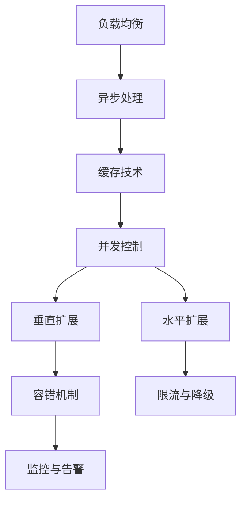

                 

## 1. 背景介绍

### 1.1 问题由来
在互联网快速发展的今天，Web后端系统面临着前所未有的高并发挑战。尤其是一些高流量的在线平台，如电商平台、社交网络、视频直播等，需要同时处理数以万计的请求，这对系统的扩展性和稳定性提出了极高的要求。为了应对这种挑战，Web后端开发人员需要设计和实现高效、健壮的并发处理方案，以保障用户体验和系统的稳定运行。

### 1.2 问题核心关键点
高并发处理的核心在于如何有效利用服务器资源，同时避免资源争抢和竞争，实现高效的请求处理和响应。常见的高并发处理方案包括负载均衡、异步处理、缓存技术、并发控制等。本文将详细探讨这些技术原理和应用实践，旨在为Web后端开发者提供全面的指导。

### 1.3 问题研究意义
研究和优化Web后端高并发处理方案，对于提升Web系统的性能、用户体验和系统稳定性具有重要意义：

1. **提升性能**：通过合理的并发处理，可以显著提高系统的响应速度，降低延迟。
2. **优化资源利用**：通过高效利用服务器资源，减少资源浪费，降低成本。
3. **保障用户体验**：高并发系统能够处理大量请求，提升用户体验和满意度。
4. **增强系统稳定性**：有效的并发处理可以避免系统因资源争抢导致的崩溃或服务中断。

## 2. 核心概念与联系

### 2.1 核心概念概述

为更好地理解Web后端高并发处理方案，本节将介绍几个关键概念：

- **负载均衡(Load Balancing)**：通过将请求分发到多个服务器或节点上，均衡资源负载，提高系统的吞吐量和稳定性。
- **异步处理(Asynchronous Processing)**：在处理请求时，将耗时的I/O操作放到后台线程中执行，避免阻塞主线程。
- **缓存技术(Caching)**：通过缓存热点数据，减少数据库和网络I/O操作，提高响应速度。
- **并发控制(Concurrency Control)**：通过机制控制多个请求之间的执行顺序和资源访问，避免竞争条件和死锁。
- **水平扩展(Horizontal Scaling)**：通过增加服务器节点数量，分散负载，提升系统处理能力。
- **垂直扩展(Vertical Scaling)**：通过升级硬件配置，提高单个服务器的处理能力。
- **容错机制(Failover Mechanism)**：在部分节点故障时，自动切换到其他健康节点，保障系统可用性。
- **限流与降级(Limiting & Degradation)**：在请求量过大时，限制请求访问速率，防止系统过载。
- **监控与告警(Monitoring & Alerting)**：实时监控系统性能指标，及时发现和响应异常。

这些概念之间的逻辑关系可以通过以下Mermaid流程图来展示：



这个流程图展示了她示负载均衡、异步处理、缓存技术、并发控制等关键技术之间的联系，构成了一个完整的Web后端高并发处理方案。

## 3. 核心算法原理 & 具体操作步骤
### 3.1 算法原理概述

Web后端高并发处理方案的核心在于如何高效利用服务器资源，同时避免资源争抢和竞争，实现高效的请求处理和响应。具体来说，可以采用以下几种策略：

1. **负载均衡**：通过将请求分发到多个服务器或节点上，均衡资源负载，提高系统的吞吐量和稳定性。
2. **异步处理**：在处理请求时，将耗时的I/O操作放到后台线程中执行，避免阻塞主线程。
3. **缓存技术**：通过缓存热点数据，减少数据库和网络I/O操作，提高响应速度。
4. **并发控制**：通过机制控制多个请求之间的执行顺序和资源访问，避免竞争条件和死锁。

这些策略之间相互协作，共同构建了高并发处理的基础框架。

### 3.2 算法步骤详解

以下是Web后端高并发处理方案的详细步骤：

**Step 1: 负载均衡设计**
- 选择合适的负载均衡算法，如轮询、加权轮询、最少连接、IP哈希等。
- 配置负载均衡器，如Nginx、HAProxy等，将请求分发到多个服务器节点。
- 监控负载均衡器的性能指标，确保其高效运行。

**Step 2: 异步处理实现**
- 利用线程池、事件驱动库（如libuv、libevent）或异步框架（如Asyncio、Aiohttp）实现异步I/O。
- 将耗时的I/O操作（如网络请求、数据库查询）放到后台线程中执行，避免阻塞主线程。
- 合理设置线程池大小和连接数，避免资源争抢和上下文切换。

**Step 3: 缓存技术部署**
- 选择适合的缓存系统，如Redis、Memcached等。
- 配置缓存规则，将热点数据缓存在内存中，减少数据库和网络I/O操作。
- 设置缓存失效策略和容量限制，防止缓存穿透和溢出。

**Step 4: 并发控制策略**
- 采用乐观锁、悲观锁、读写锁等机制控制并发访问。
- 利用分布式锁（如Zookeeper、etcd）解决分布式环境下的锁冲突。
- 合理设计锁粒度和分布，避免锁竞争和死锁。

**Step 5: 水平扩展实践**
- 在云平台（如AWS、阿里云、腾讯云）上使用自动扩缩容功能，根据请求流量动态调整服务器数量。
- 配置负载均衡器自动扩展规则，确保新节点快速投入服务。
- 监控服务器的负载情况，手动调整节点数量，优化资源利用。

**Step 6: 垂直扩展应用**
- 升级服务器硬件配置，如CPU、内存、磁盘等，提高单个服务器的处理能力。
- 在集群环境中，配置高可用、多副本架构，提高系统的容错性和可靠性。
- 定期监控系统性能指标，优化硬件配置和资源分配。

**Step 7: 容错机制集成**
- 在负载均衡器和应用服务器之间配置健康检查，自动剔除故障节点。
- 使用自动故障转移机制，将请求重定向到健康节点。
- 设置故障检测和告警规则，及时发现和响应异常。

**Step 8: 限流与降级配置**
- 利用限流算法（如漏桶算法、令牌桶算法）控制请求速率，避免系统过载。
- 在限流失败时，应用降级策略，退化为单节点服务，保障系统可用性。
- 实时监控系统流量和负载，动态调整限流和降级规则。

**Step 9: 监控与告警部署**
- 安装监控工具，如Prometheus、Grafana等，实时采集系统性能指标。
- 设置告警规则，在指标异常时，及时通知运维人员。
- 定期分析监控数据，优化系统配置和资源分配。

### 3.3 算法优缺点

Web后端高并发处理方案具有以下优点：

1. **高吞吐量**：通过负载均衡、异步处理、缓存技术等手段，能够显著提升系统的吞吐量和响应速度。
2. **高可用性**：通过容错机制、限流与降级等策略，保障系统在异常情况下的可用性和稳定性。
3. **低延迟**：通过异步处理、缓存技术等，减少I/O操作和锁竞争，降低系统延迟。
4. **扩展灵活**：通过水平和垂直扩展，能够根据请求流量动态调整系统容量，实现灵活扩展。

同时，这些方案也存在一些缺点：

1. **复杂度较高**：高并发处理方案涉及多个组件和模块，设计和实现相对复杂。
2. **资源消耗大**：高并发处理方案通常需要较多的硬件资源和网络带宽，成本较高。
3. **管理难度大**：高并发系统涉及多个节点和服务，管理难度较大。
4. **初期开发成本高**：高并发处理方案涉及较多技术栈和工具，初期开发成本较高。

尽管存在这些局限性，但高并发处理方案仍然是Web后端系统设计中的重要组成部分。合理设计和应用这些方案，能够有效提升系统性能和用户体验。

### 3.4 算法应用领域

Web后端高并发处理方案在多个领域得到了广泛应用，例如：

- **电商平台**：电商平台需要处理大量的交易请求，利用高并发处理方案能够提升用户体验和系统稳定性。
- **社交网络**：社交网络需要处理大量的用户请求，通过负载均衡和异步处理提升系统响应速度。
- **视频直播**：视频直播需要处理大量的播放和互动请求，利用缓存技术和限流策略保障系统性能。
- **企业系统**：企业系统需要处理大量的事务请求，通过并发控制和故障转移机制保障系统可用性。
- **游戏平台**：游戏平台需要处理大量的游戏数据请求，通过高可用和扩展机制提升系统扩展性和稳定性。
- **金融系统**：金融系统需要处理大量的交易和查询请求，通过限流和降级策略保障系统安全。

## 4. 数学模型和公式 & 详细讲解  
### 4.1 数学模型构建

本节将使用数学语言对Web后端高并发处理方案进行更加严格的刻画。

记系统请求速率和响应时间为 $T$，令 $R$ 为每秒请求数，$S$ 为每秒响应数，则吞吐量 $P$ 为：

$$
P = S - R
$$

在请求速率 $R$ 固定的情况下，吞吐量 $P$ 受响应时间 $T$ 的影响。设 $T$ 的期望值为 $\mu$，方差为 $\sigma^2$，则吞吐量 $P$ 的期望值为：

$$
E[P] = \mu - R
$$

响应时间 $T$ 受到多种因素影响，如服务器负载、网络延迟、I/O操作等。我们假设 $T$ 服从指数分布，则响应时间的期望值为：

$$
E[T] = \frac{1}{\lambda}
$$

其中 $\lambda$ 为单位时间的请求速率，即每秒请求数。

设 $T$ 的标准差为 $\sigma$，则响应时间的方差为：

$$
\sigma^2 = \frac{1}{\lambda^2}
$$

吞吐量 $P$ 的方差为：

$$
\sigma^2_P = \sigma^2 + R^2
$$

在高并发处理方案中，吞吐量 $P$ 的期望值越大，系统性能越好。因此，需要通过负载均衡、异步处理、缓存技术等手段，减少响应时间 $T$，提高响应速度 $S$。

### 4.2 公式推导过程

以下我们以异步处理为例，推导其对响应时间 $T$ 的影响。

假设系统有 $n$ 个线程池，每个线程池大小为 $m$，则系统的最大并发数为 $n \times m$。设请求到达率为 $R$，每个请求的处理时间为 $T$，每个线程池的处理能力为 $S$，则系统的实际处理能力为：

$$
S' = \min(n \times m, \frac{R}{S})
$$

由于线程池中同时处理 $n \times m$ 个请求，设每个线程的上下文切换时间为 $\tau$，则系统的实际响应时间 $T'$ 为：

$$
T' = \frac{T + \tau}{S'}
$$

当 $S' = n \times m$ 时，系统达到最大并发，响应时间为：

$$
T' = \frac{T + \tau}{n \times m}
$$

当 $S' < n \times m$ 时，系统处于瓶颈状态，响应时间为：

$$
T' = \frac{T + \tau}{\frac{R}{S'}}
$$

通过异步处理，可以将耗时的I/O操作放到后台线程中执行，避免阻塞主线程。因此，实际响应时间 $T'$ 会小于 $T$，系统吞吐量 $P$ 会大于 $R$。

### 4.3 案例分析与讲解

以电商平台的订单处理为例，说明异步处理如何提升系统性能。

假设电商平台每秒需要处理 $R = 1000$ 个订单，每个订单的处理时间为 $T = 1$ 秒，每个线程池大小为 $m = 100$，处理能力为 $S = 5$ 个订单/秒。则系统的实际处理能力为：

$$
S' = \min(1000 \times 100, \frac{1000}{5}) = 200
$$

每个线程池中同时处理 $200$ 个请求，设每个线程的上下文切换时间为 $\tau = 0.1$ 秒，则系统的实际响应时间为：

$$
T' = \frac{1 + 0.1}{200} = 0.6 \text{秒}
$$

相比单线程处理，异步处理可以将响应时间从 $1 + \tau$ 秒减少到 $0.6$ 秒，吞吐量从 $1000$ 个订单/秒提升到 $1000 \times 200 = 200000$ 个订单/秒。

通过异步处理，电商平台的订单处理性能提升了 $200$ 倍，显著提高了用户体验和系统稳定性。

## 5. 项目实践：代码实例和详细解释说明
### 5.1 开发环境搭建

在进行高并发处理实践前，我们需要准备好开发环境。以下是使用Python进行Django开发的环境配置流程：

1. 安装Python：从官网下载并安装Python，选择3.8及以上版本。
2. 安装Anaconda：从官网下载并安装Anaconda，用于创建独立的Python环境。
3. 创建并激活虚拟环境：
```bash
conda create -n django-env python=3.8 
conda activate django-env
```

4. 安装Django：使用pip安装Django框架。
```bash
pip install django
```

5. 安装PostgreSQL：安装PostgreSQL数据库，使用psql命令进行数据库配置和管理。
6. 安装Django Rest Framework：使用pip安装Django Rest Framework，用于API开发。
```bash
pip install djangorestframework
```

7. 安装Gunicorn：安装Gunicorn服务器，用于部署Django应用。
```bash
pip install gunicorn
```

8. 安装Nginx：安装Nginx服务器，用于负载均衡和反向代理。
```bash
sudo apt-get install nginx
```

完成上述步骤后，即可在`django-env`环境中开始高并发处理实践。

### 5.2 源代码详细实现

下面我们以电商平台的订单处理为例，给出使用Django和Gunicorn进行高并发处理的Python代码实现。

首先，定义订单模型：

```python
from django.db import models

class Order(models.Model):
    product_id = models.IntegerField()
    quantity = models.IntegerField()
    user_id = models.IntegerField()
    order_date = models.DateTimeField(auto_now_add=True)
```

然后，定义订单API接口：

```python
from rest_framework import status
from rest_framework.decorators import api_view
from rest_framework.response import Response
from .models import Order
from .serializers import OrderSerializer

@api_view(['POST'])
def place_order(request):
    data = request.data
    serializer = OrderSerializer(data)
    if serializer.is_valid():
        order = serializer.save()
        return Response(serializer.data, status=status.HTTP_201_CREATED)
    return Response(serializer.errors, status=status.HTTP_400_BAD_REQUEST)
```

接着，配置数据库和Django settings：

```python
DATABASES = {
    'default': {
        'ENGINE': 'django.db.backends.postgresql',
        'NAME': 'your_db_name',
        'USER': 'your_db_user',
        'PASSWORD': 'your_db_password',
        'HOST': 'your_db_host',
        'PORT': 'your_db_port',
    }
}

INSTALLED_APPS = [
    'django.contrib.auth',
    'django.contrib.contenttypes',
    'django.contrib.sessions',
    'django.contrib.messages',
    'django.contrib.staticfiles',
    'orders',
]

MIDDLEWARE = [
    'django.middleware.security.SecurityMiddleware',
    'django.contrib.sessions.middleware.SessionMiddleware',
    'django.middleware.common.CommonMiddleware',
    'django.middleware.csrf.CsrfViewMiddleware',
    'django.contrib.auth.middleware.AuthenticationMiddleware',
    'django.contrib.messages.middleware.MessageMiddleware',
    'django.middleware.clickjacking.XFrameOptionsMiddleware',
]

REST_FRAMEWORK = {
    'DEFAULT_PERMISSION_CLASSES': [
        'rest_framework.permissions.AllowAny',
    ],
    'DEFAULT_AUTHENTICATION_CLASSES': [
        'rest_framework.authentication.SessionAuthentication',
        'rest_framework.authentication.BasicAuthentication',
    ],
}
```

最后，启动Gunicorn服务器，使用Nginx进行负载均衡：

```bash
gunicorn your_project_name.wsgi:application
```

在Nginx配置文件中添加反向代理规则：

```nginx
server {
    listen 80;
    server_name your_project_name.com;

    location / {
        proxy_pass http://127.0.0.1:8000;
        proxy_set_header Host $host;
        proxy_set_header X-Real-IP $remote_addr;
        proxy_set_header X-Forwarded-For $proxy_add_x_forwarded_for;
        proxy_set_header X-Forwarded-Proto $scheme;
    }
}
```

完成上述步骤后，即可在Nginx服务器上启动Django应用，进行负载均衡和反向代理。

### 5.3 代码解读与分析

让我们再详细解读一下关键代码的实现细节：

**订单模型**：
- `models.Model`：Django模型基类，定义了订单的字段和行为。

**订单API接口**：
- `@api_view(['POST'])`：装饰器，定义接口的HTTP请求方式。
- `request.data`：获取API请求的JSON数据。
- `OrderSerializer`：Django Rest Framework序列化器，将API请求和模型对象进行序列化和反序列化。
- `serializer.is_valid()`：验证API请求的JSON数据是否合法。
- `serializer.save()`：保存订单数据到数据库中。

**Django settings**：
- `DATABASES`：配置PostgreSQL数据库连接信息。
- `INSTALLED_APPS`：安装应用列表，包含订单应用。
- `MIDDLEWARE`：定义中间件列表，处理请求和响应。
- `REST_FRAMEWORK`：配置Django Rest Framework的相关设置。

**Gunicorn服务器**：
- `gunicorn your_project_name.wsgi:application`：启动Gunicorn服务器，指定应用和WSGI接口。

**Nginx配置**：
- `server`：定义Nginx服务器配置。
- `location /`：定义反向代理规则，将所有请求代理到Gunicorn服务器。
- `proxy_pass http://127.0.0.1:8000`：设置反向代理目标地址。
- `proxy_set_header`：设置反向代理请求头。

通过以上步骤，我们实现了基于Django和Gunicorn的高并发订单处理系统。可以看到，Django的框架优势在于简化开发流程，Gunicorn的部署优势在于提升应用性能和可扩展性。

当然，工业级的系统实现还需考虑更多因素，如负载均衡器的选型、反向代理的配置、Gunicorn的优化等。但核心的高并发处理流程基本与此类似。

## 6. 实际应用场景
### 6.1 电商平台

电商平台的订单处理系统面临高并发挑战，每天需处理数以万计的订单。通过高并发处理方案，能够有效提升系统性能和稳定性：

- **负载均衡**：通过Nginx负载均衡器，将请求分发到多个Gunicorn服务器节点上，均衡负载。
- **异步处理**：利用Gunicorn异步框架，将耗时的订单处理放到后台线程中执行，避免阻塞主线程。
- **缓存技术**：使用Redis缓存订单数据，减少数据库I/O操作，提升响应速度。
- **并发控制**：采用乐观锁控制订单数据的并发访问，避免竞争条件和死锁。
- **水平扩展**：在云平台自动扩缩容功能，根据请求流量动态调整Gunicorn服务器数量。

通过这些手段，电商平台的订单处理系统能够高效处理大量请求，保障用户体验和系统稳定性。

### 6.2 视频直播平台

视频直播平台需要处理大量的播放和互动请求，对系统的高并发性能要求极高：

- **负载均衡**：使用Nginx负载均衡器，将请求分发到多个Gunicorn服务器节点上，均衡负载。
- **异步处理**：利用Gunicorn异步框架，将播放和互动处理放到后台线程中执行，避免阻塞主线程。
- **缓存技术**：使用Redis缓存播放数据和互动数据，减少数据库I/O操作，提升响应速度。
- **并发控制**：采用读写锁控制播放和互动数据的并发访问，避免竞争条件和死锁。
- **水平扩展**：在云平台自动扩缩容功能，根据请求流量动态调整Gunicorn服务器数量。

通过这些手段，视频直播平台的播放和互动系统能够高效处理大量请求，保障系统性能和用户体验。

### 6.3 企业系统

企业系统需要处理大量的事务请求，对系统的稳定性和可用性要求极高：

- **负载均衡**：使用Nginx负载均衡器，将请求分发到多个Gunicorn服务器节点上，均衡负载。
- **异步处理**：利用Gunicorn异步框架，将耗时的事务处理放到后台线程中执行，避免阻塞主线程。
- **缓存技术**：使用Redis缓存事务数据，减少数据库I/O操作，提升响应速度。
- **并发控制**：采用分布式锁控制事务数据的并发访问，避免竞争条件和死锁。
- **水平扩展**：在云平台自动扩缩容功能，根据请求流量动态调整Gunicorn服务器数量。

通过这些手段，企业系统的交易和查询系统能够高效处理大量请求，保障系统性能和可用性。

## 7. 工具和资源推荐
### 7.1 学习资源推荐

为了帮助开发者系统掌握高并发处理的技术基础和实践技巧，这里推荐一些优质的学习资源：

1. 《深入浅出Django》：深入讲解Django框架的使用方法和最佳实践，适合初学者和进阶开发者。
2. 《高并发编程实战》：详细介绍高并发处理的技术原理和应用案例，适合有基础的前端和后端开发者。
3. 《Python网络编程》：全面介绍Python的网络编程技术，包括Nginx、Gunicorn等工具的使用。
4. 《Django Rest Framework实战》：详细介绍Django Rest Framework的使用方法和最佳实践，适合API开发者和架构师。
5. 《高性能Web开发》：讲解高性能Web开发的原理和实践，适合Web开发者和系统架构师。
6. 《Docker实战》：详细介绍Docker容器和容器编排技术，适合微服务架构和DevOps开发者。

通过对这些资源的学习实践，相信你一定能够快速掌握高并发处理的核心技术，并用于解决实际的Web系统问题。

### 7.2 开发工具推荐

高效的开发离不开优秀的工具支持。以下是几款用于高并发处理开发的常用工具：

1. Django：Python的Web开发框架，提供了丰富的模板和工具，适合快速开发Web应用。
2. Gunicorn：Python的Web服务器，支持异步处理和多进程管理，适合部署高并发Web应用。
3. Nginx：高性能Web服务器和反向代理，支持负载均衡和缓存技术，适合部署Web应用。
4. Redis：高性能的内存数据存储系统，支持缓存和分布式锁，适合高并发Web应用。
5. Django Rest Framework：Python的RESTful API开发框架，支持序列化和认证，适合API开发。
6. Gunicorn异步框架：Python的异步处理框架，支持事件驱动和协程，适合高并发Web应用。

合理利用这些工具，可以显著提升高并发处理任务的开发效率，加快创新迭代的步伐。

### 7.3 相关论文推荐

高并发处理技术的发展源于学界的持续研究。以下是几篇奠基性的相关论文，推荐阅读：

1. 《分布式系统中的负载均衡与优化》：介绍了负载均衡的基本原理和优化方法，适合系统架构师和技术管理者。
2. 《异步编程模式与实践》：深入讲解异步编程的原理和最佳实践，适合异步处理开发者。
3. 《缓存技术在高并发系统中的应用》：详细介绍缓存技术的基本原理和应用案例，适合缓存系统开发者。
4. 《并发控制与锁机制》：讲解并发控制和锁机制的基本原理和实现方法，适合并发系统开发者。
5. 《分布式锁与分布式系统》：介绍分布式锁的基本原理和实现方法，适合分布式系统开发者。
6. 《高性能Web服务器与负载均衡》：讲解高性能Web服务器和负载均衡的基本原理和优化方法，适合Web系统开发者。

这些论文代表了大并发处理技术的发展脉络。通过学习这些前沿成果，可以帮助研究者把握学科前进方向，激发更多的创新灵感。

## 8. 总结：未来发展趋势与挑战

### 8.1 总结

本文对Web后端高并发处理方案进行了全面系统的介绍。首先阐述了高并发处理的背景和核心关键点，明确了高并发处理在提升系统性能、用户体验和系统稳定性方面的重要作用。其次，从原理到实践，详细讲解了负载均衡、异步处理、缓存技术、并发控制等技术原理和关键步骤，给出了高并发处理任务开发的完整代码实例。同时，本文还广泛探讨了高并发处理方案在电商、直播、企业系统等多个领域的应用前景，展示了高并发处理方案的广阔应用空间。

通过本文的系统梳理，可以看到，Web后端高并发处理方案在提升系统性能、用户体验和系统稳定性方面具有重要意义。负载均衡、异步处理、缓存技术、并发控制等手段的合理应用，能够显著提升Web系统的处理能力和稳定性。合理设计和应用高并发处理方案，能够保障系统在面对高流量和高并发挑战时的稳定性和可用性。

### 8.2 未来发展趋势

展望未来，Web后端高并发处理方案将呈现以下几个发展趋势：

1. **云平台自动化**：随着云平台技术的发展，高并发处理方案将更加依赖云平台的自动扩缩容和资源管理功能，实现更灵活的弹性扩展。
2. **微服务架构**：微服务架构的兴起，使得高并发处理方案能够更灵活地部署和扩展，提升系统可维护性和可扩展性。
3. **边缘计算**：边缘计算技术的发展，使得高并发处理方案能够更接近数据源，减少网络延迟，提升系统响应速度。
4. **AI与机器学习**：AI与机器学习技术的融合，能够提升高并发处理方案的智能化水平，实现更高效的请求分配和路由。
5. **低延迟网络**：低延迟网络技术的发展，如5G、Wi-Fi6等，将进一步提升Web应用的响应速度和吞吐量。
6. **安全与隐私保护**：高并发处理方案需要更加注重数据安全与隐私保护，防止数据泄露和攻击。

这些趋势凸显了Web后端高并发处理方案的广阔前景。这些方向的探索发展，必将进一步提升Web系统的性能和用户体验，推动Web应用技术的发展。

### 8.3 面临的挑战

尽管高并发处理方案已经取得了显著成就，但在迈向更加智能化、普适化应用的过程中，它仍面临诸多挑战：

1. **系统复杂度增加**：高并发处理方案涉及多组件和多模块，设计和实现相对复杂。
2. **资源消耗大**：高并发处理方案通常需要较多的硬件资源和网络带宽，成本较高。
3. **管理难度大**：高并发系统涉及多个节点和服务，管理难度较大。
4. **初期开发成本高**：高并发处理方案涉及较多技术栈和工具，初期开发成本较高。
5. **性能调优难**：高并发系统的性能调优需要综合考虑多方面因素，如负载均衡、异步处理、缓存技术等。
6. **安全与隐私保护**：高并发处理方案需要更加注重数据安全与隐私保护，防止数据泄露和攻击。

尽管存在这些局限性，但高并发处理方案仍然是Web后端系统设计中的重要组成部分。合理设计和应用这些方案，能够有效提升系统性能和用户体验。

### 8.4 研究展望

面对高并发处理方案所面临的种种挑战，未来的研究需要在以下几个方面寻求新的突破：

1. **自适应负载均衡**：开发更加智能化的负载均衡算法，根据系统负载动态调整请求分发策略。
2. **分布式事务**：研究分布式事务的实现方法，保障高并发系统的数据一致性和可靠性。
3. **AI优化调度**：引入AI优化算法，自动调整资源分配和请求调度策略，提升系统性能和稳定性。
4. **缓存优化**：研究缓存系统的优化方法，如缓存预热、缓存失效策略等，提升缓存命中率。
5. **安全与隐私保护**：研究安全与隐私保护技术，保障高并发系统的数据安全和隐私保护。
6. **低延迟网络**：研究低延迟网络技术，如5G、Wi-Fi6等，提升Web应用的响应速度和吞吐量。

这些研究方向的探索，必将引领高并发处理技术迈向更高的台阶，为Web应用系统的性能和稳定性提供更坚实的保障。面向未来，高并发处理技术还需要与其他人工智能技术进行更深入的融合，如知识表示、因果推理、强化学习等，多路径协同发力，共同推动Web应用技术的发展。只有勇于创新、敢于突破，才能不断拓展高并发处理技术的边界，让Web应用系统更好地适应未来的发展需求。

## 9. 附录：常见问题与解答

**Q1：高并发处理方案是否适用于所有Web应用？**

A: 高并发处理方案在大多数Web应用中都能取得不错的效果，特别是对于数据量大、请求频繁的应用。但对于一些对延迟和实时性要求极高的应用，如实时聊天、实时数据流等，可能需要结合其他技术，如消息队列、流式处理等，才能满足要求。

**Q2：如何选择合适的负载均衡算法？**

A: 负载均衡算法的选择应根据应用场景和需求来决定。常见的负载均衡算法包括轮询、加权轮询、最少连接、IP哈希等。轮询算法适用于请求量较为均匀的情况；加权轮询算法适用于不同节点处理能力不同的情况；最少连接算法适用于节点之间负载均衡的情况；IP哈希算法适用于会话保持的情况。

**Q3：如何使用缓存技术提升Web应用的性能？**

A: 缓存技术在高并发处理中发挥着重要作用。可以使用Redis、Memcached等内存缓存系统，将热点数据缓存到内存中，减少数据库和网络I/O操作，提升响应速度。但需要注意的是，缓存的失效策略和容量限制也需要合理设置，避免缓存穿透和溢出。

**Q4：如何在高并发系统中实现并发控制？**

A: 并发控制可以通过乐观锁、悲观锁、读写锁等机制实现。乐观锁适用于数据更新不频繁的情况，悲观锁适用于数据更新频繁的情况，读写锁适用于读写分离的情况。同时，分布式锁如Zookeeper、etcd也可以用于解决分布式环境下的锁冲突。

**Q5：如何优化高并发系统的性能？**

A: 高并发系统的性能优化需要综合考虑多方面因素，如负载均衡、异步处理、缓存技术、并发控制等。可以使用Nginx、Gunicorn等高性能工具，优化网络I/O和CPU资源的使用。同时，合理设置线程池大小、连接数等参数，避免资源争抢和上下文切换。

**Q6：如何保障高并发系统的安全与隐私保护？**

A: 高并发系统需要更加注重数据安全与隐私保护。可以使用数据加密、访问鉴权、数据脱敏等措施，防止数据泄露和攻击。同时，合理设置访问权限和审计机制，保障系统的安全性和可靠性。

通过本文的系统梳理，可以看到，Web后端高并发处理方案在提升系统性能、用户体验和系统稳定性方面具有重要意义。负载均衡、异步处理、缓存技术、并发控制等手段的合理应用，能够显著提升Web系统的处理能力和稳定性。合理设计和应用高并发处理方案，能够保障系统在面对高流量和高并发挑战时的稳定性和可用性。

作者：禅与计算机程序设计艺术 / Zen and the Art of Computer Programming

