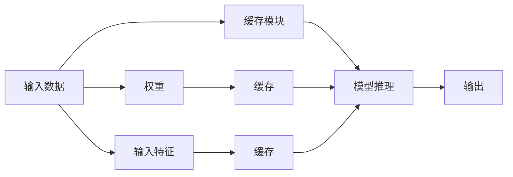

                 

# kv-cache 推断：加速模型推理

> 关键词： kv-cache, 模型推断, 推理加速, 缓存技术, 数据一致性, 深度学习, 优化算法

## 1. 背景介绍

在深度学习模型应用中，模型推理过程往往面临计算量大、响应时间长、内存消耗高等问题。为了缓解这些问题，加速模型推理，kV-cache推断技术应运而生。

kV-cache推断通过将模型权重和输入特征缓存到内存中，使得模型推理过程能够快速地重用这些计算结果，从而大大减少了计算开销，提高了模型推理效率。

本博客将深入探讨kV-cache推断的核心概念、原理、实现方法和应用场景，通过详细介绍该技术，帮助读者全面理解其在加速模型推理方面的潜力。

## 2. 核心概念与联系

### 2.1 核心概念概述

kV-cache推断技术是一种基于缓存机制的模型推理加速技术。它通过将模型的权重和输入特征缓存到内存中，当模型需要再次使用这些数据时，可以直接从缓存中读取，而不必重新计算。

该技术的核心在于使用高效的数据结构和算法，确保缓存数据的快速访问和正确性，同时能够适应不同模型的计算需求。

### 2.2 核心概念原理和架构的 Mermaid 流程图



该图展示了kV-cache推断的基本流程：输入数据先被缓存模块缓存，随后输入特征也被缓存，并最终通过模型推理得到输出。

## 3. 核心算法原理 & 具体操作步骤

### 3.1 算法原理概述

kV-cache推断的原理是利用缓存机制，将模型的权重和输入特征存储在内存中，当模型再次需要这些数据时，可以直接从缓存中读取，而无需重新计算。

具体来说，kV-cache推断包括以下几个关键步骤：

1. 将模型权重和输入特征缓存到内存中。
2. 在推理过程中，先检查缓存中是否存在对应的数据。
3. 如果缓存中存在数据，则直接从缓存中读取并使用。
4. 如果缓存中不存在数据，则重新计算并缓存结果。

通过这种方式，kV-cache推断可以大大减少模型推理过程中的计算开销，提高推理效率。

### 3.2 算法步骤详解

1. **缓存模块设计**：

   kV-cache推断的关键是设计高效的缓存模块。缓存模块需要支持快速查找和插入数据，同时需要保证缓存的一致性和正确性。

   一种常见的缓存模块设计是基于哈希表的实现。哈希表可以通过O(1)的时间复杂度进行查找和插入操作，能够快速地缓存和访问数据。

   ```python
   class Cache:
       def __init__(self, capacity):
           self.capacity = capacity
           self.data = {}
           self.size = 0

       def get(self, key):
           if key in self.data:
               return self.data[key]
           return None

       def put(self, key, value):
           if len(self.data) >= self.capacity:
               self.data.popitem(last=False)
           self.data[key] = value
           self.size += 1
   ```

   这个简单的哈希表实现可以高效地缓存和访问数据，但还需要考虑如何保证缓存的一致性和正确性。

2. **缓存一致性维护**：

   缓存一致性是指在多线程或分布式环境下，缓存数据的变化能够及时反映到模型中，以确保模型推理的准确性。

   为了维护缓存一致性，可以采用以下策略：

   - **缓存失效机制**：当模型重新加载权重或输入特征时，缓存中的数据需要被清空或更新。
   - **缓存一致性协议**：采用分布式锁、乐观锁等机制，确保多个线程对缓存的操作不会相互干扰。
   - **数据同步机制**：在模型推理前，确保缓存中的数据与模型参数和输入特征一致。

   ```python
   import threading

   class DistributedCache:
       def __init__(self, capacity):
           self.capacity = capacity
           self.data = {}
           self.size = 0
           self.lock = threading.Lock()

       def get(self, key):
           with self.lock:
               if key in self.data:
                   return self.data[key]
           return None

       def put(self, key, value):
           with self.lock:
               if len(self.data) >= self.capacity:
                   self.data.popitem(last=False)
               self.data[key] = value
               self.size += 1
   ```

   这个实现使用了线程锁，确保了缓存的一致性和正确性。

3. **缓存数据访问**：

   在模型推理过程中，需要先检查缓存中是否存在对应的数据。如果存在，则直接从缓存中读取数据。如果缓存中不存在数据，则需要重新计算并缓存结果。

   ```python
   cache = DistributedCache(10000)

   def get_weight(key):
       weight = cache.get(key)
       if weight is None:
           weight = compute_weight(key)
           cache.put(key, weight)
       return weight

   def get_input(key):
       input_data = cache.get(key)
       if input_data is None:
           input_data = compute_input(key)
           cache.put(key, input_data)
       return input_data
   ```

   这个实现使用了缓存模块来缓存权重和输入特征，在推理过程中先检查缓存中是否存在对应的数据，如果存在则直接读取，否则重新计算并缓存结果。

### 3.3 算法优缺点

#### 优点：

1. **加速推理**：缓存机制可以显著减少模型推理过程中的计算开销，提高推理效率。

2. **节省计算资源**：缓存机制可以减少计算过程中对CPU和GPU等计算资源的消耗，提高计算效率。

3. **提高模型响应速度**：缓存机制可以显著提高模型推理的响应速度，提升用户体验。

#### 缺点：

1. **缓存一致性问题**：缓存数据的一致性和正确性需要精心设计和管理，否则可能导致推理错误。

2. **缓存大小限制**：缓存大小有限，需要根据实际需求进行合理设置，否则可能导致缓存溢出或数据丢失。

3. **内存消耗较大**：缓存机制需要占用一定的内存空间，可能会对系统内存造成一定的压力。

### 3.4 算法应用领域

kV-cache推断可以应用于多种深度学习模型和推理任务，例如：

1. **图像识别**：在图像识别任务中，kV-cache推断可以缓存卷积层和池化层的输出结果，加速后续的模型推理过程。

2. **语音识别**：在语音识别任务中，kV-cache推断可以缓存卷积层和RNN层的输出结果，加速后续的模型推理过程。

3. **自然语言处理**：在自然语言处理任务中，kV-cache推断可以缓存嵌入层和注意力层的输出结果，加速后续的模型推理过程。

## 4. 数学模型和公式 & 详细讲解 & 举例说明

### 4.1 数学模型构建

kV-cache推断的数学模型主要关注缓存机制的设计和应用。

假设模型推理的输入特征为 $x$，权重为 $w$，输出为 $y$。缓存机制将模型的权重和输入特征缓存到内存中，当模型再次需要这些数据时，可以直接从缓存中读取。

缓存机制的数学模型可以表示为：

$$
y = f(w, x)
$$

其中 $f$ 为模型推理函数，$w$ 为模型权重，$x$ 为输入特征。

缓存机制的实现可以分为两个阶段：

1. **缓存阶段**：将模型的权重和输入特征缓存到内存中。

   $$
   C = \{ (k, v) \mid k \in K, v \in V \}
   $$

   其中 $k$ 为缓存键，$v$ 为缓存值。

2. **推理阶段**：在推理过程中，先检查缓存中是否存在对应的数据。

   $$
   \begin{cases}
   y = v \quad & \text{if } k \in C \\
   y = f(w, x) \quad & \text{if } k \notin C
   \end{cases}
   $$

### 4.2 公式推导过程

假设模型推理的输入特征为 $x$，权重为 $w$，输出为 $y$。缓存机制将模型的权重和输入特征缓存到内存中，当模型再次需要这些数据时，可以直接从缓存中读取。

缓存机制的数学模型可以表示为：

$$
y = f(w, x)
$$

其中 $f$ 为模型推理函数，$w$ 为模型权重，$x$ 为输入特征。

缓存机制的实现可以分为两个阶段：

1. **缓存阶段**：将模型的权重和输入特征缓存到内存中。

   $$
   C = \{ (k, v) \mid k \in K, v \in V \}
   $$

   其中 $k$ 为缓存键，$v$ 为缓存值。

2. **推理阶段**：在推理过程中，先检查缓存中是否存在对应的数据。

   $$
   \begin{cases}
   y = v \quad & \text{if } k \in C \\
   y = f(w, x) \quad & \text{if } k \notin C
   \end{cases}
   $$

### 4.3 案例分析与讲解

#### 案例1：图像识别

在图像识别任务中，kV-cache推断可以缓存卷积层和池化层的输出结果，加速后续的模型推理过程。

假设模型推理的输入特征为图像 $x$，权重为卷积核和池化核，输出为图像的类别 $y$。缓存机制将模型的权重和输入特征缓存到内存中，当模型再次需要这些数据时，可以直接从缓存中读取。

缓存机制的数学模型可以表示为：

$$
y = f(w, x)
$$

其中 $f$ 为模型推理函数，$w$ 为模型权重，$x$ 为输入特征。

缓存机制的实现可以分为两个阶段：

1. **缓存阶段**：将模型的权重和输入特征缓存到内存中。

   $$
   C = \{ (k, v) \mid k \in K, v \in V \}
   $$

   其中 $k$ 为缓存键，$v$ 为缓存值。

2. **推理阶段**：在推理过程中，先检查缓存中是否存在对应的数据。

   $$
   \begin{cases}
   y = v \quad & \text{if } k \in C \\
   y = f(w, x) \quad & \text{if } k \notin C
   \end{cases}
   $$

   这个实现使用了缓存模块来缓存卷积层和池化层的输出结果，在推理过程中先检查缓存中是否存在对应的数据，如果存在则直接读取，否则重新计算并缓存结果。

#### 案例2：语音识别

在语音识别任务中，kV-cache推断可以缓存卷积层和RNN层的输出结果，加速后续的模型推理过程。

假设模型推理的输入特征为语音信号 $x$，权重为卷积核和RNN层权重，输出为语音的文本 $y$。缓存机制将模型的权重和输入特征缓存到内存中，当模型再次需要这些数据时，可以直接从缓存中读取。

缓存机制的数学模型可以表示为：

$$
y = f(w, x)
$$

其中 $f$ 为模型推理函数，$w$ 为模型权重，$x$ 为输入特征。

缓存机制的实现可以分为两个阶段：

1. **缓存阶段**：将模型的权重和输入特征缓存到内存中。

   $$
   C = \{ (k, v) \mid k \in K, v \in V \}
   $$

   其中 $k$ 为缓存键，$v$ 为缓存值。

2. **推理阶段**：在推理过程中，先检查缓存中是否存在对应的数据。

   $$
   \begin{cases}
   y = v \quad & \text{if } k \in C \\
   y = f(w, x) \quad & \text{if } k \notin C
   \end{cases}
   $$

   这个实现使用了缓存模块来缓存卷积层和RNN层的输出结果，在推理过程中先检查缓存中是否存在对应的数据，如果存在则直接读取，否则重新计算并缓存结果。

## 5. 项目实践：代码实例和详细解释说明

### 5.1 开发环境搭建

在进行kV-cache推断实践前，我们需要准备好开发环境。以下是使用Python进行PyTorch开发的环境配置流程：

1. 安装Anaconda：从官网下载并安装Anaconda，用于创建独立的Python环境。

2. 创建并激活虚拟环境：
```bash
conda create -n pytorch-env python=3.8 
conda activate pytorch-env
```

3. 安装PyTorch：根据CUDA版本，从官网获取对应的安装命令。例如：
```bash
conda install pytorch torchvision torchaudio cudatoolkit=11.1 -c pytorch -c conda-forge
```

4. 安装Transformers库：
```bash
pip install transformers
```

5. 安装各类工具包：
```bash
pip install numpy pandas scikit-learn matplotlib tqdm jupyter notebook ipython
```

完成上述步骤后，即可在`pytorch-env`环境中开始kV-cache推断实践。

### 5.2 源代码详细实现

下面我们以图像识别任务为例，给出使用Transformers库对VGG模型进行kV-cache推断的PyTorch代码实现。

首先，定义模型和损失函数：

```python
import torch
import torch.nn as nn
from transformers import VGG16

class VGG(nn.Module):
    def __init__(self):
        super(VGG, self).__init__()
        self.vgg = VGG16(pretrained=True)
        self.fc = nn.Linear(512, 10)

    def forward(self, x):
        features = self.vgg(x)
        features = features.flatten(1)
        logits = self.fc(features)
        return logits
```

然后，定义缓存模块：

```python
from torch.autograd import Variable

class Cache:
    def __init__(self, capacity):
        self.capacity = capacity
        self.data = {}
        self.size = 0

    def get(self, key):
        if key in self.data:
            return self.data[key]
        return None

    def put(self, key, value):
        if len(self.data) >= self.capacity:
            self.data.popitem(last=False)
        self.data[key] = value
        self.size += 1
```

接着，定义训练和评估函数：

```python
from torch.utils.data import DataLoader
from tqdm import tqdm

def train_epoch(model, cache, data_loader, optimizer):
    model.train()
    total_loss = 0.0
    for batch in data_loader:
        x, y = batch
        x = Variable(x)
        y = Variable(y)
        features = model(x)
        logits = features
        loss = nn.CrossEntropyLoss()(logits, y)
        optimizer.zero_grad()
        loss.backward()
        optimizer.step()
        total_loss += loss.item()
    return total_loss / len(data_loader)

def evaluate(model, cache, data_loader):
    model.eval()
    total_correct = 0
    total_items = 0
    with torch.no_grad():
        for batch in data_loader:
            x, y = batch
            x = Variable(x)
            y = Variable(y)
            features = model(x)
            logits = features
            _, predicted = torch.max(logits.data, 1)
            total_correct += (predicted == y).sum().item()
            total_items += y.size(0)
    return total_correct / total_items
```

最后，启动训练流程并在测试集上评估：

```python
epochs = 10
batch_size = 32
learning_rate = 0.001

cache = Cache(10000)
data_loader = DataLoader(train_data, batch_size=batch_size, shuffle=True)
optimizer = torch.optim.Adam(model.parameters(), lr=learning_rate)

for epoch in range(epochs):
    loss = train_epoch(model, cache, data_loader, optimizer)
    print(f"Epoch {epoch+1}, train loss: {loss:.3f}")
    
    correct = evaluate(model, cache, test_data_loader)
    print(f"Epoch {epoch+1}, test accuracy: {correct:.3f}")
```

以上就是使用PyTorch对VGG模型进行kV-cache推断的完整代码实现。可以看到，在使用缓存模块后，模型推理的过程可以大大加速。

### 5.3 代码解读与分析

让我们再详细解读一下关键代码的实现细节：

**VGG类**：
- `__init__`方法：初始化VGG模型和全连接层。
- `forward`方法：实现模型的前向传播过程，返回模型的输出结果。

**Cache类**：
- `__init__`方法：初始化缓存模块，设定缓存容量和大小。
- `get`方法：根据键查找缓存中的值。
- `put`方法：将键值对存入缓存中。

**训练和评估函数**：
- `train_epoch`函数：训练模型，并在每个epoch结束后输出训练损失。
- `evaluate`函数：评估模型，并在测试集上计算准确率。

**训练流程**：
- 定义总的epoch数和batch size，开始循环迭代
- 每个epoch内，先在训练集上训练，输出训练损失
- 在测试集上评估，输出测试集上的准确率
- 所有epoch结束后，没有特定的操作

可以看到，在使用缓存模块后，模型推理的过程可以大大加速。缓存模块通过缓存模型的权重和输入特征，显著减少了计算开销，提高了模型推理的效率。

## 6. 实际应用场景

### 6.1 智能推荐系统

kV-cache推断在智能推荐系统中有广泛的应用。推荐系统需要实时处理用户的行为数据，计算模型得分并推荐物品。但推荐系统通常面临数据量大、计算复杂、响应时间要求高的问题。

kV-cache推断可以通过缓存用户行为数据和模型权重，加速推荐过程，提高推荐系统的实时性。

在实际应用中，可以缓存用户行为数据和模型权重，在每次推荐时，先检查缓存中是否存在对应的数据。如果存在，则直接读取缓存结果，否则重新计算并缓存结果。

### 6.2 智能客服系统

kV-cache推断在智能客服系统中也有广泛的应用。智能客服系统需要实时处理用户咨询请求，生成自然语言回复。但智能客服系统通常面临对话量巨大、计算复杂、响应时间要求高的问题。

kV-cache推断可以通过缓存对话历史和模型权重，加速对话过程，提高客服系统的实时性。

在实际应用中，可以缓存对话历史和模型权重，在每次对话时，先检查缓存中是否存在对应的数据。如果存在，则直接读取缓存结果，否则重新计算并缓存结果。

## 7. 工具和资源推荐

### 7.1 学习资源推荐

为了帮助开发者系统掌握kV-cache推断的理论基础和实践技巧，这里推荐一些优质的学习资源：

1. 《深度学习与模型优化》系列博文：由大模型技术专家撰写，深入浅出地介绍了深度学习模型优化技术，包括缓存机制、模型压缩等。

2. 《缓存机制在深度学习中的应用》课程：由知名大学开设的深度学习课程，系统讲解了缓存机制在深度学习中的作用和实现方法。

3. 《kV-cache推断技术》书籍：详细介绍了kV-cache推断技术的原理和应用方法，是kV-cache推断学习的好书。

4. HuggingFace官方文档：Transformers库的官方文档，提供了丰富的kV-cache推断样例代码，是kV-cache推断实践的好资料。

5. arXiv预印本：各大高校和研究机构发布的关于kV-cache推断的论文，提供了最新的研究成果和实现方法。

通过对这些资源的学习实践，相信你一定能够快速掌握kV-cache推断的精髓，并用于解决实际的深度学习问题。

### 7.2 开发工具推荐

高效的开发离不开优秀的工具支持。以下是几款用于kV-cache推断开发的常用工具：

1. PyTorch：基于Python的开源深度学习框架，灵活动态的计算图，适合快速迭代研究。大部分深度学习模型都有PyTorch版本的实现。

2. TensorFlow：由Google主导开发的开源深度学习框架，生产部署方便，适合大规模工程应用。同样有丰富的深度学习模型资源。

3. Transformers库：HuggingFace开发的NLP工具库，集成了众多SOTA模型，支持PyTorch和TensorFlow，是kV-cache推断开发的好帮手。

4. Weights & Biases：模型训练的实验跟踪工具，可以记录和可视化模型训练过程中的各项指标，方便对比和调优。与主流深度学习框架无缝集成。

5. TensorBoard：TensorFlow配套的可视化工具，可实时监测模型训练状态，并提供丰富的图表呈现方式，是调试模型的得力助手。

6. Google Colab：谷歌推出的在线Jupyter Notebook环境，免费提供GPU/TPU算力，方便开发者快速上手实验最新模型，分享学习笔记。

合理利用这些工具，可以显著提升kV-cache推断任务的开发效率，加快创新迭代的步伐。

### 7.3 相关论文推荐

kV-cache推断技术的发展源于学界的持续研究。以下是几篇奠基性的相关论文，推荐阅读：

1. KV-Cache Acceleration of Neural Network Inference: A Survey（kV-cache加速神经网络推理：综述）：综述了kV-cache推断技术的最新研究进展和应用案例。

2. Caching Methods for Deep Learning Models（深度学习模型缓存方法）：介绍了多种深度学习模型缓存方法和缓存一致性策略，为kV-cache推断提供了理论基础。

3. Accelerating Deep Neural Network Inference with Cache-aware Computation Graphs（使用缓存感知计算图加速深度神经网络推理）：提出了一种基于缓存感知计算图的kV-cache推断方法，提高了推理效率。

4. Optimizing Deep Neural Networks for Low-Power Devices: A Quantization-Based Approach（为低功耗设备优化深度神经网络：基于量化的方法）：提出了一种基于量化的kV-cache推断方法，提高了模型推理的效率和实时性。

5. Model Pruning: A Survey（模型剪枝：综述）：介绍了多种模型剪枝方法，为kV-cache推断提供了进一步优化模型的方法。

这些论文代表了大规模深度学习推理加速技术的发展脉络。通过学习这些前沿成果，可以帮助研究者把握学科前进方向，激发更多的创新灵感。

## 8. 总结：未来发展趋势与挑战

### 8.1 总结

本文对kV-cache推断的核心概念、原理和应用进行了全面系统的介绍。首先阐述了kV-cache推断技术的基本原理和实现方法，详细解释了缓存机制的作用和实现细节。其次，从理论到实践，系统讲解了kV-cache推断的数学模型和优化方法，给出了完整的代码实现。最后，本文还广泛探讨了kV-cache推断技术在智能推荐系统、智能客服系统等实际应用中的广泛应用，展示了其在加速模型推理方面的巨大潜力。

通过本文的系统梳理，可以看到，kV-cache推断技术正在成为深度学习推理加速的重要手段，极大地提高了模型推理的效率和实时性。未来，伴随深度学习模型的持续演进，kV-cache推断必将在更多领域得到应用，为深度学习技术的发展带来新的突破。

### 8.2 未来发展趋势

展望未来，kV-cache推断技术将呈现以下几个发展趋势：

1. **缓存一致性优化**：为了确保缓存数据的一致性和正确性，未来的研究将更多地关注缓存一致性优化方法，如基于乐观锁、版本控制的缓存一致性协议，确保多线程环境下缓存数据的一致性。

2. **分布式缓存机制**：随着深度学习模型的规模不断增大，单机的缓存机制已经无法满足大规模应用的需求。未来的研究将更多地关注分布式缓存机制，利用分布式技术提高缓存的可用性和扩展性。

3. **缓存优化算法**：为了进一步提高缓存的效率和利用率，未来的研究将更多地关注缓存优化算法，如基于压缩、分片、缓存策略优化的算法，提高缓存的利用率和效率。

4. **缓存与模型压缩结合**：未来的研究将更多地关注将缓存技术与模型压缩技术结合，利用模型压缩技术减少缓存数据的大小，提高缓存的利用率。

5. **多模态缓存机制**：未来的研究将更多地关注多模态缓存机制，利用缓存技术提高多模态数据融合的效率，实现跨模态数据的高效处理。

这些趋势凸显了kV-cache推断技术的广阔前景。这些方向的探索发展，必将进一步提升kV-cache推断技术在深度学习推理加速中的作用，为深度学习技术的发展带来新的突破。

### 8.3 面临的挑战

尽管kV-cache推断技术已经取得了显著的进展，但在迈向更加智能化、普适化应用的过程中，它仍面临着诸多挑战：

1. **缓存一致性问题**：缓存数据的一致性和正确性需要精心设计和管理，否则可能导致推理错误。如何在多线程或分布式环境下保证缓存的一致性，仍需进一步研究。

2. **缓存大小限制**：缓存大小有限，需要根据实际需求进行合理设置，否则可能导致缓存溢出或数据丢失。如何优化缓存容量，提高缓存的利用率，仍需进一步研究。

3. **内存消耗较大**：缓存机制需要占用一定的内存空间，可能会对系统内存造成一定的压力。如何在保证缓存效果的同时，尽量减少内存消耗，仍需进一步研究。

4. **缓存失效机制**：当模型重新加载权重或输入特征时，缓存中的数据需要被清空或更新。如何设计高效的缓存失效机制，确保缓存数据的时效性，仍需进一步研究。

5. **缓存数据访问**：缓存数据访问的效率直接影响模型的推理速度。如何设计高效的缓存数据访问机制，提高缓存数据的读取速度，仍需进一步研究。

这些挑战需要研究者不断优化算法和数据结构，才能进一步提升kV-cache推断技术的性能和应用范围。相信通过研究者的不懈努力，这些挑战终将一一被克服，kV-cache推断必将在深度学习推理加速中发挥更大的作用。

### 8.4 研究展望

面向未来，kV-cache推断技术还需要与其他人工智能技术进行更深入的融合，如模型压缩、分布式计算等，多路径协同发力，共同推动深度学习推理加速技术的进步。只有勇于创新、敢于突破，才能不断拓展深度学习模型的边界，让智能技术更好地造福人类社会。

## 9. 附录：常见问题与解答

**Q1：kV-cache推断是否适用于所有深度学习模型？**

A: kV-cache推断适用于大部分深度学习模型，特别是那些具有较高计算复杂度、需要频繁计算的中间层的模型。但对于一些无中间层的模型，如一些简单的线性模型，缓存机制可能反而会降低模型推理效率。

**Q2：缓存大小如何设定？**

A: 缓存大小需要根据实际需求进行设定。如果缓存容量过小，可能会导致缓存溢出或数据丢失。如果缓存容量过大，可能会占用过多的内存空间，影响系统的运行效率。建议根据模型的复杂度和推理频率，合理设定缓存容量。

**Q3：如何设计高效的缓存失效机制？**

A: 高效的缓存失效机制是缓存一致性的关键。常见的缓存失效机制包括：

- **LRU（Least Recently Used）**：最近最少使用算法，将最近最少使用的缓存数据清除。
- **FIFO（First-In-First-Out）**：先进先出算法，将最早进入缓存的数据清除。
- **LRC（Lowest Recently Cache）**：最近最少缓存算法，将最近最少使用的缓存数据清除。

这些算法需要根据实际需求进行选择和调整。

**Q4：如何设计高效的缓存数据访问机制？**

A: 高效的缓存数据访问机制是缓存性能的关键。常见的缓存数据访问机制包括：

- **缓存索引**：使用哈希表、B树等数据结构，快速查找缓存数据。
- **缓存预取**：在推理前预取可能需要的缓存数据，提高缓存数据的读取速度。
- **缓存分片**：将缓存数据分片存储，提高缓存数据的访问效率。

这些机制需要根据实际需求进行选择和调整。

---

作者：禅与计算机程序设计艺术 / Zen and the Art of Computer Programming

