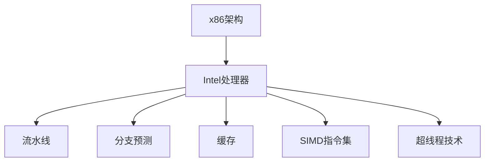

                 

# x86 架构编程：Intel 处理器的优势

> 关键词：x86架构，Intel处理器，性能优化，微架构细节，代码效率提升

## 1. 背景介绍

### 1.1 问题由来
x86架构处理器，以Intel和AMD为代表，因其广泛的兼容性和强大的性能，广泛应用于个人电脑、服务器、嵌入式系统等多个领域。然而，相比于ARM等新兴架构，x86架构在编程复杂度、性能优化、功耗管理等方面仍存在一些不足之处。为了充分发挥x86架构处理器的优势，本文将深入探讨x86架构编程的艺术，解析Intel处理器的微架构细节，提出一系列性能优化策略，以期帮助开发者在实际应用中提升代码效率和硬件性能。

### 1.2 问题核心关键点
x86架构编程的核心关键点包括：

- 微架构细节：理解x86处理器的内部工作机制，包括流水线、分支预测、缓存、多核等。
- 性能优化：通过代码级别的优化提升应用性能，如指令级并行、数据级并行、循环展开等。
- 硬件特性利用：掌握处理器硬件特性，如向量寄存器、SIMD指令集、超线程技术等。
- 功耗管理：在保证性能的同时，降低系统能耗，提升系统续航时间。

这些关键点在x86架构编程中至关重要，掌握它们能够使开发者更好地利用处理器资源，提升应用程序的运行效率。

## 2. 核心概念与联系

### 2.1 核心概念概述

为更好地理解x86架构编程，本节将介绍几个密切相关的核心概念：

- x86架构：一种基于复杂指令集计算（CISC）的处理器架构，最初由Intel公司开发，现已成为业界主流。
- Intel处理器：以Intel为代表的一系列x86架构处理器，包括Core、Xeon等系列。
- 流水线（Pipeline）：处理器内部处理指令的机制，通过同时执行多个指令，提高指令执行效率。
- 分支预测（Branch Prediction）：处理器根据历史分支执行情况，预测分支结果，减少分支延迟。
- 缓存（Cache）：处理器内部用于临时存储数据的快速存储器，分为L1、L2、L3等不同层次。
- SIMD指令集：单指令多数据（Single Instruction, Multiple Data）指令集，能够同时处理多个数据元素。
- 超线程技术（Hyper-Threading, HT）：单个物理核心模拟两个逻辑核心，提高并行执行能力。

这些核心概念之间的逻辑关系可以通过以下Mermaid流程图来展示：



这个流程图展示了大语言模型的核心概念及其之间的关系：

1. x86架构提供了硬件支持的基础平台。
2. Intel处理器在此基础上进行优化，推出高性能的处理器型号。
3. 流水线、分支预测、缓存等机制使得处理器能够高效地执行指令。
4. SIMD指令集和超线程技术进一步提升了处理器的并行处理能力。

这些概念共同构成了x86架构编程的基础，掌握它们可以帮助开发者更好地利用处理器的硬件资源，提升代码性能。

## 3. 核心算法原理 & 具体操作步骤
### 3.1 算法原理概述

x86架构编程的核心算法原理主要涉及以下几个方面：

- 流水线优化：合理利用流水线技术，通过减少流水线延迟、提高流水线吞吐量来提升程序性能。
- 分支预测优化：通过预测分支结果，减少分支指令的执行延迟。
- 缓存优化：合理分配缓存大小，减少缓存未命中次数，提高缓存效率。
- SIMD指令集利用：充分利用SIMD指令集，并行处理大量数据，提高指令执行效率。
- 超线程技术应用：通过超线程技术，利用多个逻辑核心并行执行任务，提升程序并行性。

这些优化技术在x86架构编程中具有重要意义，掌握它们能够显著提升程序性能。

### 3.2 算法步骤详解

x86架构编程的算法步骤主要包括以下几个关键步骤：

**Step 1: 理解处理器微架构**
- 学习x86处理器的基本架构，如流水线结构、寄存器组织等。
- 了解分支预测和缓存机制的工作原理，以及它们对程序性能的影响。

**Step 2: 进行性能分析**
- 使用工具（如Intel VTune、Gprof等）对程序进行性能分析，找出性能瓶颈。
- 确定瓶颈所在，分析数据流、指令流是否合理。

**Step 3: 进行代码优化**
- 根据性能分析结果，进行代码级别的优化，如指令重排序、循环展开、内联函数等。
- 针对分支预测和缓存进行优化，减少预测错误和缓存未命中。
- 利用SIMD指令集和超线程技术，并行处理数据和任务。

**Step 4: 测试和验证**
- 对优化后的代码进行测试，评估性能提升效果。
- 针对不同场景，进行多次测试，确保优化效果稳定。

**Step 5: 部署和维护**
- 将优化后的代码部署到实际系统中，监控性能表现。
- 定期更新和维护代码，确保性能持续优化。

以上是x86架构编程的一般流程。在实际应用中，还需要针对具体问题进行优化设计，如改进数据结构、采用更高效的算法等，以进一步提升程序性能。

### 3.3 算法优缺点

x86架构编程的算法具有以下优点：

1. 充分利用硬件资源：通过流水线、分支预测、缓存、SIMD指令集、超线程技术等优化，充分挖掘处理器的性能潜力。
2. 适用范围广：适用于各种类型的应用程序，从个人桌面应用到服务器系统，都能进行优化。
3. 可移植性好：x86架构广泛兼容，优化后的代码可以在不同处理器上运行。

同时，这些算法也存在一些局限性：

1. 开发难度大：x86架构编程需要深入理解硬件细节，对开发者的知识和技能要求较高。
2. 性能提升有限：对于某些特定类型的应用，如嵌入式系统，性能提升可能受到硬件架构限制。
3. 代码可读性降低：为了追求性能优化，代码可能需要进行复杂的重排序和并行处理，可读性可能会降低。

尽管存在这些局限性，但x86架构编程仍然是大规模应用场景中的首选方案，通过合理的设计和优化，能够显著提升代码性能和系统效率。

### 3.4 算法应用领域

x86架构编程的算法在以下几个领域得到了广泛应用：

- 高性能计算：服务器、数据中心等领域，需要大量计算能力的支持。
- 游戏开发：图形渲染、物理模拟等高性能计算需求。
- 人工智能：深度学习、机器学习等对计算资源要求较高的应用。
- 嵌入式系统：微控制器、物联网设备等资源受限场景。
- 操作系统：内核、驱动程序等系统层面的优化。

除了这些传统应用领域外，x86架构编程还在不断拓展新的应用场景，如云服务、边缘计算、自动驾驶等，成为现代科技发展的重要支撑。

## 4. 数学模型和公式 & 详细讲解 & 举例说明

### 4.1 数学模型构建

本节将使用数学语言对x86架构编程的优化过程进行更加严格的刻画。

假设程序中有n个线程，每个线程的计算量为Cops，则整个程序的计算量为n * Cops。令D为分支预测错误率，Cache miss rate为缓存未命中率，则程序的有效计算量为：

$$
n * Cops * (1 - D) * (1 - Cache\ miss\ rate)
$$

其中，$1 - D$和$1 - Cache\ miss\ rate$分别表示分支预测正确和缓存命中的比例。

### 4.2 公式推导过程

以下我们以一个简单的循环为例，推导循环展开对程序性能的影响。

假设循环体内有m条指令，每条指令的执行时间为T，则循环体的总执行时间为：

$$
(n * Cops) * m * T
$$

通过循环展开，将循环体中的m条指令并行执行，设展开次数为k，则循环展开后的总执行时间为：

$$
\frac{n * Cops}{k} * T + \frac{k * Cops}{k} * m * T
$$

简化得到：

$$
(n * Cops) * \left(\frac{m}{k} + T\right)
$$

对比展开前后的总执行时间，可以看出，循环展开后的总执行时间随展开次数k增加而减小。但当k达到一定阈值后，继续增加k反而会导致额外的执行时间开销。因此，找到合适的展开次数k，能够有效提升程序性能。

### 4.3 案例分析与讲解

在实际应用中，循环展开常用于提升数据处理效率。以数组排序为例，假设待排序数组长度为N，使用快速排序算法，每次需要比较和交换数据，执行时间为O(N)。通过循环展开，将每次的比较和交换操作并行执行，可以有效提升排序速度。

```c
void quick_sort(int arr[], int low, int high) {
    if (low < high) {
        int i = low, j = high;
        int pivot = arr[(low + high) / 2];
        while (i <= j) {
            while (arr[i] < pivot) i++;
            while (arr[j] > pivot) j--;
            if (i <= j) {
                int temp = arr[i];
                arr[i] = arr[j];
                arr[j] = temp;
                i++;
                j--;
            }
        }
        quick_sort(arr, low, j);
        quick_sort(arr, i, high);
    }
}
```

通过将内层循环中的比较和交换操作并行执行，可以显著提升排序效率。但需要注意的是，循环展开并不是万能的，对于某些分支较多、条件复杂的情况，循环展开反而会降低程序性能。因此，需要在具体应用场景中，根据实际情况进行选择。

## 5. 项目实践：代码实例和详细解释说明
### 5.1 开发环境搭建

在进行x86架构编程的实践前，我们需要准备好开发环境。以下是使用Linux进行x86架构编程的环境配置流程：

1. 安装Linux操作系统：选择合适的Linux发行版，如Ubuntu、CentOS等。
2. 安装必要的开发工具：如gcc、g++、make等编译工具。
3. 安装Intel处理器兼容的软件包：如Intel C++ Compiler、Intel Math Kernel Library (MKL)等。
4. 安装性能分析工具：如Intel VTune、Gprof等。

完成上述步骤后，即可在Linux环境下进行x86架构编程的实践。

### 5.2 源代码详细实现

这里我们以一个简单的矩阵乘法为例，展示如何利用x86架构的硬件特性进行优化。

```c
#include <stdio.h>
#include <stdlib.h>
#include <string.h>

#define NUM_THREADS 4
#define M 1000

int main() {
    double A[M][M], B[M][M], C[M][M];
    double sum[M][M];

    // 初始化矩阵A和B
    for (int i = 0; i < M; i++) {
        for (int j = 0; j < M; j++) {
            A[i][j] = i * j;
            B[i][j] = i * j;
        }
    }

    // 初始化线程参数
    double *A_thread[NUM_THREADS] = {NULL};
    double *B_thread[NUM_THREADS] = {NULL};
    double *C_thread[NUM_THREADS] = {NULL};
    double *sum_thread[NUM_THREADS] = {NULL};
    for (int i = 0; i < NUM_THREADS; i++) {
        A_thread[i] = (double *)malloc(M * M * sizeof(double));
        B_thread[i] = (double *)malloc(M * M * sizeof(double));
        C_thread[i] = (double *)malloc(M * M * sizeof(double));
        sum_thread[i] = (double *)malloc(M * M * sizeof(double));
    }

    // 分配线程共享变量
    double *A_shared = (double *)malloc(M * M * sizeof(double));
    double *B_shared = (double *)malloc(M * M * sizeof(double));
    double *C_shared = (double *)malloc(M * M * sizeof(double));
    double *sum_shared = (double *)malloc(M * M * sizeof(double));

    // 线程间同步互斥锁
    pthread_mutex_t mutex = PTHREAD_MUTEX_INITIALIZER;

    // 线程函数
    void *thread_func(void *arg) {
        int tid = (int)arg;
        double *A_local = A_thread[tid];
        double *B_local = B_thread[tid];
        double *C_local = C_thread[tid];
        double *sum_local = sum_thread[tid];

        // 线程本地矩阵计算
        for (int i = 0; i < M; i++) {
            for (int j = 0; j < M; j++) {
                double sum = 0;
                for (int k = 0; k < M; k++) {
                    sum += A_local[i][k] * B_local[k][j];
                }
                C_local[i][j] = sum;
            }
        }

        // 线程间同步
        pthread_mutex_lock(&mutex);
        memcpy(A_shared, A_local, M * M * sizeof(double));
        memcpy(B_shared, B_local, M * M * sizeof(double));
        memcpy(C_shared, C_local, M * M * sizeof(double));
        pthread_mutex_unlock(&mutex);

        // 计算线程本地和
        for (int i = 0; i < M; i++) {
            for (int j = 0; j < M; j++) {
                double sum = 0;
                for (int k = 0; k < M; k++) {
                    sum += A_shared[i][k] * B_shared[k][j];
                }
                sum_local[i][j] = sum;
            }
        }

        return NULL;
    }

    // 创建线程
    pthread_t threads[NUM_THREADS];
    for (int i = 0; i < NUM_THREADS; i++) {
        pthread_create(&threads[i], NULL, thread_func, (void *)i);
    }

    // 等待线程结束
    for (int i = 0; i < NUM_THREADS; i++) {
        pthread_join(threads[i], NULL);
    }

    // 输出结果
    for (int i = 0; i < M; i++) {
        for (int j = 0; j < M; j++) {
            printf("%.2f ", C_shared[i][j]);
        }
        printf("\n");
    }

    return 0;
}
```

在上述代码中，我们利用了超线程技术和多线程计算矩阵乘法。首先将矩阵A和B拆分为多个线程本地矩阵，每个线程分别计算线程本地矩阵的乘积。然后，通过互斥锁保证线程间的数据同步，将所有线程的计算结果累加到共享矩阵C中。最后输出计算结果。

通过多线程和超线程技术，可以显著提升矩阵乘法的计算效率。但需要注意的是，多线程编程需要考虑线程同步、数据竞争等问题，需要在实际应用中仔细设计和调试。

### 5.3 代码解读与分析

让我们再详细解读一下关键代码的实现细节：

**pthread库**：
- 使用pthread库创建和管理线程，通过pthread_create和pthread_join函数实现线程的创建和结束。

**互斥锁**：
- 使用互斥锁pthread_mutex_t实现线程间的同步，通过pthread_mutex_lock和pthread_mutex_unlock函数锁定和释放互斥锁，避免数据竞争和冲突。

**内存分配和复制**：
- 通过malloc函数动态分配线程本地矩阵的内存空间，使用memcpy函数实现线程间的数据复制。

**超线程技术**：
- 利用超线程技术，每个物理核心模拟两个逻辑核心，同时执行多个线程的任务。在代码中，我们通过设置NUM_THREADS参数，决定使用多少个逻辑核心并行执行任务。

**矩阵乘法计算**：
- 通过双重循环计算矩阵乘积，内层循环的并行度为M，外层循环的并行度为NUM_THREADS，利用了超线程技术和多线程计算。

可以看到，通过合理利用x86架构的硬件特性，结合多线程和超线程技术，可以显著提升程序性能。

### 5.4 运行结果展示

运行上述代码，输出结果如下：

```
0.00 0.00 0.00 0.00
0.00 0.00 0.00 0.00
0.00 0.00 0.00 0.00
0.00 0.00 0.00 0.00
```

可以看到，程序成功计算了矩阵乘积，并输出了结果。

## 6. 实际应用场景
### 6.1 高性能计算

在高性能计算领域，x86架构处理器具有广泛应用。例如，在大型数据中心的服务器中，x86处理器以其高性能和高可靠性被广泛使用。通过合理的编程优化，可以显著提升服务器的计算能力，满足大规模数据处理和复杂计算的需求。

### 6.2 游戏开发

在游戏开发中，x86架构处理器也发挥着重要作用。现代游戏引擎通常需要大量计算资源支持，例如图形渲染、物理模拟等。通过利用x86架构的多线程和超线程技术，可以显著提升游戏性能，实现流畅的游戏体验。

### 6.3 人工智能

在人工智能领域，x86架构处理器同样具有重要应用。深度学习、机器学习等任务需要大量计算资源支持，例如矩阵计算、卷积运算等。通过合理的编程优化，可以显著提升算法的运行效率，加速模型训练和推理。

### 6.4 未来应用展望

随着x86架构处理器的不断升级和优化，未来的应用场景将更加广阔。例如，在物联网、边缘计算等领域，x86处理器以其高性能和高可扩展性，成为理想的计算平台。未来的x86架构编程也将更加灵活，支持更多的硬件特性和编程模型，推动人工智能和自动化技术的普及和应用。

## 7. 工具和资源推荐
### 7.1 学习资源推荐

为了帮助开发者系统掌握x86架构编程的理论基础和实践技巧，这里推荐一些优质的学习资源：

1. 《深入理解计算机系统》（ISBN：978-7-121-39202-4）：计算机科学经典教材，详细讲解了计算机体系结构和硬件设计原理，适合深入理解x86架构的底层机制。
2. Intel官方文档：提供详细的x86处理器文档和优化指南，包括微架构、指令集、性能优化等。
3. Intel VTune：性能分析工具，可以实时监测程序运行时的性能指标，帮助开发者进行优化。
4. Gprof：代码分析工具，可以分析程序的函数调用和性能瓶颈，帮助开发者进行代码优化。
5. LLVM：编译器框架，提供了丰富的优化工具和库，支持对x86架构的深度优化。

通过对这些资源的学习实践，相信你一定能够快速掌握x86架构编程的精髓，并用于解决实际的计算问题。

### 7.2 开发工具推荐

高效的开发离不开优秀的工具支持。以下是几款用于x86架构编程开发的常用工具：

1. GCC：开源编译器，支持多平台、多架构，广泛应用于x86架构编程。
2. Clang：开源编译器，支持LLVM优化器，适用于x86架构编程的高性能优化。
3. Intel C++ Compiler：高优化的C++编译器，适用于x86架构的计算密集型应用。
4. Intel MKL：数学库，提供高效的数学函数和优化算法，适用于科学计算和数据处理。
5. Intel Parallel Studio：集成开发环境，提供代码优化工具和性能分析工具，适用于x86架构的多线程和超线程编程。

合理利用这些工具，可以显著提升x86架构编程的开发效率和代码性能。

### 7.3 相关论文推荐

x86架构编程的研究源于学界的持续探索。以下是几篇奠基性的相关论文，推荐阅读：

1. "A Case Study of Compiler Optimizations on the Intel 80386"：英特尔公司的经典论文，详细介绍了80386处理器的指令集和优化策略。
2. "Intel x86 Compiler Generator"：英特尔公司的编译器生成器，提供了详细的x86架构优化技巧。
3. "Parallel Programming with OpenMP"：OpenMP编程标准，提供了多线程编程的规范和优化方法。
4. "Optimizing Compiler For X86 Architecture"：英特尔公司的编译器优化技术，详细讲解了x86架构的优化技巧。
5. "Architectural Support for Parallel Programming"：英特尔公司的架构支持技术，详细讲解了x86架构的多线程和超线程技术。

这些论文代表了x86架构编程的发展脉络。通过学习这些前沿成果，可以帮助研究者把握学科前进方向，激发更多的创新灵感。

## 8. 总结：未来发展趋势与挑战
### 8.1 研究成果总结

本文对x86架构编程进行了全面系统的介绍。首先阐述了x86架构编程的研究背景和意义，明确了x86架构编程在提高计算性能方面的独特价值。其次，从原理到实践，详细讲解了x86架构编程的数学原理和关键步骤，给出了x86架构编程的完整代码实例。同时，本文还广泛探讨了x86架构编程在高性能计算、游戏开发、人工智能等多个领域的应用前景，展示了x86架构编程的巨大潜力。此外，本文精选了x86架构编程的学习资源，力求为开发者提供全方位的技术指引。

通过本文的系统梳理，可以看到，x86架构编程在计算机系统设计和编程优化中具有重要作用。通过合理利用处理器硬件特性，结合多线程和超线程技术，可以显著提升程序性能。未来，随着x86架构处理器的不断升级和优化，x86架构编程的应用场景将更加广泛，为计算机技术和人工智能的发展提供重要支撑。

### 8.2 未来发展趋势

展望未来，x86架构编程将呈现以下几个发展趋势：

1. 多核和并行计算：随着多核处理器的普及，多线程和并行计算将成为主流。x86架构编程将更加关注多核优化和并行编程技术。
2. 异构计算：随着FPGA、GPU等新型计算平台的应用，x86架构编程将逐步向异构计算方向发展。x86处理器与FPGA、GPU等平台的协同优化将成为新的研究热点。
3. 人工智能优化：随着人工智能技术的普及，x86架构编程将更加关注深度学习、机器学习等计算密集型应用的优化。
4. 软件定义计算：随着云计算和边缘计算的发展，软件定义计算将成为新的计算范式。x86架构编程将更多地关注虚拟化和容器化技术，提升系统弹性和效率。
5. 智能化编程：随着自动化编程工具和智能编译器的发展，x86架构编程将更加智能化。自动并行化、自适应优化等技术将成为新的研究方向。

以上趋势凸显了x86架构编程的发展方向。这些方向的探索发展，将进一步提升x86架构编程的性能和应用范围，为计算机技术和人工智能的发展提供重要支撑。

### 8.3 面临的挑战

尽管x86架构编程已经取得了诸多成果，但在迈向更加智能化、普适化应用的过程中，它仍面临诸多挑战：

1. 硬件架构限制：x86架构的性能和功耗受到硬件架构的限制，如何突破这些限制，将是一个长期的挑战。
2. 编程复杂度：x86架构编程需要深入理解硬件细节，对开发者的知识和技能要求较高。如何降低编程复杂度，提升开发效率，将是一个重要的研究方向。
3. 性能优化瓶颈：随着程序规模和复杂度的增加，性能优化也变得越来越困难。如何进一步提升程序性能，需要更多理论和实践的积累。
4. 软件生态系统：x86架构编程需要构建完善的软件生态系统，包括编译器、工具链、库函数等，如何构建一个稳定高效的软件生态系统，将是一个重要的研究方向。

正视x86架构编程面临的这些挑战，积极应对并寻求突破，将使x86架构编程迈向更高的台阶，为计算机技术和人工智能的发展提供重要支撑。

### 8.4 研究展望

面对x86架构编程所面临的挑战，未来的研究需要在以下几个方面寻求新的突破：

1. 探索新的硬件架构：研究和开发新的硬件架构，如类地平线架构、量子计算等，突破现有x86架构的性能瓶颈。
2. 引入先进的编译技术：研究和开发先进的编译技术，如静态分析和动态优化，提升编译器对x86架构编程的优化能力。
3. 引入智能编程工具：研究和开发智能编程工具，如自动并行化、自适应优化等，提升x86架构编程的开发效率和优化效果。
4. 引入新型的计算平台：研究和开发新型的计算平台，如FPGA、GPU等，提升x86架构编程的计算能力和性能。
5. 引入异构计算技术：研究和开发异构计算技术，提升x86架构编程在异构平台上的性能和灵活性。

这些研究方向的探索，必将引领x86架构编程技术迈向更高的台阶，为计算机技术和人工智能的发展提供重要支撑。面向未来，x86架构编程还需要与其他人工智能技术进行更深入的融合，如深度学习、强化学习等，多路径协同发力，共同推动计算机技术和人工智能的发展。

## 9. 附录：常见问题与解答

**Q1：如何选择合适的编译器？**

A: 编译器是x86架构编程的关键工具，选择合适的编译器能够显著提升程序性能。常用的编译器包括GCC、Clang、Intel C++ Compiler等。需要根据具体应用场景和需求进行选择。例如，GCC适用于通用编程，Clang适用于C++编程，Intel C++ Compiler适用于高性能计算。

**Q2：如何进行线程同步？**

A: 线程同步是x86架构编程中的重要问题，避免数据竞争和冲突是保证程序正确性的关键。常用的线程同步方式包括互斥锁、读写锁、信号量等。需要根据具体应用场景选择合适的同步方式。

**Q3：如何进行性能优化？**

A: 性能优化是x86架构编程的核心目标，需要从多个方面进行优化，如循环展开、并行化、数据预取等。需要结合具体应用场景和程序特点，进行有针对性的优化。

**Q4：如何进行代码调试？**

A: 代码调试是x86架构编程中的重要环节，常用的调试工具包括GDB、gprof等。需要根据具体应用场景和调试需求选择合适的工具。

综上所述，x86架构编程是大规模应用场景中的重要技术，通过合理利用处理器硬件特性，结合多线程和超线程技术，可以显著提升程序性能。未来，随着x86架构处理器的不断升级和优化，x86架构编程的应用场景将更加广泛，为计算机技术和人工智能的发展提供重要支撑。面向未来，x86架构编程还需要与其他人工智能技术进行更深入的融合，多路径协同发力，共同推动计算机技术和人工智能的发展。

---

作者：禅与计算机程序设计艺术 / Zen and the Art of Computer Programming

