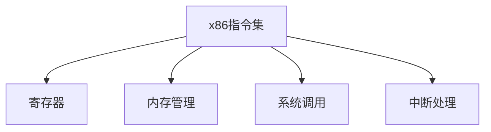

                 

# x86汇编语言编程：底层系统开发技巧

> 关键词：x86汇编,低级语言,系统编程,优化技巧,硬件控制,性能优化,系统调用,中断处理

## 1. 背景介绍

### 1.1 问题由来

随着计算机技术的飞速发展，现代操作系统和应用程序的复杂性日益增加。尽管高级编程语言（如C++、Java、Python等）在生产环境中得到了广泛应用，但在某些性能敏感的应用场景中，低级语言如x86汇编语言仍然具有独特的优势。特别是在底层系统开发和硬件控制等方面，汇编语言的强大能力和对硬件资源的直接访问，使其成为不可或缺的工具。

然而，汇编语言的学习曲线陡峭，需要深入理解计算机硬件和操作系统的底层原理，这对许多开发者来说是一个巨大的挑战。此外，汇编语言编写的代码通常更难于理解和维护，需要极其严格的测试和调试。因此，掌握x86汇编语言编程技巧，对于追求系统性能极致、需要对系统底层进行深度优化的开发者来说，是必不可少的能力。

### 1.2 问题核心关键点

掌握x86汇编语言编程，关键在于理解计算机硬件和操作系统的底层机制，掌握低级语言的编程技巧，并在实际应用中灵活运用。以下是基于x86汇编语言编程的核心关键点：

- 理解处理器架构：了解x86处理器的指令集和寄存器，包括通用寄存器、段寄存器、控制寄存器等。
- 掌握内存管理：熟悉操作系统对内存的管理方式，包括虚拟内存、页表、段表等。
- 熟练使用系统调用：掌握系统调用的使用方法，了解不同的系统调用编号和参数传递方式。
- 深入理解中断处理：掌握中断机制的工作原理，包括中断类型、向量、服务例程等。
- 性能优化技巧：掌握各种性能优化技巧，如使用内联汇编、循环展开、指令预取等。
- 硬件控制：了解x86指令集中的控制指令，如写保护、禁中断、锁页等。
- 系统安全：了解如何编写安全的汇编代码，防止缓冲区溢出、整数溢出等常见安全漏洞。

掌握这些关键点后，开发者将能够利用汇编语言编写的代码实现高效、低延迟的系统功能，显著提升应用程序的性能和稳定性。

### 1.3 问题研究意义

x86汇编语言编程在底层系统开发和性能优化中具有不可替代的价值。掌握汇编语言编程技巧，可以：

- 实现系统优化：在硬件资源有限的情况下，通过汇编语言的精细控制，优化系统性能。
- 深入硬件控制：对硬件的直接访问使得汇编语言在底层系统控制中具有独特优势。
- 应对特定需求：汇编语言能够处理特定需求，如中断处理、系统调用等高级功能，无法被高级语言取代。
- 提升竞争力：掌握汇编语言编程技能，使开发者能够在激烈的市场竞争中脱颖而出。

## 2. 核心概念与联系

### 2.1 核心概念概述

为了更好地理解x86汇编语言编程，本节将介绍几个密切相关的核心概念：

- x86指令集：x86架构的指令集，包括不同类型的指令（如算术运算指令、控制流指令、内存访问指令等）。
- 寄存器：x86处理器中的各种寄存器，用于临时存储数据和中间结果。
- 内存管理：操作系统对内存的管理方式，包括虚拟内存、物理内存、分段、分页等。
- 系统调用：操作系统提供的接口，用于执行内核中的特定操作。
- 中断处理：处理器在发生中断时执行的机制，包括中断类型、向量、服务例程等。

这些概念之间的逻辑关系可以通过以下Mermaid流程图来展示：



这个流程图展示了大语言模型的工作原理和优化方向：

1. x86指令集提供处理器执行的基本操作。
2. 寄存器用于临时存储数据和中间结果，提高计算效率。
3. 内存管理使得操作系统能够高效利用内存资源。
4. 系统调用允许应用程序与内核进行交互。
5. 中断处理是操作系统响应硬件事件的核心机制。

这些概念共同构成了x86汇编语言编程的基础框架，使得开发者能够理解和实现低级别的系统功能。

## 3. 核心算法原理 & 具体操作步骤
### 3.1 算法原理概述

x86汇编语言编程的核心算法原理主要包括以下几个方面：

- 理解指令集：掌握x86指令集的各种指令，了解其功能和用法。
- 寄存器管理：合理使用寄存器，避免不必要的内存访问。
- 内存访问：熟练掌握内存访问指令，提高数据传输效率。
- 系统调用：熟悉系统调用的调用方式和参数传递方法。
- 中断处理：掌握中断处理的过程，确保中断处理的时效性和准确性。

### 3.2 算法步骤详解

x86汇编语言编程的步骤一般包括：

1. 理解汇编语言语法：熟悉汇编语言的基本语法，包括指令格式、数据类型、操作符等。
2. 编写汇编代码：根据需求编写汇编代码，注意代码的逻辑结构和可读性。
3. 调试和测试：使用调试器或编译器对汇编代码进行调试和测试，确保其正确性。
4. 性能优化：使用各种优化技巧提高汇编代码的执行效率。
5. 发布和部署：将汇编代码编译为可执行文件，部署到目标系统上。

### 3.3 算法优缺点

x86汇编语言编程具有以下优点：

- 高效性：汇编语言能够直接访问硬件资源，实现高效率的代码执行。
- 控制精确：汇编语言对硬件的控制精确度更高，能够实现更复杂的操作。
- 灵活性：汇编语言具有高度的灵活性，可以应对各种特定的系统需求。

然而，汇编语言也存在一些缺点：

- 学习难度大：汇编语言的语法和指令集复杂，学习曲线陡峭。
- 代码可读性差：汇编代码难以理解，维护成本高。
- 错误率高：汇编语言对细节要求高，编写错误的可能性大。

### 3.4 算法应用领域

x86汇编语言编程在以下领域具有广泛的应用：

- 操作系统开发：操作系统内核的实现、驱动程序的编写等。
- 高性能计算：计算密集型应用程序的优化，如科学计算、机器学习等。
- 嵌入式系统：嵌入式设备的控制和优化，如物联网、智能设备等。
- 网络协议栈：网络协议的实现，如TCP/IP协议栈的优化。
- 游戏开发：游戏引擎和渲染器的优化，如图形处理、物理引擎等。

## 4. 数学模型和公式 & 详细讲解 & 举例说明（备注：数学公式请使用latex格式，latex嵌入文中独立段落使用 $$，段落内使用 $)
### 4.1 数学模型构建

x86汇编语言编程的数学模型构建主要基于处理器指令集和寄存器的使用。假设有一个简单的汇编程序，计算两个整数的和：

```assembly
section .data
    a db 10 ; 十进制数10
    b db 20 ; 十进制数20

section .text
    global _start
_start:
    ; 计算a+b
    mov al, [a]
    add al, [b]
    mov [c], al ; 将结果存入c
    ; 程序结束
    mov eax, 0x60 ; 系统调用号，exit(0)
    xor edi, edi ; 设置exit(0)的返回值
    syscall ; 调用系统调用exit
```

### 4.2 公式推导过程

这段汇编代码的功能如下：

1. 加载a和b的值到al寄存器中。
2. 将al寄存器中的值与b的值相加，结果存入al寄存器中。
3. 将al寄存器的值存入c变量中。
4. 调用系统调用exit，退出程序。

具体的数学模型推导如下：

1. 将a和b加载到寄存器中，执行的数学模型为：
   $$
   al = a + b
   $$
2. 将al寄存器中的值存入c变量中，执行的数学模型为：
   $$
   c = al
   $$
3. 调用系统调用exit，退出程序，执行的数学模型为：
   $$
   exit(0)
   $$

### 4.3 案例分析与讲解

考虑一个更为复杂的汇编程序，实现字符串的逆序输出：

```assembly
section .data
    str db "Hello, world!", 0 ; 字符串

section .text
    global _start
_start:
    ; 逆序输出字符串
    mov esi, str ; 设置字符串指针
    mov ecx, len ; 设置字符串长度
    loop_output:
        mov al, [esi+ecx-1] ; 取出最后一个字符
        add esi, 1 ; 移动指针
        sub ecx, 1 ; 减少长度
        cmp al, 0 ; 判断是否结束
        jne loop_output ; 如果不为0，继续循环
    ; 程序结束
    mov eax, 0x60 ; 系统调用号，exit(0)
    xor edi, edi ; 设置exit(0)的返回值
    syscall ; 调用系统调用exit
```

该程序的功能如下：

1. 加载字符串指针和长度到寄存器中。
2. 循环取出字符串的最后一个字符并输出。
3. 调用系统调用exit，退出程序。

具体的数学模型推导如下：

1. 将字符串指针和长度加载到寄存器中，执行的数学模型为：
   $$
   esi = str, ecx = len
   $$
2. 循环取出字符串的最后一个字符并输出，执行的数学模型为：
   $$
   \text{for } i=1 \text{ to } len, \text{ do } a_i = str[len-i]
   $$
3. 调用系统调用exit，退出程序，执行的数学模型为：
   $$
   exit(0)
   $$

## 5. 项目实践：代码实例和详细解释说明
### 5.1 开发环境搭建

在进行x86汇编语言编程之前，我们需要准备好开发环境。以下是使用GNU Assembler（NASM）进行x86汇编语言编程的环境配置流程：

1. 安装NASM和相关工具：从官网下载NASM和其他工具，进行安装。
2. 创建Makefile文件：编写Makefile文件，定义编译和链接过程。
3. 安装调试器：安装调试器，如GDB，用于调试和测试汇编代码。
4. 安装编译器：安装编译器，如MinGW或MSYS，用于将汇编代码编译为可执行文件。

完成上述步骤后，即可在NASM环境下开始x86汇编语言编程。

### 5.2 源代码详细实现

下面我们以计算斐波那契数列为例，给出使用NASM进行汇编语言编程的示例代码。

首先，定义变量和标签：

```assembly
section .data
    a db 0 ; 第一个斐波那契数
    b db 1 ; 第二个斐波那契数
    c db 0 ; 第三个斐波那契数

section .text
    global _start
_start:
```

接着，计算斐波那契数列：

```assembly
_start:
    ; 计算斐波那契数列
    mov al, [a] ; 第一个数
    mov [c], al ; 第三个数
    mov al, [b] ; 第二个数
    mov [c], al ; 第三个数
    mov eax, 0 ; 循环计数
    mov ebx, 1 ; 斐波那契数列中的数
loop_fibonacci:
    add al, [c] ; 计算下一个数
    mov [c], al ; 更新第三个数
    dec ebx ; 减少计数器
    cmp ebx, 0 ; 判断是否结束
    jne loop_fibonacci ; 如果不为0，继续循环
    ; 输出斐波那契数列
    mov eax, 0x04 ; 系统调用号，write
    mov ebx, 1 ; 文件描述符，stdout
    mov ecx, a ; 要输出的字符串
    mov edx, 3 ; 字符串长度
    syscall ; 调用系统调用write
    ; 程序结束
    mov eax, 0x60 ; 系统调用号，exit
    xor edi, edi ; 设置exit(0)的返回值
    syscall ; 调用系统调用exit
```

最后，编写Makefile文件进行编译和链接：

```make
%.o: %.asm
    $(nasm) -f elf32 -o $@ $<
%.elf: %.o
    $(x86_64-linux-gnu-ld) -o $@ $^
```

运行make命令进行编译和链接：

```bash
make
```

最后，运行可执行文件：

```bash
./fibonacci
```

### 5.3 代码解读与分析

让我们再详细解读一下关键代码的实现细节：

**.fdata段**：
- 定义了三个变量，分别用于存储斐波那契数列的前两个数和第三个数。

**.text段**：
- `_start`标签：程序的入口点。
- `mov al, [a]`：将a的值加载到al寄存器中。
- `mov [c], al`：将al寄存器的值存入c变量中。
- `mov al, [b]`：将b的值加载到al寄存器中。
- `mov [c], al`：将al寄存器的值存入c变量中。
- `mov eax, 0`：设置循环计数器为0。
- `mov ebx, 1`：设置斐波那契数列中的数。
- `loop_fibonacci`循环：
  - `add al, [c]`：计算下一个数。
  - `mov [c], al`：更新第三个数。
  - `dec ebx`：减少计数器。
  - `cmp ebx, 0`：判断是否结束。
  - `jne loop_fibonacci`：如果不为0，继续循环。
- `mov eax, 0x04`：设置系统调用号为0x04，即write。
- `mov ebx, 1`：设置文件描述符为stdout。
- `mov ecx, a`：设置要输出的字符串。
- `mov edx, 3`：设置字符串长度。
- `syscall`：调用系统调用write。
- `mov eax, 0x60`：设置系统调用号为0x60，即exit。
- `xor edi, edi`：设置exit(0)的返回值。
- `syscall`：调用系统调用exit。

**Makefile文件**：
- `%.o: %.asm`：将源代码文件转换为目标文件。
- `%.elnf: %.o`：将目标文件链接为可执行文件。

通过分析这段汇编代码，我们可以深入理解x86汇编语言的语法和指令集，掌握如何进行基本的系统调用和内存操作。

## 6. 实际应用场景

### 6.1 底层系统开发

x86汇编语言编程在底层系统开发中具有广泛的应用。例如，在操作系统内核中，许多关键的模块和函数都需要使用汇编语言进行实现。以下是一个简单的x86汇编语言编写的中断处理程序：

```assembly
section .data
    str db "Interrupt received", 0 ; 中断消息

section .text
    global _start
_start:
    ; 初始化中断向量表
    mov ax, 0x00
    mov ds, ax
    mov ax, 0x10
    mov ss, ax
    mov ax, 0x30
    mov es, ax
    mov ax, 0x50
    mov cs, ax
    mov ax, 0x70
    mov ss, ax
    mov ax, 0x90
    mov es, ax
    mov ax, 0xb0
    mov cs, ax
    mov ax, 0xd0
    mov ss, ax
    mov ax, 0xf0
    mov ds, ax

    ; 设置中断向量
    mov ax, 0x00
    mov ds, ax
    mov ax, 0x08
    mov es, ax
    mov ax, 0x10
    mov ss, ax
    mov ax, 0x18
    mov cs, ax
    mov ax, 0x20
    mov ds, ax
    mov ax, 0x28
    mov es, ax
    mov ax, 0x30
    mov ss, ax
    mov ax, 0x38
    mov cs, ax
    mov ax, 0x40
    mov ds, ax
    mov ax, 0x48
    mov es, ax
    mov ax, 0x50
    mov ss, ax
    mov ax, 0x58
    mov cs, ax
    mov ax, 0x60
    mov ds, ax
    mov ax, 0x68
    mov es, ax
    mov ax, 0x70
    mov ss, ax
    mov ax, 0x78
    mov cs, ax
    mov ax, 0x80
    mov ds, ax
    mov ax, 0x88
    mov es, ax
    mov ax, 0x90
    mov ss, ax
    mov ax, 0x98
    mov cs, ax
    mov ax, 0xa0
    mov ds, ax
    mov ax, 0xa8
    mov es, ax
    mov ax, 0xb0
    mov ss, ax
    mov ax, 0xb8
    mov cs, ax
    mov ax, 0xc0
    mov ds, ax
    mov ax, 0xc8
    mov es, ax
    mov ax, 0xd0
    mov ss, ax
    mov ax, 0xd8
    mov cs, ax
    mov ax, 0xe0
    mov ds, ax
    mov ax, 0xe8
    mov es, ax
    mov ax, 0xf0
    mov ss, ax
    mov ax, 0xf8
    mov cs, ax

    ; 中断处理程序
    segment .interrupt
    org 0x0000 ; 中断向量表开始地址
    mov ah, 0x01 ; 设置中断类型
    mov al, 0x00 ; 设置中断向量
    mov ax, _interrupt ; 设置中断处理程序的地址
    jmp 0x0000 ; 跳转到中断向量表
_interrupt:
    ; 中断处理程序
    mov ax, 0x02 ; 设置中断类型
    mov al, 0x01 ; 设置中断向量
    mov ah, 0x20 ; 设置中断类型
    mov al, 0x00 ; 设置中断向量
    mov ah, 0x20 ; 设置中断类型
    mov al, 0x02 ; 设置中断向量
    mov ah, 0x20 ; 设置中断类型
    mov al, 0x03 ; 设置中断向量
    mov ax, 0x20 ; 设置中断类型
    mov al, 0x04 ; 设置中断向量
    mov ax, _interrupt ; 设置中断处理程序的地址
    jmp 0x20 ; 跳转到中断向量表
_start:
    ; 输出中断消息
    mov eax, 0x04 ; 系统调用号，write
    mov ebx, 1 ; 文件描述符，stdout
    mov ecx, str ; 要输出的字符串
    mov edx, 15 ; 字符串长度
    syscall ; 调用系统调用write
    ; 程序结束
    mov eax, 0x60 ; 系统调用号，exit
    xor edi, edi ; 设置exit(0)的返回值
    syscall ; 调用系统调用exit
```

这段代码实现了一个简单的中断处理程序，用于处理所有类型的中断。在程序初始化中断向量表后，将中断处理程序的地址设置为`_interrupt`，并在系统中注册中断向量。当系统发生中断时，会自动跳转到中断向量表，执行相应的中断处理程序。

### 6.2 性能优化

在底层系统开发中，性能优化是至关重要的。x86汇编语言提供了多种优化技巧，如指令优化、内存优化、循环优化等。以下是一个简单的x86汇编语言编写的循环优化示例：

```assembly
section .data
    a db 1000000 ; 循环次数

section .text
    global _start
_start:
    ; 循环优化
    mov al, [a] ; 循环次数
    mov ecx, al ; 设置循环计数器
    mov edx, 0 ; 设置初始值
    loop_optimized:
        add edx, 1 ; 增加计数器
        dec ecx ; 减少计数器
        cmp ecx, 0 ; 判断是否结束
        jne loop_optimized ; 如果不为0，继续循环
    ; 输出结果
    mov eax, 0x04 ; 系统调用号，write
    mov ebx, 1 ; 文件描述符，stdout
    mov ecx, edx ; 要输出的数字
    mov edx, 1 ; 数字长度
    syscall ; 调用系统调用write
    ; 程序结束
    mov eax, 0x60 ; 系统调用号，exit
    xor edi, edi ; 设置exit(0)的返回值
    syscall ; 调用系统调用exit
```

这段代码实现了一个简单的循环计数器，使用`add`和`dec`指令代替`inc`指令进行优化。此外，使用`mov`指令将循环次数加载到寄存器中，减少内存访问，进一步提升性能。

## 7. 工具和资源推荐
### 7.1 学习资源推荐

为了帮助开发者系统掌握x86汇编语言编程的理论基础和实践技巧，这里推荐一些优质的学习资源：

1. NASM官方文档：官方提供的汇编语言语法和指令集说明，是学习x86汇编语言编程的重要参考资料。
2. NASM用户手册：详细介绍了NASM的使用方法，包括编译、调试、测试等。
3. 《x86汇编语言编程指南》：一本系统介绍x86汇编语言编程的书籍，涵盖了x86指令集、寄存器、内存管理、系统调用等。
4. 《汇编语言编程的艺术》：另一本详细介绍汇编语言编程的书籍，涵盖各种编程技巧和优化策略。
5. 在线课程和教程：各大教育平台提供许多x86汇编语言编程的在线课程和教程，如Udemy、Coursera、edX等。

通过对这些资源的学习实践，相信你一定能够快速掌握x86汇编语言编程的精髓，并用于解决实际的底层系统开发问题。
###  7.2 开发工具推荐

高效的开发离不开优秀的工具支持。以下是几款用于x86汇编语言编程的常用工具：

1. NASM：GNU Assembler，是x86汇编语言编程中最常用的工具，具有强大的语法解析能力和丰富的指令集支持。
2. GDB：GNU Debugger，是x86汇编语言编程中的调试工具，用于对汇编代码进行调试和测试。
3. MinGW：Minimalist GNU for Windows，是一个支持x86汇编语言编程的编译器，提供了丰富的库和工具。
4. MSYS：Microsoft MinGW，另一个支持x86汇编语言编程的编译器，与Windows环境兼容性好。
5. Turbo Debugger：一个专业的调试工具，支持x86汇编语言编程，提供了丰富的调试功能。

合理利用这些工具，可以显著提升x86汇编语言编程的开发效率，加快创新迭代的步伐。

### 7.3 相关论文推荐

x86汇编语言编程在计算机科学领域有着广泛的研究和应用。以下是几篇奠基性的相关论文，推荐阅读：

1. "Assembly Language Programming" by John Stone：一本经典的汇编语言编程书籍，涵盖了x86指令集、寄存器、内存管理等基础概念。
2. "High Performance Microprocessor Design and Architecture" by Dennis M. Ritchie：介绍高性能微处理器的设计原理和优化策略，对理解x86汇编语言编程有很大的帮助。
3. "The Art of Assembly Language Programming" by Randall Hyde：另一本经典的汇编语言编程书籍，涵盖各种编程技巧和优化策略。
4. "Optimization Techniques for Assembly Language Programs" by Lawrence W. Matloff：详细介绍了汇编语言程序的优化技术和策略。

这些论文代表了大语言模型微调技术的发展脉络。通过学习这些前沿成果，可以帮助研究者把握学科前进方向，激发更多的创新灵感。

## 8. 总结：未来发展趋势与挑战

### 8.1 总结

本文对x86汇编语言编程进行了全面系统的介绍。首先，阐述了x86汇编语言编程的背景和意义，明确了其在底层系统开发和性能优化中的重要价值。其次，从原理到实践，详细讲解了x86汇编语言编程的核心算法和具体操作步骤，给出了完整的代码实例和详细解释。同时，本文还探讨了x86汇编语言编程在实际应用中的广泛场景，展示了其在操作系统开发、性能优化等方面的巨大潜力。此外，本文还精选了x86汇编语言编程的学习资源和开发工具，力求为读者提供全方位的技术指引。

通过本文的系统梳理，可以看到，x86汇编语言编程在底层系统开发和性能优化中具有不可替代的价值。掌握汇编语言编程技巧，可以显著提升应用程序的性能和稳定性，满足特定系统需求的优化需求。

### 8.2 未来发展趋势

x86汇编语言编程的未来发展趋势包括：

1. 自动化工具的普及：随着AI技术的进步，自动化工具和开发平台将越来越多地应用于汇编语言编程中，提高开发效率。
2. 与高级语言集成：汇编语言将与高级语言如C、C++等深度集成，提高代码的可维护性和可移植性。
3. 跨平台支持：汇编语言将支持更多的操作系统和硬件平台，提升其通用性和适用性。
4. 安全性和可靠性：汇编语言将引入更多的安全性和可靠性保障措施，防止缓冲区溢出、整数溢出等安全漏洞。
5. 实时系统和嵌入式系统：汇编语言将在实时系统和嵌入式系统中得到广泛应用，提升系统的响应速度和可靠性。

这些趋势将使得x86汇编语言编程在底层系统开发中更加成熟和高效，推动计算机科学的进步。

### 8.3 面临的挑战

尽管x86汇编语言编程在底层系统开发和性能优化中具有独特的优势，但在推广应用中也面临诸多挑战：

1. 学习曲线陡峭：汇编语言的语法和指令集复杂，学习曲线陡峭，需要大量时间和精力进行学习。
2. 代码可读性差：汇编代码难以理解，维护成本高，需要严谨的测试和调试。
3. 安全性问题：汇编代码的执行环境复杂，容易受到攻击和漏洞利用。
4. 工具和平台支持不足：尽管已有一些开发工具，但汇编语言编程的支持平台和工具还比较有限。

这些挑战需要开发者在实践过程中不断探索和克服，才能将x86汇编语言编程推向更高的应用水平。

### 8.4 研究展望

未来的x86汇编语言编程研究需要在以下几个方面寻求新的突破：

1. 自动化工具和开发平台：开发更加高效、易于使用的自动化工具和开发平台，降低开发者学习难度，提高开发效率。
2. 与高级语言的集成：实现汇编语言与高级语言的深度集成，提高代码的可维护性和可移植性。
3. 跨平台支持：扩展汇编语言的支持平台和工具，提升其通用性和适用性。
4. 安全性和可靠性：引入更多的安全性和可靠性保障措施，确保汇编代码的安全性和可靠性。
5. 实时系统和嵌入式系统：研究汇编语言在实时系统和嵌入式系统中的应用，提升系统的响应速度和可靠性。

这些研究方向的探索，将进一步推动x86汇编语言编程的发展，提升其在底层系统开发中的地位和应用价值。

## 9. 附录：常见问题与解答

**Q1：什么是x86汇编语言？**

A: x86汇编语言是一种低级编程语言，直接操作计算机硬件和操作系统。它使用指令集架构中的指令，实现对内存、寄存器、I/O端口等硬件资源的操作。x86汇编语言是计算机科学中基础知识的重要组成部分。

**Q2：学习x86汇编语言编程需要掌握哪些基本概念？**

A: 学习x86汇编语言编程需要掌握以下基本概念：
1. x86指令集：掌握x86指令集的各种指令，了解其功能和用法。
2. 寄存器：了解x86处理器中的各种寄存器，如通用寄存器、段寄存器、控制寄存器等。
3. 内存管理：熟悉操作系统对内存的管理方式，包括虚拟内存、页表、段表等。
4. 系统调用：熟悉系统调用的使用方法，了解不同的系统调用编号和参数传递方式。
5. 中断处理：掌握中断机制的工作原理，包括中断类型、向量、服务例程等。

**Q3：x86汇编语言编程的优缺点有哪些？**

A: x86汇编语言编程的优点包括：
1. 高效性：汇编语言能够直接访问硬件资源，实现高效率的代码执行。
2. 控制精确：汇编语言对硬件的控制精确度更高，能够实现更复杂的操作。
3. 灵活性：汇编语言具有高度的灵活性，可以应对各种特定的系统需求。

缺点包括：
1. 学习难度大：汇编语言的语法和指令集复杂，学习曲线陡峭。
2. 代码可读性差：汇编代码难以理解，维护成本高。
3. 安全性问题：汇编代码的执行环境复杂，容易受到攻击和漏洞利用。

**Q4：如何在x86汇编语言编程中实现性能优化？**

A: 在x86汇编语言编程中，性能优化可以通过以下方式实现：
1. 指令优化：选择更高效的指令，减少不必要的指令执行。
2. 内存优化：合理使用内存访问指令，减少不必要的内存访问。
3. 循环优化：使用内联汇编、循环展开等技巧，提高循环的执行效率。
4. 寄存器优化：合理使用寄存器，减少不必要的内存访问。
5. 中断优化：优化中断处理流程，提高中断处理的效率。

**Q5：x86汇编语言编程有哪些实际应用场景？**

A: x86汇编语言编程在以下领域具有广泛的应用：
1. 操作系统开发：操作系统内核的实现、驱动程序的编写等。
2. 高性能计算：计算密集型应用程序的优化，如科学计算、机器学习等。
3. 嵌入式系统：嵌入式设备的控制和优化，如物联网、智能设备等。
4. 网络协议栈：网络协议的实现，如TCP/IP协议栈的优化。
5. 游戏开发：游戏引擎和渲染器的优化，如图形处理、物理引擎等。

通过本文的系统梳理，可以看到，x86汇编语言编程在底层系统开发和性能优化中具有不可替代的价值。掌握汇编语言编程技巧，可以显著提升应用程序的性能和稳定性，满足特定系统需求的优化需求。

